+++
title = 'Analisis Data E-commerce TheLook Menggunakan SQL di BigQuery'
date = 2025-04-29T00:37:00+00:00
draft = false
description = "Pada kesempatan ini, saya menganalisis data e-commerce yang dipilih secara acak dari Kaggle. Dataset ini berisi informasi tentang transaksi penjualan barang di sebuah perusahaan e-commerce yang beroperasi di Brasil."
image = "1.webp"
imageBig= "1.webp"
categories= ["Analysis and Visualization"]
tags= ["SQL"]
authors= ["Daddy Ananta"]
avatar="/images/profil.jpeg"
+++
Pada kesempatan ini, kita akan menyelami dunia e-commerce melalui dataset publik bigquery-public-data.thelook_ecommerce yang tersedia di Google BigQuery. Dengan menggunakan kekuatan SQL (Structured Query Language), kita akan membongkar data ini untuk mengungkap berbagai insight penting yang dapat membantu memahami operasional dan kinerja bisnis sebuah platform e-commerce.

Analisis ini mencakup serangkaian studi kasus, mulai dari mengidentifikasi sumber lalu lintas pelanggan yang paling efektif, menganalisis performa brand dan produk (termasuk tingkat pengembalian dan pembatalan), memahami demografi pelanggan, melacak tren pendapatan bulanan, hingga mengetahui produk mana yang paling diminati.

Selamat datang di sesi analisis data! Pada kesempatan ini, kita akan menyelami dunia e-commerce melalui dataset publik `bigquery-public-data.thelook_ecommerce` yang tersedia di Google BigQuery. Dengan menggunakan kekuatan **SQL (Structured Query Language)**, kita akan membongkar data ini untuk mengungkap berbagai insight penting yang dapat membantu memahami operasional dan kinerja bisnis sebuah platform e-commerce.

Analisis ini mencakup serangkaian studi kasus, mulai dari mengidentifikasi sumber lalu lintas pelanggan yang paling efektif, menganalisis performa brand dan produk (termasuk tingkat pengembalian dan pembatalan), memahami demografi pelanggan, melacak tren pendapatan bulanan, hingga mengetahui produk mana yang paling diminati.

Mari kita mulai jelajahi data `thelook_ecommerce` ini langkah demi langkah melalui query SQL dan interpretasi hasilnya.

## **Studi Kasus 1: Sumber Lalu Lintas Pelanggan Terpopuler**

**Pertanyaan:** Sumber lalu lintas (traffic source) apa yang paling sering digunakan oleh pelanggan untuk sampai ke platform kita?

**Hasil Analisis:**

Berdasarkan data, tiga sumber lalu lintas teratas yang paling banyak menghasilkan pelanggan adalah **Search** (Pencarian), **Organic** (Organik), dan **Facebook**. Ini menunjukkan bahwa upaya pemasaran yang sedang berjalan pada kanal-kanal ini efektif dan sebaiknya dilanjutkan atau bahkan ditingkatkan.

Namun, penting juga untuk terus memantau tren pemasaran digital saat ini. Mengutip dari _Passive Income Champions_, ada sumber lalu lintas lain yang populer digunakan pengguna internet masa kini dan patut dipertimbangkan untuk dikembangkan, seperti **YouTube, Instagram, Twitter, TikTok,** serta **Pinterest**. Beradaptasi dengan platform yang sedang tren sangat penting; jika kita gagal mengikuti perkembangan preferensi pengguna, kita berisiko kehilangan relevansi di pasar.

Berikut adalah query SQL yang digunakan untuk mendapatkan data ini:
```SQL

SELECT
    pengguna.traffic_source AS sumber_lalulintas,
    COUNT(DISTINCT pesanan.user_id) AS jumlah_pelanggan
FROM
    `bigquery-public-data.thelook_ecommerce.order_items` AS pesanan
INNER JOIN
    `bigquery-public-data.thelook_ecommerce.users` AS pengguna
    ON pesanan.user_id = pengguna.id
WHERE
    pesanan.status = 'Complete' -- Hanya menghitung dari pesanan yang selesai
GROUP BY
    sumber_lalulintas
ORDER BY
    jumlah_pelanggan DESC;
```

<div class="single-image-source">
  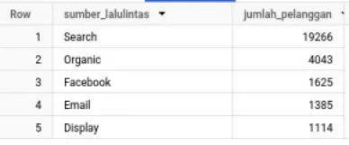
  <p style="font-size: 16px; color: #888; margin-top:-15px; text-align: center;"> Sumber Lalu Lintas Pelanggan Terpopuler</p>
</div>

## **Studi Kasus 2: Analisis Performa Brand (Terlaris, Return, Cancel)**

**Pertanyaan:** Brand mana yang paling laris terjual, paling sering dikembalikan (return), dan paling sering dibatalkan (cancel)?

**1. 5 Brand Terlaris Berdasarkan Jumlah Pengiriman Berhasil (`jumlah_complete`)**

Query berikut digunakan untuk mengidentifikasi brand terlaris berdasarkan jumlah item yang berhasil dikirim:


```SQL
SELECT
    barang.product_brand,
    COUNT(CASE WHEN pesanan.status = 'Cancelled' THEN 1 ELSE NULL END) AS jumlah_cancel,
    COUNT(CASE WHEN pesanan.status = 'Returned' THEN 1 ELSE NULL END) AS jumlah_return,
    COUNT(CASE WHEN pesanan.status = 'Complete' THEN 1 ELSE NULL END) AS jumlah_complete
FROM
    `bigquery-public-data.thelook_ecommerce.inventory_items` AS barang
LEFT JOIN
    `bigquery-public-data.thelook_ecommerce.order_items` AS pesanan
    ON pesanan.product_id = barang.product_id
WHERE
    pesanan.status IN ('Cancelled', 'Returned', 'Complete') -- Memfilter status yang relevan
GROUP BY
    barang.product_brand
ORDER BY
    jumlah_complete DESC
LIMIT 5; -- Menampilkan 5 teratas
```

<div class="single-image-source">
  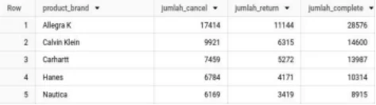
  <p style="font-size: 16px; color: #888; margin-top:-15px; text-align: center;"> Analisis Performa Brand (Terlaris, Return, Cancel)</p>
</div>

**2. 5 Brand dengan Tingkat Pengembalian Tertinggi (`jumlah_return`)**

Query ini mengidentifikasi brand dengan jumlah pengembalian barang tertinggi:

```SQL


SELECT
    barang.product_brand,
    COUNT(CASE WHEN pesanan.status = 'Cancelled' THEN 1 ELSE NULL END) AS jumlah_cancel,
    COUNT(CASE WHEN pesanan.status = 'Returned' THEN 1 ELSE NULL END) AS jumlah_return,
    COUNT(CASE WHEN pesanan.status = 'Complete' THEN 1 ELSE NULL END) AS jumlah_complete
FROM
    `bigquery-public-data.thelook_ecommerce.inventory_items` AS barang
LEFT JOIN
    `bigquery-public-data.thelook_ecommerce.order_items` AS pesanan
    ON pesanan.product_id = barang.product_id
WHERE
    pesanan.status IN ('Cancelled', 'Returned', 'Complete') -- Memfilter status yang relevan
GROUP BY
    barang.product_brand
ORDER BY
    jumlah_return DESC
LIMIT 5; -- Menampilkan 5 teratas
```

<div class="single-image-source">
  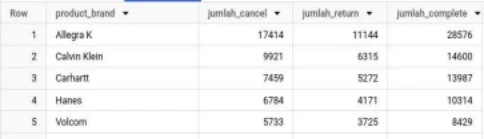
  <p style="font-size: 16px; color: #888; margin-top:-15px; text-align: center;">  Brand dengan Tingkat Pengembalian Tertinggi (`jumlah_return`)</p>
</div>

**Insight Utama:**

Menariknya, data menunjukkan bahwa beberapa brand yang paling laris (memiliki `jumlah_complete` tinggi) juga termasuk dalam daftar brand yang paling sering dikembalikan (`jumlah_return`). Hal ini perlu menjadi perhatian serius. Ulasan (review) dari konsumen yang melakukan pengembalian barang seringkali sangat berpengaruh terhadap keputusan pembelian calon konsumen lainnya.

Kita dapat berasumsi bahwa tingginya tingkat pengembalian bisa jadi berkaitan dengan kualitas produk, ekspektasi yang tidak terpenuhi, atau masalah lainnya yang kemudian memicu ulasan negatif. Ulasan negatif ini selanjutnya dapat mempengaruhi tingkat pembatalan (`jumlah_cancel`) pesanan untuk brand tersebut.

Sebagai contoh, mari kita lihat brand "Allegra K" (jika muncul dalam hasil Anda). Jika brand ini memiliki persentase pengembalian yang signifikan (misalnya 19,5%) dan persentase pembatalan yang tinggi (misalnya 30,4%), ini berarti potensi pendapatan yang hilang cukup besar. Hampir setengah dari potensi penjualan produk tersebut tidak terealisasi menjadi pendapatan bersih.

Oleh karena itu, sangat disarankan bagi perusahaan untuk melakukan **analisis sentimen** terhadap ulasan pelanggan, terutama untuk brand-brand dengan tingkat pengembalian dan pembatalan yang tinggi. Tujuannya adalah untuk mengidentifikasi akar masalah yang menyebabkan pelanggan mengembalikan atau membatalkan produk, sehingga perbaikan dapat dilakukan, baik pada produk itu sendiri maupun pada cara pemasarannya.

---

## **Studi Kasus 3: Kelompok Usia Pembeli Terbanyak**

**Pertanyaan:** Kelompok usia mana yang paling banyak melakukan pembelian?

Untuk menjawab ini, data usia pengguna dikelompokkan ke dalam kategori berikut:

- **Anak-anak:** Usia &lt; 13 tahun
- **Remaja:** Usia 13 - 18 tahun (disesuaikan dari 19 agar tidak overlap)
- **Dewasa Muda:** Usia 19 - 35 tahun
- **Orang Tua:** Usia 36 - 50 tahun (disesuaikan dari 35 agar tidak overlap)
- **Lansia:** Usia > 50 tahun

Berikut query SQL yang digunakan:

```SQL

SELECT
    CASE
        WHEN pengguna.age < 13 THEN 'Anak-anak'
        WHEN pengguna.age BETWEEN 13 AND 18 THEN 'Remaja'
        WHEN pengguna.age BETWEEN 19 AND 35 THEN 'Dewasa Muda'
        WHEN pengguna.age BETWEEN 36 AND 50 THEN 'Orang Tua'
        WHEN pengguna.age > 50 THEN 'Lansia'
        ELSE 'Tidak Diketahui' -- Menangani jika ada data usia null/tidak valid
    END AS kelompok_umur,
    COUNT(DISTINCT barang.user_id) AS total_customer
FROM
    `bigquery-public-data.thelook_ecommerce.order_items` AS barang
INNER JOIN
    `bigquery-public-data.thelook_ecommerce.users` AS pengguna
    ON barang.user_id = pengguna.id
WHERE
    barang.status = 'Complete' -- Fokus pada pembeli yang menyelesaikan transaksi
GROUP BY
    kelompok_umur
ORDER BY
    total_customer DESC;
```

<div class="single-image-source">
  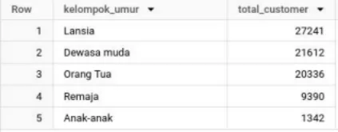
  <p style="font-size: 16px; color: #888; margin-top:-15px; text-align: center;">  Kelompok Usia Pembeli Terbanyak</p>
</div>

**Hasil Analisis:**

Hasil query (yang akan ditampilkan pada `gambar`) kemungkinan besar akan menunjukkan bahwa mayoritas pembeli berasal dari kelompok usia **Lansia, Dewasa Muda,** dan **Orang Tua**. Ini memberikan indikasi kuat bahwa strategi pemasaran, promosi, dan mungkin juga pemilihan produk sebaiknya lebih difokuskan untuk menarik minat demografi usia ini.

---

## **Studi Kasus 4: Analisis Pembelian Berdasarkan Gender (Jumlah Barang & Pendapatan)**

**Pertanyaan:** Bagaimana perbandingan jumlah barang yang dibeli dan total pendapatan antara pelanggan pria dan wanita?

Query SQL berikut digunakan untuk menganalisis data ini:


```SQL

SELECT
    CASE
        WHEN pesanan.gender = 'M' THEN 'Pria'
        WHEN pesanan.gender = 'F' THEN 'Wanita'
        ELSE pesanan.gender -- Menangani nilai lain jika ada
    END AS gender,
    ROUND(SUM(barang.sale_price), 2) AS total_pendapatan, -- Menggunakan sale_price dari order_items
    COUNT(barang.id) AS jumlah_item_terjual -- Menghitung jumlah baris/item di order_items
FROM
    `bigquery-public-data.thelook_ecommerce.order_items` AS barang
INNER JOIN
    `bigquery-public-data.thelook_ecommerce.users` AS pengguna -- Bergabung dengan users untuk gender
    ON barang.user_id = pengguna.id
WHERE
    barang.status = 'Complete' -- Hanya transaksi yang selesai
GROUP BY
    gender
ORDER BY
    total_pendapatan DESC;
```

<div class="single-image-source">
  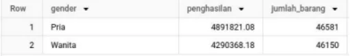
  <p style="font-size: 16px; color: #888; margin-top:-15px; text-align: center;"> Analisis Pembelian Berdasarkan Gender (Jumlah Barang & Pendapatan)</p>
</div>

**Hasil Analisis:**

Data kemungkinan akan menunjukkan bahwa **pendapatan terbesar berasal dari pembeli pria**. Meskipun demikian, **jumlah barang** yang dibeli antara pria dan wanita bisa jadi tidak berbeda terlalu jauh. Ini bisa mengindikasikan bahwa pria cenderung membeli barang dengan harga rata-rata yang lebih tinggi, atau melakukan transaksi dengan nilai total yang lebih besar per pesanan.

---

## **Studi Kasus 5: Tren Pendapatan Bulanan**

**Pertanyaan:** Bagaimana tren pendapatan kotor (gross revenue) dari bulan ke bulan?

Query berikut menghitung total pendapatan per bulan dari pesanan yang tidak dibatalkan atau dikembalikan:

```SQL


SELECT
    EXTRACT(YEAR FROM barang.created_at) AS Tahun, -- Tambahkan tahun untuk kejelasan
    EXTRACT(MONTH FROM barang.created_at) AS Bulan,
    ROUND(SUM(barang.sale_price), 2) AS penghasilan -- Asumsi sale_price adalah harga jual per item
FROM
    `bigquery-public-data.thelook_ecommerce.order_items` AS barang
WHERE
    barang.status NOT IN ('Cancelled', 'Returned') -- Hanya status yang menghasilkan pendapatan
GROUP BY
    Tahun, Bulan
ORDER BY
    Tahun ASC, Bulan ASC;
```
<div class="single-image-source">
  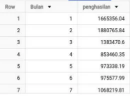
  <p style="font-size: 16px; color: #888; margin-top:-15px; text-align: center;"> Tren Pendapatan Bulanan</p>
</div>

<div class="single-image-source">
  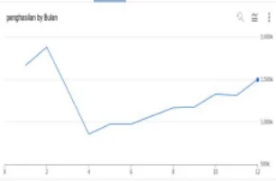
  <p style="font-size: 16px; color: #888; margin-top:-15px; text-align: center;"> Tren Pendapatan Bulanan</p>
</div>

**Hasil Analisis:**

Analisis data (dan visualisasi grafik yang menyertainya) akan menunjukkan fluktuasi pendapatan bulanan. Berdasarkan deskripsi Anda, tampaknya terjadi **penurunan pendapatan** pada bulan ke-3 dan ke-4 dalam periode data yang dianalisis. Namun, tren **positif (peningkatan pendapatan)** terlihat mulai dari bulan ke-5 dan berlanjut pada bulan-bulan berikutnya. Menganalisis penyebab fluktuasi ini (misalnya, musiman, campaign pemasaran, atau faktor eksternal) bisa menjadi langkah selanjutnya.

---

## **Studi Kasus 6: Distribusi Pelanggan Berdasarkan Negara**

**Pertanyaan:** Dari negara mana saja mayoritas pelanggan berasal?

Query ini menghitung jumlah pelanggan unik per negara:

```SQL
SELECT
    country,
    COUNT(DISTINCT id) as jumlah_customer
FROM
    `bigquery-public-data.thelook_ecommerce.users`
GROUP BY
    country
ORDER BY
    jumlah_customer DESC
LIMIT 10; -- Menampilkan 10 negara teratas
```

<div class="single-image-source">
  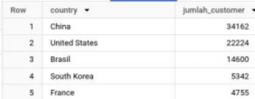
  <p style="font-size: 16px; color: #888; margin-top:-15px; text-align: center;"> Distribusi Pelanggan Berdasarkan Negara</p>
</div>

**Hasil Analisis:**

Seperti yang Anda sebutkan, hasil query kemungkinan besar akan menunjukkan bahwa konsentrasi pelanggan terbesar berasal dari **China**, diikuti oleh **Amerika Serikat** dan **Brazil**. Informasi ini krusial untuk strategi pemasaran internasional, logistik, dan penyesuaian layanan pelanggan.

---

## **Studi Kasus 7: Kategori Produk Paling Banyak Dibeli (Berdasarkan Pendapatan)**

**Pertanyaan:** Kategori produk apa yang menghasilkan pendapatan paling tinggi dan paling banyak dibeli?

Query berikut mengagregasi pendapatan dan jumlah barang terjual per kategori produk:

```SQL
SELECT
    produk.category AS kategori_produk,
    ROUND(SUM(barang.sale_price), 2) AS penghasilan, -- Asumsi sale_price adalah total harga item
    COUNT(barang.id) AS jumlah_item_terjual -- Jumlah baris/item terjual
FROM
    `bigquery-public-data.thelook_ecommerce.order_items` barang
INNER JOIN
    `bigquery-public-data.thelook_ecommerce.products` produk
    ON barang.product_id = produk.id
WHERE
    barang.status NOT IN ('Cancelled', 'Returned') -- Fokus pada penjualan sukses
GROUP BY
    kategori_produk
ORDER BY
    penghasilan DESC; -- Urutkan berdasarkan pendapatan tertinggi
```

<div class="single-image-source">
  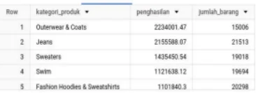
  <p style="font-size: 16px; color: #888; margin-top:-15px; text-align: center;"> Kategori Produk Paling Banyak Dibeli (Berdasarkan Pendapatan)</p>
</div>


**Hasil Analisis:**

Berdasarkan analisis Anda, tiga kategori produk yang paling menguntungkan dan/atau paling laris adalah **Outerwear & Coats, Jeans,** serta **Sweaters**. Fokus pada inventaris dan promosi untuk kategori-kategori ini dapat menjadi prioritas.

---

## **Studi Kasus 8: Pengguna dengan Rata-Rata Pembelian Tertinggi**

**Pertanyaan:** Siapa saja pengguna (pelanggan) yang memiliki nilai rata-rata pembelian per item tertinggi?

Query ini mengidentifikasi 10 pengguna teratas berdasarkan rata-rata `sale_price` dari item yang mereka beli:

```SQL

SELECT
    pengguna.id AS id_pengguna,
    pengguna.email AS email,
    pengguna.first_name,
    pengguna.last_name,
    ROUND(AVG(barang.sale_price), 2) AS ratarata_harga_item_dibeli
FROM
    `bigquery-public-data.thelook_ecommerce.users` AS pengguna
JOIN
    `bigquery-public-data.thelook_ecommerce.order_items` AS barang
    ON pengguna.id = barang.user_id
WHERE
    barang.status = 'Complete' -- Hanya dari pembelian yang selesai
GROUP BY
    id_pengguna, email, pengguna.first_name, pengguna.last_name
ORDER BY
    ratarata_harga_item_dibeli DESC
LIMIT 10;
```

<div class="single-image-source">
  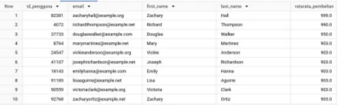
  <p style="font-size: 16px; color: #888; margin-top:-15px; text-align: center;"> Pengguna dengan Rata-Rata Pembelian Tertinggi</p>
</div>

**Hasil Analisis:**

Tabel hasil query ini akan menampilkan 10 pelanggan teratas yang cenderung membeli produk dengan harga rata-rata lebih tinggi per itemnya. Mereka bisa dianggap sebagai segmen pelanggan bernilai tinggi (High-Value Customers) dari sisi preferensi harga produk.

---

## **Studi Kasus 9: Kategori Barang Paling Sering Dibatalkan dan Dikembalikan**

**Pertanyaan:** Kategori produk apa saja yang paling sering mengalami pembatalan (cancel) dan pengembalian (return)?

Query ini menghitung jumlah item yang dibatalkan, dikembalikan, dan berhasil terkirim untuk setiap kategori:

```SQL

SELECT
    produk.category AS Kategori,
    COUNT(CASE WHEN barang.status = 'Cancelled' THEN 1 ELSE null END) AS Dibatalkan,
    COUNT(CASE WHEN barang.status = 'Returned' THEN 1 ELSE null END) AS Dikembalikan,
    COUNT(CASE WHEN barang.status = 'Complete' THEN 1 ELSE null END) AS Berhasil
FROM
    `bigquery-public-data.thelook_ecommerce.order_items` barang
INNER JOIN
    `bigquery-public-data.thelook_ecommerce.products` produk
    ON barang.product_id = produk.id
GROUP BY
    Kategori
ORDER BY
    Dikembalikan DESC; -- Urutkan berdasarkan jumlah pengembalian tertinggi
```
<div class="single-image-source">
  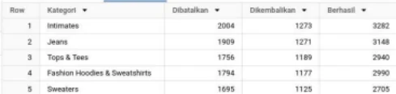
  <p style="font-size: 16px; color: #888; margin-top:-15px; text-align: center;"> Kategori Barang Paling Sering Dibatalkan dan Dikembalikan</p>
</div>

**Hasil Analisis:**

Sesuai temuan Anda, kategori produk yang paling sering mengalami **pengembalian (Returned)** adalah **Intimates, Jeans,** serta **Tops & Tees**. Data jumlah **pembatalan (Cancelled)** per kategori juga penting untuk diperhatikan dari hasil query ini, karena bisa menunjukkan masalah yang berbeda (misalnya, masalah stok, proses checkout, atau keraguan pembeli). Menganalisis alasan di balik tingginya return/cancel pada kategori ini sangat penting.

---

## **Studi Kasus 10: Produk Spesifik yang Paling Sering Dibeli**

**Pertanyaan:** Produk spesifik (berdasarkan ID atau nama) mana saja yang paling laku atau paling sering muncul dalam pesanan?

Query berikut menampilkan 10 produk individual yang paling sering dibeli:

```SQL

SELECT
    barang.product_id AS Id_produk,
    produk.name AS Nama_produk,
    produk.category AS Kategori_produk,
    COUNT(barang.id) AS Jumlah_dibeli -- Menghitung berapa kali item ini muncul di pesanan
FROM
    `bigquery-public-data.thelook_ecommerce.products` AS produk
JOIN
    `bigquery-public-data.thelook_ecommerce.order_items` AS barang
    ON produk.id = barang.product_id
WHERE
    barang.status NOT IN ('Cancelled', 'Returned') -- Hanya hitung yang terjual
GROUP BY
    Id_produk, Nama_produk, Kategori_produk
ORDER BY
    Jumlah_dibeli DESC
LIMIT 10;
```

<div class="single-image-source">
  
  <p style="font-size: 16px; color: #888; margin-top:-15px; text-align: center;"> Produk Spesifik yang Paling Sering Dibeli</p>
</div>

**Hasil Analisis:**

Tabel ini menyajikan 10 produk spesifik yang paling populer di kalangan pelanggan. Informasi ini sangat berguna untuk manajemen inventaris (memastikan stok cukup), strategi penempatan produk di website/aplikasi, dan potensi untuk dijadikan produk unggulan dalam promosi.