+++
title = "Studi Kasus: Analisis Sentimen Publik Terhadap Animasi 'Jumbo' Menggunakan Python"
date = 2025-04-22T21:37:16+07:00
draft = false
description = ""
image = "1.webp"
imageBig= "1.webp"
categories= ["Analysis and Visualization"]
tags= ["Sentimen Analysis"]
avatar="/images/profil.jpeg"
+++

Animasi "Jumbo" telah menjadi sebuah fenomena budaya di Indonesia. Serial yang mengangkat kearifan lokal ini berhasil mencetak rekor penonton dan menjadi tonggak penting bagi industri animasi nasional, membuktikan kemampuannya bersaing di kancah global.

# Kontroversi di Balik Popularitas


Di tengah kesuksesannya, muncul diskursus publik yang luas, salah satunya dipicu oleh unggahan Wakil Presiden Gibran Rakabuming Raka yang mengapresiasi "Jumbo" sebagai penanda era baru animasi Indonesia. Unggahan ini menuai respons yang sangat beragam dari netizen, mulai dari dukungan hingga kritik tajam yang menganggap pernyataan tersebut berlebihan. Perbincangan yang terpolarisasi inilah yang menjadikan "Jumbo" sebagai studi kasus yang ideal untuk dianalisis menggunakan pendekatan *data science*.

Tujuan analisis ini adalah untuk membedah spektrum opini publik secara objektif, memahami sentimen yang dominan, dan mengidentifikasi tema-tema utama dalam perbincangan tersebut.


## Metodologi Analisis Sentimen

Untuk studi kasus ini, kami menganalisis sampel 1.000 komentar dari Twitter yang dikumpulkan sejak hari pertama penayangan film, 31 Maret 2025. Dataset mentah dapat diakses melalui tautan berikut: [Jumbo Dataset](https://github.com/DaddyAnanta/Data/blob/main/Jumbo-sentimen-analysis/serial_jumbo.csv).

Proses analisis dibagi menjadi beberapa tahap utama, mulai dari persiapan lingkungan, pra-pemrosesan teks, hingga analisis sentimen menggunakan model *machine learning* dan visualisasi hasilnya.


### Langkah 1: Persiapan Lingkungan Kerja

Tahap awal adalah mengimpor semua *library* Python yang dibutuhkan untuk manipulasi data (Pandas), pemrosesan bahasa alami (NLTK, Sastrawi), analisis sentimen (Hugging Face Transformers), dan visualisasi (Matplotlib, WordCloud).

``` Python
import pandas as pd
import numpy as np
import matplotlib.pyplot as plt
import re
import Sastrawi
from Sastrawi.StopWordRemover.StopWordRemoverFactory import StopWordRemoverFactory, StopWordRemover, ArrayDictionary
from transformers import AutoTokenizer, AutoModelForSequenceClassification, pipeline
import torch
from wordcloud import WordCloud, STOPWORDS
from nltk.util import bigrams
from nltk.corpus import stopwords
from collections import Counter
import nltk
from nltk.util import trigrams 
from nltk.corpus import stopwords
from collections import Counter


nltk.download('stopwords')
nltk.download('punkt_tab')
nltk.download('punkt')
``` 

## Langkah 2: Pemuatan dan Pra-pemrosesan Teks

Data mentah dari media sosial berisi banyak sekali "noise" yang dapat mengganggu analisis. Oleh karena itu, serangkaian langkah pembersihan dan standardisasi teks wajib dilakukan.

### Memuat Data Komentar

Data komentar mentah dimuat dari file CSV ke dalam DataFrame Pandas.


``` Python
df = pd.read_csv('serial_jumbo.csv')
df.head()
```

<div class="single-image-source"> 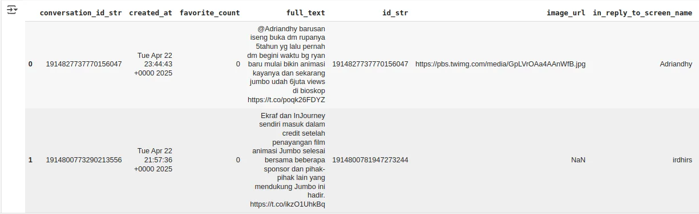 </div>

### Memilih Kolom Teks dan Merapikan Indeks

Untuk fokus pada konten komentar, kita hanya akan menggunakan kolom `full_text` dan mereset indeks DataFrame agar standar.


``` Python
df1 = df.copy()
df1 = df1["full_text"].reset_index()
```

### Pembersihan Teks Tahap 1: Regex

Fungsi _Regular Expression_ (Regex) diterapkan untuk membersihkan teks dari elemen-elemen yang tidak relevan untuk analisis sentimen, seperti _username_, _hashtag_, URL, dan karakter non-alfanumerik.

``` Python
def clean_text(text):
    text = re.sub(r'@[A-Za-z0-9]+', '', text)
    text = re.sub(r'#\w+', '', text)
    text = re.sub(r'RT[\s]+', '', text)
    text = re.sub(r'https?://\S+', '', text)
    text = re.sub(r'[^A-Za-z0-9 ]', '', text)
    text = re.sub(r'\s+', ' ', text).strip()
    return text
df1['text_clean'] = df1["full_text"].apply(clean_text)
df1
```

<div class="single-image-source"> 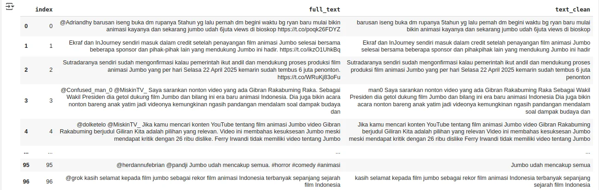 </div>

### Pembersihan Teks Tahap 2: Konversi ke Huruf Kecil

Untuk menyeragamkan korpus, semua teks diubah menjadi huruf kecil (_lowercase_).

``` Python
df1["text_clean"] = df1["text_clean"].str.lower()
df1.head()
```

<div class="single-image-source"> 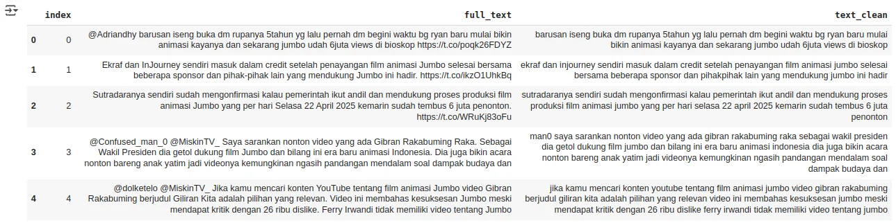 </div>

### Pembersihan Teks Tahap 3: Penghapusan Stopword (Sastrawi)

Kata-kata umum tanpa makna sentimen (_stopwords_) seperti 'yang', 'di', 'dari', akan dihapus menggunakan _library_ **Sastrawi**, yang dirancang khusus untuk Bahasa Indonesia.

``` Python
import Sastrawi
from Sastrawi.StopWordRemover.StopWordRemoverFactory import StopWordRemoverFactory, StopWordRemover, ArrayDictionary

stop_words = StopWordRemoverFactory().get_stop_words()
new_array = ArrayDictionary(stop_words)
stop_words_remover_new = StopWordRemover(new_array)

def stopword(str_text):
    str_text = stop_words_remover_new.remove(str_text)
    return str_text

df1["text_clean"] = df1["text_clean"].apply(lambda x: stopword(x))
df1.head()
```

<div class="single-image-source"> 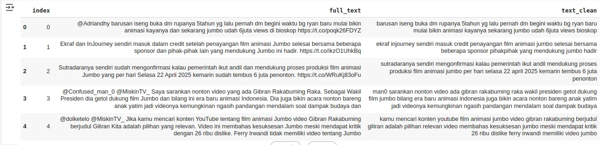 </div>

### Checkpoint 1: Simpan Hasil Pembersihan Awal

Progres pembersihan disimpan ke file CSV baru untuk menghindari pengulangan proses jika terjadi interupsi.

``` Python
df1.to_csv("abbriviation.csv")
```

### Normalisasi Teks: Penggantian Singkatan/Slang

Komentar di Twitter sering kali menggunakan bahasa tidak baku. Sebuah kamus normalisasi dibuat untuk mengubah singkatan dan slang ke bentuk standarnya.

``` Python
# clear coloumn
pd.set_option('display.max_colwidth', None)

df2 = df1.copy()

abbreviation_dict = {
    "yg": "yang", "tdk": "tidak", "gk": "nggak", "ga": "nggak", "dlm": "dalam", "sdh": "sudah", "blm": "belum", "tp": "tapi", "krn": "karena",
    "dr": "dari", "utk": "untuk", "dgn": "dengan", "aja": "saja", "gokillll": "gokil", "gak": "tidak", "bgt": "banget", "anak2nya": "anak anaknya",
    "bg": "bang", "inj": "in journey", "getol": "berusaha keras", "emak2": "emak-emak", "tgk": "tengok", "ni": "ini", "dooo": "dong", "kyknya": "kayaknya",
    "knp": "kenapa", "jd": "jadi", "q1": "kuartal 1", "q2": "kuartal 2", "btw": "by the way", "soksokan": "sok-sokan", "pke": "pakai", "nobar": "nonton bareng",
    "ttg": "tentang", "fomo": "fear of missing out", "pansos": "pencitraan sosial", "id": "indonesia", "ri": "republik indonesia", "gt": "gitu", "apaa": "apa",
    "sma": "sama", "bhkn": "bahkan", "nntn": "nonton", "bsok": "besok", "moga": "semoga", "jg": "juga", "sblm": "sebelum", "mengagung2kan": "mengagung agungkan",
    "bener2": "benar benar", "samaaaaa": "sama", "tntg": "tentang", "ny": "nya", "tiba2": "tiba tiba", "gw": "saya", "aku": "saya", "rp": "rupiah",
    "jadi": "menjadi", "raup": "meraih", "horor2nya": "horor horornya", "trsss": "terus", "cuihhhhhhhh": "cuih", "film2": "film film", "dompet10": "dompet",
    "lg": "lagi", "masingmasing": "masing masing", "bgtttt": "banget", "gada": "tidak ada", "gapapa": "nggak apa-apa", "kalo": "kalau", "dapet": "dapat",
    "acuh": "cuek", "misuh2": "misuh-misuh", "bagusss": "bagus", "au": "tidak tahu", "lho": "loh", "ampe": "sampai", "udh": "udah", "ngmg": "ngomong",
    "bgtt": "banget", "janji2an": "janji janjian", "kelar2": "kelar kelar", "amp": "sampai", "kenapaaaaaaaaa": "kenapa", "bangettt": "banget", "anak2": "anak anak",
    "ttp": "tetap", "emg": "memang", "anakanak": "anak anak", "baca2": "baca baca", "novel2": "novel novel", "gara2": "gara gara", "gituu": "gitu", "srg": "sering",
    "aelah": "alah", "lakilaki": "laki laki", "bro": "bang", "teruuuusssssss": "terus", "se": "sangat", "coy": "cuy", "bgs": "bagus", "gaada": "tidak ada",
    "bkn": "bukan", "buzzerbuzzer": "buzzer buzzer", "fenomena2": "fenomena fenomena", "gembor2": "gembar-gembor", "nimbrung": "ikut campur", "nggak": "tidak",
    "blokk": "blok", "plssss": "please", "pliss": "please", "bukn": "bukan", "wapres": "wakil presiden", "cmn": "hanya", "tpi": "tapi", "b ajaa": "biasa aja",
    "bejir": "astaga", "masing2": "masing masing", "ofj": "oke fine juga", "wamen": "wakil menteri", "wamenekraf": "wakil menteri ekonomi kreatif", "bs": "bisa",
    "gpp": "nggak apa-apa", "ig": "Instagram", "filmanimasi": "film animasi", "memng": "memang", "syg": "sayang", "gtu": "gitu", "byk": "banyak", "cth": "contoh",
    "sia2": "sia sia", "berkalikali": "berkalikali", "berkali kali": "berkalikali", "Bcs": "Because", "sy": "saya", "sok-sokan": "soksokan", "kl": "jika"
}

def replace_abbreviations(text):
    words = text.split()
    words = [abbreviation_dict[word] if word in abbreviation_dict else word for word in words]
    return ' '.join(words)

df2['text_clean_abbr'] = df2['text_clean'].apply(replace_abbreviations)
df2['text_clean_abbr']
```

<div class="single-image-source"> 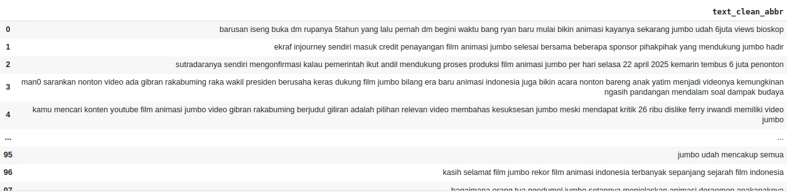 </div>

### Tokenisasi Teks

_Tokenisasi_ adalah proses memecah kalimat menjadi unit-unit kata individual (token), sebagai langkah persiapan sebelum _stemming_.

``` Python
tokenized = df2["text_clean"].apply(lambda x:x.split())
tokenized
```

<div class="single-image-source"> 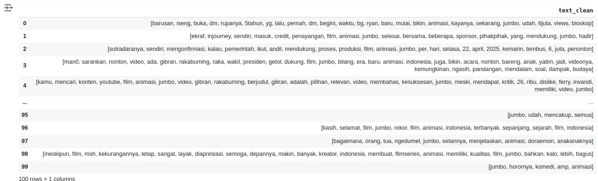 </div>

### Stemming Teks (Sastrawi)

_Stemming_ adalah proses mengubah kata berimbuhan ke kata dasarnya (misal: 'menganalisis' menjadi 'analisis'). Proses ini membantu model mengenali inti makna dari berbagai variasi kata.

``` Python
from Sastrawi.Stemmer.StemmerFactory import StemmerFactory

def stemming(text_cleaning):
    factory = StemmerFactory()
    stemmer = factory.create_stemmer()
    do = []
    for w in text_cleaning:
        dt = stemmer.stem(w)
        do.append(dt)
    d_clean = []
    d_clean = " ".join(do)
    return d_clean

tokenized = tokenized.apply(stemming)
```

### Checkpoint 2: Simpan Hasil Stemming

Hasil setelah _stemming_ disimpan untuk menjadi input tahap translasi dan analisis sentimen.

``` Python
tokenized.to_csv("Data Animasi Jumbo/tokenized.csv",index=False)
```

### Memuat Data Hasil Stemming

Memuat kembali data yang sudah bersih dan siap untuk diterjemahkan.

``` Python
data = pd.read_csv("Data Animasi Jumbo/tokenized.csv")
data.head()
```

<div class="single-image-source"> 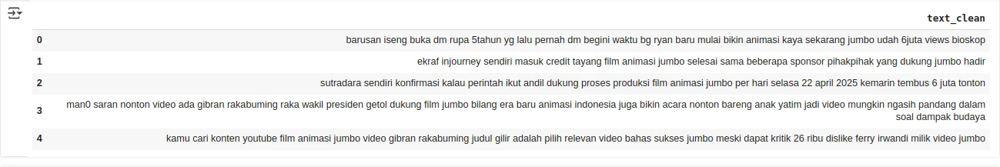 </div>

## Langkah 3: Analisis Sentimen dengan Model Transformer

Untuk akurasi yang tinggi, kami menggunakan model _transformer_ canggih **`cardiffnlp/twitter-roberta-base-sentiment`**. Model ini dilatih secara spesifik pada data Twitter, sehingga mampu memahami konteks dan nuansa bahasa media sosial dengan lebih baik.

### Translasi Teks ke Bahasa Inggris

Karena model ini beroperasi optimal pada Bahasa Inggris, teks yang telah dibersihkan diterjemahkan terlebih dahulu menggunakan `googletrans`.

``` Python
from googletrans import Translator

def translate_with_googletrans(tweet):
    if not isinstance(tweet, str) or not tweet.strip():
        return None

    translator = Translator()
    try:
        translation_result = translator.translate(tweet, src='id', dest='en')
        return translation_result.text
    except Exception as e:
        print(f"Error translating: {str(tweet)[:50]}... - Error: {e}")
        return None

if "text_clean" in data.columns:
    data["tweet_english"] = data["text_clean"].apply(translate_with_googletrans)
else:
    print("Error: Kolom 'text_clean' tidak ditemukan di DataFrame.")
```

### Checkpoint 3: Simpan Hasil Translasi

Data yang sudah diterjemahkan disimpan sebelum proses analisis sentimen.

``` Python
data.to_csv("translate.csv")
```

### Memuat Data Hasil Translasi

Memuat data final yang siap untuk dianalisis.

``` Python
data = pd.read_csv("translate.csv")
data.tail()
```

<div class="single-image-source"> 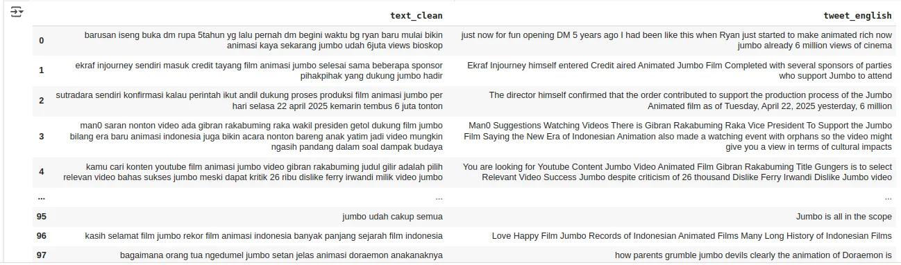 </div>

``` Python
data.to_csv("translate.csv")
```

### Klasifikasi Sentimen Menggunakan Model RoBERTa

Teks yang sudah diterjemahkan dimasukkan ke dalam _pipeline_ analisis sentimen dari Hugging Face Transformers untuk diklasifikasikan menjadi Positif, Negatif, atau Netral.

``` Python
# Load model dan tokenizer dari CardiffNLP
model_name = "cardiffnlp/twitter-roberta-base-sentiment"
tokenizer = AutoTokenizer.from_pretrained(model_name)
model = AutoModelForSequenceClassification.from_pretrained(model_name)

# Buat pipeline sentiment
sentiment_pipeline = pipeline("sentiment-analysis", model=model, tokenizer=tokenizer, return_all_scores=False)

# Lakukan analisis sentimen
results = sentiment_pipeline(data["tweet_english"].tolist())
data["sentiment"] = [r['label'] for r in results]

# Tampilkan data
data
```

<div class="single-image-source"> 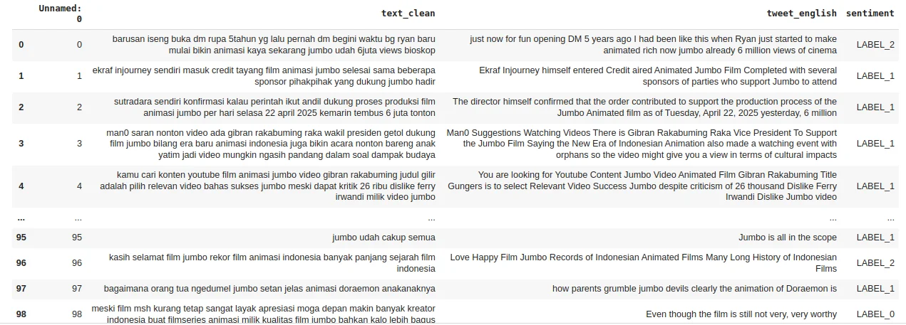 </div>

Hasil label dari model (`LABEL_0`, `LABEL_1`, `LABEL_2`) dipetakan ke kategori yang lebih mudah dipahami.

``` Python
label_map = {
    "LABEL_0": "Negative",
    "LABEL_1": "Neutral",
    "LABEL_2": "Positive"
}
data["sentiment"] = [label_map[r['label']] for r in results]
data.sentiment.value_counts()
```

<div class="single-image-source"> 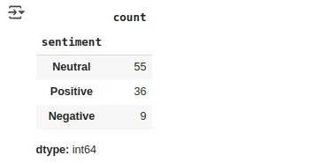 </div>

### Memfilter Data Berdasarkan Sentimen

Untuk analisis yang lebih spesifik, kita bisa memisahkan data berdasarkan kategori sentimennya.

``` Python
data_positif = data[data["sentiment"] == "Positive"]
data_negatif = data[data["sentiment"] == "Negative"]
```

## Langkah 4: Visualisasi dan Interpretasi Hasil

Untuk memahami temuan secara visual, kami membuat _word cloud_ dan analisis n-gram (bigram dan trigram).

### Word Cloud Keseluruhan

Visualisasi ini menunjukkan kata-kata yang paling sering muncul di seluruh dataset, memberikan gambaran umum topik perbincangan.

``` Python
# Fungsi untuk menampilkan word cloud
def plot_cloud(wordcloud):
    plt.figure(figsize=(10, 8)) 
    plt.imshow(wordcloud, interpolation='bilinear') 
    plt.axis('off')
    plt.show() 

all_words = ' '.join([tweets for tweets in data['tweet_english']])

# Membuat objek WordCloud dengan konfigurasi tertentu
wordcloud = WordCloud(
    width=3000,
    height=2000,
    random_state=3,
    background_color='black',
    colormap='Blues_r',
    collocations=False,
    stopwords=STOPWORDS
).generate(all_words)

plot_cloud(wordcloud)
```

<div class="single-image-source"> 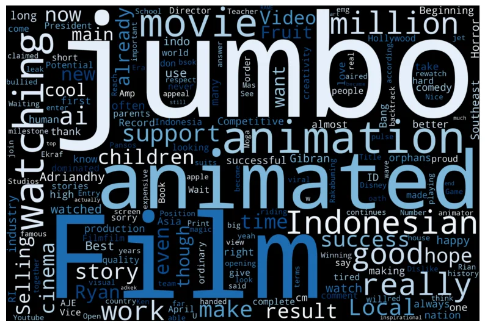 </div>

### Analisis Bigram (Frasa 2 Kata)

Analisis bigram membantu mengidentifikasi pasangan kata yang paling sering digunakan, memberikan konteks yang lebih kaya daripada kata tunggal.

``` Python
nltk.download('stopwords')
nltk.download('punkt_tab')

def plot_cloud(wordcloud):
    plt.figure(figsize=(10, 8))
    plt.imshow(wordcloud, interpolation='bilinear')
    plt.axis('off')
    plt.show()

language = 'indonesian' # Ganti jika teks dalam bahasa lain, misal 'english'
try:
    stop_words = set(stopwords.words(language))
except IOError:
    stop_words = set()

all_tokens_filtered = []

# Asumsi: 'data' adalah DataFrame dan 'text_clean' kolom teksnya
for text in data['tweet_english']:
    if isinstance(text, str):
        tokens = nltk.word_tokenize(text.lower())
        filtered = [word for word in tokens if word.isalnum() and word not in stop_words and len(word) > 1]
        all_tokens_filtered.extend(filtered)

if len(all_tokens_filtered) > 1:
    bigram_list = list(bigrams(all_tokens_filtered))
    formatted_bigrams = [" ".join(bigram) for bigram in bigram_list]
    bigram_counts = Counter(formatted_bigrams)

    wordcloud = WordCloud(
        width=3000,
        height=2000,
        random_state=3,
        background_color='black',
        colormap='Blues_r'
    )

    if bigram_counts:
        wordcloud.generate_from_frequencies(bigram_counts)
        plot_cloud(wordcloud)
```

<div class="single-image-source"> 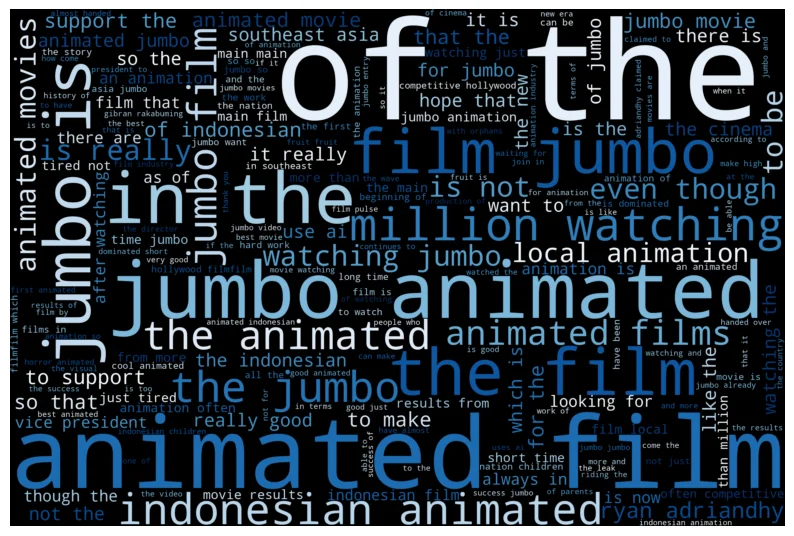 </div>

Untuk melihat frekuensi secara eksplisit, dibuat visualisasi bar chart untuk 20 bigram teratas.

``` Python
if 'bigram_counts' in locals() and bigram_counts:
    N = 20
    top_bigrams = bigram_counts.most_common(N)

    if top_bigrams:
        labels = [item[0] for item in top_bigrams]
        counts = [item[1] for item in top_bigrams]

        labels.reverse()
        counts.reverse()

        plt.figure(figsize=(12, 8))
        plt.barh(labels, counts, color='steelblue')

        plt.title(f'Top {N} Bigram Paling Sering Muncul')
        plt.xlabel('Frekuensi')
        plt.ylabel('Bigram')

        for index, value in enumerate(counts):
            plt.text(value, index, str(value))

        plt.tight_layout()
        plt.show()
```

<div class="single-image-source"> 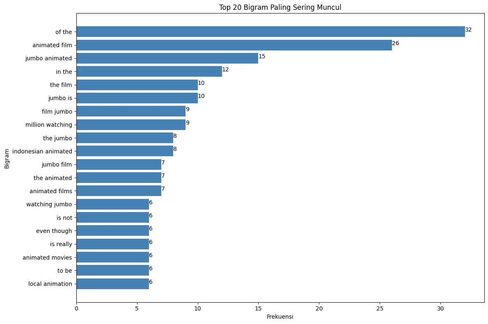 </div>

### Analisis Trigram (Frasa 3 Kata)

Analisis diperluas dengan melihat trigram untuk menangkap konteks atau frasa yang lebih panjang.

``` Python
def plot_cloud(wordcloud):
    plt.figure(figsize=(10, 8))
    plt.imshow(wordcloud, interpolation='bilinear')
    plt.axis('off')
    plt.show()

# --- Perhitungan Trigram ---
language = 'indonesian' # Sesuaikan jika perlu
try:
    stop_words = set(stopwords.words(language))
except IOError:
    stop_words = set()

all_tokens_filtered = []
# Asumsi 'data' adalah DataFrame dan 'text_clean' adalah kolom teks
for text in data['tweet_english']:
    if isinstance(text, str):
        tokens = nltk.word_tokenize(text.lower())
        filtered = [word for word in tokens if word.isalnum() and word not in stop_words and len(word) > 1]
        all_tokens_filtered.extend(filtered)

trigram_counts = Counter() 
if len(all_tokens_filtered) > 2:
    trigram_list = list(trigrams(all_tokens_filtered)) 
    formatted_trigrams = [" ".join(trigram) for trigram in trigram_list]
    trigram_counts = Counter(formatted_trigrams) 

# --- Word Cloud dari Trigram ---
if trigram_counts:
    wordcloud = WordCloud(
        width=3000,
        height=2000,
        random_state=3,
        background_color='black',
        colormap='plasma' 
    )
    wordcloud.generate_from_frequencies(trigram_counts)
    plot_cloud(wordcloud)

if trigram_counts:
    N = 20 
    top_trigrams = trigram_counts.most_common(N)

    if top_trigrams:
        labels = [item[0] for item in top_trigrams]
        counts = [item[1] for item in top_trigrams]

        labels.reverse()
        counts.reverse()

        plt.figure(figsize=(12, 10)) 
        plt.barh(labels, counts, color='indigo') 

        plt.title(f'Top {N} Trigram Paling Sering Muncul') 
        plt.xlabel('Frekuensi')
        plt.ylabel('Trigram') 

        for index, value in enumerate(counts):
            plt.text(value, index, str(value))

        plt.tight_layout()
        plt.show()
```

<div class="single-image-source"> 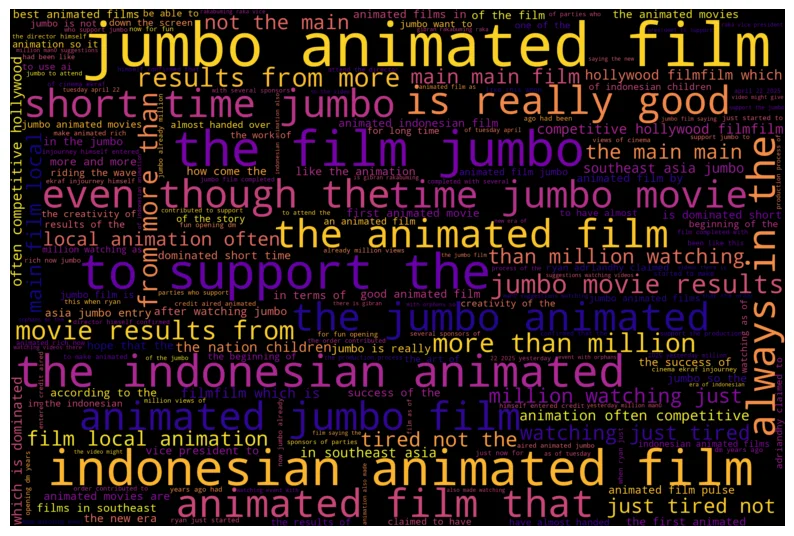 </div>

## Kesimpulan dan Arah Pengembangan

Analisis sentimen terhadap 1.000 komentar Twitter menunjukkan respons publik yang secara umum bersifat positif dan informatif. Berdasarkan hasil klasifikasi model, sentimen didominasi oleh netral (55%) dan diikuti oleh positif (36%). Sentimen negatif hanya merupakan sebagian kecil dari keseluruhan percakapan (9%), mengindikasikan bahwa narasi kritis tidak menjadi arus utama dalam sampel data ini.

Dominasi sentimen netral, yang didukung oleh kemunculan frasa deskriptif seperti "jumbo animated film", menunjukkan bahwa sebagian besar diskusi bersifat faktual atau berbagi informasi. Di sisi lain, kuatnya sentimen positif—terlihat dari frasa apresiatif seperti "really good"—menggarisbawahi adanya basis audiens yang solid dan memberikan dukungan tulus terhadap kualitas "Jumbo" sebagai karya anak bangsa. Temuan ini menyiratkan bahwa, terlepas dari adanya kontroversi, dampak negatifnya pada sentimen publik secara keseluruhan tidak signifikan.

Untuk pengembangan selanjutnya, analisis dapat diperdalam dengan menerapkan Topic Modeling (misalnya LDA) untuk mengidentifikasi pemicu utama di balik masing-masing sentimen; apa yang membuat audiens memberi komentar positif, dan apa topik spesifik dari segelintir komentar negatif. Selain itu, penggunaan Large Language Models (LLM) untuk normalisasi slang yang lebih akurat dapat lebih mempertajam hasil analisis, sehingga mampu memberikan wawasan yang lebih granular bagi para pemangku kepentingan di industri kreati