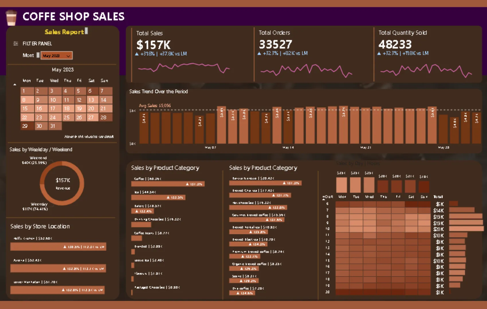
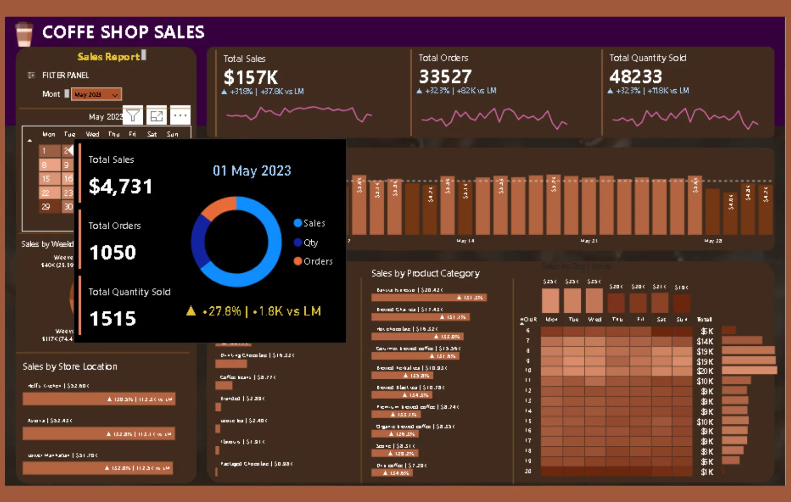
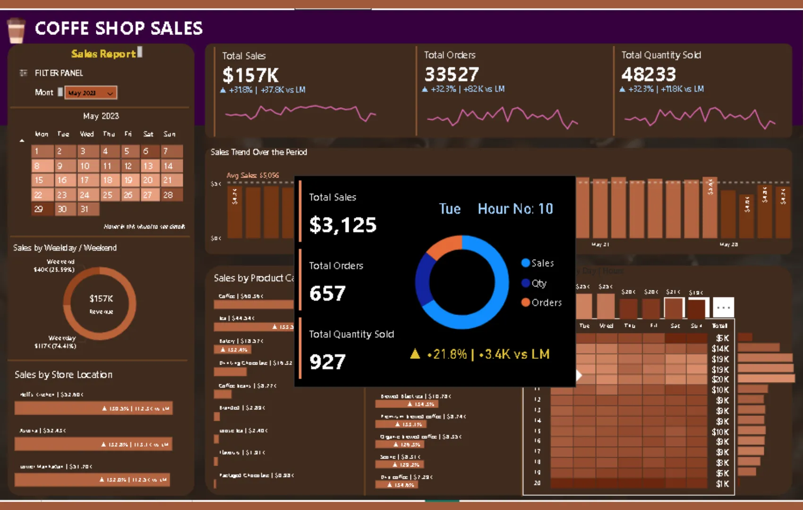

+++
title = 'Coffee Shop Dashboard'
date = 2025-03-10T21:37:16+07:00
draft = false
description = ""
image = "1.webp"
imageBig= "1.webp"
categories= ["Analysis and Visualization"]
tags= ["Power BI", "Dashboard"]
avatar="/images/Analysis_and_Visualization/profil.jpeg"
+++

## Tentang Dashboad

Dasbor ini merupakan laporan penjualan interaktif untuk bisnis kedai kopi, yang dirancang untuk memberikan wawasan mendalam tentang performa penjualan. Pengguna dapat memantau metrik kunci (KPI) seperti total penjualan, jumlah pesanan, dan kuantitas produk terjual secara real-time.

Dashboard ini dilengkapi dengan fitur filter berdasarkan periode waktu (bulan dan tanggal) serta tooltips informatif yang menampilkan rincian data harian maupun per jam. Visualisasi data yang komprehensif—mencakup tren penjualan, perbandingan performa antar lokasi toko, hingga analisis kategori produk terlaris memungkinkan manajemen untuk membuat keputusan strategis yang berbasis data guna meningkatkan efisiensi dan pendapatan.

## Dashboard Preview

  
  
Tampilan utama dasbor yang merangkum performa penjualan selama periode Mei 2023.

 

  
  
Fitur <em>tooltip</em> interaktif saat kursor diarahkan pada tanggal tertentu, menampilkan rincian penjualan harian.

 

  
  
Analisis mendalam hingga tingkat per jam, memungkinkan identifikasi jam sibuk dan optimalisasi operasional.

