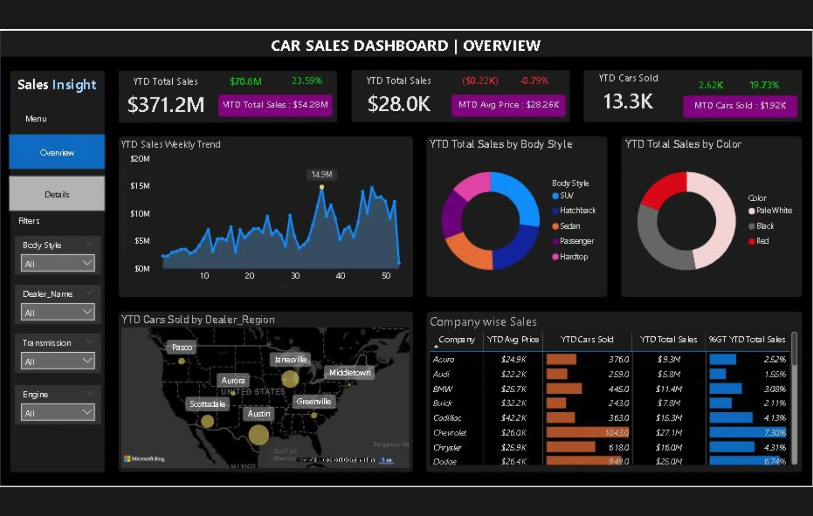
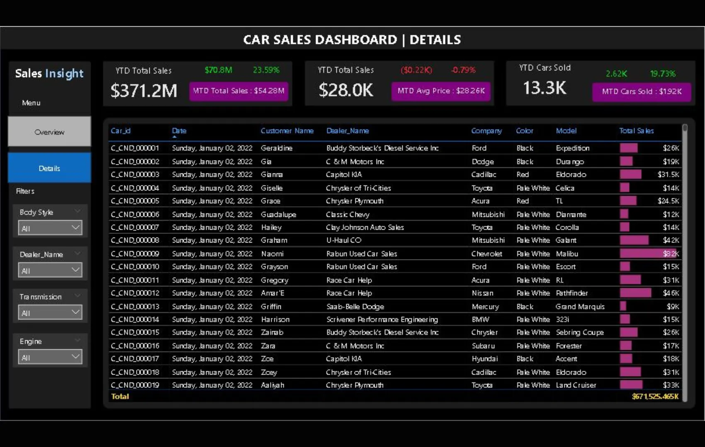

+++
title = 'Dashboard Analisis Penjualan Mobil'
date = 2025-03-10T21:37:16+07:00
draft = false
description = ""
image = "2.webp"
imageBig= "2.webp"
categories= ["Analysis and Visualization"]
tags= ["Power BI", "Dashboard"]
avatar="/images/Analysis_and_Visualization/profil.jpeg"
+++

## Tentang Dashboard

Dashboard Analisis Penjualan Mobil ini adalah alat visualisasi data yang dirancang untuk memberikan tinjauan komprehensif terhadap kinerja penjualan otomotif. Terdiri dari dua halaman utama 'Overview' dan 'Details' dashboard ini memungkinkan pengguna beralih dari ringkasan tingkat tinggi ke data transaksional yang terperinci dengan mudah.

Halaman 'Overview' menyajikan metrik kunci (KPI) seperti total penjualan *Year-to-Date* (YTD) dan *Month-to-Date* (MTD), jumlah unit terjual, serta visualisasi penjualan berdasarkan tren mingguan, tipe bodi, warna, dan wilayah geografis. Sementara itu, halaman 'Details' menawarkan fitur *drill-down* ke data mentah, menampilkan setiap transaksi penjualan secara individual. Dengan filter interaktif untuk tipe bodi, nama dealer, dan lainnya, dasbor ini menjadi alat yang efektif bagi tim manajemen untuk memonitor performa, mengidentifikasi tren pasar, dan membuat keputusan bisnis yang lebih cerdas.

## Dashboard Preview

  
  
Halaman 'Overview' menampilkan ringkasan visual dari metrik penjualan utama dan analisis berdasarkan berbagai kategori.

 

  
  
Halaman 'Details' memungkinkan pengguna untuk melihat data transaksional mentah untuk analisis yang lebih mendalam.

