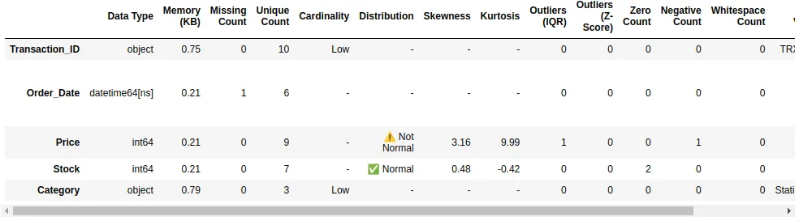

+++
title = "Otomatiskan Profiling Data Anda dengan Satu Fungsi Python Ultimate"
date = 2025-08-16T18:00:00+07:00
draft = false
description = "Hentikan pekerjaan EDA yang berulang. Gunakan fungsi Python ini untuk mendapatkan profil data yang komprehensif secara instan, mulai dari outlier hingga penggunaan memori."
image = "1.webp"
imageBig= "1.webp"
categories= ["Analysis and Visualization"]
tags= ["Python", "Pandas", "EDA"]
avatar="/images/profil.jpeg"
+++

Sebagai praktisi data, kita semua tahu ritual pertama saat berhadapan dengan dataset baru: **Exploratory Data Analysis (EDA)**. Kita menjalankan `df.info()`, `df.describe()`, `df.isnull().sum()`, dan serangkaian perintah lainnya untuk "merasakan" data. Proses ini, meskipun penting, sering kali terasa repetitif dan memakan waktu.

Bagaimana jika kita bisa mengotomatiskan semua langkah awal tersebut dengan satu fungsi? 

Hari ini, saya ingin membagikan sebuah fungsi Python. Fungsi ini dirancang untuk memberikan gambaran umum yang mendalam tentang DataFrame pandas Anda.

## Solusi: Satu Fungsi untuk Menguasai Semuanya

Fungsi ini melakukan iterasi pada setiap kolom dalam DataFrame Anda dan secara cerdas mengekstrak metrik-metrik paling penting berdasarkan tipe datanya. Lupakan lagi mengetik perintah yang sama berulang kali!


Berikut adalah kode lengkapnya:

```python
import pandas as pd
import numpy as np

def create_ultimate_data_profile(df):
    if not isinstance(df, pd.DataFrame):
        raise TypeError("Input must be a pandas DataFrame.")
        
    records = []
    for col in df.columns:
        # Basic metrics
        dtype = str(df[col].dtype)
        missing_count = df[col].isnull().sum()
        unique_count = df[col].nunique()
        memory_usage = df[col].memory_usage(deep=True) / 1024 # in KB
        
        # Initialize default metrics
        distribution, skew_val, kurt_val = '-', '-', '-'
        outlier_iqr, outlier_zscore = 0, 0
        zero_count, negative_count = 0, 0
        whitespace_count = 0
        cardinality_level, top_value, top_freq_percent = '-', '-', '-'
        time_range = '-'

        # Metrics for numeric columns
        if pd.api.types.is_numeric_dtype(df[col]) and df[col].nunique() > 1:
            mean, std = df[col].mean(), df[col].std()
            skew_val, kurt_val = df[col].skew(), df[col].kurt()
            
            if -1 < skew_val < 1 and -3 < kurt_val < 3:
                distribution = "✅ Normal"
            else:
                distribution = "⚠️ Not Normal"

            Q1, Q3 = df[col].quantile(0.25), df[col].quantile(0.75)
            IQR = Q3 - Q1
            lower, upper = Q1 - 1.5 * IQR, Q3 + 1.5 * IQR
            outlier_iqr = ((df[col] < lower) | (df[col] > upper)).sum()
            
            z_scores = np.abs((df[col] - mean) / std) if std > 0 else 0
            outlier_zscore = (z_scores > 3).sum()

            zero_count = (df[col] == 0).sum()
            negative_count = (df[col] < 0).sum()
        
        # Metrics for object/categorical columns
        elif pd.api.types.is_object_dtype(df[col]):
            if unique_count <= 10: cardinality_level = "Low"
            elif 10 < unique_count <= 50: cardinality_level = "Medium"
            else: cardinality_level = "High"
            
            if not df[col].empty and missing_count != len(df):
                counts = df[col].value_counts()
                top_value = counts.index[0]
                top_freq_percent = (counts.iloc[0] / len(df[col].dropna())) * 100
                
                try:
                    whitespace_count = (df[col].str.strip() != df[col]).sum()
                except AttributeError:
                    whitespace_count = 0
        
        # Metrics for datetime columns
        elif pd.api.types.is_datetime64_any_dtype(df[col]):
            if not df[col].isnull().all():
                min_date = df[col].min().strftime('%Y-%m-%d')
                max_date = df[col].max().strftime('%Y-%m-%d')
                time_range = f"{min_date} to {max_date}"
            else:
                time_range = "All values are null"

        records.append({
            'Data Type': dtype,
            'Memory (KB)': memory_usage,
            'Missing Count': missing_count,
            'Unique Count': unique_count,
            'Cardinality': cardinality_level,
            'Distribution': distribution,
            'Skewness': skew_val,
            'Kurtosis': kurt_val,
            'Outliers (IQR)': outlier_iqr,
            'Outliers (Z-Score)': outlier_zscore,
            'Zero Count': zero_count,
            'Negative Count': negative_count,
            'Whitespace Count': whitespace_count,
            'Top Value': top_value,
            'Top Value %': top_freq_percent,
            'Time Range': time_range,
        })

    summary_df = pd.DataFrame(records, index=df.columns)
    pd.options.display.float_format = '{:,.2f}'.format
    
    return summary_df
```


dengan memanggilnya seperti ini, Anda dapat menginvestigasi data tersebut.

```Python

profiling_data = create_ultimate_data_profile(df)
profiling_data

```

<div>
  
</div>


## Penutup

Dengan mengotomatiskan langkah-langkah EDA awal, Anda tidak hanya menghemat waktu tetapi juga memastikan konsistensi dalam analisis Anda. Silakan modifikasi dan sesuaikan fungsi ini sesuai dengan kebutuhan spesifik proyek Anda. 