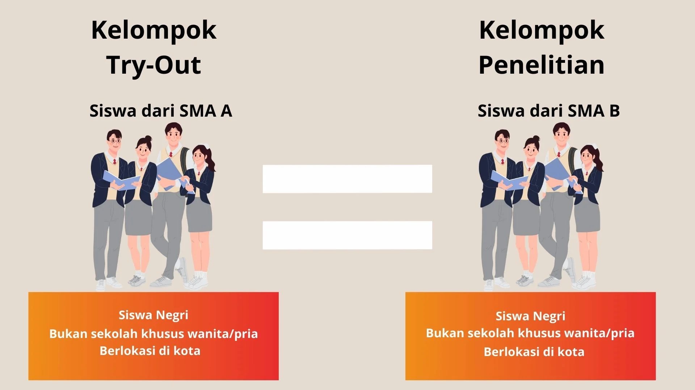
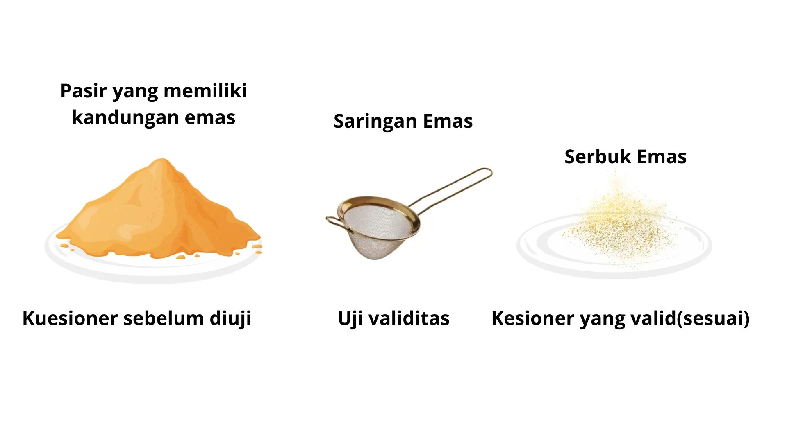
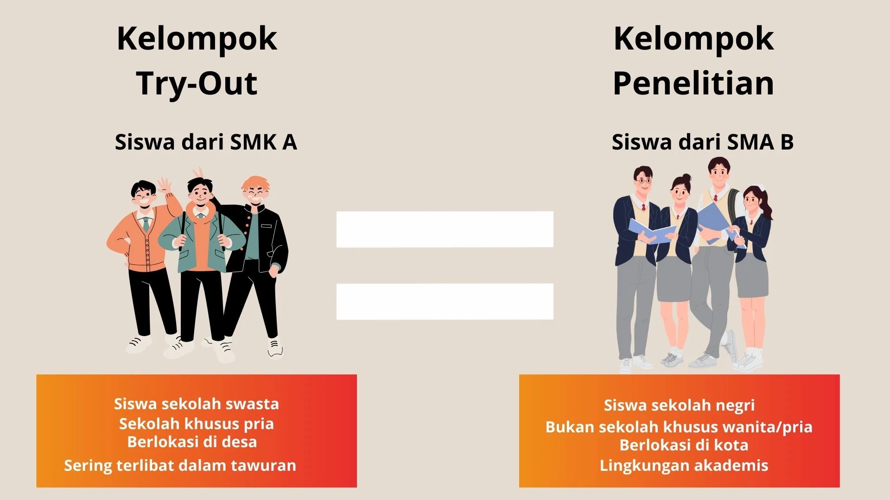
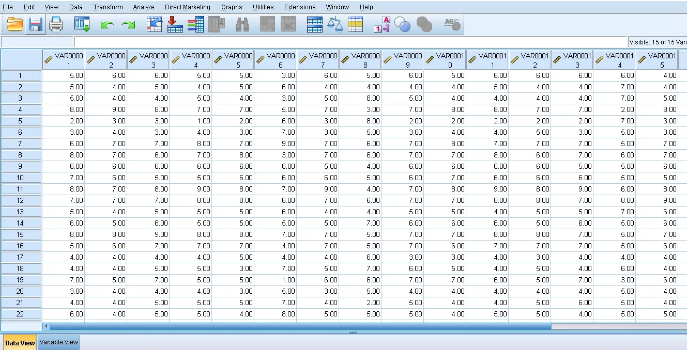
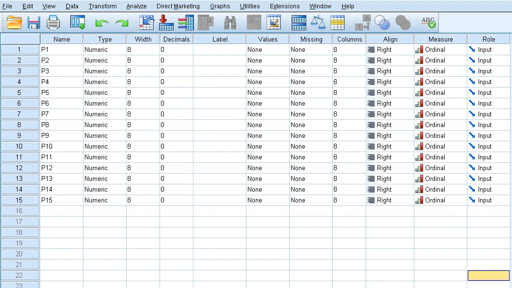
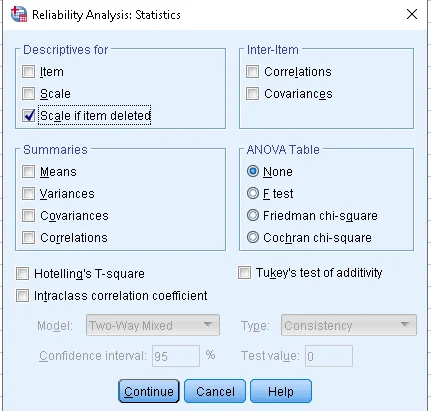
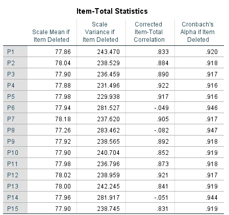
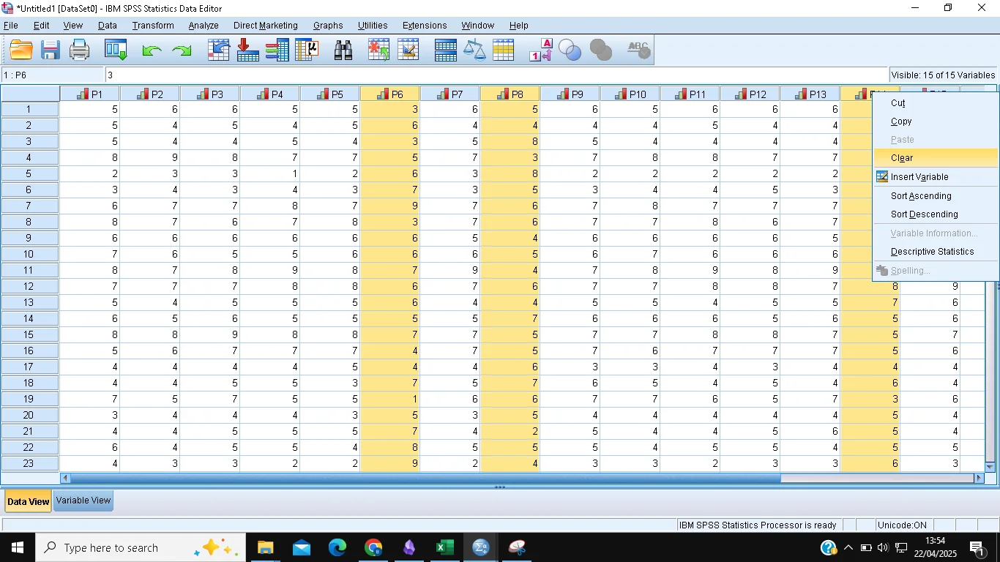
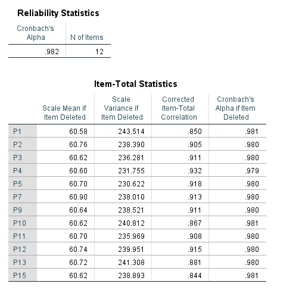

+++
title = 'Uji Validitas dan Reliabilitas Kuesioner dengan SPSS'
date = 2025-04-22T21:37:16+07:00
draft = false
socialshare = true

description = ''
image = "22.webp"
imageBig= "22.webp"
categories= ["Analysis and Visualization"]
tags=["SPSS"]
authors= ["Daddy Ananta"]
avatar="/images/profil.jpeg"
+++

Sebelum Anda menyebarkan kuesioner ke ratusan responden, pernahkah Anda bertanya: "Apakah pertanyaan-pertanyaan ini benar-benar mengukur apa yang ingin saya ukur? Apakah hasilnya akan konsisten?" 

Dua pertanyaan inilah yang menjadi inti dari **Uji Validitas** dan **Uji Reliabilitas**. Melewatkan kedua uji ini sama seperti membangun rumah di atas fondasi yang rapuh. Data yang Anda kumpulkan bisa jadi tidak akurat dan tidak dapat diandalkan, sehingga kesimpulan penelitian Anda pun diragukan.

Panduan ini akan membahas secara tuntas, mulai dari konsep dasar hingga langkah praktis menggunakan SPSS.

---

## Pentingnya Kelompok Uji Coba (*Try-Out*) yang Tepat

Langkah pertama sebelum melakukan uji statistik adalah melakukan uji coba (*try-out* atau *pilot study*) kuesioner pada sekelompok kecil responden. Namun, ada satu syarat mutlak: **kelompok uji coba harus memiliki karakteristik yang semirip mungkin dengan kelompok penelitian utama Anda.**

  
  
Karakteristik kelompok try-out harus mencerminkan kelompok penelitian.

Mengapa ini penting? Mari kita lihat contoh kasus yang salah:

Seorang peneliti ingin mengukur **"Minat Belajar Siswa di SMA B"**, sebuah sekolah negeri unggulan di perkotaan dengan atmosfer akademis yang sangat kompetitif. Namun, untuk uji coba kuesioner, ia memilih siswa dari **SMK A** (Sekolah Menengah Kejuruan) karena alasan kemudahan akses.

Pilihan ini sangat berisiko. Siswa SMK memiliki fokus pendidikan, lingkungan pergaulan, dan tingkat persaingan akademis yang berbeda. Akibatnya, jawaban mereka terhadap item kuesioner mungkin tidak akan mencerminkan respons dari siswa SMA B.

Misalnya, untuk pernyataan **"Kolaborasi dengan teman sangat membantu tugas akademik saya"**:
* **Siswa SMK A** mungkin memberi skor rendah, karena fokus mereka lebih ke praktik individual.
* **Siswa SMA B** mungkin memberi skor tinggi, karena kerja kelompok adalah strategi vital di lingkungan kompetitif mereka.

Perbedaan ini akan menghasilkan data uji coba yang bias, yang pada akhirnya bisa membuat Anda salah dalam menilai validitas dan reliabilitas kuesioner Anda.

> **Intinya**: Pastikan subjek *try-out* Anda adalah "cerminan mini" dari subjek penelitian utama Anda.

---

## Membedah Konsep: Validitas vs. Reliabilitas

### Apa itu Uji Validitas?

Uji validitas bertujuan untuk memastikan kuesioner Anda benar-benar mengukur variabel yang seharusnya diukur. Singkatnya: **apakah Anda mengukur hal yang tepat?**

Analogi sederhananya adalah menyaring emas dari pasir sungai. Anda tidak ingin menjual pasirnya, bukan? Anda hanya menginginkan serbuk emasnya. Uji validitas berfungsi sebagai "saringan" untuk membuang item-item pertanyaan yang tidak relevan (pasir) dan hanya menyimpan item yang benar-benar mengukur konsep Anda (emas).

  
  
Uji validitas menyaring item yang tidak relevan.

Contoh: Kuesioner **"Minat Belajar Siswa"** berisi item berikut:
1.  Saya merasa senang saat mempelajari hal baru di kelas. (✅ Relevan)
2.  Saya sering mencari informasi tambahan di luar jam sekolah. (✅ Relevan)
3.  Saya selalu mendapatkan nilai yang tinggi pada setiap ujian. (❌ **Tidak Valid** - Ini mengukur **kemampuan/prestasi akademis**, bukan minat).
4.  Fasilitas di sekolah ini sangat lengkap dan nyaman. (❌ **Tidak Valid** - Ini mengukur **persepsi terhadap fasilitas**, bukan minat belajar).

Dalam panduan ini, kita akan fokus pada **Validitas Item**, yaitu melihat sejauh mana setiap item pertanyaan selaras dengan total skor kuesioner.

### Apa itu Uji Reliabilitas?

Setelah memastikan item Anda valid, langkah selanjutnya adalah menguji reliabilitas. Reliabilitas menjawab pertanyaan: **apakah kuesioner Anda konsisten?**

Analogi terbaik adalah sebuah timbangan digital. Jika Anda menimbang sekarung beras yang sama sebanyak lima kali dan angkanya selalu menunjukkan 10 kg, maka timbangan itu **reliabel**. Namun, jika hasilnya berubah-ubah (10 kg, 9.5 kg, 10.2 kg), timbangan itu tidak bisa diandalkan.

  
  
Uji reliabilitas memastikan konsistensi hasil pengukuran.

Uji reliabilitas (khususnya dengan metode *Cronbach's Alpha* yang akan kita gunakan) mengukur **konsistensi internal** kuesioner. Artinya, ia melihat apakah jawaban responden pada satu set item pertanyaan konsisten satu sama lain. Kuesioner yang reliabel akan menghasilkan data yang stabil dan dapat dipercaya jika diujikan berulang kali pada subjek yang serupa.

> **Urutan Penting**: Selalu lakukan Uji Validitas **terlebih dahulu**. Hapus item yang tidak valid, baru kemudian lakukan Uji Reliabilitas pada item-item yang tersisa.

---

## Tutorial SPSS: Uji Validitas dan Reliabilitas

Kita akan menggunakan data dummy yang bisa Anda siapkan di Excel. Tutorial ini menggunakan SPSS versi 24, namun langkah-langkahnya sangat mirip untuk versi lain.

#### **Langkah 1: Input Data ke SPSS**

1.  Salin data dari Excel (termasuk nama kolom P1, P2, dst.).
2.  Buka SPSS, masuk ke **Data View**. Klik pada sel pertama (pojok kiri atas) dan tempelkan data Anda (Ctrl+V).

  
  
Tampilan Data View setelah data di-paste.

#### **Langkah 2: Mengatur Properti Variabel**

1.  Pindah ke tab **Variable View** di kiri bawah.
2.  Atur properti untuk setiap variabel (P1, P2, ...):
    * **Name**: Pastikan sudah sesuai (P1, P2, dst.).
    * **Decimals**: Ubah menjadi **0**, karena data skala Likert adalah bilangan bulat.
    * **Label**: (Sangat Direkomendasikan!) Isi dengan teks pertanyaan lengkap. Misal, untuk `P1` labelnya adalah "Saya merasa senang saat mempelajari hal baru". Ini akan membuat output analisis lebih mudah dibaca.
    * **Measure**: Ubah menjadi **Ordinal**, karena skala Likert menunjukkan tingkatan.

  
  
Pengaturan di Variable View.

#### **Langkah 3: Menjalankan Analisis (Tahap 1 - Validitas)**

Kita akan menjalankan analisis reliabilitas, namun tujuannya adalah untuk mendapatkan nilai validitas item dari tabel statistik tambahan.

1.  Klik menu **Analyze > Scale > Reliability Analysis...**
2.  Pindahkan semua item (P1 hingga P15) dari kotak kiri ke kotak **Items** di sebelah kanan.
3.  Klik tombol **Statistics...**
4.  Pada jendela baru, di bagian 'Descriptives for', centang **Scale if item deleted**. Klik **Continue**.
5.  Klik **OK** pada jendela utama untuk menjalankan analisis.

  
  
Centang 'Scale if item deleted'.

#### **Langkah 4: Interpretasi Output Validitas**

Cari tabel bernama **Item-Total Statistics**. Fokus pada kolom **Corrected Item-Total Correlation**. Ini adalah nilai $r_{hitung}$ kita.

  
  
Perhatikan nilai pada kolom yang ditandai.

**Kriteria Keputusan:**
Sebuah item dinyatakan **valid** jika nilai `Corrected Item-Total Correlation` ($r_{hitung}$) lebih besar dari $r_{tabel}$.
* **Bagaimana cara menentukan $r_{tabel}$?** Nilai ini bergantung pada jumlah responden (N) dan tingkat signifikansi ($\alpha$, biasanya 5% atau 0.05). Anda bisa mencarinya di tabel r Product Moment.
* **Aturan Praktis (Rule of Thumb):** Jika sulit mencari $r_{tabel}$, banyak peneliti menggunakan batas aman **0.3**.

Pada contoh output di atas, item **P6, P8, dan P15** memiliki nilai di bawah 0.3. Dengan demikian, ketiga item ini dianggap **tidak valid** dan harus **dihapus** atau **dibuang** dari kuesioner.

#### **Langkah 5: Menjalankan Analisis (Tahap 2 - Reliabilitas)**

Setelah membuang item yang tidak valid, kita ulangi analisis hanya dengan item yang valid.

1.  Kembali ke **Analyze > Scale > Reliability Analysis...**
2.  Keluarkan item yang tidak valid (P6, P8, P15) dari kotak **Items**. Sisakan hanya item yang valid.
3.  Pastikan pengaturan di **Statistics...** masih sama.
4.  Klik **OK**.

  
  
Hanya item yang terbukti valid yang dianalisis kembali.

#### **Langkah 6: Interpretasi Output Reliabilitas**

Sekarang, lihat tabel **Reliability Statistics**. Fokus pada nilai **Cronbach's Alpha**.

  
  
Nilai Cronbach's Alpha setelah item tidak valid dibuang.

**Kriteria Keputusan:**
Kuesioner dianggap **reliabel** jika nilai Cronbach's Alpha $\ge 0.60$ (beberapa referensi yang lebih ketat menggunakan $\ge 0.70$).

Pada contoh output, nilai Cronbach's Alpha adalah **0.982**. Karena nilai ini jauh di atas 0.60, maka kumpulan item kuesioner yang sudah valid tersebut terbukti **sangat reliabel**.

---

## Kesimpulan

Melakukan uji coba (*try-out*) serta Uji Validitas dan Reliabilitas adalah tahap krusial yang tidak boleh dilewatkan dalam penelitian berbasis kuesioner. Proses ini memastikan bahwa alat ukur yang Anda gunakan berkualitas tinggi, tajam, dan konsisten.

Dengan instrumen yang valid dan reliabel, Anda bisa lebih percaya diri bahwa data yang Anda kumpulkan benar-benar mencerminkan kenyataan. Pada akhirnya, ini akan membawa Anda pada kesimpulan penelitian atau keputusan bisnis yang lebih akurat dan dapat dipertanggungjawabkan. Selamat menganalisis! 📊

## Video

    <iframe src="https://www.youtube.com/embed/k9Hqa-BeErc?si=tExl15ZosywXBTKH" 
            title="YouTube video player" frameborder="0" allowfullscreen>
    </iframe>

Tutorial SPSS

## Referensi
> Azwar, S. (2012). *Penyusunan Skala Psikologi*. Pustaka Pelajar.