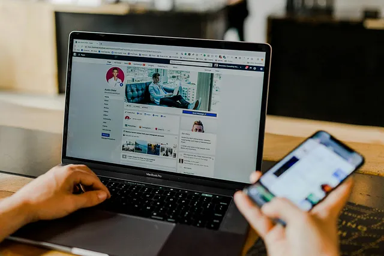
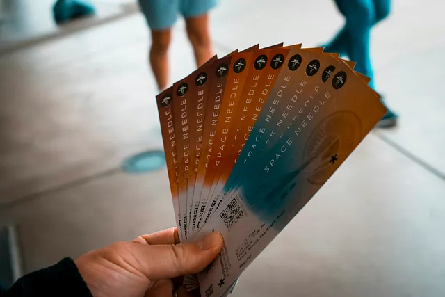
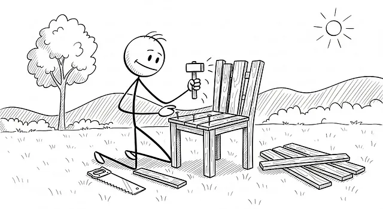
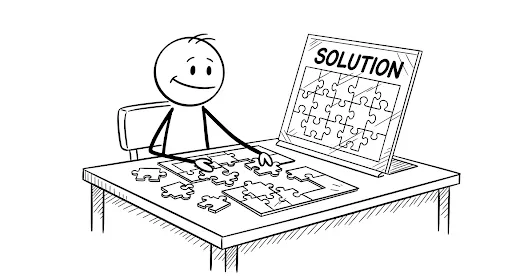
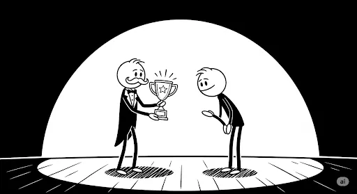
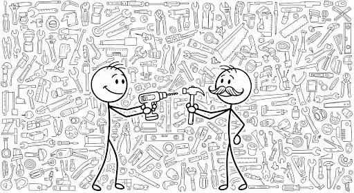

+++
title = "Dari Pengguna Menjadi 'Pemilik': Psikologi Desain Produk yang Menciptakan Loyalitas"
date = 2025-08-21T12:48:13+07:00
draft = false
socialshare = true
description = "Pelajari psikologi di balik pembelian skin game dan aset digital. Panduan ini menawarkan cetak biru monetisasi etis berbasis bukti akademis untuk para profesional."
image = "1.webp"
imageBig= "1.webp"
categories= ["Behavioral Insights"]
tags=["Behavioral Economics"]
authors= ["Daddy Ananta"]
avatar="/images/profil.jpeg"
+++

# Cara Merancang Free Trial yang Menciptakan 'Rasa Memiliki' dan Mendorong Langganan.

Jika Anda pernah menggunakan *free trial* Canva Pro, Anda mungkin akrab dengan perasaan ini: satu hari Anda dengan mudah menghapus latar belakang foto, mengakses *font* premium, dan mengatur semua aset merek Anda dengan rapi. Keesokan harinya, masa percobaan berakhir, dan tiba-tiba semua kemewahan itu terkunci di balik ikon mahkota kecil yang mengganggu.

 Photo by <a href="https://unsplash.com/@austindistel?utm_source=medium&utm_medium=referral"> Austin Distel</a> on <a href="https://unsplash.com/?utm_source=medium&utm_medium=referral"> Unsplash</a>

Kehilangan akses ini terasa lebih dari sekadar ketidaknyamanan; rasanya seperti sebuah kemunduran personal. Aset-aset yang tadinya terasa 'milik Anda' kini terasa asing, dan alur kerja yang efisien menjadi terhambat. Kepemilikan digital ini, meskipun tak berwujud, terasa begitu kuat karena ia menyentuh bias psikologis mendasar yang sedang merevolusi cara kita merancang produk: kecenderungan kita untuk menilai lebih tinggi apa yang kita rasa "miliki".

Ini bukanlah tentang eksploitasi, melainkan tentang pemahaman. Melalui panduan ini, kita akan membongkar cara merancang pengalaman yang begitu berharga sehingga pengguna **Anda** *memilih* untuk tinggal dan bertumbuh bersama Anda.

## Membedah *Loss Aversion*: Dari Takut Kehilangan Menjadi Keinginan Membangun

 Photo by <a> href="https://unsplash.com/@andylid0"> Andy Li </a> on<a href="https://unsplash.com/"> Unsplash</a>

Inti dari fenomena "jebakan" *free trial* adalah sebuah konsep kuat dari ekonomi perilaku yang disebut **_Endowment Effect_**, yang dipopulerkan oleh Richard H. Thaler dalam bukunya, "[*Misbehaving*](https://www.goodreads.com/book/show/22770226-misbehaving)". Sederhananya, kita secara irasional memberi nilai lebih pada barang yang sudah kita miliki. Thaler menjelaskannya dengan analogi tiket konser: jika Anda diberi tiket gratis senilai 5 juta rupiah, Anda mungkin enggan menjualnya karena Anda merasa harganya lebih mahal dari itu. Namun, jika Anda tidak memiliki tiket itu, apakah Anda bersedia mengeluarkan 5 juta rupiah untuk membelinya? Bagi banyak dari kita, jawabannya adalah tidak, tiketnya terkalu mahal. Rasa kepemilikan membuat kita merasa lebih menghargai tiket tersebut

Mesin penggerak di balik ini adalah **_Loss Aversion_**: rasa sakit karena kehilangan terasa jauh lebih kuat daripada kesenangan mendapatkan keuntungan yang setara. Di dunia digital, inilah yang menjelaskan mengapa kehilangan akses premium setelah masa percobaan berakhir terasa seperti sebuah "kerugian" nyata. Namun, alih-alih menggunakan ini untuk menciptakan kecemasan, para desainer produk yang cerdas menggunakannya untuk menyoroti nilai yang telah *Anda*, sebagai pengguna, bangun.

Penelitian modern mengkonfirmasi dinamika ini. Sebuah [studi skala besar di *Management Science*](https://doi.org/10.1287/mnsc.2022.4507) menemukan bahwa *trial* yang lebih pendek (7 hari) seringkali lebih efektif karena menciptakan urgensi, mendorong pengguna untuk segera belajar dan mengintegrasikan produk ke dalam hidup mereka. Di sisi lain, riset dalam [*Frontiers in Psychology*](https://doi.org/10.3389/fpsyg.2025.1568868) menunjukkan bahwa dalam model *freemium*, *trial* yang lebih panjang dapat meningkatkan konversi tertunda. Benang merahnya? Kedua skenario berhasil ketika pengguna diberi cukup waktu untuk **menginvestasikan diri** mereka ke dalam platform. Tujuannya bukan membuat mereka takut kehilangan fitur, tetapi membuat mereka sadar betapa berharganya apa yang telah mereka ciptakan.

Namun, strategi yang paling berkelanjutan bukanlah sekadar mencegah kehilangan; melainkan secara proaktif membangun sesuatu yang layak untuk dipertahankan. Di sinilah 'Efek IKEA' digital berperan, mengubah pengguna dari konsumen pasif menjadi kreator aktif dalam pengalaman mereka sendiri.

## Efek IKEA Digital: Saat Partisipasi Menjadi Kepemilikan

Image from Imagen 3

Jika *Loss Aversion* menjelaskan mengapa kita enggan melepaskan, **"Efek IKEA"** menjelaskan bagaimana rasa cinta dan kepemilikan itu tumbuh sejak awal. Fenomena ini, yang awalnya merujuk pada kebanggaan yang kita rasakan setelah merakit perabot sendiri, ternyata memiliki padanan digital yang sangat kuat: **partisipasi dan kustomisasi**. Saat kita berinvestasi, sekecil apa pun usahanya, untuk membentuk produk sesuai keinginan, kita mulai merasa menjadi bagian dari produk itu sendiri.

Bayangkan betapa personalnya sebuah game saat **Anda** bisa mendesain karakter **Anda** sendiri. Riset telah menunjukkan bahwa ketika pemain diberi kemampuan untuk mengkustomisasi penampilan karakter mereka, identifikasi mereka dengan karakter tersebut meningkat secara signifikan. Kustomisasi ini tidak memberikan keuntungan kompetitif, tetapi secara subyektif membuat pengalaman bermain menjadi jauh lebih kaya. Kita tidak lagi hanya "menggunakan" sebuah avatar; kita "menjadi" avatar tersebut.

"As an economist, Rosett knew such behavior was not rational, but he couldn’t help himself."

- Richard H. Thaler, Misbehaving: The Making of Behavioral Economics

Prinsip ini berlaku universal. Bagaimana kita bisa memfasilitasi "perakitan" di dunia SaaS atau aplikasi seluler? Jawabannya terletak pada penciptaan **"sentuhan virtual"**. Penelitian menunjukkan bahwa interaksi langsung adalah kuncinya:
* Sebuah [studi di *International Journal of Human–Computer Interaction*](https://doi.org/10.1080/10447318.2022.2131263) menemukan bahwa interaksi melalui *touchscreen* dapat meningkatkan persepsi sentuhan dan _psychological ownership_.
* Riset dari [*Journal of Marketing Research*](https://doi.org/10.1177/00222437211059540) membuktikan bahwa hanya dengan melihat tangan orang lain berinteraksi dengan produk di layar dapat meningkatkan rasa kepemilikan kita.

Pada akhirnya, setiap klik adalah sebuah investasi kecil dari diri pengguna. Dan semakin personal "rumah" digital yang mereka bangun di dalam produk Anda, semakin sulit rasanya untuk meninggalkannya.

## Strategi Praktis: 3 Cara Mendesain Keterlibatan Positif

Memahami teori adalah satu hal; menerapkannya adalah hal lain. Berikut adalah tiga strategi praktis untuk merancang fitur yang menumbuhkan _psychological ownership_ secara etis, mengubah interaksi biasa menjadi investasi emosional.

### 1. Fasilitasi "Investasi Awal" yang Bermakna

Image from Imagen 3

Prinsip ini adalah tentang mengubah ruang kosong menjadi ruang personal secepat mungkin. Bayangkan Anda masuk ke apartemen baru yang kosong; tindakan pertama menggantung sebuah foto di dinding langsung membuatnya terasa seperti rumah. Demikian pula, saat pengguna baru masuk ke aplikasi manajemen proyek Anda, jangan sajikan layar kosong. Sebaliknya, langsung pandu mereka untuk membuat dan menamai proyek pertama mereka, misalnya, **"Rencana Peluncuran Produk Q4"**. Tindakan tunggal ini secara instan mengubah alat Anda dari "software" generik menjadi _workspace_ pribadi mereka untuk tujuan spesifik mereka, meletakkan "batu bata" pertama fondasi kepemilikan.

### 2. Jadikan Kemajuan Terlihat dan Dapat Dibagikan

Image from Imagen 3

Kemajuan yang tidak terlihat tidak akan terasa nyata; visualisasi memvalidasi usaha. Contohnya, sebuah aplikasi kebugaran yang hanya memberi tahu pengguna bahwa mereka telah "berlari 50 KM bulan ini" itu informatif. Namun, menampilkan peta rute lari mereka yang terakumulasi menjadi sebuah jaringan jalan yang telah mereka taklukkan, lengkap dengan lencana digital **"Penakluk Rute Lokal,"** mengubah data menjadi cerita kepahlawanan pribadi. Bukti visual yang mudah dibagikan ini membuat pengguna merasa telah membangun sesuatu yang berharga, memperkuat komitmen mereka untuk tidak "kehilangan" pencapaian tersebut.

### 3. Berikan Kontrol Melalui Pilihan, Bukan Kompleksitas

Image from Imagen 3

Memberi kontrol berarti menciptakan rasa agensi, mengubah pengguna menjadi arsitek. Bayangkan sebuah aplikasi berita: versi pasifnya adalah menyajikan _trending topics_ yang sama untuk semua orang. Versi aktifnya, yang membangun kepemilikan, adalah saat Anda sebagai pengguna dapat memilih topik spesifik yang ingin diikuti (misalnya, **"AI dalam Kesehatan," "Startup di Asia Tenggara"**) dan membisukan topik yang tidak Anda minati. Dengan memberikan pilihan bermakna ini, aplikasi tersebut bertransformasi dari sekadar "penyiar" menjadi "asisten riset pribadi" yang telah Anda latih, menjadikannya bagian tak terpisahkan dari rutinitas Anda.

## Kesimpulan: Dari Retensi Menjadi Resonansi
Masa depan pertumbuhan bisnis yang berkelanjutan tidak terletak pada perancangan "jebakan" yang membuat pengguna sulit keluar, tetapi pada penciptaan "taman" yang begitu subur dan personal sehingga mereka tidak pernah punya alasan untuk pergi. Dengan mengutamakan pemberdayaan dan membantu pengguna membangun, bukan hanya menggunakan, kita tidak hanya akan memenangkan pasar; kita akan mendapatkan tempat yang tulus di hati dan alur kerja mereka.

<a href="https://daddyananta.github.io/categories/insight-psychology/">Baca artikel lain tentang Insight Psikologi</a>

## Referensi

Yoganarasimhan, H., Lakshmanan, A., & Tan, T. (2023). Design and Evaluation of Optimal Free Trials. <a href="https://doi.org/10.1287/mnsc.2022.4507">Management Science</a>

Liu, Y., Niu, Z., Li, Y., & Ma, L. (2025). Longer or shorter? A large-scale randomized field experiment on the impact of free trial duration on sustainable user conversion in the Freemium model. <a href="https://doi.org/10.3389/fpsyg.2025.1568868">Frontiers in Psychology</a>

Uysal, E., Tüscher, S., & Reinartz, W. (2025). Virtually mine: Understanding consumer responses to virtual reality product presentations. <a href="https://doi.org/10.1016/j.jretai.2025.04.007">Journal of Retailing</a>

Argo, Z. R., Dahl, D. W., & Morales, A. C. (2021). The Vicarious Haptic Effect in Digital Marketing and Virtual Reality. <a href="https://doi.org/10.1177/00222437211059540">Journal of Marketing Research</a>

Știr, M. P., & Zaiț, A. (2022). Impact of Direct Interaction with Virtual Objects through Touchscreens on Enhancing Psychological Ownership and Endowment Effect. <a href="https://doi.org/10.1080/10447318.2022.2131263">International Journal of Human–Computer Interaction</a>

Thaler, R. H. (2015). Misbehaving: The Making of Behavioral Economics. <a href="https://www.goodreads.com/book/show/22221131-misbehaving">Goodreads</a>
 
Ariely, D. (2008). Predictably Irrational: The Hidden Forces That Shape Our Decisions — Chapter 5: The Power of a Free Cookie. <a href="https://www.goodreads.com/book/show/1713426.Predictably_Irrational">Goodreads</a>

## Penelusuran Terkait
<ul>
    <li><a href="https://www.nngroup.com/articles/ikea-effect-user-investment/">The IKEA Effect: Why We Value What We Build - Nielsen Norman Group</a></li>
    <li><a href="https://growth.design/case-studies/duolingo-gamification">Duolingo's Gamification Teardown - Growth.Design</a></li>
    <li><a href="https://behavioralscientist.org/how-the-endowment-effect-can-be-explained/">How the Endowment Effect Can Be Explained - Behavioral Scientist</a></li>
    <li><a href="https://www.useronboard.com/how-canva-onboards-new-users/">How Canva Onboards New Users - UserOnboard</a></li>
    <li><a href="https://uxdesign.cc/loss-aversion-in-ux-design-5-key-takeaways-c6517a941584">Loss Aversion in UX Design: 5 Key Takeaways - UX Collective</a></li>
    <li><a href="https://uxmag.com/articles/designing-for-psychological-ownership">Designing for Psychological Ownership - UX Magazine</a></li>
    <li><a href="https://www.reforge.com/brief/the-psychology-of-setup-moments-how-to-build-user-motivation">The Psychology of Setup Moments - Reforge</a></li>
    <li><a href="https://firstround.com/review/the-scientific-way-to-get-users-hooked-on-your-product/">The Scientific Way to Get Users Hooked on Your Product - First Round Review</a></li>
</ul>