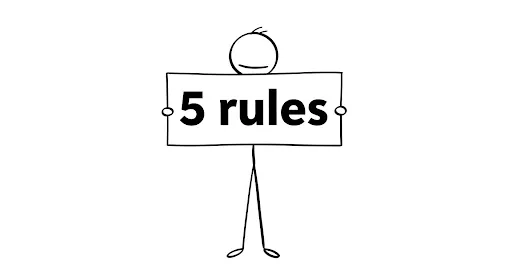

+++
title = "Beyond the Bandwagon: 5 Evidence-Based Rules for E-commerce Social Proof"
date = 2025-08-27T13:45:42+07:00
draft = false
socialshare = true
description = "Berhentilah meniru taktik social proof. Pelajari 5 aturan berbasis bukti dari penelitian akademis terbaru untuk secara etis meningkatkan kepercayaan dalam e-commerce, pengalaman pengguna, dan konversi."
image = "1.webp"
imageBig= "1.webp"
categories= ["Behavioral Insights"]  
tags=["Behavioral Economics"]
authors= ["Daddy Ananta"]   
avatar="/images/profil.jpeg"
url = "/posts/behavioral-insights/mengapa-pemain-terbaik-anda-berhenti-membedah-jebakan-sunk-cost-fallacy-copy/"
aliases = [
    "/posts/insight-psychology/mengapa-pemain-terbaik-anda-berhenti-membedah-jebakan-sunk-cost-fallacy-copy/"
]
+++

Dalam dunia e-commerce, ada satu strategi yang tampaknya diikuti oleh semua orang: **menunjukkan popularitas.**

Kita semua telah melihatnya: spanduk "Bestseller", jumlah "likes" yang mencolok, dan widget "Orang Lain Juga Membeli Ini" yang ada di mana-mana. Kita, sebagai pemasar dan pemilik bisnis, mengadopsinya karena logikanya tampak sederhana: jika banyak orang menyukainya, itu pasti bagus. Namun, pendekatan "ikut-ikutan" ini sering kali menghasilkan sesuatu yang mengecewakan—bukan lonjakan konversi, melainkan hanya kebisingan visual yang diabaikan pelanggan Anda.

Photo by <a href="https://unsplash.com/@sixthcitysarah">sarah b</a> on <a href="https://unsplash.com/">Unsplash</a>

Sudah saatnya kita bergerak melampaui peniruan tanpa berpikir dan mulai menerapkan strategi yang berempati dan efektif. Berdasarkan serangkaian penelitian akademis terbaru, berikut adalah lima aturan berbasis bukti untuk membantu Anda menciptakan pengalaman berharga yang membuat pengguna *ingin* tetap tinggal, menggunakan, dan membeli.

## Memahami Paradoks Popularitas

"Di mana semua orang berpikir sama, tidak ada yang banyak berpikir."

- Walter Lippmann, Public Opinion

## Lima Aturan Berbasis Bukti

Imagen from Imagen 3

### **Aturan #1: Match the Cue to the Customer's Goal**

Kita seringkali mengasumsikan bahwa semua pengunjung situs memiliki pola pikir yang sama, padahal kenyataannya tidak. Bayangkan perbedaan antara seseorang yang sedang berjalan-jalan santai di museum dengan seseorang yang datang untuk membeli satu lukisan spesifik. Keduanya membutuhkan panduan yang berbeda. Hal yang sama berlaku di e-commerce Anda.

Sebuah [eksperimen lapangan cerdas oleh Z. Zhu dan rekan-rekannya](https://doi.org/10.1111/poms.14003) di *Production and Operations Management* mengungkap dinamika ini. Mereka menemukan bahwa pelanggan dalam mode **eksplorasi** (sekadar melihat-lihat kategori) sangat responsif terhadap isyarat popularitas seperti label "Bestseller". Label ini berfungsi sebagai pemandu yang membantu mereka menemukan produk menarik di tengah lautan pilihan. Namun, menambahkan urgensi ("Penawaran Segera Berakhir!") pada tahap ini justru melemahkan efeknya, seolah-olah kita terlalu memaksa orang yang baru melihat-lihat.

Sebaliknya, untuk pelanggan dalam mode **evaluasi** (sudah melihat halaman produk spesifik), kombinasi popularitas dan urgensi menjadi sangat ampuh. Saat seseorang sudah tertarik, gabungan sinyal "ini pilihan yang aman" (populer) dan "Anda harus segera bertindak" (urgensi) menjadi dorongan kuat untuk melakukan konversi.

**Aturan Praktis:** Bedakan strategi Anda. Gunakan label "Trending" atau "Pilihan Populer" di halaman kategori untuk memandu penemuan. Di halaman produk atau keranjang belanja, di mana tujuan pelanggan sudah lebih spesifik, gunakan kombinasi isyarat seperti "Dibeli 15 kali hari ini & penawaran akan berakhir" untuk mendorong keputusan akhir. Setelah Anda menyesuaikan isyarat dengan tujuan pelanggan, tantangan berikutnya adalah memastikan mereka benar-benar memercayai apa yang mereka lihat.

### **Aturan #2: Prioritize Credibility Over Raw Numbers**

Kita semua pernah merasakannya. Bayangkan Anda melihat sebuah iklan sepatu lari dengan '50.000 Likes', namun saat mengunjungi situsnya, stok ukuran populer sudah kosong selama berbulan-bulan. Sinyal popularitas yang tadinya kuat itu langsung terasa basi dan merusak kepercayaan. Sebagai pelanggan modern, kita memiliki radar bawaan untuk mendeteksi hal yang tidak otentik.

Dua studi terbaru menyoroti pentingnya kredibilitas. Pertama, [penelitian oleh A. S. Hamman dkk.](https://doi.org/10.1177/00222429241307608) di *Journal of Marketing* menunjukkan bahwa meskipun lebih banyak *likes* dapat meningkatkan klik, efeknya sangat kontekstual dan dapat memicu skeptisisme jika tidak terasa asli. Kedua, [sebuah eksperimen oleh H. Li dkk.](https://doi.org/10.1016/j.jbusres.2023.114133) menemukan bahwa *likes* memang meningkatkan pendapatan, tetapi efeknya paling kuat selama jam non-kerja. Bagi saya, data ini menunjukkan pergeseran penting: pelanggan merespons isyarat popularitas ketika mereka memiliki waktu dan ruang mental untuk benar-benar mempertimbangkannya, bukan saat mereka sedang terburu-buru.

**Aturan Praktis:** Ganti angka mentah dengan bukti yang lebih spesifik dan dapat dipercaya. Daripada hanya menampilkan "Disukai oleh 10.000 orang," cobalah, "Pilihan #1 untuk fotografer profesional di komunitas kami" atau "Direkomendasikan oleh 95% pembeli terverifikasi." Konteks membangun kepercayaan, namun kepercayaan itu rapuh dan bisa rusak jika pesan Anda terasa memaksa.

### **Aturan #3: Don't Let Your Cues Clash With Your Call-to-Action (CTA)**

Bayangkan seorang penjual yang sangat antusias meneriakkan, "Diskon besar! Beli sekarang juga! Cepat! Semua teman Anda juga sudah beli di sini!" Rasanya terlalu menekan, bukan? Ketika Anda, sebagai pelanggan, merasa dipaksa secara terang-terangan, pertahanan mental Anda akan aktif. Menambahkan bukti sosial di atasnya justru bisa menjadi bumerang.

Ini bukan sekadar firasat; ini didukung oleh data. Sebuah [studi penting oleh A. Agarwal dkk.](https://doi.org/10.1287/isre.2021.0606) yang dipublikasikan di *Information Systems Research* menguji hal ini di Facebook. Mereka menemukan bahwa untuk iklan dengan CTA yang sangat asertif ("Install Now!"), menampilkan jumlah *likes* tidak berpengaruh apa-apa. Yang lebih mengejutkan, menampilkan bahwa teman pengguna menyukai iklan tersebut justru **menurunkan** kemungkinan klik. Mengapa? Karena kombinasi pesan yang memaksa dan dukungan sosial mengaktifkan "pengetahuan persuasi" Anda—kesadaran bahwa Anda sedang menjadi target penjualan yang agresif.

**Aturan Praktis:** Alih-alih menumpuk semua pemicu di satu tempat, pisahkan isyarat persuasi Anda. Biarkan CTA urgensi Anda ("Penawaran Berakhir dalam 1 Jam!") bekerja sendiri. Kemudian, dalam email konfirmasi pembelian, Anda bisa menambahkan bagian ‘Pelanggan yang membeli item ini juga menyukai...’, memperkuat keputusan mereka dan membuka peluang untuk pembelian di masa depan tanpa terasa memaksa. Ini membawa kita ke prinsip yang lebih dalam: siapa *pembawa* pesan bukti sosial itu?

### **Aturan #4: Leverage the Power of Similarity**

Pikirkan terakhir kali Anda memesan hotel di kota asing. Ulasan dari 'pasangan lain yang bepergian tanpa anak' mungkin memiliki bobot sepuluh kali lipat dari ribuan ulasan anonim. Kita secara naluriah mencari cerminan diri kita dalam pilihan orang lain—sebuah prinsip fundamental psikologi sosial yang dieksplorasi secara mendalam dalam karya klasik seperti *Influence* oleh Cialdini dan *Nudge* oleh Thaler dan Sunstein.

Kegagalan *peer endorsement* pada CTA asertif dalam studi Agarwal yang disebutkan sebelumnya juga menggarisbawahi betapa sensitifnya konteks kesamaan ini. Dukungan dari teman seharusnya menjadi bentuk bukti sosial terkuat, tetapi ketika disajikan dalam konteks yang terasa manipulatif, efeknya justru berbalik. Ini menunjukkan bahwa kesamaan saja tidak cukup; penyajiannya harus terasa tulus dan membantu.

**Aturan Praktis:** Personalisasikan isyarat popularitas Anda sedapat mungkin. Ganti frasa umum "Orang Lain Juga Membeli Ini" dengan "Pelanggan yang Membeli [Nama Produk Anda] Juga Tertarik Dengan Ini." Jika platform Anda memungkinkan, tampilkan dukungan dari kelompok afinitas yang relevan, seperti "Pilihan populer di kalangan desainer grafis" atau "Banyak dibeli oleh pelanggan di [Kota Anda]." Namun, bahkan bukti sosial yang paling relevan pun bisa gagal jika ada hambatan praktis yang menghalangi.

### **Aturan #5: Combine Cues with Friction Reducers**

Isyarat popularitas adalah akselerator—ia memperkuat keinginan yang sudah ada. Namun, ia tidak bisa menghilangkan hambatan yang menghalangi jalan. Menunjukkan bahwa sebuah hotel sangat populer tidak akan banyak membantu jika Anda, sebagai pelanggan, khawatir akan kehilangan uang jika rencana berubah.

Sebuah [studi cerdas dalam *Journal of Travel Research* oleh Y. Jang dkk.](https://doi.org/10.1177/00472875251346931) memberikan bukti yang jelas untuk ini. Mereka menemukan bahwa isyarat popularitas ("banyak yang memesan kamar ini") paling efektif mendorong orang untuk memesan lebih awal *hanya jika* ada opsi "bayar nanti". Tanpa fitur yang mengurangi risiko tersebut, efek bukti sosial menjadi minimal. Keinginan untuk ikut serta ada, tetapi rasa takut akan kerugian lebih besar.

**Aturan Praktis:** Jangan biarkan bukti sosial bekerja sendirian. Pasangkan isyarat popularitas Anda dengan fitur yang secara aktif mengurangi hambatan pelanggan. Dengan begitu, Anda memberikan 'dua pukulan' persuasif yang tak tertahankan: **Kepercayaan + Kenyamanan**. Anda tidak hanya meyakinkan pelanggan bahwa itu adalah pilihan yang tepat, tetapi Anda juga membuat mereka merasa aman untuk melakukannya.

## Kesimpulan

Pada akhirnya, tujuan kita sebagai pembuat produk dan pemasar bukanlah untuk menciptakan kereta musik (*bandwagon*) terbesar, melainkan yang paling cerdas dan paling tulus. Berhenti meniru taktik secara membabi buta. Kunci sukses dari isyarat popularitas tidak terletak pada besarnya angka yang kita tampilkan, melainkan pada relevansi, kredibilitas, dan waktu penyampaiannya. Dengan memahami psikologi di baliknya, kita dapat melayani pelanggan dengan lebih baik, mengubah bukti sosial dari sekadar taktik menjadi alat untuk membangun hubungan yang otentik dan berkelanjutan.

<a href="https://daddyananta.github.io/categories/insight-psychology/">Baca artikel lain tentang Insight Psikologi</a>

## Referensi

Agarwal, A., et al. (2024). The Effect of Popularity Cues and Peer Endorsements on Assertive Social Media Ads. <a href="https://doi.org/10.1287/isre.2021.0606">Information Systems Research</a>

Hamman, A. S., et al. (2024). Do More Likes Lead to More Clicks? Evidence from a Field Experiment on Social Advertising. <a href="https://doi.org/10.1177/00222429241307608">Journal of Marketing</a>

Jang, Y., et al. (2025). Reducing Unrealistic Optimism: The Effects of Product Scarcity Cues on Early Hotel Booking Intentions. <a href="https://doi.org/10.1177/00472875251346931">Journal of Travel Research</a>

Li, H., et al. (2023). How Do Likes Influence Revenue? A Randomized Controlled Field Experiment. <a href="https://doi.org/10.1016/j.jbusres.2023.114133">Journal of Business Research</a>

Zhu, Z., et al. (2023). Investigating the Effects of Product Popularity and Time Restriction on Consumers’ Purchase of Retail Products. <a href="https://doi.org/10.1111/poms.14003">Production and Operations Management</a>

Thaler, R. H., & Sunstein, C. R. (2008). <i>Nudge: Improving Decisions About Health, Wealth, and Happiness</i>. Yale University Press.

Cialdini, R. B. (2006). <i>Influence: The Psychology of Persuasion</i>. Harper Business.

Berger, J. (2016). <i>Invisible Influence: The Hidden Forces that Shape Behavior</i>. Simon & Schuster.

