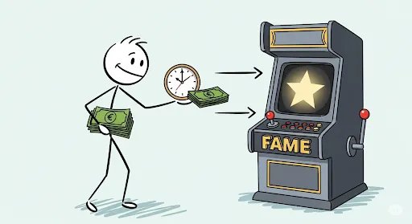
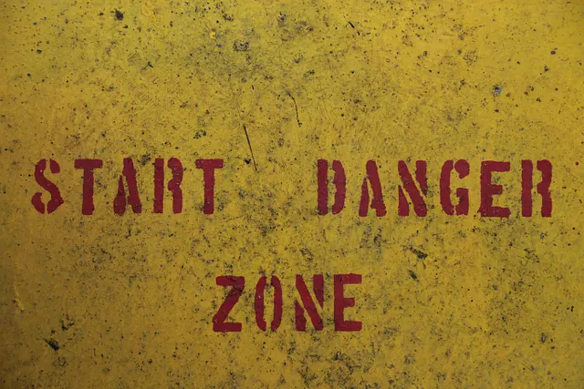

+++
title = "Mengapa Pemain Terbaik Anda Berhenti: Membedah Jebakan Sunk Cost Fallacy"
date = 2025-08-19T13:45:42+07:00
draft = false
socialshare = true
description = "Pelajari psikologi di balik Sunk Cost Fallacy. Pahami mengapa pengguna setia berhenti dan temukan strategi etis untuk meningkatkan pengalaman & retensi produk Anda."
image = "1.webp"
imageBig= "1.webp"
categories= ["Behavioral Insights"]
tags=["Behavioral Economics"]
authors= ["Daddy Ananta"]   
avatar="/images/profil.jpeg"
+++

## **Mengapa Pemain Terbaik Anda Berhenti: Membedah Jebakan Sunk Cost Fallacy**

Bayangkan pemain ideal Anda: ribuan jam tercatat, perlengkapan level tertinggi, pilar komunitas dalam *guild*-nya.

Metrik Anda menunjukkan dia adalah pengguna paling setia. Lalu suatu hari, dia lenyap. Tanpa peringatan, tanpa keluhan, akunnya menjadi tidak aktif selamanya. Ini bukan anomali; ini adalah gejala dari jebakan psikologis yang kuat. Pemain Anda tidak pergi karena bosan—dia pergi karena kelelahan. Dia tidak bermain karena cinta, tetapi karena terperangkap oleh beratnya investasi masa lalunya. Waktu, uang, dan usaha telah berubah dari lencana kehormatan menjadi sangkar tak terlihat, dan satu-satunya jalan keluar adalah dengan meninggalkan dunia game Anda sepenuhnya.

Photo by <a href="https://unsplash.com/@florianolv">Florian Olivo</a> on <a href="https://unsplash.com/">Unsplash</a>

Panduan ini akan membongkar sangkar tersebut, bukan untuk dieksploitasi, melainkan untuk mengubahnya menjadi peluang emas untuk merancang pengalaman yang membuat pengguna Anda **ingin** bertahan, bukan **merasa harus**.

## Anatomi Jebakan: Di Balik Waktu dan Uang yang Terbuang

Image from Imagen 3

Untuk memahami mengapa pengguna yang paling berinvestasi sekalipun bisa berhenti, kita harus melihat melampaui metrik keterlibatan dan masuk ke dalam cara kerja pikiran manusia. Jebakan *sunk cost* tidak dibangun oleh satu bata, melainkan oleh fondasi psikologis yang saling menguatkan.

### Pendorong #1: Kebutuhan untuk Konsisten (Efek Cialdini)

Kita memiliki hasrat mendalam untuk terlihat konsisten dengan keputusan masa lalu kita. Seperti yang dijelaskan secara brilian oleh Robert B. Cialdini dalam bukunya [*Influence*](https://www.goodreads.com/book/show/28815.Influence), sekali kita membuat komitmen—sekecil apa pun, seperti membuat karakter atau menyelesaikan tutorial—kita menghadapi tekanan internal dan eksternal untuk bertindak sesuai dengan komitmen tersebut. Pemain—dan jujur saja, kita semua—tidak hanya melanjutkan karena telah menginvestasikan 500 jam; kita melanjutkan karena berhenti berarti mengakui bahwa identitas "pemain setia" yang telah kita bangun adalah sebuah kesalahan.

### Pendorong #2: Rasa Sakit Akibat Pemborosan (Wawasan Kahneman)

Otak kita tidak dirancang untuk menjadi penilai statistik yang netral. Seperti yang ditunjukkan oleh Daniel Kahneman dalam [*Thinking, Fast and Slow*](https://www.goodreads.com/book/show/11468377-thinking-fast-and-slow), kita menderita "keengganan merugi" (*loss aversion*), di mana rasa sakit karena kehilangan terasa jauh lebih kuat daripada kesenangan dari keuntungan yang setara. Ketika Anda atau pemain Anda mempertimbangkan untuk berhenti, pikiran tidak menghitung potensi kesenangan di masa depan; ia terpaku pada ‘kerugian’ dari ribuan jam yang telah diinvestasikan, sebuah beban yang terasa jauh lebih nyata daripada janji kesenangan di masa depan.

"Penelitian di Psychology & Marketing menemukan bahwa individu dari latar belakang ekonomi rendah lebih rentan terhadap sunk cost karena persepsi 'pemborosan' yang lebih tinggi."

- Jihoon Jhang et al., [Psychology & Marketing](https://doi.org/10.1002/mar.21750)

### Pendorong #3: Tekanan Persepsi Sosial (Sinyal Kepercayaan)

Dalam lingkungan multipemain, berhenti bermain bukan hanya keputusan pribadi; itu adalah tindakan sosial. Sebuah studi yang menarik oleh Charles A. Dorison dkk. di [*Journal of Experimental Psychology: General*](https://doi.org/10.1037/xge0001101) menemukan bahwa orang yang menunjukkan eskalasi komitmen—bahkan pada keputusan yang buruk—dipersepsikan sebagai orang yang lebih dapat dipercaya. Tekanan untuk mempertahankan reputasi sosial ini menjadi jangkar yang sangat kuat, sering kali memaksa pemain untuk tetap *login* demi orang lain, jauh setelah kesenangan pribadi mereka memudar.

### Pendorong #4: Fokus pada Waktu yang Berlalu (Faktor Perhatian)

Bias *sunk cost* bukanlah proses yang pasif; ia diperkuat oleh apa yang kita perhatikan. Penelitian di [*Frontiers in Psychology*](https://doi.org/10.3389/fpsyg.2021.604843) oleh Rebecca Kazinka dkk. memberikan sebuah "revelasi" yang mengejutkan: ketika perhatian subjek dialihkan selama periode menunggu, kepekaan mereka terhadap *sunk cost* menghilang sepenuhnya. Layar pemuatan yang panjang atau *grinding* yang monoton secara tidak sengaja berfungsi sebagai bahan bakar yang menyalakan api *sunk cost fallacy*.

Memahami empat pendorong psikologis ini adalah langkah pertama yang krusial. Sekarang, mari kita alihkan lensa dari teori ke praktik: bagaimana Anda bisa melihat manifestasi dari jebakan ini dalam data dan umpan balik pengguna Anda sehari-hari?

## Cara Mendiagnosis Jebakan Sunk Cost pada Basis Pengguna Anda

Photo by <a href="https://unsplash.com/@hdbernd">Bernd 📷 Dittrich</a> on <a href="https://unsplash.com/">Unsplash</a>

Sebelum kita bisa merancang solusi, kita perlu belajar mengenali gejalanya. Mendeteksi kelelahan akibat *sunk cost* membutuhkan pergeseran dari sekadar melihat *apa* yang dilakukan pengguna menjadi memahami *mengapa* mereka melakukannya.

-   **Tanda Bahaya #1: *Grinding* Tanpa Kepuasan.** Perhatikan pola pada pengguna Anda di mana mereka secara rutin melakukan aktivitas berinvestasi tinggi yang memberikan imbalan atau kesenangan yang semakin berkurang.
-   **Tanda Bahaya #2: Bahasa Kewajiban.** Lakukan analisis sentimen pada ulasan dan forum. Cari kata kunci yang mencerminkan beban, bukan kesenangan: "Saya *harus* login," "terlalu *sayang* kalau berhenti sekarang," "saya *terlanjur* sejauh ini."
-   **Tanda Bahaya #3: Jangkar Sosial.** Cari grup pemain di mana interaksi sosial mereka (seperti obrolan tim) masih sangat aktif, sementara keterlibatan gameplay inti mereka menurun drastis.
-   **Catatan Peringatan:** Penting untuk tetap rendah hati dengan data kita. Seperti yang diperingatkan oleh Torben Ott dan timnya dalam [*Science Advances*](https://doi.org/10.1126/sciadv.abi7004), beberapa perilaku yang tampak seperti *sunk cost* sebenarnya bisa jadi merupakan artefak statistik yang disebut *attrition bias*.

Setelah Anda bisa mendiagnosis gejalanya, langkah selanjutnya adalah beralih dari pengamat menjadi arsitek solusi yang empatik.

## Playbook Proaktif: Mengubah Jebakan Menjadi Titik Balik

Tujuannya di sini bukanlah untuk menghilangkan komitmen, tetapi untuk mengubah komitmen yang didasari oleh rasa takut kehilangan menjadi komitmen yang didasari oleh antisipasi terhadap keuntungan di masa depan.

* **Strategi #1: Perkenalkan Sistem 'Warisan' (Legacy), Bukan Reset.** Rancanglah sistem dalam produk Anda di mana pencapaian lama memberikan bonus kecil, gelar unik, atau akses awal ke konten baru. Ini secara eksplisit menghormati *sunk cost* dan mengubahnya dari beban menjadi keuntungan.
    > **Contoh Nyata:** Menghadapi penurunan jumlah pemain aktif, [**Dota 2** meluncurkan "Swag Bag"](https://dotesports.com/dota-2/news/north-american-dota-returns-from-the-grave-to-claim-free-arcanas) yang memberikan item kosmetik langka (Arcana) dan Battle Pass secara gratis kepada pemain lama yang kembali. Langkah ini tidak mereset progres mereka, melainkan menghargai investasi masa lalu mereka. Hasilnya, terjadi lonjakan pemain hingga 56% di wilayah Amerika Utara, membuktikan bahwa menghormati "warisan" pemain adalah cara yang sangat efektif untuk re-engagement.

* **Strategi #2: Alihkan Fokus Perhatian.** Ubah waktu tunggu pasif menjadi momen keterlibatan aktif. Selama *matchmaking*, tampilkan kiat-kiat strategis. Selama perjalanan otomatis, sajikan potongan-potongan cerita (*lore*) yang mendalam.
    > **Contoh Nyata:** Daripada membiarkan pemain menatap progress bar, banyak game modern memanfaatkan layar pemuatan secara cerdas. [Diskusi di **UX Stack Exchange** menyoroti](https://ux.stackexchange.com/questions/65382/what-to-show-while-a-game-is-loading) bagaimana *Final Fantasy XIII* menampilkan ringkasan plot untuk menyegarkan ingatan pemain, sementara game lain menyajikan kiat gameplay atau informasi karakter. Ini mengubah waktu tunggu yang terasa seperti "biaya" menjadi momen pembelajaran dan persiapan yang berharga.

* **Strategi #3: Validasi Investasi Melalui Narasi.** Gunakan narasi untuk membingkai ulang investasi pemain. Buat mereka merasa bahwa semua upaya mereka adalah bagian penting dari sebuah cerita yang lebih besar yang kini mencapai babak baru yang menarik.
    > **Contoh Nyata:** Game *roguelike* [**Hades** dipuji karena penceritaannya yang fenomenal](https://www.polygon.com/analysis/454550/hades-best-video-game-story/) karena berhasil melakukan ini dengan sempurna. Setiap "kegagalan" atau pengulangan (investasi waktu pemain) bukanlah sebuah reset, melainkan bagian integral dari narasi. Karakter lain akan mengomentari upaya Anda sebelumnya, membuka dialog baru, dan memajukan cerita. Dengan demikian, *grinding* yang melelahkan diubah menjadi sebuah perjalanan naratif yang bermakna, memvalidasi setiap menit yang dihabiskan pemain.

* **Strategi #4: Ciptakan 'Jalur Keluar yang Terhormat'.** Bangun sistem yang memungkinkan pemain untuk mengurangi komitmen sosial mereka secara elegan, seperti peran "penasihat *guild*" bagi pemimpin yang ingin pensiun.
    > **Contoh Nyata:** **World of Warcraft** memiliki sistem formal untuk masalah ini. [Fitur "Dethrone"](https://us.support.blizzard.com/en/article/000050006) memungkinkan anggota *guild* dengan peringkat tinggi untuk mengambil alih kepemimpinan secara otomatis jika pemimpinnya telah nonaktif selama 90 hari. Ini adalah jalur keluar yang terhormat dan terstruktur, memastikan komunitas (*guild*) dapat terus berjalan tanpa bergantung pada satu orang yang mungkin sudah tidak ingin bermain lagi, sekaligus melepaskan beban sosial dari pemimpin yang nonaktif.

## Kesimpulan

Pada akhirnya, memahami *Sunk Cost Fallacy* bukanlah tentang menemukan trik baru untuk meningkatkan metrik. Ini adalah panggilan untuk desain yang lebih empatik dan berkelanjutan, yang menghormati masa lalu pengguna sambil membangun masa depan yang benar-benar mereka inginkan. Produk yang paling bertahan lama bukanlah yang menciptakan jebakan paling lengket, tetapi yang membangun jalur keluar paling terhormat dan menarik, dan pada akhirnya, membangun produk yang begitu bernilai sehingga bertahan bukanlah sebuah kewajiban, melainkan sebuah pilihan yang jelas.

<a href="https://daddyananta.github.io/categories/insight-psychology/">Baca artikel lain tentang Insight Psikologi</a>

## Referensi

Cialdini, R. B. (2006). Influence: The Psychology of Persuasion. <a href="https://www.goodreads.com/book/show/28815.Influence">Goodreads</a>

Kahneman, D. (2011). Thinking, Fast and Slow. <a href="https://www.goodreads.com/book/show/11468377-thinking-fast-and-slow">Goodreads</a>

McRaney, D. (2011). You Are Not So Smart. <a href="https://www.goodreads.com/book/show/10719005-you-are-not-so-smart">Goodreads</a>

Hodent, C. (2017). The Psychology of Video Games. <a href="https://www.goodreads.com/en/book/show/36205291">Goodreads</a>

Ronayne, D., Sgroi, D., & Tuckwell, A. (2021). Evaluating the sunk cost effect. <a href="https://doi.org/10.1016/j.jebo.2021.03.029">Journal of Economic Behavior & Organization</a>

Kazinka, R., MacDonald, A. W., & Redish, A. D. (2021). Sensitivity to Sunk Costs Depends on Attention to the Delay. <a href="https://doi.org/10.3389/fpsyg.2021.604843">Frontiers in Psychology</a>

Ott, T., Masset, P., Gouvêa, T. S., & Kepecs, A. (2022). Apparent sunk cost effect in rational agents. <a href="https://doi.org/10.1126/sciadv.abi7004">Science Advances</a>

Negrini, M., Riedl, A., & Wibral, M. (2022). Sunk cost in investment decisions. <a href="https://doi.org/10.1016/j.jebo.2022.06.028">Journal of Economic Behavior & Organization</a>

Dorison, C. A., Umphres, C. K., & Lerner, J. S. (2022). Staying the course: Decision makers who escalate commitment are trusted and trustworthy. <a href="https://doi.org/10.1037/xge0001101">Journal of Experimental Psychology: General</a>

Jhang, J., Lee, D. C., Park, J., Lee, J., & Kim, J. (2023). The impact of childhood environments on the sunk-cost fallacy. <a href="https://doi.org/10.1002/mar.21750">Psychology & Marketing</a>

Hamzagic, Z. I., Mah, E. Y., Derksen, D. G., & Bernstein, D. M. (2025). Sunk-cost judgments across the child to adult lifespan. <a href="https://doi.org/10.3758/s13423-025-02656-y">Psychonomic Bulletin & Review</a>

## Penelusuran Terkait

<ul>
<li><a href="https://app.uxcel.com/courses/ux-research/research-ethics-and-biases-978/sunk-cost-fallacy-2708">Sunk cost fallacy - Uxcel</a></li>
<li><a href="https://www.numberanalytics.com/blog/sunk-cost-fallacy-ux-design">Sunk Cost Fallacy in UX Design - Number Analytics</a></li>
<li><a href="https://www.joecotellese.com/posts/behavioral-psychology-product-management/">Behavioral Psychology in Product Management: Lessons from Predictably Irrational</a></li>
<li><a href="https://uxmag.com/articles/towards-an-ethics-of-persuasion">Towards an Ethics of Persuasion - UX Magazine</a></li>
<li><a href="https://www.cognitigence.com/blog/commitment-and-consistency-examples-in-modern-marketing">Commitment & Consistency: 5 Real-World Marketing Examples - Cognitigence</a></li>
<li><a href="https://artkai.io/blog/the-hooked-model">The Hooked Model: 4 Must-Follow Steps - Artkai</a></li>
<li><a href="https://medium.com/@aadityamajumder/the-science-of-engagement-in-ux-how-to-design-for-long-term-user-interaction-c3e898e20231">The Science of Engagement in UX: How to Design for Long-Term User Interaction - Medium</a></li>
<li><a href="https://dokonline.nl/en/sem/loss-aversion-a-threat-or-a-powerful-content-technique/">Loss aversion: A threat or a powerful content technique? - Dok Online</a></li>
</ul>