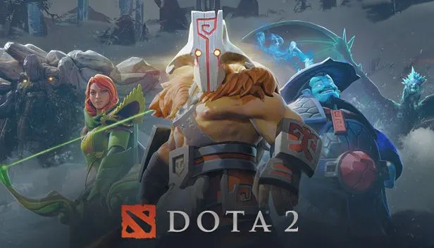
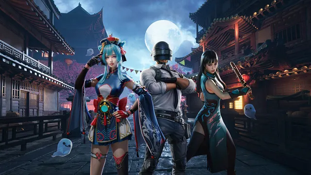
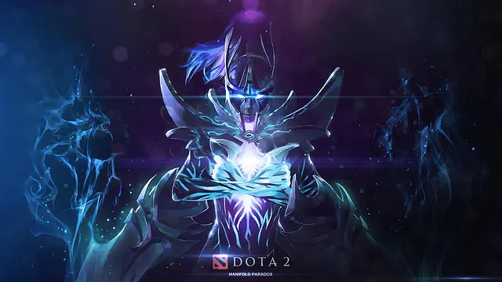

+++
title = "Mengapa Kita Membeli Skin dalam Game yang tidak 'Tak Berguna'?"
date = 2025-08-23T09:22:13+07:00
draft = false
socialshare = true
description = "Pelajari psikologi di balik pembelian skin game dan aset digital. Panduan ini menawarkan cetak biru monetisasi etis berbasis bukti akademis untuk para profesional."
image = "1.webp"
imageBig= "1.webp"
categories= ["Behavioral Insights"]
tags=["Behavioral Economics"]
authors= ["Daddy Ananta"]
avatar="/images/profil.jpeg"
+++

Di masa lalu, saya merupakan seorang pemain game MOBA yang cukup populer pada masanya, yaitu **Dota 2**. Permainan ini menampilkan pertarungan **5 vs 5 hero** dengan misi utama: tim kita harus menghancurkan wilayah kekuasaan tim lawan. Selama permainan berlangsung, setiap pemain menggunakan hero mereka masing-masing yang dapat dikustomisasi dengan berbagai skin atau kostum menarik. Tak jarang, saya melihat biaya yang dihabiskan untuk kostum tersebut mendekati, bahkan melebihi, jutaan rupiah.

  
 
 Dota 2<a href="https://www.linkedin.com/posts/yangshun_what-software-engineers-can-learn-from-dota-activity-7287725224538554368-OnOL"> Linkedin</a>

Bayangkan, Anda membayar Rp500.000 hanya untuk sebuah pedang virtual yang tidak menambah satu poin pun pada kekuatan karakter Anda. 

Kita semua pernah menyaksikan atau bahkan melakukan tindakan yang tampaknya tidak rasional ini: menghabiskan uang nyata untuk *skin*, kostum, atau stiker digital yang secara fungsional tidak bernilai apa-apa. Ini adalah paradoks piksel yang berharga, sebuah fenomena yang telah menciptakan pasar bernilai miliaran dolar. Pertanyaannya bukan lagi *apakah* orang mau membayar, tetapi *mengapa* otak kita begitu mudah terikat pada aset-aset tak berwujud ini?

Panduan ini akan membongkar mekanisme psikologis di baliknya—bukan untuk mengeksploitasi, melainkan untuk memahami cara menciptakan pengalaman yang benar-benar berharga bagi Anda dan pengguna Anda.

## Fondasi Kepemilikan Digital — "Ini Adalah Milikku"

Perasaan "memiliki" sesuatu di dunia digital sering kali dimulai dari sebuah investasi kecil. Bukan uang, melainkan usaha. Seperti yang dijelaskan Nir Eyal dalam model *Hook*-nya, setiap kali kita mencurahkan waktu, data, atau tenaga, kita sedang "menanam" sesuatu di dalam produk tersebut. Inilah yang membuat rantai *streak* di Duolingo terasa begitu personal; kita tidak ingin kehilangan api kecil yang telah kita jaga setiap hari. Perasaan ini berakar pada salah satu bias kognitif terkuat kita: kita menilai lebih tinggi apa yang kita rasa kita miliki.

### Mini-Studi: Kekuatan Kustomisasi Aktif (Efek IKEA)

  
 
 Customization<a href="https://www.dearplayers.com/my/events/pubg-mobile/rp-a9?srsltid=AfmBOoqY1na9a4EWcHiUzcPPoZA3nOzf879Gkn_1vfDhDAgAJ5zghhqn"> dearplayers.com</a>

Sama seperti kita lebih mencintai meja kopi reyot yang kita rakit sendiri, kita lebih menghargai avatar yang kita rancang dengan cermat. Sebuah penelitian di [<a href="https://doi.org/10.1016/j.tele.2024.102098" target="_blank">Telematics and Informatics</a>](https://doi.org/10.1016/j.tele.2024.102098) oleh Chung et al. memberikan bukti telak: ketika pengguna secara aktif **mengkustomisasi** (memilih dan merakit) avatar mereka, rasa kepemilikan psikologis (*psychological ownership*) yang timbul jauh lebih kuat dibandingkan jika mereka hanya **mempersonalisasi** (memilih dari template jadi). Usaha kecil dalam memilih warna rambut atau bentuk mata itu adalah perekat emosional pertama.

Proses ini diperdalam oleh fenomena yang disebut *avatar embodiment*. Studi oleh Lee & Kim di [<a href="https://doi.org/10.1016/j.chb.2025.108653" target="_blank">Computers in Human Behavior</a>](https://doi.org/10.1016/j.chb.2025.108653) menemukan sebuah jalur yang jelas: kustomisasi meningkatkan perasaan "menyatu" dengan avatar (*embodiment*), yang kemudian menumbuhkan rasa kepemilikan psikologis tidak hanya pada avatarnya, tetapi juga pada item-item yang melekat padanya. Saat avatar itu terasa seperti "aku", maka sepatunya pun terasa seperti "sepatuku". Inilah momen ajaib di mana item virtual berhenti menjadi sekadar kode dan mulai menjadi bagian dari identitas digital kita. Namun, memiliki sebuah identitas baru tidaklah cukup; dorongan manusiawi berikutnya adalah untuk menampilkan identitas tersebut kepada dunia. Di sinilah panggung sosial virtual berperan.

## Panggung Sosial Virtual — "Lihat Apa yang Kumiliki"

  
 
 Phantom Assasint -<a href="https://www.deviantart.com/neonkiler99/art/Phantom-Assassin-Manifold-Paradox-DOTA-2-495421602"> deviantart.com</a>

Setelah rasa kepemilikan terbentuk, kebutuhan fundamental berikutnya muncul: pengakuan sosial. Seperti yang dijelaskan oleh Thaler dan Sunstein dalam "Nudge", kita adalah makhluk sosial yang terus-menerus mencari petunjuk dari orang lain. Di dunia digital, *skin* dan item kosmetik adalah bahasa non-verbal yang sangat kuat untuk mengkomunikasikan status, dedikasi, atau afiliasi kita. Sebuah *skin* langka dari *event* yang telah berlalu tidak hanya sekadar hiasan; ia adalah lencana kehormatan yang berteriak, "Saya ada di sana, saya adalah bagian dari sejarah game ini."

### Mini-Studi: Dua Jalur Menuju Status
Namun, tidak semua sinyal status diciptakan sama. Bagi saya, wawasan paling menarik datang dari riset terbaru di [<a href="https://doi.org/10.1177/00222437251314368" target="_blank">Journal of Marketing Research</a>](https://doi.org/10.1177/00222437251314368) oleh Lowe et al. Riset ini menemukan bahwa kita mengejar status melalui dua jalur berbeda: **dominance** dan **prestige**.
* **Dominance:** Jalur ini ditempuh dengan cara menonjol, mengintimidasi, dan menarik perhatian secara agresif. Dalam dunia game, ini adalah *skin* dengan efek partikel yang menyala-nyala, suara yang menggelegar, dan desain yang mencolok.
* **Prestige:** Jalur ini diraih melalui rasa hormat dan kekaguman yang didapat dari keahlian atau pencapaian. Sinyalnya cenderung lebih halus, elegan, dan *understated*—sebuah *skin* minimalis yang hanya dikenali oleh sesama pemain veteran sebagai tanda pencapaian tertinggi.

Memahami dualitas ini membuka peluang desain yang luar biasa. Alih-alih membuat semua item "keren" dengan cara yang sama, kita bisa merancang untuk dua motivasi status yang berbeda. Memahami kekuatan motivasi internal dan eksternal ini bukan hanya kunci untuk desain yang lebih baik, tetapi juga untuk bisnis yang lebih etis. Ini membawa kita pada pertanyaan praktis: bagaimana kita menerapkan wawasan ini secara bertanggung jawab?

## Cetak Biru Monetisasi Psikologis yang Etis

  
 
 Photo by Sigmund on <a href="https://unsplash.com/?utm_source=medium&utm_medium=referral"> Unsplash</a>

Memahami psikologi ini membawa tanggung jawab besar. Tujuannya bukanlah untuk menjebak pengguna, melainkan untuk menciptakan sistem yang memuaskan kebutuhan mereka secara sukarela. Berikut adalah tiga strategi praktis untuk Anda terapkan.

### Prinsip #1: Prioritaskan Pengalaman Subjektif, Bukan Keunggulan Objektif
Inti dari kosmetik yang sukses adalah kemampuannya memperkaya pengalaman batin pemain. [Sebuah studi eksperimental di <a href="https://doi.org/10.3389/fpsyg.2021.770139" target="_blank">Frontiers in Psychology</a>](https://doi.org/10.3389/fpsyg.2021.770139) menemukan bahwa memberikan pemain pilihan untuk mengkustomisasi karakter mereka secara signifikan meningkatkan **identifikasi** dan **rasa kompeten** yang mereka rasakan. Menariknya, kustomisasi ini sama sekali **tidak mempengaruhi kinerja objektif** mereka dalam permainan. Wawasan ini adalah kunci emas: nilai sejati dari *skin* tidak terletak pada apa yang dilakukannya, tetapi pada apa yang Anda buat pengguna rasakan saat menggunakannya.

### Prinsip #2: Jadikan Belanja Bagian dari Kenikmatan Bermain
Sering kali, toko dalam game terasa seperti pengalaman transaksional yang dingin dan terpisah. Namun, [penelitian oleh Wang et al. di <a href="https://doi.org/10.1108/INTR-03-2024-0346" target="_blank">Internet Research</a>](https://doi.org/10.1108/INTR-03-2024-0346) menunjukkan bahwa ketika belanja virtual dibuat interaktif—memungkinkan pemain untuk "mencoba" item pada avatar mereka di lingkungan yang imersif—hal itu secara langsung meningkatkan **kenikmatan bermain (*game enjoyment*)** secara keseluruhan. Daripada hanya menampilkan katalog, bangunlah ruang virtual di mana pemain bisa bersosialisasi dan bereksperimen. Ubah "toko" menjadi "ruang ganti" atau "etalase pameran". Bayangkan sebuah fitur di mana tim bisa masuk ke 'ruang ganti' bersama sebelum pertandingan untuk menyelaraskan skin mereka, lengkap dengan pose tim yang bisa di-screenshot dan dibagikan.

### Prinsip #3: Desain untuk Ritual Positif, Bukan Ketergantungan
Gunakan prinsip "Nudge" untuk mendorong adopsi, bukan memaksa. Alih-alih notifikasi yang menciptakan kecemasan (*"Your streak is in danger!"*), gunakan dorongan sosial yang positif. Tampilkan informasi seperti, *"75% temanmu telah membuka item ini"*, atau *"Pemain di level keahlianmu sering menggunakan kombinasi ini"*. Ini mengubah keputusan pembelian dari tekanan individu menjadi partisipasi dalam norma komunitas yang relevan. Sebagai desainer, tugas Anda adalah mengundang, bukan menuntut.

---
Kita telah melihat bahwa di balik setiap pembelian *skin*, ada serangkaian kebutuhan psikologis yang mendalam: keinginan untuk menciptakan, kebutuhan untuk merasa memiliki, dan dorongan untuk berkomunikasi dalam sebuah komunitas. Monetisasi yang paling kuat dan berkelanjutan tidak datang dari penjualan keuntungan fungsional, melainkan dari pemenuhan kepuasan batin ini. Tugas kita sebagai perancang dan ahli strategi bukanlah untuk bertanya, "Bagaimana cara kita membuat pengguna membayar lebih banyak?" melainkan, "Bagaimana cara kita menciptakan nilai emosional dan sosial yang begitu besar sehingga pengguna dengan senang hati memilih untuk mendukungnya?"

Saat kita berhasil menjawabnya, pedang seharga Rp 500.000 itu berhenti menjadi transaksi yang tidak rasional; ia menjadi artefak dari sebuah pengalaman yang tak ternilai harganya.

<a href="https://daddyananta.github.io/categories/insight-psychology/">Baca artikel lain tentang Insight Psikologi</a>

## Referensi

Thielmann, C., et al. (2021). Character Customization With Cosmetic Microtransactions in Games: Subjective Experience and Objective Performance. <a href="https://doi.org/10.3389/fpsyg.2021.770139">Frontiers in Psychology</a>

Lee, J., & Kim, D. (2025). Me, my avatar, and my sneakers: The effect of avatar customization on the psychological ownership of virtual fashion items. <a href="https://doi.org/10.1016/j.chb.2025.108653">Computers in Human Behavior</a>

Chung, W. Y., et al. (2024). What factors affect psychological ownership when creating an avatar?: Focusing on customization and the ideal self. <a href="https://doi.org/10.1016/j.tele.2024.102098">Telematics and Informatics</a>

Wang, J., et al. (2025). Gotta take my avatar shopping: Impacts of interactive virtual esports marketplace on game enjoyment. <a href="https://doi.org/10.1108/INTR-03-2024-0346">Internet Research</a>

Lowe, M., et al. (2025). The Sound of Status: Product Volume as a Status Signal of Dominance or Prestige. <a href="https://doi.org/10.1177/00222437251314368">Journal of Marketing Research</a>

Eyal, N. (2014). <i>Hooked: How to Build Habit-Forming Products</i>. Portfolio/Penguin.

Thaler, R. H., & Sunstein, C. R. (2008). <i>Nudge: Improving Decisions About Health, Wealth, and Happiness</i>. Yale University Press.

## Penelusuran Terkait

<ul>
    <li><a href="https://www.researchgate.net/publication/276265219_Why_do_gamers_buy_virtual_assets_An_insight_in_to_the_psychology_behind_purchase_behavior">Why do gamers buy “virtual assets”? An insight in to the psychology behind purchase behavior</a></li>
    <li><a href="https://www.sae.edu/gbr/insights/ethical-considerations-in-game-design-and-monetisation/">Ethical Considerations in Game Design and Monetisation</a></li>
    <li><a href="https://octet.design/journal/ikea-effect/">The IKEA Effect: Learn To Leverage With Examples</a></li>
    <li><a href="https://medium.com/@priyankapgohil/the-ikea-effect-in-ux-design-crafting-digital-masterpieces-one-click-at-a-time-7688c1f4785f">The IKEA Effect in UX Design — Crafting Digital Masterpieces, One Click at a Time</a></li>
    <li><a href="https://thedecisionlab.com/biases/endowment-effect">Endowment Effect - The Decision Lab</a></li>
    <li><a href="https://www.investopedia.com/terms/e/endowment-effect.asp">Endowment Effect: Definition, What Causes It, and Example</a></li>
    <li><a href="https://www.coinbase.com/learn/tips-and-tutorials/why-do-nfts-matter-for-gamers">Why do NFTs matter for gamers? - Coinbase</a></li>
    <li><a href="https://www.numberanalytics.com/blog/ultimate-guide-loss-aversion-game-theory">Loss Aversion in Game Theory - Numbe    r Analytics</a></li>
</ul>