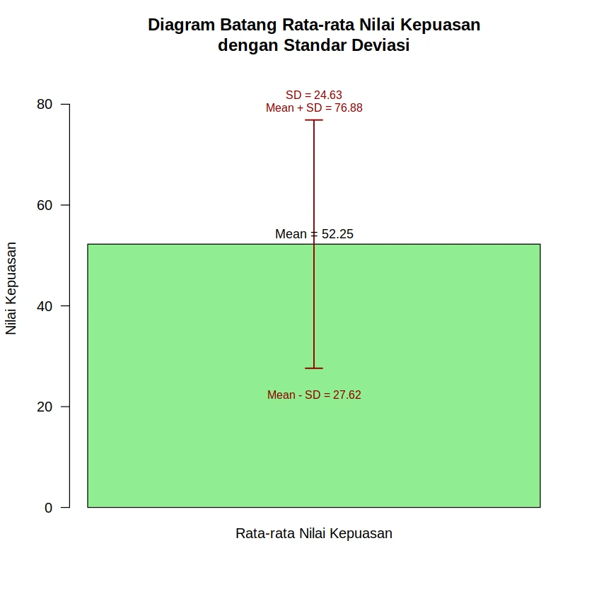

+++
title = '3 Ukuran Penyebaran Data (Range, Varians, Standar Deviasi)'
date = 2025-05-21T00:37:00+00:00
draft = false
socialshare = true
description = ""
image = "1.webp"
imageBig= "1.webp"
categories= ["Data Analysis Concepts"]
tags = ["R"]
authors= ["Daddy Ananta"]
avatar="/images/profil.jpeg"
+++

Ukuran penyebaran data adalah statistik yang menggambarkan sejauh mana nilai-nilai dalam suatu kumpulan data tersebar atau bervariasi dari nilai pusatnya. Ukuran ini memberikan informasi tentang keragaman atau homogenitas data. Jika ukuran penyebaran kecil, berarti data cenderung mengumpul di sekitar pusat; jika besar, berarti data lebih tersebar.

Secara umum terdapat beberapa Ukuran Penyebaran Data, namun kali ini kita akan fokus pada tiga yang utama:

- Range (Jangkauan)
- Variance (Varians)
- Standard Deviation (Simpangan Baku)

Kita akan menggunakan data dummy yang sama seperti sebelumnya untuk menghitungnya:

## Data Awal Nilai Kepuasan:

|Partisipan|Nilai Kepuasan|
|:--|:--|
|0|72|
|1|13|
|2|67|
|3|11|
|4|71|
|5|18|
|6|43|
|7|32|
|8|60|
|9|87|
|10|51|
|11|13|
|14|49|
|17|78|

Untuk mempermudah analisis, kita akan menggunakan data "Nilai Kepuasan" yang telah diurutkan dari yang terkecil hingga terbesar, seperti yang digunakan pada contoh sebelumnya: 

<div class="single-code" style="width: 100%; font: inherit; background-color: #f9f9f9; border:1px solid #ccc; color: #333; padding: 10px; border-radius: 5px; margin-bottom:20px; word-wrap: break-word; overflow-wrap: break-word; max-height: 200px; overflow-y: auto;"><p>$$11,14,15,22,25,38,39,45,58,59,61,61,64,65,67,68,79,81,86,87$$</p></div>

Total data (n)=20 & Mean ($\bar{x}$)=52.25.

---

## 1. Range (Jangkauan)

Range adalah selisih antara nilai terbesar dan nilai terkecil dalam kumpulan data. Ini adalah ukuran penyebaran yang paling sederhana.

### Rumus Range

<div class="single-code" style="width: 100%; font: inherit; background-color: #f9f9f9; border:1px solid #ccc; color: #333; padding: 10px; border-radius: 5px; margin-bottom:20px; word-wrap: break-word; overflow-wrap: break-word; max-height: 200px; overflow-y: auto;"><p>$$Range = \text{Nilai Maksimum} − \text{Nilai Minimum}$$</p></div>

**Perhitungan:** Dari data terurut: Nilai Maksimum =87 Nilai Minimum =11

Range = 87−11 

Range = 76

### Python Code


```python
# data
nilai_kepuasan = [11, 14, 15, 22, 25, 38, 39, 45, 58, 59, 61, 61, 64, 65, 67, 68, 79, 81, 86, 87]

# Fungsi max() dan min() bawaan Python
range_nilai = max(nilai_kepuasan) - min(nilai_kepuasan)
print(f"Range dari data tersebut sebesar: {range_nilai}")
```

**Output:**

```
Range dari data tersebut sebesar: 76
```

---

## 2. Variance (Varians)

Varians adalah rata-rata dari kuadrat selisih setiap nilai data dengan mean. Varians mengukur seberapa jauh setiap angka dalam set data dari mean (rata-rata), dan dengan demikian dari setiap angka lainnya dalam set.

### Rumus Varians (untuk sampel) 

<div class="single-code" style="width: 100%; font: inherit; background-color: #f9f9f9; border:1px solid #ccc; color: #333; padding: 10px; border-radius: 5px; margin-bottom:20px; word-wrap: break-word; overflow-wrap: break-word; max-height: 200px; overflow-y: auto;"><p>$$s^2= \frac{\sum^n_{i=1} ​(x_i​ − \bar{x})^2}{n-1}​$$</p></div>

Dimana: 

$s^2$ = Varians sampel 
$x_i$​ = Nilai data ke-i 
$\bar{x}$ = Mean sampel 
$n$ = Jumlah data

**Perhitungan:** 

Mean ($\bar{x}$)=52.25 
$n$ = 20

Pertama, hitung $(x_i​−\bar{x})^2$ untuk setiap nilai: 
<div class="single-code" style="width: 100%; font: inherit; background-color: #f9f9f9; border:1px solid #ccc; color: #333; padding: 10px; border-radius: 5px; margin-bottom:20px; word-wrap: break-word; overflow-wrap: break-word; max-height: 200px; overflow-y: auto;">

$(11−52.25)^2=(−41.25)^2=1701.5625$

$(14−52.25)^2=(−38.25)2=1463.0625$

$(15−52.25)^2=(−37.25)^2=1387.5625$

$(22−52.25)^2=(−30.25)^2=915.0625$

$(25−52.25)^2=(−27.25)^2=742.5625$

$(38−52.25)^2=(−14.25)^2=203.0625$

$(39−52.25)^2=(−13.25)^2=175.5625$

$(45−52.25)^2=(−7.25)^2=52.5625$

$(58−52.25)^2=(5.75)^2=33.0625$

$(59−52.25)^2=(6.75)^2=45.5625$

$(61−52.25)^2=(8.75)^2=76.5625$

$(61−52.25)^2=(8.75)^2=76.5625$

$(64−52.25)^2=(11.75)^2=138.0625$

$(65−52.25)^2=(12.75)^2=162.5625$

$(67−52.25)^2=(14.75)^2=217.5625$

$(68−52.25)^2=(15.75)^2=248.0625$

$(79−52.25)^2=(26.75)^2=715.5625$

$(81−52.25)^2=(28.75)^2=826.5625$

$(86−52.25)^2=(33.75)^2=1139.0625$ 

$(87−52.25)^2=(34.75)^2=1207.5625$</div>


Jumlah dari semua $(x_i​−\bar{x})^2$: 


<div class="single-code" style="width: 100%; font: inherit; background-color: #f9f9f9; border:1px solid #ccc; color: #333; padding: 10px; border-radius: 5px; margin-bottom:20px; word-wrap: break-word; overflow-wrap: break-word; max-height: 200px; overflow-y: auto;"><p>$$\sum(x_i​ − \bar{x})^2 = 1701.5625+1463.0625+...+1207.5625 = 9524.75$$</p></div>

Varians (s2): 

$s^2 = \frac{9524.75}{20 − 1}​ = \frac{9524.75​}{19}$
$s^2 = 501.3026$

### Python Code


```python
import numpy as np

# Asumsikan 'nilai_kepuasan' telah didefinisikan di blok sebelumnya
# ddof=1 (Delta Degrees of Freedom) digunakan untuk menghitung varians sampel (n-1),
# yang setara dengan fungsi var() di R.
varians_nilai = np.var(nilai_kepuasan, ddof=1)
print(f"Varians dari data tersebut sebesar: {varians_nilai}")
```

**Output:**

```
Varians dari data tersebut sebesar: 501.30263157894734
```

---

## 3. Standard Deviation (Simpangan Baku)

Standar deviasi adalah akar kuadrat dari varians. Ini adalah ukuran seberapa tersebarnya nilai-nilai dalam kumpulan data relatif terhadap mean. Standar deviasi dinyatakan dalam unit yang sama dengan data asli, membuatnya lebih mudah diinterpretasikan daripada varians.

### Rumus Standar Deviasi (untuk sampel):

<div class="single-code" style="width: 100%; font: inherit; background-color: #f9f9f9; border:1px solid #ccc; color: #333; padding: 10px; border-radius: 5px; margin-bottom:20px; word-wrap: break-word; overflow-wrap: break-word; max-height: 200px; overflow-y: auto;"><p>$$s = \sqrt{s^2}= \sqrt{\frac{\sum^n_{i=11}(x_i-\bar{x})^2}{n-1}}$$</p></div>


Dimana: 

s = Standar deviasi sampel 
$s^2$ = Varians sampel

**Perhitungan:** Dari perhitungan varians sebelumnya: 

$s^2 = 501.3026$

Standar Deviasi (s): 
$s = \sqrt{501.3026​}$
$s = 22.39$

### Python Code:
```python
# Asumsikan 'numpy' sebagai 'np' dan 'nilai_kepuasan' telah didefinisikan
# ddof=1 juga digunakan di sini agar setara dengan fungsi sd() di R
std_dev_nilai = np.std(nilai_kepuasan, ddof=1)
print(f"Standar Deviasi dari data tersebut sebesar: {std_dev_nilai}")
```

**Output:**

```
Standar Deviasi dari data tersebut sebesar: 22.38978855590378
```

### Visualiasi Standart Deviasi

```python
import matplotlib.pyplot as plt
import numpy as np

# Asumsikan 'nilai_kepuasan' telah didefinisikan di blok sebelumnya

# 1. Hitung Mean dan Standar Deviasi
mean_nilai = np.mean(nilai_kepuasan)
sd_nilai = np.std(nilai_kepuasan, ddof=1)

# Tampilkan nilai mean dan sd untuk referensi
print(f"Mean Nilai Kepuasan: {round(mean_nilai, 2)}")
print(f"Standar Deviasi Nilai Kepuasan: {round(sd_nilai, 2)}")

# 2. Persiapan untuk plotting
bar_label = "Rata-rata Nilai Kepuasan"

# 3. Membuat Bar Chart dengan Error Bar
fig, ax = plt.subplots()

# Membuat bar chart
ax.bar(bar_label, mean_nilai, color='lightgreen', edgecolor='black', zorder=2)

# Menambahkan error bar (setara dengan 'arrows' R)
ax.errorbar(
    bar_label, 
    mean_nilai,
    yerr=sd_nilai,      # yerr adalah +/- sd_nilai
    fmt='none',         # 'none' berarti tidak ada marker
    capsize=10,         # Menambahkan 'tudung' pada error bar
    color='darkred',
    elinewidth=1.5,     # Setara 'lwd=1.5'
    zorder=3
)

# Kustomisasi plot
ax.set_ylim(0, mean_nilai + sd_nilai + 10)
ax.set_title("Diagram Batang Rata-rata Nilai Kepuasan\ndengan Standar Deviasi")
ax.set_ylabel("Nilai Kepuasan")
ax.grid(axis='y', linestyle='--', alpha=0.7, zorder=1)

# Menambahkan teks
ax.text(bar_label, mean_nilai + 2, f"Mean = {round(mean_nilai, 2)}", 
        color="black", ha='center', va='bottom', fontsize=9)
ax.text(bar_label, mean_nilai + sd_nilai + 5, f"SD = {round(sd_nilai, 2)}", 
        color="darkred", ha='center', va='bottom', fontsize=8)
ax.text(bar_label, mean_nilai - sd_nilai - 3, f"Mean - SD = {round(mean_nilai - sd_nilai, 2)}", 
        color="darkred", ha='center', va='top', fontsize=8)
ax.text(bar_label, mean_nilai + sd_nilai, f"Mean + SD = {round(mean_nilai + sd_nilai, 2)}", 
        color="darkred", ha='center', va='bottom', fontsize=8)

plt.show()
```

<div>
  
</div>

## Kesimpulan

**Range** itu jarak antara nilai paling kecil dan paling besar. Jadi, misalnya kamu punya angka 2, 5, dan 9, maka range-nya 9 - 2 = 7.

**Varians** itu seperti ngukur seberapa beda-beda angka dari rata-ratanya. Tapi caranya agak unik: beda-beda itu dihitung pakai **kuadrat** (dikali dirinya sendiri).  Kalau variansnya kecil, berarti angkanya mirip-mirip semua, gak beda jauh

Kalau **Standar Deviasi (SD)** makin kecil, misalnya mendekati **1** atau bahkan **0**, itu artinya data kamu makin **rapi** atau **mirip-mirip**. Jadi, **semakin kecil SD, hasilnya makin bisa dipercaya atau valid**. Bayangin kamu dan teman-temanmu semua dapat nilai ulangan hampir sama, misalnya 80, 81, 79. Nah, SD-nya kecil. Itu bagus, karena nilainya nggak jauh beda—artinya pengukuran atau penilaiannya konsisten.
