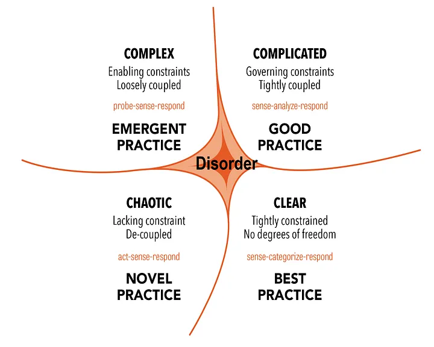

+++
title= "Ambang Batas Kepastian: Validasi Statistik untuk Target UX yang Terbukti Andal"
date = 2025-06-23T00:37:00+00:00
draft = true
socialshare = true
description = ""
image = "1.webp"
imageBig= "1.webp"
categories= ["Data Analysis Concepts"]
tags= [ "Uji Binomial", "Riset UX", "Statistik", "Pengujian Hipotesis", "P-Value" ]
authors= ["Daddy Ananta"]
avatar="/images/profil.jpeg"
+++


<div style="background-color:#f9f9f9; border: 1px solid #d3d3d3; padding: 15px; font-family: Arial, sans-serif;margin-bottom: 20px;">
  <p style="font-style: italic;">"Tanpa data, Anda hanyalah orang lain dengan sebuah opini."</p>
  <p style="text-align: right; font-size: 0.9em; margin-top: 10px; color: #555;">- W. Edwards Deming, <span style="font-weight: bold;">Prinsip Manajemen Kualitas</span></p>
</div>

Kalimat ini sering kita dengar, namun dalam praktik riset UX, sekadar memiliki data saja tidaklah cukup. Kita sering terjebak pada angka yang terlihat meyakinkan di permukaan. "9 dari 10 pengguna berhasil," sebuah laporan yang disambut senyum, namun menyimpan pertanyaan krusial: Apakah ini bukti keunggulan desain, atau sekadar keberuntungan dari sampel kecil yang kita uji? Inilah jurang antara observasi sederhana dan pembuktian statistik—sebuah langkah esensial untuk mematangkan praktik desain berbasis data dan membuat keputusan yang benar-benar kokoh.

Bayangkan seorang koki pastry yang sedang mengembangkan resep croissant baru. Tujuannya ambisius: resep ini harus "andal", yang ia definisikan sebagai "tingkat keberhasilan mengembang sempurna setidaknya 90%". Ia melakukan 20 kali percobaan dan 18 di antaranya berhasil (tingkat keberhasilan observasi 90%). Apakah ia bisa dengan percaya diri meluncurkan resep ini? Intuisi mengatakan "ya", namun seorang ahli statistik akan bertanya: "Jika tingkat keberhasilan sebenarnya dari resep ini lebih rendah (misalnya hanya 85%), seberapa besar kemungkinan Anda bisa mendapatkan hasil sebagus 18 dari 20 ini hanya karena faktor keberuntungan acak?" Menjawab pertanyaan ini adalah inti dari pengujian hipotesis, sebuah cara untuk melindungi diri dari optimisme palsu.

<div style="background-color:#f9f9f9; border: 1px solid #d3d3d3; padding: 15px; font-family: Arial, sans-serif;margin-bottom: 20px;">
  <p style="font-style: italic;">"Without data, you're just another person with an opinion."</p>
  <p style="text-align: right; font-size: 0.9em; margin-top: 10px; color: #555;">- W. Edwards Deming, <span style="font-weight: bold;">Out of the Crisis</span></p>
</div>

## **Kerangka Cynefin Mengapa Validasi Statistik Penting**


<div class="single-image-source">
  
  <p style="font-size: 16px; color: #888; margin-top:-15px; text-align: center;"> Understanding the Cynefin Framework and how we can use it from Diego Moscardi in<a href="https://medium.com/@diego_moscardi/understanding-the-cynefin-framework-and-how-we-can-use-it-56360e263cc7"> Medium</a></p>
</div>

Untuk memahami di mana proses ini berada dalam pengambilan keputusan, kita bisa meminjam Kerangka Cynefin. Kerangka ini membagi masalah menjadi empat domain: *Obvious* (Jelas), *Complicated* (Rumit), *Complex* (Kompleks), dan *Chaotic* (Kacau).

Observasi sederhana ("9 dari 10 berhasil") sering kali berada di domain *Obvious*. Kita melihat data dan menarik kesimpulan langsung. Namun, ini bisa menipu. Validasi statistik memindahkan masalah ke domain *Complicated*. Di sini, kita tahu ada hubungan sebab-akibat, tetapi kita memerlukan analisis ahli (statistik) untuk memahaminya. Dengan menerapkan uji statistik yang tepat, kita mengubah ketidakpastian ("Apakah kita beruntung?") menjadi probabilitas yang terukur. Tujuannya adalah untuk mendapatkan bukti yang cukup kuat sehingga keputusan kita di masa depan menjadi *Obvious* dan dapat dipertahankan.

## **Mekanisme Pembuktian Memilih Alat yang Tepat**

Inti dari validasi ini adalah uji hipotesis satu-proporsi. Kita menetapkan "hipotesis nol" ($H_0$) yang pesimistis, misalnya "Tingkat keberhasilan sejati $\le$ benchmark". Tujuan kita adalah mengumpulkan cukup bukti untuk menolak hipotesis ini. Alat yang kita gunakan bergantung pada ukuran sampel kita, yang ditentukan oleh "Aturan 15":

-   **Sampel Dianggap Besar:** Jika jumlah keberhasilan DAN jumlah kegagalan keduanya minimal 15.
-   **Sampel Dianggap Kecil:** Jika salah satu dari jumlah tersebut di bawah 15.

Mayoritas pengujian *usability* kualitatif atau studi dengan sampel terbatas akan masuk dalam kategori sampel kecil.

### Skenario Sampel Kecil Uji Binomial Eksak

Ketika data kita tidak memenuhi "Aturan 15", kita menggunakan Uji Binomial Eksak. Metode ini secara langsung menghitung probabilitas mendapatkan hasil yang kita amati (atau yang lebih ekstrem), dengan asumsi hipotesis nol benar.

Hasil perhitungannya disebut *p-value*. Ini adalah probabilitas mendapatkan data kita jika tingkat keberhasilan sebenarnya sama dengan benchmark. Jika *p-value* sangat kecil (standar umumnya < $0.05$), kita bisa menolak hipotesis nol. Namun, metode ini dikenal "konservatif", artinya ia cenderung melebih-lebihkan *p-value*, sehingga lebih sulit untuk membuktikan keberhasilan. Untuk mengatasi sifat konservatif tersebut, para praktisi sering menggunakan *mid-p-value*.

<div style="background-color:#f9f9f9; border: 1px solid #d3d3d3; padding: 15px; font-family: Arial, sans-serif;margin-bottom: 20px;">
  <p style="font-style: italic;">"Our goal should be to be helpfully right versus precisely wrong."</p>
  <p style="text-align: right; font-size: 0.9em; margin-top: 10px; color: #555;">- Cassie Kozyrkov, <span style="font-weight: bold;">Towards Data Science</span></p>
</div>

### Skenario Sampel Besar Uji-z (Aproksimasi Normal)

Hanya ketika Anda memiliki data yang melimpah (misalnya dari survei skala besar atau pengujian tanpa moderator) di mana "Aturan 15" terpenuhi, Anda dapat menggunakan Uji-z. Tes ini menggunakan aproksimasi kurva normal untuk menghitung *p-value*, yang secara komputasi lebih sederhana.

## **Contoh Kasus Bukti dari Lapangan**

### Bencana Desain Ulang Snapchat (2018)

<div class="single-image-source">
  
  <p style="font-size: 16px; color: #888; margin-top:-15px; text-align: center;"> SNAPCHAT from Alexander Shatov in<a href="https://unsplash.com/photos/blue-and-white-cloud-cartoon-character-fRjjnN_8njo"> Unsplash</a></p>
</div>

Pada awal 2018, Snap Inc. meluncurkan desain ulang besar-besaran yang memicu penolakan besar dari pengguna. Selebriti seperti Kylie Jenner secara terbuka menyatakan ketidaksenangannya, diikuti oleh lebih dari 1 juta petisi. Akibatnya, harga saham Snap turun hampir 8%, menghapus sekitar $1,3 miliar dari valuasi pasar perusahaan. Peristiwa ini menjadi pelajaran penting tentang risiko mengambil keputusan produk berdasarkan validasi terbatas dan mengabaikan sinyal negatif dari pengguna utama.

### Personalisasi Gambar di Netflix Data Bertemu Estetika

<div class="single-image-source">
  
  <p style="font-size: 16px; color: #888; margin-top:-15px; text-align: center;"> NETFLIX from freestocks in<a href="https://unsplash.com/photos/person-holding-remote-pointing-at-tv-11SgH7U6TmI"> Unsplash</a></p>
</div>

Netflix dikenal luas karena kemampuannya dalam memanfaatkan data untuk personalisasi. Salah satu contohnya adalah personalisasi gambar mini (*thumbnail*). Alih-alih satu gambar untuk semua, sistem Netflix secara cerdas menyesuaikan gambar berdasarkan preferensi pengguna. Sebelum diluncurkan, Netflix mengujinya menggunakan pendekatan statistik canggih, dari A/B *testing* hingga *contextual bandits*, untuk memilih gambar yang terbukti secara signifikan meningkatkan kemungkinan penayangan. Pelajarannya jelas: bahkan elemen subjektif seperti visual bisa dijadikan objek eksperimen ilmiah jika kita memiliki data dan sistem yang tepat.

## **Contoh Soal dan Pengerjaan**

**Konteks:**
Sebuah tim e-commerce mendesain ulang alur *checkout*. Benchmark mereka adalah: **"Tingkat keberhasilan penyelesaian *checkout* harus di atas 85%."** Mereka menguji dengan 25 pengguna, hasilnya 23 berhasil dan 2 gagal.

**Pertanyaan:**
Apakah tim memiliki bukti statistik yang cukup untuk mengklaim telah melampaui benchmark 85%? Gunakan tingkat signifikansi standar ($α = 0.05$).

**Langkah-langkah Pengerjaan:**

1.  **Identifikasi Parameter:**
    * Ukuran Sampel ($n$): 25
    * Jumlah Keberhasilan ($x$): 23
    * Jumlah Kegagalan: 2
    * Tingkat Keberhasilan Observasi ($\hat{p}$): $23/25 = 92\%$
    * Benchmark ($p_0$): $0.85$ (atau 85%)

2.  **Periksa Syarat Ukuran Sampel:**
    * Jumlah keberhasilan (23) $\ge 15$.
    * Jumlah kegagalan (2) $< 15$.
    * Kesimpulan: Karena jumlah kegagalan kurang dari 15, ini adalah kasus sampel kecil. Kita harus menggunakan **Uji Binomial Eksak**.

3.  **Tentukan Hipotesis:**
    * Hipotesis Nol ($H_0$): Tingkat keberhasilan sebenarnya sama dengan atau kurang dari benchmark ($\pi \le 0.85$).
    * Hipotesis Alternatif ($H_a$): Tingkat keberhasilan sebenarnya lebih besar dari benchmark ($\pi > 0.85$). Ini adalah uji satu sisi (*one-tailed*).

4.  **Hitung Probabilitas Binomial:**
    Kita perlu menghitung probabilitas mendapatkan hasil seekstrem yang kita amati (23 sukses) atau lebih ekstrem (24 atau 25 sukses), dengan asumsi $\pi = 0.85$.

    <div class="single-code" style="width: 100%; font: inherit; background-color: #f9f9f9; border:1px solid #ccc; color: #333; padding: 10px; border-radius: 5px; margin-bottom:20px; word-wrap: break-word; overflow-wrap: break-word; max-height: 200px; overflow-y: auto;">
    <p>$$ P(x) = \frac{n!}{x!(n-x)!} p^x (1-p)^{n-x} $$</p>

      <p></div>


    <div class="single-code" style="width: 100%; font: inherit; background-color: #f9f9f9; border:1px solid #ccc; color: #333; padding: 10px; border-radius: 5px; margin-bottom:20px; word-wrap: break-word; overflow-wrap: break-word; max-height: 200px; overflow-y: auto;">
    $$ P(x=23) = \frac{25!}{23!(2)!}(0.85)^{23} (0.15)^{2} \approx 0.1812 $$
      </p>
    </div>
    <div class="single-code" style="width: 100%; font: inherit; background-color: #f9f9f9; border:1px solid #ccc; color: #333; padding: 10px; border-radius: 5px; margin-bottom:20px; word-wrap: break-word; overflow-wrap: break-word; max-height: 200px; overflow-y: auto;">
      <p>
    $$ P(x=24) = \frac{25!}{24!(1)!} (0.85)^{24} (0.15)^{1} \approx 0.1027 $$
      </p>
    </div>
    <div class="single-code" style="width: 100%; font: inherit; background-color: #f9f9f9; border:1px solid #ccc; color: #333; padding: 10px; border-radius: 5px; margin-bottom:20px; word-wrap: break-word; overflow-wrap: break-word; max-height: 200px; overflow-y: auto;">
      <p>
    $$ P(x=25) = \frac{25!}{25!(0)!} (0.85)^{25} (0.15)^{0} \approx 0.0172 $$
      </p>
    </div>

5.  **Hitung p-value dan mid-p-value:**
    * *Exact p-value* = $P(23) + P(24) + P(25) = 0.1812 + 0.1027 + 0.0172 = \mathbf{0.3011}$
    * *Mid-p-value* = $\frac{1}{2}P(23) + P(24) + P(25) = (0.5 \times 0.1812) + 0.1027 + 0.0172 = 0.0906 + 0.1027 + 0.0172 = \mathbf{0.2105}$

6.  **Interpretasi dan Keputusan:**
    Tingkat signifikansi yang kita tetapkan adalah $\alpha=0.05$. Baik *Exact p-value* (0.3011) maupun *Mid-p-value* (0.2105) keduanya jauh lebih besar dari 0.05.
    **Kesimpulan:** Kita gagal menolak hipotesis nol. Meskipun tingkat keberhasilan observasi (92%) terlihat lebih tinggi dari benchmark (85%), secara statistik, hasil ini tidak cukup kuat. Ada kemungkinan yang cukup tinggi (sekitar 21% menurut *mid-p-value*) bahwa hasil ini bisa terjadi secara kebetulan. Tim tidak dapat mengklaim telah memenuhi target mereka secara statistik.

---

### Otomatisasi Perhitungan dengan Python

Perhitungan Uji Binomial Eksak, terutama p-value, sangat ideal untuk diotomatiskan. *Library* `scipy.stats` di Python dapat melakukan ini secara efisien.

```python
from scipy import stats
import numpy as np

# --- Variabel yang Perlu Diisi ---
jumlah_keberhasilan = 23
ukuran_sampel = 25
benchmark_probabilitas = 0.85
alpha = 0.05

# --- Fungsi Perhitungan Statistik (Uji Binomial Eksak) ---

def hitung_p_value_binomial(x, n, p0):
    """Menghitung p-value dan mid-p-value untuk uji binomial satu sisi (greater)."""
    # Menghitung probabilitas untuk setiap hasil dari x hingga n
    probabilitas_ekstrem = [stats.binom.pmf(k, n, p0) for k in range(x, n + 1)]
    
    # p-value adalah jumlah dari semua probabilitas ekstrem
    exact_p_value = np.sum(probabilitas_ekstrem)
    
    # mid-p-value mengurangi setengah dari probabilitas kejadian yang diamati
    probabilitas_observasi = stats.binom.pmf(x, n, p0)
    mid_p_value = exact_p_value - (0.5 * probabilitas_observasi)
    
    return exact_p_value, mid_p_value

# --- Fungsi untuk Pengambilan Keputusan ---

def ambil_keputusan_statistik(p_value, signifikansi, metode):
    """Membandingkan p-value dengan alpha untuk membuat kesimpulan."""
    print(f"--- Keputusan berdasarkan {metode} ---")
    print(f"{metode}: {p_value:.4f}")
    print(f"Tingkat Signifikansi (α): {signifikansi}")
    
    if p_value < signifikansi:
        print("Status: Hipotesis Nol Ditolak.")
        print("Kesimpulan: Ada bukti statistik yang cukup untuk menyatakan target telah terlampaui.")
    else:
        print("Status: Gagal Menolak Hipotesis Nol.")
        print("Kesimpulan: Tidak cukup bukti statistik untuk mengklaim target telah terlampaui.")

# --- Proses Kalkulasi dan Interpretasi ---

tingkat_keberhasilan_observasi = jumlah_keberhasilan / ukuran_sampel
print(f"Tingkat Keberhasilan Observasi: {tingkat_keberhasilan_observasi:.0%}")
print("-" * 45)

# Menghitung p-value
p_value_eksak, mid_p_val = hitung_p_value_binomial(jumlah_keberhasilan, ukuran_sampel, benchmark_probabilitas)

# Menampilkan hasil dan mengambil keputusan menggunakan kedua metode p-value
ambil_keputusan_statistik(p_value_eksak, alpha, "Exact p-value")
print("") # Memberi spasi
ambil_keputusan_statistik(mid_p_val, alpha, "Mid-p-value")
```

```Output
Tingkat Keberhasilan Observasi: 92%
---------------------------------------------
--- Keputusan berdasarkan Exact p-value ---
Exact p-value: 0.3011
Tingkat Signifikansi (α): 0.05
Status: Gagal Menolak Hipotesis Nol.
Kesimpulan: Tidak cukup bukti statistik untuk mengklaim target telah terlampaui.

--- Keputusan berdasarkan Mid-p-value ---
Mid-p-value: 0.2105
Tingkat Signifikansi (α): 0.05
Status: Gagal Menolak Hipotesis Nol.
Kesimpulan: Tidak cukup bukti statistik untuk mengklaim target telah terlampaui.
```
---
## **Kesimpulan**
Membandingkan tingkat keberhasilan dengan benchmark lebih dari sekadar membandingkan dua angka persentase. Ini adalah tentang menerapkan disiplin statistik untuk mengukur kepastian kita. Dengan memahami kapan harus menggunakan Uji Binomial (dengan mid-p-value sebagai andalan) untuk studi UX umum dan kapan Uji-z sesuai, tim dapat mengubah percakapan dari "Saya rasa ini berhasil" menjadi "Kami memiliki bukti statistik dengan tingkat kepercayaan 95% bahwa kami telah melampaui target". Langkah ini sangat penting untuk membangun produk yang tidak hanya terlihat bagus di atas kertas, tetapi terbukti andal di dunia nyata.

Temukan lebih banyak artikel mendalam mengenai metodologi riset di kategori <a href="http://localhost:1313/categories/quantitative/">Quantitative</a> kami.

## Referensi

<p style="text-indent:0px;">Deming, W. E. (2018). Out of the Crisis. <a href="https://books.google.co.id/books/about/Out_of_the_Crisis.html?id=I2oHnAEACAAJ&redir_esc=y">The MIT Press.</a></p>

## Penelusuran Terkait

<ul>
    <li><a href="https://www.researchgate.net/profile/James-Lewis-8/publication/265822607_Binomial_Confidence_Intervals_for_Small-Sample_Usability_Studies/links/544acec20cf2bcc9b1d35238/Binomial-Confidence-Intervals-for-Small-Sample-Usability-Studies.pdf">Binomial Confidence Intervals for Small Sample Usability Studies</a></li>
    <li><a href="https://measuringu.com/completion-rate/">10 Things to Know About Completion Rates</a></li>
    <li><a href="https://qualaroo.com/blog/measure-user-experience/">Key UX Metrics & 8 KPIs to Measure User Experience</a></li>
    <li><a href="https://unbounce.com/ab-testing/ab-testing-results/">How to analyze A/B testing results: A simple 6-step guide</a></li>
    <li><a href="https://www.usability.gov/how-to-and-tools/methods/usability-testing.html">Usability Testing</a></li>
    <li><a href="A Guide to Sample Sizes in UX Research — It’s Not “Test with 5”!">A Guide to Sample Sizes in UX Research — It’s Not “Test with 5”!</a></li>
    <li><a href="https://international.binus.ac.id/graphic-design/2023/11/13/the-nine-principles-of-ux-design-psychology-can-you-predict-the-behavior-of-your-users/">The Nine Principles of UX Design Psychology: Can You Predict the Behavior of Your Users?</a></li>
</ul>