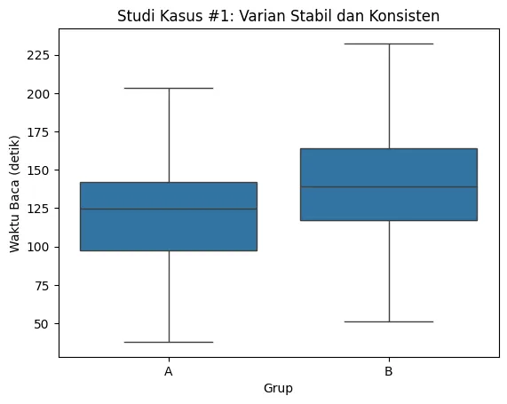
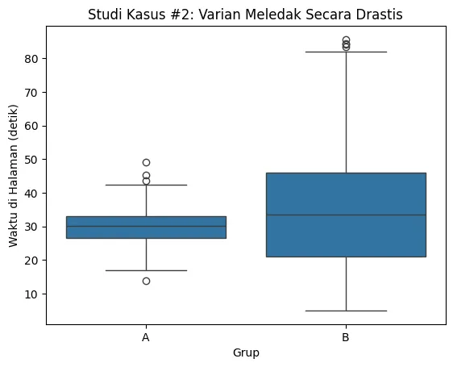

+++
title = "Analisis Varian A-B Test: Saat Kenaikan Rata-rata Adalah Sinyal Bahaya"
date = 2025-08-27T23:49:26+07:00
draft = true
socialshare = true
description = "Studi kasus komparatif di Python yang menunjukkan bagaimana varian tersembunyi dapat menyesatkan hasil A/B test dan kapan kenaikan rata-rata adalah berita buruk."
image = "1.webp"
imageBig= "1.webp"
categories= ["Data Analysis Concepts"]
tags =  ["asumsi-statistik"]
authors= ["Daddy Ananta"]
avatar="/images/profil.jpeg"
url = "/posts/data-analysis-concept/analisis-varian-a-b-test-saat-kenaikan-rata-rata-adalah-sinyal-bahaya/"
aliases = [
    "/posts/quantitative/analisis-varian-a-b-test-saat-kenaikan-rata-rata-adalah-sinyal-bahaya/"
]
+++

	
Tim Anda baru saja menyelesaikan A/B test selama dua minggu. Hasilnya masuk, dan ada kabar baik: varian desain B yang baru menunjukkan kenaikan rata-rata *engagement* sebesar 8% dibandingkan kontrol. Secara naluriah, ini adalah lampu hijau untuk peluncuran. Tetapi, bagaimana jika saya katakan bahwa di dalam "kemenangan" ini tersembunyi sinyal bahaya yang bisa merusak pengalaman sebagian besar pengguna Anda? Metrik rata-rata seringkali menyembunyikan kebenaran yang tidak nyaman tentang variabilitas.

Artikel ini akan membedah dua studi kasus A/B test secara berdampingan: satu yang merupakan kemenangan sejati, dan satu lagi di mana kenaikan rata-rata sebenarnya adalah pertanda buruk. Anda akan belajar cara menggunakan analisis varian sebagai "kacamata x-ray" untuk melihat di balik rata-rata dan membuat keputusan produk yang benar-benar aman dan cerdas.

## Jebakan Rata-rata dalam A/B Testing

### Ilusi Kesuksesan: Mengapa Metrik Rata-rata Saja Bisa Berbahaya
Dalam analisis A/B testing, tujuan kita adalah mencari pemenang. Metrik yang paling sering kita andalkan adalah **rata-rata** (mean)—rata-rata *conversion rate* atau rata-rata *time on page*. Jika rata-rata grup varian lebih tinggi dari kontrol, kita cenderung menganggapnya sebagai kemenangan. Namun, pendekatan ini memiliki titik buta yang berbahaya. Sebuah kenaikan rata-rata bisa saja didorong oleh segelintir pengguna yang sangat antusias, sementara di saat yang sama mengorbankan pengalaman mayoritas.

<div style="background-color:#f9f9f9; border: 1px solid #d3d3d3; padding: 15px; font-family: Arial, sans-serif;margin-bottom: 20px;">
<p style="font-style: italic;">"Pria yang kepalanya di dalam kulkas dan kakinya di dalam oven, secara rata-rata akan merasa nyaman."</p>
<p style="text-align: right; font-size: 0.9em; margin-top: 10px; color: #555;">- Pepatah Umum, <span style="font-weight: bold;">Mengilustrasikan Bahaya Rata-rata</span></p>
</div>

### Varian sebagai Ukuran Konsistensi Pengalaman
Di sinilah konsep **varian** masuk sebagai proksi untuk **konsistensi pengalaman pengguna**.
* **Varian Rendah:** Pengalaman pengguna konsisten dan dapat diprediksi. Sebagian besar pengguna bereaksi dengan cara yang serupa.
* **Varian Tinggi:** Pengalaman pengguna tidak konsisten. Reaksi pengguna sangat beragam—ada yang sangat suka, ada yang sangat tidak suka.

Menggunakan analogi **"Kompetisi yang Adil"**, membandingkan rata-rata tanpa memeriksa varian sama seperti membandingkan dua pelari di mana satu berlari di trek kering (varian rendah) dan yang lainnya di trek berlumpur (varian tinggi). Perbandingan tersebut pada dasarnya tidak adil.

### Memahami Varian Secara Matematis (Opsional)
Secara matematis, varian sampel ($s^2$) mengukur seberapa jauh setiap titik data ($x_i$) tersebar dari rata-rata sampel ($\bar{x}$).

$$
s^2 = \frac{\sum_{i=1}^{n}(x_i - \bar{x})^2}{n-1}
$$

Formula ini menunjukkan bahwa semakin besar jarak antara titik data dan rata-ratanya, semakin besar pula nilai variannya.

## Contoh Kasus: Dua Sisi Medali A/B Testing

### Studi Kasus #1: Kemenangan yang Jelas dan Konsisten
Mari kita tetapkan *baseline* seperti apa A/B test yang sukses itu. Bayangkan sebuah situs berita menguji dua judul artikel (Grup A vs. Grup B) dengan metrik "waktu baca rata-rata".

#### Persiapan Data
Kita akan membuat data di mana Judul B tidak hanya meningkatkan waktu baca rata-rata tetapi juga menjaga konsistensi sebaran data (varian yang mirip).

```python
import pandas as pd
import numpy as np
import seaborn as sns
import matplotlib.pyplot as plt
from scipy import stats

# Konfigurasi data untuk skenario ideal
np.random.seed(101)
n_samples_ideal = 300
# Grup A: Rata-rata 120 detik, standar deviasi 30
waktu_baca_a = np.random.normal(loc=120, scale=30, size=n_samples_ideal)
# Grup B: Rata-rata 140 detik, standar deviasi 32 (mirip dengan A)
waktu_baca_b = np.random.normal(loc=140, scale=32, size=n_samples_ideal)

df_ideal = pd.DataFrame({
    'grup': ['A'] * n_samples_ideal + ['B'] * n_samples_ideal,
    'waktu_baca': np.concatenate([waktu_baca_a, waktu_baca_b])
})
print(df_ideal.head())
```

```Output
  grup  waktu_baca
0    A  201.205495
1    A  138.843981
2    A  147.239083
3    A  135.114773
4    A  139.533538

```


#### Diagnosis Statistik
Sekarang, mari kita periksa "kondisi trek" untuk kedua grup ini.

```python
# Visualisasi dengan Boxplot
sns.boxplot(x='grup', y='waktu_baca', data=df_ideal)
plt.title('Studi Kasus #1: Varian Stabil dan Konsisten')
plt.ylabel('Waktu Baca (detik)')
plt.xlabel('Grup')
plt.show()

# Uji homogenitas varian dengan Levene's Test
grup_a_ideal = df_ideal[df_ideal['grup'] == 'A']['waktu_baca']
grup_b_ideal = df_ideal[df_ideal['grup'] == 'B']['waktu_baca']
stat_ideal, p_value_ideal = stats.levene(grup_a_ideal, grup_b_ideal)

# Menampilkan hasil uji dan rata-rata
print(f"Rata-rata Grup A: {grup_a_ideal.mean():.2f}")
print(f"Rata-rata Grup B: {grup_b_ideal.mean():.2f}")
print(f"P-value Levene's Test: {p_value_ideal:.4f}")
```


```Output
Rata-rata Grup A: 121.52
Rata-rata Grup B: 140.00
P-value Levene's Test: 0.0853
```

<div class="single-image-source">
  
</div>

P-value yang tinggi (jauh di atas ambang batas umum 0.05) mengonfirmasi apa yang kita lihat di boxplot: **tidak ada perbedaan varian yang signifikan secara statistik** antara kedua grup.

#### Keputusan Bisnis
Kombinasi dari rata-rata Grup B yang lebih tinggi secara signifikan dan varian yang stabil adalah sinyal terkuat dari sebuah A/B test yang sukses. Keputusan Anda jelas: **luncurkan Judul B**.

---

### Studi Kasus #2: Kemenangan yang Menipu
Sekarang, mari kita beralih ke skenario yang lebih rumit, di mana rata-rata menceritakan kisah yang tidak lengkap.

#### Persiapan Data
Sebuah aplikasi FinTech menguji tombol "Upgrade Premium" (Grup A: statis vs. Grup B: animasi) dengan metrik `waktu_di_halaman`.

```python
# Konfigurasi data untuk skenario berbahaya
np.random.seed(42)
n_samples = 500
# Grup A: Pengalaman konsisten (varian rendah)
waktu_a = np.random.normal(loc=30, scale=5, size=n_samples)
# Grup B: Pengalaman tidak konsisten (varian tinggi)
waktu_b = np.random.normal(loc=33, scale=20, size=n_samples)

# Pastikan tidak ada waktu negatif
waktu_a = np.clip(waktu_a, 5, None)
waktu_b = np.clip(waktu_b, 5, None)

df = pd.DataFrame({
    'grup': ['A'] * n_samples + ['B'] * n_samples,
    'waktu_di_halaman': np.concatenate([waktu_a, waktu_b])
})

print(df.head())

```

```Output

  grup  waktu_di_halaman
0    A         32.483571
1    A         29.308678
2    A         33.238443
3    A         37.615149
4    A         28.829233

```

#### Diagnosis Statistik
Mari kita jalankan diagnosis yang sama pada data ini.

```python
# Visualisasi dengan Boxplot
sns.boxplot(x='grup', y='waktu_di_halaman', data=df)
plt.title('Studi Kasus #2: Varian Meledak Secara Drastis')
plt.ylabel('Waktu di Halaman (detik)')
plt.xlabel('Grup')
plt.show()

# Uji homogenitas varian dengan Levene's Test
grup_a = df[df['grup'] == 'A']['waktu_di_halaman']
grup_b = df[df['grup'] == 'B']['waktu_di_halaman']
stat, p_value = stats.levene(grup_a, grup_b)

# Menampilkan hasil uji dan rata-rata
print(f"Rata-rata Grup A: {grup_a.mean():.2f}")
print(f"Rata-rata Grup B: {grup_b.mean():.2f}")
print(f"P-value Levene's Test: {p_value}")
```

```Output
Rata-rata Grup A: 30.03
Rata-rata Grup B: 34.22
P-value Levene's Test: 1.806543768332392e-89
```
<div class="single-image-source">
  
</div>


Rata-rata Grup B memang lebih tinggi, tetapi Levene's Test memberikan **p-value yang praktis nol**. Ini adalah bukti statistik konklusif bahwa asumsi homogenitas varian telah dilanggar secara signifikan. "Kondisi trek" sama sekali tidak adil.

#### Diagnosis: Mengidentifikasi "Fitur Polarisasi"
Varian yang meledak adalah sinyal bahaya. Ini menandakan bahwa tombol animasi tersebut adalah **fitur polarisasi**: sebagian kecil pengguna mungkin sangat menyukainya (menghabiskan banyak waktu), tetapi sebagian besar pengguna mungkin sangat tidak menyukainya atau bingung (langsung meninggalkan halaman), sehingga menciptakan sebaran data yang sangat lebar. Rata-rata yang sedikit lebih tinggi menyembunyikan fakta bahwa kita mungkin menciptakan pengalaman yang buruk bagi mayoritas pengguna.

#### Keputusan Bisnis
Mengabaikan varian dan meluncurkan Fitur B adalah keputusan yang sangat berisiko. Keputusan yang tepat adalah: **jangan meluncurkan Fitur B**. Lakukan investigasi lebih lanjut.

## Kerangka Kerja Keputusan "Lihat di Balik Rata-rata"

Untuk menghindari jebakan ini, integrasikan kerangka kerja ini ke dalam setiap analisis A/B test Anda.

### Flowchart Pengambilan Keputusan A/B Test
Gunakan diagram ini untuk memandu analisis Anda langkah demi langkah.


flowchart TD
    classDef startEnd fill:#1A5D1A,stroke:#609966,stroke-width:2px,color:#fff;
    classDef decision fill:#674188,stroke:#C3ACD0,stroke-width:2px,color:#fff;
    classDef process fill:#4A5568,stroke:#A0AEC0,stroke-width:2px,color:#fff;
    classDef danger fill:#C70039,stroke:#900C3F,stroke-width:2px,color:#fff;

    A["Mulai Analisis A/B Test"]:::startEnd;
    B["1. Bandingkan Rata-rata"]:::process;
    C{"Apakah Rata-rata B > A?"}:::decision;
    D["Varian B tidak menang. Hentikan/Iterasi"]:::danger;
    E["2. Uji Varian (Levene's Test)"]:::process;
    F{"Apakah Varian Stabil? (p > 0.05)"}:::decision;
    G["✅ Kemenangan Sejati. Luncurkan Varian B"]:::startEnd;
    H["3. Varian Meledak!"]:::process;
    I["🔥 Bahaya! Fitur Polarisasi. JANGAN LUNCURKAN"]:::danger;
    J["Investigasi: Siapa segmen yang suka/tidak suka?"]:::process;

    A --> B;
    B --> C;
    C -- Ya --> E;
    C -- Tidak --> D;
    E --> F;
    F -- Ya --> G;
    F -- Tidak --> H;
    H --> I;
    I --> J;


### Playbook Interpretasi

* **Rata-rata Naik, Varian Stabil (p > 0.05):**
    * **Interpretasi:** Kemenangan sejati. Perubahan yang Anda buat diterima secara positif dan konsisten oleh pengguna.
    * **Tindakan:** **Luncurkan.**

* **Rata-rata Naik, Varian Meledak (p < 0.05):**
    * **Interpretasi:** Bahaya! Anda memiliki fitur polarisasi. Kenaikan rata-rata didorong oleh sekelompok kecil pengguna, sementara mayoritas mungkin memiliki pengalaman yang lebih buruk.
    * **Tindakan:** **Jangan luncurkan. Investigasi** lebih dalam.

* **Rata-rata Stabil, Varian Turun:**
    * **Interpretasi:** Kemenangan konsistensi. Anda berhasil membuat pengalaman lebih dapat diprediksi, mengurangi hasil yang sangat buruk meskipun tidak meningkatkan rata-rata secara signifikan.
    * **Tindakan:** **Pertimbangkan untuk diluncurkan**, terutama jika tujuan bisnisnya adalah stabilitas atau pengurangan risiko.

### Langkah Selanjutnya Jika Varian Berbeda: Welch's t-test dan Segmentasi

1.  **Gunakan Uji Statistik yang Tepat:** Jika varian berbeda (heteroscedasticity), Student's t-test standar menjadi tidak valid. Sebagai gantinya, gunakan **Welch's t-test**, yang tidak mengasumsikan varian yang sama.
    ```python
    # Contoh penggunaan Welch's t-test
    t_stat, p_val_welch = stats.ttest_ind(grup_a, grup_b, equal_var=False)
    print(f"P-value dari Welch's t-test: {p_val_welch}")
    ```
    ```Output

    P-value dari Welch's t-test: 1.2774820512749592e-06

    ```
    Ini akan memberi tahu Anda apakah perbedaan rata-rata tetap signifikan secara statistik bahkan setelah memperhitungkan perbedaan varian.

    <div style="background-color: #f8f9fa; border: 1px solid #e0e0e0; border-radius: 12px; padding: 25px; margin: 30px 0; font-family: 'Segoe UI', Arial, sans-serif; box-shadow: 0 6px 20px rgba(0,0,0,0.08);">
        <h4 style="margin-top: 0; margin-bottom: 12px; font-size: 22px; color: #333; text-align: center; line-height: 1.4;">Praktik Langsung: <strong style="color: #007bff;">Unduh Kode Lengkap</strong></h4>
        <p style="font-size: 16px; color: #555; margin-bottom: 25px; text-align: center; line-height: 1.7;">
            Ingin mencoba sendiri analisis ini? Unduh Jupyter Notebook yang berisi seluruh kode dari seri tiga bagian ini, mulai dari persiapan data hingga audit reliabilitas.
        </p>
        <div style="text-align: center;">
            <a href="Analisis Varian A-B Test: Saat Kenaikan Rata-rata Adalah Sinyal Bahaya.ipynb" download
               style="display: inline-flex; align-items: center; justify-content: center; background-color: #007bff; color: #ffffff; padding: 15px 30px; font-size: 18px; font-weight: bold; text-decoration: none; border-radius: 10px; box-shadow: 0 4px 15px rgba(0, 123, 255, 0.3); transition: all 0.3s ease; letter-spacing: 0.5px;">
                <svg xmlns="http://www.w3.org/2000/svg" width="22" height="22" viewBox="0 0 24 24" fill="currentColor" style="margin-right: 10px;">
                    <path d="M19 9h-4V3H9v6H5l7 7 7-7zM5 18v2h14v-2H5z"></path>
                </svg>
                Unduh Jupyter Notebook (.ipynb)
            </a>
            <p style="font-size: 14px; color: #6c757d; margin-top: 12px; margin-bottom: 0;">
                Ukuran file: 60,2 kB
            </p>
        </div>
    </div>

2.  **Lakukan Investigasi via Segmentasi:** Jawaban "investigasi" berarti Anda harus membedah data. Cari tahu **siapa** pengguna yang berada di ekor distribusi (sangat suka atau sangat tidak suka).
    * Apakah mereka pengguna baru atau pengguna lama?
    * Apakah mereka berasal dari negara tertentu?
    * Apakah mereka menggunakan perangkat seluler atau desktop?

Segmentasi ini dapat mengubah "fitur yang gagal" menjadi wawasan produk yang sangat berharga untuk personalisasi di masa depan.

## Kesimpulan

Pelajaran terpenting dari studi kasus ini adalah bahwa varian bukanlah sekadar *noise* statistik; varian adalah **sinyal bisnis yang kaya akan wawasan**. Mengabaikannya berarti Anda hanya melihat sebagian kecil dari cerita. Dengan menjadikan analisis varian sebagai bagian standar dari laporan A/B test Anda, Anda tidak lagi hanya seorang pelapor angka; Anda menjadi penjaga gerbang kualitas pengalaman produk, bersenjatakan kemampuan untuk membedakan antara pertumbuhan sejati dan ilusi yang berisiko.

<a href="https://daddyananta.github.io//categories/analysis-and-visualization/">Jelajahi lebih dalam tentang Analysis & Visualization</a>

## Referensi dan Penelusuran Terkait

<ul>
  <li><strong>Levene's Test:</strong>
    <a href="https://docs.scipy.org/doc/scipy/reference/generated/scipy.stats.levene.html">scipy.stats.levene — SciPy Manual</a>,
    <a href="https://en.wikipedia.org/wiki/Levene%27s_test">Levene’s Test — Wikipedia</a>
  </li>
  <li><strong>Homogeneity of Variances:</strong>
    <a href="https://www.statisticssolutions.com/the-assumption-of-homogeneity-of-variance/">Homogeneity of Variance — Statistics By Jim</a>
  </li>
  <li><strong>Welch's t-test:</strong>
    <a href="https://en.wikipedia.org/wiki/Welch%27s_t-test">Welch’s t-test — Wikipedia</a>
  </li>
  <li><strong>General A/B Testing:</strong>
    <a href="https://hbr.org/2017/06/a-refresher-on-ab-testing">A Refresher on A/B Testing — Harvard Business Review</a>,
    <a href="https://en.wikipedia.org/wiki/A/B_testing">A/B Testing — Wikipedia</a>
  </li>
</ul>
