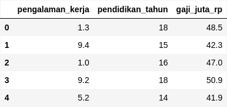
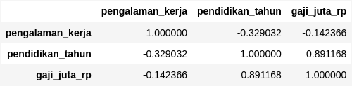
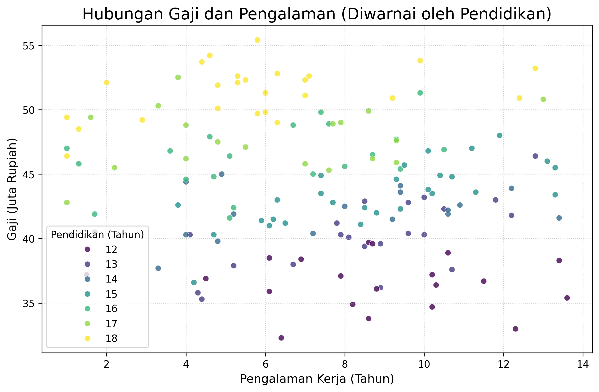
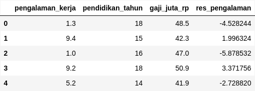
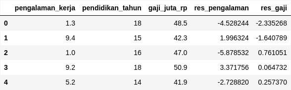
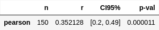

+++
title = "Di Balik Layar Korelasi Parsial: Membangunnya dari Nol dengan Python dan Residual"
date = 2025-08-27T23:43:26+07:00
draft = false
socialshare = true
description = "Pernah bertanya-tanya apa artinya 'mengontrol' variabel? Panduan konseptual ini membongkar cara kerja korelasi parsial dengan membangunnya dari nol di Python."
image = "1.webp"
imageBig= "1.webp"
categories= ["Data Analysis Concepts"]
tags =  ["uji-korelasi"]
authors= ["Daddy Ananta"]
avatar="/images/profil.jpeg"
+++


Dalam analisis data, frasa "setelah mengontrol variabel Z" seringkali terdengar seperti sihir statistik. Bagaimana mungkin kita bisa secara matematis "menjaga sesuatu tetap konstan" pada dataset yang sudah dikumpulkan? Apakah kita memanipasi data? Ataukah ini sebuah 'kotak hitam' yang hanya bisa kita percayai outputnya? Kebingungan ini seringkali membuat analis ragu untuk menggunakan salah satu alat paling kuat untuk mendekati hubungan sebab-akibat: **korelasi parsial**.

Dalam artikel ini, kita akan membongkar kotak hitam tersebut. Kita akan belajar bahwa di balik konsep yang terdengar rumit ini terdapat sebuah ide yang sangat intuitif: **'korelasi dari sisa-sisa' (residual)**. Melalui panduan langkah-demi-langkah dengan Python, kita akan membangun korelasi parsial dari nol dan membuktikan bahwa kita tidak perlu menjadi seorang ahli statistik untuk benar-benar memahami cara kerjanya.

---

## Skenario Masalah: Hubungan yang Membingungkan

Mari kita mulai dengan sebuah skenario klasik dari analisis HR. Kita ingin memahami hubungan antara `pengalaman_kerja` dan `gaji_juta_rp`. Kita curiga bahwa `pendidikan_tahun` mungkin menjadi variabel perancu (*confounder*), yaitu variabel yang memengaruhi baik pengalaman maupun gaji, sehingga mengaburkan hubungan asli di antara keduanya.

Pertama, mari kita siapkan data simulasi.

```python
import pandas as pd
import numpy as np
import seaborn as sns
import matplotlib.pyplot as plt
import statsmodels.api as sm
import pingouin as pg

# Simulasi data
np.random.seed(42)
n_karyawan = 150
pendidikan_tahun = np.random.randint(12, 19, size=n_karyawan)
pengalaman_kerja = -0.5 * pendidikan_tahun + np.random.normal(loc=15, scale=3, size=n_karyawan)
pengalaman_kerja = np.clip(pengalaman_kerja, 1, 25).round(1)
gaji_juta_rp = (2.5 * pendidikan_tahun) + (0.2 * pengalaman_kerja) + np.random.normal(loc=5, scale=2, size=n_karyawan)
gaji_juta_rp = np.clip(gaji_juta_rp, 10, 80).round(1)

df = pd.DataFrame({
    'pengalaman_kerja': pengalaman_kerja,
    'pendidikan_tahun': pendidikan_tahun,
    'gaji_juta_rp': gaji_juta_rp
})

df.head()

```
<div class="single-image-source">
  
</div>


---

## Memahami Masalah dengan Analogi 

Bayangkan kita sedang mencoba mendengarkan **stasiun radio musik klasik yang siarannya lemah** (ini adalah hubungan murni antara `pengalaman_kerja` dan `gaji_juta_rp`). Masalahnya, ada **stasiun berita lokal yang sangat kuat dan bising** (`pendidikan_tahun`) yang frekuensinya berdekatan.

Stasiun berita yang bising ini menyebabkan dua masalah:
1.  Suaranya **bocor dan mengganggu** siaran musik kita, membuatnya terdengar lebih keras dari yang sebenarnya. (Pengaruh `pendidikan` pada `gaji`).
2.  Dengungannya juga **mengganggu sinyal lain** di sekitarnya, termasuk kebisingan latar belakang yang kita kira adalah kesunyian. (Pengaruh `pendidikan` pada `pengalaman_kerja`).

Jika kita langsung menilai kerasnya suara musik, kesimpulan kita akan salah karena tercampur oleh suara berita. Tugas kita sebagai analis adalah menjadi seorang teknisi audio: **kita harus menyaring (filter) semua suara bising yang berasal dari stasiun berita** dari sinyal musik kita. Apa yang tersisa setelah penyaringan itulah "suara musik yang sebenarnya".

Dalam statistik, "menyaring kebisingan" ini persis apa yang kita lakukan saat kita menghitung **residual**.

---

## Korelasi Sederhana: Pandangan yang Menyesatkan

Sekarang mari kita buktikan analogi tadi dengan data. Langkah pertama yang biasa dilakukan adalah menghitung matriks korelasi sederhana (*bivariate*).

```python
### ---- Matriks Korelasi Bivariate (Sederhana): ---- ####
df.corr()
```

<div class="single-image-source">
  
</div>


Dari matriks di atas, kita melihat korelasi **negatif yang sangat lemah ($r = -0.142$)** antara `pengalaman_kerja` dan `gaji_juta_rp`. Ini adalah "sinyal musik yang tercampur noise". Jika berhenti di sini, kita bisa salah menyimpulkan bahwa pengalaman kerja justru sedikit menurunkan gaji, sebuah kesimpulan yang aneh.

Mari kita lihat visualisasinya.

```python
plt.figure(figsize=(10, 6))
sns.scatterplot(data=df, x='pengalaman_kerja', y='gaji_juta_rp', hue='pendidikan_tahun', palette='viridis', alpha=0.8)
plt.title('Hubungan Gaji dan Pengalaman (Diwarnai oleh Pendidikan)', fontsize=16)
plt.xlabel('Pengalaman Kerja (Tahun)', fontsize=12)
plt.ylabel('Gaji (Juta Rupiah)', fontsize=12)
plt.legend(title='Pendidikan (Tahun)')
plt.grid(True, linestyle=':', alpha=0.6)
plt.show()
```

<div class="single-image-source">
  
</div>


Perhatikan plot di atas. Secara keseluruhan, **tidak ada tren yang jelas terlihat**, yang sejalan dengan nilai korelasi yang mendekati nol. Plot ini terlihat seperti awan titik tanpa arah yang pasti. Ini adalah tanda visual klasik dari "gangguan" variabel perancu (`pendidikan_tahun`) yang mengaburkan hubungan sebenarnya.

---

## Intuisi Inti: Korelasi dari Sisa-Sisa (Residuals)

Di sinilah letak keindahan korelasi parsial. Idenya sederhana:

> Hubungan murni antara **Pengalaman** dan **Gaji** (setelah mengontrol **Pendidikan**) adalah korelasi antara:
> 1.  Bagian dari **Pengalaman** yang *tidak* bisa dijelaskan oleh **Pendidikan**.
> 2.  Bagian dari **Gaji** yang *juga tidak* bisa dijelaskan oleh **Pendidikan**.

Bagian yang "tidak dapat dijelaskan" inilah yang kita sebut **residual** atau "sinyal bersih" dalam analogi kita.

### Diagram Alur Konseptual

Proses ini dapat divisualisasikan dengan diagram alur sederhana berikut:


flowchart TD
    %% Mendefinisikan kelas gaya yang konsisten
    classDef process fill:#4A5568,stroke:#A0AEC0,stroke-width:2px,color:#fff;
    classDef intermediate fill:#d1ecf1,stroke:#bee5eb,stroke-width:2px,color:#0c5460;
    classDef result fill:#28a745,stroke:#28a745,stroke-width:2px,color:#fff;
    %% Mendefinisikan node/titik dalam flowchart
    A["Pengalaman Kerja (X)"]:::process;
    B["Pendidikan (Z)"]:::process;
    D["Gaji (Y)"]:::process;
    C{"Residual Pengalaman"}:::intermediate;
    E{"Residual Gaji"}:::intermediate;
    F("Korelasi Parsial"):::result;
    %% Menghubungkan semua node
    A -->|Regresi Linear| C;
    B --> A;
    B --> D;
    D -->|Regresi Linear| E;
    C -->|Korelasi Pearson| F;
    E -->|Korelasi Pearson| F;


---

## Implementasi Manual Langkah-demi-Langkah dengan Python

Untuk mendapatkan 'sisa-sisa' ini, kita akan menggunakan regresi linear. Ingat, tujuan kita di sini bukan untuk prediksi, tetapi untuk "menyaring noise".

### Langkah 1: "Bersihkan" Pengalaman dari Pengaruh Pendidikan

```python
# Definisikan variabel dependen (X) dan independen/kontrol (Z)
X = df['pengalaman_kerja']
Z = sm.add_constant(df['pendidikan_tahun']) # Tambahkan konstanta untuk intercept

# Lakukan model regresi linear: Pengalaman ~ Pendidikan
model_pengalaman = sm.OLS(X, Z).fit()

# Ambil residualnya dan simpan ke dataframe
df['res_pengalaman'] = model_pengalaman.resid
df.head()
```

<div class="single-image-source">
  
</div>


### Langkah 2: "Bersihkan" Gaji dari Pengaruh Pendidikan

```python
# Definisikan variabel dependen (Y)
Y = df['gaji_juta_rp']

# Lakukan model regresi linear: Gaji ~ Pendidikan
model_gaji = sm.OLS(Y, Z).fit()

# Ambil residualnya dan simpan ke dataframe
df['res_gaji'] = model_gaji.resid
df.head()

```

<div class="single-image-source">
  
</div>

### Langkah 3: Korelasikan Kedua Residual

Sekarang kita memiliki dua variabel 'murni' yang telah 'dibersihkan' dari pengaruh pendidikan. Dengan menghitung korelasi Pearson di antara keduanya, kita sedang mengukur hubungan asli yang tersembunyi.

```python
# Hitung korelasi Pearson sederhana antara kedua residual
korelasi_manual_parsial = df['res_pengalaman'].corr(df['res_gaji'])

print(f"Hasil Korelasi Parsial (Manual dari Residual): r = {korelasi_manual_parsial:.4f}")
```
```Output

Hasil Korelasi Parsial (Manual dari Residual): r = 0.3521

```


Hasilnya, **$r = 0.3521$**, menunjukkan hubungan **positif yang moderat**. Inilah "suara musik asli" kita, yang sangat berbeda dari sinyal awal yang bising dan menyesatkan ($r = -0.142$).

---

## Validasi dengan Library: Jalan Pintas yang Kini Dapat Kita Percayai

Proses manual tadi sangat bagus untuk memahami konsep. Namun dalam praktik, kita menggunakan fungsi yang sudah dioptimalkan seperti `pingouin.partial_corr`.

```python
# Hitung korelasi parsial menggunakan library
korelasi_parsial_df = pg.partial_corr(data=df, x='pengalaman_kerja', y='gaji_juta_rp', covar='pendidikan_tahun')

### ---- Hasil Korelasi Parsial (dari Library Pingouin): ------ ####
korelasi_parsial_df
```
<div class="single-image-source">
  
</div>


### Momen "Aha!"

Perhatikan nilai `r` dari output Pingouin: **0.3521**. Nilai ini **identik** dengan hasil perhitungan manual kita. Ini adalah momen pencerahan: hubungan yang awalnya tampak negatif lemah kini terbukti **positif dan moderat** setelah kita 'membersihkan' pengaruh pendidikan. Fenomena di mana variabel ketiga menyembunyikan hubungan asli seperti ini dikenal sebagai **efek supresor (*suppressor effect*)**.


<div style="background-color: #f8f9fa; border: 1px solid #e0e0e0; border-radius: 12px; padding: 25px; margin: 30px 0; font-family: 'Segoe UI', Arial, sans-serif; box-shadow: 0 6px 20px rgba(0,0,0,0.08);">
    <h4 style="margin-top: 0; margin-bottom: 12px; font-size: 22px; color: #333; text-align: center; line-height: 1.4;">Praktik Langsung: <strong style="color: #007bff;">Unduh Kode Lengkap</strong></h4>
    <p style="font-size: 16px; color: #555; margin-bottom: 25px; text-align: center; line-height: 1.7;">
        Ingin mencoba sendiri analisis ini? Unduh Jupyter Notebook yang berisi seluruh kode.
    </p>
    <div style="text-align: center;">
        <a href="Di Balik Layar Korelasi Parsial: Membangunnya dari Nol dengan Python dan Residual.ipynb" download
           style="display: inline-flex; align-items: center; justify-content: center; background-color: #007bff; color: #ffffff; padding: 15px 30px; font-size: 18px; font-weight: bold; text-decoration: none; border-radius: 10px; box-shadow: 0 4px 15px rgba(0, 123, 255, 0.3); transition: all 0.3s ease; letter-spacing: 0.5px;">
            <svg xmlns="http://www.w3.org/2000/svg" width="22" height="22" viewBox="0 0 24 24" fill="currentColor" style="margin-right: 10px;">
                <path d="M19 9h-4V3H9v6H5l7 7 7-7zM5 18v2h14v-2H5z"></path>
            </svg>
            Unduh Jupyter Notebook (.ipynb)
        </a>
        <p style="font-size: 14px; color: #6c757d; margin-top: 12px; margin-bottom: 0;">
            Ukuran file: 115,3 kB 
        </p>
    </div>
</div>


---

## Menambahkan Dimensi Matematis

Di balik metode residual, terdapat formula matematis yang ringkas untuk korelasi parsial antara variabel X dan Y, dengan mengontrol Z:

$$ r_{XY \cdot Z} = \frac{r_{XY} - r_{XZ}r_{YZ}}{\sqrt{(1 - r_{XZ}^2)(1 - r_{YZ}^2)}} $$

Di mana:
- $r_{XY \cdot Z}$ adalah korelasi parsial antara X dan Y, mengontrol Z.
- $r_{XY}$ adalah korelasi sederhana antara X dan Y (sinyal bising).
- $r_{XZ}$ dan $r_{YZ}$ adalah korelasi dari setiap variabel dengan "sumber noise" Z.

Formula ini secara matematis "menghapus" pengaruh Z dari hubungan antara X dan Y, menghasilkan hasil yang sama dengan metode residual kita.

---

## Kesimpulan Akhir: Sihir yang Telah Terungkap

'Sihir' di balik 'mengontrol sebuah variabel' telah terungkap. Itu bukanlah manipulasi data, melainkan sebuah proses logis untuk mengisolasi informasi relevan dengan menganalisis hubungan antara sisa-sisa varians (residual).

Dengan memahami logika ini, kita tidak hanya dapat menggunakan korelasi parsial dengan lebih percaya diri, tetapi juga membangun fondasi intuisi yang kuat untuk model statistik yang lebih kompleks seperti **regresi linear berganda**. Kemampuan untuk melihat melampaui korelasi sederhana yang menyesatkan dan mengungkap hubungan murni adalah langkah fundamental menuju analisis data yang lebih jujur dan berdampak.

<a href="https://daddyananta.github.io/categories/quantitative/">Perdalam pemahaman Quantitative Anda di sini</a>

---

## Referensi


<p style="text-indent:0px;">Field, A., Miles, J., & Field, Z. (2012). <em>Discovering Statistics Using R</em>.<a href="https://uk.sagepub.com/en-gb/eur/discovering-statistics-using-r/book236067" target="_blank" rel="noopener">SAGE Publications (halaman buku di penerbit)</a>.</p>

<p style="text-indent:0px;">Seabold, S., & Perktold, J. (2010). <em>Statsmodels: Econometric and statistical modeling with Python</em>. 9th Python in Science Conference.<a href="https://conference.scipy.org/proceedings/scipy2010/pdfs/seabold.pdf" target="_blank" rel="noopener">Makalah (SciPy 2010 proceedings PDF)</a>.</p>

<p style="text-indent:0px;">Vallat, R. (2018). <em>Pingouin: statistics in Python</em>. <em>Journal of Open Source Software</em>.<a href="https://joss.theoj.org/papers/10.21105/joss.01025" target="_blank" rel="noopener">JOSS paper (doi:10.21105/joss.01025)</a>— atau repositori proyek di <a href="https://github.com/raphaelvallat/pingouin" target="_blank" rel="noopener">GitHub</a>.</p>

  

## Penelusuran Terkait

<ul>

<li><a href="https://statisticsbyjim.com/regression/partial-correlation/" target="_blank" rel="noopener">Partial Correlation: Definition, Formula, and Example - Statistics By Jim</a></li>

  

<li><a href="https://en.wikipedia.org/wiki/Partial_correlation" target="_blank" rel="noopener">Partial correlation - Wikipedia</a></li>

  

<li><a href="https://towardsdatascience.com/partial-correlation-and-the-logic-of-residuals-57c329381e9d" target="_blank" rel="noopener">Partial Correlation and the Logic of Residuals - Towards Data Science</a></li>

  

<li><a href="https://stats.stackexchange.com/questions/59235/suppressor-effect-in-regression-definition-and-visual-explanation-of-the-con" target="_blank" rel="noopener">Suppressor effect in regression: definition and visual explanation - Cross Validated (Stack Exchange)</a></li>

  

<li><a href="https://pingouin-stats.org/build/html/generated/pingouin.partial_corr.html" target="_blank" rel="noopener">pingouin.partial_corr — Pingouin documentation</a></li>

  

<li><a href="https://www.statsmodels.org/dev/generated/statsmodels.regression.linear_model.OLS.html" target="_blank" rel="noopener">statsmodels.regression.linear_model.OLS — Statsmodels documentation</a></li>

  

<li><a href="https://pythonfordatascience.org/partial-correlation-in-python/" target="_blank" rel="noopener">

Partial Correlation in Python — Python for Data Science</a></li>

  

<li><a href="https://www.statology.org/partial-correlation-python/" target="_blank" rel="noopener">How to Calculate Partial Correlation in Python — Statology</a></li>

</ul>


