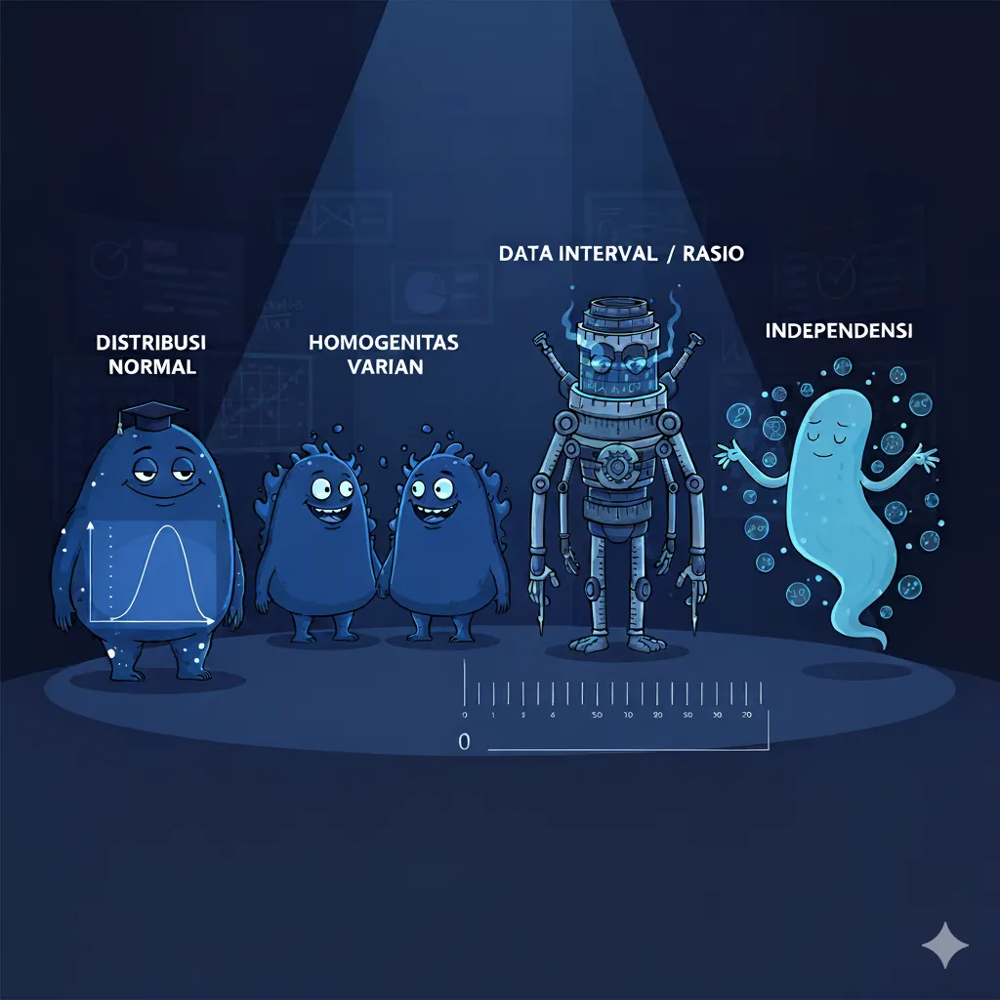
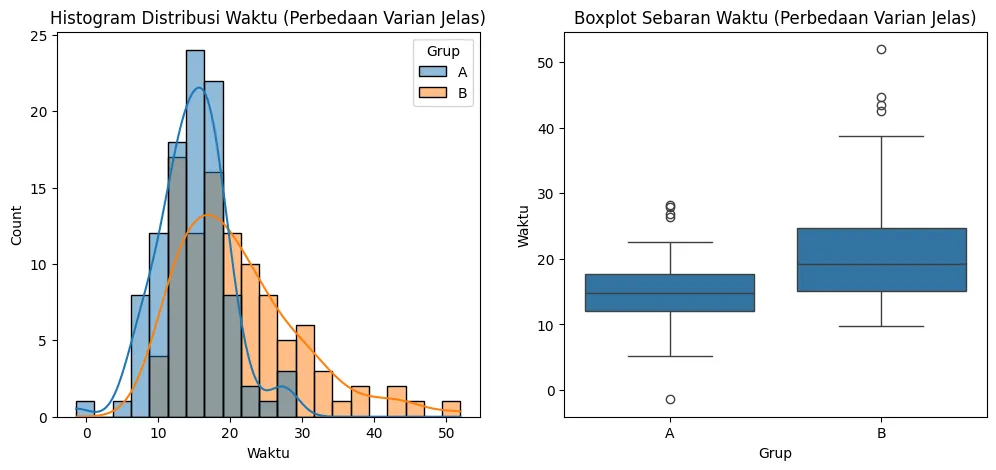

+++
title = "Fondasi Analisis yang Benar: Panduan Memvalidasi Asumsi Statistik"

date = 2025-08-27T23:42:26+07:00
draft = false
socialshare = true
description = "Mengapa hasil analisis statistik bisa menyesatkan? Pelajari pentingnya memvalidasi asumsi dasar seperti normalitas dan homogenitas varian sebelum Anda menarik kesimpulan."
image = "1.webp"
imageBig= "1.webp"
categories= ["Data Analysis Concepts"]
tags =  ["asumsi-statistik", "uji-parametrik"]
authors= ["Daddy Ananta"]
avatar="/images/profil.jpeg"
+++

Anda baru saja menyelesaikan A/B test yang penting. Hasilnya masuk: p-value 0.02. Tim produk bersorak, dan Anda siap merekomendasikan peluncuran fitur baru. Namun, ada pembunuh senyap yang mengintai di dalam data Anda, siap mengubah kemenangan ini menjadi bencana bisnis. Pembunuh itu adalah **pelanggaran asumsi statistik**—sebuah detail teknis yang sering diabaikan namun memiliki kekuatan untuk membatalkan seluruh analisis kita.

Seperti membangun gedung di atas fondasi yang retak, menjalankan uji statistik pada data yang tidak memenuhi syarat akan menghasilkan kesimpulan yang rapuh dan menyesatkan. Panduan ini adalah cetak biru Anda untuk memperkuat fondasi tersebut, mengubah Anda dari sekadar seorang analis menjadi penjaga kebenaran dalam data.

---

## Mengapa Asumsi Statistik Ibarat Fondasi Bangunan?

Di dunia analisis data, p-value di bawah 0.05 sering dianggap sebagai "standar emas" untuk signifikansi. Namun, p-value yang rendah hanya valid jika "aturan main" statistiknya dipatuhi. Aturan ini adalah **asumsi statistik**.

Jika asumsi dilanggar, p-value yang dihitung menjadi tidak dapat diandalkan. Ini terjadi karena distribusi probabilitas teoretis (misalnya, distribusi-t) yang digunakan sebagai dasar perbandingan, tidak lagi cocok dengan bentuk data kita yang sebenarnya. Dampaknya sangat nyata:

| Pelanggaran Asumsi Dapat Menyebabkan... | Dampak Bisnis yang Ditimbulkan |
| :--- | :--- |
| 📈 **Kesalahan Tipe I (False Positive)** | Meluncurkan fitur yang sebenarnya tidak memberikan dampak positif, membuang sumber daya pengembangan dan bahkan merusak pengalaman pengguna. |
| 📉 **Kesalahan Tipe II (False Negative)** | Melewatkan fitur unggulan yang seharusnya bisa meningkatkan metrik secara signifikan karena tes gagal mendeteksi efeknya. |

### Analogi "Bel Pintu Rusak" yang Diperluas

<div class="single-image-source">
  
 <p class="image-caption"> Image from Imagen 3</p>
</div>

Bayangkan Anda menekan bel pintu teman, tetapi tidak ada jawaban. Anda langsung berasumsi teman Anda sengaja mengabaikan Anda. Kesimpulan Anda salah total karena didasarkan pada asumsi keliru: **bahwa belnya berfungsi**. Kenyataannya, teman Anda ada di dalam, tetapi bel pintunya rusak.

Demikian pula dengan A/B testing. Sebelum kita bisa mempercayai *hasil* (p-value), kita harus terlebih dahulu memverifikasi *validitas prosesnya* (asumsi).

---

## Mengurai Empat "Monster" Asumsi Utama pada T-Test

<div class="single-image-source">
  
 <p class="image-caption"> Image from Imagen 3</p>
</div>

Untuk tes perbandingan rata-rata yang populer seperti T-test, ada empat asumsi utama yang harus Anda jinakkan.

### 1. **Independensi Pengamatan**
Ini adalah asumsi yang paling kritis dan paling sering dilanggar. Setiap data poin harus independen satu sama lain.
* **Mengapa ini penting?** Jika data tidak independen (misalnya, satu pengguna melakukan 10 transaksi), varians dalam data akan terlihat lebih kecil dari yang sebenarnya. Ini membuat tes Anda terlalu percaya diri dan secara dramatis meningkatkan risiko *false positive*.
* **Contoh Pelanggaran:**
    * **Data Berulang:** Menghitung setiap sesi dari pengguna yang sama sebagai data poin terpisah dalam analisis waktu per sesi. Seharusnya, Anda mengambil rata-rata per pengguna terlebih dahulu.
    * **Efek Jaringan:** Dalam platform sosial, tindakan satu pengguna dapat memengaruhi pengguna lain (misalnya, sebuah postingan menjadi viral).

### 2. **Normalitas Data**
Data dalam setiap grup idealnya mengikuti distribusi normal (kurva lonceng).
* **Mengapa ini penting?** T-test secara matematis didasarkan pada properti kurva normal.
* **Kabar Baik (The Central Limit Theorem):** Untuk **sampel besar (N ≥ 30 per grup)**, *Central Limit Theorem (CLT)* menyatakan bahwa distribusi dari rata-rata sampel akan mendekati normal, bahkan jika data aslinya tidak normal. Ini membuat T-test cukup tangguh (robust) terhadap pelanggaran asumsi ini pada sampel besar. Namun, untuk **sampel kecil (N < 30)**, asumsi ini menjadi sangat kritis.

### 3. **Homogenitas Varian (Homoskedastisitas)**
Variasi atau sebaran data (varian) sebaiknya serupa di antara grup yang dibandingkan.
* **Mengapa ini penting?** T-test standar "menggabungkan" varians dari kedua grup untuk mendapatkan estimasi keseluruhan. Jika varians satu grup jauh lebih besar, estimasi gabungan ini menjadi tidak akurat.
* **Solusi:** Jika asumsi ini dilanggar, jangan panik! Gunakan **Welch's T-test**, sebuah variasi yang tidak mengasumsikan varians yang sama dan lebih direkomendasikan secara default oleh banyak ahli.

### 4. **Data Berskala Interval atau Rasio**
Data yang diukur harus berupa numerik kontinu, di mana perbedaan antar nilai memiliki makna (misalnya, waktu di halaman, pendapatan per pengguna). T-test tidak cocok untuk data kategorikal seperti *conversion rate* (sukses/gagal).

<div style="background-color:#f9f9f9; border: 1px solid #d3d3d3; padding: 15px; font-family: Arial, sans-serif;margin-bottom: 20px;">
<p style="font-style: italic;">"All models are wrong, but some are useful."</p>
<p style="text-align: right; font-size: 0.9em; margin-top: 10px; color: #555;">- George E. P. Box, <span style="font-weight: bold;">Journal of the American Statistical Association (1976)</span></p>
</div>

---

## Studi Kasus Praktis dengan Python: Uji Tombol "Daftar"

Mari kita terapkan kerangka kerja diagnostik pada contoh kasus. Perusahaan SaaS menguji desain tombol "Daftar" baru (Grup B) melawan desain lama (Grup A). Metrik keberhasilannya adalah `waktu_untuk_klik_daftar` (dalam detik).

### Langkah 1: Inspeksi Visual
Sebelum uji formal, selalu visualisasikan data Anda. Ini adalah cara tercepat untuk mendeteksi anomali.

```python
import numpy as np
import pandas as pd
import seaborn as sns
import matplotlib.pyplot as plt
from scipy import stats

# Membuat data hipotetis
# Grup A: Normal, tapi dengan beberapa outlier
grup_a = np.random.normal(loc=15, scale=5, size=100)
# Grup B: Sedikit lebih cepat, tapi varians lebih besar dan sedikit miring (skewed)
grup_b = stats.skewnorm.rvs(a=4, loc=12, scale=7, size=100)

df = pd.DataFrame({'Grup': ['A']*100 + ['B']*100,
                   'Waktu': np.concatenate([grup_a, grup_b])})

# Plotting
fig, axes = plt.subplots(1, 2, figsize=(12, 5))
sns.histplot(df, x='Waktu', hue='Grup', kde=True, ax=axes[0])
axes[0].set_title('Histogram Distribusi Waktu')
sns.boxplot(df, x='Grup', y='Waktu', ax=axes[1])
axes[1].set_title('Boxplot Sebaran Waktu')
plt.show()
```
<div class="single-image-source">
  
</div>


**Interpretasi Visual:** Dari histogram, kita bisa melihat distribusi Grup B sedikit miring ke kanan. Dari boxplot, terlihat bahwa sebaran (panjang kotak) Grup B lebih lebar daripada Grup A, yang mengindikasikan varians yang mungkin berbeda.

### Langkah 2: Uji Statistik Formal
Sekarang, kita konfirmasi kecurigaan kita dengan angka.

```python
# Uji Normalitas (Shapiro-Wilk)
shapiro_a = stats.shapiro(df[df['Grup'] == 'A']['Waktu'])
shapiro_b = stats.shapiro(df[df['Grup'] == 'B']['Waktu'])
print(f"Shapiro-Wilk P-value Grup A: {shapiro_a.pvalue:.3f}")
print(f"Shapiro-Wilk P-value Grup B: {shapiro_b.pvalue:.3f}")

# Uji Homogenitas Varian (Levene)
levene_test = stats.levene(df[df['Grup'] == 'A']['Waktu'],
                           df[df['Grup'] == 'B']['Waktu'])
print(f"Levene Test P-value: {levene_test.pvalue:.3f}")
```

```Output
Shapiro-Wilk P-value Grup A: 0.109
Shapiro-Wilk P-value Grup B: 0.000
Levene Test P-value: 0.000
```


**Interpretasi:**
* **Normalitas:** Grup A normal (p > 0.05). Grup B secara teknis tidak normal (p < 0.05), tetapi karena ukuran sampel kita besar (N=100), berkat CLT, kita masih bisa menggunakan T-test.
* **Homogenitas Varian:** P-value Levene's test sangat kecil (< 0.05). Ini adalah **"bendera merah" besar**. Kita harus menolak asumsi bahwa varians kedua grup sama.

### Langkah 3: Pohon Keputusan dalam Aksi
Berdasarkan diagnosis, kita memilih jalur analisis yang tepat.

* ❌ **T-test Standar (Salah):** Mengabaikan pelanggaran homogenitas varian.
* ✅ **Welch's T-test (Benar):** Pilihan yang tepat karena varians antar grup berbeda.

```python
# Menjalankan Welch's T-test (equal_var=False)
welch_result = stats.ttest_ind(df[df['Grup'] == 'A']['Waktu'],
                               df[df['Grup'] == 'B']['Waktu'],
                               equal_var=False) # Ini kuncinya!

print(f"Welch's T-test: t-statistic = {welch_result.statistic:.3f}, p-value = {welch_result.pvalue:.3f}")
```

```Output
Welch's T-test: t-statistic = -6.451, p-value = 0.000
```


Dengan menggunakan tes yang tepat, kita mendapatkan p-value yang dapat diandalkan, yang melindungi keputusan bisnis kita dari fondasi analisis yang rapuh.


<div style="background-color: #f8f9fa; border: 1px solid #e0e0e0; border-radius: 12px; padding: 25px; margin: 30px 0; font-family: 'Segoe UI', Arial, sans-serif; box-shadow: 0 6px 20px rgba(0,0,0,0.08);">
        <h4 style="margin-top: 0; margin-bottom: 12px; font-size: 22px; color: #333; text-align: center; line-height: 1.4;">Praktik Langsung: <strong style="color: #007bff;">Unduh Kode Lengkap</strong></h4>
        <p style="font-size: 16px; color: #555; margin-bottom: 25px; text-align: center; line-height: 1.7;">
            Ingin mencoba sendiri analisis ini? Unduh Jupyter Notebook yang berisi seluruh kode dari seri tiga bagian ini, mulai dari persiapan data hingga audit reliabilitas.
        </p>
        <div style="text-align: center;">
            <a href="Analisis Varian A-B Test: Saat Kenaikan Rata-rata Adalah Sinyal Bahaya.ipynb" download
               style="display: inline-flex; align-items: center; justify-content: center; background-color: #007bff; color: #ffffff; padding: 15px 30px; font-size: 18px; font-weight: bold; text-decoration: none; border-radius: 10px; box-shadow: 0 4px 15px rgba(0, 123, 255, 0.3); transition: all 0.3s ease; letter-spacing: 0.5px;">
                <svg xmlns="http://www.w3.org/2000/svg" width="22" height="22" viewBox="0 0 24 24" fill="currentColor" style="margin-right: 10px;">
                    <path d="M19 9h-4V3H9v6H5l7 7 7-7zM5 18v2h14v-2H5z"></path>
                </svg>
                Unduh Jupyter Notebook (.ipynb)
            </a>
            <p style="font-size: 14px; color: #6c757d; margin-top: 12px; margin-bottom: 0;">
                Ukuran file: 72,5 kB
            </p>
        </div>
    </div>


---

## Melampaui T-Test: Peta Asumsi untuk Skenario Lain

A/B testing tidak hanya tentang membandingkan dua rata-rata.

* **Jika Anda memiliki > 2 Grup (misal, A/B/C Test):**
    * **Gunakan:** ANOVA (Analysis of Variance).
    * **Asumsi:** Sama seperti T-test (normalitas, homogenitas varian, independensi). Jika asumsi dilanggar, ada alternatif seperti Welch's ANOVA atau tes non-parametrik Kruskal-Wallis.

* **Jika Metrik Anda Kategorikal (misal, Conversion Rate):**
    * **Gunakan:** Uji Chi-Square (Chi-Square Test of Independence).
    * **Asumsi Utama:**
        1.  **Independensi:** Satu pengguna hanya boleh masuk dalam satu sel (misal, user A tidak bisa melakukan konversi dan tidak konversi sekaligus).
        2.  **Frekuensi Harapan:** Jumlah sampel yang diharapkan di setiap kategori setidaknya 5.

---

## Kesimpulan: Dari Analis Menjadi Penjaga Integritas Data

Menjalankan `stats.ttest_ind()` hanyalah 10% dari pekerjaan. 90% sisanya adalah memastikan fondasi pengujian Anda kokoh. Mengadopsi pola pikir **"validasi dulu, analisis kemudian"** adalah komitmen terhadap integritas analitik.

Dengan menempatkan validasi asumsi sebagai bagian tak terpisahkan dari alur kerja Anda, Anda tidak hanya menjadi analis yang lebih baik—Anda menjadi penasihat tepercaya yang melindungi perusahaan dari keputusan yang didasarkan pada data yang menyesatkan.

<a href="https://daddyananta.github.io//categories/quantitative/">Perdalam pemahaman Quantitative Anda di sini</a>

## Referensi
<p style="text-indent:0px;">Box, G. E. P. (1976). Science and statistics. <a href="https://www.tandfonline.com/doi/abs/10.1080/01621459.1976.10480949">Journal of the American Statistical Association</a></p>

## Penelusuran Terkait
<ul>
    <li><a href="https://www.scribbr.com/frequently-asked-questions/assumptions-of-statistical-tests/">Assumptions of Statistical Tests | Scribbr</a></li>
    <li><a href="https://medium.com/data-science/the-ultimate-guide-to-a-b-testing-part-3-parametric-tests-2c629e8d98f8">The Ultimate Guide to A/B Testing – Part 3: Parametric Tests | Towards Data Science</a></li>
    <li><a href="https://medium.com/data-science/the-ultimate-guide-to-a-b-testing-part-4-non-parametric-tests-4db7b4b6a974">The Ultimate Guide to A/B Testing – Part 4: Non-Parametric Tests | Towards Data Science</a></li>
    <li><a href="https://statisticsbyjim.com/hypothesis-testing/p-values-error-rates-false-positives/">P-Values, Error Rates, and False Positives | Statistics By Jim</a></li>
    <li><a href="https://www.investopedia.com/terms/c/central_limit_theorem.asp">Central Limit Theorem (CLT) Explained | Investopedia</a></li>
    <li><a href="https://www.jmp.com/en/statistics-knowledge-portal/t-test/two-sample-t-test.html">The Two-Sample T-Test | JMP</a></li>
    <li><a href="https://www.analyticsvidhya.com/blog/2021/06/hypothesis-testing-parametric-and-non-parametric-tests-in-statistics/">Parametric & Non-Parametric Tests In Statistics | Analytics Vidhya</a></li>
</ul>

