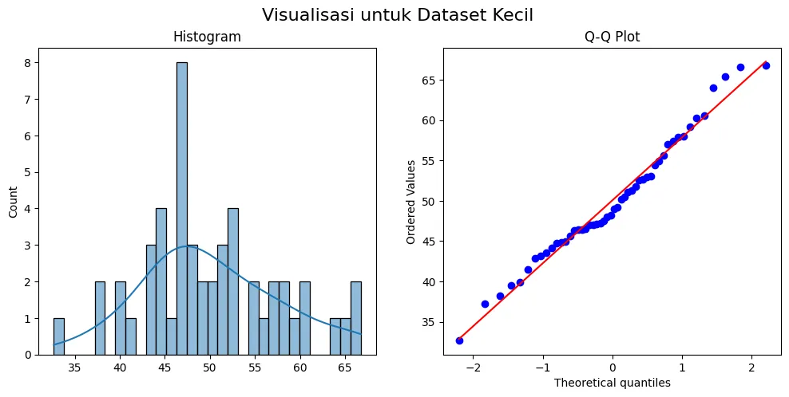
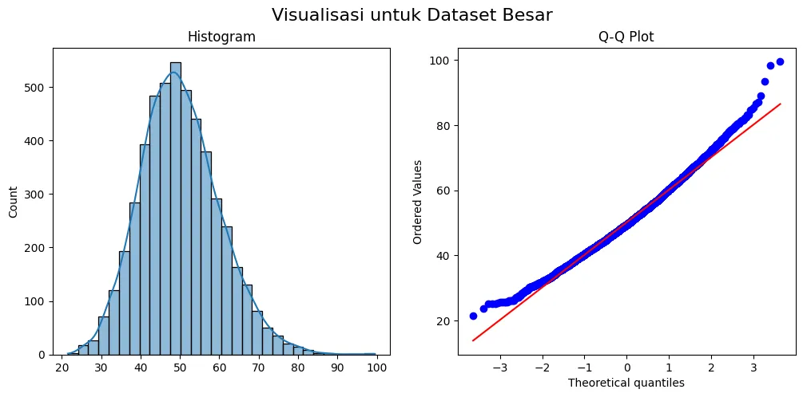
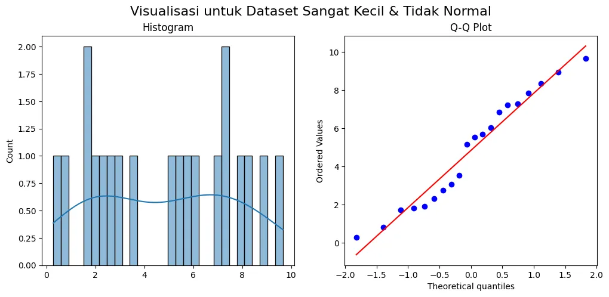

+++
title = "Menafsirkan Uji Normalitas: Panduan Saat P-Value Tak Bisa Dipercaya"

date = 2025-08-27T23:43:26+07:00
draft = false
socialshare = true
description = "Uji Shapiro-Wilk memberikan p < 0.05? Jangan panik. Pelajari kapan harus memercayai Q-Q plot daripada p-value, terutama saat menangani sampel besar."
image = "1.webp"
imageBig= "1.webp"
categories= ["Data Analysis Concepts"]
tags =  ["asumsi-statistik"]
authors= ["Daddy Ananta"]
avatar="/images/profil.jpeg"
url = "/posts/data-analysis-concept/menafsirkan-uji-normalitas-panduan-saat-p-value-tak-bisa-dipercaya/"
aliases = [
    "/posts/quantitative/menafsirkan-uji-normalitas-panduan-saat-p-value-tak-bisa-dipercaya/"
]
+++


Anda telah melakukan uji tuntas. Anda menjalankan uji Shapiro-Wilk, dan hasilnya kembali dengan label merah yang ditakuti: `p < 0.05`. Reaksi pertama Anda mungkin panik—seluruh rencana analisis parametrik Anda tampak berantakan. Tetapi bagaimana jika p-value itu tidak menceritakan keseluruhan cerita? Bagaimana jika, dalam kasus tertentu, terlalu mempercayai hasil tes ini justru merupakan kesalahan yang lebih besar?

Panduan ini adalah panduan Anda untuk melewati momen kritis tersebut. Di sini, kita akan membongkar "jebakan sampel besar" yang sering membuat praktisi data tersandung, menunjukkan mengapa Q-Q plot bisa menjadi sahabat terbaik Anda, dan membangun kerangka kerja keputusan yang kuat. Sebelum Anda membuang T-test Anda, mari kita pastikan Anda menafsirkan semua bukti dengan benar.

### Paradoks Uji Normalitas: Mengapa Satu Tes Saja Tidak Cukup

Mengandalkan p-value dari satu uji normalitas saja sama seperti seorang detektif yang menutup kasus hanya berdasarkan satu sidik jari. Untuk membuat keputusan yang kuat, kita perlu mengadopsi kerangka kerja investigasi yang lebih komprehensif. Anggaplah proses ini seperti Investigasi Tempat Kejadian Perkara (TKP):

1.  **Bukti Visual (Mata Saksi):** **Histogram** dan **Q-Q Plot** memberi kita gambaran bentuk distribusi. Ini adalah langkah pertama yang paling intuitif.
2.  **Laporan Forensik (Angka Kuantitatif):** Nilai **Skewness** dan **Kurtosis** memberikan detail numerik tentang asimetri dan "keruncingan" puncak data.
3.  **Tes DNA (Uji Formal):** **Uji Shapiro-Wilk** memberikan konfirmasi statistik, tetapi harus kita interpretasikan dalam konteks bukti lain, terutama ukuran sampel.

<div style="background-color:#f9f9f9; border: 1px solid #d3d3d3; padding: 15px; font-family: Arial, sans-serif;margin-bottom: 20px;">
<p style="font-style: italic;">"An approximate answer to the right question is worth a great deal more than a precise answer to the wrong question."</p>
<p style="text-align: right; font-size: 0.9em; margin-top: 10px; color: #555;">- John Tukey, <span style="font-weight: bold;">The Future of Data Analysis (1962)</span></p>
</div>

---

### Jebakan #1: Terlalu Percaya P-Value (Masalah Sampel Besar)

Uji formal seperti Shapiro-Wilk sangat sensitif pada sampel besar. Ia memiliki kekuatan untuk mendeteksi penyimpangan sekecil apa pun dari normalitas sempurna, bahkan jika penyimpangan itu tidak memiliki arti praktis bagi analisis Anda.

**Mengapa ini terjadi?** Ingatlah **Teorema Limit Pusat (Central Limit Theorem)**. Uji-t dan ANOVA lebih peduli pada normalitas *distribusi sampling dari rata-rata*, bukan normalitas data itu sendiri. Dengan sampel yang cukup besar (misalnya N > 30), CLT memastikan bahwa distribusi sampling ini akan mendekati normal, membuat uji parametrik tetap valid (robust) meskipun data asli sedikit menyimpang.

#### Demonstrasi: Hasil yang Bertentangan (n=50 vs n=5000)

Mari kita buat dua set data dari distribusi "Chi-Square", yang secara teoretis tidak normal.

```python
import numpy as np
import pandas as pd
import matplotlib.pyplot as plt
import seaborn as sns
from scipy import stats

# Membuat dua dataset dengan ukuran berbeda
np.random.seed(42)
data_kecil = np.random.chisquare(df=50, size=50) 
data_besar = np.random.chisquare(df=50, size=5000)

# Membuat fungsi untuk menjalankan analisis lengkap
def analisis_normalitas(data, nama_dataset):
    print(f"--- Analisis untuk: {nama_dataset} (n={len(data)}) ---")
    
    # Visualisasi
    plt.figure(figsize=(12, 5))
    plt.subplot(1, 2, 1)
    sns.histplot(data, kde=True, bins=30)
    plt.title("Histogram")
    plt.subplot(1, 2, 2)
    stats.probplot(data, dist="norm", plot=plt)
    plt.title("Q-Q Plot")
    plt.suptitle(f"Visualisasi untuk {nama_dataset}", fontsize=16)
    plt.show()

    # Uji Shapiro-Wilk
    stat, p_value = stats.shapiro(data)
    print(f"Hasil Shapiro-Wilk: Statistik={stat:.4f}, P-value={p_value:.4f}\n")

# Eksekusi
analisis_normalitas(data_kecil, "Dataset Kecil")
analisis_normalitas(data_besar, "Dataset Besar")
```

```Output

--- Analisis untuk: Dataset Kecil (n=50) ---
Hasil Shapiro-Wilk: Statistik=0.9783, P-value=0.4823


```
<div class="single-image-source">
  
</div>


```Output

--- Analisis untuk: Dataset Besar (n=5000) ---
Hasil Shapiro-Wilk: Statistik=0.9911, P-value=0.0000


```

<div class="single-image-source">
  
</div>


* **Hasil Dataset Kecil (n=50):** P-value Shapiro-Wilk adalah **0.4823**. Uji ini menyimpulkan data normal.
* **Hasil Dataset Besar (n=5000):** P-value Shapiro-Wilk adalah **0.0000**. Uji ini menyimpulkan data **tidak** normal, meskipun Q-Q plotnya terlihat hampir sempurna lurus!

Inilah paradoksnya: data yang terlihat lebih normal justru gagal dalam tes formal.

> **Aturan Praktis #1:** Untuk sampel besar (misal, n > 1000), berikan bobot lebih pada **Q-Q plot**. Jika plot terlihat lurus, Anda sering kali dapat dengan aman mengasumsikan normalitas untuk tujuan praktis (seperti T-test atau ANOVA), bahkan jika p-value-nya signifikan.

---

### Jebakan #2: Mengabaikan Konteks (Masalah Sampel Kecil)

Pada sampel kecil, tes statistik tidak memiliki **kekuatan (power)** yang cukup untuk mendeteksi penyimpangan dari normalitas, bahkan jika penyimpangan itu nyata. Hal ini meningkatkan risiko **Kesalahan Tipe II** (gagal menolak hipotesis nol yang salah).

#### Demonstrasi: Sampel Sangat Kecil (n=20)
Kita buat data dari distribusi Uniform, yang jelas-jelas tidak berbentuk lonceng.

```python
np.random.seed(101)
data_sangat_kecil = np.random.uniform(low=0, high=10, size=20)
analisis_normalitas(data_sangat_kecil, "Dataset Sangat Kecil & Tidak Normal")
```

```Output

--- Analisis untuk: Dataset Sangat Kecil & Tidak Normal (n=20) ---
Hasil Shapiro-Wilk: Statistik=0.9447, P-value=0.2933


```

<div class="single-image-source">
  
</div>


Meskipun data ini sama sekali tidak terlihat seperti lonceng, hasil Shapiro-Wilk menunjukkan `P-value=0.2933`, yang gagal mendeteksi ketidaknormalan yang jelas ini.

> **Aturan Praktis #2:** Untuk sampel kecil (n < 50), jangan terlalu percaya pada p-value yang *tidak signifikan*. Jika visualisasi (Q-Q plot yang melengkung) atau pengetahuan domain Anda menyarankan data tidak normal, lebih bijaksana untuk berhati-hati dan mempertimbangkan tes non-parametrik.


    <div style="background-color: #f8f9fa; border: 1px solid #e0e0e0; border-radius: 12px; padding: 25px; margin: 30px 0; font-family: 'Segoe UI', Arial, sans-serif; box-shadow: 0 6px 20px rgba(0,0,0,0.08);">
        <h4 style="margin-top: 0; margin-bottom: 12px; font-size: 22px; color: #333; text-align: center; line-height: 1.4;">Praktik Langsung: <strong style="color: #007bff;">Unduh Kode Lengkap</strong></h4>
        <p style="font-size: 16px; color: #555; margin-bottom: 25px; text-align: center; line-height: 1.7;">
            Ingin mencoba sendiri analisis ini? Unduh Jupyter Notebook yang berisi seluruh kode dari seri tiga bagian ini, mulai dari persiapan data hingga audit reliabilitas.
        </p>
        <div style="text-align: center;">
            <a href="Menafsirkan Uji Normalitas - Panduan Saat P-Value Tak Bisa Dipercaya.ipynb" download
               style="display: inline-flex; align-items: center; justify-content: center; background-color: #007bff; color: #ffffff; padding: 15px 30px; font-size: 18px; font-weight: bold; text-decoration: none; border-radius: 10px; box-shadow: 0 4px 15px rgba(0, 123, 255, 0.3); transition: all 0.3s ease; letter-spacing: 0.5px;">
                <svg xmlns="http://www.w3.org/2000/svg" width="22" height="22" viewBox="0 0 24 24" fill="currentColor" style="margin-right: 10px;">
                    <path d="M19 9h-4V3H9v6H5l7 7 7-7zM5 18v2h14v-2H5z"></path>
                </svg>
                Unduh Jupyter Notebook (.ipynb)
            </a>
            <p style="font-size: 14px; color: #6c757d; margin-top: 12px; margin-bottom: 0;">
                Ukuran file: 203,2 kB
            </p>
        </div>
    </div>

---

### Kerangka Kerja Keputusan Terpadu

Bagaimana kita menggabungkan semua ini? Gunakan pohon keputusan berikut sebagai panduan.


####  flowchart TD

flowchart LR
    %% Mendefinisikan kelas gaya
    classDef startEnd fill:#1A5D1A,stroke:#609966,stroke-width:2px,color:#fff;
    classDef decision fill:#674188,stroke:#C3ACD0,stroke-width:2px,color:#fff;
    classDef process fill:#4A5568,stroke:#A0AEC0,stroke-width:2px,color:#fff;

    %% Alur diagram dengan penerapan kelas
    A["Mulai"]:::startEnd;
    B{"Ukuran Sampel (n)?"}:::decision;
    C{"n < 50"}:::decision;
    D{"50 <= n <= 1000"}:::decision;
    E{"n > 1000"}:::decision;
    F["Fokus pada Visual (Q-Q Plot) & Uji Formal. Hati-hati dengan p > 0.05"]:::process;
    G["Gunakan semua bukti: Visual, Uji Formal, dan Kuantitatif (Skewness/Kurtosis)"]:::process;
    H["Utamakan Visual (Q-Q Plot). Abaikan p < 0.05 jika Q-Q plot lurus"]:::process;

    %% Hubungan antar node
    A --> B;
    B --> C;
    B --> D;
    B --> E;
    C --> F;
    D --> G;
    E --> H;


#### Skenario Praktis: Menilai Skewness & Kurtosis
Untuk sampel ukuran sedang, Skewness (S) dan Kurtosis (K) menjadi sangat berguna. Kita bisa mengubahnya menjadi z-score untuk menilai signifikansinya.

**Rumus:**
* Standard Error (SE) Aproksimasi: $SE_{skewness} \approx \sqrt{6/n}$ dan $SE_{kurtosis} \approx \sqrt{24/n}$
* Z-score: $$z_{skewness} = \frac{S}{SE_{skewness}}$$ $$z_{kurtosis} = \frac{K}{SE_{kurtosis}}$$

**Aturan Praktis:** Jika ukuran sampel Anda sedang (~50-300), nilai $|z| > 1.96$ (level signifikansi 5%) dapat menjadi indikasi penyimpangan dari normalitas.

**Contoh (n=200):**
Misalkan data rating e-commerce kita memiliki Skewness = -0.28 dan Kurtosis = -0.11.
* $SE_{skewness} \approx \sqrt{6/200} \approx 0.173$
* $z_{skewness} = -0.28 / 0.173 = -1.62$
* Karena $|-1.62| < 1.96$, skewness tidak signifikan.

**Keputusan:** Jika Q-Q plot lurus, z-score skewness/kurtosis tidak signifikan, dan p-value Shapiro-Wilk > 0.05, kita memiliki **bukti yang sangat kuat** untuk melanjutkan analisis parametrik.

---

### Kesimpulan

Menguji normalitas bukanlah tentang mengikuti aturan p-value yang kaku, tetapi menggunakan penalaran statistik yang terinformasi. Jangan pernah hanya mengandalkan satu angka. Selalu gunakan ukuran sampel Anda sebagai panduan untuk menimbang bukti dari uji formal, inspeksi visual, dan metrik kuantitatif.

Jika data Anda terbukti tidak normal, jangan lihat itu sebagai jalan buntu—lihatlah sebagai penunjuk arah. Ini adalah kesempatan Anda untuk menjelajahi metode yang lebih kuat seperti transformasi data atau uji non-parametrik. Analisis Anda tidak berhenti; ia menjadi lebih tajam, lebih dapat dipertahankan, dan jauh lebih berharga.

<a href="https://daddyananta.github.io//categories/quantitative/">Perdalam pemahaman Quantitative Anda di sini</a>

#### Referensi
<p style="text-indent:0px;">
Tukey, J. W. (1962). The Future of Data Analysis. 
<a href="https://projecteuclid.org/journals/annals-of-mathematical-statistics/volume-33/issue-1/The-Future-of-Data-Analysis/10.1214/aoms/1177704711.full">
The Annals of Mathematical Statistics
</a>
</p>


#### Penelusuran Terkait
<ul>
    <li><a href="https://www.statisticssolutions.com/free-resources/directory-of-statistical-analyses/normality/">Normality | Statistics Solutions</a></li>
    <li><a href="https://medium.com/data-science/10-normality-tests-in-python-step-by-step-guide-2020-31e04aa4f411">10 Normality Tests in Python (Step-By-Step Guide 2020) | TDS Archive</a></li>
    <li><a href="https://www.machinelearningmastery.com/a-gentle-introduction-to-normality-tests-in-python/">A Gentle Introduction to Normality Tests in Python | Machine Learning Mastery</a></li>
    <li><a href="https://python.plainenglish.io/skewness-kurtosis-and-normality-test-27479be7a55b">Skewness, Kurtosis, and Normality Test | Python in Plain English</a></li>
    <li><a href="https://statisticsbyjim.com/hypothesis-testing/what-is-power-in-statistics/">Statistical Power | Statistics By Jim</a></li>
    <li><a href="https://www.scribbr.com/statistics/statistical-significance/">Statistical Significance: What It Is, How It Works, and Why It’s Important | Scribbr</a></li>
    <li><a href="https://docs.scipy.org/doc/scipy/reference/generated/scipy.stats.shapiro.html">scipy.stats.shapiro — SciPy v1.14.0 Manual</a></li>
    <li><a href="https://stats.stackexchange.com/questions/2492/is-normality-testing-essentially-useless">Is normality testing 'essentially useless'? | Cross Validated</a></li>
    <li><a href="https://en.wikipedia.org/wiki/Q%E2%80%93Q_plot">Q–Q plot - Wikipedia</a></li>
    <li><a href="https://www.investopedia.com/terms/n/nonparametric-statistics.asp">Nonparametric Statistics: Overview, Types, and Examples | Investopedia</a></li>
</ul>
