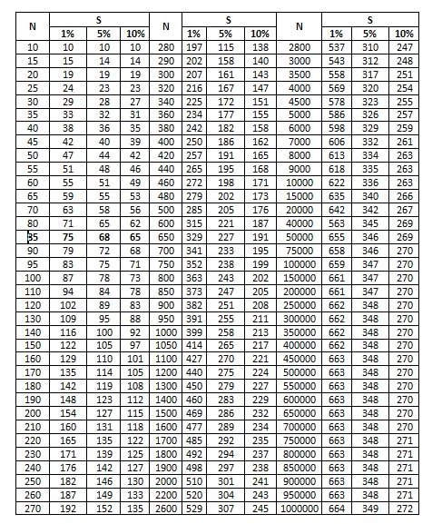
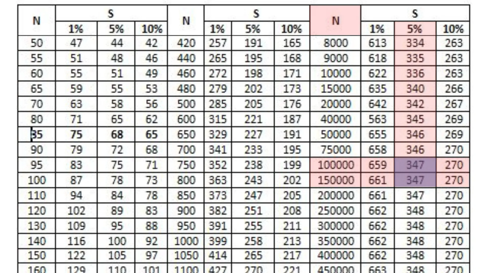

+++
title = 'Cara Menentukan Ukuran Sampel Penelitian (dengan Kalkulator Sampel)'
date = 2025-08-17T00:37:00+00:00
draft = false
socialshare = true
description = ""
image = "1.webp"
imageBig= "1.webp"
categories= ["Data Analysis Concepts"]
tags = ["Python", "Statistic"]
authors= ["Daddy Ananta"]
avatar="/images/profil.jpeg"
+++


### **Mengapa Pengambilan Sampel itu Penting? Memahami Populasi dan Sampel**

Dalam dunia penelitian, terutama di bidang ilmu sosial, kita sering kali dihadapkan pada data yang sangat besar. Mari kita ambil contoh dari penelitian berjudul ("[THE EFFECT OF CONSUMER PERCEPTION ON PRODUCT IMAGE ADVERTISED ON YOUTUBE](https://e-journal.unair.ac.id/JEBA/article/view/40168)"). Studi ini menargetkan pengguna YouTube yang tinggal di empat distrik di Kabupaten Dharmasraya.

Menurut data, jumlah total pengguna YouTube di keempat distrik tersebut mencapai **120.979 orang**. Cukup banyak, bukan?

Apakah peneliti harus mengumpulkan data dari seluruh 120.979 orang tersebut? Tentu tidak. Hal ini akan sangat tidak efisien dari segi waktu, biaya, maupun tenaga. Di sinilah konsep **sampel** menjadi krusial.

Secara sederhana, **sampel** adalah sebagian kecil subjek dari penelitian yang diambil untuk **mewakili populasi** secara keseluruhan.

Untuk memudahkan pemahaman, mari kita gunakan analogi sederhana. Bayangkan Anda selesai memasak sepanci besar gulai ayam. Anda ingin tahu apakah rasanya sudah pas, tidak terlalu asin atau hambar. Apakah Anda harus menghabiskan seluruh panci gulai untuk mengetahuinya? Tentu tidak. Anda cukup mencicipi satu sendok kuah dan sepotong kecil ayam. Sampel kecil ini sudah cukup untuk memberikan gambaran rasa dari seluruh masakan Anda. 

Sama halnya dengan penelitian. Kita tidak perlu meneliti seluruh populasi untuk mendapatkan gambaran yang akurat. Cukup dengan mengambil sampel yang representatif.

Lalu, bagaimana cara kita menentukan **berapa banyak sampel** yang harus diambil? Ada beberapa metode yang umum digunakan. Mari kita bahas tiga pendekatan populer, dari yang praktis hingga yang paling direkomendasikan secara statistik.

---

### **Tiga Pendekatan dalam Menentukan Ukuran Sampel**

#### **1. Pendekatan Tabel: Isaac & Michael**

Metode Isaac & Michael adalah cara yang sangat praktis karena menggunakan **tabel** yang sudah jadi. Tabel ini dikembangkan dengan memperhitungkan populasi (N), **tingkat kesalahan (margin of error)**, dan **tingkat kepercayaan (confidence level)**. Umumnya, tingkat kesalahan yang digunakan adalah 1%, 5%, atau 10%.

* **Tingkat Kesalahan (e):** Seberapa besar selisih antara hasil sampel dengan hasil populasi yang sebenarnya yang bisa kita toleransi. Umumnya **5% (0.05)**.
* **Tingkat Kepercayaan:** Seberapa yakin kita bahwa hasil dari sampel kita benar-benar mencerminkan kondisi populasi. Umumnya **95%**. (Ini berkebalikan dengan tingkat kesalahan 5%).

Berikut adalah tabel Isaac & Michael:

<figure class="single-image-source" style="text-align: center;">

<figcaption style="color: #888; margin-top:-15px;">Tabel Issac & Michael dari <a href="https://colab.research.google.com/github/yogjay/StatistikaTerapan/blob/master/Populasi_Sampel.ipynb#scrollTo=QyNpxyX0IYWo" target="_blank">StatistikaTerapan</a></figcaption>
</figure>


**Studi Kasus:**
Dengan populasi (N) **120.979** orang dan kita menetapkan tingkat kesalahan 5%.

<figure class="single-image-source" style="text-align: center; margin: 0 auto;">
  
  <figcaption style="color: #888; margin-top:5px; margin-bottom: 20px;">Populasi 120.979 berada di atas N=100.000.</figcaption>
</figure>

Dari tabel, kita dapat melihat bahwa populasi kita (120.979) sudah melewati angka 100.000. Pada baris N=100.000 dengan tingkat kesalahan 5%, ukuran sampel yang dibutuhkan adalah **347 orang**. Angka ini menjadi batas atas yang stabil untuk populasi yang lebih besar.

* **Kelebihan:** Sangat cepat dan praktis, tidak perlu menghitung manual.
* **Kekurangan:** Kurang fleksibel karena terikat pada nilai-nilai yang ada di tabel.

---

#### **2. Pendekatan Standar Statistik: Rumus Cochran**

Ini adalah **metode yang paling direkomendasikan** oleh para ahli statistik karena memiliki dasar teori yang kuat dan jelas. Rumus Cochran sangat ideal untuk populasi besar atau yang ukurannya tidak diketahui secara pasti.

Rumus Cochran:
<div class="single-code" style="background-color: #f9f9f9; border: 1px solid #ccc; padding: 15px; border-radius: 5px; margin-top: 10px; margin-bottom: 20px; overflow-x: auto;">
$$ n = \frac{Z^2 \times p \times q}{e^2} $$
</div>

* **n** = Ukuran sampel yang dibutuhkan
* **Z** = Z-score, yaitu nilai standar yang sesuai dengan tingkat kepercayaan. Untuk **tingkat kepercayaan 95%**, nilai Z adalah **1.96**.
* **p** = Estimasi proporsi populasi. Jika kita tidak memiliki data sebelumnya, kita gunakan **0.5** untuk mendapatkan variabilitas maksimum (dan ukuran sampel terbesar yang paling aman).
* **q** = 1 - p (jadi, 1 - 0.5 = 0.5)
* **e** = Margin of error atau tingkat kesalahan yang diinginkan (misalnya, 5% atau **0.05**).

Mari kita terapkan pada studi kasus kita:

<div class="single-code" style="background-color: #f9f9f9; border: 1px solid #ccc; padding: 15px; border-radius: 5px; margin-top: 10px; margin-bottom: 20px; overflow-x: auto;">
$$ n = \frac{(1.96)^2 \times (0.5) \times (0.5)}{(0.05)^2} $$
$$ n = \frac{(3.8416) \times (0.25)}{0.0025} $$
$$ n = \frac{0.9604}{0.0025} \approx 384.16 $$
</div>

Berdasarkan perhitungan ini, jumlah sampel yang dibutuhkan adalah **384 orang**

Untuk populasi yang diketahui (terbatas), ada sedikit penyesuaian (koreksi) yang bisa dilakukan, yang akan menghasilkan sampel sedikit lebih kecil dan efisien.

Berikut adalah contoh kode Python untuk menghitungnya secara otomatis:
```Python
import scipy.stats as st

def cochran_sample_size(population_size=None, margin_of_error=0.05, confidence_level=0.95, proportion=0.5):
  # Dapatkan Z-score dari tingkat kepercayaan
  z_score = st.norm.ppf(1 - (1 - confidence_level) / 2)
  
  # Hitung n0 (untuk populasi besar/tak terbatas)
  p = proportion
  q = 1 - p
  sample_size_infinite = (z_score**2 * p * q) / (margin_of_error**2)
  
  if population_size is None:
    return int(round(sample_size_infinite))
  else:
    # Terapkan rumus koreksi untuk populasi terbatas
    sample_size_finite = sample_size_infinite / (1 + (sample_size_infinite - 1) / population_size)
    return int(round(sample_size_finite))

# Penggunaan
total_populasi = 120979
error = 0.05
kepercayaan = 0.95

# 1. Untuk populasi besar/tak terbatas
ukuran_sampel_cochran_inf = cochran_sample_size(margin_of_error=error, confidence_level=kepercayaan)
print(f"Ukuran Sampel Cochran (Populasi Besar): {ukuran_sampel_cochran_inf}")

# 2. Dengan koreksi untuk populasi terbatas
ukuran_sampel_cochran_fin = cochran_sample_size(population_size=total_populasi, margin_of_error=error, confidence_level=kepercayaan)
print(f"Ukuran Sampel Cochran (Populasi Terbatas {total_populasi}): {ukuran_sampel_cochran_fin}")
```


```Output
Ukuran Sampel Cochran (Populasi Besar): 385
Ukuran Sampel Cochran (Populasi Terbatas 120979): 384
```

- **Kelebihan:** Dianggap sebagai "standar emas", akurat secara statistik, dan fleksibel.
    
- **Kekurangan:** Membutuhkan sedikit pemahaman konsep statistik.
    

---

#### **3. Pendekatan Sederhana (Catatan Historis): Rumus Slovin**

Anda mungkin sering menemukan rumus ini di beberapa literatur atau skripsi lama karena kesederhanaannya.

Rumus Slovin:

<div class="single-code" style="background-color: #f9f9f9; border: 1px solid #ccc; padding: 15px; border-radius: 5px; margin-top: 10px; margin-bottom: 20px; overflow-x: auto;"> $$ n = \frac{N}{1 + N \times e^2} $$ </div>

- **n** = Ukuran sampel
    
- **N** = Ukuran populasi
    
- **e** = Margin of error (0.05)
    

Penerapan pada studi kasus kita (N = 120.979):

<div class="single-code" style="background-color: #f9f9f9; border: 1px solid #ccc; padding: 15px; border-radius: 5px; margin-top: 10px; margin-bottom: 20px; overflow-x: auto;"> $$ n = \frac{120.979}{1 + (120.979)(0.05)^2} $$ $$ n = \frac{120.979}{1 + 302.4475} $$ $$ n = \frac{120.979}{303.4475} \approx 398.66 $$ </div>

Hasilnya adalah **399 orang**.

Berikut adalah contoh kode Python untuk Rumus Slovin:


```Python
def slovin_sample_size(population_size, margin_of_error):
  if not (0 < margin_of_error < 1):
    raise ValueError("Margin of error harus di antara 0 dan 1.")
  
  sample_size = population_size / (1 + population_size * margin_of_error**2)
  return int(round(sample_size))

# Penggunaan
total_populasi = 120979
error = 0.05  # 5%

ukuran_sampel_slovin = slovin_sample_size(total_populasi, error)
print(f"Ukuran Sampel (n) dengan Rumus Slovin: {ukuran_sampel_slovin}")
```


```Output
Ukuran Sampel (n) dengan Rumus Slovin: 399
```

<div style="width: 90%; max-width: 600px; padding: 30px; border-radius: 12px; background-color: #ffffff; box-shadow: 0 4px 15px rgba(0, 0, 0, 0.1); text-align: center; border-left: 6px solid #ff4d4f; transition: transform 0.3s ease; margin-bottom:15px; margin-left:auto; margin-right:auto;"> <h2 style="color: #ff4d4f; margin-top: 0; font-size: 1.8em; font-weight: 600;">⚠️ Peringatan Penting dari Ahli Statistik</h2> <hr style="border: 0; height: 1px; background-color: #e0e0e0; margin: 20px 0;"> <p style="font-size: 1.1em; line-height: 1.6; color: #333333; margin-bottom: 20px;"> Meskipun mudah dihitung, <b>Rumus Slovin tidak direkomendasikan untuk penelitian akademis yang serius</b>. Rumus ini merupakan penyederhanaan berlebih, memiliki asal-usul teoretis yang tidak jelas, dan mengabaikan parameter penting seperti tingkat kepercayaan secara eksplisit. </p> <p style="font-size: 1em; color: #666666; font-style: italic;"> Anggaplah rumus ini sebagai pengetahuan historis, bukan sebagai metode utama untuk penelitian Anda. </p> </div>

---

### **Kalkulator Sampel Interaktif**

Untuk mempermudah, Anda bisa langsung mencoba kalkulator di bawah ini untuk membandingkan hasil dari Rumus Cochran dan Slovin.

<style>
  .sample-size-calculator {
    font-family: -apple-system, BlinkMacSystemFont, "Segoe UI", Roboto, Helvetica, Arial, sans-serif;
    border: 1px solid #ddd;
    padding: 20px;
    border-radius: 8px;
    max-width: 500px;
    margin: 2em auto;
    box-shadow: 0 2px 4px rgba(0,0,0,0.1);
    background-color: #f9f9f9;
  }
  .sample-size-calculator h2 {
    text-align: center;
    margin-top: 0;
    color: #333;
  }
  .sample-size-calculator .form-group {
    margin-bottom: 15px;
  }
  .sample-size-calculator label {
    display: block;
    margin-bottom: 5px;
    font-weight: bold;
    color: #555;
  }
  .sample-size-calculator input,
  .sample-size-calculator select {
    width: 100%;
    padding: 8px;
    border-radius: 4px;
    border: 1px solid #ccc;
    box-sizing: border-box; /* Important for padding and width calculation */
  }
  .sample-size-calculator button {
    width: 100%;
    padding: 10px;
    background-color: #007bff;
    color: white;
    border: none;
    border-radius: 4px;
    font-size: 16px;
    cursor: pointer;
    transition: background-color 0.3s;
  }
  .sample-size-calculator button:hover {
    background-color: #0056b3;
  }
  .sample-size-calculator #results {
    margin-top: 20px;
    padding-top: 15px;
    border-top: 1px solid #ddd;
  }
  .sample-size-calculator #results h3 {
     margin-bottom: 10px;
  }
   .sample-size-calculator #results p {
     margin: 5px 0;
     background-color: #e9ecef;
     padding: 10px;
     border-radius: 4px;
   }
  .sample-size-calculator #results span {
    font-weight: bold;
    color: #0056b3;
  }
  .sample-size-calculator #error-message {
    color: #dc3545;
    font-weight: bold;
    margin-bottom: 10px;
  }
</style>

<div class="sample-size-calculator">
  <h2>Kalkulator Ukuran Sampel</h2>
  <div id="error-message"></div>

  <div class="form-group">
    <label for="population">Ukuran Populasi (N):</label>
    <input type="number" id="population" placeholder="Contoh: 2000" min="1">
  </div>

  <div class="form-group">
    <label for="marginOfError">Margin of Error (e):</label>
    <input type="number" id="marginOfError" placeholder="Contoh: 0.05 untuk 5%" step="0.01" min="0.01" max="0.99">
  </div>

  <div class="form-group">
    <label for="confidenceLevel">Tingkat Kepercayaan:</label>
    <select id="confidenceLevel">
      <option value="0.95" selected>95%</option>
      <option value="0.90">90%</option>
      <option value="0.99">99%</option>
    </select>
  </div>

  <button id="calculateBtn">Hitung Sampel</button>

  <div id="results" style="display: none;">
    <h3>Hasil Perhitungan:</h3>
    <p><strong>Rumus Slovin:</strong> <span id="slovinResult">-</span></p>
    <p><strong>Rumus Cochran:</strong> <span id="cochranResult">-</span></p>
  </div>
</div>

<script>
  // Event listener untuk tombol hitung
  document.getElementById('calculateBtn').addEventListener('click', function() {
    // 1. Ambil nilai dari input
    const N = parseInt(document.getElementById('population').value);
    const e = parseFloat(document.getElementById('marginOfError').value);
    const confidence = parseFloat(document.getElementById('confidenceLevel').value);
    const errorMessage = document.getElementById('error-message');
    const resultsDiv = document.getElementById('results');

    // 2. Validasi input
    errorMessage.textContent = ''; // Reset pesan error
    if (isNaN(N) || isNaN(e) || N <= 0 || e <= 0 || e >= 1) {
      errorMessage.textContent = 'Harap isi semua kolom dengan nilai yang valid. (N > 0 dan 0 < e < 1)';
      resultsDiv.style.display = 'none';
      return;
    }

    // Nilai konstan untuk Z-Score berdasarkan tingkat kepercayaan
    const zScores = { 0.90: 1.645, 0.95: 1.96, 0.99: 2.576 };
    const z = zScores[confidence];
    const p = 0.5; // Proporsi diasumsikan 0.5 untuk variasi maksimal
    
    // 3. Hitung menggunakan setiap rumus
    
    // --- Rumus Slovin ---
    const slovinResult = Math.ceil(N / (1 + N * e**2));

    // --- Rumus Cochran ---
    // Hitung n0 (untuk populasi tak terbatas), lalu koreksi untuk populasi terbatas
    const n0 = (z**2 * p * (1-p)) / (e**2);
    const cochranResult = Math.ceil(n0 / (1 + (n0 - 1) / N));

    // 4. Tampilkan hasil
    document.getElementById('slovinResult').textContent = slovinResult;
    document.getElementById('cochranResult').textContent = cochranResult;
    resultsDiv.style.display = 'block'; // Tampilkan blok hasil
  });
</script>


---

### **Kesimpulan**

Menentukan ukuran sampel yang tepat adalah fondasi dari penelitian yang kredibel. Analogi gulai ayam mengajarkan kita bahwa kita tidak perlu meneliti semua orang, tetapi kita perlu "mencicipi" dengan cara yang benar dan terukur.

- Untuk **kepraktisan**, **Tabel Isaac & Michael** adalah pilihan yang cepat dan baik.
    
- Untuk **akurasi dan pertanggungjawaban statistik terbaik**, **Rumus Cochran** adalah pilihan yang paling tepat dan sangat direkomendasikan.
    

Dengan memilih metode yang kuat seperti Cochran, Anda memastikan bahwa penelitian Anda memiliki dasar statistik yang kokoh dan hasilnya dapat dipercaya untuk mewakili seluruh populasi.  
