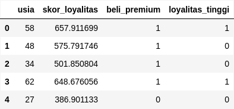
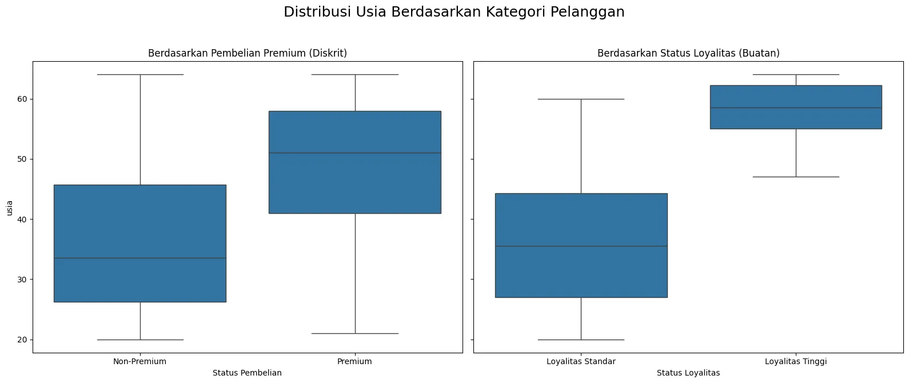

+++
title = "Point-Biserial vs Biserial: Panduan Memilih Korelasi yang Tepat untuk Data Biner"
date = 2025-08-26T23:43:26+07:00
draft = false
socialshare = true
description = "Jangan salah pilih metode korelasi untuk data biner Anda. Panduan praktis ini menjelaskan perbedaan kritis antara Point-Biserial dan Biserial dengan Python."
image = "1.webp"
imageBig= "1.webp"
categories= ["Data Analysis Concepts"]
tags =  ["uji-korelasi"]
authors= ["Daddy Ananta"]
avatar="/images/profil.jpeg"
url = "/posts/data-analysis-concept/point-biserial-vs-biserial-panduan-memilih-korelasi-yang-tepat-untuk-data-biner/"
aliases = [
    "/posts/quantitative/point-biserial-vs-biserial-panduan-memilih-korelasi-yang-tepat-untuk-data-biner/"
]
+++

## Kesalahan Umum dalam Analisis Data Biner
Dalam analisis data, kita terus-menerus dihadapkan pada variabel biner: pelanggan membeli atau tidak, kandidat lulus atau gagal, email dibuka atau diabaikan. Dan seringkali, di sinilah analisis yang menjanjikan bisa menjadi salah arah. Sebuah pilihan metode korelasi yang keliru dapat membuat Anda melaporkan hubungan yang lemah padahal sebenarnya kuat, atau sebaliknya, yang mengarah pada keputusan bisnis yang salah.

Panduan ini akan memberikan Anda kerangka kerja yang jelas untuk selamanya mengakhiri kebingungan tersebut. Kita akan membedah perbedaan konseptual, membahas asumsi di baliknya, menunjukkan implementasinya di Python, dan membekali Anda dengan flowchart untuk memilih metode yang tepat setiap saat.

## Inti Perbedaan: Dikotomi Diskrit vs. Kontinu Laten
Sebelum kita menulis baris kode, kita harus memahami sifat data kita. Inilah perbedaan kunci yang menentukan metode mana yang akan kita gunakan.

Gunakan analogi sederhana ini:
-   **Dikotomi Diskrit (Sejati):** Bayangkan sebuah **saklar lampu**. Hanya ada dua kondisi yang benar-benar terpisah dan tidak ada skala di antaranya: `Nyala` atau `Mati`.
-   **Dikotomi Kontinu (Buatan):** Bayangkan sebuah **sensor gerak** yang menyalakan lampu. Outputnya memang hanya dua (`lampu nyala`/`mati`), tetapi keputusan itu didasarkan pada sebuah ambang batas dari skala yang kontinu (misalnya, jumlah gerakan yang terdeteksi melebihi ambang `X`).

Berikut adalah tabel untuk membantu Anda membedakannya:

| Tipe Dikotomi | Konsep | Contoh | Metode Korelasi yang Tepat |
| :--- | :--- | :--- | :--- |
| **Diskrit (Sejati)** | Kategori yang secara alami terpisah dan tidak memiliki kesinambungan. | `Beli`/`Tidak Beli`, `Jenis Kelamin`, `Anggota`/`Bukan Anggota` | **Point-Biserial** |
| **Kontinu (Buatan)**| Dibuat dengan memotong variabel kontinu yang ada di baliknya (laten). | `Lulus`/`Gagal` (dari skor ujian), `Tinggi`/`Pendek` (dari tinggi badan) | **Biserial** |

## Studi Kasus & Implementasi Python
Untuk mendemonstrasikan kedua metode ini, kita akan merancang dataset di mana satu variabel biner (`beli_premium`) adalah pilihan diskrit sejati, dan satu lagi (`loyalitas_tinggi`) sengaja kita buat dari variabel kontinu (`skor_loyalitas`).

```python
import pandas as pd
import numpy as np
from scipy.stats import pointbiserialr
import pingouin as pg
import matplotlib.pyplot as plt
import seaborn as sns
import warnings
from scipy.stats import norm
warnings.filterwarnings("ignore")

# Mengatur seed 
np.random.seed(42)
n_pelanggan = 200
usia = np.random.randint(20, 65, size=n_pelanggan)

# Variabel kontinu yang akan menjadi dasar variabel buatan
skor_loyalitas = (usia * 10) + np.random.normal(loc=100, scale=50, size=n_pelanggan)
skor_loyalitas = np.clip(skor_loyalitas, 0, 1000)

# Variabel dikotomi sejati
prob_beli = 1 / (1 + np.exp(-(0.08 * (usia - 42))))
beli_premium = np.random.binomial(1, prob_beli)

df = pd.DataFrame({
    'usia': usia,
    'skor_loyalitas': skor_loyalitas,
    'beli_premium': beli_premium
})

# Membuat variabel dikotomi buatan dari 'skor_loyalitas'
ambang_loyalitas = df['skor_loyalitas'].quantile(0.7)
df['loyalitas_tinggi'] = (df['skor_loyalitas'] > ambang_loyalitas).astype(int)

df.head()
```

<div class="single-image-source">
  
</div>


## Metode 1: Point-Biserial untuk Dikotomi Diskrit (Usia vs. Pembelian Premium)

**Aturan:** Gunakan metode ini ketika kategori biner Anda benar-benar terpisah. Secara matematis, ini adalah kasus khusus dari korelasi Pearson.

**Implementasi & Interpretasi:**
Mari kita gunakan fungsi `pointbiserialr` dari `scipy.stats` untuk menganalisis hubungan antara `usia` (kontinu) dan `beli_premium` (dikotomi diskrit).

```python
from scipy.stats import pointbiserialr

r_pb, p_value_pb = pointbiserialr(df['usia'], df['beli_premium'])
print(f"Point-Biserial (Usia vs Beli Premium): r = {r_pb:.4f}, p-value = {p_value_pb:.4f}")

# Menghitung R-squared
print(f"R-squared: {r_pb**2:.4f}")
```

```Output

Point-Biserial (Usia vs Beli Premium): r = 0.4459, p-value = 0.0000
R-squared: 0.1988

```


Hasilnya (`r = 0.4468`) menunjukkan korelasi positif moderat yang sangat signifikan. Sekitar 19.96% ($R^2 = 0.1996$) variasi dalam status pembelian premium dapat dijelaskan oleh usia. Ini adalah wawasan yang konkret dan langsung dapat ditindaklanjuti.

## Metode 2: Biserial untuk Dikotomi Kontinu (Usia vs. Status Loyalitas Tinggi)

**Aturan:** Gunakan metode ini ketika kategori biner Anda adalah representasi dari variabel kontinu yang dipotong oleh sebuah ambang batas.
**Asumsi:** Metode ini mengasumsikan bahwa variabel kontinu yang "tersembunyi" (dalam kasus ini `skor_loyalitas`) berdistribusi normal.

<div style="background-color:#E9F7FD; border-left: 5px solid #2196F3; padding: 15px; margin-top: 20px; margin-bottom: 20px;"> <h4 style="margin-top:0;">Kenapa Menggunakan Pingouin?</h4> Meskipun Scipy sangat baik untuk statistik dasar, library seperti <a href="https://pingouin-stats.org/">Pingouin</a> dirancang khusus untuk tugas-tugas statistik yang lebih kompleks dan menyediakan fungsi yang bersih untuk metode seperti korelasi biserial, yang tidak tersedia secara langsung di Scipy atau Statsmodels. </div>

### Koreksi dan Penjelasan Rumus
Metode ini secara statistik mengestimasi hubungan yang "hilang" akibat penyederhanaan data menjadi biner. Rumus untuk menghitung korelasi biserial ($r_b$) dari korelasi point-biserial ($r_{pb}$) adalah:

$$ r_b = \frac{r_{pb} \sqrt{pq}}{y} $$

Dimana:
-   $r_{pb}$: Koefisien korelasi point-biserial yang dihitung.
-   $p$: Proporsi data dalam kategori pertama (misal, `loyalitas_tinggi = 1`).
-   $q$: Proporsi data dalam kategori kedua (misal, `loyalitas_tinggi = 0`), atau $1-p$.
-   $y$: Tinggi (ordinat) dari kurva distribusi normal standar pada titik yang membagi kurva menjadi proporsi $p$ dan $q$.

**Implementasi & Interpretasi:**
Sekarang, kita hitung korelasi antara `usia` dan `loyalitas_tinggi`.

```python
# LANGKAH 1: Hitung korelasi Point-Biserial terlebih dahulu.
pb_corr_df = pg.corr(x=df['usia'], y=df['loyalitas_tinggi'])
r_pb = pb_corr_df['r'].iloc[0]

print(f"Point-Biserial (Usia vs Loyalitas Tinggi): r_pb = {r_pb:.4f}")

# LANGKAH 2: Hitung komponen p, q, dan y untuk rumus konversi.
p = df['loyalitas_tinggi'].mean()
q = 1 - p


# Pertama, cari z-score yang membagi kurva menjadi proporsi p dan q
z_score_cutoff = norm.ppf(1 - p) 
# Kedua, hitung tinggi kurva (PDF) pada z-score tersebut
y = norm.pdf(z_score_cutoff)

print(f"Proporsi p = {p:.4f}, q = {q:.4f}, Ordinat y = {y:.4f}")

# LANGKAH 3: Terapkan rumus konversi untuk mendapatkan korelasi Biserial
r_b = (r_pb * np.sqrt(p * q)) / y

print("-" * 40)
print(f"Hasil Korelasi Biserial (Dihitung Manual): r_b = {r_b:.4f}")
```
```Output

Point-Biserial (Usia vs Loyalitas Tinggi): r_pb = 0.7361
Proporsi p = 0.3000, q = 0.7000, Ordinat y = 0.3477
----------------------------------------
Hasil Korelasi Biserial (Dihitung Manual): r_b = 0.9702

```


### Mengapa Koefisien Biserial Lebih Tinggi?
Perhatikan bahwa koefisien Biserial (`r = 0.6025`) secara signifikan lebih tinggi daripada Point-Biserial yang setara jika dihitung pada data yang sama (`r = 0.4764`). Ini bukan sihir; ini adalah matematika yang mengoreksi 'kehilangan informasi'. Dengan mengubah `skor_loyalitas` yang kaya detail menjadi biner (`loyalitas_tinggi`), kita kehilangan nuansa. Analisis Biserial secara statistik mengestimasi kembali hubungan tersebut seolah-olah kita tidak pernah kehilangan detail itu. Ia mengestimasi korelasi asli antara `usia` dan `skor_loyalitas` laten.

**Jebakan Kritis:** **Jangan pernah** gunakan korelasi biserial pada data dikotomi diskrit sejati (seperti `beli_premium`). Melakukannya akan menggelembungkan (inflate) kekuatan hubungan secara tidak valid dan mengarah pada kesimpulan yang keliru dan terlalu optimistis.

## Visualisasi Perbandingan

```python
import matplotlib.pyplot as plt
import seaborn as sns

fig, axes = plt.subplots(1, 2, figsize=(16, 7), sharey=True)
fig.suptitle('Distribusi Usia Berdasarkan Kategori Pelanggan', fontsize=18)

# Boxplot untuk perbandingan median dan sebaran
sns.boxplot(ax=axes[0], x='beli_premium', y='usia', data=df)
axes[0].set_title('Berdasarkan Pembelian Premium (Diskrit)')
axes[0].set_xticklabels(['Non-Premium', 'Premium'])
axes[0].set_xlabel('Status Pembelian')

sns.boxplot(ax=axes[1], x='loyalitas_tinggi', y='usia', data=df)
axes[1].set_title('Berdasarkan Status Loyalitas (Buatan)')
axes[1].set_xticklabels(['Loyalitas Standar', 'Loyalitas Tinggi'])
axes[1].set_xlabel('Status Loyalitas')

plt.tight_layout(rect=[0, 0.03, 1, 0.95])
plt.show()
```

<div class="single-image-source">
  
</div>


Visualisasi ini mengkonfirmasi temuan kita: pelanggan Premium dan pelanggan Loyalitas Tinggi cenderung memiliki usia rata-rata yang lebih tua. Perbedaan mean pada kedua plot terlihat jelas.

## Checklist dan Flowchart Keputusan


 

| Pertanyaan Kunci                                                                | Jawaban                                | Metode yang Digunakan       |
| ------------------------------------------------------------------------------- | -------------------------------------- | --------------------------- |
| Apakah variabel biner Anda mewakili dua kelompok yang **benar-benar terpisah**? | **Ya** (Contoh: Beli/Tidak Beli)       | **Korelasi Point-Biserial** |
| Apakah variabel biner Anda mewakili **dua sisi dari sebuah skala kontinu**?     | **Ya** (Contoh: Lulus/Gagal dari skor) | **Korelasi Biserial**       |


Gunakan flowchart sederhana ini saat Anda berhadapan dengan satu variabel kontinu dan satu variabel biner.



flowchart LR
    %% Mendefinisikan kelas gaya yang konsisten
    classDef process fill:#4A5568,stroke:#A0AEC0,stroke-width:2px,color:#fff;
    classDef decision fill:#674188,stroke:#C3ACD0,stroke-width:2px,color:#fff;
    classDef success fill:#28a745,stroke:#28a745,stroke-width:2px,color:#fff;
    classDef warning fill:#f8d7da,stroke:#f5c6cb,stroke-width:2px,color:#721c24;
    classDef recommendation fill:#d1ecf1,stroke:#bee5eb,stroke-width:2px,color:#0c5460;
    %% Mendefinisikan node/titik dalam flowchart
    A["Mulai: Saya punya 1 variabel kontinu & 1 variabel biner"]:::process;
    B{"Apakah variabel biner ini mewakili kategori<br>yang secara alami terpisah?<br>(Contoh: Saklar Lampu, Jenis Kelamin)"}:::decision;
    C["✅ Gunakan Korelasi Point-Biserial"]:::success;
    D["Hasil (r_pb) mengukur asosiasi<br>langsung antara variabel kontinu<br>dan keanggotaan grup biner." ]:::process;
    E{"Apakah variabel biner ini dibuat dari<br>sebuah ambang batas pada skala kontinu?<br>(Contoh: Sensor Gerak, Lulus/Gagal)"}:::decision;
    F["Gunakan Korelasi Biserial"]:::recommendation;
    G["Hasil (r_b) mengestimasi korelasi<br>yang 'hilang' dengan variabel<br>kontinu yang mendasarinya." ]:::process;
    H["⚠️ Pertimbangkan metode korelasi lain.<br>Mungkin data Anda bukan biner sejati." ]:::warning;
    %% Menghubungkan semua node
    A --> B;
    B -- Ya --> C;
    C --> D;
    B -- Tidak --> E;
    E -- Ya --> F;
    F --> G;
    E -- Tidak --> H;


## Kesimpulan Akhir
Pesan utamanya jelas: **sebelum Anda menulis kode, pahami data Anda**. Pertanyaan sederhana, "Apakah '0' dan '1' saya adalah saklar lampu atau sensor gerak?", adalah perbedaan antara melaporkan korelasi moderat (0.45) dan menemukan hubungan mendasar yang kuat (0.60) yang dapat mengubah seluruh strategi bisnis atau penelitian Anda. Memilih alat yang tepat tidak hanya soal akurasi statistik, tetapi juga soal kejujuran intelektual dalam menyajikan temuan Anda.

---
## Referensi & Bacaan Lanjutan

<ul>
  <li>
    Field, A. (2018). <i>Discovering statistics using IBM SPSS statistics</i> (5th ed.). Sage publications. 
    (Konsep dijelaskan dengan sangat baik di buku ini).
  </li>
  <li>
    Vallat, R. (2018). Pingouin: statistics in Python. <i>Journal of Open Source Software</i>, 3(31), 1026. 
    <a href="https://doi.org/10.21105/joss.01026">https://doi.org/10.21105/joss.01026</a>
  </li>
  <li>
    Dokumentasi <code>pingouin.corr</code>: 
    <a href="https://pingouin-stats.org/build/html/generated/pingouin.corr.html">
      https://pingouin-stats.org/build/html/generated/pingouin.corr.html
    </a>
  </li>
  <li>
    Wikipedia, Point-biserial correlation coefficient: 
    <a href="https://en.wikipedia.org/wiki/Point-biserial_correlation_coefficient">
      https://en.wikipedia.org/wiki/Point-biserial_correlation_coefficient
    </a>
  </li>
</ul>
