+++
title = 'Statistik Regresi Linear Sederhana dengan Python'
date = 2025-05-12T00:37:00+00:00
draft = false
socialshare = true
description = "Regresi linear adalah metode dalam statistik yang digunakan untuk memprediksi nilai suatu variabel berdasarkan variabel lain. Sesuai dengan namanya, linear berarti hubungan antara kedua variabel digambarkan dengan garis lurus. Jadi, jika satu variabel berubah, variabel lainnya juga akan berubah secara teratur mengikuti pola garis lurus. Regresi linear sering digunakan untuk melihat atau memperkirakan hubungan sebab-akibat antara dua hal."
image = "1.webp"
imageBig= "1.webp"
categories= ["Data Analysis Concepts"]
tags = ["Python","Regresi"]
avatar="/images/profil.jpeg"
+++


Misalnya, kita penasaran mengenai hubungan antara kualitas suatu produk dengan tingkat kepuasan pengguna. Asumsinya adalah semakin tinggi kualitas produk yang dirasakan pengguna, maka tingkat kepuasan mereka juga akan semakin tinggi. Dengan kata lain, kita menduga bahwa ada hubungan positif antara persepsi kualitas produk dan kepuasan pelanggan. Untuk menguji asumsi ini secara lebih objektif dan terukur, kita bisa menggunakan metode regresi linear untuk melihat apakah benar terdapat pola hubungan antara kedua variabel tersebut. Atau bisa jadi, persepsi kepuasan tidak hanya dipengaruhi oleh kualitas, melainkan juga faktor lain seperti layanan purna jual atau harga?

Tentu saja, untuk dapat mengukur tingkat kepuasan penggunaan produk, kita memerlukan indikator penilaian yang jelas dan sistematis. Misalnya, kita bisa menilai berbagai aspek produk seperti kekuatan dan daya tahan, fungsionalitas, desain dan estetika, kesesuaian spesifikasi, serta kemudahan penggunaan, yang masing-masing diberi skor dalam rentang 1 hingga 10. Walaupun persepsi kepuasan bersifat subjektif, penilaian ini sebaiknya disusun berdasarkan standar umum atau survei yang telah teruji validitas dan reliabilitasnya. 

Beberapa indikator yang bisa digunakan antara lain kepuasan terhadap produk, kepuasan terhadap harga, pengalaman pembelian, pelayanan pelanggan, dan loyalitas pelanggan. Jika kita memiliki 5 indikator penilaian, maka skor maksimum yang dapat dicapai adalah 50, yang menunjukkan tingkat kepuasan yang sangat tinggi. Sebaliknya, nilai yang rendah mengindikasikan adanya ketidakpuasan pengguna terhadap berbagai aspek produk. Sistem penilaian seperti ini penting agar analisis terhadap kepuasan pelanggan dapat dilakukan secara konsisten, objektif, dan berbasis data.

## Data 

Untuk pemahaman yang lebih dalam, kita akan menggunakan data survey ilustrasi yang dapat diakses <a href="https://github.com/DaddyAnanta/Data/blob/main/Regresi-Linear-Sederhana/data_kepuasan_pelanggan.csv" download="data_kepuasan_pelanggan.csv">📥 di sini</a>.

```python
import pandas as pd

data = pd.read_csv("data_kepuasan_pelanggan.csv")
print(data.head())
```

<div class="single-image-source">
  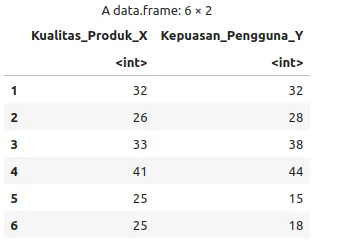Ilustrasi kelompok penelitian" style="height:60%;width:60%;display:block;margin-left:auto;margin-right:auto;">
</div>

Jika kita melihat hubungannya dengan scatter plot kita dapat melihat hasilnya dengan


```python
import matplotlib.pyplot as plt
import seaborn as sns

# Atur style plot agar mirip theme_minimal()
sns.set_style("whitegrid")
plt.figure(figsize=(8, 5))

# Buat scatter plot
sns.scatterplot(data=data, x="Kualitas_Produk_X", y="Kepuasan_Pengguna_Y", color="blue", s=60)

plt.title("Scatter Plot Kualitas Produk vs Kepuasan Pengguna")
plt.xlabel("Kualitas Produk (X)")
plt.ylabel("Kepuasan Pengguna (Y)")
plt.show()
```

<div class="single-image-source">
  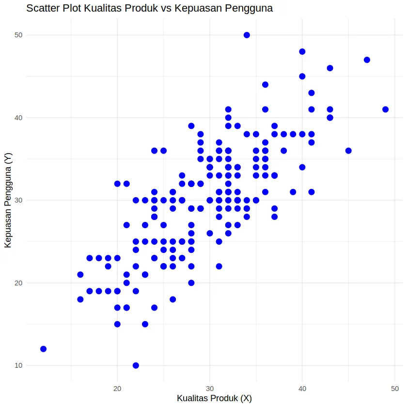Ilustrasi kelompok penelitian" style="height:60%;width:60%;display:block;margin-left:auto;margin-right:auto;">
</div>

Sebagai informasi, nilai dari titik pada grafik ini merepresentasikan hubungan antara Kualitas Produk dan Kepuasan Pengguna. Misalnya, pada contoh di bawah ini, titik yang ditandai menunjukkan nilai Kualitas Produk sebesar 22 dan nilai Kepuasan Pengguna sebesar 10.

<div class="single-image-source">
  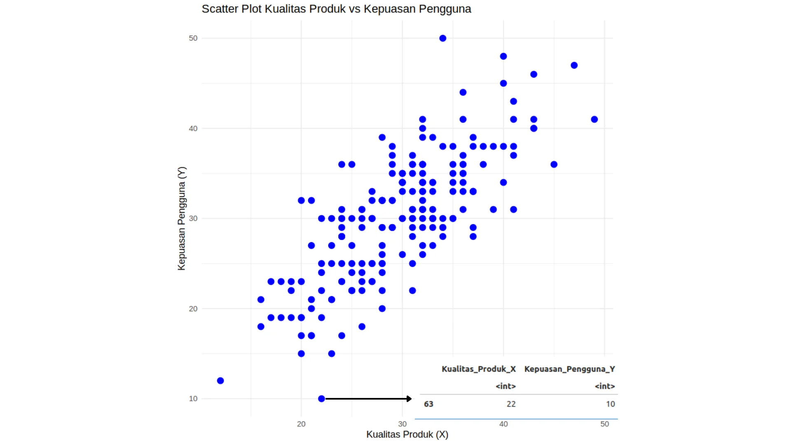Ilustrasi kelompok penelitian" style="height:60%;width:60%;display:block;margin-left:auto;margin-right:auto;">
</div>


Dari bentuk gambar ini, sebenarnya kita dapat menganalisis apakah hubungan tersebut bersifat positif, negatif, atau tidak memiliki hubungan sama sekali. Gambar ini diambil dari buku _Elementary Statistics_ edisi ke-9, pada pembahasan mengenai _Scatter Diagrams and Correlation_.

<div class="single-image-source">
  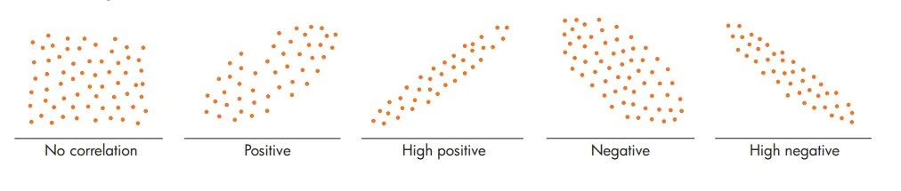Ilustrasi kelompok penelitian" style="height:60%;width:60%;display:block;margin-left:auto;margin-right:auto;">
</div>


Dari hubungan ini, kita dapat berasumsi bahwa hubungan antara kedua variabel berada pada kategori **positif** atau **positif tinggi** (_high positive_). Artinya, terdapat hubungan positif antara kualitas produk dan kepuasan pelanggan: semakin tinggi kualitas produk, maka semakin tinggi pula tingkat kepuasan pelanggan. Namun, karena kesimpulan ini masih bersifat asumtif, maka diperlukan pengujian statistik untuk menguji validitas hubungan tersebut secara objektif.


## Uji Asumsi 1: Uji Linearitas

Memastikan bahwa hubungan antara variabel independen (X) dan variabel dependen (Y) bersifat linear merupakan asumsi paling fundamental dalam regresi linear sederhana. Asumsi ini memungkinkan kita untuk menilai apakah hubungan antara kedua variabel tersebut cocok dengan model linear (berbentuk garis lurus), atau justru menunjukkan pola yang bersifat non-linear (seperti melengkung, berbentuk kurva, polinomial, atau pola lainnya).

```python
import matplotlib.pyplot as plt
import seaborn as sns

sns.set_style("whitegrid")
plt.figure(figsize=(8, 5))

# regplot di seaborn menggabungkan scatter plot dan garis regresi linear
sns.regplot(
    data=data,
    x="Kualitas_Produk_X",
    y="Kepuasan_Pengguna_Y",
    ci=None,  # ci=None sama dengan se = FALSE
    line_kws={'color': 'blue'},
    scatter_kws={'color': 'black', 's': 30}
)

plt.title("Uji Linearitas Visual")
plt.xlabel("Kualitas Produk (X)")
plt.ylabel("Kepuasan Pengguna (Y)")
plt.show()
```

<div class="single-image-source">
  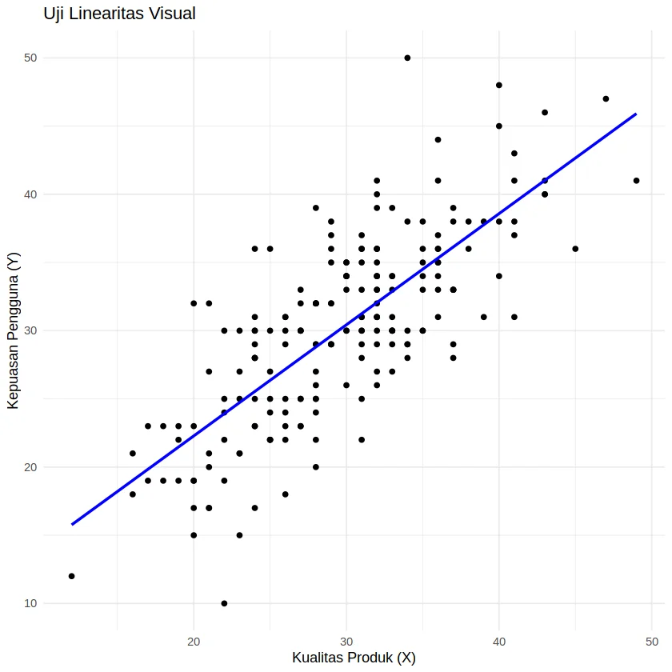Ilustrasi kelompok penelitian" style="height:60%;width:60%;display:block;margin-left:auto;margin-right:auto;">
</div>


```python
import matplotlib.pyplot as plt
import seaborn as sns

sns.set_style("whitegrid")
plt.figure(figsize=(8, 5))

# Gunakan 'order=2' untuk regresi polinomial (orde 2)
sns.regplot(
    data=data,
    x="Kualitas_Produk_X",
    y="Kepuasan_Pengguna_Y",
    order=2, # Ini setara dengan y ~ poly(x, 2)
    ci=None, # se = FALSE
    line_kws={'color': 'red'},
    scatter_kws={'color': 'black', 's': 30}
)

plt.title("Uji Linearitas Visual dengan Regresi Polinomial (Orde 2)")
plt.xlabel("Kualitas Produk (X)")
plt.ylabel("Kepuasan Pengguna (Y)")
plt.show()
```
<div class="single-image-source">
  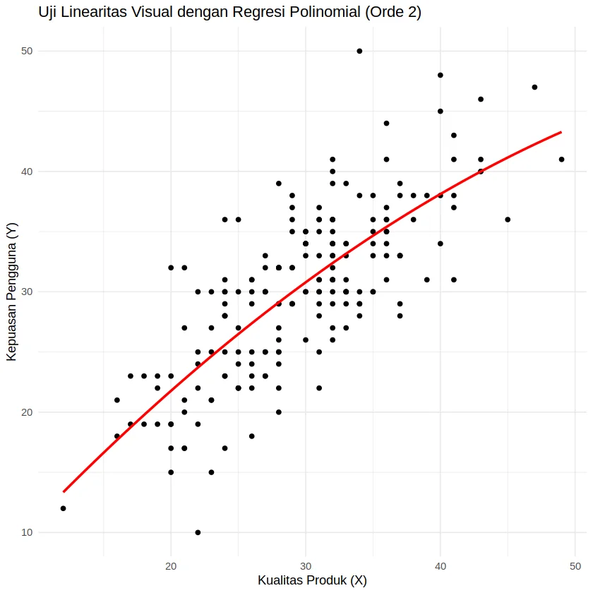Ilustrasi kelompok penelitian" style="height:60%;width:60%;display:block;margin-left:auto;margin-right:auto;">
</div>


Pemahaman mengenai linearitas sebenarnya cukup sederhana. Kita bisa mengibaratkan garis regresi sebagai jaring ikan. Ketika kita "melempar" jaring ini—baik dalam bentuk garis lurus (regresi linear) maupun lengkung (regresi polinomial atau non-linear)—tujuan utamanya adalah menangkap sebanyak mungkin "ikan", yaitu titik-titik data.

Nah, pertanyaannya: dengan pola lemparan seperti apa kita bisa menangkap lebih banyak ikan? Di sinilah pentingnya **uji linearitas**. Jika lemparan dengan garis lurus tidak mampu menangkap banyak titik data (dengan kata lain, **tidak lolos uji linearitas**), maka kita perlu mengganti pendekatan dengan menggunakan model non-linear. Sederhana, bukan?

### Integrasi 
```python
import statsmodels.api as sm
import statsmodels.formula.api as smf

# Model linear
model_linear = smf.ols('Kepuasan_Pengguna_Y ~ Kualitas_Produk_X', data=data).fit()

# Model kuadratik (non-linear)
# Di statsmodels, kita gunakan I(X**2) untuk mereplikasi poly(X, 2) dalam konteks ini
model_quad = smf.ols('Kepuasan_Pengguna_Y ~ Kualitas_Produk_X + I(Kualitas_Produk_X**2)', data=data).fit()

# Bandingkan dengan ANOVA
anova_result = sm.stats.anova_lm(model_linear, model_quad)
print(anova_result)
```

<div class="single-image-source">
  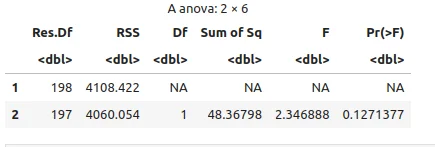Ilustrasi kelompok penelitian" style="height:80%;width:80%;display:block;margin-left:auto;margin-right:auto;">
</div>


**Kesimpulan:**

**Nilai p (`Pr(>F)`) = 0.1271** (lebih besar dari 0.05). Ini berarti **tidak ada perbedaan signifikan** antara model linear dan polynomial. berdasarkan hasil ANOVA ini, model linear (`model_linear`) dianggap lebih parsimonious (lebih sederhana namun cukup baik) dan lebih disukai daripada model kuadratik (`model_quad`) untuk data ini.

Untuk perhitungan secara manual dapat dilihat di sini

## Uji Asumsi 2: Uji Normalitas Kolmogorov-Smirnov

```python
from scipy import stats
import numpy as np

# Ambil data variabel Y dan X
y = data['Kepuasan_Pengguna_Y']
x = data['Kualitas_Produk_X']

# Hitung rata-rata dan standar deviasi
# ddof=1 agar np.std() setara dengan sd() di R
mean_y = np.mean(y)
sd_y = np.std(y, ddof=1)
mean_x = np.mean(x)
sd_x = np.std(x, ddof=1)

# Uji Kolmogorov-Smirnov untuk X terhadap distribusi normal
# args=(mean, std) untuk mencocokkan parameter tes di R
ks_x = stats.kstest(x, 'norm', args=(mean_x, sd_x))

# Uji Kolmogorov-Smirnov untuk Y terhadap distribusi normal
ks_y = stats.kstest(y, 'norm', args=(mean_y, sd_y))

# Tampilkan hasil uji
print("Hasil Uji K-S untuk X:")
print(ks_x)

print("\nHasil Uji K-S untuk Y:")
print(ks_y)
```
<div class="single-image-source">
  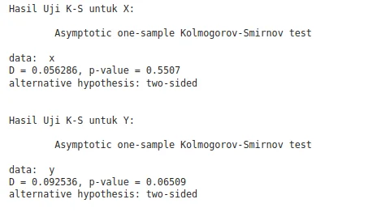Ilustrasi kelompok penelitian" style="height:80%;width:80%;display:block;margin-left:auto;margin-right:auto;">
</div>

## Uji Asumsi 3: Uji Homoskedastisitas

Memastikan bahwa varians dari residual adalah konstan (sama) untuk semua tingkat nilai variabel independen (X). Lawan dari homoskedastisitas adalah heteroskedastisitas (varians residual tidak konstan).

### Uji Breusch-Pagan

#### Interpretasi:

- **p-value < 0.05** → terjadi **heteroskedastisitas** (varians residual tidak konstan).
    
- **p-value ≥ 0.05** → tidak ada bukti heteroskedastisitas (data **homoskedastik**).

```python
import statsmodels.api as sm
import statsmodels.formula.api as smf
from statsmodels.compat import lzip

# Buat model regresi
model = smf.ols('Kepuasan_Pengguna_Y ~ Kualitas_Produk_X', data=data).fit()

# Lakukan uji Breusch-Pagan
# sm.stats.het_breuschpagan mengembalikan:
# (lm_statistic, lm_pvalue, f_statistic, f_pvalue)
bp_test_result = sm.stats.het_breuschpagan(model.resid, model.model.exog)

# Format output agar mudah dibaca
labels = ['LM Statistic', 'LM-Test p-value', 'F-Statistic', 'F-Test p-value']
print("Hasil Uji Breusch-Pagan:")
print(dict(lzip(labels, bp_test_result)))
```

<div class="single-image-source">
  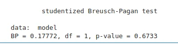Ilustrasi kelompok penelitian" style="height:80%;width:80%;display:block;margin-left:auto;margin-right:auto;">
</div>

Kesimpulan:
- P-value = 0.6733

berdasarkan uji Breusch-Pagan dengan tingkat signifikansi 5%, tidak ada bukti statistik yang cukup untuk menyatakan bahwa terdapat masalah heteroskedastisitas dalam model regresi. Dengan kata lain, kita dapat mengasumsikan bahwa asumsi homoskedastisitas (varians error yang konstan) terpenuhi untuk model ini.

## Menentukan  Korelasi dan Prediksi

### Korelasi 

**Tahapan**
- Substitusi Nilai  N, $\sum X$, $\sum Y$,$\sum XY$, $\sum X^2$, dan $\sum Y^2$
- $N(\sum X​Y​)−(\sum X​)(\sum Y​)$
- $N(\sum X^2)−(\sum X​)^2$
- $N(\sum Y^2)−(\sum Y)^2$
- Mencari  nilai r

#### Substitusi Nilai  N, $\sum X$, $\sum Y$,$\sum XY$, $\sum X^2$, dan $\sum Y^2$
```python
# Buat salinan data agar data asli tidak berubah
data_r = data.copy()

# Tambahkan kolom XY dan X^2
# Catatan: Kode R asli memiliki typo 'data_extended', kita asumsikan 'data_r'
data_r['XY'] = data_r['Kualitas_Produk_X'] * data_r['Kepuasan_Pengguna_Y']
data_r['X2'] = data_r['Kualitas_Produk_X']**2
data_r['Y2'] = data_r['Kepuasan_Pengguna_Y']**2

# Lihat hasilnya
print(data_r.head())
```
<div class="single-image-source">
  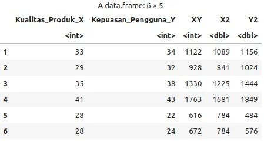Ilustrasi kelompok penelitian" style="height:80%;width:80%;display:block;margin-left:auto;margin-right:auto;">
</div>
Kemudian, 

```python
sum_X = data_r['Kualitas_Produk_X'].sum()
sum_Y = data_r['Kepuasan_Pengguna_Y'].sum()
sum_XY = data_r['XY'].sum()
sum_X2 = data_r['X2'].sum()
sum_Y2 = data_r['Y2'].sum()
# Catatan: Kode R asli memiliki typo 'data_extended', kita gunakan 'data_r'
n = len(data_r) 

# Tampilkan hasilnya
print(f"Jumlah X       : {sum_X}")
print(f"Jumlah Y       : {sum_Y}")
print(f"Jumlah X*Y     : {sum_XY}")
print(f"Jumlah X^2     : {sum_X2}")
print(f"Jumlah Y^2     : {sum_Y2}")
print(f"Jumlah Baris Data   : {n}")
```
<div class="single-image-source">
  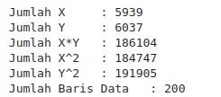Ilustrasi kelompok penelitian" style="height:80%;width:80%;display:block;margin-left:auto;margin-right:auto;">
</div>


 $\sum X$ = 5939;
$\sum Y$ = 6037;
$\sum XY$ = 186104; 
$\sum X^2$ = 184747;
$\sum Y^2$ = 191905;
N (Jumlah baris data)  = 200


#### Pembilang ($N(\sum X​Y​)−(\sum X​)(\sum Y​)$)
<div class="single-code" style="width: 100%; font: inherit; background-color: #f9f9f9; border:1px solid #ccc; color: #333; padding: 10px; border-radius: 5px; margin-bottom:20px; word-wrap: break-word; overflow-wrap: break-word; max-height: 200px; overflow-y: auto;">
  <p>
  $$N(\sum X​Y​)−(\sum X​)(\sum Y​)$$</p>
<p>$$= 200(186104)−(5939)(6037​)$$</p>
<p>$$= 37220800−35853743 = 1367057$$</p></div>


```python
# n, sum_XY, sum_X, dan sum_Y berasal dari blok sebelumnya
pembilang = (n * sum_XY) - (sum_X * sum_Y)

# Tampilkan hasil
print(f"Pembilang (N * ΣXY - ΣX * ΣY): {pembilang}")
```
Pembilang (N * ΣXY - ΣX * ΣY): 1367057

#### Penyebut X($N(\sum X^2)−(\sum X​)^2$)
<div class="single-code" style="width: 100%; font: inherit; background-color: #f9f9f9; border:1px solid #ccc; color: #333; padding: 10px; border-radius: 5px; margin-bottom:20px; word-wrap: break-word; overflow-wrap: break-word; max-height: 200px; overflow-y: auto;">
  <p>$$N(\sum X^2)−(\sum X​)^2$$</p>
  <p>$$ = 200(184747)−(5939)^2$$</p>
  <p>$$ = 36949400 − 35271721 = 1677679$$</p></div>

```python
# Hitung penyebut dari beta_1
penyebut_x = (n * sum_X2) - (sum_X**2)

# Tampilkan hasil
# Catatan: Kode R asli memiliki typo 'penyebut', kita gunakan 'penyebut_x'
print(f"Penyebut (N * ΣX² - (ΣX)²): {penyebut_x}")
```
Penyebut (N * ΣX² - (ΣX)²): 1677679


#### Pernyebut Y ($N(\sum Y^2)−(\sum Y)^2$)
<div class="single-code" style="width: 100%; font: inherit; background-color: #f9f9f9; border:1px solid #ccc; color: #333; padding: 10px; border-radius: 5px; margin-bottom:20px; word-wrap: break-word; overflow-wrap: break-word; max-height: 200px; overflow-y: auto;">
  $$N(\sum Y^2)−(\sum Y)^2$$
  $$= 200(191905) − (6037)^2$$
  $$= 38381000−36445369 = 1935631$$</div>

```python
# Hitung ekspresi
penyebut_y = n * sum_Y2 - (sum_Y**2)

# Tampilkan hasil
print(f"Hasil dari N * ΣY² - (ΣY)² : {penyebut_y}")
```
Hasil dari N * ΣY² - (ΣY)² : 1935631

#### Mencari  nilai r
<div class="single-code" style="width: 100%; font: inherit; background-color: #f9f9f9; border:1px solid #ccc; color: #333; padding: 10px; border-radius: 5px; margin-bottom:20px; word-wrap: break-word; overflow-wrap: break-word; max-height: 200px; overflow-y: auto;">
  <p>$$r = \frac{N(\sum XY) - (\sum X)(\sum Y)}{\sqrt{[N(\sum X^2) - (\sum X)^2][N(\sum Y^2) - (\sum Y)^2]}}$$</p></div>

Secara sederhana karena kita dapat menyederhanakan melalui perhitungan sebelumnya dengan :

<div class="single-code" style="width: 100%; font: inherit; background-color: #f9f9f9; border:1px solid #ccc; color: #333; padding: 10px; border-radius: 5px; margin-bottom:20px; word-wrap: break-word; overflow-wrap: break-word; max-height: 200px; overflow-y: auto;">
  $$r = \frac{\text{Pembilang}}{\sqrt{[\text{Pernyebut X}][\text{Pernyebut Y}]}}$$
  $$r = \frac{1367057}{\sqrt{[1677679][1935631]}}$$
  $$r = \frac{1367057}{\sqrt{3248511157849}}$$
  $$r = \frac{1367057}{1802263.79} = 0.7586 $$</div>

```python
import math

# Hitung r
r = pembilang / math.sqrt(penyebut_x * penyebut_y)

# Tampilkan hasil
print(f"Koefisien Korelasi (r): {r}")
```
Koefisien Korelasi (r): 0.7586141

Dari perhitungan tersebut dapat 

### Integrasi Langsung Untuk Korelasi

- **p-value < 0.05** → Ada korelasi yang signifikan.
    
- **p-value ≥ 0.05** → Tidak ada korelasi yang signifikan.
    
- **Koefisien korelasi (r)** berada di antara -1 dan 1:
    - **r > 0**: korelasi positif
    - **r < 0**: korelasi negatif
    - **r = 0**: tidak ada korelasi linear

```python
from scipy import stats

# Uji korelasi Pearson
# stats.pearsonr mengembalikan (koefisien_korelasi, p_value)
r_value, p_value = stats.pearsonr(data['Kualitas_Produk_X'], data['Kepuasan_Pengguna_Y'])

# Format output yang lebih rapi
print("Hasil Uji Korelasi Pearson:")
print(f"Koefisien Korelasi (r): {r_value:.4f}")
print(f"p-value: {p_value:.4f}")

# Interpretasi hasil
if p_value < 0.05:
    print("Kesimpulan: Ada korelasi yang signifikan.")
else:
    print("Kesimpulan: Tidak ada korelasi yang signifikan.")
```

<div class="single-image-source">
  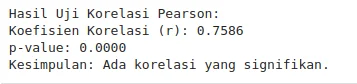Ilustrasi kelompok penelitian" style="height:80%;width:80%;display:block;margin-left:auto;margin-right:auto;">
</div>

### Prediksi

Pada dasarnya, **estimasi Y** dalam model regresi linear adalah hasil dari persamaan regresi, yaitu:

<div class="single-code" style="width: 100%; font: inherit; background-color: #f9f9f9; border:1px solid #ccc; color: #333; padding: 10px; border-radius: 5px; margin-bottom:20px; word-wrap: break-word; overflow-wrap: break-word; max-height: 200px; overflow-y: auto;">
  <p>$$\hat{Y}=β_0+β_1 \times X$$</p></div>

di mana:

- **Y** adalah nilai yang ingin diprediksi.
    
- **β₀ (Intercept)** adalah nilai konstanta (y-intercept) pada model regresi.
    
- **β₁ (Slope)** adalah koefisien regresi yang menunjukkan perubahan rata-rata pada Y untuk setiap perubahan satu unit pada X.
    
- **X** adalah variabel bebas atau prediktor.

Tahap
- Mencari nilai $\sum X$, $\sum Y$,$\sum XY$, dan $\sum X^2$
- Rata-rata X ($\bar{X}$) dan Rata-rata Y ($\bar{Y}$)
- Menghitung Estimasi Slope ($\beta_{1}$)
- Menghitung Estimasi Slope ($\beta_{0}$)
- Persamaan Regresi Estimasi


#### Mencari nilai $\sum X$, $\sum Y$,$\sum XY$, dan $\sum X^2$

Pertama kita perlu menghitung nilai untuk kolom baru yaitu $X \times Y$ dan $X^2$

```python
data_extended = data.copy()

# Tambahkan kolom XY dan X^2
data_extended['XY'] = data_extended['Kualitas_Produk_X'] * data_extended['Kepuasan_Pengguna_Y']
data_extended['X2'] = data_extended['Kualitas_Produk_X']**2

# Lihat hasilnya
print(data_extended.head())
```
<div class="single-image-source">
  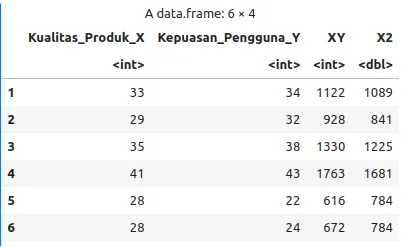Ilustrasi kelompok penelitian" style="height:80%;width:80%;display:block;margin-left:auto;margin-right:auto;">
</div>

Kemudian, 

```python
sum_X = data_extended['Kualitas_Produk_X'].sum()
sum_Y = data_extended['Kepuasan_Pengguna_Y'].sum()
sum_XY = data_extended['XY'].sum()
sum_X2 = data_extended['X2'].sum()

# Tampilkan hasilnya
print(f"Jumlah X     : {sum_X}")
print(f"Jumlah Y     : {sum_Y}")
print(f"Jumlah X*Y   : {sum_XY}")
print(f"Jumlah X^2   : {sum_X2}")
```
<div class="single-image-source">
  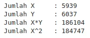Ilustrasi kelompok penelitian" style="height:80%;width:80%;display:block;margin-left:auto;margin-right:auto;">
</div>
dengan kata lain :

 $\sum X$ = 5939;
$\sum Y$ = 6037;
$\sum XY$ = 186104; dan 
$\sum X^2$ = 184747
N (Jumlah baris data)  = 200

```python
n = len(data_extended)
print(n)
```
200

#### Rata-rata X ($\bar{X}$) dan Rata-rata Y ($\bar{Y}$)

<div class="single-code" style="width: 100%; font: inherit; background-color: #f9f9f9; border:1px solid #ccc; color: #333; padding: 10px; border-radius: 5px; margin-bottom:20px; word-wrap: break-word; overflow-wrap: break-word; max-height: 200px; overflow-y: auto;">
  <p>$$\bar{X}= \frac{\sum X}{N} = \frac{5939}{200} = 29.695 $$</p>
  <p>$$\bar{Y}= \frac{\sum Y}{N} = \frac{6037}{200} = 30.185$$</p></div>

```python
# Jumlah data (n) dari blok sebelumnya
# n = len(data_extended)

# Hitung rata-rata X dan Y menggunakan jumlah yang sudah ada
mean_X = sum_X / n
mean_Y = sum_Y / n

# Tampilkan hasilnya
print(f"Rata-rata X (Kualitas Produk) : {mean_X}")
print(f"Rata-rata Y (Kepuasan Pengguna) : {mean_Y}")
```
<div class="single-image-source">
  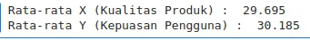Ilustrasi kelompok penelitian" style="height:80%;width:80%;display:block;margin-left:auto;margin-right:auto;">
</div>

#### Menghitung Estimasi Slope ($\beta_{1}$)
<div class="single-code" style="width: 100%; font: inherit; background-color: #f9f9f9; border:1px solid #ccc; color: #333; padding: 10px; border-radius: 5px; margin-bottom:20px; word-wrap: break-word; overflow-wrap: break-word; max-height: 200px; overflow-y: auto;">
  <p>$$ \beta_1 = \frac{N(\sum XY) - (\sum X)(\sum Y)}{N(\sum X^2) - (\sum X)^2} $$</p>
  <p>$$ \beta_1 = \frac{200(186104) - (5939)(6037)}{200(184747) - (5939)^2} $$</p>
  <p>$$ \beta_1 = \frac{37220800−35853743}{36949400−35271721} = \frac{1367057}{1677679} = 0.8148502 $$</p></div>

```python
# Hitung koefisien beta_1 menggunakan rumus yang diberikan
beta_1 = (n * sum_XY - sum_X * sum_Y) / (n * sum_X2 - sum_X**2)

# Tampilkan hasilnya
print(f"Koefisien Beta_1 (Slope): {beta_1}")
```
<div class="single-image-source">
  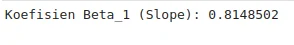Ilustrasi kelompok penelitian" style="height:80%;width:80%;display:block;margin-left:auto;margin-right:auto;">
</div>
Jadi nilai koefisien $\beta_1$ adalah 0.814850

#### Menghitung Estimasi Slope ($\beta_{0}$)

<div class="single-code" style="width: 100%; font: inherit; background-color: #f9f9f9; border:1px solid #ccc; color: #333; padding: 10px; border-radius: 5px; margin-bottom:20px; word-wrap: break-word; overflow-wrap: break-word; max-height: 200px; overflow-y: auto;">
  <p>$$\beta_0 = \bar{Y} - \beta_1 \bar{X}$$</p>
  <p>$$\beta_0 = 30.185 - 0.814850 \times 29.695$$</p>
  <p>$$\beta_0 = 5.988025$$</p></div>
Jadi nilai koefisien $\beta_0$ adalah 5.988025

#### Persamaan Regresi Estimasi
<div class="single-code" style="width: 100%; font: inherit; background-color: #f9f9f9; border:1px solid #ccc; color: #333; padding: 10px; border-radius: 5px; margin-bottom:20px; word-wrap: break-word; overflow-wrap: break-word; max-height: 200px; overflow-y: auto;">
  <p>$$Y=β_0+β_1 \times X$$</p>
  <p>$$Y=5.988025 + 0.814850 \times X$$</p></div>

### Integrasi langsung Prediksi

```python
import statsmodels.formula.api as smf

# Membuat model regresi linear
model = smf.ols('Kepuasan_Pengguna_Y ~ Kualitas_Produk_X', data=data).fit()

# Mengambil nilai koefisien dari model
# model.params[0] adalah intercept, model.params[1] adalah slope
intercept = model.params['Intercept']
slope = model.params['Kualitas_Produk_X']

# Tampilkan koefisien
print(f"Intercept (β₀): {intercept}")
print(f"Slope (β₁): {slope}")
```

<div class="single-image-source">
  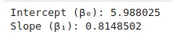Ilustrasi kelompok penelitian" style="height:80%;width:80%;display:block;margin-left:auto;margin-right:auto;">
</div>

Artinya, model regresi yang diperoleh adalah:

<div class="single-code" style="width: 100%; font: inherit; background-color: #f9f9f9; border:1px solid #ccc; color: #333; padding: 10px; border-radius: 5px; margin-bottom:20px; word-wrap: break-word; overflow-wrap: break-word; max-height: 200px; overflow-y: auto;">
  <p>$$\hat Y= 5.988025 + 0.8148502 \times X$$</p></div>

**Sama bukan dengan perhitungan manual sebelumnya.** Sekarang kita dapat membuat prediksi dengan model tersebut. Misalnya, jika nilai kualitas produk kita dalam skala 50 adalah **30**, maka kepuasan pelanggan yang diprediksi dapat dihitung sebagai berikut:

<div class="single-code" style="width: 100%; font: inherit; background-color: #f9f9f9; border:1px solid #ccc; color: #333; padding: 10px; border-radius: 5px; margin-bottom:20px; word-wrap: break-word; overflow-wrap: break-word; max-height: 200px; overflow-y: auto;">
  <p>$$Y= 5.988025 + 0.8148502 \times 30 = 30,433530$$</p></div>

Jadi, dengan nilai kualitas sebesar 30, kepuasan pelanggan yang diprediksi adalah sekitar **30,43**. Namun, karena terdapat ketidakpastian dalam setiap prediksi, kita memerlukan **interval kepercayaan**, yaitu rentang nilai di sekitar prediksi yang mencerminkan tingkat keyakinan kita terhadap hasil tersebut. Umumnya, digunakan **interval kepercayaan 95%**, yang berarti kita 95% yakin bahwa nilai sebenarnya berada dalam rentang tersebut.
### Confidence Interval

Jika nilai **kualitas produk** sebesar **30**, maka nilai **kepuasan pengguna** yang diprediksi adalah sekitar **30,43**.

Namun, karena setiap prediksi mengandung ketidakpastian, kita menggunakan **interval kepercayaan 95%** untuk memberikan gambaran tentang rentang kemungkinan nilai rata-rata kepuasan sebenarnya.

<div class="single-code" style="width: 100%; font: inherit; background-color: #f9f9f9; border:1px solid #ccc; color: #333; padding: 10px; border-radius: 5px; margin-bottom:20px; word-wrap: break-word; overflow-wrap: break-word; max-height: 200px; overflow-y: auto;">
  <p>$$CI(\bar Y) = \hat{Y} \pm t_{\alpha/2,N-p} \times s_e \sqrt{\frac{1}{N} + \frac{(X - \bar{X}^2)}{S_{XX}}} $$</p></div>

Tahap :
- Menghitung Nilai Prediksi($\hat Y$)
- Menghitung Standar Error (sₑ)
- Menghitung $S_{XX}$​ dan Rata-rata $X( \bar{X})$
- Menghitung Confidence Interval untuk Prediksi

#### Menghitung Nilai Prediksi($\hat Y$)

<div class="single-code" style="width: 100%; font: inherit; background-color: #f9f9f9; border:1px solid #ccc; color: #333; padding: 10px; border-radius: 5px; margin-bottom:20px; word-wrap: break-word; overflow-wrap: break-word; max-height: 200px; overflow-y: auto;">
  <p>$$\hat Y= 5.988025 + 0.8148502 \times X$$</p>
  <p>$$\hat Y= 5.988025 + 0.8148502 \times 30 = 30.43353$$</p></div>

```python
# Nilai intercept dan slope dari blok 'Integrasi langsung Prediksi'
# intercept = 5.98802518683...
# slope = 0.81485020760...

# Misalnya X = 30
X_new = 30

# Menghitung prediksi Y (ŷ)
Y_pred = intercept + slope * X_new
print(f"Prediksi Y untuk X = 30 adalah: {Y_pred}")
```
Prediksi Y untuk X = 30 adalah: 30.43353
#### Menghitung Standar Error (sₑ)

Se adalah kolom jarak perbedaan nilai prediksi dengan nilai sebenarnya. Kita dapat membuat kolom baru dengan

```python
# Asumsikan 'model' dari 'Integrasi langsung Prediksi' masih ada
# Menghitung residuals (Y - Y_pred)
residuals = model.resid

data['residuals'] = residuals
print(data.head())
```
<div class="single-image-source">
  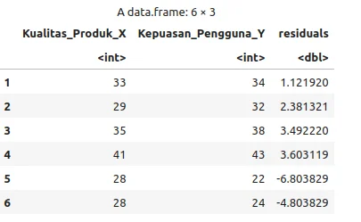Ilustrasi kelompok penelitian" style="height:80%;width:80%;display:block;margin-left:auto;margin-right:auto;">
</div>

<div class="single-code" style="width: 100%; font: inherit; background-color: #f9f9f9; border:1px solid #ccc; color: #333; padding: 10px; border-radius: 5px; margin-bottom:20px; word-wrap: break-word; overflow-wrap: break-word; max-height: 200px; overflow-y: auto;">
  <p>$$S_e = \sqrt{\frac{\sum (Y - \hat Y)^2}{N-2}}$$</p>
  <p>$$S_e = \sqrt{\frac{4108.42}{200-2}} = 4.555174 $$</p></div>

```python
import math

# Menghitung standar error (sₑ)
N = len(data['Kualitas_Produk_X'])
df = N - 2 # Derajat kebebasan (N - 2)
se = math.sqrt(sum(residuals**2) / df)
print(f"Standar error (sₑ): {se}")
```
Standar error (sₑ): 4.555174


#### Menghitung $S_{XX}$​

Membuat kolom $(X-\bar X)^2$

```python
data_CI = data.copy()
X_bar = data_CI['Kualitas_Produk_X'].mean()

# Menghitung S_{XX} = Σ(Xi - X̄)²
data_CI['dev_kuadrat'] = (data_CI['Kualitas_Produk_X'] - X_bar)**2

# Tampilkan dataset dengan kolom S_XX baru
print(data_CI.head())
```
<div class="single-image-source">
  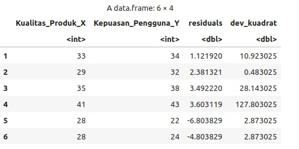Ilustrasi kelompok penelitian" style="height:80%;width:80%;display:block;margin-left:auto;margin-right:auto;">
</div>
Sehingga kita dapat menghitung nilai $S_{XX}$ dengan  

```python
S_XX = data_CI['dev_kuadrat'].sum()
print(f"S_XX: {S_XX}")
```
S_XX: 8388.395

#### Menghitung Confidence Interval untuk Prediksi

<div class="single-code" style="width: 100%; font: inherit; background-color: #f9f9f9; border:1px solid #ccc; color: #333; padding: 10px; border-radius: 5px; margin-bottom:20px; word-wrap: break-word; overflow-wrap: break-word; max-height: 200px; overflow-y: auto;">
  <p>$$t_{\alpha/2,N-p}$$</p></div>

Karena kita memiliki 2 variabel sehingga derajat kebebasan (df) dapat dihitung dengan N - 2(jumlah variabel). Untuk nilai T sendiri dapat dilihat di t tabel (<a href="https://rufiismada.wordpress.com/wp-content/uploads/2012/10/tabel-t.pdf">t tabel</a>), tetapi kita juga dapat melakukannya di R

```python
from scipy import stats

# Jumlah data (N)
N = len(data)

# Derajat kebebasan (N - 2)
df = N - 2

# Nilai t-kritis untuk tingkat kepercayaan 95%
# ppf adalah Percent Point Function (inverse of cdf)
t_value = stats.t.ppf(0.975, df)
print(f"t_value: {t_value}")
```
t_value: 1.972017


dengan menyatukan semua nilai yang ada sehingga kita dapat mencari nilai $CI(\bar Y)$ dari nilai X = 30 dengan

<div class="single-code" style="width: 100%; font: inherit; background-color: #f9f9f9; border:1px solid #ccc; color: #333; padding: 10px; border-radius: 5px; margin-bottom:20px; word-wrap: break-word; overflow-wrap: break-word; max-height: 200px; overflow-y: auto;">
  <p>$$CI(\bar Y) = \hat{Y} \pm t_{\alpha/2,N-p} \times s_e \sqrt{\frac{1}{N} + \frac{(X - \bar{X}^2)}{S_{XX}}} $$</p>
<p>$$= 30.43 \pm 1.97 \times 4.555  \times \sqrt{\frac{1}{200} + (\frac{30 - 29.695}{  
8388.395})}$$</p>
<p>$$= 30.43 \pm 1.97 \times 4.555  \times 0.07$$</p>
<p>$$CI_{lower} = 30.43 - 0.6359 = 29,80$$</p>
<p>$$CI_{upper} = 30.43 + 0.6359 = 31,07$$</p></div>

```python
import math

# Asumsikan nilai Y_pred, t_value, se, N, X_new, X_bar, S_XX ada dari blok sblmnya

# Menghitung margin of error
margin_of_error = t_value * se * math.sqrt((1/N) + ((X_new - X_bar)**2 / S_XX))

# Menghitung interval kepercayaan untuk prediksi Y
CI_lower = Y_pred - margin_of_error
CI_upper = Y_pred + margin_of_error

print(f"Confidence Interval untuk prediksi Y: {CI_lower} sampai {CI_upper}")
```
Confidence Interval untuk prediksi Y: 29.79764 sampai 31.06942


### Integrasi langsung Confidence Interval

```python
# Asumsikan 'model' dari 'Integrasi langsung Prediksi' masih ada
# dan 'pandas' sudah di-import sebagai 'pd'

# Buat data baru untuk prediksi saat kualitas produk = 30
# Harus dalam bentuk DataFrame
data_baru = pd.DataFrame({'Kualitas_Produk_X': [30]})

# Prediksi dengan interval kepercayaan 95%
# Gunakan get_prediction().summary_frame()
prediksi_conf = model.get_prediction(data_baru).summary_frame(alpha=0.05)

# Tampilkan hasil prediksi dan interval kepercayaan
# 'mean' adalah prediksi (fit)
# 'mean_ci_lower' adalah batas bawah (lwr)
# 'mean_ci_upper' adalah batas atas (upr)
print("\nPrediksi Kepuasan dengan Interval Kepercayaan 95%:")
print(prediksi_conf[['mean', 'mean_ci_lower', 'mean_ci_upper']])
```
<div class="single-image-source">
  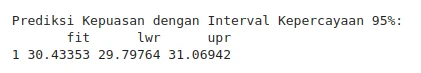Ilustrasi kelompok penelitian" style="height:80%;width:80%;display:block;margin-left:auto;margin-right:auto;">
</div>


Dengan demikian, kita dapat mengatakan:

Dengan tingkat kepercayaan 95%, kepuasan pengguna rata-rata diperkirakan berada dalam rentang **29,80 hingga 31,07** ketika kualitas produk bernilai **30**.

```python
import matplotlib.pyplot as plt
import seaborn as sns

sns.set_style("whitegrid")
plt.figure(figsize=(10, 6))

# Plot regresi dengan confidence interval 95% (level=0.95 adalah default)
sns.regplot(
    data=data,
    x="Kualitas_Produk_X",
    y="Kepuasan_Pengguna_Y",
    ci=95,
    # Sesuaikan dengan style R
    scatter_kws={'color': 'steelblue', 's': 40, 'alpha': 0.8},
    line_kws={'color': 'darkred'}
    # Note: 'fill' dan 'alpha' CI di seaborn lebih sulit diubah
    # seperti di R, jadi kita gunakan default seaborn
)

plt.title("Hubungan antara Kualitas Produk dan Kepuasan Pengguna")
plt.xlabel("Kualitas Produk (X)")
plt.ylabel("Kepuasan Pengguna (Y)")
plt.show()
```

<div class="single-image-source">
  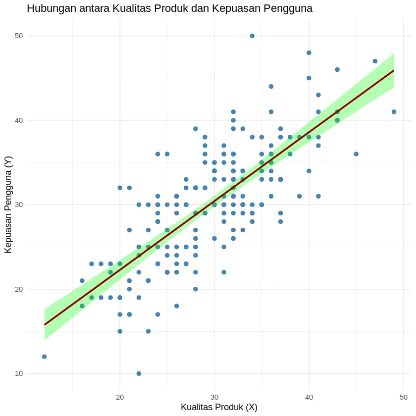Ilustrasi kelompok penelitian" style="height:80%;width:80%;display:block;margin-left:auto;margin-right:auto;">
</div>
Reference :

- Johnson, R. R., & Kuby, P. J. (2004). _Elementary statistics_ (9th ed.). Brooks/Cole.
