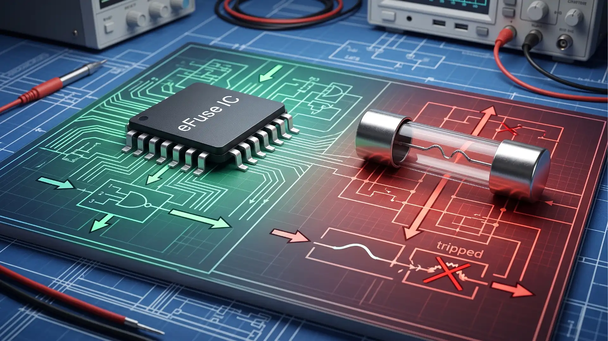
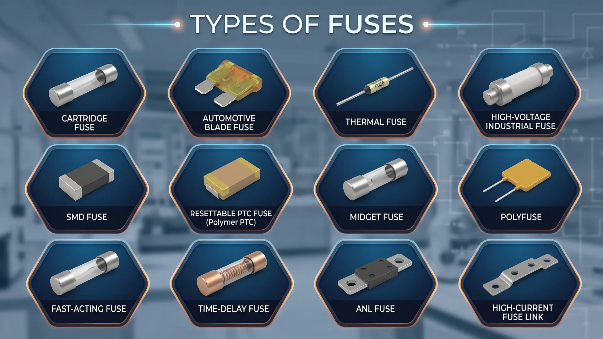

+++
title = "Awas Kebakaran Kelistrikan! Panduan Komprehensif Proteksi Fuse (Sekering)"
date = 2026-08-30T17:53:08+07:00
draft = false
description = "Cegah kebakaran dan kerusakan aset akibat korsleting! Pelajari prinsip kerja, jenis, dan panduan komprehensif sekering (fuse) listrik industri."
image = "fuse.webp"
images = ["/posts/electrical-engineering/fuse/fuse.webp"]
categories = ["Electrical Engineering"]
tags = ["Power System Protection", "Electric Circuit Analysis"]
socialshare = true
concept = "Fuse"
slug = "fuse"
+++

Sistem [distribusi tenaga listrik](https://pepuru.com/posts/electrical-engineering/electrical-distribution/) mulai berkembang sejak pertengahan abad ke-19. Seiring penggunaannya meluas, muncul berbagai masalah seperti ketidakstabilan daya dan panas berlebih pada kabel transmisi. Kondisi inilah yang mendorong berkembangnya konsep perlindungan kelistrikan untuk menjaga sistem tetap aman dan andal.

Pada 1847, Louis-François-Clement Breguet mengusulkan penggunaan kabel penghantar berukuran kecil untuk melindungi stasiun telegraf dari sambaran petir. Gagasan ini kemudian berkembang pada 1864 melalui penggunaan komponen yang mudah meleleh pada instalasi lampu. Prinsip tersebut menjadi dasar teknologi sekering modern yang selanjutnya dipatenkan oleh Thomas Edison pada 1890 sebagai bagian dari sistem kelistrikannya.

Komponen ini melindungi jalur listrik dari arus berlebih (_overcurrent_) dan hubung singkat (_short circuit_). Saat arus melampaui batas aman, sekering akan otomatis putus untuk menghentikan aliran listrik dan mengurangi risiko kerusakan perangkat maupun kebakaran. Karena dirancang sebagai komponen sekali pakai, sekering yang telah putus harus diganti dengan unit baru sebelum sistem dapat digunakan kembali.

Hingga kini, sekering masih banyak digunakan untuk melindungi instalasi listrik karena bentuknya ringkas, andal, dan relatif ekonomis. Namun, pemutus sirkuit (_circuit breaker_) semakin banyak menggantikan perannya karena dapat digunakan kembali setelah gangguan terjadi tanpa perlu mengganti komponennya.

Penggunaan sekering sangat luas, termasuk pada perangkat elektronik berukuran kecil seperti _Printed Circuit Board_ (PCB). Sekering pada rangkaian ini berfungsi memutus arus berlebih dengan cepat sebelum energi gangguan merusak jalur listrik, konektor, atau komponen lain di sekitarnya.

Di sektor industri dan manufaktur, sekering tegangan menengah umumnya dipasang pada panel kelistrikan dan bekerja bersama _[switchgear](https://pepuru.com/posts/electrical-engineering/switchgear/)_. Kombinasi ini membantu mengisolasi area yang mengalami gangguan sehingga kerusakan tidak menyebar ke bagian lain dari sistem kelistrikan.

## Apa itu Fuse (Sekering) Listrik?

Sekering adalah perangkat pengaman yang dipasang pada jalur kelistrikan untuk melindungi sistem dari arus berlebih (_overcurrent_). Komponen utamanya berupa kawat logam yang akan meleleh saat arus melampaui batas aman, sehingga aliran listrik terputus secara otomatis.

Dalam penerapannya, sekering merupakan komponen sekali pakai yang akan putus untuk melindungi peralatan listrik yang lebih bernilai. Selain terjangkau, perangkat ini juga andal karena tidak memiliki komponen bergerak dan mampu memutus arus gangguan dalam kapasitas tinggi (_interrupting rating_).

Saat arus melampaui batas aman, kawat di dalam sekering akan memanas hingga meleleh dan memutus aliran listrik. Namun, tidak semua sekering memiliki kecepatan respons yang sama. Tipe _time-delay_ dapat menahan lonjakan arus awal (_inrush current_) saat perangkat dinyalakan, sedangkan tipe _fast-acting_ dirancang untuk memutus listrik dengan cepat ketika terjadi hubung singkat (_short circuit_).

Pemutusan arus ini membantu mencegah kerusakan peralatan dan risiko kebakaran. Saat ini, pemutus sirkuit (_circuit breaker_) semakin banyak digunakan karena dapat diaktifkan kembali tanpa perlu mengganti komponennya. Meski demikian, sekering tetap menjadi pilihan untuk instalasi yang membutuhkan ukuran ringkas, ketahanan terhadap kondisi lingkungan, dan biaya yang ekonomis.

## Anatomi Komponen dan Simbol Elektrikal

Secara fisik, sekering biasa terdiri dari beberapa bagian utama. Berikut adalah rincian elemen penyusunnya:

- **Bagian Pelebur (Elemen Lebur)**  
  Bagian utama ini juga sering disebut _[fusible link](https://www.linkedin.com/posts/dhivagar-s-6656ba115_expulsionfuse-fuse-dropoutfuse-activity-7488251011179134976-HNhp)_. Bagian tersebut berupa kawat atau pita logam, seperti perak, tembaga, seng, atau aluminium, yang berfungsi menghantarkan listrik. Materialnya dirancang untuk meleleh ketika arus listrik menghasilkan panas yang melampaui batas aman.
    
- **Rumah Pelindung**  
  Bagian ini, yang juga disebut _body_ atau _housing_, berbentuk tabung atau kotak dan umumnya terbuat dari kaca, keramik, atau plastik [tahan panas](https://www.freepatentsonline.com/y2023/0094205.html#2). Fungsinya melindungi komponen di dalam sekering sekaligus mencegah kebocoran arus listrik.  
  Pada sekering berkapasitas besar, terutama tipe tabung, bagian dalamnya biasanya diisi pasir kuarsa. Material ini membantu memadamkan percikan busur listrik (_arc quenching_) yang dapat muncul sesaat setelah elemen leburnya putus.
        
- **Ujung Penyambung (Terminal)**  
  Bagian ini menghubungkan sekering dengan dudukan atau panel listrik. Terminal dibuat dari bahan penghantar yang baik agar arus dapat mengalir dengan lancar. Bentuknya pun beragam, seperti tabung silinder (ferrule), pipih seperti pisau (blade), hingga tipe yang dipasang menggunakan mur dan baut (bolt-down).
    
- **Simbol pada Gambar Kelistrikan**  
  Dalam denah atau skema listrik, sekering digambarkan menggunakan simbol standar. IEC yang banyak digunakan secara internasional memakai bentuk kotak persegi panjang dengan garis lurus di tengahnya.  
  Sementara itu, standar Amerika seperti ANSI menggunakan beberapa variasi simbol, termasuk kotak dengan garis lurus atau garis zigzag. Simbol yang digunakan sebaiknya mengikuti standar gambar kelistrikan yang berlaku di wilayah atau proyek tempat Anda bekerja.

## Prinsip Kerja Pemutusan Arus Listrik

Sistem perlindungan kelistrikan kini berkembang dari sekering konvensional menjadi perangkat elektronik yang disebut _electronic fuse_ (eFuse). Alat ini mampu memutus arus dengan sangat cepat, bahkan dalam hitungan mikrodetik, serta dapat pulih secara otomatis setelah gangguan berakhir. Kemampuan tersebut membuat perlindungan sistem kelistrikan menjadi lebih cepat dan praktis.

### Cara Kerja Sekering Biasa (Mekanisme Panas)

Sekering konvensional bekerja dengan memanfaatkan efek panas. Semakin besar arus yang mengalir dan semakin lama durasinya, semakin panas pula kawat di dalam sekering.

Saat suhu melewati batas, kawat logam akan meleleh dan memutus aliran listrik. Pada korsleting (_short circuit_) dengan arus sangat besar, proses ini dapat menimbulkan busur listrik. Karena itu, sekering industri berkapasitas tinggi (_High Rupturing Capacity_ atau HRC) biasanya diisi pasir kuarsa untuk meredam busur tersebut dengan menyerap panas dan membentuk material seperti kaca padat.

### Teknologi Sekering Elektronik (eFuse)

Berbeda dengan sekering konvensional, _electronic fuse_ (eFuse) tidak menggunakan kawat yang meleleh. Sebagai gantinya, perangkat ini memanfaatkan sensor elektronik dan sakelar berkecepatan tinggi untuk mendeteksi gangguan serta memutus arus listrik.

Karena tidak mengalami kerusakan fisik saat bekerja, eFuse dapat diaktifkan kembali setelah gangguan berakhir. Beberapa model juga mendukung pengendalian jarak jauh dan pemulihan otomatis, sehingga sistem dapat kembali beroperasi tanpa perlu mengganti komponen seperti pada sekering biasa.

## Klasifikasi dan Jenis Sekering Industri

Sekering tersedia dalam berbagai bentuk dan kapasitas yang disesuaikan dengan kebutuhan instalasi listrik. Perbedaannya tidak hanya terletak pada bentuk fisik, tetapi juga kemampuan menahan arus dan jenis peralatan yang dilindunginya.

| **Jenis Sekering**                                               | **Bentuk Fisik**                                                                           | **Fungsi dan Kapasitasnya**                                                                                        |
| ---------------------------------------------------------------- | ------------------------------------------------------------------------------------------ | ------------------------------------------------------------------------------------------------------------------ |
| **Fuse Tabung** (_Cartridge_)                                    | Berbentuk tabung silinder dari kaca, keramik, atau material tahan panas.                   | Digunakan untuk arus rendah hingga menengah, seperti pada panel kontrol, peralatan elektronik, dan mesin industri. |
| **Fuse Tancap** (_Blade_)                                        | Berbentuk plastik pipih dan ringkas dengan kode warna untuk menunjukkan kapasitas arusnya. | Umumnya digunakan pada sistem tegangan rendah, terutama kendaraan seperti mobil dan sepeda motor.                  |
| **Sekering Baut** (_Bolt-down Fuse_)                             | Berukuran lebih besar dengan terminal yang dipasang menggunakan mur dan baut.              | Dirancang untuk menangani arus besar pada sistem distribusi daya, bank baterai, dan kendaraan berat.               |
| **Sekering Industri Berkapasitas Tinggi** (_High-Capacity Fuse_) | Umumnya menggunakan bodi keramik atau rumah pelindung yang kuat dengan terminal khusus.    | Digunakan pada sistem kelistrikan industri untuk melindungi jalur utama dan peralatan berdaya besar.               |

## Faktor Utama Penyebab Fuse Putus

Penggunaan sekering pada instalasi listrik bangunan atau pabrik sering kali menghadapi kendala. Alat pengaman ini bisa rusak atau terputus akibat beberapa kejadian berikut:

- **Korsleting (_Short Circuit_)**  
  Kondisi ini terjadi ketika arus listrik mengalir melalui jalur yang tidak semestinya, misalnya akibat kabel terkelupas yang saling bersentuhan. Gangguan ini menimbulkan lonjakan arus sangat besar sehingga elemen sekering meleleh dan memutus listrik dengan cepat, membantu mencegah kabel mengalami panas berlebih atau terbakar.
    
- **Kelebihan Beban Listrik (_Overload_)**  
  Kondisi ini terjadi ketika terlalu banyak peralatan listrik menggunakan satu jalur secara bersamaan. Akibatnya, arus yang mengalir menjadi terlalu besar dan membuat kabel semakin panas. Jika kondisi ini terus berlangsung, sekering akan meleleh dan memutus aliran listrik sebelum kabel menjadi terlalu panas dan berisiko memicu kebakaran.
    
- **Lonjakan Arus Awal (_Inrush Current_)**  
  Lonjakan arus awal adalah tarikan listrik besar yang terjadi sesaat ketika peralatan seperti pompa air, AC, atau kompresor pertama kali dinyalakan. Besarnya arus ini dapat mencapai beberapa kali lipat dibandingkan arus saat alat bekerja normal. Karena itu, sekering tipe _time-delay_ digunakan agar tidak langsung putus dan salah menganggap lonjakan sesaat tersebut sebagai gangguan seperti korsleting.
    
- **Efek Panas Berulang (Kelelelahan Material)**  
  Setiap kali dialiri listrik, elemen logam di dalam sekering akan memanas dan kembali dingin saat arus berhenti. Siklus ini yang terjadi berulang kali selama bertahun-tahun dapat membuat material perlahan melemah. Akibatnya, sekering bisa putus meskipun tidak terjadi korsleting atau kelebihan beban.

## Cara Mengecek Sekering dengan Multimeter

Kondisi sekering tidak selalu dapat dipastikan hanya dengan melihat bentuk fisiknya. Untuk mengetahui apakah sekering masih berfungsi, lakukan [uji kontinuitas](https://www.digikey.com/en/blog/Testing-and-Identifying-Fuse-Problems#1) (_continuity test_) menggunakan multimeter. Ikuti langkah berikut untuk memeriksa kondisi sekering dengan lebih akurat:

1. **Matikan Aliran Listrik**  
   Pastikan [sumber listrik](https://www.fluke.com/en-au/learn/blog/digital-multimeters/how-to-perform-automotive-continuity-checks-with-a-multimeter) pada jalur yang akan diperiksa sudah dimatikan sebelum melakukan pengujian. Jika sekering dapat dilepas, keluarkan terlebih dahulu menggunakan penjepit khusus (_fuse puller_) agar lebih aman dan tidak merusak [komponen](https://www.sensorprod.com/a-technical-guide-for-how-to-use-a-multimeter/). Jangan melakukan pengujian kontinuitas pada rangkaian yang masih bertegangan.
    
2. **Atur Multimeter**  
   Putar kenop multimeter digital ke mode kontinuitas (_continuity_), yang biasanya ditandai simbol gelombang suara. Anda juga dapat menggunakan mode pengukuran hambatan atau [mode ohmmeter](https://www.fluke.com/en-ie/learn/blog/digital-multimeters/how-to-check-fuse-with-multimeter) (bersimbol Ω menyerupai tapal kuda). Namun, mode kontinuitas lebih praktis karena multimeter akan berbunyi jika jalur di dalam sekering masih tersambung.
    
3. **Tempelkan Kabel Penguji**  
   Tempelkan ujung kabel penguji (_probe_) multimeter pada kedua terminal logam sekering. Posisi kabel merah dan hitam tidak berpengaruh karena pengujian kontinuitas tidak memiliki polaritas.
    
4. **Baca Hasilnya**  
   Periksa layar atau dengarkan bunyi multimeter untuk mengetahui kondisi sekering:
    
    - **Sekering Masih Bagus**  
      Pada mode kontinuitas, multimeter akan berbunyi. Jika menggunakan mode ohmmeter, nilai hambatan yang terbaca umumnya sangat rendah atau mendekati 0 Ω.
        
    - **Sekering Putus**  
      Multimeter tidak akan berbunyi karena jalur di dalam sekering sudah terputus. Pada mode ohmmeter, layar biasanya menampilkan **OL** (_Over Limit_) atau indikator rangkaian terbuka. Sekering tersebut perlu diganti dengan unit baru yang memiliki spesifikasi sesuai.
        

**Catatan Penting:** Sebelum memeriksa sekering, pastikan multimeter berfungsi dengan baik. Sentuhkan kedua ujung kabel penguji (_probe_) satu sama lain. Jika alat bekerja normal, mode kontinuitas akan berbunyi atau layar menunjukkan nilai hambatan yang mendekati 0 Ω.

## Komparasi Teknis Proteksi Listrik: Fuse vs Circuit Breaker

Sekering dan _Miniature Circuit Breaker_ (MCB) sama-sama berfungsi melindungi instalasi dari arus berlebih dan hubung singkat. Namun, keduanya memiliki cara kerja, kecepatan respons, dan karakteristik penggunaan yang berbeda. Perbandingan berikut dapat membantu Anda memahami kelebihan masing-masing perangkat.

| **Aspek Penilaian**        | **Sekering (_Fuse_) Konvensional**                                                                                                          | **Pemutus Sirkuit (_MCB_)**                                                                                                                                                  |
| -------------------------- | ------------------------------------------------------------------------------------------------------------------------------------------- | ---------------------------------------------------------------------------------------------------------------------------------------------------------------------------- |
| **Cara Kerja**             | Memutus arus dengan melelehkan elemen logam saat arus melewati batas aman. Setelah putus, elemen tersebut tidak dapat digunakan kembali.    | Bekerja sebagai sakelar otomatis. Mekanisme termal mendeteksi kelebihan beban, sedangkan mekanisme magnetik merespons lonjakan arus akibat hubung singkat (_short circuit_). |
| **Pemakaian Ulang**        | Dirancang untuk sekali pakai. Sekering yang putus harus diganti dengan unit baru.                                                           | Dapat digunakan kembali. Setelah gangguan teratasi, tuas MCB dapat diaktifkan kembali tanpa mengganti komponennya.                                                           |
| **Kecepatan Memutus Arus** | Umumnya sangat cepat. Tipe tertentu, seperti _current-limiting fuse_, mampu membatasi dan memutus arus gangguan dalam waktu sangat singkat. | Responsnya umumnya lebih lambat karena menggunakan mekanisme elektromekanis. Namun, kecepatannya tetap memadai untuk melindungi instalasi listrik rumah dan bangunan.        |
## FAQ

1. **Bolehkah menyambung langsung sekering yang putus dengan kawat biasa atau kertas timah dalam keadaan darurat?**  
   Tidak boleh, karena material pengganti tersebut tidak dirancang untuk meleleh pada batas arus tertentu secara presisi. Hal ini sangat berbahaya karena menghilangkan fungsi proteksi sirkuit dan dapat memicu kebakaran akibat kabel yang terus memanas.
2. **Apakah aman mengganti sekering yang sering putus dengan ukuran ampere yang lebih besar?**  
   Sangat tidak dianjurkan karena ukuran ampere sekering sudah dihitung berdasarkan kapasitas maksimal kabel dan komponen yang dilindungi. Memperbesar kapasitas sekering justru akan membiarkan arus berbahaya tetap mengalir ke dalam sirkuit dan berpotensi merusak perangkat listrik.
3. **Bisakah sekering untuk instalasi listrik rumah (AC) dipakai pada sistem kelistrikan kendaraan (DC)?**  
   Tidak bisa sembarangan, karena karakteristik pemadaman busur api (arc) pada [arus bolak-balik (AC)](https://pepuru.com/posts/electrical-engineering/alternating-current/) dan arus searah (DC) sangat berbeda. Menggunakan sekering yang salah peruntukan tegangannya dapat menyebabkan perangkat gagal memutus arus secara tuntas saat terjadi gangguan.