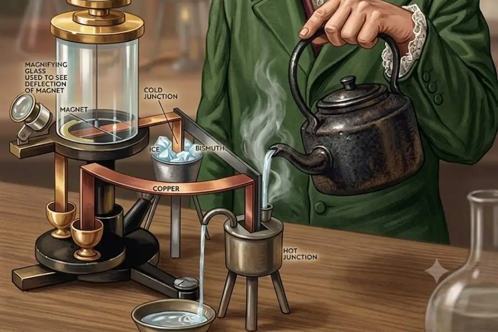
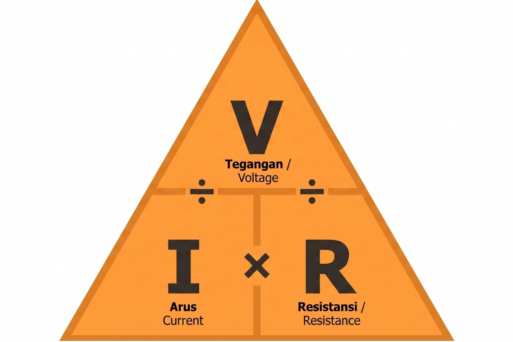
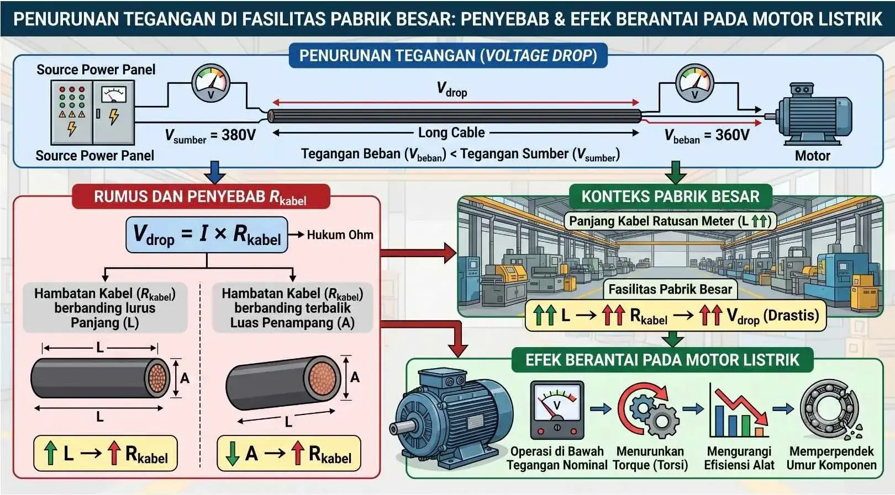

+++
title = "Rahasia Ohm's Law yang Wajib Dipahami Sebelum Menghitung Arus"
description = "Kuasai rahasia di balik Hukum Ohm, mulai dari konsep dasar fisika hingga panduan praktis penerapannya di dunia industri. Temukan cara akurat menghitung arus dan mencegah kegagalan sistem kelistrikan melalui artikel komprehensif ini."
date = 2025-02-01T21:37:16+07:00
draft = false
socialshare = true
image = "ohms-law.webp"
images = ["/posts/electrical-engineering/ohms-law/ohms-law.webp"]
concept = "Ohm's Law"
slug = "ohms-law"
categories = ["Electrical Engineering"]
tags = ["Electric Circuit Analysis", "Power System Protection"]
+++

Pada tahun 1827, fisikawan dan matematikawan Jerman, Georg Simon Ohm, menerbitkan karya berjudul _Die galvanische Kette, mathematisch bearbeitet_ (Rangkaian Galvani yang Dikaji secara Matematis). Lewat publikasi ini, Ohm memaparkan eksperimen tentang hubungan proporsional antara tegangan pada suatu konduktor (penghantar listrik) dan arus yang mengalir melaluinya.

Encyclopaedia Britannica mencatat bahwa komunitas ilmiah masa itu justru menolak temuan ini karena menilai pendekatannya terlalu matematis dan kurang aplikatif. Penolakan tersebut memaksa Ohm mundur dari jabatannya di Cologne dan menghadapi kesulitan finansial selama bertahun-tahun.

Pengakuan baru datang pada tahun 1841 ketika Royal Society of London menganugerahkan Medali Copley atas jasa Ohm dalam ilmu fisika. Setahun setelahnya, lembaga yang sama mengangkat Ohm sebagai anggota asing, sebuah kehormatan yang menegaskan pengakuan internasional atas kontribusinya bagi dunia sains.

Dunia sains kemudian menetapkan namanya sebagai satuan hambatan listrik, yaitu ohm (satuan ukuran resistansi listrik yang disimbolkan dengan Ω). Kini, prinsip yang sempat terabaikan itu menopang seluruh infrastruktur kelistrikan, mulai dari jaringan distribusi PLN hingga sirkuit mikro (rangkaian elektronik berskala sangat kecil) pada perangkat digital Anda.

Dalam penerapannya di sektor industri saat ini, teknisi dan insinyur mengandalkan Hukum Ohm untuk menjalankan empat fungsi teknis utama di lapangan:

- **Spesifikasi komponen proteksi:**  
  Perhitungan arus dan tegangan menjadi dasar pemilihan pengaman sistem distribusi listrik, seperti _Miniature Circuit Breaker_ (MCB, yaitu alat pemutus arus listrik otomatis saat terjadi beban berlebih) serta sekering agar tepat sesuai kapasitas beban.
- **Pelaksanaan _troubleshooting_ (pencarian dan penyelesaian sumber gangguan)**  
  Teknisi menggunakan rumus ini untuk melacak lokasi anomali tegangan maupun arus saat sistem kelistrikan pabrik mengalami gangguan atau penurunan performa.
- **Program _predictive maintenance_ (pemeliharaan berbasis analisis kondisi peralatan)**  
  Pemantauan perubahan nilai hambatan listrik membantu teknisi mendeteksi potensi kerusakan isolasi atau keausan mesin lebih awal sebelum terjadi kegagalan fatal.
- **Optimasi efisiensi energi**  
  Perhitungan Hukum Ohm berperan penting dalam mengevaluasi dan menekan _power losses_ (energi listrik yang terbuang dan berubah menjadi panas) pada instalasi jaringan konduktor di fasilitas industri.

## Apa Itu Hukum Ohm?

Hukum Ohm adalah prinsip dasar dalam fisika dan teknik kelistrikan yang mendefinisikan hubungan proporsional linier antara tiga besaran utama, yaitu _voltage_ (tegangan), _current_ (arus listrik), dan _resistance_ (hambatan listrik). Secara sederhana, hukum ini menyatakan bahwa arus listrik yang mengalir lewat suatu penghantar pada suhu konstan berbanding lurus dengan tegangan dan berbanding terbalik dengan hambatannya.

Georg Simon Ohm merumuskan prinsip ini lewat serangkaian percobaan cermat pada tahun 1825 dan 1826. Ia menggunakan jarum kompas yang ditempatkan di dekat kawat sebagai alat ukur arus listrik, karena amperemeter (alat pengukur arus listrik) belum ditemukan pada masa itu.

Lembaga sejarah teknologi ETHW mencatat bahwa pada tahun 1825, Ohm menerbitkan makalah pertamanya yang mengkaji penurunan gaya elektromagnetik pada kawat seiring bertambahnya panjang. Karyanya berlanjut lewat dua makalah pada tahun 1826 dan buku terkenalnya pada tahun 1827 yang memuat Hukum Ohm secara lengkap.

Dengan peralatan rancangan sendiri serta bantuan ayahnya yang seorang mekanik, Ohm bereksperimen menggunakan konduktor (penghantar listrik) dengan berbagai ketebalan dan panjang.

Dari pengujian tersebut, ia membuktikan bahwa arus listrik mengalir lebih kuat pada konduktor yang berpenampang lebih tebal. Sebaliknya, aliran arus akan melemah jika melewati kawat yang semakin panjang.

Karakteristik penting dari Hukum Ohm adalah sifat linearitasnya. Artinya, grafik hubungan antara tegangan dan arus akan membentuk garis lurus selama resistansi bernilai konstan. Namun, perlu dipahami bahwa tidak semua komponen listrik bersifat _ohmic_ (mematuhi Hukum Ohm).

Beberapa perangkat elektronik modern justru bersifat _non-ohmic_ karena resistansinya berubah secara dinamis terhadap tegangan atau arus yang masuk. Contoh komponen tersebut mencakup:

- **Dioda:** Komponen semikonduktor yang berfungsi melewatkan arus listrik ke satu arah saja.
- **Transistor:** Komponen yang bertugas mengatur sinyal dan arus listrik di dalam rangkaian.
- **_Variable Frequency Drive_ (VFD):** Perangkat pengatur kecepatan pada motor listrik.

Meskipun ada pengecualian tersebut, sebutan "hukum" tetap dipakai secara universal karena nilai sejarah dan aplikasinya yang sangat luas.

Berbagai standar keselamatan internasional, seperti IEC 60364 (standar global untuk instalasi listrik bangunan), dibangun di atas fondasi Hukum Ohm guna menghitung arus beban serta merancang proteksi terhadap _overcurrent_ (arus berlebih yang melebihi kapasitas normal).

## Bunyi Hukum Ohm dan Batasan Suhu Konstan

Pernyataan resmi Hukum Ohm yang dirumuskan oleh Georg Simon Ohm adalah sebagai berikut:

> "Besar arus listrik yang mengalir melalui suatu penghantar berbanding lurus dengan beda potensial (tegangan) yang diterapkan pada ujung-ujung penghantar tersebut, dan berbanding terbalik dengan hambatan penghantar, dengan syarat suhu penghantar dijaga konstan."

Ketentuan "suhu konstan" dalam pernyataan di atas bukan sekadar formalitas bahasa. Resistansi suatu konduktor logam secara alami sangat bergantung pada temperatur akibat mekanisme _electron-phonon scattering_ (hamburan antara elektron dan getaran atom).

Ketika suhu meningkat, getaran kisi kristal logam di dalam kabel menjadi semakin intensif. Kondisi ini menyebabkan elektron konduksi (elektron bebas yang membawa arus listrik) lebih sering bertumbukan, sehingga nilai hambatan listrik pun ikut melonjak.

Fenomena perubahan resistansi tersebut dikenal sebagai _thermal drift_ (penyimpangan nilai akibat suhu). Efek ini adalah penyebab utama perbedaan antara hasil perhitungan teoritis di atas kertas dengan pengukuran aktual di lapangan.

Oleh karena itu, praktisi industri yang menangani sistem berarus tinggi wajib memperhitungkan efek _Joule heating_ (panas yang dihasilkan oleh aliran arus listrik). Langkah antisipasi ini sangat penting untuk mencegah kerugian energi dan memanajemen risiko kerusakan peralatan operasional.

## Variabel Inti: Tegangan (V), Arus (I), dan Hambatan Listrik (R)

Ketiga variabel dalam Hukum Ohm memiliki definisi, simbol, dan satuan standar internasional yang saling berhubungan erat. Pemahaman yang tepat mengenai setiap elemen ini menjadi dasar penting untuk menganalisis maupun merancang instalasi kelistrikan di lapangan.

Berikut adalah ringkasan definisi serta fungsi dari ketiga variabel inti tersebut dalam aplikasi industri:

| Variabel | Simbol | Satuan (SI) | Analogi dan Fungsi di Industri |
| --- | --- | --- | --- |
| **_Voltage_ (Tegangan)** | V | Volt (V) | Tekanan listrik pendorong arus yang menentukan kelas isolasi peralatan serta jarak aman antar konduktor. |
| **_Current_ (Arus Listrik)** | I | Ampere (A) | Aliran muatan listrik yang menjadi acuan spesifikasi kapasitas kabel serta perangkat proteksi seperti _overload relay_ (relai pengaman beban berlebih). |
| **_Resistance_ (Hambatan Listrik)** | R | Ohm (Ω) | Penghambat aliran arus yang menentukan besarnya _voltage drop_ (penurunan tegangan) dan tingkat efisiensi energi pada sistem. |

## Rumus Hukum Ohm dan Cara Menggunakannya

Hubungan matematis antara _voltage_ (tegangan), _current_ (arus), dan _resistance_ (hambatan) dirumuskan melalui sebuah persamaan dasar:

$$V = I \times R$$

Keterangan variabel pada rumus tersebut adalah sebagai berikut:
- $V$ = _Voltage_ atau tegangan (Volt)
- $I$ = _Current_ atau arus listrik (Ampere)
- $R$ = _Resistance_ atau hambatan listrik (Ohm)

Melalui perhitungan aljabar sederhana, rumus dasar tersebut menghasilkan dua persamaan turunan yang sama pentingnya. Persamaan pertama adalah $I = \frac{V}{R}$ untuk mencari nilai arus, sedangkan persamaan kedua adalah $R = \frac{V}{I}$ untuk menghitung nilai hambatan.

### Segitiga Hukum Ohm (Ohm's Law Triangle)

_Ohm's Law Triangle_ (Segitiga Hukum Ohm) adalah alat bantu visual yang praktis untuk mengingat dan menerapkan ketiga rumus di atas secara cepat saat bekerja di lapangan.

Segitiga ini menempatkan variabel $V$ pada sudut atas, sedangkan variabel $I$ dan $R$ berada di sudut bawah secara berdampingan. Cara kerjanya sangat mudah: Anda hanya perlu menutup simbol variabel yang ingin dicari, lalu variabel yang tersisa akan menunjukkan rumus hitungannya.

Sebagai contoh, apabila Anda menutup huruf $V$ di bagian atas, maka tersisa huruf $I$ dan $R$ di bawah yang letaknya sejajar. Kondisi ini menunjukkan bahwa kedua variabel tersebut dikalikan, sehingga rumusnya menjadi $V = I \times R$.

Sebaliknya, jika Anda menutup huruf $I$, maka tersisa posisi $V$ di atas dan $R$ di bawah yang menunjukkan operasi pembagian, sehingga rumusnya menjadi $I = \frac{V}{R}$.

Metode visual ini sangat membantu teknisi saat melakukan verifikasi cepat pada panel distribusi atau saat menjalankan proses _troubleshooting_. Teknik ini memungkinkan perhitungan instan tanpa perlu menghafal rumus aljabar secara rumit.

## Integrasi Hukum Ohm dengan Rumus Daya Listrik (Joule's Law)

Hukum Ohm berkaitan erat dengan _Joule's Law_ (prinsip fisika tentang pengubahan energi listrik menjadi panas). Hukum ini mendefinisikan _power_ (daya listrik) sebagai laju konversi energi di dalam suatu rangkaian.

Hubungan dasar antara daya, tegangan, dan arus dirumuskan melalui persamaan berikut:

$$P = V \times I$$

Pada rumus tersebut, variabel P mewakili daya listrik dengan satuan Watt (W). Penggabungan persamaan Hukum Ohm ke dalam rumus daya dasar ini akan menghasilkan dua formula turunan fungsional:

- **Rumus berdasarkan arus dan hambatan ($P = I^2 \times R$)**  
  Persamaan ini didapat dengan mengganti variabel V menjadi $I \times R$. Rumus ini berfungsi menghitung _copper loss_ (kehilangan energi listrik dalam bentuk panas pada kawat tembaga) akibat resistansi internal kabel. Dalam distribusi daya jarak jauh, perhitungan ini menjadi parameter utama untuk menilai efisiensi jaringan.
- **Rumus berdasarkan tegangan dan hambatan ($P = \frac{V^2}{R}$)**  
  Persamaan ini diperoleh dengan mengganti variabel $I$ menjadi $\frac{V}{R}$. Bentuk turunan ini sering terpakai saat menganalisis kinerja perangkat dengan beban resistif murni, seperti _heater_ (elemen pemanas industri) dan lampu pijar.

Integrasi kedua prinsip ini mempermudah proses penentuan _power rating_ (batas kapasitas daya aman) pada setiap komponen instalasi.

Selain itu, perhitungan tersebut menjadi acuan untuk mengevaluasi konsumsi energi serta merancang jalur distribusi dengan _power losses_ yang minimal.

Rumus ini juga menjadi dasar pemilihan kapasitas generator atau _Uninterruptible Power Supply_ (UPS, perangkat penyedia daya listrik cadangan otomatis) agar tepat sesuai total beban terpasang.

## Rangkaian Hukum Ohm: Konfigurasi Seri, Paralel, dan Kombinasi

Dalam instalasi kelistrikan, komponen jarang beroperasi secara tunggal. Hukum Ohm menjadi metode analisis utama untuk menghitung parameter listrik pada setiap jenis susunan jaringan.

Penerapan prinsip ini akan menghasilkan perhitungan distribusi tegangan dan arus yang berbeda antara satu konfigurasi dengan konfigurasi lainnya.

Berikut adalah perbandingan karakteristik operasional antara susunan jaringan seri dan paralel:

| Parameter | Rangkaian Seri | Rangkaian Paralel |
| :--- | :--- | :--- |
| **Arus (I)** | Mengalir sama besar pada setiap komponen ($I_{total} = I_1 = I_2 = ...$) | Terbagi ke setiap cabang jaringan ($I_{total} = I_1 + I_2 + ...$) |
| **Tegangan (V)** | Terbagi ke setiap komponen beban ($V_{total} = V_1 + V_2 + ...$) | Bernilai sama pada setiap cabang beban ($V_{total} = V_1 = V_2 = ...$) |
| **Resistansi Total ($R_{total}$)** | $R_{total} = R_1 + R_2 + ...$ | $\frac{1}{R_{total}} = \frac{1}{R_1} + \frac{1}{R_2} + ...$ |
| **Risiko Kegagalan** | Satu komponen putus mengakibatkan seluruh aliran terhenti atau mengalami _single point of failure_ (titik kegagalan tunggal). | Satu komponen putus tidak memengaruhi operasi normal pada cabang lainnya. |

Dalam konteks panel distribusi gedung dan industri, rangkaian paralel adalah konfigurasi yang paling umum digunakan karena setiap beban menerima tegangan yang sama dan dapat dioperasikan secara independen. Rangkaian seri tetap penting dalam aplikasi spesifik seperti sensor suhu atau pembagi tegangan (_voltage divider_).

## Perbedaan Hukum Ohm pada Sistem DC dan AC (Konsep Impedansi)

Hukum Ohm pada sistem _Direct Current_ (DC, arus searah) hanya memakai nilai resistansi murni ($R$). Namun, sistem _Alternating Current_ (AC, arus bolak-balik) memiliki medan magnet dan listrik yang selalu berubah seiring waktu.

Perubahan tersebut memunculkan dua bentuk hambatan tambahan pada jaringan. Kedua hambatan ini adalah _inductive reactance_ (reaktansi induktif atau hambatan dari kumparan, disimbolkan dengan $X_L$) dan _capacitive reactance_ (reaktansi kapasitif atau hambatan dari kapasitor, disimbolkan dengan $X_C$).

Ketiga komponen hambatan tersebut bergabung membentuk _impedance_ (impedansi, yaitu total penahan arus pada rangkaian AC yang disimbolkan dengan $Z$). Besaran ini diukur dalam satuan Ohm (Ω) dengan rumus perhitungan sebagai berikut:

$$Z = \sqrt{R^2 + (X_L - X_C)^2}$$

Kehadiran komponen impedansi mengubah bentuk persamaan dasar Hukum Ohm untuk penerapan pada jaringan arus bolak-balik. Bentuk persamaannya beradaptasi menjadi:

$$V = I \times Z$$

Pada rumus adaptasi tersebut, variabel V dan I mewakili nilai _Root Mean Square_ (RMS, yaitu besaran efektif dari tegangan maupun arus AC).

Karakteristik khusus dari instalasi AC adalah pergerakan tegangan dan arus yang tidak selalu sefase (berjalan serentak). Beban hambatan tambahan akan memengaruhi aliran arus dengan dua kemungkinan:

- **Komponen induktif:** Menyebabkan arus mengalami _lagging_ (tertinggal di belakang tegangan).
- **Komponen kapasitif:** Memicu kondisi _leading_ (pergerakan arus mendahului tegangan).

Fenomena pergeseran aliran ini akan memengaruhi nilai _power factor_ (faktor daya, yaitu rasio efektivitas pemakaian daya listrik). Angka ini secara langsung menentukan tingkat efisiensi konsumsi energi pada seluruh sistem kelistrikan.

## Tantangan Implementasi Hukum Ohm di Lapangan Industri

Hukum Ohm memberikan kerangka perhitungan teori yang akurat. Namun, penerapan prinsip ini di fasilitas industri sering kali menghadapi hambatan operasional yang memicu perbedaan antara kalkulasi di atas kertas dan angka pembacaan pada alat ukur.

Berikut adalah tiga kendala teknis utama yang sering muncul di lapangan beserta cara penanganannya:

### 1. Efek Kenaikan Suhu (Thermal Drift) & Joule Heating

Aliran arus listrik pada konduktor secara alami menghasilkan panas akibat fenomena _Joule heating_ (pengubahan energi listrik menjadi panas). Panas ini memicu _thermal drift_ (penyimpangan nilai akibat suhu) yang membuat _resistance_ (hambatan) material meningkat.

Sebagai contoh, kabel berbahan tembaga _annealed_ (tembaga yang dipanaskan lalu didinginkan agar lebih ulet) memiliki koefisien suhu [0,00393](https://kalkulator.now/kalkulator-resistansi-jejak-pcb/) per derajat Celcius. Artinya, setiap kenaikan suhu 10 derajat Celcius akan mendongkrak nilai resistansi sekitar 3,93 persen.

Pada instalasi berarus tinggi seperti _busbar_ (batang tembaga tebal penghantar listrik) di panel distribusi utama atau _feeder_ (kabel penyalur daya utama) menuju motor penggerak, suhu tinggi dapat menurunkan efisiensi distribusi daya dan mempercepat kerusakan isolasi kabel.

Standar IEEE 3001.8-2013 menyarankan penerapan _instrumentation and metering_ (sistem pengukuran dan instrumentasi) yang akurat untuk memantau perubahan suhu ini secara berkala.

### 2. Penurunan Tegangan (Voltage Drop) pada Kabel Panjang

_Voltage drop_ (penurunan tegangan) adalah kondisi ketika nilai tegangan pada ujung beban lebih rendah daripada tegangan sumber akibat adanya hambatan dari kabel penghubung. Berdasarkan Hukum Ohm, fenomena ini dihitung dengan rumus $V_{drop} = I \times R_{kabel}$.

Nilai hambatan kabel ($R_{kabel}$) berbanding lurus dengan panjang lintasan dan berbanding terbalik dengan luas penampangnya. Artinya, semakin panjang rentangan sebuah kabel, semakin besar hambatan listrik yang menahan arus. Sebaliknya, kabel dengan penampang tebal akan mempermudah aliran listrik karena nilai hambatannya lebih kecil.

Di fasilitas pabrik berskala besar, bentangan kabel bisa mencapai ratusan meter sehingga memicu penurunan tegangan yang drastis. Kondisi ini membuat motor listrik terpaksa beroperasi di bawah tegangan nominalnya.

Efek berantainya akan menurunkan _torque_ (gaya putar penggerak), mengurangi efisiensi alat, dan memperpendek umur komponen.

Standar kelistrikan internasional seperti NEC (NFPA 70), IEC 60364, dan BS 7671 merekomendasikan batas maksimal _voltage drop_ sebesar 3 persen untuk sirkuit cabang dan 5 persen untuk instalasi gabungan guna menjaga efisiensi operasional peralatan.

### 3. Distorsi Harmonika dari Beban Non-Linier

Fasilitas modern saat ini sangat bergantung pada perangkat elektronik seperti lampu LED, catu daya komputer (_switch-mode power supply_), dan pengatur kecepatan mesin (_Variable Frequency Drive_). Perangkat-perangkat tersebut tergolong sebagai beban non-linier karena cara kerjanya yang tidak menyedot listrik secara mulus. 

Alih-alih mengalir sebanding dengan tegangan, alat-alat ini menarik arus listrik secara terputus-putus dalam bentuk pulsa berfrekuensi tinggi. Tarikan arus yang menghentak ini pada akhirnya menghasilkan harmonika, yaitu gelombang-gelombang gangguan yang merusak bentuk asli gelombang arus dan tegangan listrik utama menjadi cacat atau terdistorsi.

Kondisi gelombang listrik yang terdistorsi ini membawa dampak buruk bagi operasional sebuah fasilitas. Beberapa masalah serius yang kerap muncul akibat harmonika antara lain memicu panas tambahan (_overheating_) pada transformator dan kabel netral, menurunkan kualitas serta efisiensi kelistrikan, hingga memperpendek umur pakai peralatan pabrik lainnya.

Meskipun penggabungan gelombang-gelombang gangguan tersebut membuat keseluruhan arus dan tegangan tidak lagi linier, kaidah fisika dasar sejatinya tetap berlaku pada setiap frekuensi gangguan.

Hukum Ohm untuk kondisi ini dapat dihitung menggunakan persamaan $V_h = I_h \times Z_h$.
- **$V_h$ (_Harmonic Voltage_):** Tegangan listrik pada frekuensi harmonika tertentu (diukur dalam Volt).
- **$I_h$ (_Harmonic Current_):** Arus listrik yang mengalir pada frekuensi tersebut (diukur dalam Ampere).
- **$Z_h$ (_Harmonic Impedance_):** Total hambatan yang spesifik menahan aliran pada frekuensi harmonika terkait (diukur dalam Ohm).

Namun, penggabungan berbagai gelombang ini membuat hubungan total antara arus dan tegangan menjadi tidak linier.

Fenomena _harmonics_ memicu panas tambahan pada transformator dan kabel netral, menurunkan faktor daya, serta menyebabkan _overheating_ (pemanasan berlebih) pada peralatan pabrik.

Oleh karena itu, untuk mengatasi jaringan kelistrikan yang sudah dipenuhi oleh beban non-linier, teknisi wajib menggunakan pendekatan Analisis Fourier. Teknik matematika ini sangat penting karena mampu mengurai gelombang kelistrikan yang kompleks kembali ke dalam domain frekuensinya. 

Melalui analisis ini, teknisi dapat menentukan dan merancang filter yang tepat agar distorsi listrik bisa diredam, sehingga instalasi kelistrikan dipastikan tetap aman dan beroperasi sesuai dengan standar internasional IEEE 519.

## Aplikasi Hukum Ohm dalam Troubleshooting dan Maintenance

Hukum Ohm berfungsi sebagai alat diagnostik utama untuk menjaga keandalan operasional sistem kelistrikan. Di lapangan, penerapan prinsip matematis ini umumnya terbagi ke dalam tiga metode evaluasi dan pemeliharaan:

- **Diagnosis Sirkuit Terbuka (Open Circuit) dan Hubung Singkat (Short Circuit)**  
  Dengan menggunakan multimeter (alat pengukur kelistrikan multifungsi), teknisi mengukur nilai resistansi untuk melacak titik kerusakan kabel. Jika alat menunjukkan resistansi tak terhingga, berarti terjadi _open circuit_ (jalur terputus) yang biasanya disebabkan oleh sambungan yang longgar. 
  Sebaliknya, jika resistansi menunjukkan angka mendekati nol, berarti terjadi _short circuit_ (hubung singkat) yang umumnya terjadi akibat terkelupasnya pelindung kabel.
- **Penentuan Ukuran (_Sizing_) Komponen Proteksi**  
  Hukum Ohm digunakan untuk menghitung arus beban maksimal, yang menjadi acuan wajib dalam menentukan spesifikasi komponen pengaman (seperti _breaker_ atau sekering). Perhitungan yang akurat sangat penting untuk mencegah _nuisance tripping_, yaitu kondisi di mana sakelar otomatis anjlok padahal tidak ada masalah karena batas proteksinya terlalu kecil. 
  Di sisi lain, perhitungan ini juga mencegah bahaya kebakaran akibat pemasangan pengaman yang terlalu besar, sehingga sistem gagal memutus aliran saat terjadi arus berlebih.
- **Pengujian Resistansi Isolasi (_Megger Test_)**  
  Prosedur ini bertujuan mengevaluasi seberapa baik kualitas material pembungkus (isolator) pada jaringan kabel, transformator, maupun motor listrik. Pengujian dilakukan dengan cara mengalirkan tegangan tinggi arus searah (DC) ke dalam sistem, kemudian alat akan mengukur _leakage current_ (arus bocor berskala kecil) yang muncul.

Dari hasil pengujian tersebut, nilai tahanan atau resistansi isolasi dihitung menggunakan persamaan aljabar berikut:

$$R = \frac{V_{uji}}{I_{bocor}}$$

Jika angka resistansi (R) ini terlihat semakin menurun dari waktu ke waktu, hal tersebut menjadi indikator awal bahwa lapisan isolasi mulai aus, baik akibat paparan kelembapan, tumpukan kotoran, maupun usia pakai peralatan. 

Deteksi dini melalui pemantauan nilai resistansi ini memungkinkan teknisi melakukan tindakan pemeliharaan pencegahan (_preventive maintenance_) lebih awal, sebelum sistem mengalami kegagalan operasional secara total.

## Kegagalan Kabel Transatlantik (1858): Ketika Tegangan Tinggi Menghancurkan Investasi

Pada tahun 1858, [Atlantic Telegraph Company](https://spectrum.ieee.org/the-first-transatlantic-telegraph-cable-was-a-bold-beautiful-failure) mencetak sejarah besar dengan berhasil membentangkan kabel telegraf bawah laut sepanjang lebih dari 3.200 kilometer untuk menghubungkan daratan Eropa dan Amerika. Pencapaian ini diresmikan secara gemilang pada 16 Agustus 1858 melalui pertukaran pesan antara Ratu Victoria dan Presiden Amerika Serikat, James Buchanan. 

Keberhasilan ini dirayakan dengan sangat meriah, bahkan perusahaan perhiasan Tiffany & Co. turut menjual potongan kabel tersebut sebagai suvenir berharga. Sayangnya, euforia ini berumur sangat pendek. Dalam waktu kurang dari tiga minggu dan setelah hanya mengirimkan 750 pesan, sistem telegraf tersebut mati dan rusak total.

Penyelidikan awal atas kegagalan ini mengarah pada satu nama, yaitu Edward Orange Wildman Whitehouse. Sang Kepala Teknisi Kelistrikan (_Chief Electrician_) yang ironisnya berlatar belakang sebagai dokter bedah ini mengambil keputusan fatal saat sinyal telegraf mulai melemah. Alih-alih memperbaiki penerimaan sinyal, ia justru menaikkan tegangan pengiriman pesan secara drastis. 

Whitehouse menggunakan kumparan induksi (_induction coils_) untuk menyuntikkan tegangan hingga 2.000 Volt. Angka tersebut merupakan sebuah beban yang terlalu masif untuk teknologi masa itu. Hantaman tegangan tinggi ini seketika menghancurkan _gutta percha_ (getah karet pelapis kabel) dan memicu hubung singkat yang melumpuhkan operasi secara permanen.

Sebenarnya, bencana ini sudah diprediksi. Penasihat ilmiah proyek, William Thomson (dengan gelar Lord Kelvin), telah memperingatkan bahwa pendekatan paksa Whitehouse tersebut sangat keliru. 

Thomson menyarankan agar sistem tetap beroperasi dengan arus yang lemah serta alat penerimanya diubah menggunakan _mirror galvanometer_ (instrumen penerima sinyal berbasis pantulan cermin) yang jauh lebih sensitif. Pemikiran Thomson ini terbukti jitu ketika proyek kabel generasi berikutnya pada tahun 1866 berhasil beroperasi dengan sangat stabil berkat metode yang ia sarankan.

Menariknya, penelitian forensik modern memberikan pandangan yang lebih obyektif dan membebaskan Whitehouse dari tuduhan sebagai satu-satunya penyebab kegagalan. Analisis pada sisa potongan kabel mengungkap adanya cacat produksi pabrik yang sangat parah sejak awal. 

Inti tembaga kabel ternyata tidak berada persis di tengah dan posisinya terlalu dekat dengan pelindung logam luar. Selain itu, kualitas lapisan _gutta percha_ rupanya sudah memburuk akibat metode penyimpanan yang salah selama musim dingin ekstrem tahun 1857 hingga 1858. Sejarawan dan insinyur Donard de Cogan menyimpulkan bahwa dengan kondisi cacat bawaan seperti itu, kabel tersebut pada akhirnya akan tetap mati terlepas dari keteledoran Whitehouse.

Dari insiden kabel transatlantik pertama ini, dunia teknik memetik dua pelajaran berharga:
- Perancangan sebuah sistem kelistrikan tidak boleh sekalipun mengabaikan batas fisik material pelindungnya, khususnya terkait _dielectric strength_ (batas maksimal kekuatan bahan isolator dalam menahan tegangan listrik).
- Bencana teknis jarang sekali disebabkan oleh satu faktor tunggal karena kombinasi mematikan antara cacat produksi, kondisi lingkungan yang buruk, dan keputusan operasional yang keliru akan selalu bekerja sama dalam menghancurkan sebuah sistem.

Whitehouse memang menjadi sosok yang paling mudah disalahkan oleh publik. Namun, dengan kualitas kabel yang sudah buruk sejak awal, proyek ambisius tersebut pada dasarnya hanyalah bom waktu yang menunggu saatnya meledak.

## Kesimpulan

Sejak dirumuskan pada tahun 1827, Hukum Ohm tetap menjadi dasar penentu dalam merancang, mengoperasikan, dan memelihara instalasi kelistrikan. Prinsip ini mempercepat proses _troubleshooting_ (pencarian sumber gangguan) dan perhitungan efisiensi energi saat digabungkan dengan _Joule's Law_ ($P = I^2 \times R$).

Penerapannya di lapangan menuntut antisipasi terhadap berbagai penyimpangan nilai ukur. Faktor pengganggu ini mencakup efek kenaikan suhu konduktor, _voltage drop_ (penurunan tegangan), dan distorsi _harmonics_ (gelombang gangguan akibat perangkat non-linier).

Pemasukan formula $V = I \times R$ ke dalam Standar Operasional Prosedur (SOP) memastikan pemilihan komponen proteksi berjalan tepat sasaran. Pada akhirnya, penguasaan teori kelistrikan ini terbukti efektif mencegah kegagalan peralatan sekaligus menjamin keselamatan operasional berbagai fasilitas modern.
