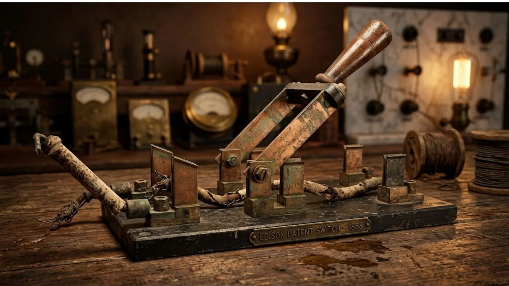
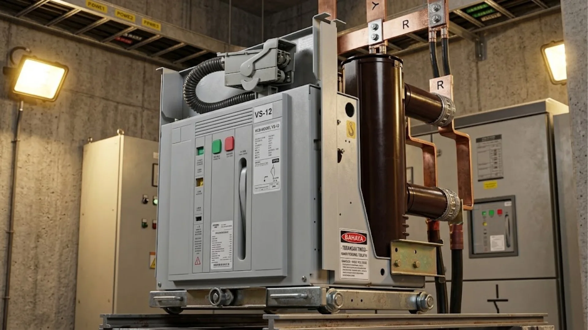

+++
title = "Kesalahan Switchgear Bisa Picu Ledakan dan Blackout Total!"
date = 2026-08-15T12:12:49+07:00
draft = false
description = "Jangan biarkan kegagalan switchgear melumpuhkan industri Anda! Pahami definisi, komponen, klasifikasi, dan sistem proteksi krusialnya sekarang."
image = "switchgear.webp"
images = ["/posts/electrical-engineering/switchgear/switchgear.webp"]
categories = ["Electrical Engineering"]
tags = ["Power Distribution Architecture", "Power System Protection"]
socialshare = true
concept = "Switchgear"
slug = "switchgear"
+++

Listrik yang kita gunakan di rumah, kantor, atau pabrik tidak mengalir langsung dari pembangkit. Sebelum sampai ke pengguna, listrik melewati jaringan distribusi dan gardu listrik. Pada instalasi dengan kapasitas besar, aliran listrik perlu dikendalikan sekaligus dilindungi dari gangguan seperti korsleting dan arus berlebih. 

Untuk kebutuhan inilah digunakan **switchgear**, yaitu perangkat untuk menghubungkan, memutus, mengendalikan, dan mengamankan aliran listrik. Peralatan ini umumnya digunakan di gardu listrik, gedung bertingkat, kawasan industri, dan pabrik besar.

## Apa itu Switchgear?

Switchgear adalah kumpulan peralatan listrik yang digunakan untuk menyalurkan, mengendalikan, dan melindungi aliran listrik, terutama pada sistem tenaga listrik berkapasitas besar. Peralatan ini umum digunakan pada gardu listrik, gedung bertingkat, kawasan industri, dan fasilitas pembangkit. Pada instalasi rumah tangga, fungsi serupa umumnya ditangani oleh panel listrik dan perangkat proteksi seperti MCB.

Di dalam switchgear terdapat komponen seperti pemutus daya (_circuit breaker_), relai proteksi, dan penghantar rel (_busbar_). Saat terjadi gangguan seperti korsleting atau arus berlebih, relai proteksi mendeteksi kondisi tersebut dan memerintahkan _circuit breaker_ untuk memutus bagian yang terganggu. Dengan demikian, bagian yang mengalami gangguan dapat diisolasi tanpa harus memadamkan seluruh sistem. Penerapannya mengacu pada standar teknis, antara lain IEC dan IEEE.

## Memahami Bahaya Busur Api dan Fisika Plasma pada Kelistrikan

Saat switchgear memutus aliran listrik karena gangguan, arus tidak selalu langsung berhenti. Ketika kontak mulai terbuka, busur listrik (_arc_) dapat terbentuk di antara kedua kontak akibat ionisasi udara. Busur ini berupa plasma bersuhu sangat tinggi yang pada kondisi tertentu dapat mencapai sekitar 19.700 °C, sehingga berpotensi merusak komponen dan memicu kebakaran.

Pada jenis switchgear yang menggunakan _magnetic blowout_, medan magnet berinteraksi dengan arus pada busur dan menghasilkan gaya Lorentz yang mendorong busur menjauh dari kontak menuju _arc chute_. Di dalamnya, busur diregangkan, dibagi oleh pelat-pelat pemisah, dan didinginkan hingga kemampuan konduksinya menurun dan busur akhirnya padam. Proses pemadaman berlangsung sangat cepat, tetapi durasinya bergantung pada karakteristik pemutus dan kondisi gangguan.

## Evolusi Teknologi Pemadaman Busur Api pada Sistem Kelistrikan

Teknologi pemadaman busur api (*arc*) di dalam sistem kelistrikan tidak muncul secara instan. Pada akhir abad ke-19, stasiun pembangkit listrik Pearl Street milik Thomas Edison masih memiliki risiko keselamatan yang tinggi. Saat itu, teknisi harus menarik tuas logam raksasa bernama sakelar pisau (*knife switch*) secara manual di ruang terbuka untuk memutus arus listrik.

Setiap kali teknisi menarik tuas tersebut, percikan api besar sering meledak dan membahayakan wajah mereka. Ruangan juga langsung penuh dengan bau ozon yang tajam serta material tembaga yang menguap. Kondisi ini membuat kecelakaan fatal sering terjadi pada masa tersebut.

Tidak jarang percikan api ini gagal padam lalu melompat ke peralatan listrik lainnya. Insiden semacam ini bisa membakar seluruh gardu induk hingga menelan korban jiwa. Oleh karena itu, para ahli terus mencari cara agar proses pemutusan arus menjadi lebih aman.

Para ilmuwan kelistrikan kemudian mulai mencari media yang tepat untuk memadamkan busur api secara efektif. Mereka awalnya mencoba merendam komponen logam ke dalam tangki berisi minyak bumi. Sistem yang bernama pemutus daya minyak (*oil circuit breaker*) ini memanfaatkan sifat minyak untuk meredam panas.

Namun, metode perendaman ini memiliki risiko besar karena minyak bisa mendidih, menghasilkan gas hidrogen, lalu meledak. Para insinyur selanjutnya mengembangkan teknologi embusan udara (*air blast*) bertekanan tinggi. Teknologi ini berfungsi untuk meniup dan mendinginkan aliran plasma secara cepat.

Saat ini, industri kelistrikan telah menggunakan material rekayasa yang jauh lebih canggih. Banyak sistem kini memanfaatkan **gas sulfur heksafluorida (SF6)** untuk meredam tegangan ekstrem. Molekul gas ini bekerja dengan cara menyerap elektron bebas sehingga mampu memadamkan api dengan cepat.

Selain gas SF6, inovasi paling tangguh di industri kelistrikan saat ini adalah teknologi **pemutus daya vakum (*vacuum circuit breaker*)**. Pada sistem ini, peralatan akan memisahkan kontak logam di dalam sebuah tabung kedap udara mutlak. Inovasi ini menawarkan tingkat keamanan yang jauh lebih terjamin.

Prinsip kerjanya sangat logis untuk menaklukkan sifat dasar kelistrikan. Plasma selalu membutuhkan materi seperti atom udara agar bisa merambat bebas ke area sekitar. Karena beroperasi di ruang hampa, percikan api ini kehilangan media molekulernya sehingga otomatis padam seketika.

## Mengenal Anatomi Komponen dan Susunan Ruang pada Perangkat Hubung Bagi

Perangkat hubung bagi (_switchgear_) tersusun dari berbagai komponen yang bekerja bersama untuk menyalurkan, mengendalikan, dan melindungi sistem tenaga listrik. Komponen utamanya meliputi:

| Komponen                                                                                                       | Fungsi                                                                                               |
| -------------------------------------------------------------------------------------------------------------- | ---------------------------------------------------------------------------------------------------- |
| Pemutus Daya (_[Circuit Breaker](https://pepuru.com/posts/electrical-engineering/miniature-circuit-breaker/)_) | Memutus aliran listrik secara otomatis saat terjadi gangguan atau melalui perintah manual.           |
| Sakelar Pemisah (_Disconnect Switch_)                                                                          | Memisahkan bagian rangkaian dari sumber tegangan untuk memastikan keamanan saat pemeliharaan.        |
| Sekering (_Fuse_)                                                                                              | Memutus rangkaian ketika arus melebihi batas yang ditentukan dengan melelehkan elemen penghantarnya. |
| Relai Proteksi ([_Protective Relay_](https://pepuru.com/posts/electrical-engineering/protective-relay/))       | Mendeteksi kondisi gangguan dan mengirimkan perintah _trip_ ke _circuit breaker_.                    |
| Transformator Arus & Tegangan                                                                                  | Menurunkan besaran arus dan tegangan ke tingkat yang sesuai untuk pengukuran dan sistem proteksi.    |
| Rel Penghantar (_Busbar_)                                                                                      | Menyalurkan dan membagi daya listrik ke berbagai rangkaian.                                          |
| Panel Kontrol                                                                                                  | Menyediakan antarmuka, tombol operasi, dan indikator untuk pemantauan serta pengoperasian sistem.    |

Komponen-komponen tersebut ditempatkan dalam beberapa kompartemen untuk memisahkan bagian yang bertegangan dan membatasi dampak gangguan.

- **Kompartemen pemutus** berisi _circuit breaker_ dan mekanisme interlock untuk mencegah kesalahan operasi.
- **Kompartemen busbar** berisi rel penghantar utama yang dipisahkan dari komponen lain untuk meningkatkan keselamatan dan membatasi penyebaran gangguan.
- **Kompartemen kabel** menjadi tempat terminasi dan penyambungan kabel daya dari jaringan luar.
- Pada konstruksi **metal-clad**, komponen utama dipisahkan oleh sekat logam yang ditanahkan. Tingkat pemisahan dan konstruksinya mengikuti klasifikasi serta persyaratan standar yang berlaku, seperti IEC.

## Klasifikasi Switchgear Berdasarkan Tegangan dan Media Isolasi

Switchgear dapat dibedakan berdasarkan **level tegangan** dan **media isolasi** yang digunakan. Klasifikasi ini membantu menjelaskan karakteristik peralatan serta penerapannya dalam sistem tenaga listrik.

### Klasifikasi Berdasarkan Tegangan

|Kategori|Rentang Tegangan|Aplikasi & Contoh|
|---|---|---|
|**Low Voltage (LV)**|Hingga 1 kV AC|Gedung, pabrik, dan distribusi tegangan rendah; ACB, MCCB|
|**Medium Voltage (MV)**|Di atas 1 kV hingga puluhan kV|Gardu distribusi dan industri; VCB, GIS|
|**High Voltage (HV)**|Di atas rentang tegangan menengah|Transmisi dan gardu induk; circuit breaker HV, GIS|

Pada praktiknya, nilai tegangan nominal dan klasifikasi peralatan mengikuti standar serta sistem yang digunakan. IEC 60038 menetapkan nilai tegangan standar untuk sistem tenaga, sedangkan seri IEC 62271 mengatur berbagai persyaratan untuk switchgear dan controlgear tegangan menengah hingga tinggi.

### Klasifikasi Berdasarkan Media Isolasi

Selain tegangan, switchgear juga dibedakan berdasarkan media yang digunakan untuk mengisolasi bagian bertegangan dan membantu proses pemutusan arus.

| Jenis                              | Media Isolasi  | Keunggulan & Keterbatasan                                                              |
| ---------------------------------- | -------------- | -------------------------------------------------------------------------------------- |
| **Air Insulated Switchgear (AIS)** | Udara          | Konstruksi sederhana dan relatif ekonomis, tetapi membutuhkan ruang lebih luas         |
| **Gas Insulated Switchgear (GIS)** | Gas isolasi    | Kompak dan cocok untuk lahan terbatas, tetapi lebih mahal dan kompleks                 |
| **Oil Insulated Switchgear (OIS)** | Minyak isolasi | Memiliki kemampuan isolasi dan pendinginan yang baik, tetapi memiliki risiko kebakaran |
| **Vacuum Switchgear**              | Vakum          | Perawatan rendah dan keandalan tinggi, terutama pada aplikasi tegangan menengah        |

Pada GIS konvensional, **SF₆** banyak digunakan sebagai media isolasi karena memiliki kemampuan isolasi listrik yang baik. Namun, karena SF₆ merupakan gas rumah kaca dengan dampak pemanasan global yang sangat tinggi, teknologi switchgear dengan media isolasi alternatif juga semakin dikembangkan.

### Perbedaan Switchgear dan Switchboard

Istilah _switchgear_ dan _switchboard_ sering digunakan secara bergantian, padahal keduanya memiliki karakteristik dan lingkup penggunaan yang berbeda. Secara umum, switchgear dirancang untuk sistem tenaga yang membutuhkan kemampuan switching dan proteksi lebih tinggi, sedangkan switchboard lebih banyak digunakan untuk distribusi tegangan rendah.

|Parameter|Switchgear|Switchboard|
|---|---|---|
|**Standar umum**|IEC 62271, IEEE C37|IEC 61439, UL 891|
|**Aplikasi**|Gardu, industri, sistem tenaga, dan fasilitas kritis|Gedung dan fasilitas komersial|
|**Konstruksi**|Lebih terkompartemen dan dapat menggunakan unit _withdrawable_|Umumnya lebih sederhana dan menggunakan perangkat _fixed_|
|**Proteksi**|Circuit breaker dan sistem proteksi untuk menangani gangguan sistem tenaga|Breaker atau fuse sesuai kebutuhan distribusi|

Perbedaan tersebut tidak berarti setiap switchgear harus menggunakan _circuit breaker_ tipe _withdrawable_ atau setiap switchboard harus menggunakan perangkat _fixed_. Konfigurasi sebenarnya bergantung pada desain, level tegangan, kapasitas, serta persyaratan instalasinya.

### Mekanisme Operasi Switchgear

Pada kondisi normal, switchgear menyalurkan listrik dari sumber menuju beban melalui busbar dan peralatan switching. Ketika terjadi gangguan, sistem proteksi bekerja untuk memisahkan bagian yang bermasalah dari jaringan.

1. **Kondisi normal**  
   Arus mengalir dari sumber menuju beban melalui rangkaian switchgear.
2. **Deteksi gangguan**  
   Relai proteksi mendeteksi kondisi abnormal, seperti arus lebih atau hubung singkat.
3. **Perintah trip**  
   Relai mengirimkan sinyal kepada _circuit breaker_ untuk membuka kontak.
4. **Pemutusan dan isolasi**  
   _Circuit breaker_ memutus arus dan memadamkan busur api sehingga bagian yang terganggu terisolasi.
5. **Pemulihan**  
   Setelah gangguan diperiksa dan diperbaiki, rangkaian dapat dioperasikan kembali sesuai prosedur keselamatan.

Dengan mekanisme tersebut, switchgear tidak hanya berfungsi sebagai penghubung atau pemutus listrik, tetapi juga menjadi bagian penting dari sistem proteksi yang membatasi dampak gangguan terhadap keseluruhan jaringan.

### Penerapan pada Pusat Data

Pada pusat data berkapasitas besar, switchgear digunakan untuk menjaga kontinuitas dan keandalan pasokan listrik. Sistem dapat menggunakan konfigurasi seperti _main-tie-main_, _vacuum circuit breaker_ tipe _withdrawable_, serta sistem pemantauan dan proteksi terintegrasi.

Konfigurasi tersebut memungkinkan bagian tertentu diisolasi untuk pemeliharaan atau ketika terjadi gangguan, sementara bagian jaringan lainnya tetap beroperasi. Tingkat kontinuitas yang dapat dicapai tetap bergantung pada desain redundansi dan arsitektur kelistrikan pusat data.

## Peran Perangkat Hubung Bagi dalam Rekayasa Kelistrikan dan Industri

Bagi teknisi, switchgear merupakan bagian penting dari sistem distribusi listrik bangunan. Peralatan ini memungkinkan aliran daya dikendalikan, gangguan diisolasi, dan bagian sistem yang mengalami masalah tidak selalu menyebabkan seluruh instalasi padam.

### Menghadapi Arus Awal Motor Pendingin

Motor chiller dan peralatan HVAC berkapasitas besar dapat menarik arus awal yang jauh lebih tinggi daripada arus operasinya. Sistem proteksi harus membedakan kondisi start normal dari gangguan seperti hubung singkat atau arus lebih. Pengaturan proteksi yang tepat mencegah pemutusan yang tidak perlu sekaligus tetap memberikan perlindungan ketika terjadi gangguan.

### Menjaga Kontinuitas Daya pada Pusat Data

Pusat data membutuhkan sistem kelistrikan yang memiliki tingkat keandalan tinggi. Ketika sumber utama mengalami gangguan, switchgear dapat bekerja bersama **automatic transfer switch (ATS)**, [UPS](https://pepuru.com/posts/electrical-engineering/uninterruptible-power-supply/), dan generator untuk mengalihkan atau mempertahankan pasokan ke beban kritis. Skema ini dirancang agar gangguan pada satu sumber tidak langsung menyebabkan hilangnya daya pada seluruh fasilitas.

### Melokalisasi Gangguan pada Jaringan Bangunan

Ketika terjadi hubung singkat pada salah satu bagian instalasi, sistem proteksi dirancang agar perangkat yang paling dekat dengan titik gangguan bekerja terlebih dahulu. Prinsip ini disebut **selektivitas proteksi** (_protective selectivity_).

Sebagai contoh, jika terjadi gangguan pada panel di lantai tertentu, circuit breaker pada panel tersebut diharapkan memutus lebih dahulu sebelum breaker pada panel utama. Dengan koordinasi proteksi yang tepat, hanya bagian yang mengalami gangguan yang terputus sementara bagian lain tetap beroperasi.

## Penerapan Strategis di Berbagai Sektor Industri

Switchgear digunakan di berbagai sektor yang membutuhkan distribusi dan pengendalian tenaga listrik secara andal. Penerapannya antara lain:

- **Perusahaan listrik (_utility_)**  
  Digunakan pada pembangkit, gardu transmisi, dan jaringan distribusi untuk menghubungkan, memutus, serta mengisolasi bagian jaringan ketika terjadi gangguan.
- **Pusat data**  
  Mendukung kontinuitas pasokan listrik dengan sistem switching dan proteksi yang terintegrasi dengan UPS, generator, dan sistem distribusi lainnya.
- **Industri manufaktur**  
  Melindungi dan mengendalikan distribusi listrik untuk motor, mesin produksi, dan peralatan berkapasitas besar dari gangguan seperti hubung singkat dan arus lebih.
- **Energi terbarukan**  
  Digunakan pada PLTS dan PLTB untuk menghubungkan sumber pembangkit ke jaringan, melakukan isolasi saat gangguan, serta mendukung pengamanan titik interkoneksi dengan jaringan listrik.
- **Gedung komersial dan fasilitas kesehatan**  
  Digunakan untuk mendistribusikan daya ke beban penting seperti sistem HVAC, lift, peralatan medis, dan penerangan. Penerapannya mengikuti standar dan peraturan kelistrikan yang berlaku, seperti IEC atau NEC, sesuai wilayah dan jenis instalasinya.

## Fakta Ekstrem dan Bahaya Mematikan di Balik Switchgear

Di balik fungsi switchgear sebagai perangkat pengendali dan proteksi, terdapat fenomena fisik yang membuat peralatan ini harus dirancang dan dioperasikan dengan sangat hati-hati.

### Suhu Tinggi dan Bahaya Arc Flash

Ketika terjadi _arc flash_, energi listrik dapat menghasilkan plasma dengan temperatur yang sangat tinggi dalam waktu yang sangat singkat. Panas tersebut dapat menyebabkan logam meleleh atau menguap dan menghasilkan tekanan yang sangat besar.

Ekspansi material dan pemanasan udara di sekitar busur api dapat menghasilkan **arc blast**, yaitu gelombang tekanan yang mampu merusak peralatan dan membahayakan pekerja di sekitarnya. Karena itu, desain switchgear mempertimbangkan pembatasan energi gangguan, kompartemenisasi, sistem pelepasan tekanan, serta prosedur keselamatan untuk mengurangi risiko cedera.

### Mengapa Vacuum Circuit Breaker Dapat Memadamkan Busur Api?

Pada _vacuum circuit breaker_ (VCB), kontak pemutus berada dalam ruang dengan tekanan sangat rendah. Ketika kontak mulai terpisah, busur listrik masih dapat terbentuk akibat penguapan material kontak.

Namun, tidak seperti busur api di udara, plasma di dalam ruang vakum tidak memiliki pasokan gas yang cukup untuk mempertahankan pelepasan listrik. Setelah arus melewati titik nol (_current zero_), media penghantar di antara kontak cepat pulih sehingga busur dapat padam.

Prinsip inilah yang membuat teknologi vakum banyak digunakan pada switchgear tegangan menengah. Fenomena emisi elektron dan _quantum tunneling_ memang menjadi bagian dari fisika permukaan dan emisi elektron, tetapi bukan mekanisme utama yang perlu dipahami untuk menjelaskan proses pemadaman busur pada VCB.

### SF₆: Efektif untuk Isolasi, tetapi Berdampak pada Lingkungan

SF₆ telah lama digunakan pada sejumlah peralatan tegangan tinggi karena memiliki kemampuan isolasi listrik dan pemadaman busur yang sangat baik. Masalahnya, SF₆ merupakan gas rumah kaca dengan **global warming potential (GWP)** yang sangat tinggi dan memiliki umur atmosfer yang panjang.

Karena dampak tersebut, industri kelistrikan mulai mengembangkan dan menggunakan teknologi dengan media isolasi alternatif yang memiliki dampak lingkungan lebih rendah. Penggunaan SF₆ juga semakin mendapat perhatian melalui regulasi dan kebijakan pengurangan emisi di berbagai wilayah.

### Perlombaan Melawan Waktu Saat Gangguan

Ketika terjadi gangguan, sistem proteksi harus bekerja secepat mungkin untuk membatasi energi yang dilepaskan. Relai proteksi terlebih dahulu mendeteksi kondisi abnormal, kemudian mengirimkan perintah _trip_ kepada _circuit breaker_.

Kecepatan keseluruhan sistem tidak memiliki satu angka yang berlaku untuk semua switchgear. Waktu operasi bergantung pada jenis relai, circuit breaker, skema proteksi, dan karakteristik gangguan. Pada sistem tertentu, **arc-flash protection** bahkan dapat mendeteksi kondisi busur api dalam waktu yang sangat singkat dan mempercepat proses pemutusan.

Semakin cepat gangguan diidentifikasi dan diisolasi, semakin kecil energi yang dapat dilepaskan ke peralatan dan lingkungan di sekitarnya. Karena itu, koordinasi antara relai, circuit breaker, sensor, dan sistem proteksi menjadi bagian penting dalam keselamatan switchgear.

## FAQ

1. **Apa fungsi utama perangkat hubung bagi (*switchgear*) dalam sistem kelistrikan?**  
   Alat ini berfungsi untuk mengontrol, mengisolasi, dan melindungi peralatan kelistrikan secara otomatis. Sistem perlindungan ini langsung bekerja memutus aliran saat mendeteksi adanya korsleting atau hubung singkat (*short circuit*) dan kelebihan beban daya. 

2. **Apa perbedaan paling mencolok antara perangkat hubung bagi (*switchgear*) dan panel hubung bagi (*switchboard*)?**  
   Perangkat hubung bagi (*switchgear*) dirancang khusus untuk menangani tegangan tinggi dengan tingkat perlindungan ganda berlapis. Perangkat ini menggunakan pemutus daya (*circuit breaker*) tipe model sorong (*draw-out*) yang sangat praktis karena bisa ditarik keluar dengan mudah saat perbaikan. 

3. **Mengapa gas SF6 sering digunakan dalam perangkat hubung bagi (*switchgear*) tegangan tinggi?**  
   Gas SF6 memiliki kemampuan menyekat listrik (*dielektrik*) dan kemampuan memadamkan busur api (*arc*) yang jauh lebih tangguh daripada udara bebas. Kemampuan peredaman tingkat tinggi ini membuat ukuran fisik perangkat hubung bagi (*switchgear*) bisa dirancang jauh lebih kecil dan hemat tempat. 

4. **Kapan sebaiknya menggunakan perangkat berisolasi udara (*Air Insulated Switchgear* / AIS) dibandingkan berisolasi gas (*Gas Insulated Switchgear* / GIS)?** 
   Tipe perangkat berisolasi udara (*Air Insulated Switchgear* / AIS) sangat cocok dipilih jika Anda memiliki lahan pemasangan yang sangat luas dan anggaran biaya yang terbatas. Tipe ini juga ideal bagi fasilitas yang menginginkan metode perawatan alat yang mudah dan konvensional. 

5. **Apa yang dimaksud dengan ledakan busur api (*arc flash*) pada kelistrikan?**  
   Ledakan busur api (*arc flash*) adalah ledakan plasma berenergi panas sangat tinggi yang muncul akibat korsleting listrik di udara terbuka. Saat ini, para produsen sudah mendesain perangkat hubung bagi (*switchgear*) modern dengan material yang tahan ledakan busur api (*arc-resistant*) untuk menahan daya hancur dan panas tersebut. 
