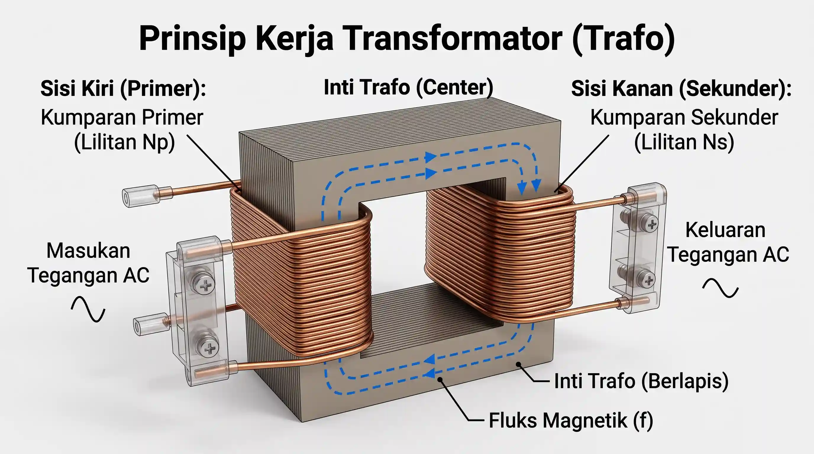

+++
title = "Transformer: Misteri Jantung Tak Terlihat di Balik Listrik Modern"
date = 2026-08-14T12:12:49+07:00
draft = false
description = "Bongkar rahasia transformer! Pelajari prinsip induksi Faraday, komponen inti, jenis, hingga cara kerja mesin ajaib ini mengalirkan listrik ke seluruh dunia."
image = "transformer.webp"
images = ["/posts/electrical-engineering/transformer/transformer.webp"]
categories = ["Electrical Engineering"]
tags = ["Power System Protection", "ElectromagneticInduction"]
socialshare = true
concept = "Transformer"
slug = "transformer"
+++

Pernahkah Anda melihat kotak baja di pinggir jalan atau mendengar bunyi dengung dari dalamnya? Kotak tersebut dapat berupa gardu distribusi tipe kotak (_box-type substation_). Sederhananya, gardu ini bertugas menurunkan tegangan listrik yang terlalu tinggi dari jaringan agar sesuai untuk digunakan di rumah dan bangunan.

Lalu, mengapa gardu tersebut mengeluarkan bunyi dengung? Salah satu penyebab utamanya adalah magnetostriksi (_magnetostriction_), yaitu perubahan bentuk yang sangat kecil pada inti transformator ketika terkena medan magnet yang berubah-ubah. Pada sistem listrik 60 Hz, getaran utamanya muncul sekitar $2 \times 60 = 120\text{ Hz}$, sedangkan pada sistem 50 Hz sekitar $2 \times 50 = 100\text{ Hz}$.

Secara garis besar, transformator (_transformer_) adalah perangkat listrik yang memindahkan energi dari satu rangkaian ke rangkaian lain melalui medan magnet. Alat ini tidak menghasilkan energi, tetapi mengubah tingkat tegangan dan arus agar sesuai dengan kebutuhan sistem listrik. Cara kerjanya dapat dibayangkan seperti mengatur tekanan air di dalam pipa. Listrik dari jaringan transmisi dapat memiliki tegangan sangat tinggi agar dapat dikirim dalam jarak jauh dengan arus yang lebih kecil sehingga kerugian pada kabel dapat ditekan. Sebelum listrik digunakan di rumah atau bangunan, transformator menurunkan tegangan tersebut ke tingkat yang sesuai.

## Bagaimana Hukum Induksi Faraday Membuat Transformator Bekerja?

Di dalam transformator terdapat dua kumparan yang disebut kumparan primer (_primary winding_) dan sekunder (_secondary winding_). Karena kedua kumparan tidak terhubung secara langsung, listrik dari jaringan tidak mengalir langsung ke jaringan rumah. Inilah yang memungkinkan energi listrik dipindahkan sekaligus menurunkan tegangannya.

Cara kerjanya didasarkan pada Hukum Induksi Faraday yang ditemukan pada 1831. Prinsip sederhananya adalah perubahan medan magnet dapat menghasilkan tegangan listrik pada kumparan. Pada transformator, arus bolak-balik mengalir melalui kumparan primer dan menghasilkan medan magnet yang terus berubah. Medan magnet ini dipandu oleh inti magnet (_magnetic core_) menuju kumparan sekunder. Perubahan medan tersebut kemudian menghasilkan tegangan listrik pada kumparan sekunder.

Hubungan ini dijelaskan oleh Hukum Faraday melalui persamaan $E=-N\frac{d\Phi_B}{dt}$.

|Simbol|Keterangan|Satuan|
|---|---|---|
|$E$|Gaya gerak listrik|V|
|$N$|Jumlah lilitan|-|
|$\Phi_B$|Fluks magnetik|Wb|

Bagian $\frac{d\Phi_B}{dt}$ menunjukkan seberapa cepat fluks magnetik berubah terhadap waktu. Semakin cepat perubahan fluks, semakin besar tegangan yang diinduksikan. Tanda minus menunjukkan Hukum Lenz, yaitu tegangan induksi memiliki arah yang menentang perubahan fluks yang menyebabkannya.

Jumlah lilitan pada kedua kumparan menentukan perubahan tegangan. Pada transformator ideal, hubungan tersebut dinyatakan dengan $\frac{V_s}{V_p}=\frac{N_s}{N_p}$. Jika jumlah lilitan sekunder lebih sedikit daripada primer, tegangan akan turun dan transformator disebut penurun tegangan (_step-down_). Sebaliknya, jika lilitan sekunder lebih banyak, tegangan akan naik. Dalam kondisi ideal, ketika tegangan dinaikkan, arus menjadi lebih kecil, dan sebaliknya, tanpa mengubah frekuensi listrik.

### Mengapa Transformator Tidak Dapat Menggunakan Arus Searah

Transformator konvensional dirancang untuk bekerja dengan arus bolak-balik (_alternating current_) karena arus ini menghasilkan fluks magnetik yang terus berubah. Jika arus searah (_direct current_) diberikan secara terus-menerus pada kumparan primer, setelah kondisi awal fluks menjadi relatif tetap sehingga tidak menghasilkan tegangan induksi kontinu pada kumparan sekunder.

Masalah lainnya adalah arus searah dapat membuat fluks magnetik memiliki bias tetap. Jika kondisi tersebut mendorong inti melewati batas kerjanya, inti dapat mengalami saturasi magnetik (_magnetic saturation_). Ketika inti jenuh, arus magnetisasi dapat meningkat tajam dan menyebabkan pemanasan berlebih. Karena itu, memberikan suplai arus searah secara langsung dapat menyebabkan pemanasan dan kerusakan.

## Mengenal Komponen Utama Transformator

Transformator daya terdiri dari beberapa komponen utama yang bekerja bersama untuk memindahkan energi listrik, mengubah tegangan, menjaga suhu, dan melindungi peralatan dari gangguan.

### Inti magnetik (_magnetic core_) dan kerugian histeresis (_hysteresis loss_)
Inti magnetik menjadi jalur bagi medan magnet yang menghubungkan kumparan transformator. Inti umumnya dibuat dari baja silikon dan disusun menggunakan lembaran tipis yang saling terisolasi. Struktur ini membantu mengurangi arus pusar (_eddy current_) yang dapat menyebabkan panas dan kehilangan energi.

Saat arus bolak-balik mengubah medan magnet, arah magnetisasi di dalam inti juga terus berubah. Proses berulang ini menyebabkan sebagian energi berubah menjadi panas yang disebut kerugian histeresis (_hysteresis loss_).

### Kumparan (_windings_) dan gaya elektrodinamik (_electrodynamic forces_)

Kumparan berfungsi mengalirkan arus listrik dan umumnya menggunakan konduktor tembaga atau aluminium. Ketika terjadi hubung singkat (_short circuit_), arus dapat meningkat sangat besar dan menghasilkan gaya elektromagnetik pada kumparan.

Gaya tersebut dapat meningkat sebanding dengan kuadrat arus. Jika terlalu besar, gaya ini dapat menggeser atau mengubah bentuk kumparan dan merusak sistem isolasinya. Karena itu, kumparan harus memiliki struktur mekanis yang kuat agar mampu menahan gaya selama gangguan.

### Sistem isolasi (_insulation system_)

Sistem isolasi berfungsi memisahkan bagian-bagian transformator yang memiliki perbedaan tegangan sekaligus mencegah hubungan listrik yang tidak diinginkan. Transformator berisi minyak secara tradisional menggunakan minyak mineral dan kertas selulosa sebagai bagian dari sistem isolasinya.

Selain minyak mineral, transformator modern juga dapat menggunakan cairan ester alami maupun sintetis. Cairan ester memiliki karakteristik keselamatan kebakaran dan lingkungan yang menguntungkan dibandingkan minyak mineral.

### Sistem pendingin (_cooling system_) dan perlindungan tekanan

Transformator menghasilkan panas selama beroperasi. Pada transformator berisi minyak, minyak berfungsi sebagai media isolasi sekaligus membawa panas dari bagian aktif menuju radiator atau perangkat pendingin lainnya.

Jika terjadi gangguan internal seperti busur listrik atau pemanasan berlebih, minyak dan material isolasi dapat terurai dan menghasilkan berbagai gas. Beberapa di antaranya adalah hidrogen dan asetilena. Jika gangguan menghasilkan gas dalam jumlah besar, tekanan di dalam tangki dapat meningkat dengan cepat.

Karena itu, transformator dilengkapi perangkat perlindungan seperti katup pelepas tekanan (_pressure relief device_) untuk membantu mengurangi risiko kerusakan akibat tekanan berlebih.

### Pengubah tap (_tap changer_)

Tegangan jaringan tidak selalu berada tepat pada nilai yang diinginkan. Pengubah tap (_tap changer_) mengatasi perubahan tersebut dengan memilih titik sambungan yang berbeda pada belitan transformator sehingga rasio transformasinya dapat disesuaikan.

Terdapat pengubah tap tanpa beban dan pengubah tap berbeban (_on-load tap changer_). Jenis _on-load tap changer_ dapat mengubah posisi tap ketika transformator tetap menyuplai beban. Dengan cara ini, tegangan keluaran dapat dijaga tetap berada pada rentang yang diinginkan meskipun kondisi jaringan berubah.

## Mengenal Kerugian Daya di Dalam Transformator

Transformator tidak dapat bekerja tanpa menghasilkan sedikit kerugian energi. Sebagian energi listrik berubah menjadi panas sehingga efisiensinya tidak pernah mencapai 100%.

*   **Rugi histeresis (_hysteresis loss_)**
    Perubahan medan magnet yang terus-menerus membuat material inti mengalami perubahan magnetisasi dan menghasilkan panas. Semakin tinggi frekuensi, semakin besar rugi histeresis pada kondisi yang sama.
*   **Rugi arus pusar (_eddy current loss_)**
    Perubahan medan magnet menghasilkan arus kecil yang berputar di dalam inti dan menghasilkan panas. Inti dibuat dari lembaran baja tipis yang saling terisolasi untuk [mengurangi kerugian](https://powerquality.blog/2023/11/28/transformer-losses-and-efficiency/) ini.
*   **Rugi inti (_core loss_)**
    Rugi inti merupakan gabungan utama dari rugi histeresis dan rugi arus pusar. Rugi ini tetap terjadi selama transformator diberi tegangan, bahkan ketika hampir tidak ada beban.
*   **Rugi tembaga (_copper loss_)**
    Arus yang mengalir melalui hambatan kumparan menghasilkan panas sesuai persamaan $P=I^2R$. Karena itu, semakin besar arus beban, semakin besar pula rugi tembaganya.
*   **Rugi fluks bocor (_stray loss_)**
    Sebagian fluks magnetik dapat keluar dari jalur utamanya dan menginduksi arus pada bagian logam transformator. Akibatnya, bagian tersebut dapat menjadi panas dan menambah kerugian berbeban.

Secara sederhana, **rugi inti berasal terutama dari histeresis dan arus pusar**, sedangkan **rugi berbeban terutama berasal dari rugi tembaga dan fluks bocor**. Rugi inti tetap ada selama transformator diberi tegangan, sedangkan rugi berbeban meningkat ketika arus yang disalurkan semakin besar.

## Bagaimana Kapasitas Transformator Diukur?

Pada instalasi listrik, kapasitas transformator umumnya dinyatakan dalam daya semu (_apparent power_) dengan satuan VA, kVA, atau MVA. Untuk sistem tiga fase, daya semu dapat dihitung menggunakan $S=\sqrt{3}\cdot V_L\cdot I_L$.

|Simbol|Keterangan|Satuan|
|---|---|---|
|$S$|Daya semu (_apparent power_)|VA|
|$V_L$|Tegangan saluran|V|
|$I_L$|Arus saluran|A|

Daya aktif (_active power_) menunjukkan bagian daya yang benar-benar digunakan oleh beban. Untuk sistem tiga fase, nilainya dapat dihitung dengan $P=\sqrt{3}\cdot V_L\cdot I_L\cdot\cos(\theta)$.

|Simbol|Keterangan|Satuan|
|---|---|---|
|$P$|Daya aktif (_active power_)|W|
|$\cos(\theta)$|Faktor daya (_power factor_)|-|

Tidak semua daya semu menjadi daya aktif. Sebagian berkaitan dengan daya reaktif (_reactive power_), yaitu daya yang secara berkala disimpan dan dikembalikan oleh medan listrik atau magnet. Hubungannya dapat dinyatakan sebagai $S^2=P^2+Q^2$.

Daya reaktif bukan berarti energi yang hilang. Kerugian energi pada transformator terutama berasal dari rugi-rugi pada kumparan dan inti transformator, sedangkan daya reaktif berkaitan dengan karakteristik induktif sistem dan memengaruhi arus yang harus disuplai.

## Mengapa Arus Bolak-Balik Memenangkan Perang Arus

Sejarah transmisi listrik jarak jauh bermula dari persaingan sengit pada akhir abad ke-19 yang dikenal sebagai [Perang Arus](https://www.energy.gov/articles/war-currents-ac-vs-dc-power). Thomas Edison mendukung sistem arus searah (_direct current_), sedangkan Nikola Tesla dan George Westinghouse mengembangkan sistem arus bolak-balik (_[alternating current](https://pepuru.com/posts/electrical-engineering/alternating-current/)_). Persaingan ini pada akhirnya ditentukan oleh satu masalah utama yaitu bagaimana mengirimkan listrik secara efisien dalam jarak jauh.

Pada sistem arus searah, listrik mengalir dalam satu arah dan pada masa itu tegangannya sulit dinaikkan atau diturunkan secara praktis. Ketika listrik dikirim dengan tegangan rendah, arus yang mengalir menjadi besar dan menghasilkan panas pada kabel. Besarnya kerugian tersebut mengikuti rumus $P_{\text{loss}}=I^2R$, sehingga transmisi jarak jauh menjadi tidak efisien.

Arus bolak-balik menawarkan solusi yang lebih praktis. Sistem ini memungkinkan penggunaan transformator (_transformer_) untuk menaikkan tegangan sebelum listrik dikirim melalui jaringan transmisi. Untuk daya yang sama, tegangan yang lebih tinggi berarti arus yang lebih kecil sehingga kerugian pada kabel dapat ditekan.

Teknologi transformator berkembang pesat pada tahun 1880-an. Károly Zipernowsky, Ottó Bláthy, dan Miksa Déri mengembangkan transformator berinti tertutup pada 1885, kemudian William Stanley mengembangkan desain transformator yang digunakan dalam sistem AC Westinghouse pada 1886. Teknologi inilah yang membuat listrik dapat dinaikkan tegangannya untuk transmisi jarak jauh dan kemudian diturunkan kembali untuk digunakan.

Keunggulan tersebut mulai terlihat jelas pada Pameran Dunia Kolumbia di Chicago pada 1893. Westinghouse memenangkan kontrak penerangan senilai $\$399.000$ dengan menggunakan sistem AC, mengalahkan tawaran General Electric yang menggunakan sistem DC. Pada tahun yang sama, Westinghouse juga mendapatkan kontrak untuk mengembangkan pembangkit listrik tenaga air di Niagara Falls.

Puncaknya terjadi pada November 1896 ketika listrik dari Niagara Falls berhasil [mencapai Buffalo](https://www.pbs.org/tesla/ll/ll_niagara.html#1). Daya dari pembangkit di Niagara dapat dikirim sejauh sekitar 26 mil atau 42 km untuk memasok Buffalo. Keberhasilan ini menjadi bukti penting bahwa listrik dapat dibangkitkan jauh dari kota, dinaikkan tegangannya untuk transmisi, lalu disalurkan kembali untuk digunakan.

Kemenangan AC bukan berarti arus searah tidak berguna. Teknologi modern seperti _high-voltage direct current_ (HVDC) kini memungkinkan arus searah digunakan kembali untuk transmisi jarak jauh dalam kondisi tertentu. Namun, pada era Perang Arus, kemampuan AC untuk bekerja dengan transformator memberikan keunggulan besar dalam membangun sistem transmisi listrik jarak jauh.

## Bagaimana Transformator Diuji Sebelum Digunakan

Sebelum digunakan, transformator menjalani berbagai pengujian untuk memastikan kinerja, isolasi, dan kemampuan menahan panasnya. Pengujian tersebut mengacu pada berbagai bagian seri standar IEC 60076. IEC 60076-1 menetapkan persyaratan umum, sedangkan pengujian suhu dan isolasi diatur lebih lanjut dalam IEC 60076-2 dan IEC 60076-3.

*   **Uji beban nol (_open-circuit test_)**
    Satu sisi transformator diberi tegangan sementara sisi lainnya tidak dibebani. Pengujian ini digunakan untuk mengetahui rugi tanpa beban (_no-load loss_) dan arus eksitasi transformator.
*   **Uji hubung singkat (_short-circuit test_)**
    Salah satu sisi transformator dihubung singkat, kemudian diberikan tegangan rendah hingga mencapai arus pengujian. Pengujian ini digunakan untuk menentukan rugi berbeban (_load loss_) dan [impedansi](https://pepuru.com/posts/electrical-engineering/impedance/) transformator.
*   **Uji ketahanan dielektrik (_dielectric withstand test_)**
    Transformator diberi tegangan uji tertentu untuk memastikan sistem isolasinya mampu menahan tekanan listrik tanpa mengalami kegagalan. Jenis pengujian dapat mencakup tegangan AC, tegangan induksi, dan impuls petir sesuai persyaratan yang berlaku.
*   **Uji kenaikan suhu (_temperature rise test_)**
    Transformator dioperasikan pada kondisi pengujian yang ditetapkan untuk mengukur kenaikan suhu pada minyak dan kumparan. Hasilnya dibandingkan dengan batas kenaikan suhu yang ditentukan standar untuk memastikan sistem pendingin dan isolasi dapat bekerja dengan aman.

Keempat pengujian tersebut membantu memastikan transformator mampu bekerja sesuai spesifikasi sebelum dipasang dalam sistem kelistrikan. Namun, IEC 60076 juga mencakup berbagai pengujian lain sesuai jenis dan kebutuhan transformator.

## Mengenal Bahaya Busur Api Listrik dan Strategi Pemeliharaan Pintar

Kegagalan struktur isolasi pada infrastruktur instalasi listrik sering kali berujung pada kerusakan parah. Salah satu bahaya paling mematikan bagi teknisi adalah busur api listrik (*arc flash*). Sebuah [sistem kelistrikan](https://www.littelfuse.com/design-center/training-and-education/arc-flash-knowledge-center?__hssc=248160920.1.1492060799793&__hstc=248160920.3e32681a0811b779887493e8b80e6be8.1491232857691.1491232857691.1492060799793.2&__hsfp=50826209&hsCtaTracking=0e5b9093-ffb7-495b-9d3e-7192ef3a6edb%7C1315df98-f781-4127-a967-834f271b4d03) mengalami busur api listrik ketika arus melompat melewati celah udara antar kabel akibat lapisan pelindungnya yang rusak.

Bayangkan jika udara di sekitar instalasi terkontaminasi atau ada alat kerja besi yang tidak sengaja terjatuh ke area aktif. Tegangan **20 kV** (standar tegangan menengah distribusi listrik di Indonesia) akan langsung mengubah udara menjadi gas panas penghantar listrik. Kondisi ini memicu ledakan yang memancarkan cahaya silau, gelombang kejut, serta panas [sangat ekstrem](https://www.instrumentation.co.za/49333n) hingga mencapai **19.000°C**.

Suhu sedemikian tinggi sama dengan tiga kali lipat panas permukaan matahari. Paparan panas tersebut sanggup [menguapkan logam](https://www.google.com/search?q=https://www.wireconsultants.com/how-arc-flash-studies-save-lives-on-indian-factory-floors/%23!) di sekitarnya hanya dalam hitungan milidetik. Oleh karena itu, para ahli selalu melakukan analisis bahaya ini dengan mengacu pada standar keamanan keamanan industri kelistrikan global.

Untuk mencegah kejadian ini, pihak industri mulai meninggalkan metode pemeriksaan penglihatan biasa. Para pengelola fasilitas kini beralih menggunakan [sistem pengawasan](https://ieeexplore.ieee.org/document/11315801#1) pintar bernama pemantauan berbasis kondisi (*condition-based monitoring*). Teknologi ini berfokus pada pengawasan melalui beberapa instrumen berikut:

*   **Analisis gas terlarut (*dissolved gas analysis*)**
    Teknisi mengambil [sampel minyak](https://www.megger.com/en-us/knowledge-hub/what-is-dissolved-gas-analysis-in-transformer-oil) pendingin alat untuk melacak sisa partikel gas sebagai langkah diagnosis kegagalan kelistrikan (*fault*). Penemuan jejak gas metana akibat panas bersuhu rendah dan karbon monoksida dari penguraian kertas pelindung adalah sinyal peringatan awal.
*   **Pengujian hambatan isolasi (*insulation resistance testing*)**
    Teknisi mengukur tingkat hambatan bahan pelindung secara berkala untuk mendeteksi potensi kebocoran arus listrik. Kebocoran ini berisiko mempercepat kerusakan fisik pada lapisan kertas pelindung kabel.
*   **Perlindungan relai Buchholz (*Buchholz relay protection*)**
    Instrumen pelindung ini berupa sakelar (*relay*) gas mekanis yang berada di antara tangki utama dan alat pendingin. Alat tersebut sangat peka dalam [mendeteksi gas](https://www.ceegenergy.com/en/what-is-the-function-of-the-buchholz-relay-in-a-transformer.html) hidrogen maupun asetilena yang muncul akibat kondisi tidak normal di dalam mesin, dan akan memutus arus secara otomatis jika gas menumpuk.
*   **Pemantauan berbasis kondisi (*condition-based monitoring*)**
    Pengelola gedung menempatkan sensor nirkabel untuk memantau suhu, gas terlarut, getaran, serta arus listrik. Data pemantauan teknologi pintar tersebut akan masuk ke server ruang kontrol secara langsung sebagai indikator awal kerusakan.

## Mengapa Burj Khalifa Membutuhkan Transformator di Banyak Lantai

Gedung Burj Khalifa memiliki ketinggian $828 \text{ m}$ sehingga distribusi listriknya tidak dapat dirancang seperti gedung biasa. Kebutuhan listriknya sangat besar, dengan beban puncak sekitar $50 \text{ MVA}$. Karena itu, sistem kelistrikannya dirancang agar daya tidak harus dikirim dari satu titik di bagian bawah menuju seluruh gedung.

Masalahnya, semakin panjang kabel yang membawa arus besar, semakin besar pula penurunan tegangan (*voltage drop*) dan rugi daya pada penghantar. Menempatkan seluruh transformator di bagian bawah juga akan membuat jaringan tegangan rendah harus menjangkau jarak yang sangat jauh.

Solusinya adalah membagi sistem distribusi secara vertikal. ABB merancang sistem dengan transformator yang ditempatkan di beberapa lantai sehingga tegangan dapat diturunkan lebih dekat dengan lokasi beban. ([sistem desentralisasi](https://library.e.abb.com/public/c441c1cb72354954be8b1c9327e2606b/World%20highest%20substation%20for%20the%20world%20tallest%20building.pdf?x-sign=Y7R3qQWcVb/5i87LmleCxQvEpxzHtwnOUlF+Ccaozvzg5zXN2qrqOV69kGung8Z6#1#1))

### Transformator Ditempatkan di Berbagai Ketinggian

Burj Khalifa menggunakan 72 unit transformator tipe kering resin cetak (*cast resin dry-type transformer*) yang ditempatkan di 71 stasiun listrik pada berbagai lantai. Transformator jenis ini tidak menggunakan minyak sebagai media isolasi sehingga lebih sesuai untuk dipasang di dalam bangunan.

Salah satu stasiun listrik berada di lantai 155 pada ketinggian sekitar $550 \text{ m}$ dan tercatat sebagai salah satu instalasi gardu tertinggi di dunia. ([gardu tertinggi](https://www.elektropraktiker.de/fachartikel/detail/elektroanlagen-im-hoechsten-gebaeude-der-welt?no_cache=1))

Transformator tersebut menurunkan tegangan distribusi $11 \text{ kV}$ menjadi tegangan yang sesuai untuk sistem kelistrikan gedung. Dengan menempatkan transformator lebih dekat dengan beban, panjang kabel tegangan rendah dapat dikurangi sehingga penurunan tegangan dan rugi daya pada kabel juga lebih mudah dikendalikan.

Arsitektur bertingkat ini juga membagi sistem kelistrikan menjadi beberapa bagian. Jika salah satu transformator mengalami gangguan, bagian gedung yang terdampak dapat dibatasi sehingga tidak seluruh sistem kehilangan pasokan. Sistem tersebut mendukung berbagai kebutuhan gedung, termasuk 57 elevator serta sistem pemanas, ventilasi, dan pendingin udara (*heating, ventilation, and air conditioning*) dengan kapasitas sekitar $24 \text{ MW}$. ([sistem Burj Khalifa](https://www.abb.com/global/en/company/stories/protecting-burj-khalifa))

## Transformator Benda Padat Membawa Kendali Listrik ke Tingkat Baru

Transformator benda padat (*solid-state transformer*) menggunakan elektronika daya untuk mengubah dan mengatur tegangan listrik secara lebih cepat dibandingkan transformator konvensional. Teknologi ini tetap menggunakan prinsip induksi elektromagnetik, tetapi prosesnya melibatkan transformator frekuensi menengah (*medium-frequency transformer*) dan sakelar elektronik.

Salah satu teknologi yang banyak digunakan dalam elektronika daya adalah karbida silikon (*silicon carbide*). Material ini mampu bekerja pada tegangan, suhu, dan frekuensi tinggi sehingga membantu membuat perangkat lebih cepat dan kompak.

Berikut beberapa keunggulan utamanya:

*   **Kendali tegangan lebih cepat**
    SST dapat mengatur tegangan dan arus secara elektronik dengan respons yang cepat. Perangkat ini juga dapat mengubah arus bolak-balik (*alternating current*) menjadi arus searah (*direct current*) atau sebaliknya sesuai kebutuhan sistem. ([respons cepat](http://eesc.sg/industry-dialogue-advanced-power-electronics-solid-state-transformers-sst/))
*   **Aliran daya dua arah**
    SST dapat mengatur perpindahan daya dari kedua arah. Kemampuan ini penting untuk sistem yang menggabungkan jaringan listrik, baterai, pembangkit surya, dan beban seperti kendaraan listrik. ([sistem kontrol](https://ieeexplore.ieee.org/document/11511246#1))
*   **Integrasi sumber energi terbarukan**
    Kemampuan mengatur tegangan dan mengubah jenis arus membuat SST berpotensi digunakan pada sistem panel surya, baterai, dan pengisian kendaraan listrik. Perangkat ini juga dapat menjadi penghubung antara jaringan arus bolak-balik dan perangkat yang menggunakan arus searah.

Teknologi ini menawarkan kendali yang lebih fleksibel dibandingkan transformator konvensional. Salah satu contoh pengembangan SST berbasis karbida silikon menunjukkan potensi pengurangan ukuran dan bobot yang sangat besar dibandingkan desain konvensional. ([contoh pengembangan](https://powerelectronicsmagazine.net/article/123849/Infineon_and_DG_Matrix_use_SiC_to_drive_SST_technology))

## FAQ

1. **Berapa lama rata-rata usia pakai sebuah transformator distribusi?**  
   Transformator distribusi umumnya dirancang untuk memiliki usia pakai antara 25 hingga 30 tahun, tergantung pada beban operasional dan kualitas perawatannya. Inspeksi rutin terhadap sistem isolasi dan pendingin sangat krusial untuk memperpanjang usia alat tersebut secara maksimal.

2. **Bagaimana pengaruh suhu lingkungan terhadap kinerja transformator?**  
   Suhu lingkungan yang terlalu panas dapat menurunkan efisiensi sistem pendingin, sehingga membatasi kapasitas beban maksimal yang dapat ditanggung transformator. Overheating akibat suhu tinggi juga berisiko mempercepat degradasi material isolasi di dalam tangki secara signifikan.

3. **Apa perbedaan utama antara transformator *step-up* dan *step-down* pada jaringan listrik negara?**  
   Transformator *step-up* digunakan di area pembangkit listrik untuk melipatgandakan tegangan agar transmisi jarak jauh menjadi jauh lebih efisien. Sebaliknya, transformator *step-down* digunakan di dekat area permukiman untuk menurunkan tegangan tinggi tersebut menjadi level yang aman bagi peralatan rumah tangga.

4. **Bisakah transformator 50 Hz digunakan secara langsung pada sistem kelistrikan 60 Hz?**  
   Secara umum, transformator 50 Hz masih aman digunakan pada sistem 60 Hz, meskipun efisiensi dan regulasi tegangannya mungkin akan sedikit terpengaruh. Namun, menggunakan transformator 60 Hz pada sistem 50 Hz sangat berbahaya karena dapat memicu saturasi inti magnetik dan panas berlebih.
