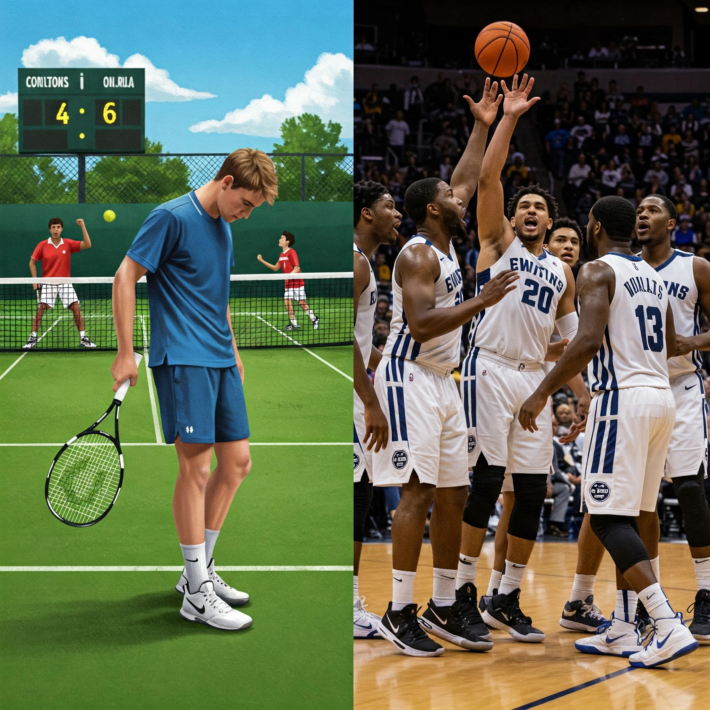

+++
title = 'Apa Gunanya Merasa Ketinggalan? Antara Motivasi dan Insecure, Bangkit atau Menyerah'
date = 2025-03-24
draft = false
description = "Pernahkah Anda merasa ketinggalan? Baik dari segi prestasi, materi bahkan dengan kemampuan yang Anda miliki? Apa yang Anda rasakan saat Anda berada di belakang orang tersebut? Kecewa, marah atau bahkan termotivasi? "
image = "1.webp"
imageBig= "1.webp"
categories= ["Insight Psychology"]
tags=["Heuristic Bias"]
authors= ["Daddy Ananta"]
avatar="/images/profil.jpeg"
+++

# <a href="https://id.wikipedia.org/wiki/Final_Liga_Champions_UEFA_2005" target="_blank">*The Miracle of Istanbul*</a>

Pada final Liga Champions 2005, Liverpool yang dipimpin Steven Gerrard menghadapi AC Milan yang megah. Babak pertama adalah mimpi buruk bagi Liverpool; mereka tertinggal telak 3-0.

    <iframe src="https://www.youtube.com/embed/3ojXHf293M8?si=ToZJn-2VWAJpgQiq" 
            title="YouTube video player" frameborder="0" allow="accelerometer; autoplay; clipboard-write; encrypted-media; gyroscope; picture-in-picture; web-share" allowfullscreen>
    </iframe>

ISTANBUL 05: Liverpool 3-3 Milan | HIGHLIGHTS OF THE GREATEST EVER FINAL from Liverpool FC

Jika Anda harus bertaruh saat itu, kecil kemungkinan Anda akan memilih Liverpool. Logikanya, tim yang tertinggal separah itu sudah habis.

Namun, alih-alih menyerah, Liverpool justru menunjukkan mental baja. Manajer Rafael Benítez dilaporkan tetap tenang di ruang ganti, mengubah taktik, dan membakar kembali semangat juang timnya (<a href="https://panditfootball.com/article/show/cerita/210102/PFB/170930/rafael-benitez-liverpool-dan-kisah-di-ruang-ganti-istanbul" target="_blank">selengkapnya</a>).

Hasilnya? Dalam enam menit babak kedua yang magis, mereka menyamakan kedudukan.
- **Menit 54**: Gol sundulan Steven Gerrard.
- **Menit 56**: Gol jarak jauh Vladimír Šmicer.
- **Menit 60**: Gol Xabi Alonso dari bola rebound penalti.

Momen ini membuktikan bahwa **semangat juang dan fokus yang tak tergoyahkan bisa membalikkan keadaan yang mustahil sekalipun.**

# <a href="https://en.wikipedia.org/wiki/Sugar_Ray_Leonard_vs._Roberto_Dur%C3%A1n_II" target="_blank">*"No Más" Fight* (1980)</a>

    <iframe src="https://www.youtube.com/embed/_CecvdA7b7c?si=773bTH7fBpBIOUCQ" 
            title="YouTube video player" frameborder="0" allow="accelerometer; autoplay; clipboard-write; encrypted-media; gyroscope; picture-in-picture; web-share" allowfullscreen>
    </iframe>

    "𝗡𝗢 𝗠𝗔𝗦" Roberto Durán vs. Sugar Ray Leonard II November 25, 1980 WELTERWEIGHT CHAMPIONSHIP BOUT By Boxing Scenes Classic Rounds from Youtube.com

Sekarang, mari kita lihat sisi sebaliknya. Legenda tinju **Roberto Durán** bertanding ulang melawan **Sugar Ray Leonard**. Di pertarungan ini, Leonard yang lebih lincah mendominasi dan bahkan beberapa kali mengejek Durán.

Kejutan besar terjadi di ronde ke-8. Tanpa diduga, Durán, seorang juara dunia yang dikenal buas, berbalik ke arah wasit dan berkata **"No más"**—bahasa Spanyol untuk **"Tidak lagi."** Ia menyerah begitu saja.

Tindakan Durán menjadi bukti nyata bahwa **tekanan mental dan frustrasi karena tertinggal dapat mengalahkan kemampuan fisik atlet terhebat sekalipun.**

## Bangkit atau Menyerah: Apa Bedanya?

Dua kisah ini menunjukkan dua sisi dari koin yang sama: perasaan tertinggal. Terkadang ia menjadi bahan bakar, di lain waktu ia menjadi racun yang melumpuhkan. Lantas, apa yang sebenarnya menentukan apakah kita akan bangkit seperti Liverpool atau menyerah seperti Durán? Jawabannya tidak hanya terletak pada semangat, tetapi pada bagaimana otak kita mengukur jarak menuju kemenangan.

## Dari Lapangan ke Laboratorium: Apa Kata Data?

Dalam bukunya <a href="https://jonahberger.com/books/invisible-influence/" target="_blank">*Invisible Influence*</a>, penulis **Jonah Berger** menganalisis ribuan pertandingan olahraga untuk menemukan jawabannya.

  
  
Tenis vs Basket: Dua Hasil yang Berbeda

1.  **Studi Tenis:** Berger menemukan bahwa pemain yang kalah di set pertama, **cenderung akan kalah lagi** di set berikutnya. Ketinggalan justru membuat performa mereka menurun.
2.  **Studi Basket NBA:** Hasilnya mengejutkan. Tim yang tertinggal **hanya dengan selisih satu poin** saat turun minum, justru punya kemungkinan menang **lebih besar** daripada tim yang unggul satu poin.

Ketinggalan sedikit ternyata bisa menjadi pemicu motivasi yang luar biasa.

  
"Tertinggal sedikit sering kali lebih memotivasi daripada tertinggal banyak karena orang lebih dekat untuk mencapai tujuan mereka untuk menang."

  
- Jonah Berger, Invisible Influence

### Lalu, Bagaimana dengan Liverpool?
Jika motivasi muncul saat tertinggal *sedikit*, kenapa Liverpool bisa bangkit dari ketertinggalan *jauh*? Ini adalah pengecualian yang menarik. Kuncinya mungkin ada pada psikologi **"nothing to lose" (tak ada lagi beban)**. Ketika sebuah tim sudah dianggap habis, tekanan ekspektasi pun hilang. Mereka bisa bermain lebih lepas, sementara tim lawan yang unggul telak justru mulai bermain terlalu hati-hati dan kehilangan momentum. Dalam kondisi ekstrem, aturan motivasi bisa berbalik arah.

## Kekuatan Psikologis di Balik "Hampir Sampai"

Fenomena ini juga kita temui dalam kehidupan sehari-hari, contohnya pada kartu loyalitas.

  
  
Semakin dekat dengan hadiah, semakin termotivasi.

Saat cap pertama, hadiah terasa jauh. Tapi saat cap ke-8 atau ke-9, motivasi kita meroket untuk segera mendapatkan cap terakhir. Ini disebut **Endowed Progress Effect**: motivasi meningkat drastis saat kita merasa sudah dekat dengan tujuan.

## Rekomendasi Individu

Jika Anda merasa tertinggal, **mungkin yang perlu diperbaiki adalah cara Anda memilih pesaing**. Membandingkan diri dengan seseorang yang levelnya jauh di atas bisa membuat *insecure* dan ingin menyerah. Sebaliknya, **jadikan pesaing Anda adalah seseorang yang hanya selangkah di depan**. Ini akan jauh lebih memotivasi untuk mengejar dan memperbaiki diri.

## Rekomendasi Bisnis

Dalam bisnis, manfaatkan efek "hampir sampai" ini melalui gamifikasi dan sistem tingkatan (*tier*).

  
  
Sistem Keanggotaan (Silver, Gold, Platinum)

Program seperti *Silver, Gold, Platinum* efektif karena mendorong pelanggan untuk terus bertransaksi agar bisa naik ke level berikutnya. Ketika pelanggan merasa "sedikit lagi jadi Gold," mereka lebih mungkin melakukan pembelian tambahan. Kuncinya adalah **menjaga agar jarak ke level berikutnya tidak terasa terlalu jauh**, agar motivasi mereka tidak padam.

## Referensi

Jonah Berger.(2014). Invisible Influence : The Hidden Forces That Shape Behavior. <a href="https://books.google.co.id/books?id=f90nDwAAQBAJ&printsec=frontcover&redir_esc=y#v=onepage&q&f=false" target="_blank">Google Books</a>
