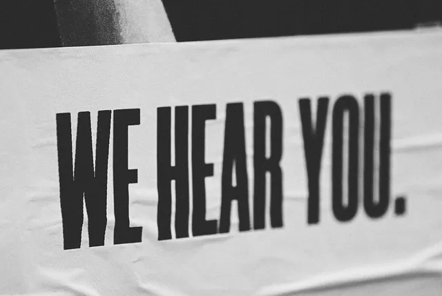
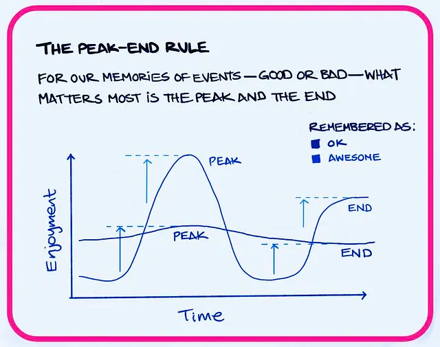
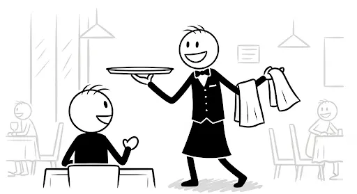
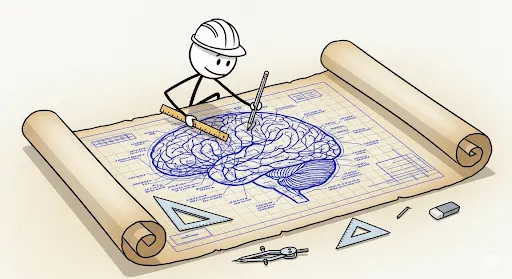

+++
title = "Arsitektur Memori Pelanggan: 3 Momen Kunci yang Menentukan Loyalitas"
date = 2025-08-20T13:45:42+07:00
draft = false
socialshare = true
description = "Pelajari cara kerja memori pelanggan. Panduan ini mengungkap 3 momen krusial—awal, puncak, akhir—untuk merancang pengalaman yang membangun loyalitas jangka panjang."
image = "1.webp"
imageBig= "1.webp"
categories= ["Insight Psychology"]
tags=["Behavioral Economics"]
authors= ["Daddy Ananta"]
avatar="/images/profil.jpeg"
+++

Anda baru saja menghabiskan 30 menit yang menyenangkan di sebuah toko, menemukan semua yang Anda cari dengan mudah.

Namun, saat tiba di kasir, Anda dihadapkan pada antrean panjang dan petugas yang tampak lelah. Tiga menit yang menjengkelkan itu terasa seperti merusak seluruh pengalaman positif sebelumnya. Mengapa? Jawabannya terletak pada sebuah kebenaran fundamental: otak kita bukanlah perekam video yang objektif, melainkan seorang *storyteller* yang efisien dan sangat bias. Ia tidak menyimpan seluruh pengalaman; ia memilih beberapa adegan kunci dan merangkainya menjadi sebuah cerita yang akan kita ingat. Loyalitas pelanggan tidak dibangun dari setiap detik pengalaman, melainkan dari *ingatan* akan pengalaman tersebut.

Photo by <a href="https://unsplash.com/@jontyson">Jon Tyson</a> on <a href="https://unsplash.com/">Unsplash</a>

Panduan ini akan membongkar sains di balik cara pelanggan mengingat (dan melupakan) Anda, memberikan sebuah kerangka kerja praktis untuk menjadi arsitek dari ingatan yang membangun loyalitas abadi.

## Membedah Aturan Lama: Dominasi Mutlak Peak-End Rule

Peak — End Rule from <a href="https://www.linkedin.com/posts/relationships-are-the-source-of-results_leadership-mentalhealth-relationshipsarethesourceofresults-activity-7161008123829239808-C9AH">Linkedin</a>

Selama puluhan tahun, pemahaman kita tentang memori pelanggan didominasi oleh sebuah konsep elegan dari psikolog pemenang Nobel, Daniel Kahneman, yang disebut **Aturan Puncak-Akhir (*Peak-End Rule*)**. Teorinya sederhana namun sangat kuat: ketika kita mengevaluasi sebuah pengalaman di masa lalu, kita tidak merata-ratakan setiap momen. Sebaliknya, ingatan kita hanya mengambil jalan pintas dengan mengingat dua hal: momen paling intens (puncak, baik positif maupun negatif) dan bagaimana pengalaman itu berakhir. Durasi keseluruhan? Sering kali kita abaikan begitu saja.

Sebuah meta-analisis komprehensif oleh [Alaybek, B., et al. (2022)](https://doi.org/10.1016/j.obhdp.2022.100424) mengonfirmasi bahwa efek ini "besar dan kokoh". Temuan ini berlaku di berbagai domain, mulai dari bagaimana turis mengevaluasi liburan mereka, seperti yang ditunjukkan dalam studi oleh [Huang, L., et al. (2025)](https://doi.org/10.1177/10963480251337338), hingga apa yang memotivasi seseorang untuk kembali berolahraga, menurut penelitian oleh [Bastos, T., et al. (2025)](https://doi.org/10.1016/j.psychsport.2025.102662). Implikasinya bagi bisnis terasa jelas: ciptakan satu momen "wow" yang tak terlupakan dan pastikan proses checkout atau perpisahan berjalan mulus. Selesai.

Namun, gambaran yang rapi ini ternyata tidak sepenuhnya lengkap. Data dari lapangan mulai menceritakan sebuah kisah yang lebih bernuansa, di mana babak pembuka terkadang lebih penting daripada babak penutup.

## Sebuah Plot Twist dari Data Lapangan

Image from Imagen 3

Seperti dalam setiap cerita yang bagus, sebuah plot twist muncul dari data baru. Sebuah studi lapangan berskala besar oleh [McCullough, H., et al. (2024)](https://doi.org/10.1016/j.jbusres.2024.114899) menganalisis lebih dari 5.000 pengalaman tamu hotel. Temuan mereka mengejutkan: berlawanan dengan *Peak-End Rule*, **kesan pertama** adalah kontributor paling penting untuk evaluasi dan kepuasan secara keseluruhan. Terlebih lagi, pengaruh kesan pertama ini justru semakin kuat seiring berjalannya waktu antara pengalaman dan saat evaluasi dilakukan.

Penelitian di laboratorium memperjelas dinamika ini. Saat pelanggan ditanya pendapatnya *segera* setelah berinteraksi, kesan pertama adalah rajanya. Namun, saat ditanya seminggu kemudian, otak mereka telah 'mengedit' cerita itu, lebih berfokus pada momen-momen terbaik dan bagaimana semuanya berakhir, seperti yang diungkapkan oleh studi [Sinclair, A. H., et al. (2024)](https://doi.org/10.1037/xge0001638).

Ini memaksa kita untuk bertanya: jadi, mana yang lebih penting? Awal atau akhir? Jawabannya, ternyata, adalah "Ya". Ini bukan pertarungan antara dua teori, melainkan pengungkapan sebuah model yang lebih lengkap. Alih-alih hanya berfokus pada satu momen, para perancang pengalaman yang paling cerdas kini berpikir dalam kerangka "Trio Arsitektur Memori".

## Playbook Sang Arsitek Memori

Image from Imagen 3

Ingatan bukanlah sebuah kebetulan; ia adalah hasil dari sebuah desain. Daripada menyerahkannya pada nasib, kita dapat secara etis membentuk ingatan pelanggan dengan berfokus pada tiga babak krusial dalam cerita mereka.

### 1. Merancang Powerful Start (Kesan Pertama yang Kuat)
Prinsip utamanya adalah *Priming*—menciptakan suasana hati yang positif sejak awal untuk 'mewarnai' sisa pengalaman—dan secara obsesif menghilangkan setiap hambatan kecil yang mungkin menimbulkan keraguan. Tujuannya adalah membuat interaksi pertama terasa begitu mudah dan menyenangkan sehingga pengguna secara tidak sadar berpikir, 'Ini akan menjadi pengalaman yang hebat.'

* **Taktik:** Contohnya, pikirkan proses *onboarding* aplikasi Notion. Ia tidak hanya menunjukkan antarmuka yang bersih, tetapi juga langsung memberikan template siap pakai, membuat pengguna merasa produktif dan cerdas dalam hitungan detik.

### 2. Merancang Defining Peak (Puncak yang Menentukan)
Ini adalah momen yang mengangkat pengalaman keluar dari rutinitas. Prinsipnya adalah Peninggian (*Elevation*) dan Kejutan (*Surprise*). Kita tidak perlu membuat setiap momen menjadi luar biasa, tetapi kita perlu menciptakan satu momen yang benar-benar berkesan. Sebuah puncak positif yang kuat dapat meningkatkan ingatan keseluruhan pengalaman hingga 20%.

* **Taktik:** "Pecahkan skrip" atau rutinitas yang biasa. Kisah "Popsicle Hotline" di Magic Castle Hotel adalah contoh legendaris bagaimana satu puncak yang menyenangkan dapat mendefinisikan seluruh ingatan tentang pengalaman menginap dan menutupi kekurangan-kekurangan kecil lainnya.

### 3. Merancang Flawless Finish (Akhir yang Sempurna)
Babak terakhir dari cerita memiliki bobot psikologis yang tidak proporsional. Prinsipnya adalah memanfaatkan *Recency Effect*, di mana hal-hal yang baru saja terjadi paling mudah diingat. Akhir yang positif tidak hanya meninggalkan kesan baik, tetapi juga membingkai seluruh pengalaman sebelumnya dalam cahaya yang lebih positif.

* **Taktik:** Kemudahan proses pengembalian barang di Amazon adalah masterclass dalam hal ini; pengalaman akhir yang begitu positif secara aktif mendorong pembelian di masa depan karena menghilangkan rasa takut akan penyesalan.

Sains tentang memori pelanggan memberikan kita sebuah kejelasan yang memberdayakan. Kita tidak bisa mengontrol setiap detik pengalaman pengguna, dan itu tidak masalah. Yang bisa kita kontrol adalah momen-momen yang paling penting. Dengan bertindak sebagai arsitek yang sengaja merancang awal yang mulus, puncak yang tak terlupakan, dan akhir yang memuaskan, kita tidak hanya menciptakan produk yang lebih baik—kita mengukir cerita positif yang akan diingat dan dibagikan oleh pelanggan kita.

<a href="https://daddyananta.github.io/categories/insight-psychology/">Baca artikel lain tentang Insight Psikologi</a>

## Referensi

Alaybek, B., et al. (2022). All’s well that ends (and peaks) well? A meta-analysis of the peak-end rule. <a href="https://doi.org/10.1016/j.obhdp.2022.100424">Organizational Behavior and Human Decision Processes</a>

Bastos, T., et al. (2025). The Peak and End Rule, Affect-Related Cognitions, Enjoyment, and Exercise Frequency: A Randomized Controlled Trial Ancillary Study. <a href="https://doi.org/10.1016/j.psychsport.2025.102662">Psychology of Sport and Exercise</a>

Huang, L., et al. (2025). Peak–End Rule? Tracing Tourists’ Experience and Exploring Their Perceptions and Behavioral Intentions. <a href="https://doi.org/10.1177/10963480251337338">Journal of Travel Research</a>

McCullough, H., et al. (2024). First impressions vs. The Peak-End Rule: Episodic evaluations in a service experience and the moderating effect of retrospective delay. <a href="https://doi.org/10.1016/j.jbusres.2024.114899">Journal of Business Research</a>

Sinclair, A. H., et al. (2024). First Impressions or Good Endings? Preferences Depend on When You Ask. <a href="https://doi.org/10.1037/xge0001638">Journal of Experimental Psychology: General</a>

Kahneman, D. (2011). <i>Thinking, Fast and Slow</i>. Farrar, Straus and Giroux.

Walter, A. (2011). <i>Designing for Emotion</i>. A Book Apart.

Heath, C., & Heath, D. (2017). <i>The Power of Moments: Why Certain Experiences Have Extraordinary Impact</i>. Simon & Schuster.

Thaler, R. H., & Sunstein, C. R. (2008). <i>Nudge: Improving Decisions About Health, Wealth, and Happiness</i>. Yale University Press.

## Penelusuran Terkait
<ul>
    <li><a href="https://www.valantic.com/en/blog/customer-experience-peak-end-rule/">The Peak-End rule of Customer Experience - valantic</a></li>
    <li><a href="https://en.wikipedia.org/wiki/Peak%E2%80%93end_rule">Peak–end rule - Wikipedia</a></li>
    <li><a href="https://thedecisionlab.com/biases/primacy-effect">Primacy effect - The Decision Lab</a></li>
    <li><a href="https://www.interaction-design.org/literature/topics/customer-journey-map">Customer Journey Map: Definition & Process | IxDF</a></li>
    <li><a href="https://maze.co/guides/ux-cognitive-biases/">What are UX Cognitive Biases? Why Product Teams Should Care | Maze</a></li>
    <li><a href="https://blog.brandmovers.co.uk/customer-loyalty-psychology-what-really-makes-people-stay">Customer Loyalty Psychology: What Really Makes People Stay - Brandmovers Insights</a></li>
    <li><a href="https://www.behavioraleconomics.com/resources/mini-encyclopedia-of-be/peak-end-rule/">Peak-end rule - BehavioralEconomics.com | The BE Hub</a></li>
    <li><a href="https://www.zendesk.com/blog/measuring-customer-experience/">Measuring customer experience: 6 metrics to do it right - Zendesk</a></li>
</ul>