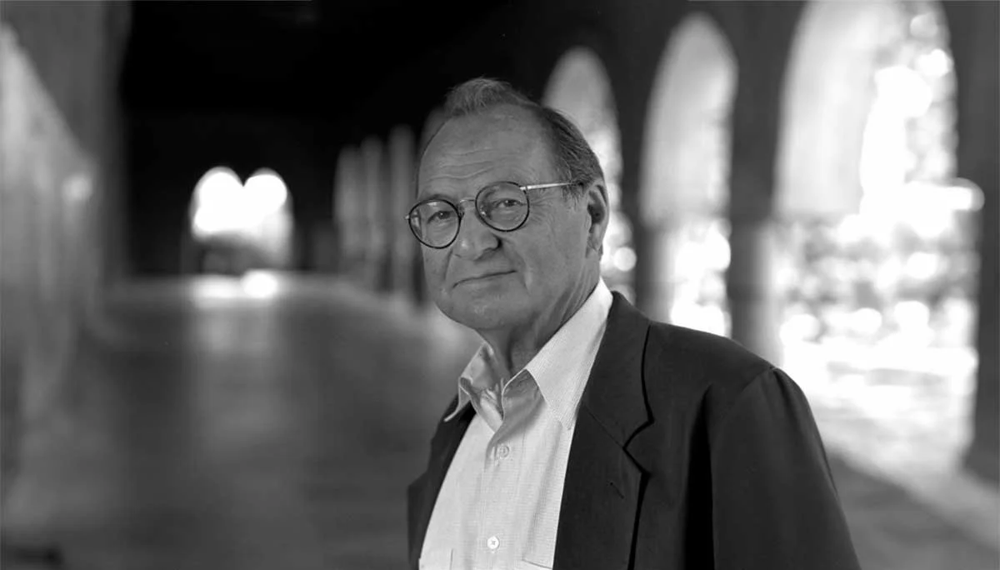
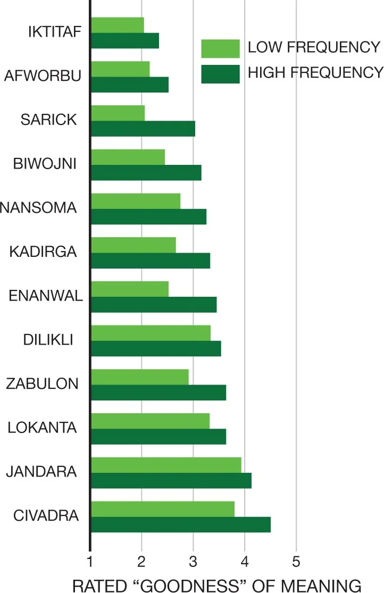
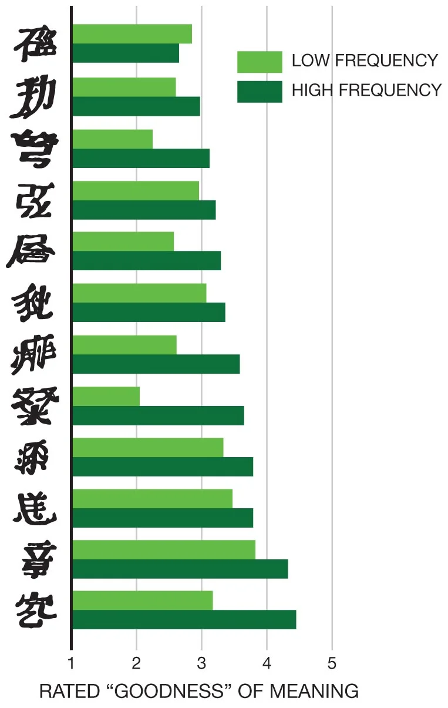
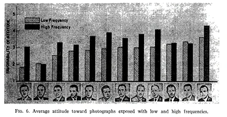
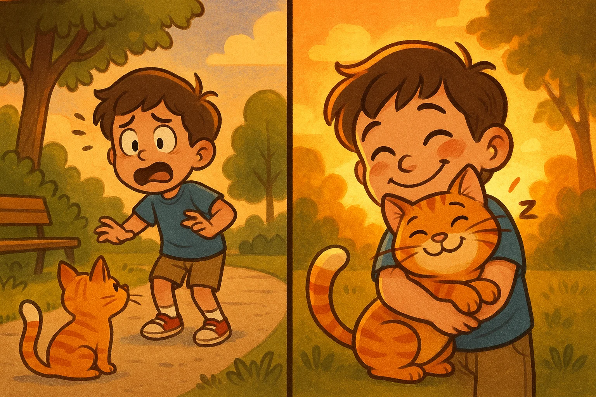
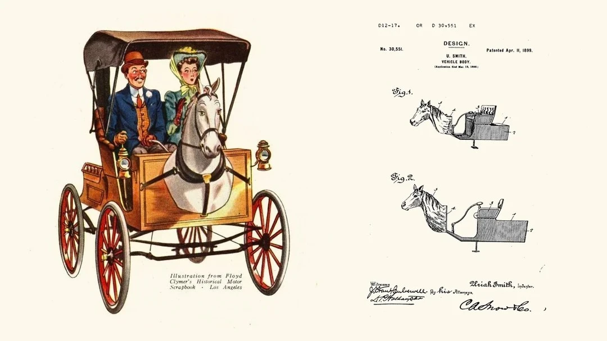
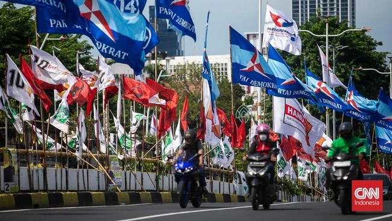
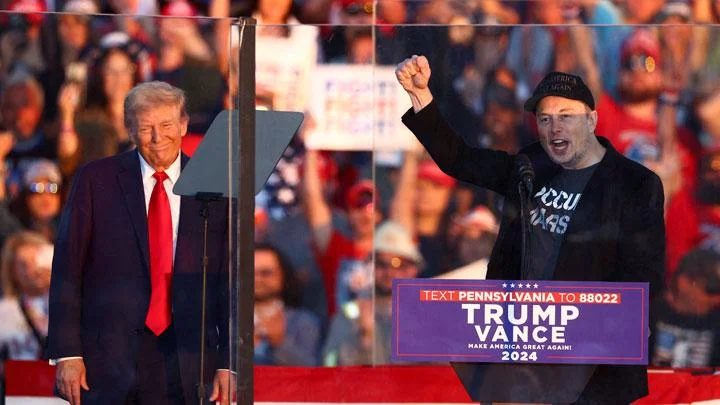

+++
title = 'Aspek Psikologis di Balik Ketertarikan terhadap Seseorang, Produk, atau Tokoh Politik'
date = 2025-05-14T21:37:16+07:00
draft = false
description = "Pernahkah Anda merasa menyukai sebuah produk, hewan, tanaman, atau bahkan seseorang? Menurut Anda, apa yang membuat kita menyukai seseorang? Beberapa orang mungkin menjawab karena penampilannya, sikapnya, atau bahkan merasa tertarik sejak pandangan pertama."
image = "1.webp"
imageBig= "1.webp"
categories= ["Insight Psychology"]
tags=["Problem Solving"]
authors= ["Daddy Ananta"]
avatar="/images/profil.jpeg"
+++

Namun, dalam banyak kasus, perasaan suka tersebut tidak benar-benar muncul secara tiba-tiba. Secara psikologis, rasa suka sering kali merupakan hasil dari pengalaman dan paparan sebelumnya. Misalnya, Anda mungkin pernah menonton film dengan karakter yang mirip dengannya, atau mungkin dia mengingatkan Anda pada seseorang yang penting dalam hidup Anda. Otak kita cenderung membangun hubungan positif berdasarkan hal-hal yang sudah akrab.

Fakta menarik ini menjadi dasar bagi banyak strategi di dunia nyata. Di balik layar kampanye politik, pemasaran produk, dan desain pengalaman pengguna (UX), para profesional memanfaatkan efek ini untuk membentuk persepsi dan preferensi kita — semua itu bukan kebetulan, tapi strategi psikologis yang terencana.

## Attitudinal Effects of Mere Exposure

  
  
 Robert B. Zajonc From <a href="https://www.psicoactiva.com/biografias/robert-zajonc/">psicoactiva.com</a>

Pada Juni 1968, seorang psikolog sosial bernama Robert B. Zajonc menerbitkan sebuah penelitian eksperimental yang berjudul "**Attitudinal Effects of Mere Exposure**." Dalam studi ini, Zajonc mengajukan hipotesis bahwa semakin sering seseorang terpapar pada suatu stimulus — baik itu kata, gambar, atau wajah — maka semakin positif sikap individu terhadap stimulus tersebut. Artinya, hanya dengan melihat atau mengalami sesuatu secara berulang, tanpa interaksi secara langsung atau memberi penilaian dengan sadar, seseorang dapat mulai menyukainya. Penelitian ini dilakukan melalui serangkaian eksperimen di mana para partisipan diminta menilai berbagai stimulus yang frekuensi(beberapa kali) kemunculannya telah dimanipulasi.

### Eksperimen I: Paparan Kata-Kata Tak Bermakna ("Turkish" Words)

  
  
 "Turkish" Words From <a href="https://nerd.wwnorton.com/ebooks/epub/socialpsych6/EPUB/content/2.3-chapter02.xhtml">nerd.wwnorton.com</a>

Eksperimen pertama bertujuan untuk menyelidiki apakah peningkatan frekuensi paparan terhadap kata-kata tak bermakna dapat meningkatkan penilaian afektif terhadapnya.  Partisipan dihadapkan pada serangkaian kata tujuh huruf yang disajikan sebagai kata-kata "Turki", yang sebenarnya merupakan stimulus tak bermakna.  

Frekuensi paparan kata-kata ini dimanipulasi secara eksperimental, di mana setiap kata ditampilkan sebanyak 0, 1, 2, 5, 10, atau 25 kali.  Selama fase paparan, partisipan diminta untuk melihat dan mengucapkan setiap kata yang ditampilkan selama kurang lebih dua detik.  Setelah itu, mereka diminta untuk menilai makna setiap kata pada skala "baik-buruk".  Hasilnya menunjukkan bahwa semakin sering sebuah kata tak bermakna diperlihatkan kepada partisipan, semakin positif kata tersebut menurut mereka.

### Eksperimen II: Paparan Karakter Mirip Aksara Cina (Chinese-like Characters)

  
  
 "Chinese-like Characters From <a href="https://nerd.wwnorton.com/ebooks/epub/socialpsych6/EPUB/content/2.3-chapter02.xhtml">Nerd.wwnorton.com</a>

Eksperimen kedua dirancang untuk menguji apakah efek paparan semata tetap terjadi bahkan ketika partisipan tidak secara aktif mengucapkan stimulus, sehingga menghilangkan kemungkinan bahwa kemudahan pengucapan menjadi faktor utama. Dalam eksperimen ini, stimulus yang digunakan adalah karakter-karakter yang menyerupai aksara Cina, yang diasumsikan tidak dapat diucapkan ataupun dibaca oleh partisipan.  

Sama seperti eksperimen pertama, frekuensi paparan karakter-karakter ini juga dimanipulasi (0, 1, 2, 5, 10, atau 25 kali).  Partisipan hanya diinstruksikan untuk memperhatikan setiap karakter yang ditampilkan secara visual selama dua detik tanpa perlu mengucapkannya.  Setelah fase paparan, mereka kembali diminta untuk menilai makna karakter-karakter tersebut pada skala "baik-buruk".  Hasil eksperimen ini konsisten dengan eksperimen pertama, menunjukkan bahwa paparan visual pasif terhadap stimulus yang tidak dikenal juga meningkatkan penilaian afektif positif terhadap stimulus tersebut.    

### Eksperimen III: Paparan Foto Wajah

  
  
 Average Attitude Toward Photographs Exposed From <a href="https://www.totalmedia.co.uk/wp-content/uploads/2021/10/mere-exposure-2.webp">House-of-communication.com</a>

Eksperimen ketiga menguji apakah paparan semata memengaruhi sikap antarpribadi dengan stimulus yang maknanya tidak sejelas kata atau simbol. Stimulus yang digunakan adalah foto-foto wajah pria yang diambil dari buku tahunan universitas.  Frekuensi paparan foto-foto ini dimanipulasi dengan cara yang sama seperti eksperimen sebelumnya, di mana setiap foto ditampilkan sebanyak 0, 1, 2, 5, 10, atau 25 kali, masing-masing selama dua detik.  Partisipan diberitahu bahwa eksperimen ini berkaitan dengan "memori visual".  

Setelah semua foto dipaparkan sesuai frekuensi yang ditentukan, partisipan diminta untuk menilai seberapa besar mereka mungkin "menyukai" pria dalam setiap foto menggunakan skala 7 poin.  Meskipun efeknya tidak sekuat pada stimulus verbal atau simbolik, hasil penelitian ini tetap menunjukkan bahwa paparan berulang terhadap foto wajah cenderung meningkatkan rasa suka terhadap individu dalam foto tersebut, mempengaruhi efek paparan semata pada pembentukan sikap antarpribadi.    

### Eksperimen IV: Perubahan Gairah Afektif (GSR)

  
  
 Galvanic Skin Response From Open.AI</a>

Eksperimen keempat dirancang untuk menyelidiki mekanisme psikofisiologis yang mungkin mendasari efek paparan semata, khususnya apakah paparan berulang mengurangi gairah afektif negatif (seperti ketegangan atau ketidakpastian) yang mungkin ditimbulkan oleh stimulus baru.  Stimulus yang digunakan adalah kata-kata tak bermakna, serupa dengan Eksperimen I.  Frekuensi paparan kata-kata ini kembali dimanipulasi, dengan beberapa kata ditampilkan 25 kali, beberapa 10 kali, dan seterusnya, hingga hanya sekali, dalam serangkaian 86 percobaan.  

Selama paparan setiap kata (masing-masing selama 2 detik), Galvanic Skin Response (GSR) partisipan direkam sebagai ukuran gairah otonom.  Hasilnya menunjukkan bahwa paparan berulang terhadap kata-kata tak bermakna menyebabkan penurunan signifikan dalam respons GSR.  

Perlu diketahui bahwa respons GSR (Galvanic Skin Response) yang tinggi menunjukkan tingkat kewaspadaan atau gairah fisiologis yang tinggi terhadap suatu stimulus. Dalam konteks penelitian mengenai mere exposure effect, ditemukan bahwa seiring meningkatnya keakraban seseorang terhadap stimulus akibat paparan berulang, respons fisiologis tersebut cenderung menurun. Hal ini konsisten dengan gagasan bahwa stimulus yang familiar dianggap kurang mengancam atau menimbulkan ketidakpastian. Dengan demikian, stimulus tersebut lebih mungkin dinilai secara positif karena menghadirkan rasa aman dan dapat diprediksi.  

## Exposure and Affect: Overview and Meta-Analysis of Research

  
  
 Robert F. Bornstein From <a href="https://www.adelphi.edu/news/who-is-overusing-their-smartphones-and-why/">Adelphi.edu</a>

Pada tahun 1989, Robert F. Bornstein melakukan sebuah penelitian meta-analisis yang meninjau lebih dari 200 eksperimen dari 134 artikel yang diterbitkan antara tahun 1968 hingga 1987, yang semuanya berkaitan dengan efek paparan belaka (mere exposure effect). Meta-analisis ini bertujuan untuk mengevaluasi konsistensi dan kekuatan efek tersebut di berbagai kondisi dan jenis stimulus. Analis ini kemudian memperoleh kesimpulan dari faktor-faktor yang mempengaruhi efek paparan dari variabel metodologis.

  <h2 style="font-size: 24px; font-weight: 700; margin-bottom: 20px; color: #1f2937; text-align: left;">🧠 Faktor-faktor yang Mempengaruhi Efek Paparan</h2>
  
  <ul style="list-style-type: disc; padding-left: 24px;">
    <li style="margin-bottom: 16px;">
      <strong style="color: #2563eb;">Jenis dan Kompleksitas Stimulus:</strong> Jenis stimulus (misalnya, foto, kata-kata bermakna, poligon) dan tingkat kompleksitasnya dapat memengaruhi kekuatan efek paparan. Stimulus yang lebih kompleks cenderung menghasilkan efek yang lebih kuat. Namun, stimulus berupa lukisan, gambar, dan matriks abstrak tidak menunjukkan efek paparan yang kuat seperti jenis stimulus lainnya.
    </li>
    <li style="margin-bottom: 16px;">
      <strong style="color: #2563eb;">Urutan dan Durasi Paparan:</strong> Paparan stimulus yang singkat dan disajikan secara heterogen (diselingi stimulus lain) cenderung meningkatkan efek paparan. Sebaliknya, paparan yang terlalu lama atau terlalu sering dapat menimbulkan kebosanan dan mengurangi efek positif. Jumlah paparan yang optimal umumnya berada pada angka 10–20 kali presentasi.
    </li>
    <li style="margin-bottom: 16px;">
      <strong style="color: #2563eb;">Pengenalan Stimulus (Stimulus Recognition):</strong> Menariknya, pengenalan sadar terhadap stimulus bukanlah prasyarat untuk timbulnya efek paparan. Bahkan, paparan terhadap stimulus <em>subliminal</em> (di bawah ambang batas kesadaran) justru menghasilkan peningkatan afek yang lebih besar dibandingkan stimulus yang disajikan secara singkat namun dapat dikenali. Hal ini menunjukkan bahwa kesadaran terhadap stimulus justru dapat menghambat efek paparan.
    </li>
    <li style="margin-bottom: 16px;">
      <strong style="color: #2563eb;">Usia Subjek:</strong> Usia menjadi faktor penting, di mana efek paparan tipikal umumnya tidak ditemukan pada subjek anak-anak. Penelitian menunjukkan bahwa anak-anak cenderung lebih menyukai stimulus baru daripada yang sudah dikenal, menghasilkan hubungan terbalik antara keakraban dan afek pada usia muda.
    </li>
    <li>
      <strong style="color: #2563eb;">Penundaan antara Paparan dan Penilaian:</strong> Adanya jeda waktu antara paparan stimulus dan saat penilaian afek justru memperkuat efek paparan, bahkan jika penundaan berlangsung hingga dua minggu. Studi naturalistik (<em>in vivo</em>) juga menunjukkan efek yang jauh lebih kuat dibandingkan studi laboratorium.
    </li>
  </ul>

   

## Study Kasus

### Horsey Horseless

Seperti yang kita lihat, mobil kini menjadi salah satu alat transportasi paling umum digunakan, baik sebagai kendaraan pribadi maupun transportasi umum. Tujuannya sama: membawa kita lebih jauh, lebih cepat, dan dengan cara yang lebih efisien. Namun sebelum kendaraan bermesin diperkenalkan, masyarakat pada umumnya mengandalkan kereta kuda sebagai sarana transportasi utama.

Meski kereta kuda memiliki banyak keterbatasan, seperti kecepatan yang rendah dan perawatan yang rumit, masyarakat saat itu sudah terbiasa dan merasa cukup nyaman menggunakannya. Ketika kendaraan bermesin mulai diperkenalkan, reaksi publik cenderung negatif. Banyak yang menganggapnya berbahaya, tidak dapat dipercaya, bahkan menyebutnya sebagai "kereta setan". Penolakan ini tidak hanya datang dari manusia, tetapi juga dari kuda-kuda penarik kereta, yang kerap panik saat berpapasan dengan kendaraan bermotor — menyebabkan kekacauan dan berisiko mencelakakan penumpang.

Seorang penemu bernama Uriah Smith pada tahun 1899 mencoba merancang solusi atas kekhawatiran masyarakat terhadap kendaraan bermotor yang pada saat itu dianggap asing dan menakutkan bagi manusia maupun hewan, terutama kuda. Ia menciptakan desain yang disebut Horsey Horseless — sebuah kendaraan bermesin yang dipasangi replika kepala kuda di bagian depannya. Tujuannya adalah untuk membuat kendaraan tersebut terlihat lebih familiar, menyerupai kereta kuda tradisional, sehingga tidak mengejutkan atau menakutkan kuda lain di jalan. 

  
  
 Horsey Horseless From Jorge Arango in <a href="https://www.linkedin.com/pulse/horsey-horseless-challenge-ai-native-products-jorge-arango-fdfzc">Linkedin.com</a>

Rancangan ini merupakan contoh awal dari bagaimana elemen desain dapat dimodifikasi untuk menyesuaikan dengan kebiasaan visual masyarakat, dan menjadi cerminan dari prinsip mere exposure effect, di mana sesuatu yang tampak akrab cenderung lebih mudah diterima.

### Kampanye

Saat kita melihat iklan produk atau kampanye politik, kita sering kali disuguhi paparan berulang terhadap pesan atau merek yang sama. Tidak hanya lewat televisi, tetapi juga melalui berbagai kanal seperti YouTube, videotron, billboard, hingga spanduk dan bendera partai politik yang tersebar di sepanjang jalan.

  
  
 Kakek Nenek Cedera Serius Usai Tersangkut Bendera Parpol di Mampang From <a href="https://www.cnnindonesia.com/nasional/20240117182144-12-1050875/kakek-nenek-cedera-serius-usai-tersangkut-bendera-parpol-di-mampang">CNN Indonesia</a>

Paparan berulang ini bukanlah kebetulan, melainkan strategi psikologis yang sengaja dirancang untuk membangun rasa akrab dalam benak kita. Semakin sering kita melihat suatu merek, wajah kandidat, atau simbol tertentu, semakin besar kemungkinan kita merasa familiar — dan pada akhirnya, lebih menyukainya, bahkan tanpa alasan rasional yang jelas.

Bahkan, tidak jarang kita melihat bahwa iklan maupun kampanye politik melibatkan figur influencer untuk menarik perhatian dan membangun kedekatan emosional dengan audiens. Strategi ini bertujuan agar para pengikut influencer merasa lebih nyaman dan akrab dengan produk atau tokoh politik yang mereka promosikan. 

  
  
 Trumpt and Elon Musk  From <a href="https://www.tempo.co/internasional/4-fakta-elon-musk-sokong-puluhan-juta-dollar-ke-donald-trump-478207">Tempo.co</a>

Ketika seorang influencer yang dipercaya dan disukai oleh publik mendukung suatu merek atau kandidat, perasaan positif yang dimiliki pengikut terhadap influencer tersebut dapat "menular" pada objek yang dipromosikan. Inilah salah satu bentuk pemanfaatan efek paparan dan asosiasi emosional dalam strategi komunikasi massa.

## Rekomendasi Bisnis

Banyak startup dan perusahaan teknologi mengembangkan produk dengan teknologi yang sangat canggih, bahkan terkadang terasa terlalu maju di mata masyarakat umum. Akibatnya, banyak orang merasa teknologi tersebut asing, membingungkan, bahkan berpotensi menimbulkan kekhawatiran atau ketakutan. Ketidakakraban ini bisa membuat pengguna enggan menerima atau menggunakan produk tersebut. 

Oleh karena itu, dalam mengembangkan produk, perusahaan perlu mempertimbangkan aspek psikologis, terutama bagaimana membuat teknologi tersebut terasa lebih familiar dan mudah diterima oleh pengguna. Pendekatan ini penting untuk memastikan inovasi tidak hanya canggih secara teknis, tetapi juga dapat diterima dan disukai oleh pasar.

# Referensi

- 
Jonah Berger.(2014). Invisible Influence : The Hidden Forces That Shape Behavior. <a href="https://books.google.co.id/books?id=f90nDwAAQBAJ&printsec=frontcover&redir_esc=y#v=onepage&q&f=false">Googe Book</a>

- 
Robert F. Bornstein. (1989). <strong>Exposure and Affect: Overview and Meta-Analysis of Research, 1968–1987</strong>. <a href="https://psycnet.apa.org/doi/10.1037/0033-2909.106.2.265">APA PsycNet</a>

- 
Robert B. Zajonc. (1968). <strong>Attitudinal Effects of Mere Exposure.</strong> <a href="https://doi.apa.org/doi/10.1037/h0025848">APA PsycNet</a>
