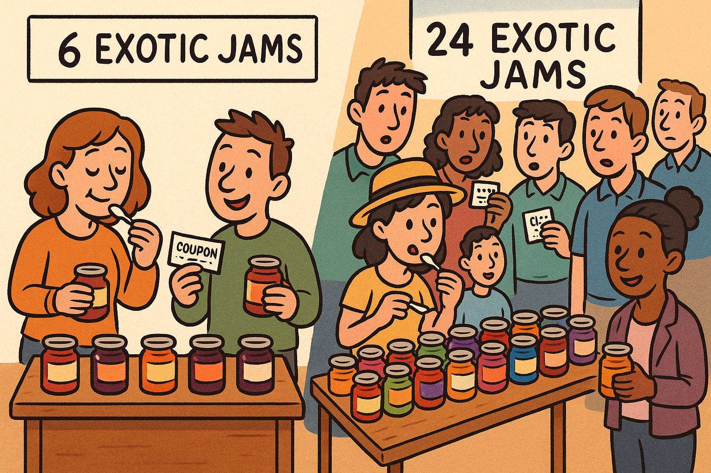
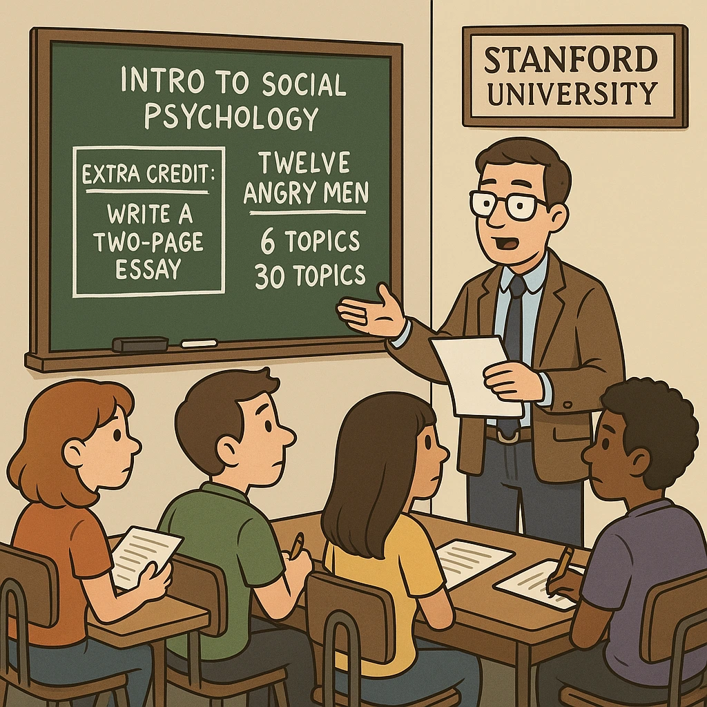
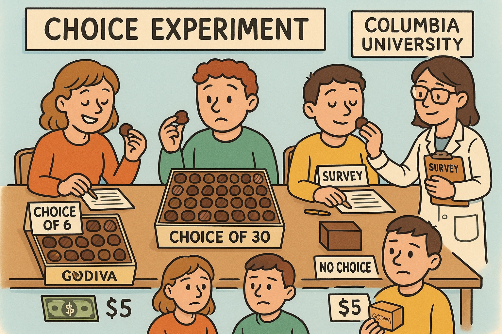
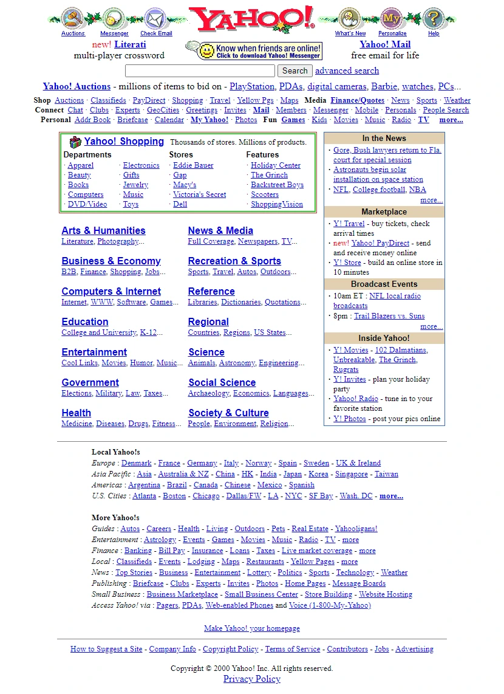
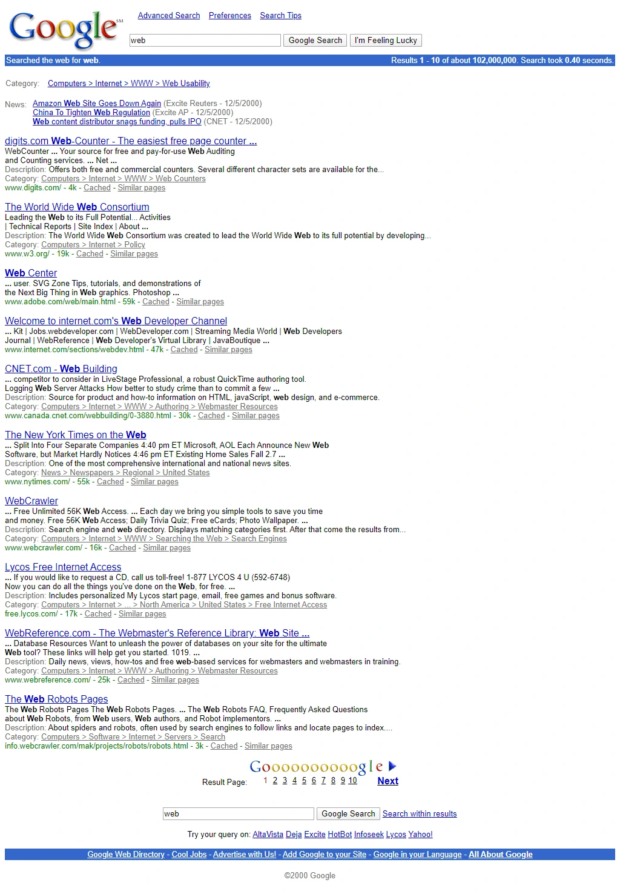
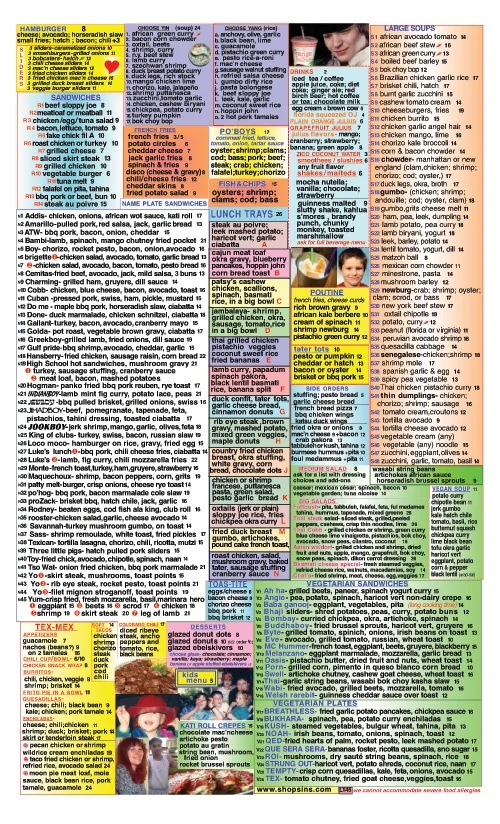

+++
title = 'Choice Overload - Benarkah Lebih banyak Opsi Lebih Baik?'
date = 2025-05-19T21:37:16+07:00
draft = false
description = "Saat kita hendak membuat sebuah keputusan, sering kali kita dihadapkan pada berbagai pilihan yang harus dipertimbangkan dengan saksama. Setiap opsi yang tersedia memiliki konsekuensi dan potensi risiko tersendiri, sehingga tidak jarang kita merasa ragu, bingung, atau bahkan cemas dalam menentukan langkah yang tepat."
image = "1.webp"
imageBig= "1.webp"
categories= ["Insight Psychology"]
tags=["Choices"]
authors= ["Daddy Ananta"]
avatar="/images/profil.jpeg"
+++

Misalnya saja, ketika kita hendak menghadiri suatu acara bersama teman-teman, kita sering kali dihadapkan pada kebingungan dalam memilih pakaian yang tepat. Kita mungkin bertanya-tanya, apakah sebaiknya mengenakan pakaian formal untuk menunjukkan kesan sopan dan rapi, atau cukup berpakaian santai agar terasa lebih nyaman dan sesuai dengan suasana akrab. Pemikiran kita mungkin akan mencoba memproses kemungkinan yang akan terjadi bila kita membuat suatu keputusan.

Jika Anda adalah seorang pemilik usaha atau pernah mengenal seseorang yang menjalankan bisnis sendiri, Anda mungkin pernah memikirkan kemungkinan untuk memperluas penawaran dengan menjual berbagai macam produk atau layanan. Gagasan ini tampak menarik karena semakin banyak pilihan yang ditawarkan, semakin besar pula peluang untuk menarik lebih banyak konsumen dengan beragam kebutuhan dan preferensinya bukan? Sehingga nantinya kemungkinan tingkat pembelian juga akan semakin tinggi.

Namun, apakah ini benar? Kita akan mencoba memahami kebenaran dari hipotesis tersebut melalui tulisan ini. 

## Choice Overload 

  
  
 Sheena Iyengar  From <a href="https://www.webdesignmuseum.org/gallery/yahoo-in-2000">Webdesignmuseum.org</a>

Pada tahun 2000, sebuah eksperimen terkenal dipublikasikan dalam Journal of Personality and Social Psychology dengan judul "When Choice is Demotivating: Can One Desire Too Much of a Good Thing?", yang dapat diterjemahkan sebagai "Ketika Pilihan Justru Melemahkan Motivasi: Bisakah Seseorang Terlalu Menginginkan Sesuatu yang Baik?". 

Penelitian ini dilakukan oleh Sheena Iyengar dan Mark Lepper, yang mendirikan sebuah stan sampel selai di sebuah toko kelontong sebagai bagian dari metode eksperimen mereka. Eksperimen tersebut bertujuan menguji asumsi bahwa lebih banyak pilihan selalu lebih baik dan lebih memotivasi secara intrinsik.

Dalam penelitian ini dibagi menjadi 3 eksperimen:

### 1. Eksperimen Lapangan dengan Selai

  
  
 Eksperimen Lapangan dengan Selai
  From OpenAI</a>

Dalam sebuah eksperimen yang dilakukan di sebuah toko, konsumen dihadapkan pada dua kondisi berbeda. Pada pajangan pertama, tersedia enam jenis selai eksotis (pilihan terbatas), sedangkan pada pajangan kedua tersedia 24 jenis selai eksotis (pilihan luas). Sekitar 754 pembeli diamati selama dua periode eksperimen yang berlangsung selama lima jam. Selama pengamatan, para pengunjung diizinkan untuk mencicipi selai sebanyak yang mereka inginkan dan juga menerima kupon diskon untuk pembelian produk tersebut.

Pada eksperimen ini ternyata lebih banyak konsumen yang tertarik pada stan dengan pajangan 25 selai, wow-sesuai dengan dugaan awal kita bahwa lebih banyak pilihan akan menarik lebih banyak konsumen. Namun, secara signifikan lebih banyak selai yang benar-benar dibeli pada stan dengan hanya 6 pilihan selai. 

### 2. Eksperimen Lapangan dengan Tugas Esai

  
  

    Eksperimen Lapangan dengan Tugas Esai — From 
    OpenAI
  

Eksperimen kedua dilakukan di kelas psikologi sosial pengantar di Universitas Stanford. Dalam eksperimen ini, mahasiswa diberikan kesempatan untuk menulis esai setebal dua halaman untuk mendapatkan nilai tambah. Sebanyak 197 mahasiswa dibagi menjadi dua kelompok: satu kelompok diberi pilihan 6 topik esai (pilihan terbatas), sementara kelompok lainnya diberi 30 topik esai (pilihan luas). Untuk tugas ini, salah satu materi yang mungkin terkait atau menjadi dasar topik adalah film berjudul "Twelve Angry Men".

Setelah hasil esai dikumpulkan, para peneliti menyimpulkan bahwa mahasiswa lebih cenderung menyerahkan tugas esai ketika mereka dihadapkan pada 6 pilihan topik dibandingkan dengan 30 pilihan topik. Selain itu, kualitas tulisan esai yang dihasilkan juga lebih baik pada kelompok mahasiswa yang memilih dari 6 topik.

### 3. Eksperimen Laboratorium dengan Cokelat

  
  
 Eksperimen Laboratorium dengan Cokelat  From OpenAI

Pada eksperimen ketiga, 134 mahasiswa dari Universitas Columbia, yang sebelumnya telah disaring karena menyukai cokelat dan tidak terlalu akrab dengan merek Godiva, berpartisipasi.

Partisipan secara acak ditugaskan ke salah satu dari tiga kondisi: pilihan terbatas (memilih dari 6 jenis cokelat Godiva), pilihan luas (memilih dari 30 jenis cokelat Godiva), atau kondisi tanpa pilihan (di mana mereka diberi cokelat secara acak tanpa memilih).

Partisipan dalam kondisi pilihan terbatas dan pilihan luas terlebih dahulu memilih cokelat yang ingin mereka cicipi. 

- Sebelum mencicipi, mereka mengisi kuesioner yang berkaitan dengan proses pengambilan keputusan. 

- Setelah mencicipi cokelat pilihan mereka, para partisipan kemudian mengisi kuesioner untuk mengukur tingkat kepuasan mereka. 

- Sebagai tahap akhir, mereka ditawari pilihan kompensasi, yaitu menerima pembayaran tunai sebesar $5 atau sekotak cokelat Godiva.

Hasil dari eksperimen ketiga ini menunjukkan bahwa partisipan yang dihadapkan pada 30 pilihan cokelat melaporkan lebih menikmati proses memilih dibandingkan mereka yang dihadapkan pada 6 pilihan. Meskipun demikian, partisipan dengan 30 pilihan kemudian merasa kurang puas dan lebih menyesal dengan cokelat yang mereka pilih. Selain itu, mereka juga secara signifikan lebih kecil kemungkinannya untuk memilih sekotak cokelat sebagai kompensasi dibandingkan uang tunai, jika dibandingkan dengan partisipan yang memilih dari 6 jenis cokelat.

### Kesimpulan Eksperimen

Secara keseluruhan, ketiga eksperimen ini secara konsisten menunjukkan fenomena yang dikenal sebagai "paradox choices". Meskipun sejumlah besar pilihan pada awalnya tampak menarik dan memberikan kesan kebebasan—seperti yang terlihat pada ketertarikan awal konsumen pada stan dengan lebih banyak selai dan kenikmatan mahasiswa dalam proses memilih dari banyak cokelat—jumlah pilihan yang berlebihan justru dapat berdampak negatif. 

Pilihan yang terlalu banyak terbukti dapat melemahkan motivasi untuk bertindak (seperti dalam pembelian selai dan penyerahan tugas esai), menurunkan kualitas hasil (kualitas esai), serta mengurangi kepuasan dan meningkatkan penyesalan terhadap keputusan yang telah diambil (seperti pada pilihan cokelat). Dengan demikian, temuan-temuan ini mengindikasikan bahwa lebih sedikit pilihan terkadang dapat menghasilkan keterlibatan yang lebih efektif dan kepuasan yang lebih besar.

## Contoh Kasus

### Desain awal Yahoo! Search vs Google Search

  
  
 Yahoo! in 2000  From <a href="https://www.webdesignmuseum.org/gallery/yahoo-in-2000">Webdesignmuseum.org</a>

Coba kita ingat kembali, pada masanya, terutama sepanjang pertengahan 1990-an hingga awal 2000-an, Yahoo mengadopsi model portal yang sangat dominan. Halaman depannya menyajikan begitu banyak pilihan layanan dan informasi untuk kita, mulai dari berita, email, hingga direktori belanja, selain tentunya fitur pencarian. Meskipun tujuannya baik, yaitu menjadi serba ada, banyaknya opsi ini, bisa Anda bayangkan, berpotensi menciptakan choice overload bagi kita sebagai pengguna yang mungkin saat itu primernya hanya ingin mencari informasi. 

  
  
 Google in 2000  From <a href="https://www.webdesignmuseum.org/exhibitions/google-in-2000">Webdesignmuseum.org</a>

Kondisinya mirip dengan konsumen dalam eksperimen yang kita bahas, yang merasa kewalahan dengan terlalu banyak pilihan selai. Sebaliknya, Google, yang mulai kita kenal dan menanjak popularitasnya di awal 2000-an, justru tampil dengan antarmuka yang sangat minimalis. Ini memusatkan perhatian Anda hampir secara eksklusif pada fungsi pencarian, sebuah pendekatan yang sejalan dengan temuan eksperimen bahwa pilihan terbatas dapat mempermudah kita mengambil keputusan dan meningkatkan kepuasan.

## Rekomendasi

Sebagai bagian dari pengembangan suatu produk, tentunya kita tidak menginginkan produk kita terlihat membosankan ataupun terasa membingungkan bagi konsumen kita. Dengan pemahaman tersebut, akan lebih baik jika kita benar-benar fokus pada penciptaan pengalaman pengguna yang intuitif dan bernilai. Ini berarti kita perlu cermat dalam memilih serta menyajikan fitur-fitur produk, memastikan bahwa setiap elemen tidak hanya fungsional tetapi juga mudah dipahami dan diakses oleh konsumen.

Daripada membanjiri mereka dengan terlalu banyak pilihan atau informasi yang kompleks—yang berisiko membuat mereka bingung atau bahkan jenuh—kita sebaiknya mengarahkan upaya untuk menyederhanakan interaksi, menonjolkan manfaat inti produk, dan secara keseluruhan membuat perjalanan mereka dengan produk kita terasa lebih menyenangkan dan memuaskan.

Sebagai tambahan menu restoran yang super komplit:

  
  
 Menu Design Fails From <a href="https://blog.kulturekonnect.com/9-menu-design-fails">blog.kulturekonnect.com</a>

## Referensi

- 

  Sheena S. Iyengar & Mark R. Lepper (2000). <strong>When Choice is Demotivating: Can One Desire Too Much of a Good Thing?</strong>. <i>Journal of Personality and Social Psychology, 79</i>(6), 995–1006. <a href="https://faculty.washington.edu/jdb/345/345%20Articles/Iyengar%20%26%20Lepper%20(2000).pdf">PDF Journal</a>

- 
Nir Eyal.(2014). Hooked: How to Build Habbit-Forming Products. <a href="https://books.google.co.id/books/about/Hooked.html?id=dsz5AwAAQBAJ&redir_esc=y">Googe Book</a>

