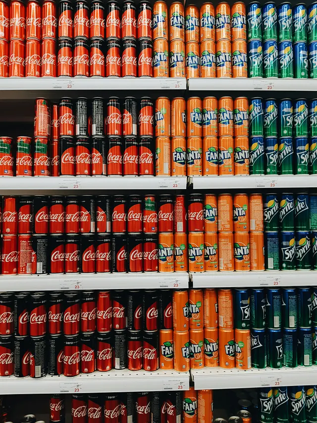
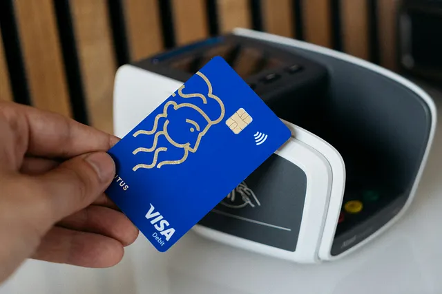
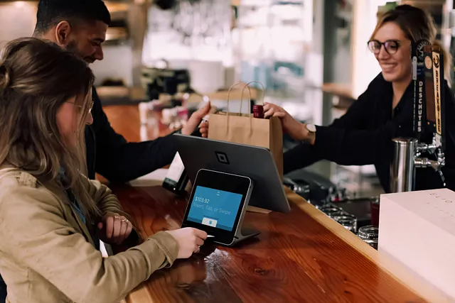
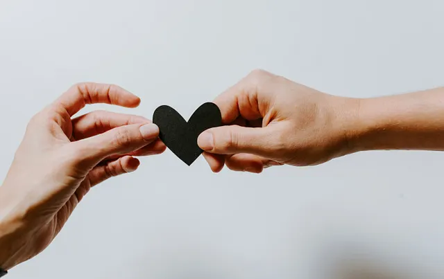

+++
title = 'Kenapa Pembayaran Tunai Saya Ditolak dan Justru Dompet Digital Diutamakan?'
date = 2025-08-22T15:00:13+07:00
socialshare = true
draft = false
description = "Temukan 3 bias psikologis yang dipicu oleh pembayaran digital dan pelajari cara merancang checkout yang lebih cerdas dan etis. Panduan untuk marketer & Project Manajer"
image = "1.webp"
imageBig= "1.webp"
categories= ["Insight Psychology"]
tags=["ekonomi-perilaku"
,"pembayaran-digital"
,"ux-design"
,"bias-kognitif"
, "e-commerce"]
authors= ["Daddy Ananta"]
avatar="/images/profil.jpeg"
+++

Untuk merayakan selesainya sidang skripsi beberapa minggu lalu, saya mengajak seorang teman ke bioskop. Saya bersikeras mentraktir dengan uang tunai—sebuah gestur perayaan yang terasa nyata—namun ia juga bersikeras ingin membayar lewat _mobile banking_.

Perdebatan kecil kami berakhir di loket dengan momen yang memalukan: uang tunai yang saya siapkan ditolak dengan senyuman. Pihak bioskop, menjelaskan bahwa pembayaran kini wajib menggunakan transaksi digital lewat _QR code_.

Penolakan ini sepertinya bukan hanya persoalan teknologi atau keamanan dibaliknya. Ada sesuatu yang terasa berbeda secara psikologi yang membuat saya tidak begitu nyaman karena tidak bisa berhenti memikirkannya. Hingga akhirnya saya menemukan rahasianya.

Kita akan mulai dengan sebuah teka-teki sederhana dari seorang peneliti, Dan Ariely.

### **Misteri Kulkas: Soda vs. Uang Tunai**

  
  
Photo by <a href="https://unsplash.com/@nosova">Alexandra Nosova</a> on <a href="https://unsplash.com/">Unsplash</a>

Bayangkan sebuah kulkas bersama di asrama mahasiswa. Di dalamnya, Dan Ariely meletakkan dua hal: enam kaleng soda dan enam lembar uang satu dolar. Keduanya bernilai sama, mudah diambil. Apa yang terjadi dalam 72 jam?

Dan Ariely from <a href="https://en.wikipedia.org/wiki/Dan_Ariely">Wikipedia.org</a>

Semua soda ludes. Tak bersisa. Tapi, tidak ada satu dolar pun yang tersentuh.

Aneh, kan? Eksperimen ini adalah pembuka yang sempurna untuk memahami sebuah kebenaran besar: bagi otak kita, **tidak semua uang diciptakan setara**. Uang digital di kartu kredit, saldo GoPay, atau cicilan *Buy Now, Pay Later* (BNPL) terasa jauh lebih abstrak dan tidak senyata lembaran uang kertas di dompet kita.

Pergeseran dari uang fisik ke digital ini bukan sekadar soal teknologi. Ini adalah skenario psikologis yang mengubah cara kita menilai, merasakan, dan pada akhirnya, membelanjakan uang. 

### **Mengapa Uang Tunai adalah "Rem Finansial" Alami Kita**

Photo by <a href="https://unsplash.com/@cardmapr">CardMapr.nl</a> on <a href="https://unsplash.com/">Unsplash</a>

Dulu, sebelum era digital, setiap pengeluaran punya "gesekan". Para ekonom perilaku punya istilah keren untuk ini: **"The Pain of Paying"** atau "Rasa Sakit Saat Membayar".

Coba bayangkan kamu membeli kopi mahal dengan selembar uang Rp100.000. Kamu menyerahkan uang itu, melihatnya berpindah tangan, dan menerima kembalian yang jauh lebih sedikit. Kamu bisa *merasakan* dompetmu menjadi lebih tipis. Sensasi fisik ini adalah umpan balik instan yang berfungsi sebagai rem alami untuk pengeluaran dari pembelian  impulsif yang Anda mungkin lakukan.

Menurut Anda seberapa kuat rem tersebut ? Sebuah [penelitian oleh Runnemark, Hedman, dan Xiao](https://research.cbs.dk/en/publications/do-consumers-pay-more-using-debit-cards-than-cash) mencoba menjawabnya. Mereka membandingkan kerelaan membayar antara pengguna uang tunai dan kartu debit (yang uangnya juga langsung terpotong). Hasilnya cukup menyenangkan: konsumen rela membayar **22% hingga 54% lebih banyak** untuk barang yang sama persis hanya karena mereka menggunakan kartu!

Hanya dengan menghilangkan interaksi fisik dengan uang, cengkeraman(rem) kita pada dompet langsung melonggar secara drastis.

### **Tiga Trik Psikologis di Era Digital**

Peralihan ke transaksi digital tidak hanya menghilangkan "rasa sakit" itu. Ia secara aktif mengubah cara otak kita memproses nilai, moralitas, dan emosi. Ada tiga pergeseran besar yang terjadi.

#### 1. Pergeseran Moral: Celah untuk "Mencari Alasan"

Photo by <a href="https://unsplash.com/@chris_ainsworth22">Chris</a> on <a href="https://unsplash.com/">Unsplash</a>

Pernahkah kamu berpikir mengapa seorang karyawan yang sangat jujur mungkin tanpa pikir panjang membawa pulang pulpen kantor, tapi tidak akan pernah berani mengambil uang receh dari laci kasir? Jawabannya adalah **jarak psikologis**.

Dalam [eksperimen lanjutannya](https://en.wikipedia.org/wiki/Predictably_Irrational), Dan Ariely menemukan hal menarik. Ia memberi mahasiswa kesempatan untuk melebih-lebihkan skor tes mereka untuk mendapat imbalan. Kelompok yang dibayar langsung dengan uang tunai cenderung lebih jujur. Tapi, kelompok yang dibayar dengan token (yang nanti harus ditukar lagi dengan uang tunai) **berbuat curang dua kali lebih banyak!**

Penambahan satu langkah non-moneter (token) itu sudah cukup untuk membuka celah rasionalisasi di otak kita. "Aihh, ini kan cuma token ya," begitu mungkin yang mereka pikirkan. Hal yang sama berlaku saat beberapa orang  "sedikit" melebih-lebihkan klaim asuransi atau "mempercantik" laporan pengeluaran. Semakin abstrak transaksinya, semakin mudah moral kita untuk tertidur.

#### 2. Pergeseran Persepsi: Biaya yang Terasa Lebih Kecil

Transaksi digital adalah master ilusi yang membuat total biaya terasa lebih kecil dan lebih jinak dari yang sebenarnya. Ada dua trik sulap utama yang dimainkannya:

* **Fragmentasi (BNPL):** Layanan *Buy Now, Pay Later* tidak hanya menunda pembayaran. Senjata utamanya adalah memecah total biaya menjadi potongan-potongan kecil yang terasa sepele. Harga Rp1.200.000 mungkin terasa berat, tapi "cuma Rp300.000 per bulan selama 4 bulan" terdengar sangat bisa diatasi. Sebuah [studi oleh Maesen dan Ang](https://eprints.whiterose.ac.uk/id/eprint/216782/13/maesen-ang-2024-express-buy-now-pay-later-impact-of-installment-payments-on-customer-purchases.pdf) menemukan bahwa adopsi BNPL meningkatkan **frekuensi belanja hingga 9 poin persentase** dan **jumlah uang yang dihabiskan sebesar 10%**. Bukan karena kita jadi lebih kaya, tapi karena penghalang psikologis dari harga penuh telah dihancurkan.
* **Demosensitisasi:** Pernahkah kamu benar-benar *merasakan* uang keluar saat melakukan pembayaran dengan QRIS atau *tap* kartu? Hampir tidak ada. Hilangnya umpan balik sensorik ini ada harganya. [Penelitian tentang *haptic feedback* oleh Manshad dan Brannon](https://www.researchgate.net/publication/344206563_Haptic-payment_Exploring_vibration_feedback_as_a_means_of_reducing_overspending_in_mobile_payment) menemukan sesuatu yang keren: hanya dengan menambahkan **getaran ringan** saat pembayaran seluler, persepsi kehilangan uang meningkat dan niat belanja menurun. Tanpa getaran atau sensasi fisik apa pun, pengeluaran menjadi tindakan yang sunyi, senyap, dan tak terasa sehingga kita tak lagi merasakan kehilangan karnanya.

#### 3. Pergeseran Emosional: Lahirnya "The Pleasure of Paying"

Photo by <a href="https://unsplash.com/@christiannkoepke">Christiann Koepke</a> on <a href="https://unsplash.com/">Unsplash</a>

Ini mungkin bagian yang paling mengejutkan. Pembayaran digital terbaik tidak hanya menghilangkan rasa sakit, tapi justru **menciptakan rasa nikmat**.

Sebuah [studi EEG oleh Wang dkk.](https://www.frontiersin.org/journals/psychology/articles/10.3389/fpsyg.2022.1004068/full) benar-benar mengintip ke dalam otak konsumen saat mereka membayar. Apa yang mereka temukan? Pembayaran seluler yang lancar memicu aktivitas otak yang diidentifikasi sebagai penanda emosi positif yang kuat.

Para peneliti menamakannya **"The Pleasure of Paying"** atau "Kenikmatan Saat Membayar". Kelancaran, kecepatan, dan sedikit "keajaiban teknologi" dari sebuah transaksi *tap-to-pay* yang sukses ternyata memberikan kita suntikan dopamin kecil. Tindakan membayar, yang dulunya menyakitkan, kini berubah menjadi sesuatu yang memuaskan.

### **Mengubah Psikologi Menjadi Penjualan dan Kepuasan Pelanggan**

Photo by <a href="https://unsplash.com/@kellysikkema">Kelly Sikkema</a> on <a href="https://unsplash.com/">Unsplash</a>

Memahami prinsip-prinsip ini adalah kunci untuk membuka level berikutnya dalam pengalaman pelanggan. Tujuannya bukan untuk menahan pembeli, tetapi untuk **menghilangkan semua hambatan dan kecemasan** dari proses pembelian, membuat mereka merasa nyaman dan percaya diri dalam bertransaksi.

---

#### Untuk Para Marketer & Manajer Produk:

- **Minimalkan 'Rasa Sakit Saat Membayar' (Pain of Paying)** : Alih-alih menekankan total biaya yang besar, manfaatkan **efek dilusi biaya**. Pecah harga menjadi cicilan yang lebih mudah dicerna, seperti yang dilakukan oleh layanan BNPL. Bingkai penawaran dalam konteks harian atau bulanan ("Hanya seharga secangkir kopi sehari"). Semakin abstrak dan ringan biaya terasa, semakin rendah hambatan psikologis bagi pelanggan untuk menekan tombol "Beli Sekarang".
    
- **Rancang Pengalaman untuk 'Rasa Nikmat Saat Membayar' (Pleasure of Paying)** : Setiap gesekan, klik, atau ketukan adalah bagian dari pengalaman merek Anda. Rancang alur pembayaran yang **sehalus dan secepat mungkin**. Implementasikan _one-click checkout_, simpan metode pembayaran favorit pelanggan, dan gunakan verifikasi biometrik. Semakin cepat dan mulus transaksi, semakin kuat "percikan dopamin" atau _pleasure of paying_ yang dirasakan pelanggan, yang akan mereka asosiasikan dengan merek Anda.

- **Perpanjang Euforia Pembelian** : "Rasa nikmat" tidak boleh berhenti setelah pembayaran berhasil. Perpanjang perasaan positif tersebut ke fase pasca-pembelian untuk membangun loyalitas dan mendorong pembelian berulang. Ciptakan pengalaman pelacakan pesanan yang interaktif dan menyenangkan, kirim email konfirmasi yang dipersonalisasi, atau tawarkan _reward_ eksklusif setelah pembelian. Ini mengubah transaksi tunggal menjadi awal dari sebuah hubungan.
    

---

#### Untuk Para Analis & Peneliti:

**Mengukur Peluang Pertumbuhan**. Data adalah kompas Anda untuk menemukan di mana kenyamanan dapat ditingkatkan.
    
- **Segmentasi Berdasarkan Metode Bayar:** Identifikasi pelanggan mana yang paling responsif terhadap opsi pembayaran nirgesekan. Mereka adalah _power user_ Anda.
        
- **Hubungkan & Analisis:** Cari korelasi antara metode pembayaran pilihan dengan **Customer Lifetime Value (CLV)** dan frekuensi pembelian. Ini akan menunjukkan opsi pembayaran mana yang paling menguntungkan.
        
- **Uji Coba di Halaman Checkout:** Lakukan A/B test secara agresif. Apakah menampilkan logo BNPL lebih awal meningkatkan konversi? Apakah opsi dompet digital di urutan pertama mempercepat waktu checkout? Optimalkan untuk kecepatan dan kemudahan.
        

---

## **Kesimpulan**

Perpindahan ke era pembayaran digital ini jauh lebih dari sekadar inovasi teknologi; ini adalah sebuah **peluang emas untuk mendesain ulang pengalaman pelanggan dari awal hingga akhir**. Kekuatan tak kasat mata seperti "Pain of Paying" dan "Pleasure of Paying" adalah alat baru yang paling ampuh dalam perangkat Anda.

Sebagai arsitek ekonomi digital, memanfaatkannya adalah sebuah keharusan. Tujuannya adalah untuk memahami bahwa mendesain pengalaman membayar yang nyaman, cepat, dan menyenangkan **bukanlah trik, melainkan bentuk pelayanan pelanggan terbaik di era digital**. Karena pada akhirnya, cara kita membayar bukan lagi sekadar transaksi—melainkan puncak dari pengalaman dan kepuasan pelanggan itu sendiri.

 
<a href="https://daddyananta.github.io/categories/insight-psychology/">Baca artikel lain tentang Insight Psikologi</a>
 

## **Referensi**

Runnemark, E., Hedman, J., & Xiao, X. (2015). Do Consumers Pay More Using Debit Cards than Cash?. <a href="https://research.cbs.dk/en/publications/do-consumers-pay-more-using-debit-cards-than-cash">CBS Research Portal</a>

Maesen, S. & Ang, D. (2024). Buy Now, Pay Later: Impact of Installment Payments on Customer Purchases. <a href="https://eprints.whiterose.ac.uk/id/eprint/216782/13/maesen-ang-2024-express-buy-now-pay-later-impact-of-installment-payments-on-customer-purchases.pdf">White Rose Research Online</a>

Manshad, M. S. & Brannon, D. (2021). Haptic-payment: Exploring vibration feedback as a means of reducing overspending in mobile payment. <a href="https://www.researchgate.net/publication/344206563_Haptic-payment_Exploring_vibration_feedback_as_a_means_of_reducing_overspending_in_mobile_payment">Journal of Business Research</a>

Wang, M., Ling, A., He, Y., Tan, Y., Zhang, L., Chang, Z., & Ma, Q. (2022). Pleasure of paying when using mobile payment: Evidence from EEG studies. <a href="https://www.frontiersin.org/journals/psychology/articles/10.3389/fpsyg.2022.1004068/full">Frontiers in Psychology</a>

Ariely, D. (2008). Predictably Irrational: The Hidden Forces That Shape Our Decisions. <a href="https://en.wikipedia.org/wiki/Predictably_Irrational">HarperCollins</a>

## **Penelusuran Terkait**
<ul>
    <li><a href="https://thedecisionlab.com/biases/cashless-effect">Cashless Effect - The Decision Lab</a></li>
    <li><a href="https://www.researchgate.net/publication/392186963_The_Impact_of_Behavioral_Economics_on_Consumer_Decision-Making_in_the_Digital_Era">(PDF) The Impact of Behavioral Economics on Consumer Decision-Making in the Digital Era</a></li>
    <li><a href="https://coinscrapfinance.com/behavioral-economics/behavioral-economics-what-is-it-and-how-does-it-influence-the-digital-user/">Behavioral economics: how does it influence the digital user? - Coinscrap Finance</a></li>
    <li><a href="https://rsisinternational.org/journals/ijriss/articles/from-instant-gratification-to-long-term-consequences-how-buy-now-pay-later-influences-consumer-behavior-and-financial-stability/">From Instant Gratification to Long-Term Consequences: How Buy Now, Pay Later Influences Consumer Behavior - RSIS International</a></li>
    <li><a href="https://www.numberanalytics.com/blog/digital-payments-ethics-guide">Digital Payments Ethics Guide - Number Analytics</a></li>
    <li><a href="https://www.hardis-group.com/en/blog/neuroscience-and-cybersecurity-defeating-cognitive-biases-to-reduce-human-error">Neuroscience and cybersecurity: Defeating cognitive biases to reduce human error</a></li>
    <li><a href="https://www.researchgate.net/publication/372802061_Neuro-Marketing_in_Understanding_Consumer_Behavior_Systematic_Literature_Review">(PDF) Neuro-Marketing in Understanding Consumer Behavior: Systematic Literature Review</a></li>
    <li><a href="https://www.ecb.europa.eu/press/key/date/2021/html/ecb.sp211210~09b6887f8b.en.html">The present and future of money in the digital age - European Central Bank</a></li>
</ul>