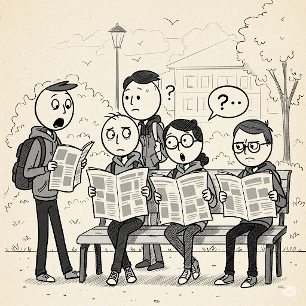
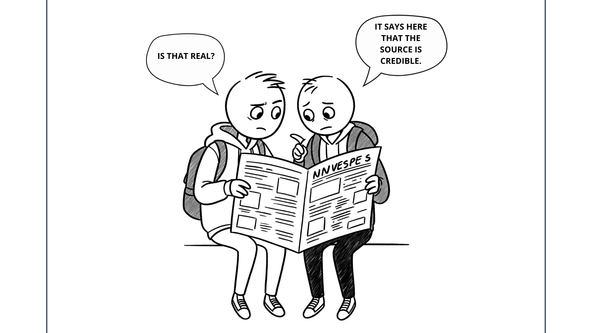
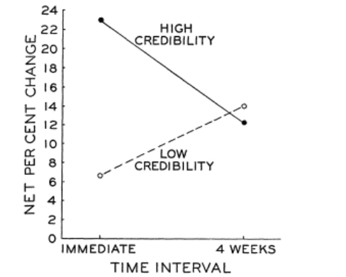

+++
title = 'Sleeper Effect - Cara Mendapatkan Kepercayaan dari Berita Palsu'
date = 2025-05-15T21:37:16+07:00
draft = false
description = "Kepercayaan merupakan komponen fundamental dalam membangun citra positif, baik bagi individu maupun produk. Dalam konteks branding dan pemasaran, kepercayaan berperan sebagai fondasi utama yang menentukan seberapa besar suatu merek atau pribadi mampu menarik perhatian, memengaruhi persepsi, dan membentuk loyalitas konsumen. Ketika suatu entitas dipercaya, maka publik akan lebih terbuka untuk mendengarkan pesan yang disampaikan, memberikan dukungan, bahkan melakukan tindakan seperti pembelian atau rekomendasi."
image = "1.webp"
imageBig= "1.webp"
categories= ["Insight Psychology"]
tags=["Manipulation"]
authors= ["Daddy Ananta"]
avatar="/images/profil.jpeg"
+++

Dari penjelasan sebelumnya, kita telah memahami bagaimana <a href="https://daddyananta.github.io/posts/aspek-psikologis-di-balik-ketertarikan-terhadap-seseorang-produk-atau-tokoh-politik/">Aspek Psikologis di Balik Ketertarikan</a> menunjukkan bahwa semakin sering seseorang, produk, atau tokoh muncul di hadapan kita, maka semakin besar kemungkinan kita untuk menyukainya. Fenomena ini dikenal sebagai efek paparan berulang (mere exposure effect), yaitu kecenderungan manusia untuk menyukai sesuatu yang familiar. 

Dalam konteks pemasaran ataupun politik, prinsip ini menjadi landasan penting bagi strategi branding, di mana frekuensi kemunculan suatu merek secara konsisten dapat membangun keakraban dan, pada akhirnya, meningkatkan kepercayaan serta preferensi konsumen terhadap merek ataupun tokoh politik.

Namun, pernahkah kita bertanya, bagaimana mungkin sesuatu yang pada awalnya diragukan justru bisa berubah menjadi sesuatu yang dipercaya?

## Sleeper Effect

  
  
 Carl Hovland  From <a href="https://view.genially.com/6509157d31b74200182a1818/presentation-carl-hovland">View.genially.com</a>

Penelitian terkait dengan Sleeper Effect bermula ketika Carl Hovland dan rekan-rekannya tertarik untuk mengetahui bagaimana media dapat memengaruhi opini masyarakat terhadap Perang Dunia II. Mereka kemudian melakukan penelitian eksperimental dengan melibatkan mahasiswa sebagai subjek.

### Gambaran Penelitian

  
  
 Sleeper Effect From Imagen 3

Dalam eksperimen tersebut, para partisipan diberikan artikel untuk dibaca, yang membahas empat topik berbeda yang bersifat kontroversial, yaitu: penggunaan obat antihistamin tanpa resep, kelayakan kapal selam bertenaga nuklir, penyebab kelangkaan baja, dan masa depan industri bioskop akibat munculnya televisi.

Pada bagian akhir artikel, disisipkan informasi mengenai sumber artikel yang dibagi ke dalam dua kategori, yaitu:

- Artikel ini berasal dari sumber (data) dengan kredibilitas tinggi (dianggap dapat dipercaya)

- Artikel ini berasal dari sumber (data) dengan kredibilitas rendah (dianggap tidak dapat dipercaya)

  
  
 Sleeper Effect Article From Imagen 3

Penelitian ini bertujuan untuk mengamati bagaimana tingkat kredibilitas sumber memengaruhi perubahan opini, baik dalam jangka pendek maupun jangka panjang. 

Kuesioner pun diberikan untuk mengukur opini mereka mengenai topik yang dibahas beserta pertanyaan apakah artikel ini merupakan fakta. Pemberian kuesioner dilakukan dalam 3 waktu yang berbeda 

- Sebelum menerima komunikasi
- Segera setelah menerima komunikasi, dan
- Empat minggu setelah menerima komunikasi.

### Hasil

Temuan awal menunjukkan bahwa saat diukur pertama kali, segera setelah peserta membaca artikel, pesan yang diatribusikan ke sumber dengan kredibilitas tinggi memang menghasilkan perubahan opini yang lebih besar dan signifikan ke arah yang dianjurkan. Artikel dari sumber yang dianggap terpercaya ini juga dinilai lebih "adil" dalam penyajiannya dan kesimpulannya dianggap lebih "dapat dibenarkan" oleh para peserta, terutama jika mereka sudah memiliki pandangan awal yang sejalan. 

  
  
 Sleeper Effect Article From Imagen 3

Sebaliknya, pesan yang sama namun berasal dari sumber yang dianggap berkredibilitas rendah kurang berhasil mengubah opini secara langsung dan seringkali dipandang dengan lebih skeptis.

Namun yang menarik, aspek kredibilitas sumber ternyata tidak berpengaruh signifikan terhadap kemampuan peserta dalam menyerap informasi faktual dari pesan yang disampaikan. Hasil penelitian menunjukkan bahwa tidak terdapat perbedaan yang berarti dalam jumlah informasi faktual yang dipelajari atau diingat oleh peserta, baik ketika mereka membaca artikel dari sumber yang dianggap berkredibilitas tinggi maupun dari sumber yang rendah kredibilitasnya.

Dengan kata lain, cara kita mempelajari dan memahami fakta dalam kedua jenis artikel tersebut sebenarnya relatif sama. Kita mungkin menerima fakta yang disampaikan dalam artikel, terlepas dari siapa yang menyampaikannya. Namun, ketika kita diberi tahu bahwa sumber informasi tersebut memiliki kredibilitas rendah, penilaian kita terhadap keseluruhan isi pesan menjadi bias. Akibatnya, meskipun informasi faktualnya dapat diterima, tingkat kepercayaan kita terhadap pesan secara keseluruhan menjadi menurun karena persepsi negatif terhadap sumbernya.

Ini mengindikasikan bahwa Kemampuan kita untuk mengingat fakta lebih banyak dipengaruhi oleh kemampuan belajar masing-masing individu daripada oleh tingkat kepercayaan kita pada sumber informasi tersebut.

Perkembangan paling mengejutkan muncul ketika opini peserta diukur kembali setelah jeda waktu empat minggu. Terjadilah fenomena yang kemudian dikenal sebagai "sleeper effect" atau efek penidur. Pesan yang berasal dari sumber berkredibilitas tinggi justru mengalami penurunan tingkat persetujuan seiring berjalannya waktu—seolah-olah pesan tersebut "tertidur" dalam alam bawah sadar dan perlahan kehilangan daya pengaruhnya.. Sebaliknya, pesan yang awalnya berasal dari sumber berkredibilitas rendah malah menunjukkan peningkatan dalam tingkat kesetujuan. 

  
  
 Journal Result From <a href="https://fbaum.unc.edu/teaching/articles/HovlandWeiss-POQ-1951.pdf" target="_blank" rel="noopener noreferrer">
    The Influence of Source Credibility on Communication Effectiveness
  </a>

Artinya, informasi yang awalnya kita abaikan karena sumbernya kurang meyakinkan, secara bertahap bisa jadi lebih persuasif. Para peneliti mengemukakan bahwa hal ini bisa terjadi karena seiring waktu, kita cenderung melupakan siapa sumber informasi tersebut, namun isi pesannya tetap teringat. Atau, pertahanan awal kita terhadap sumber yang tidak kredibel perlahan memudar, sementara argumen dalam pesan itu sendiri mulai meresap dan diterima. 

Fenomena ini menunjukkan betapa kompleksnya cara kita memproses informasi dan bagaimana opini kita dapat berubah secara dinamis, tidak hanya berdasarkan kesan awal terhadap kredibilitas sumber semata. 

Jika kita terus-menerus dipaparkan pada informasi melalui media atau iklan—meskipun pada awalnya kita merasa ragu atau tidak sepenuhnya percaya, perlahan-lahan pesan tersebut bisa terasa semakin masuk ke alam bawah sadar kita dan akhirnya lebih mudah diterima karena kita sudah familiar dengan itu. Ini memperkuat pemahaman bahwa kepercayaan dapat dibentuk bukan hanya oleh siapa yang berbicara, tetapi juga oleh seberapa sering dan bagaimana pesan itu disampaikan.

Di Indonesia, diskursus publik mengenai keaslian ijazah seorang mantan presiden telah menjadi perhatian luas, menyebar dengan cepat di berbagai platform, dan bahkan memicu diskusi di kalangan akademisi. Kontroversi ini dilaporkan bermula ketika individu yang diklaim memiliki keahlian di bidang forensik menyampaikan analisis atau pernyataan yang mempertanyakan validitas ijazah tersebut. Akibatnya, isu yang pada awalnya mungkin belum mendapat perhatian signifikan, kini telah berkembang menjadi topik perbincangan yang intensif di ruang publik.

  
  
 News From Media

Fenomena ini berpotensi mencerminkan mekanisme sleeper effect, di mana sebuah pesan yang mulanya kurang berpengaruh karena berasal dari sumber yang diragukan kredibilitasnya (dalam hal ini, "individu yang diklaim memiliki keahlian di bidang forensik"), justru mengalami peningkatan penerimaan atau setidaknya menjadi topik diskusi yang lebih luas seiring berjalannya waktu. 

Meskipun pada awalnya isu tersebut "mungkin belum mendapat perhatian signifikan" akibat keraguan terhadap sumbernya, lama-kelamaan publik bisa jadi melupakan atau mengurangi bobot penilaian terhadap sumber awal tersebut, dan lebih terfokus pada isi pesan itu sendiri—yakni pertanyaan mengenai validitas ijazah—sehingga isu tersebut kemudian "berkembang menjadi topik perbincangan yang intensif.

Bagaimana menurut Anda, apakah Anda percaya berita ini?

## Kesimpulan 

Dengan demikian, perjalanan sebuah informasi dari keraguan menuju penerimaan bisa saja dipengaruhi oleh dinamika psikologis yang kompleks seperti sleeper effect. Fenomena ini menggarisbawahi bagaimana pesan, bahkan yang berasal dari sumber yang awalnya diragukan, mampu mengendap dan secara bertahap meningkatkan daya persuasifnya seiring memudarnya ingatan kita akan kredibilitas sumber tersebut, sementara esensi pesannya tetap bertahan dipengaruhi oleh seberapa sering kita terpapar akan informasi itu sehingga membuat kepercayaan kita terbentuk.

Dalam lanskap informasi modern yang sarat dengan paparan berulang—di mana mere exposure effect juga turut berperan dalam membangun familiaritas—pemahaman akan sleeper effect menjadi penting. Ia mengingatkan kita bahwa kewaspadaan kritis tidak hanya diperlukan saat pertama kali menerima informasi, tetapi juga dalam mengevaluasi bagaimana informasi tersebut dapat bertransformasi dan memengaruhi persepsi kita dalam jangka panjang, seringkali di luar kesadaran penuh kita akan proses psikologis yang mendasarinya.

## Referensi

- 

  Jacoby, L. L., Kelley, C. M., Brown, J., & Jasechko, J. (1989). <strong>Becoming Famous Overnight: Limits on the Ability to Avoid Unconscious Influences of the Past</strong>. <i>Journal of Personality and Social Psychology, 56</i>(3), 326–338. <a href="https://www.uni-muenster.de/imperia/md/content/psyifp/aeechterhoff/wintersemester2011-12/seminarsozialekognitionundattribution/jacoby_famous-overnight_1989.pdf">PDF Journal</a>

- 

  Hovland, C. I., & Weiss, W. (1951). <strong>The Influence of Source Credibility on Communication Effectiveness</strong>. <i>Public Opinion Quarterly, 15</i>(4), 635–650. <a href="https://fbaum.unc.edu/teaching/articles/HovlandWeiss-POQ-1951.pdf">PDF Journal</a>

- 

  TopThink. (2025). <strong>The Sleeper Effect – How the Media Manipulates You</strong>.
  <a href="https://www.youtube.com/watch?v=rPcrvRuEv9k">Youtube</a>

