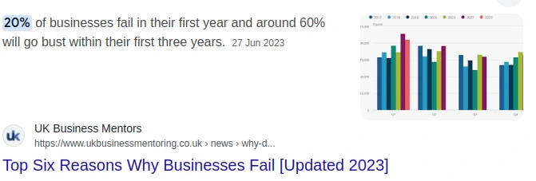
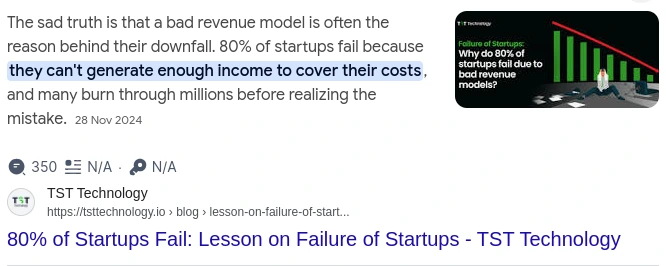
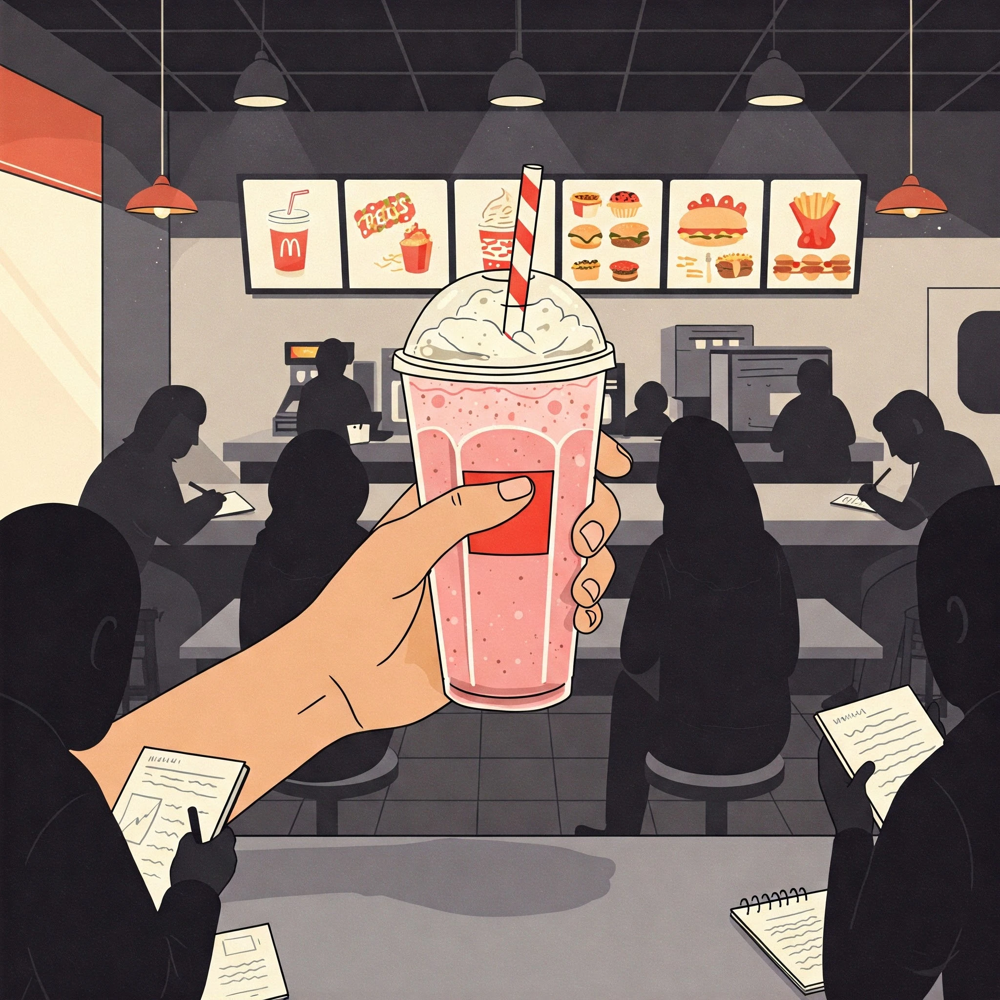
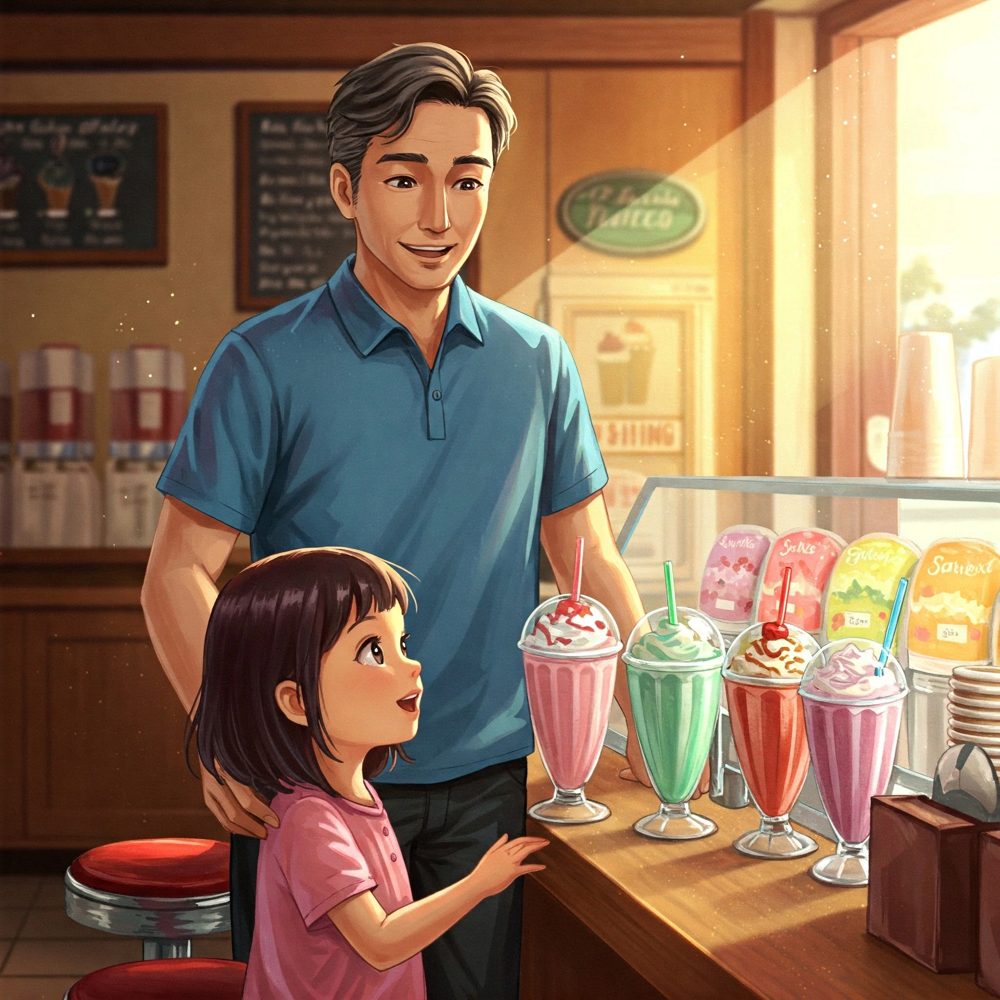
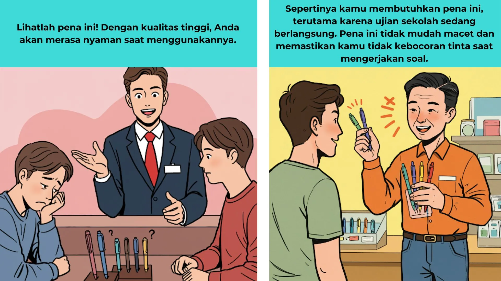

+++
title = 'Jobs to Be Done: Kunci Memahami Kebutuhan Pelanggan yang Sebenarnya'
date = 2025-03-24
draft = false
description = "Pernahkah kita menyadari betapa banyaknya perusahaan yang mengalami kegagalan dalam menjalankan usaha mereka di tahun pertama? Mungkin banyak dari kita cenderung berasumsi bahwa masalah yang menyebabkan kegagalan tersebut hanyalah faktor eksternal, seperti persaingan yang ketat atau kondisi ekonomi yang kurang mendukung. Namun, bukan itu masalah utamanya."
image = "1.webp"
imageBig= "1.webp"
categories= ["Marketing"]
tags=["Problem Solving"]
authors= ["Daddy Ananta"]
avatar="/images/profil.jpeg"
+++

## **Mengapa Begitu Banyak Bisnis Gagal? Jawabannya Bukan yang Anda Duga**

Pernahkah kita bertanya-tanya mengapa begitu banyak bisnis yang penuh semangat gagal di tahun pertama mereka? Statistik menunjukkan sekitar **20% bisnis baru tutup sebelum merayakan ulang tahun pertama mereka**. Mudah untuk menyalahkan faktor eksternal seperti persaingan ketat atau ekonomi yang lesu. Namun, akar masalahnya sering kali jauh lebih dalam dan tersembunyi di depan mata.

  
  
 Kegagalan seringkali berakar pada masalah internal, bukan hanya eksternal. Sumber: <a href="https://www.ukbusinessmentoring.co.uk/news/why-do-businesses-fail">ukbusinessmentoring.co.id</a>

Faktanya, banyak startup gagal bukan karena produk yang buruk, melainkan karena mereka menciptakan solusi untuk masalah yang tidak benar-benar ada. Mereka menghabiskan biaya besar untuk mengakuisisi pelanggan (*Customer Acquisition Cost* - CAC) yang ternyata tidak memberikan nilai seumur hidup (*Life Time Value* - LTV) yang sepadan (<a href="https://medium.com/@daddyananta/investment-or-waste-analyzing-customer-acquisition-costs-cac-vs-life-time-value-ltv-f7af3eedb328" target="_blank">selengkapnya</a>). Intinya, mereka gagal membuat sesuatu yang benar-benar **ingin dibeli** oleh orang-orang.

  
  
 Banyak startup gagal karena miskalkulasi antara biaya dan pendapatan. Sumber: <a href="https://tsttechnology.io/blog/lesson-on-failure-of-startups">TST Technology</a>

Ini membawa kita pada pertanyaan fundamental: **Produk seperti apa yang sebenarnya akan dibeli oleh konsumen?** Jawabannya terletak pada sebuah kerangka berpikir yang kuat: *Jobs to Be Done*.

## **Memahami *Jobs to Be Done* (JTBD)**

***Jobs to Be Done*** (Pekerjaan yang Harus Diselesaikan) adalah sebuah teori yang dipopulerkan oleh mendiang Clayton M. Christensen dalam bukunya, *Competing Against Luck*. Ide dasarnya sederhana namun revolusioner: **Pelanggan tidak membeli produk; mereka "mempekerjakan" produk untuk menyelesaikan "pekerjaan" tertentu dalam hidup mereka.**

Dengan memahami "pekerjaan" ini, bisnis dapat berhenti menebak-nebak dan mulai menciptakan solusi yang benar-benar dibutuhkan pelanggan.

## **Studi Kasus Klasik: Penjualan *Milkshake***

  
  
 Milkshakes From Imagen 3

Kisah paling terkenal untuk menjelaskan JTBD adalah saat Christensen ditugaskan untuk meningkatkan penjualan *milkshake* di sebuah restoran cepat saji. Timnya memulai dengan pendekatan tradisional: **segmentasi demografis** (usia, jenis kelamin, pendapatan). Hasilnya? Nihil. Tidak ada pola yang signifikan.

Frustrasi, mereka mengubah pendekatan. Mereka mulai mengobservasi dan bertanya, *"Pekerjaan" apa yang membuat Anda datang ke sini untuk "mempekerjakan" milkshake ini?*

Jawaban mengejutkan muncul. Ternyata ada dua "pekerjaan" yang sangat berbeda, tergantung pada waktu pembelian.

**1. "Pekerjaan" di Pagi Hari:**
Pelanggan pagi hari adalah para komuter yang menghadapi perjalanan panjang dan membosankan ke tempat kerja. Mereka "mempekerjakan" *milkshake* untuk:

- **Mengatasi kebosanan:** Sesuatu yang bisa diseruput perlahan selama perjalanan.
- **Menjadi sarapan praktis:** Lebih tahan lama dari pisang dan tidak membuat tangan lengket seperti donat.

**2. "Pekerjaan" di Sore Hari:**
Pelanggan sore hari adalah orang tua bersama anak-anak mereka. Mereka "mempekerjakan" *milkshake* untuk:

- **Menjadi orang tua yang baik:** Memberikan hadiah kecil setelah seharian beraktivitas.
- **Menciptakan momen kebersamaan:** Sebuah cara mudah untuk mengatakan "Aku sayang kamu" kepada anak mereka.

Berdasarkan wawasan ini, solusinya menjadi jelas dan spesifik:

### **Solusi untuk Segmen Pagi Hari**

  
  
 Milkshakes From Imagen 3

- **Buat lebih kental** agar lebih lama habis.
- **Tambahkan potongan buah kecil** untuk memberikan elemen kejutan dan tekstur.
- **Sediakan layanan pembayaran cepat** agar tidak membuang waktu komuter.

### **Solusi untuk Segmen Sore Hari**

  
  
 Milkshakes From Imagen 3

- **Sediakan ukuran yang lebih kecil dan lebih encer** agar cepat habis dan tidak terlalu mengenyangkan bagi anak-anak.

Jika restoran hanya fokus pada atribut produk ("buat lebih manis" atau "lebih murah"), mereka akan gagal total karena tidak memahami konteks dan "pekerjaan" yang sebenarnya.

## **JTBD di Industri Lain: Lebih dari Sekadar Milkshake**

Teori ini berlaku di mana saja.
* **Perangkat Lunak (Contoh: Intercom):** Pelanggan tidak "membeli" *chat widget*. Mereka "mempekerjakan" Intercom untuk **"membangun hubungan personal dengan pelanggan dalam skala besar."**
* **Produk Konsumen (Contoh: Snickers):** Anda tidak "membeli" sebatang cokelat. Anda "mempekerjakan" Snickers untuk **"mengatasi rasa lapar dan marah dengan cepat di sela-sela kesibukan."** Kampanye "Lo Laper? Lo Baper!" adalah murni pemikiran JTBD.

## **Menerapkan JTBD: Dari Teori ke Praktik**

Bagaimana Anda bisa mulai menerapkan kerangka ini?
1.  **Fokus pada Konteks, Bukan Atribut:** Berhentilah bertanya, "Fitur apa yang diinginkan pelanggan?" Mulailah bertanya, **"Kemajuan apa yang coba dicapai pelanggan dalam hidup mereka?"**
2.  **Lakukan Wawancara JTBD:** Ajak bicara pelanggan Anda. Tanyakan tentang "perjuangan" yang membuat mereka mencari solusi. Pertanyaan kunci: *"Ceritakan saat pertama kali Anda berpikir butuh solusi untuk [masalah]... Apa yang sedang terjadi saat itu?"*
3.  **Identifikasi Pesaing Sebenarnya:** Pesaing *milkshake* di pagi hari bukanlah *milkshake* merek lain, melainkan pisang, donat, kebosanan, dan bahkan kopi. Pesaing produk Anda mungkin bukan yang Anda kira.
4.  **Inovasi di Sekitar "Pekerjaan":** Gunakan pemahaman mendalam tentang "pekerjaan" pelanggan untuk memandu pengembangan produk, pemasaran, dan seluruh pengalaman pelanggan Anda.

  
  
 Fokus pada Solusi From Imagen 3

## **Kesimpulan**

Pada akhirnya, pelanggan tidak peduli dengan produk Anda, mereka peduli dengan masalah mereka sendiri. Dengan beralih dari pola pikir "membangun fitur" ke "menyelesaikan pekerjaan", kita membuka pintu menuju inovasi yang bermakna dan bisnis yang berkelanjutan.

  
"Pelanggan jarang membeli apa yang menurut perusahaan sedang mereka jual."

  
- Peter Drucker

Berhentilah menjual bor; mulailah menjual lubang di dinding yang rapi. Itulah inti dari *Jobs to Be Done*.

# **Referensi**

- 
Clayton M. Christensen - Competing Against Luck : The Story of Innovation and Customer Choice - <a href="https://books.google.co.id/books/about/Competing_Against_Luck.html?id=zGd_CwAAQBAJ&redir_esc=y">Books.google.co.id/</a>

