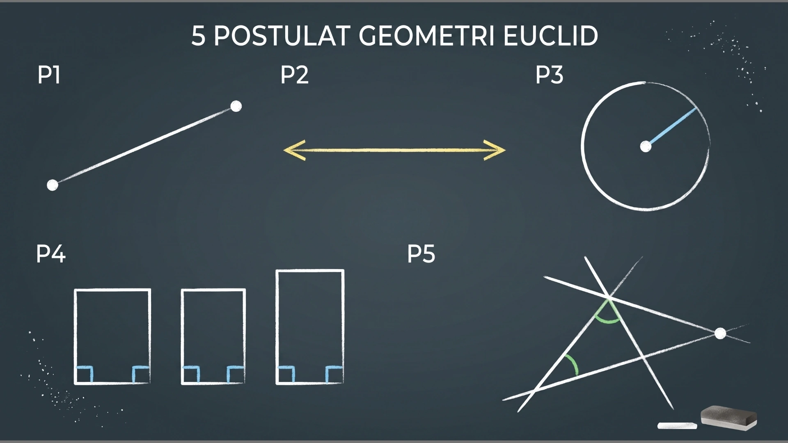
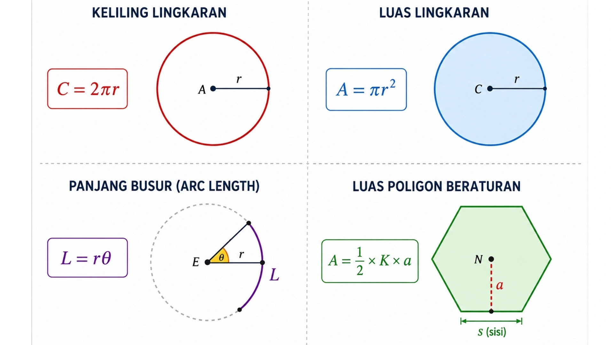
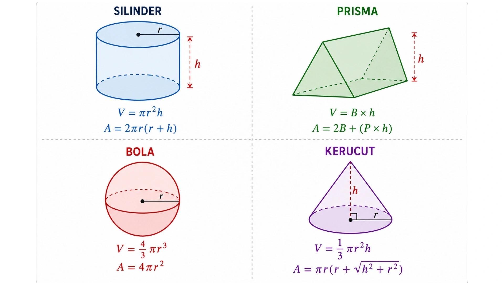

+++
title = "Geometri Euclidean: Rahasia Presisi Desain Teknik & Manufaktur"
date = 2026-08-12T10:12:49+07:00
draft = false
description = "Kuasai fondasi Geometri Euclidean! Pelajari aksioma, perhitungan ruang, dan aplikasinya dalam CAD, manufaktur presisi, hingga sistem navigasi modern."
image = "euclidean-geometry.webp"
images = ["euclidean-geometry.webp"]
categories = ["Math"]
tags = ["Computational Geometry", "Euclidean Space"]
socialshare = true
concept = "Euclidean Geometry"
slug = "euclidean-geometry"
+++

Sekitar abad ke-3 Sebelum Masehi, seorang matematikawan bernama Euclid menyusun sebuah buku berjudul _The Elements_ di kota Alexandria. Buku ini bukan sekadar catatan matematika kuno, melainkan fondasi penting bagi kemajuan teknologi rancang bangun kita saat ini. Berbagai bangunan dan benda fisik yang Anda temui setiap hari berakar langsung dari prinsip matematika tersebut.

Mulai dari proses merancang gedung pencakar langit hingga pengaturan tingkat kepresisian pada mesin pembuat komponen di pabrik otomatis, semuanya sangat bergantung pada perhitungan ruang ini. Geometri _Euclidean_ memastikan agar gambar rancangan yang ada di layar komputer bisa dicetak atau dibangun menjadi benda nyata dengan ukuran yang sangat akurat. Cara pengukuran ini terbukti sangat tangguh dan terus digunakan untuk memecahkan berbagai masalah di lapangan hingga detik ini.

Di dunia industri masa kini, perhitungan geometri ala Euclid ini bahkan menjadi acuan standar internasional dalam sistem perancangan produk berbantuan komputer. Standar baku yang mulai diresmikan secara global pada tahun 1994 ini, memastikan bahwa desain sebuah benda bisa saling dibaca dan diproduksi tanpa melenceng ukurannya di hampir seluruh aplikasi desain yang ada di dunia.

## Dasar Aksioma Geometri Euclidean: Aturan Dasar dan Postulat

Geometri Euclidean adalah cabang matematika yang khusus mempelajari bentuk, ukuran, dan pergerakan pada permukaan datar (dua dimensi) maupun bangun ruang (tiga dimensi). Konsep ini sebenarnya sudah familier sejak Anda duduk di bangku sekolah. Praktiknya terlihat saat Anda menggambar garis lurus, menghitung keliling lingkaran, atau mengukur volume sebuah kubus.

Logika matematika ini berdiri di atas aturan yang pasti. Sistemnya menggunakan dua kelompok pernyataan utama, yaitu _common notions_ (kesepakatan umum) dan _postulates_ (postulat geometri). Buku sejarah _Euclid's Elements_ mencatat 23 definisi, lima _postulates_, dan lima _common notions_. Ketiga komponen ini membentuk dasar kuat untuk semua jenis perhitungan bangun datar dan ruang.

Aturan dasar tersebut membantu para insinyur merumuskan perhitungan terapan yang masuk akal dan terbukti akurat di lapangan. Saat ini, berbagai perangkat lunak desain struktur mampu menggambar otomatis dengan tingkat presisi tinggi karena selalu berpedoman pada prinsip geometri Euclid.

### 5 _Common Notions_ Euclid

_Common notions_ adalah aturan logika umum yang berlaku untuk semua jenis besaran ukuran, seperti garis, sudut, bidang datar, dan bangun ruang. Kelima kesepakatan ini menjadi landasan dasar dalam setiap proses berpikir saat menghitung ruang (pelajari lebih lanjut melalui [ulasan Clark](http://math.clarku.edu/%7Edjoyce/java/elements/bookI/cn.html%25)).

| **No.** | **Common Notion (Kesepakatan Umum)** | **Penjelasan Sederhana** | **Contoh Penerapan di Dunia Nyata** |
| --- | --- | --- | --- |
| 1 | _Things which equal the same thing also equal one another._ | Jika A = B dan B = C, maka A = C. | **Menyamakan ukuran barang:** Jika ukuran Meja X sama dengan standar pabrik, dan ukuran Meja Y juga sama dengan standar pabrik, maka Meja X pasti sama besar dengan Meja Y. |
| 2 | _If equals are added to equals, then the wholes are equal._ | Jika A = B dan C = D, maka A + C = B + D. | **Menimbang beban:** Jika berat dua kotak di sisi kiri sama dengan dua kotak di sisi kanan, maka saat dijumlahkan, total berat kedua sisinya pasti setara. |
| 3 | _If equals are subtracted from equals, then the remainders are equal._ | Jika A = B dan C = D, maka A - C = B - D. | **Memotong bahan bangunan:** Jika Anda memiliki dua papan kayu yang sama panjang, lalu keduanya dipotong dengan ukuran yang sama, maka sisa kayu keduanya pasti tetap sama panjang. |
| 4 | _Things which coincide with one another equal one another._ | Jika dua bangun dapat saling menutupi dengan sempurna saat ditumpuk, maka keduanya sama besar. | **Mengecek cetakan barang:** Dua buah cetakan kue atau bata dapat disebut identik ukurannya jika saat ditumpuk, keduanya menutupi satu sama lain tanpa ada sisa yang menonjol. |
| 5 | _The whole is greater than the part._ | Keseluruhan pasti selalu lebih besar daripada bagian-bagian pecahannya. | **Merencanakan anggaran belanja:** Total biaya untuk membangun sebuah rumah pasti selalu lebih besar daripada harga satuan bahan-bahannya (seperti semen atau paku saja). |

### 5 Postulat Utama Euclid

Selain kesepakatan umum, sistem Euclid memiliki lima postulat utama yang berkaitan langsung dengan penerapan nyata di lapangan (baca [catatan utuhnya](https://mathcs.holycross.edu/~little/MathThroughTime/EucAxPos.pdf#1#1) untuk melihat detailnya).

| **Nama Postulat**                 | **Penjelasan Sederhana**                                                                                                                                                                                           | **Contoh Penerapan di Dunia Nyata**                                                                                                                                                                                          |
| --------------------------------- | ------------------------------------------------------------------------------------------------------------------------------------------------------------------------------------------------------------------ | ---------------------------------------------------------------------------------------------------------------------------------------------------------------------------------------------------------------------------- |
| Postulat 1                        | Sebuah garis lurus (_straight line_) bisa Anda tarik untuk menghubungkan dua titik mana pun.                                                                                                                       | Menjadi instruksi dasar bagi aplikasi komputer saat menggambar garis penghubung antar-dinding berdasarkan [referensi Purdue](https://www.math.purdue.edu/~goldberg/Math460/Euclid-BKI.pdf#1#1) ketika mendesain denah rumah. |
| Postulat 2                        | Sebuah segmen garis lurus yang terbatas ukurannya (_finite straight line_) bisa terus diperpanjang menjadi garis yang tidak terbatas.                                                                              | Mengaktifkan fitur perpanjangan garis pada aplikasi desain komputer, misalnya saat Anda perlu memperluas jangkauan denah letak pipa air di rumah.                                                                            |
| Postulat 3                        | Sebuah lingkaran (_circle_) bisa Anda gambar dari titik pusat mana saja dengan ukuran jari-jari berapa pun.                                                                                                        | Membantu pabrik atau insinyur merancang bentuk komponen bundar yang presisi, seperti roda kendaraan, gir, atau poros penggerak mesin.                                                                                        |
| Postulat 4                        | Semua sudut siku-siku (_right angles_) pasti sama besar dan bentuknya persis (kongruen) satu sama lain.                                                                                                            | Memastikan fondasi, tiang penyangga, atau dinding rumah berdiri tegak lurus pada sudut 90 derajat agar bangunannya tidak miring atau rubuh.                                                                                  |
| Postulat 5 (_Parallel Postulate_) | Jika ada dua garis dipotong oleh satu garis lain, dan sudut di bagian dalamnya kurang dari sudut siku-siku (di bawah 90 derajat), kedua garis itu pasti akan bertabrakan pada suatu titik jika terus diperpanjang. | Bermanfaat sebagai acuan rumus saat merancang jalan tol atau rel kereta raya agar kedua belah sisinya tetap sejajar konstan dan tidak saling menabrak.                                                                       |

## Elemen Dasar Geometri Euclidean

Semua wujud benda fisik dan gambar rancangan di sekitar kita bermula dari elemen geometri dasar. Komponen-komponen ini ibarat "batu bata" pertama yang menyusun segala jenis bentuk bangunan atau barang.

### Unsur Dasar Pembentuk Bangun

Setiap unsur dasar geometri memiliki sifat dan batasannya masing-masing. Memahami sifat dasar ini akan sangat membantu kita saat menggambar atau menciptakan benda nyata agar ukurannya pas dan tidak melenceng.

<!-- 1. LOAD LIBRARY JSXGRAPH HANYA SATU KALI DI SINI -->
<link rel="stylesheet" type="text/css" href="https://cdn.jsdelivr.net/npm/jsxgraph/distrib/jsxgraph.css"/>

<!-- GRAFIK 1 -->

    

- **Titik (_Point_):**
  - **Definisi:** Sebuah penanda posisi atau lokasi yang pasti. Euclid menyebut _point_ sebagai sesuatu yang tidak bisa dibagi lagi.
  - **Sifat Utama:** Titik sama sekali tidak memiliki ukuran panjang, lebar, maupun ketebalan.
  - **Penulisan _Cartesian_:** Ditulis dengan titik koordinat angka, misalnya $(x, y, z)$.
  - **Fungsi Sehari-hari:** Berfungsi sebagai penanda ujung, pojokan, atau titik awal saat Anda mulai menggambar sebuah pola.
        
- **Garis (_Line_):**
  - **Definisi:** Kumpulan titik-titik berjejer yang membentuk kurva lurus. Euclid menyebutnya sebagai "ukuran panjang tanpa lebar".
  - **Sifat Utama:** Hanya memiliki ukuran panjang, tanpa ketebalan atau luas.
  - **Penulisan _Cartesian_:** Memiliki persamaan matematika seperti $Ax + By + C = 0$.
  - **Fungsi Sehari-hari:** Digunakan untuk menggambar rusuk bangunan, batas pinggir tembok, atau arah jalan raya.
        
- **Sudut (_Angle_):**
  - **Definisi:** Ruang kemiringan yang terbentuk ketika dua garis lurus bertemu di satu titik ujung yang sama.
  - **Sifat Utama:** Diukur menggunakan satuan derajat (misalnya $90^\circ$ atau $45^\circ$).
  - **Penulisan _Cartesian_:** Dihitung dari nilai kemiringan antara dua arah garis.
  - **Fungsi Sehari-hari:** Sangat penting untuk mengukur kemiringan atap rumah agar air hujan turun dengan lancar, atau memastikan bingkai jendela benar-benar siku.
        
- **Bidang (_Plane_):**
  - **Definisi:** Permukaan datar luas yang membentang tanpa batas ke segala arah. 
  - **Sifat Utama:** Memiliki ukuran panjang dan lebar, sehingga bisa menampung bentuk datar seperti persegi atau segitiga.
  - **Penulisan _Cartesian_:** Dikenali lewat persamaan ruang seperti $Ax + By + Cz + D = 0$.
  - **Fungsi Sehari-hari:** Berfungsi layaknya selembar kertas kosong berukuran tak terhingga yang siap Anda gunakan untuk menggambar denah.

### Klasifikasi Dimensi: Geometri Datar vs Geometri Ruang

Saat mulai berhitung, kita harus membedakan antara benda yang hanya berupa gambar datar (dua dimensi) dan benda nyata yang memiliki ruang atau isi (tiga dimensi). Keduanya membutuhkan cara hitung yang berbeda.

| **Aspek Penilaian**   | **Geometri Datar (_Plane Geometry_ / 2D)**                         | **Geometri Ruang (_Solid Geometry_ / 3D)**                                      |
| --------------------- | ------------------------------------------------------------------ | ------------------------------------------------------------------------------- |
| **Batas Ruang**       | Hanya memiliki panjang dan lebar (bekerja pada sumbu $X$ dan $Y$). | Memiliki panjang, lebar, dan ketebalan/tinggi (mencakup sumbu $X, Y$, dan $Z$). |
| **Fokus Hitungan**    | Menghitung luas permukaan luar dan keliling garis pinggirnya.      | Menghitung volume (isi ruang di dalamnya) dan total luas kulit luarnya.         |
| **Contoh Penggunaan** | Menggambar denah tata letak kamar pada selembar kertas.            | Menghitung seberapa banyak air yang dibutuhkan untuk memenuhi sebuah bak mandi. |
| **Contoh di Pabrik**  | Memotong lembaran tripleks datar, kertas, atau pelat besi.         | Mencetak blok batako tebal atau membuat tabung gas berbentuk silinder.          |

## Teorema Inti dan Metode Perhitungan dalam Geometri Euclidean

Keakuratan saat membuat benda nyata sangat bergantung pada teori geometri. Teori-teori ini membantu kita mengubah gambaran desain dari sekadar coretan di kertas menjadi ukuran angka pasti yang siap dibangun atau dibuat.

### 1. Geometri Segitiga: Ukuran, Kemiripan, dan Teorema Pythagoras

Ilmu tentang segitiga adalah kunci utama untuk menghitung kekuatan struktur yang bersudut. Anda akan sering menggunakan konsep ini untuk memastikan suatu benda berdiri kokoh dan tidak miring.

<!-- GRAFIK 2 -->

    

- **Kekongruenan (_Congruence_):** Dua buah segitiga disebut kongruen (identik) jika bentuk dan ukurannya sama persis. Syaratnya, panjang semua sisinya harus sama ($s_1 = s_2$) dan sudut kemiringannya setara ($\theta_1 = \theta_2$). 
  - **Contoh Sehari-hari:** Memastikan kaki kiri dan kanan pada sebuah tangga lipat memiliki ukuran yang sama persis agar tidak goyang saat dinaiki.
- **Kesebangunan (_Similarity_):** Konsep ini berlaku untuk dua benda yang bentuk dan sudutnya sama, tetapi ukurannya berbeda (satu besar, satu kecil). Perbandingan ukurannya ditulis dengan rasio $\frac{a}{x} = \frac{b}{y} = \frac{c}{z}$. 
  - **Contoh Sehari-hari:** Sangat berguna saat membuat miniatur mainan mobil dari ukuran mobil aslinya. Ukuran dikecilkan, tetapi proporsi bentuknya tetap sama.
- **Teorema Pythagoras (_Pythagorean Theorem_):** Aturan ini menyatakan bahwa pada segitiga siku-siku, kuadrat sisi miringnya sama dengan jumlah kuadrat dua sisi lainnya. Rumusnya adalah $c^2 = a^2 + b^2$, di mana $c$ adalah sisi miring, sedangkan $a$ dan $b$ adalah sisi tegak dan mendatarnya.
  - **Contoh Sehari-hari:** Menghitung seberapa panjang kayu yang dibutuhkan untuk menopang bagian miring pada rangka atap rumah.

### 2. Lingkaran dan Poligon Beraturan: Hitungan Benda Melingkar

Bentuk bundar dan melingkar sangat banyak ditemukan di sekitar kita. Anda perlu menghitung ukurannya secara teliti agar benda tersebut pas saat dipasang.

- **Keliling Lingkaran (_Circumference_):** Dihitung menggunakan rumus $C = 2\pi r$. 
  - **Contoh Sehari-hari:** Menentukan panjang karet gelang atau pelat seng yang dibutuhkan untuk mengelilingi sebuah drum air.
- **Luas Lingkaran (_Area of Circle_):** Menggunakan rumus $A = \pi r^2$. 
  - **Contoh Sehari-hari:** Menghitung seberapa lebar taplak kain yang dibutuhkan untuk menutupi seluruh permukaan meja makan bundar.
- **Panjang Busur (_Arc Length_):** Dihitung dengan rumus $L = r\theta$. 
  - **Contoh Sehari-hari:** Mengukur panjang pinggiran potongan piza, atau menghitung seberapa panjang besi melengkung untuk membuat lengkungan pada pagar.
- **Luas Poligon Beraturan (_Area of Regular Polygon_):** Poligon adalah bangun datar bersudut banyak yang sisinya sama panjang (seperti segi enam). Rumusnya adalah $A = \frac{n}{4} s^2 \cot\left(\frac{\pi}{n}\right)$. 
  - **Contoh Sehari-hari:** Menghitung luas ubin berbentuk segi enam (heksagonal) yang dibutuhkan untuk menutupi lantai teras.
  
### 3. Geometri Ruang: Bangun Ruang dan Perhitungan Volume (Isi)

Membangun sesuatu di dunia nyata pasti melibatkan benda berbentuk tiga dimensi yang memiliki isi (volume) dan luas kulit luar (luas permukaan). Bentuk benda sangat menentukan seberapa banyak bahan baku yang dibutuhkan.

| **Bangun Ruang**          | **Rumus Volume ($V$) & Luas Permukaan ($A$)**                                                   | **Contoh Penggunaan Sehari-hari**                                                                                                                           |
| ------------------------- | ----------------------------------------------------------------------------------------------- | ----------------------------------------------------------------------------------------------------------------------------------------------------------- |
| **Silinder (_Cylinder_)** | **Volume:** $V = \pi r^2 h$ **Luas Permukaan:** $A = 2\pi r(r + h)$                          | Menghitung berapa liter air yang bisa ditampung dalam toren air (volume), dan berapa banyak cat untuk mengecat bagian luar toren tersebut (luas permukaan). |
| **Prisma (_Prism_)**      | **Volume:** $V = B \times h$ **Luas Permukaan:** $A = 2B + (P \times h)$                     | Menghitung jumlah adukan semen yang dibutuhkan untuk membuat tiang beton berbentuk balok tinggi.                                                            |
| **Bola (_Sphere_)**       | **Volume:** $V = \frac{4}{3}\pi r^3$ **Luas Permukaan:** $A = 4\pi r^2$                      | Menghitung banyaknya udara yang dibutuhkan untuk memompa bola basket hingga penuh, atau bahan kulit sintetik untuk membuat bola tersebut.                   |
| **Kerucut (_Cone_)**      | **Volume:** $V = \frac{1}{3}\pi r^2 h$ **Luas Permukaan:** $A = \pi r(r + \sqrt{h^2 + r^2})$ | Mengukur seberapa banyak es krim yang bisa dimasukkan ke dalam _cone_ renyah berbentuk kerucut, atau kertas yang dibutuhkan untuk membuat topi ulang tahun. |
## Perbandingan Geometri Euclidean dan Non-Euclidean

Saat merancang atau membangun sesuatu, kita perlu tahu batas kemampuan perhitungan Euclidean. Jika kita hanya mengukur tanah untuk membuat rumah, aturan Euclidean sangat cocok. Namun, jika ukurannya sudah seluas samudra atau benua (di mana permukaan bumi sebenarnya melengkung), kita harus beralih ke geometri Non-Euclidean agar perhitungan jaraknya tidak meleset.

Berikut adalah perbedaan mendasar antara keduanya:

| **Aspek Perbandingan**   | **Geometri Euclidean**                                                                                                                                 | **Geometri Non-Euclidean (Eliptik & Hiperbolik)**                                                                                                                                                                                                                          |
| ------------------------ | ------------------------------------------------------------------------------------------------------------------------------------------------------ | -------------------------------------------------------------------------------------------------------------------------------------------------------------------------------------------------------------------------------------------------------------------------- |
| **Garis Sejajar**        | Hanya ada satu garis sejajar yang bisa ditarik, seperti penjelasan [ulasan Wolfram](https://mathworld.wolfram.com/ParallelPostulate.html).             | Pada model eliptik, sama sekali tidak ada garis sejajar. Pada model hiperbolik, jumlahnya tak terhingga ([teori eliptik](https://mathworld.wolfram.com/EllipticGeometry.html) dan [teori hiperbolik](https://mathworld.wolfram.com/HyperbolicGeometry.html#inbox/_blank)). |
| **Bentuk Permukaan**     | Hanya berlaku pada permukaan datar sempurna, ibarat menggambar di atas selembar kertas tegang.                                                         | Berlaku pada permukaan melengkung. Bisa berupa lengkungan luar seperti bola (eliptik), atau lengkungan ke dalam seperti sadel sepeda (hiperbolik).                                                                                                                         |
| **Total Sudut Segitiga** | Jika ketiga sudut segitiganya dijumlahkan, hasilnya pasti pas 180 derajat (baca [artikel Wikipedia](https://en.wikipedia.org/wiki/Angle_sum_theorem)). | Pada bentuk bola, totalnya pasti lebih dari 180 derajat. Pada bentuk sadel, totalnya kurang dari 180 derajat (merujuk [catatan Britannica](https://www.britannica.com/science/Riemannian-geometry#ref1)).                                                                  |
| **Contoh Penggunaan**    | Membangun rumah, merancang perabotan, memotong kayu, atau merancang letak mesin di dalam pabrik.                                                       | Menentukan rute pesawat terbang antarnegara, sistem navigasi GPS di ponsel Anda, dan pemetaan satelit.                                                                                                                                                                     |
Berikut adalah hasil penyempurnaan artikel Anda. Teks telah disesuaikan dengan gaya bahasa B2B yang lugas, profesional, dan aktif, serta mematuhi seluruh pedoman penulisan tanda baca dan istilah teknis.

## Penerapan Geometri Euclidean di Berbagai Bidang

Aturan Geometri Euclidean tidak hanya sebatas rumus di atas kertas. Konsep dasar ini sangat berguna di berbagai bidang pekerjaan, mulai dari membangun rumah, merancang mesin, hingga memprogram robot cerdas. Berikut adalah beberapa contoh nyata penerapannya dalam kehidupan kita:

### 1. Teknik Sipil dan Pembangunan Fisik
Dalam dunia konstruksi, geometri membantu para ahli memastikan bentuk bangunan tetap stabil, lurus, dan aman dari gaya tarik bumi.

- **Mencegah longsor:** Menggunakan rumus Pythagoras dan sudut segitiga untuk menghitung kemiringan tanah galian yang paling aman.
- **Mengukur luas tanah:** Menghitung luas wilayah daratan yang sangat lebar dengan cara memecah peta menjadi bentuk segitiga-segitiga kecil yang akurat.
- **Meratakan jalan tol:** Menghitung secara pasti berapa volume gundukan tanah yang harus digali dan seberapa banyak tanah yang dibutuhkan untuk menimbun jurang.
- **Merancang tikungan aman:** Menggunakan hitungan busur lingkaran untuk membuat lengkungan jalan raya yang mulus agar pandangan sopir tetap jelas.
- **Pengecekan kualitas:** Memastikan balok-balok beton yang dicetak di pabrik memiliki ukuran yang sama persis (kongruen) sebelum dipasang oleh alat berat.

### 2. Pabrik dan Pembuatan Mesin (Manufaktur)
Di dalam pabrik modern yang serba otomatis, geometri adalah "otak" yang mengarahkan pergerakan mesin pembuat barang.

- **Batas cetakan benda:** Membantu aplikasi komputer mengenali batasan bentuk sebuah benda sebelum dicetak menjadi barang tiga dimensi.
- **Mengarahkan mata bor:** Membantu mesin bor atau pemotong besi otomatis bergerak ke arah yang tepat secara presisi.
- **Tata letak pabrik:** Menghitung jarak antar-mesin agar ruang kerja di pabrik lebih lega, aman, dan efisien.
- **Suku cadang pesawat:** Memastikan besi dan komponen pesawat terbang benar-benar lurus, rata, dan presisi agar aman saat mengudara.
- **Pengecekan hasil akhir:** Memindai barang yang sudah selesai dibuat menggunakan sensor, lalu mencocokkannya kembali dengan ukuran gambar desain aslinya.

### 3. Arsitektur dan Tata Bangunan
Geometri membantu arsitek membuat gedung yang tidak hanya sedap dipandang, tetapi juga seimbang dan mampu menahan beban dengan baik.

- **Jarak tiang penyangga:** Menentukan jarak antartiang penyangga (kolom) gedung agar beban berat atap terbagi secara merata.
- **Pemasangan kaca gedung:** Mengatur pola pemasangan kaca pada bagian luar gedung pencakar langit agar terlihat simetris dan rapi.
- **Pengecoran lantai:** Menghitung luas lantai dengan akurat agar jumlah semen yang diaduk tidak kurang dan tidak terbuang percuma.
- **Kubah anti-bising:** Merancang bentuk atap melengkung pada gedung pertemuan agar pantulan suara (gema) terdengar merata dan tidak bising.
- **Membangun bentuk tiga dimensi:** Mengubah gambar sketsa denah di atas kertas menjadi model ruang bangunan nyata agar mudah dipahami oleh tukang.

### 4. Navigasi, Peta Digital, dan GPS
Meskipun bumi kita aslinya melengkung, sistem navigasi jarak dekat (seperti di dalam kota) tetap mengandalkan hitungan geometri datar yang cepat dan akurat.

- **Menentukan lokasi HP Anda:** Membantu sistem GPS memperkirakan posisi Anda berdasarkan jarak pantulan sinyal dari beberapa satelit sekaligus.
- **Jarak ke menara sinyal:** Menghitung jarak garis lurus antara posisi ponsel Anda dengan menara sinyal seluler terdekat.
- **Rute ojek daring:** Digunakan oleh aplikasi peta digital untuk mencari jalan pintas atau rute terpendek saat Anda memesan makanan atau kendaraan.
- **Jalur aman bandara:** Membantu radar bandara mendeteksi jalur pendaratan yang berbentuk seperti corong agar terbebas dari halangan.
- **Garis batas wilayah:** Membuat garis batas zona kota atau wilayah di dalam peta digital (misalnya batas antara kecamatan A dan B).

### 5. Grafika Komputer, Permainan (_Game_), dan Robotika
Robot cerdas dan karakter di dalam permainan komputer bisa bergerak tanpa menabrak karena mereka menggunakan hitungan geometri untuk "melihat" benda di sekitarnya.

- **Kacamata realitas virtual (VR):** Menghitung arah pantulan cahaya di dalam dunia virtual agar gambar ruangan tiga dimensi terlihat sangat nyata.
- **Sistem tabrakan dalam permainan:** Memastikan mobil atau karakter yang Anda mainkan di layar komputer bisa membentur tembok, bukannya malah tembus.
- **Robot pengangkut barang:** Memandu robot pengangkut barang di gudang agar bisa berjalan dan berbelok dengan mulus tanpa menabrak rak penyimpanan.
- **Lengan robot pabrik:** Menghitung sudut tekukan sendi pada lengan robot perakit agar ujung capitnya bisa meraih barang dengan tepat tanpa meleset.
- **Uji kelancaran angin:** Memecah gambar desain bodi mobil menjadi ribuan segitiga kecil pada layar komputer, guna mengetes apakah bentuknya bisa membelah angin dengan lancar sebelum benar-benar diproduksi.

## Quiz

<strong>Quiz</strong>1 / 10

<button id="action" type="button" style="border:0;border-radius:9px;padding:11px 18px;background:#2563eb;color:#fff;font-size:15px;font-weight:600;cursor:pointer;display:none;">Periksa Jawaban</button>

## Pertanyaan yang Sering Diajukan (FAQ)

1. **Apa yang dimaksud dengan geometri Euclidean dan mengapa dinamai demikian?**  
   Geometri Euclidean adalah cabang ilmu matematika yang khusus mempelajari perhitungan bangun datar dan ruang berdasarkan rumusan dari matematikawan Yunani kuno bernama Euclid. Nama ini digunakan karena seluruh aturan dan perhitungan dasarnya diambil langsung dari buku legendaris karya Euclid yang berjudul _Elements_.

2. **Apa saja lima postulat utama dalam geometri Euclidean?**  
   Lima postulat (aturan dasar) Euclid mengatur tentang tata cara menarik garis lurus, memperpanjang garis, menggambar lingkaran yang presisi, kesetaraan bentuk sudut siku-siku, serta acuan tentang garis sejajar (_parallel postulate_). Kelima aturan dasar ini berfungsi sebagai fondasi hitungan yang logis dan masuk akal bagi semua pembuatan rancang bangun hingga hari ini.

3. **Apa perbedaan utama antara geometri Euclidean dan geometri non-Euclidean?**  
   Geometri Euclidean hanya berlaku pada permukaan yang datar sempurna, dengan patokan bahwa hanya ada satu garis sejajar yang bisa melewati suatu titik. Sebaliknya, geometri non-Euclidean digunakan khusus untuk permukaan yang melengkung (seperti bentuk bola atau sadel kuda). Karena permukaannya melengkung, aturan garis sejajarnya pun berubah agar bisa mengakomodasi kebutuhan yang lebih luas, seperti sistem navigasi satelit (GPS) dan pemetaan bentuk bumi yang sebenarnya.