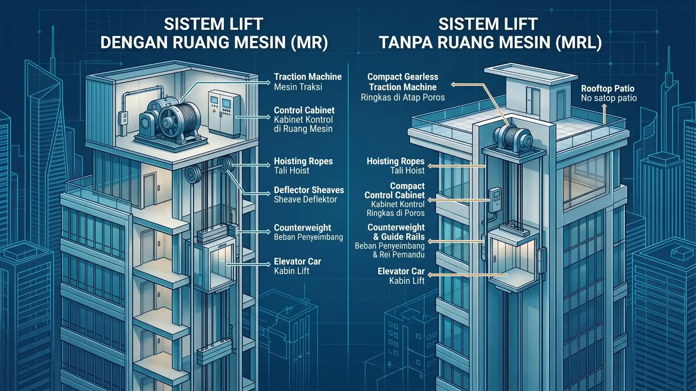
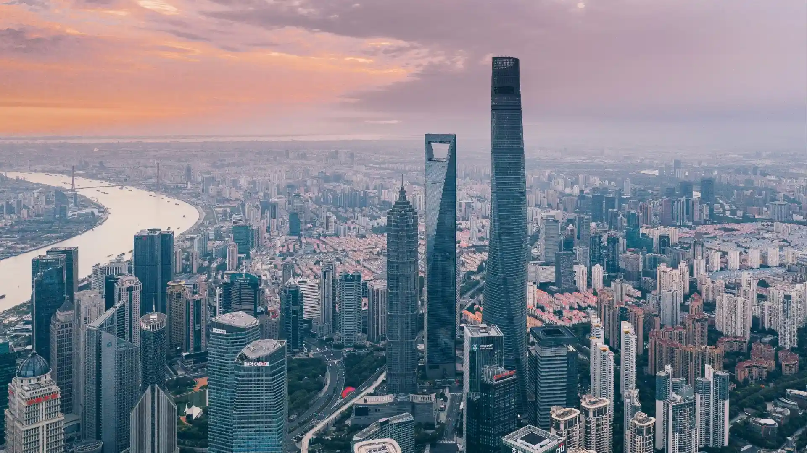
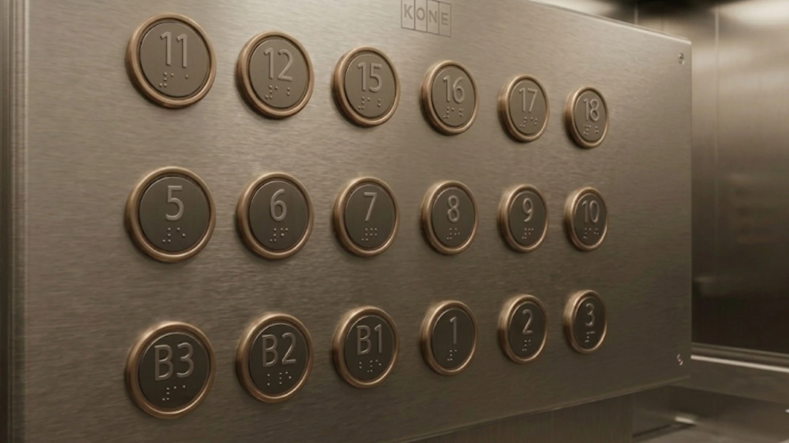

+++
title = "Elevator: Dari Kecepatan Cheetah Hingga Lift 3km!"
date = 2026-08-09T20:12:49+07:00
draft = false
description = "Temukan rahasia ekstrem elevator modern, dari lift berkecepatan 73 km/jam setara cheetah hingga lift terdalam di bumi. Wajib baca sebelum instalasi!"
image = "elevator.webp"
images = ["/posts/mechanical/elevator/elevator.webp"]
categories = ["Mechanical Engineering"]
tags = ["Vertical Transportation Dynamics", "Electromechanical Energy Conversion"]
socialshare = true
concept = "Elevator"
slug = "elevator"
+++

Sejarah elevator atau lift sebagai alat _vertical transportation_ (transportasi vertikal) berawal jauh sebelum kota-kota modern berdiri. Jejak rekayasa mekanis ini bisa kita temukan hingga ke zaman Yunani kuno. Archimedes, ahli matematika dan insinyur legendaris, dipercaya merancang prototipe sistem angkat mekanis pertama sekitar tahun 236 Sebelum Masehi. Menurut [catatan sejarah](https://www.history.com/articles/who-invented-the-elevator) karya Vitruvius, arsitek Romawi kuno, mesin awal ini beroperasi lewat tali yang melilit pada drum kayu.

Sistem purba tersebut bergerak murni mengandalkan [tarikan fisik](https://www.britannica.com/print/article/184491) dari manusia, hewan pekerja, atau aliran air. Mereka bertugas memutar kapstan dan katrol untuk mengangkat platform.

Selama ratusan tahun, perangkat ini hanya berfungsi sebagai mekanisme sederhana pengangkut barang. Inovasi keamanan modern baru muncul pada tahun 1854. Elisha Graves Otis mendemonstrasikan _safety brake_ (rem keselamatan) di ajang Crystal Palace Exhibition, New York. Dibantu promotor P.T. Barnum, Otis berdiri di atas platform lift dan meminta asistennya memotong tali penarik. 

Platform sempat turun beberapa inci sebelum _safety brake_ segera menghentikan lajunya. Otis menenangkan penonton yang terkejut dengan jaminan bahwa sistem tersebut aman. Faktanya, Otis sudah menjual unit lift pertamanya pada 1853, setahun sebelum pameran itu berlangsung.

Pada 23 Maret 1857, elevator khusus penumpang komersial pertama di dunia resmi beroperasi. Lift ini terpasang di E.V. Haughwout Building, pusat perbelanjaan lima lantai di New York. Mesin bertenaga _steam_ (uap) ini sanggup melesat naik lima lantai kurang dari satu menit dengan laju 40 kaki per menit. 

Kehadiran fasilitas ini adalah titik awal lahirnya kota vertikal. Inovasi tersebut mengubah total cara manusia hidup dan bekerja, serta membuka jalan bagi berdirinya gedung-gedung pencakar langit di seluruh dunia.

## Klasifikasi Elevator Berdasarkan Standar Industri dan Parameter Operasional

Memahami taksonomi teknis elevator adalah langkah awal sebelum Anda merancang sistem mekanis bangunan. Klasifikasi ini merujuk pada standar ISO 4190 yang mengatur dimensi dan instalasi mesin. Standar ini memisahkan ISO 4190 bagian 1 untuk kelas I, II, III, dan VI, lalu ISO 4190 bagian 2 untuk kelas IV.

### Berdasarkan Fungsi dan Kelas Layanan

- **Kelas I:** Kategori ini berisi _passenger elevator_ (lift penumpang) standar. Mesin ini biasa terpasang pada apartemen hunian dan gedung perkantoran. Anda bisa melihat [detail kelas](https://fr.ife-elevator.com/what-are-the-categories-of-elevators.html) ini lebih lanjut.
- **Kelas II:** Tipe ini melayani penumpang dan barang dengan ukuran kabin lebih luas. Desainnya optimal untuk pergerakan padat pada fasilitas publik. Contoh penerapannya ada di stasiun kereta dan pusat perbelanjaan.
- **Kelas III:** Lift ini khusus melayani bangunan kesehatan seperti rumah sakit atau klinik. Sistemnya wajib mengakomodasi akses _wheelchair_ (kursi roda) dan _stretcher_ (tandu medis). Aturan ini sesuai standar [fasilitas medis](https://www.boutique.afnor.org/en-gb/standard/fd-iso-41901/lift-us-elevator-installation-part-1-class-i-ii-iii-and-vi-lifts/fa046054/22800).
- **Kelas IV:** Kategori ini merujuk pada _freight elevator_ (lift barang). Produsen melengkapinya dengan struktur baja ekstra kuat untuk menahan beban berat. Fungsinya murni untuk kebutuhan logistik.
- **Kelas VI:** Unit ini khusus untuk frekuensi penggunaan tinggi. Mesinnya sanggup melayani lalu lintas vertikal padat dengan kecepatan di atas 2,5 meter per detik. Tipe ini cocok untuk gedung sibuk.

### Berdasarkan Kecepatan Operasional

Kecepatan elevator biasanya menyesuaikan dengan jumlah lantai dan tinggi bangunan. Insinyur sering memakai [panduan kecepatan](https://riel.ua/en/blogs/lifti-v-novobudovi) untuk menentukan spesifikasi yang tepat. Berikut adalah pembagian berdasarkan laju operasionalnya:

- **Kecepatan Rendah**  
  Lift ini melaju maksimal 1,0 meter per detik. Laju ini paling pas untuk bangunan berlantai sedikit. Gedung dengan 2 hingga 6 lantai biasa memakai spesifikasi ini.
- **Kecepatan Sedang**  
  Laju mesin berada di kisaran 1,0 hingga 2,0 meter per detik. Tipe ini ideal untuk _mid-rise building_ (bangunan menengah). Skala gedungnya berkisar antara 8 hingga 20 lantai.
- **Kecepatan Tinggi**  
  Mesin ini bergerak di rentang 2,0 hingga 4,0 meter per detik untuk _high-rise building_ (gedung pencakar langit). Bangunan dengan 20 hingga 40 lantai umumnya memakai standar ini. Industri mematok laju di atas 4 meter per detik sebagai kategori cepat.
- **Kecepatan Ekstra Tinggi**  
  Kategori ini mencakup elevator dengan laju di atas 4,0 meter per detik. Mesin super cepat ini khusus untuk _super high-rise_ (gedung ekstra tinggi). Bangunan dengan lebih dari 40 lantai wajib menggunakan sistem ini.

### Berdasarkan Keberadaan Ruang Mesin

Lift memiliki mesin penggerak yang berfungsi untuk menggerakkan kabin naik dan turun. Mesin ini membutuhkan tempat untuk dipasang dan dioperasikan. 

Berdasarkan lokasi mesin tersebut, lift dapat dibagi menjadi dua tipe, yaitu lift yang memiliki ruang khusus untuk mesin (Machine Room) dan lift yang tidak memiliki ruang mesin khusus (Machine Room Less atau MRL). Pada tipe MRL, mesin penggerak ditempatkan di dalam hoistway (ruang vertikal tempat kabin lift bergerak).

- **Machine Room (ruang mesin)**  
  Sistem ini butuh area arsitektur khusus untuk menyimpan mesin penggerak. Ruang tersebut biasanya berada di atas _hoistway_ (ruang luncur). Posisi alternatifnya ada di area atap gedung.
- **Machine Room Less (MRL)**  
  Tipe ini menempatkan mesin traksi dan panel kontrol langsung di dalam _hoistway_. Produsen menggunakan _permanent magnet motors_ (PMM), yaitu motor magnet permanen, sehingga sistem tidak memerlukan ruang mesin khusus. Konsep _machine-room-less_ ini juga dapat mengurangi [konsumsi energi](https://www.buildings.com/industry-news/article/10193863/machine-room-less-mrl-elevators) hingga 80 persen dibandingkan sistem hidrolik.

### Berdasarkan Sistem Kontrol

Sistem kontrol adalah mekanisme yang mengatur cara lift menerima permintaan penumpang dan menentukan kabin mana yang harus bergerak. Saat seseorang menekan tombol panggilan atau memasukkan lantai tujuan, sistem kontrol akan memproses permintaan tersebut agar lift dapat melayani penumpang dengan urutan dan waktu yang sesuai. Berdasarkan cara kerjanya, sistem kontrol lift dapat dibagi menjadi beberapa tipe berikut.

- **Kontrol Kolektif**  
  Sistem ini menggunakan mikroprosesor untuk mengatur respons lift terhadap tombol panggilan di setiap lantai. Lift akan memproses beberapa permintaan secara berurutan, dengan mempertimbangkan arah gerak kabin. Misalnya, ketika kabin sedang bergerak naik, sistem akan memprioritaskan permintaan dari lantai yang berada di atas sebelum mengubah arah perjalanan.
- **Kontrol Grup**  
  Sistem ini digunakan untuk mengatur beberapa kabin lift secara bersamaan dalam satu sistem kendali. Ketika ada permintaan, sistem menentukan kabin yang paling sesuai untuk melayaninya berdasarkan posisi dan arah perjalanan masing-masing kabin. Dengan pembagian tugas tersebut, setiap kabin dapat melayani area atau lantai tertentu sehingga permintaan penumpang tidak menumpuk pada satu kabin.
- **Destination Dispatch System**  
  Sistem ini menggunakan metode pengelompokan penumpang berdasarkan lantai tujuan. Penumpang memasukkan lantai yang ingin dituju melalui panel sebelum masuk ke kabin, kemudian sistem mengarahkan mereka ke kabin yang melayani tujuan tersebut. Cara ini dapat mengurangi jumlah pemberhentian dan waktu perjalanan, terutama pada gedung dengan banyak penumpang dan lantai.

## Teknologi Penggerak Elevator: Analisis Komparatif Traksi, Hidrolik, dan MRL

Memilih teknologi penggerak yang tepat akan memengaruhi Life Cycle Cost (biaya siklus hidup) dan desain bangunan Anda. Anda perlu memahami spesifikasi teknis dari setiap sistem penggerak sebelum mengambil keputusan pembelian. Tabel di bawah ini merangkum perbandingan empat sistem utama ke dalam tiga kolom agar lebih mudah Anda pahami.

|**Teknologi Penggerak**|**Kapasitas dan Performa**|**Efisiensi dan Dampak**|
|---|---|---|
|**Traksi Geared:** Memakai motor, gearbox (roda gigi), tali baja, dan counterweight (beban penyeimbang).|Ideal untuk 5 sampai 20 lantai dengan kecepatan 1,0 sampai 2,5 meter per detik.|Konsumsi energi dan dampak lingkungan tingkat sedang, tetapi biaya instalasi awal cukup tinggi.|
|**Traksi Gearless:** Memakai motor Permanent Magnet (magnet permanen) jenis direct-drive (penggerak langsung).|Cocok untuk gedung di atas 20 lantai dengan laju 2,5 sampai 10 meter per detik.|Konsumsi energi rendah dan ramah lingkungan, namun biaya instalasi awal paling mahal.|
|**Hidrolik (Direct-Acting):** Mengandalkan pompa fluida hidrolik dan silinder piston pendorong.|Efektif untuk 2 sampai 8 lantai dengan laju maksimal hanya 0,76 meter per detik.|Konsumsi energi tinggi dan ada risiko kebocoran fluida, tetapi biaya instalasi awal paling murah.|
|**MRL Traksi (Gearless):** Menggunakan traksi tanpa roda gigi dengan motor terpasang di hoistway (ruang luncur).|Pas untuk bangunan 6 sampai 20 lantai dengan kecepatan 1,0 sampai 2,5 meter per detik.|Sangat hemat energi dan sesuai standar bangunan hijau dengan biaya instalasi tingkat sedang.|

Banyak pihak menganggap rasio konsumsi energi sistem hidrolik, traksi geared, dan MRL berada di angka 3 banding 2 banding 1. Riset terbaru di industri ini justru membuktikan fakta yang berbeda. Sistem hidrolik berteknologi VVVF (Variable Voltage Variable Frequency) ternyata sanggup menyamai efisiensi sistem MRL.

Oleh sebab itu, data efisiensi pada tabel sebelumnya hanya sebatas perkiraan umum. Angka pastinya akan selalu berubah menyesuaikan pengaturan spesifik mesin di properti Anda. Pola pemakaian elevator harian oleh penghuni gedung juga ikut menentukan total konsumsi energi.

Saat ini, pabrikan sudah melengkapi sistem traksi gearless dan MRL dengan modul regenerative drive (penggerak regeneratif). Teknologi ini mengubah sisa energi kinetik dari proses pengereman motor menjadi pasokan listrik baru. Aliran listrik tersebut kemudian tersalurkan kembali ke jaringan kelistrikan gedung Anda.

Tanpa sistem cerdas ini, sisa energi pengereman biasanya hanya terbuang bebas menjadi panas. Pemanfaatan arus balik tersebut mampu menekan pemakaian energi bersih tambahan sebesar 20 sampai 35 persen. Penghematan ini belum termasuk tingkat efisiensi bawaan dari motor Permanent Magnet itu sendiri.

Penggunaan teknologi penggerak regeneratif adalah syarat wajib jika Anda merancang properti berstandar Green Building (bangunan hijau) seperti LEED atau Greenship. Sistem ini akan membantu menurunkan metrik Energy Use Intensity (intensitas penggunaan energi) bangunan secara langsung. Langkah strategis ini pasti menguntungkan operasional gedung Anda dalam jangka panjang.

## Prinsip Kerja Sistem dan Komponen Kritis Elevator

Keandalan elevator sangat bergantung pada sistem elektromekanikal _fail-safe_ (gagal aman). Mesin ini akan otomatis berhenti beroperasi saat sensor mendeteksi sedikit saja kejanggalan. Desain tersebut memastikan keselamatan penumpang selalu menjadi prioritas utama.

### Alur Operasional Transportasi Vertikal

Proses kerja lift dimulai saat penumpang menekan tombol panggil (_hall call_) di area tunggu. Sinyal tersebut dikirim ke sistem kontrol lift untuk diproses. Sistem kemudian menentukan kabin yang akan menjemput penumpang dengan mempertimbangkan posisi dan arah geraknya agar waktu tunggu lebih singkat.

Setelah kabin menerima perintah, motor penggerak mulai bekerja dengan mendapat pasokan listrik dari inverter. Motor kemudian memutar katrol (_sheave_) yang menggerakkan tali baja untuk menaikkan atau menurunkan kabin. Pada saat yang sama, beban penyeimbang (_counterweight_) membantu mengurangi beban yang harus ditanggung motor sehingga pergerakan kabin menjadi lebih efisien.

Kecepatan motor diatur oleh inverter menggunakan modulasi lebar pulsa (_Pulse Width Modulation_ atau PWM), yaitu metode pengaturan daya listrik untuk mengendalikan kecepatan motor secara bertahap. Pengaturan ini membuat kabin dapat mulai bergerak, mempercepat, memperlambat, dan berhenti dengan lebih halus. Hasilnya, penumpang tidak merasakan hentakan yang berlebihan selama perjalanan.

Saat kabin mendekati lantai tujuan, sistem mulai mengurangi kecepatannya secara bertahap. Rem elektromagnetik kemudian bekerja untuk membantu menghentikan kabin pada posisi yang tepat dan sejajar dengan lantai gedung. Setelah kabin berhenti, pengunci pintu (_interlock_) memastikan pintu lift terkunci dengan aman sebelum kabin kembali bergerak.

Keamanan juga dijaga oleh sensor inframerah yang membentuk area pemantauan di pintu masuk kabin. Jika sensor mendeteksi orang atau benda yang menghalangi pintu, sistem akan mencegah pintu menutup. Pintu baru dapat menutup setelah area tersebut kembali aman.

### Komponen Kritis Elevator

Katrol traksi (_traction sheave_) adalah roda beralur yang menyalurkan tenaga putar dari motor ke tali baja atau sabuk penggerak. Komponen ini menggunakan gaya gesek untuk menggerakkan kabin elevator naik dan turun. Jika alurnya mengalami keausan tidak merata, tali dapat tergelincir dan mengganggu keamanan serta kinerja elevator.

**Tali baja (_steel rope_) atau sabuk datar (_flat belt_)** berfungsi menopang dan menggerakkan kabin elevator. Komponen ini dirancang untuk menahan beban selama pengoperasian dengan tingkat keamanan yang telah ditetapkan dalam standar. Berdasarkan EN 81-20 yang diterbitkan oleh [CEN (_European Committee for Standardization_)](http://eigel.es/wp-content/uploads/2022/01/20120516_08_E41_prEN_81-201.pdf), faktor keamanan tali baja penggantung (_suspension ropes_) pada sistem traksi ditentukan berdasarkan jumlah tali yang digunakan:

- **Tiga tali atau lebih:** faktor keamanan minimal **12 kali** beban kerja normal.
- **Dua tali:** faktor keamanan minimal **16 kali** beban kerja normal.

Kekuatan tali baja atau sabuk dapat berkurang secara bertahap akibat siklus tekukan yang terjadi berulang kali selama elevator beroperasi. Karena itu, kondisi komponen perlu diperiksa secara berkala untuk memastikan kemampuan menahan beban tetap sesuai standar.

Sistem keselamatan elevator juga dilengkapi pembatas kecepatan (_overspeed governor_) dan perangkat pengaman (_safety gear_). Kedua komponen ini membantu mencegah kabin bergerak turun secara tidak terkendali ketika kecepatannya melebihi batas yang ditentukan. Jika kecepatan turun mencapai sekitar 115 persen dari batas normal, perangkat pengaman dapat mencengkeram rel pemandu untuk memperlambat dan menghentikan kabin.

Di bagian dasar ruang luncur, terdapat peredam kejut (_buffer_) yang dipasang di dalam area dasar (_pit_). Peredam pegas digunakan pada elevator dengan kecepatan hingga 1,0 meter per detik, sedangkan elevator dengan kecepatan lebih tinggi menggunakan peredam hidrolik. Komponen ini berfungsi menyerap energi dan mengurangi dampak benturan jika kabin melewati posisi berhenti terendah.

Pengaturan seluruh sistem dilakukan oleh pengendali (_controller_) dan inverter. Pengendali bertugas mengatur pergerakan kabin serta memproses informasi dari berbagai sensor keselamatan. Sementara itu, inverter mengatur pasokan listrik ke motor agar kecepatan dan pergerakan kabin dapat dikendalikan dengan tepat. Sistem ini juga dapat mendeteksi gangguan pada rangkaian kelistrikan motor sehingga masalah dapat segera diketahui.

## Standar Keselamatan dan Regulasi Elevator: Sinergi Global dan Mandat Nasional

Elevator membawa penumpang dan barang dari satu lantai ke lantai lainnya sehingga setiap komponennya harus bekerja dengan aman. Risiko kerusakan pada mesin, sistem pengereman, pintu, atau komponen lainnya dapat membahayakan pengguna. Karena itu, desain, pemasangan, pengoperasian, dan perawatan elevator harus mengikuti standar keselamatan serta regulasi yang berlaku.

### Standar Keselamatan Global yang Menjadi Acuan

Beberapa standar internasional digunakan sebagai pedoman dalam merancang dan mengoperasikan elevator. Setiap standar memiliki fokus yang berbeda, mulai dari persyaratan konstruksi hingga pengujian dan efisiensi energi.

| **Kode Standar**         | **Yurisdiksi** | **Fokus Regulasi**                                                                                                                                                 |
| ------------------------ | -------------- | ------------------------------------------------------------------------------------------------------------------------------------------------------------------ |
| **EN 81-20 & EN 81-50**  | Eropa          | EN 81-20 mengatur persyaratan keselamatan untuk konstruksi dan pemasangan elevator. EN 81-50 mengatur perhitungan, pemeriksaan, dan pengujian komponen elevator.   |
| **ASME A17.1 / CSA B44** | Amerika Utara  | Mengatur persyaratan keselamatan untuk desain, pemasangan, pengoperasian, pemeriksaan, dan perawatan elevator.                                                     |
| **ISO 4190-1 s.d. -6**   | Internasional  | enetapkan persyaratan dimensi untuk instalasi elevator penumpang dan jenis penggunaan tertentu, termasuk ukuran kabin, ruang kepala, dan pit (dasar ruang luncur). |
| **ISO 25745-1/2**        | Internasional  | Menetapkan metode untuk mengukur dan mengevaluasi konsumsi energi elevator dan eskalator.                                                                          |

### Regulasi Elevator di Indonesia

Di Indonesia, keselamatan elevator juga diatur melalui Peraturan Menteri Ketenagakerjaan Nomor 6 Tahun 2017. [Peraturan ini](https://jdih.kemnaker.go.id/peraturan/detail/1498/peraturan-menteri-ketenagakerjaan-nomor-6-tahun-2017) mengatur keselamatan dan kesehatan kerja dalam pemasangan, pengoperasian, perbaikan, perawatan, serta pemeriksaan dan pengujian elevator. Aturan tersebut menjadi acuan dalam memastikan elevator dapat digunakan dengan aman selama masa operasionalnya.

Permenaker Nomor 6 Tahun 2017 juga menggantikan beberapa ketentuan sebelumnya yang sudah tidak berlaku. Salah satunya adalah [Permenakertrans Tahun 1999](https://peraturan.bpk.go.id/Details/145520/permenaker-no-6-tahun-2017) tentang persyaratan keselamatan dan kesehatan kerja pada elevator. Pembaruan regulasi diperlukan agar ketentuan keselamatan dapat menyesuaikan perkembangan teknologi dan kebutuhan operasional elevator.

### Pemeriksaan dan Pengujian Elevator

Elevator yang baru dipasang harus melalui pemeriksaan dan pengujian sebelum digunakan. Proses ini dikenal sebagai _[riksa uji](https://cekskk.com/kamus/elevator-penumpang-komponen-dan-riksa-uji)_, yaitu pemeriksaan dan pengujian untuk memastikan seluruh komponen serta sistem keselamatan elevator bekerja sesuai persyaratan yang berlaku. Pemeriksaan dilakukan oleh pihak yang memiliki kewenangan dan kompetensi sesuai ketentuan keselamatan dan kesehatan kerja.

Pengujian mencakup berbagai aspek, seperti kemampuan elevator menahan beban, kinerja sistem pengereman, fungsi pengunci pintu (_interlock_), serta perangkat keselamatan lainnya. Sistem komunikasi darurat di dalam kabin juga diperiksa untuk memastikan penumpang tetap dapat meminta bantuan jika terjadi gangguan.

Jika elevator dinyatakan memenuhi persyaratan, pengelola dapat memperoleh Surat Izin Alat (SIA) sesuai ketentuan yang berlaku. Pemeriksaan dan pengujian juga perlu dilakukan secara berkala untuk memastikan kondisi elevator tetap aman selama digunakan. Pengoperasian elevator tanpa memenuhi persyaratan izin dan pemeriksaan dapat menimbulkan risiko keselamatan serta konsekuensi hukum bagi pihak yang bertanggung jawab atas pengelolaannya.

### Analisis Lalu Lintas dan Kapasitas Sistem

Kebutuhan elevator tidak hanya ditentukan oleh jumlah lantai, tetapi juga oleh jumlah orang yang menggunakan gedung. Karena itu, perencana perlu mengetahui kepadatan penghuni dan pola pergerakan penumpang, terutama pada jam sibuk. Data tersebut menjadi dasar untuk menentukan kapasitas dan jumlah elevator yang dibutuhkan.

Salah satu parameter yang digunakan adalah rasio luas lantai terhadap jumlah penghuni. Gedung perkantoran umumnya menggunakan rasio sekitar 10 hingga 12 meter persegi per orang. Sementara itu, BCO (_British Council for Offices_) menggunakan kepadatan sekitar 10 meter persegi per orang sebagai salah satu acuan dalam merencanakan kebutuhan elevator.

Pada periode lima menit tersibuk, elevator kantor umumnya ditargetkan mampu mengangkut sekitar 12 hingga 15 persen dari total penghuni gedung. Acuan [kepadatan hunian](https://infralens.in/knowledge/nbc-2016-part-8-lifts-escalators) dalam NBC 2016 Bagian 8 menggunakan kisaran satu orang untuk setiap 8 hingga 12 meter persegi luas bersih. Data ini membantu perencana memperkirakan jumlah penumpang yang harus dilayani saat lalu lintas berada pada tingkat tertinggi.

Untuk mengukur kemampuan elevator dalam melayani penumpang, digunakan _Handling Capacity_ (kapasitas angkut). Parameter ini menunjukkan jumlah penumpang yang dapat diangkut oleh satu grup elevator dalam periode lima menit. Rumus dasarnya adalah:

$$HC=\frac{300 \times Q}{RTT}$$

Keterangan:

- **HC (_Handling Capacity_)** = kapasitas angkut penumpang dalam lima menit.
- **Q (_Car Capacity_)** = kapasitas penumpang dalam satu kabin.
- **RTT (_Round Trip Time_)** = waktu yang dibutuhkan elevator untuk menyelesaikan satu siklus perjalanan.
- **300** = jumlah detik dalam periode lima menit.

**Contoh perhitungan:**

Sebuah gedung menggunakan elevator dengan kapasitas 15 orang. Jika satu siklus perjalanan (_RTT_) membutuhkan waktu 120 detik, maka:

$$HC=\frac{300 \times 15}{120}=37,5$$

Artinya, satu elevator secara teoritis dapat mengangkut sekitar **38 penumpang dalam lima menit**. Jika terdapat tiga elevator dengan kondisi dan kapasitas yang sama, kapasitas teoritis grup menjadi sekitar **114 penumpang dalam lima menit**.

Angka 300 pada rumus tersebut [mewakili total](https://1001ferramentas.com/en/tools/handling-capacity) detik dalam periode lima menit. Hasil perhitungan _Handling Capacity_ kemudian dibandingkan dengan jumlah penghuni yang perlu dilayani pada jam sibuk. Perbandingan ini membantu memastikan kapasitas elevator cukup untuk menangani arus penumpang tanpa menyebabkan antrean yang berlebihan.

Selain kapasitas angkut, perencana juga perlu menghitung _Interval_, yaitu rata-rata waktu antara kedatangan satu kabin dengan kabin berikutnya. Nilai ini dapat dihitung dengan membagi waktu siklus dengan jumlah elevator dalam satu grup. Rumusnya adalah:

$$INT=\frac{RTT}{N}$$

Keterangan:

- **INT (_Interval_)** = rata-rata waktu antar kedatangan kabin.
- **RTT (_Round Trip Time_)** = waktu satu siklus perjalanan.
- **N** = jumlah elevator dalam satu grup.

**Contoh perhitungan:**

Jika waktu satu siklus perjalanan (_RTT_) adalah 120 detik dan terdapat tiga elevator dalam satu grup, maka:

$$INT=\frac{120}{3}=40\text{ detik}$$

Artinya, rata-rata waktu antar kedatangan elevator adalah sekitar **40 detik**. Nilai ini masih berada pada kisaran yang dapat diterima untuk layanan gedung kantor, meskipun belum termasuk kategori waktu tunggu yang sangat baik.

Standar CIBSE dan ISO menggunakan waktu tunggu sebagai salah satu parameter untuk menilai kinerja sistem elevator. Untuk [gedung kantor](https://www.linkedin.com/posts/pnelmasry_trafficengineering-trafficanalysis-verticaltransportation-activity-7135935126156324865-tLro), waktu tunggu idealnya berada di bawah 30 hingga 40 detik. Semakin pendek intervalnya, semakin cepat penumpang mendapatkan layanan dari elevator.

Secara umum, waktu tunggu di bawah 30 detik tergolong sangat baik. Interval 40 hingga 50 detik masih berada pada tingkat kinerja yang cukup, sedangkan waktu tunggu di atas 50 detik dapat dikategorikan sebagai [kinerja yang buruk](https://1001ferramentas.com/en/tools/traffic-interval). Hasil analisis ini dapat digunakan untuk menentukan jumlah, kapasitas, dan konfigurasi elevator yang sesuai dengan kebutuhan gedung.

### Rekayasa Elevator di Shanghai Tower

Shanghai Tower memiliki ketinggian 632 meter sehingga membutuhkan sistem elevator yang mampu bekerja pada kondisi ekstrem. Gedung ini dirancang untuk melayani sekitar 16 ribu penghuni setiap hari dengan waktu perjalanan yang tetap efisien dan nyaman. Kondisi tersebut mendorong pengembangan sistem penggerak, desain kabin, dan pengendalian getaran yang mampu bekerja pada kecepatan tinggi.

Salah satu tantangan utamanya adalah hambatan udara ketika kabin bergerak cepat di dalam ruang luncur. Untuk mengatasinya, kabin menggunakan desain _aerodynamic shroud_ (selubung aerodinamis) yang membantu mengurangi turbulensi udara di sekitar kabin. Desain ini memungkinkan kabin bergerak lebih stabil sekaligus mengurangi gangguan akibat tekanan udara selama perjalanan.

Kecepatan tinggi juga dapat menyebabkan perubahan tekanan udara yang terasa pada telinga penumpang. Untuk mengurangi efek tersebut, sistem kabin dilengkapi aktuator _pneumatic_ (penggerak berbasis tekanan udara) yang membantu mengatur tekanan udara di dalam kabin. Sistem ini bekerja untuk menjaga perubahan tekanan tetap terkendali ketika elevator bergerak dan melakukan perlambatan.

Kombinasi teknologi tersebut memungkinkan elevator di Shanghai Tower mencapai kecepatan hingga 20,5 meter per detik. Kecepatan tersebut tercatat dalam [Guinness World Records](https://www.safe-elevators.com/news/the-5-fastest-elevators-in-the-world-85281430.html) sebagai salah satu pencapaian penting dalam teknologi elevator berkecepatan tinggi. Sistem pengendalian juga dirancang untuk menjaga pergerakan kabin tetap stabil dengan tingkat getaran lateral di bawah 0,3 meter per detik kuadrat.

## Fakta Menarik Dunia Elevator: Rekor, Inovasi, dan Fenomena Rekayasa Ekstrem

Teknologi transportasi vertikal tidak hanya berkembang untuk gedung perkantoran dan pusat perbelanjaan. Elevator juga digunakan pada lingkungan dengan kondisi ekstrem, seperti gedung supertinggi dan area pertambangan jauh di bawah permukaan tanah. Kondisi tersebut mendorong produsen mengembangkan sistem yang mampu bekerja dengan kecepatan, kapasitas, dan kedalaman yang jauh berbeda dari elevator pada umumnya.

### Menuju Perut Bumi

Tambang emas Mponeng di Afrika Selatan memiliki salah satu sistem elevator tambang terdalam di dunia. Elevator ini digunakan untuk mengangkut pekerja menuju area tambang yang berada hingga sekitar 2.283 meter di bawah permukaan tanah. Perjalanan menuju kedalaman tersebut dapat ditempuh dalam waktu sekitar tiga menit, dengan kecepatan maksimum mencapai 40 mil per jam.

Menurut catatan [Guinness World Records](https://www.guinnessworldrecords.com/world-records/107648-tallest-elevator), sistem elevator di fasilitas tersebut dapat membantu mengangkut sekitar 4.000 pekerja setiap hari. Para pekerja menggunakan sangkar baja tiga tingkat untuk menuju area kerja di bawah tanah. Dalam satu perjalanan, sangkar tersebut dapat membawa hingga 120 orang sekaligus.

### Lift Terbesar Seukuran Apartemen

India memiliki salah satu elevator penumpang terbesar di dunia yang berada di Jio World Centre, Mumbai. Berdasarkan informasi dari [KONE](https://www.kone.com/global/en/newsroom/stories/check-out-the-worlds-largest-passenger-elevator.html), elevator ini memiliki ukuran kabin yang setara dengan luas sebuah apartemen studio. Luas lantai kabinnya mencapai 25,78 meter persegi dengan bobot struktur sekitar 16 ton.

Kapasitasnya juga jauh lebih besar dibandingkan elevator penumpang pada umumnya. [Laporan Construction World](https://www.constructionworld.in/amp/latest-construction-technology/inside-the-world---s-largest-passenger-elevator-at-jio-world-centre/83463) menyebutkan bahwa kabin ini dapat membawa hingga 235 penumpang dalam satu perjalanan. Elevator tersebut melayani lima lantai di dalam kompleks pusat konvensi.

Ukuran kabin yang besar tidak hanya digunakan untuk meningkatkan kapasitas angkut. Dinding kaca yang mengelilingi kabin memungkinkan penumpang menikmati pemandangan taman selama perjalanan. Desain ini menggabungkan fungsi transportasi dengan pengalaman ruang yang lebih terbuka bagi penumpang.

### Elevator Eksterior Tertinggi di Dunia

Bailong Elevator di Tiongkok dikenal sebagai salah satu elevator luar ruangan tertinggi di dunia. Elevator ini memiliki ketinggian sekitar 326 meter dan dibangun menempel pada sisi tebing di kawasan Taman Nasional Zhangjiajie. Posisi tersebut membuat perjalanan dengan elevator menawarkan pemandangan langsung ke lanskap alam di sekitarnya.

Berdasarkan [catatan Guinness World Records](https://www.guinnessworldrecords.com/world-records/106876-tallest-outdoor-elevator), elevator ini menggunakan kabin berdinding kaca dan dapat bergerak dengan kecepatan sekitar 3 meter per detik. Sistemnya menggunakan dua kabin yang beroperasi secara bersamaan. Dengan kecepatan tersebut, perjalanan menuju bagian atas tebing dapat diselesaikan dalam waktu kurang dari dua menit.

### Sistem Paternoster dan Jejak Klasik

Salah satu bentuk elevator yang pernah populer adalah _cyclic elevator_ (lift berputar), yang dikembangkan oleh J & E Hall di Inggris pada tahun 1884. Sistem ini kemudian dikenal sebagai Paternoster dan memiliki cara kerja yang berbeda dari elevator modern karena kabinnya tidak menggunakan pintu. Kabin-kabin terbuka tersebut bergerak perlahan secara terus-menerus, naik di satu sisi dan turun di sisi lainnya tanpa berhenti di setiap lantai.

Berdasarkan [catatan sejarah](https://wiki-gateway.eudic.net/wikipedia_en/Paternoster_lifts.html), penumpang harus masuk atau keluar saat kabin melewati lantai yang dituju. Cara kerja tersebut membutuhkan perhatian dan ketepatan waktu dari pengguna. Risiko kecelakaan yang muncul dari sistem ini kemudian mendorong pemerintah membatasi pembangunan instalasi Paternoster baru sejak pertengahan 1970-an.

### Artefak Kolonial di Semarang

Jejak awal teknologi elevator di Indonesia dapat ditemukan di Gedung Jiwasraya yang berada di kawasan Kota Lama, Semarang. Bangunan bersejarah yang berasal dari tahun 1859 ini pernah menggunakan elevator buatan Otis Elevator Company. Keberadaan elevator tersebut menjadikannya salah satu contoh awal teknologi transportasi vertikal yang masih tercatat dalam sejarah Indonesia.

Menurut [laporan media lokal](https://www.suaramerdeka.com/semarang-raya/0412342529/tengok-sejarah-lift-tertua-di-indonesia-ada-di-gedung-jiwasraya-kota-lama-semarang), elevator tersebut memiliki kapasitas sekitar 340 kilogram dan menampilkan desain yang khas pada masanya. Kabinnya menggunakan interior berbahan kayu yang dipadukan dengan pintu besi. Meskipun sudah tidak digunakan untuk mengangkut penumpang, elevator tersebut tetap dirawat sebagai bagian dari peninggalan sejarah bangunan.

### Fenomena Penomoran Lantai Lift: Antara Kepercayaan dan Keselamatan

Nomor lantai pada tombol lift tidak selalu mengikuti urutan angka secara lengkap. Di beberapa gedung, angka tertentu sengaja dilewati karena pertimbangan budaya dan psikologis. Praktik ini menunjukkan bahwa desain bangunan tidak hanya dipengaruhi oleh aspek teknis, tetapi juga oleh kepercayaan masyarakat.

Di negara-negara Barat, angka **13** sering dihindari karena _Triskaidekaphobia_, yaitu ketakutan terhadap angka 13. Akibatnya, beberapa gedung mengganti lantai 13 dengan **12A** atau langsung melompat dari lantai **12 ke 14**. Praktik serupa terjadi di sejumlah negara Asia karena _Tetraphobia_, yaitu kepercayaan atau ketakutan terhadap angka **4** yang dalam beberapa bahasa memiliki kemiripan bunyi dengan kata "kematian".

Penghindaran angka 4 bahkan dapat diterapkan pada angka gabungan seperti **14** dan **24**. Pada beberapa bangunan, kelompok angka 40-an juga dapat dilewati dalam penomoran lantai. Bagi pengembang, keputusan ini berkaitan dengan kenyamanan psikologis dan pertimbangan bisnis karena sebagian penghuni dapat menganggap angka tertentu tidak menguntungkan.

Namun, penomoran yang tidak berurutan dapat menimbulkan persoalan dari sisi **keselamatan**. Dalam keadaan darurat, petugas pemadam kebakaran perlu menemukan lantai yang dituju dengan cepat. Perbedaan antara nomor yang tertera pada lift dan urutan lantai sebenarnya dapat menyebabkan kebingungan, terutama ketika kondisi gedung dipenuhi asap dan jarak pandang terbatas.

Karena itu, beberapa wilayah mulai mengutamakan **kejelasan penomoran untuk keselamatan** dibandingkan penghindaran angka berdasarkan kepercayaan. Kasus Vancouver, misalnya, menunjukkan bagaimana aturan bangunan dapat digunakan untuk mencegah penghilangan angka 4 dan 13 pada bangunan baru.

## Tren Teknologi Elevator Masa Depan: Menuju Transportasi Vertikal Cerdas

Teknologi elevator terus berkembang menuju sistem yang lebih cerdas, hemat energi, dan mudah dipantau. Integrasi sensor, _Internet of Things_ (IoT), kecerdasan buatan, dan komputasi awan memungkinkan elevator bekerja lebih efisien sekaligus mendeteksi masalah lebih awal.

### Penerapan _Machine Learning_

- _Machine Learning_ (pembelajaran mesin) menganalisis pola penggunaan elevator untuk memprediksi waktu dan lantai dengan lalu lintas tertinggi.
- Sistem kemudian menyesuaikan posisi dan arah kabin untuk mengurangi antrean serta waktu tunggu penumpang.
- KONE menggunakan data sensor untuk mendukung sistem berbasis pembelajaran mesin, sementara Otis menerapkannya melalui platform Compass Infinity.

### Pemeliharaan Prediktif Berbasis IoT

- _Internet of Things_ (IoT) menghubungkan elevator dengan sistem pemantauan berbasis awan untuk mengawasi kondisi mesin dari jarak jauh.
- Platform seperti Otis ONE dan KONE 24/7 Connected Services membantu mendeteksi tanda awal gangguan sebelum berkembang menjadi kerusakan.
- Data kondisi mesin membantu teknisi menentukan waktu pemeriksaan dan perbaikan secara lebih tepat.

### Penghematan Energi dengan _Regenerative Drive_

- _Regenerative drive_ (penggerak regeneratif) memanfaatkan kembali energi yang dihasilkan saat elevator melakukan pengereman.
- Energi tersebut diubah menjadi listrik yang dapat digunakan kembali oleh sistem gedung.
- Elevator modern juga menggunakan mode siaga untuk mengurangi konsumsi listrik ketika kabin tidak digunakan.

### Sensor Tanpa Sentuh

- Teknologi _touchless_ (tanpa sentuh) memungkinkan pengguna memilih lantai tanpa menekan tombol secara langsung.
- Sensor inframerah dapat membaca gerakan jari, sedangkan _Bluetooth Low Energy_ (BLE) memungkinkan ponsel mengirimkan tujuan lantai ke sistem elevator.
- Sistem yang lebih canggih dapat menggunakan pengenalan wajah, sidik jari, perintah suara, atau gestur sebagai metode akses dan pengoperasian.
