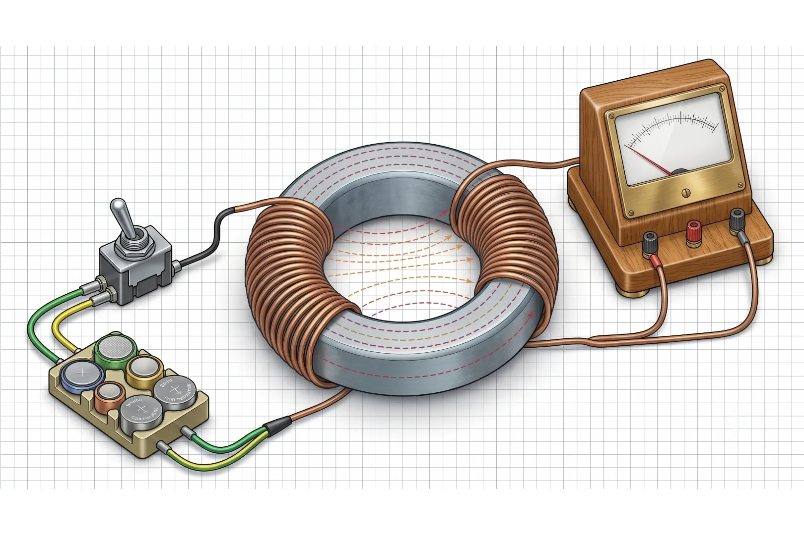
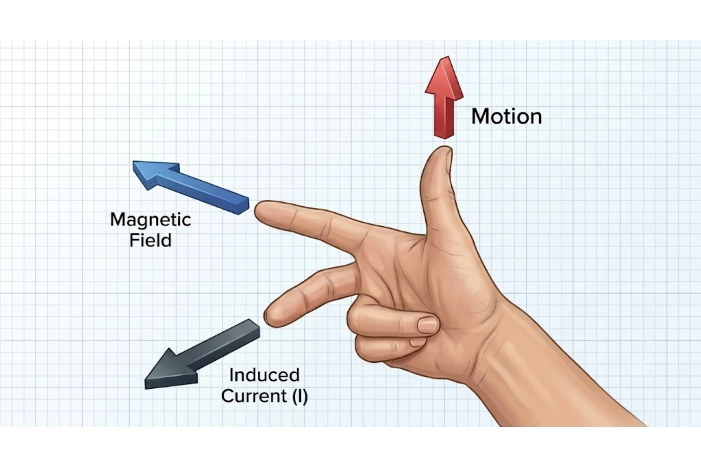
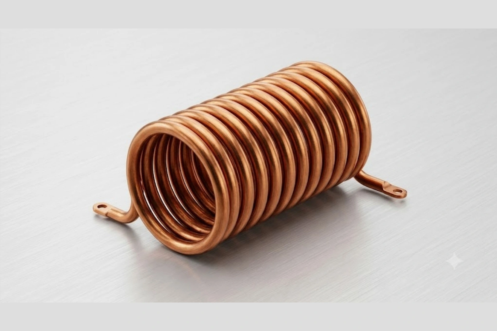
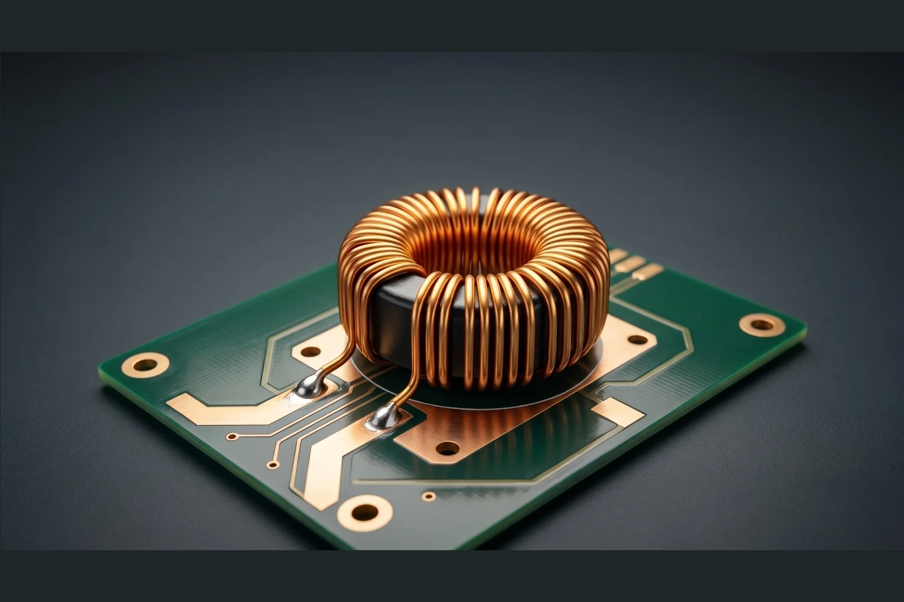

+++
title = "Magnetic Field: Anatomi Interaksi Elektromagnetik Penentu Keandalan Sistem Industri"
date = 2026-08-06T10:06:36+07:00
draft = false
description = "Kuasai hukum fundamental medan magnet untuk merancang sistem kelistrikan andal. Temukan rahasia pengukuran presisi dan strategi shielding skala industri."
image = "magnetic-field.webp"
images = ["/posts/physics/magnetic-field/magnetic-field.webp"]
categories = ["Physics"]
tags = ["Electro Magnetism", "Electromagnetic Induction"]
socialshare = true
concept = "Magnetic Field"
slug = "magnetic-field"
+++

Pada 29 Agustus 1831, Michael Faraday melakukan eksperimen yang menjadi awal perkembangan teknologi kelistrikan modern. Ia menggunakan cincin besi lunak (_soft iron ring_) berdiameter 6 inci yang dililit dua kumparan kawat pada sisi berlawanan. Rancangan sederhana ini kemudian melahirkan salah satu prinsip terpenting dalam dunia kelistrikan.

Faraday menemukan bahwa perubahan medan magnet memunculkan arus listrik sesaat pada kumparan kedua. Arus tersebut hanya muncul ketika aliran listrik dari baterai pada kumparan pertama dihubungkan atau diputus. Penemuan induksi elektromagnetik (_electromagnetic induction_) membuktikan bahwa perubahan medan magnet mampu menghasilkan gaya gerak listrik (_electromotive force_) pada sebuah konduktor.

Prinsip induksi elektromagnetik kemudian menjadi dasar kerja berbagai sistem kelistrikan berskala besar. Turbin generator di pembangkit listrik, transformator tegangan tinggi pada jaringan distribusi, dan motor listrik pada elevator memanfaatkan konsep yang sama.

Prinsip ini juga memungkinkan perpindahan energi melalui medan magnet tanpa kontak fisik secara langsung. Penerapannya dapat ditemukan pada transformator dan sistem pengisian daya tanpa kabel (_wireless charging_). Teknologi tersebut kini semakin banyak digunakan untuk mendukung kebutuhan infrastruktur modern.

Pemahaman yang baik terhadap prinsip ini menjadi syarat penting dalam merancang sistem distribusi tenaga listrik yang aman dan andal. Perancang sistem harus menghitung parameter seperti fluks magnet, jumlah lilitan kawat, serta frekuensi operasi secara akurat. Ketelitian pada tahap perancangan menentukan kestabilan aliran listrik dari pembangkit hingga sampai ke pelanggan akhir.

## Apa yang dimaksud Magnetic Field?

**Medan magnet** (_magnetic field_) adalah area di sekitar magnet atau penghantar yang dialiri arus listrik yang masih dapat memberikan pengaruh magnet. Meskipun tidak terlihat oleh mata, keberadaannya dapat diamati melalui gerakan jarum kompas atau gaya yang bekerja pada benda bermagnet dan muatan listrik yang bergerak.

Dalam ilmu fisika, medan magnet digambarkan sebagai medan vektor karena setiap titik memiliki besar dan arah tertentu. Sifat inilah yang memungkinkan teknisi memprediksi arah gaya yang bekerja pada berbagai komponen kelistrikan.

Pemahaman terhadap medan magnet penting saat merancang topologi distribusi daya. Contohnya dapat ditemukan pada panel listrik utama di ruang gawat darurat rumah sakit, instalasi sistem tata udara sentral, hingga berbagai sistem kelistrikan di gedung komersial.

Berikut adalah konsep dasar medan magnet saat berinteraksi dengan konduktor:

- **Vektor Medan Magnet** (_magnetic field vector_)  
  Besaran fisika yang dilambangkan dengan simbol **B** dan memiliki nilai serta arah pada setiap titik di ruang tiga dimensi. Arah jarum kompas yang menghadap kutub utara menunjukkan arah _magnetic field vector_ pada titik tersebut.
- **Sumber Medan** (_source of field_)  
  Arus listrik (_electric current_) yang berasal dari perpindahan muatan, serta momen magnetik alami pada partikel material seperti putaran elektron (_electron spin_), menghasilkan medan magnet di sekitarnya.
- **Densitas Fluks Magnetik** (_magnetic flux density_)  
  Besaran vektor **B** yang menyatakan kerapatan garis medan magnet pada setiap satuan luas suatu medium. Besaran ini menggunakan satuan Internasional, yaitu Tesla (T).
- **Intensitas Medan Magnet** (_magnetic field intensity_)  
  Besaran vektor **H** yang menunjukkan kontribusi arus bebas terhadap medan magnet. Nilainya dihitung menggunakan persamaan:
    $$H=\frac{B}{\mu_0}-M$$
    dengan **M** menyatakan tingkat magnetisasi material. Besaran ini menggunakan satuan Ampere per meter (A/m).
    
Untuk mengetahui besar gaya yang bekerja pada muatan listrik yang bergerak di dalam medan magnet, perancang sistem menggunakan gaya Lorentz (_Lorentz force_). Persamaan yang digunakan adalah:

$$F=Q(E+v\times B)$$

Keterangan variabel pada persamaan tersebut adalah:

- **F**: Gaya Lorentz (_Lorentz force_) dalam satuan Newton (N).
- **Q**: Muatan partikel dalam satuan Coulomb (C).
- **E**: Medan listrik dalam satuan Volt per meter (V/m).
- **v**: Kecepatan partikel dalam satuan meter per detik (m/s).
- **B**: Densitas fluks magnetik (_magnetic flux density_) dalam satuan Tesla (T).

Sebagai contoh, sebuah partikel memiliki muatan **Q = 2 × 10⁻⁶ C** dan bergerak dengan kecepatan **v = 5 × 10⁵ m/s** di dalam medan magnet dengan **B = 0,2 T**. Pada contoh ini diasumsikan partikel hanya berada di dalam daerah yang memiliki medan magnet dan tidak terdapat sumber medan listrik, seperti baterai, kapasitor, atau beda potensial yang dapat menghasilkan medan listrik. Oleh karena itu, medan listrik dianggap tidak ada sehingga $E = 0$.

Karena **E = 0**, persamaan dapat disederhanakan menjadi:

$$F=Q(vB)$$

Selanjutnya, masukkan nilai yang diketahui:

$$F=(2\times10^{-6})(5\times10^{5})(0,2)$$

Hasil perhitungannya adalah:

$$F=0,2\ \text{N}$$

Artinya, partikel tersebut mengalami gaya Lorentz sebesar **0,2 Newton**. Arah gaya dapat ditentukan menggunakan kaidah tangan kanan (_right hand rule_). Untuk muatan positif, arah gaya selalu tegak lurus terhadap arah kecepatan (**v**) dan medan magnet (**B**).

Persamaan ini digunakan dalam perancangan berbagai perangkat berpresisi tinggi, seperti spektrometer massa, akselerator partikel, dan **Magnetic Resonance Imaging** (MRI, teknologi pencitraan medis yang memanfaatkan medan magnet dan gelombang radio). Perhitungan yang tepat membantu memastikan setiap komponen bekerja sesuai rancangan sekaligus menjaga keamanan selama pengoperasian.

## Representasi Matematis dan Hukum-hukum yang Mengatur

Perilaku medan magnet dapat dijelaskan menggunakan berbagai persamaan matematika. Persamaan tersebut menjadi dasar untuk memahami hubungan antara medan magnet, medan listrik, dan arus listrik dalam berbagai sistem kelistrikan.

Penguasaan hukum-hukum ini membantu insinyur menganalisis distribusi medan magnet, menghitung besar medan yang terbentuk, serta merancang sistem tenaga listrik yang aman dan efisien. Penerapannya dapat ditemukan pada jaringan transmisi, gardu induk, motor listrik, generator, hingga instalasi listrik gedung bertingkat.

### Hukum Gauss untuk Magnetisme (_Gauss's Law for Magnetism_)

Hukum Gauss untuk Magnetisme dituliskan sebagai berikut:

$$\nabla \cdot B = 0$$

dengan:

- **B**: Densitas fluks magnetik (_magnetic flux density_), satuan Tesla (T).
- **∇·**: Operator divergensi (_divergence operator_) yang digunakan untuk mengetahui ada atau tidaknya sumber suatu medan vektor.

Persamaan ini menjelaskan bahwa **monopol magnetik** (_magnetic monopole_), yaitu kutub magnet tunggal yang berdiri sendiri, belum pernah ditemukan. Dengan kata lain, setiap magnet selalu memiliki kutub utara dan kutub selatan yang saling berpasangan.

Kondisi ini dapat dipahami melalui sebuah magnet batang. Ketika magnet dipotong menjadi dua bagian, setiap potongan tidak akan menghasilkan kutub utara atau kutub selatan saja. Sebaliknya, masing-masing potongan akan menjadi magnet baru yang tetap memiliki kedua kutub tersebut.

Karena tidak memiliki kutub tunggal, garis-garis medan magnet selalu keluar dari kutub utara, kemudian melengkung dan kembali masuk ke kutub selatan. Akibatnya, garis medan magnet selalu membentuk lintasan tertutup (_closed loop_).

### Hukum Faraday (_Maxwell-Faraday Equation_)

Persamaan Hukum Faraday dituliskan sebagai berikut:

$$\nabla \times E=-\frac{\partial B}{\partial t}$$

dengan:

- **E**: Medan listrik (_electric field_), satuan Volt per meter (V/m).
- **B**: Densitas fluks magnetik (_magnetic flux density_), satuan Tesla (T).
- **t**: Waktu, satuan detik (s).
- **∇×**: Operator curl yang menunjukkan kecenderungan suatu medan membentuk pola melingkar.

Persamaan ini menjelaskan bahwa perubahan medan magnet terhadap waktu dapat menghasilkan medan listrik. Prinsip tersebut dikenal sebagai induksi elektromagnetik (_electromagnetic induction_), yaitu proses munculnya tegangan atau arus listrik akibat perubahan medan magnet.

Contoh paling sederhana dapat dilihat ketika sebuah magnet digerakkan mendekati atau menjauhi gulungan kawat. Meskipun kabel tidak terhubung ke baterai, perubahan posisi magnet menyebabkan arus listrik mengalir pada kumparan.

Prinsip ini menjadi dasar kerja generator pada pembangkit listrik, baik PLTA, PLTU, PLTB, maupun pembangkit lainnya. Generator menghasilkan listrik dengan memutar magnet di dalam kumparan sehingga medan magnet terus berubah terhadap waktu.

Tanda negatif pada persamaan menunjukkan **Hukum Lenz** (_Lenz's law_). Hukum ini menyatakan bahwa arus induksi yang muncul selalu memiliki arah yang berusaha menentang perubahan medan magnet yang menyebabkannya.

### Hukum Ampère-Maxwell (_Ampère-Maxwell Law_)

Persamaan Hukum Ampère-Maxwell dituliskan sebagai berikut:

$$\nabla\times B=\mu_0\left(J+\varepsilon_0\frac{\partial E}{\partial t}\right)$$

dengan:

- **B**: Densitas fluks magnetik (_magnetic flux density_), satuan Tesla (T).
- **μ₀**: Permeabilitas vakum (_vacuum permeability_), satuan Henry per meter (H/m).
- **J**: Kerapatan arus listrik (_current density_), satuan Ampere per meter persegi (A/m²).
- **ε₀**: Permitivitas vakum (_vacuum permittivity_), satuan Farad per meter (F/m).
- **E**: Medan listrik (_electric field_), satuan Volt per meter (V/m).
- **t**: Waktu, satuan detik (s).
- **∇×**: Operator curl yang menunjukkan pola perputaran suatu medan vektor.

Hukum ini merupakan kebalikan dari Hukum Faraday. Jika perubahan medan magnet dapat menghasilkan medan listrik, maka arus listrik juga mampu menghasilkan medan magnet di sekitarnya.

Fenomena tersebut dapat diamati pada kabel yang sedang dialiri arus. Meskipun tidak terlihat, kabel tersebut menghasilkan medan magnet yang mengelilinginya. Semakin besar arus listrik yang mengalir, semakin kuat pula medan magnet yang terbentuk.

Maxwell kemudian menyempurnakan hukum ini dengan menambahkan konsep **arus perpindahan** (_displacement current_). Penambahan tersebut menjelaskan bahwa perubahan medan listrik juga dapat menghasilkan medan magnet, meskipun tidak ada arus listrik yang mengalir melalui penghantar.

Hubungan timbal balik antara perubahan medan listrik dan medan magnet memungkinkan keduanya terus saling membangkitkan. Proses ini menghasilkan **gelombang elektromagnetik** (_electromagnetic wave_), yaitu gelombang yang membawa energi tanpa memerlukan medium. Cahaya, gelombang radio, sinyal WiFi, jaringan seluler, hingga komunikasi satelit bekerja berdasarkan prinsip ini.

Penerapan lainnya dapat ditemukan pada elektromagnet yang digunakan untuk mengangkat besi atau mobil di tempat daur ulang logam. Ketika arus listrik dialirkan ke kumparan, inti besi berubah menjadi magnet yang mampu mengangkat beban berat. Setelah arus dihentikan, sifat magnetnya ikut menghilang.

### Hukum Biot-Savart dan Hukum Ampere untuk Perhitungan Medan

Dalam dunia teknik kelistrikan, mengetahui besar medan magnet di sekitar penghantar berarus menjadi bagian penting dalam proses perancangan. Perhitungan ini membantu insinyur memastikan medan magnet yang terbentuk tidak mengganggu peralatan lain, seperti instrumen ukur, sistem komunikasi, maupun perangkat elektronik yang sensitif terhadap interferensi elektromagnetik.

Untuk menghitung medan magnet tersebut, terdapat dua pendekatan utama, yaitu Hukum Biot-Savart dan Hukum Ampere. Masing-masing digunakan sesuai dengan bentuk penghantar dan tingkat simetri sistem yang dianalisis.

#### Hukum Biot-Savart (_Biot-Savart Law_)

Hukum Biot-Savart digunakan untuk menghitung medan magnet yang dihasilkan oleh penghantar dengan bentuk yang tidak beraturan. Pendekatan ini menghitung kontribusi medan magnet dari setiap bagian kecil penghantar, kemudian menjumlahkannya hingga diperoleh medan magnet total.

Cara kerjanya dapat dianalogikan seperti menghitung luas kain yang bentuknya berliku-liku. Luas tidak dapat dihitung menggunakan satu rumus sederhana sehingga setiap bagian harus diukur terlebih dahulu, kemudian seluruh hasil pengukuran dijumlahkan.

Hukum Biot-Savart umumnya digunakan ketika penghantar memiliki bentuk yang melengkung, bercabang, atau distribusi arus yang kompleks. Meskipun proses perhitungannya lebih panjang, hasil yang diperoleh memiliki tingkat akurasi yang tinggi.

#### Hukum Ampere (_Ampere's Law_)

Hukum Ampere digunakan ketika sistem memiliki bentuk yang simetris sehingga proses perhitungan menjadi jauh lebih sederhana. Contohnya adalah kawat lurus panjang, _busbar_ (rel tembaga), solenoida, dan toroida.

Sebagai gambaran, Hukum Ampere dapat dianalogikan seperti menghitung luas sebuah persegi panjang. Karena bentuknya teratur, luas cukup dihitung menggunakan panjang dikalikan lebar tanpa perlu mengukur setiap bagian satu per satu.

Keunggulan inilah yang membuat Hukum Ampere lebih sering digunakan pada analisis sistem kelistrikan dengan geometri yang sederhana.

#### Cara Kerja Hukum Ampere

Persamaan Hukum Ampere dituliskan sebagai berikut:

$$\oint B\cdot dl=\mu_0I_{enc}$$

dengan:

- **B**: Densitas fluks magnetik (_magnetic flux density_), satuan Tesla (T).
- **dl**: Elemen panjang lintasan Amperian (_Amperian loop_), satuan meter (m).
- **μ₀**: Permeabilitas vakum (_vacuum permeability_), satuan Henry per meter (H/m).
- **Iₑₙc**: Arus terlingkupi (_enclosed current_), satuan Ampere (A).
- **∮**: Integral lintasan tertutup (_closed line integral_) yang dilakukan sepanjang lintasan Amperian.

Persamaan tersebut memiliki makna sederhana. Total medan magnet yang mengelilingi suatu lintasan tertutup sebanding dengan jumlah arus listrik yang berada di dalam lintasan tersebut.

Secara umum, langkah penggunaan Hukum Ampere adalah sebagai berikut:

1. Tentukan lintasan Amperian (_Amperian loop_), yaitu lintasan imajiner yang mengelilingi penghantar berdasarkan bentuk atau simetrinya.
2. Hitung arus terlingkupi (_enclosed current_) yang melewati area di dalam lintasan tersebut.
3. Substitusikan seluruh nilai ke dalam persamaan Hukum Ampere untuk memperoleh besar medan magnet.

#### Contoh Perhitungan Hukum Ampere

Misalkan sebuah kawat lurus panjang dialiri arus sebesar **10 A**. Besar medan magnet akan dihitung pada titik yang berjarak **5 cm** atau **0,05 m** dari kawat tersebut.

Karena penghantar berbentuk lurus panjang dan memiliki simetri yang baik, persamaan Hukum Ampere dapat disederhanakan menjadi:

$$B=\frac{\mu_0I}{2\pi r}$$

dengan:

- **B**: Densitas fluks magnetik (_magnetic flux density_), satuan Tesla (T).
- **μ₀**: Permeabilitas vakum (_vacuum permeability_), bernilai **4π × 10⁻⁷ H/m**.
- **I**: Arus listrik (_electric current_), satuan Ampere (A).
- **r**: Jarak titik pengamatan terhadap penghantar, satuan meter (m).
- **2π**: Konstanta matematika yang muncul pada perhitungan medan magnet di sekitar penghantar lurus.

Substitusikan nilai yang diketahui:

$$B=\frac{(4\pi\times10^{-7})(10)}{2\pi(0,05)}$$

Hasil perhitungannya adalah:

$$B=4\times10^{-5}\ \text{T}$$

Artinya, medan magnet yang terbentuk pada jarak **5 cm** dari kawat tersebut sebesar **4 × 10⁻⁵ Tesla** atau **40 μT (mikrotesla)**.

Sebagai perbandingan, medan magnet alami Bumi berada pada kisaran **25 hingga 65 μT**. Nilai tersebut menunjukkan bahwa medan magnet yang dihasilkan kawat berarus **10 A** pada jarak **5 cm** masih berada pada orde yang sebanding dengan medan magnet Bumi. Perbandingan ini membantu memberikan gambaran bahwa besarnya medan magnet tidak hanya bergantung pada arus listrik, tetapi juga dipengaruhi oleh jarak dari sumber medan.

## Mekanisme Pembangkitan Medan Magnet

Medan magnet dapat dihasilkan melalui beberapa mekanisme, bergantung pada sumber dan material yang digunakan. Dalam bidang teknik kelistrikan, mekanisme ini dimanfaatkan untuk mengendalikan pergerakan komponen, menghasilkan gaya, hingga mengubah energi listrik menjadi energi mekanik.

Di dunia teknik kelistrikan, medan magnet menjadi sumber gaya yang menggerakkan berbagai perangkat. Gaya tersebut dimanfaatkan untuk mengoperasikan motor listrik, relai, bel listrik, katup otomatis, hingga media penyimpanan data seperti hard disk.

Secara umum, terdapat empat mekanisme utama untuk menghasilkan medan magnet. Masing-masing memiliki prinsip kerja, karakteristik, dan penggunaan yang berbeda sesuai kebutuhan.

### Elektromagnet (_Electromagnet_)

Elektromagnet adalah magnet yang terbentuk ketika arus listrik mengalir melalui penghantar atau kumparan kawat. Selama arus listrik masih mengalir, medan magnet akan tetap terbentuk di sekitar penghantar. Ketika arus dihentikan, sifat magnetnya juga langsung menghilang.

Prinsip ini dapat dijumpai pada derek elektromagnet di tempat daur ulang logam. Saat arus listrik dialirkan, derek mampu mengangkat besi atau bahkan badan mobil. Setelah arus diputus, benda yang diangkat akan langsung terlepas.

Arah medan magnet dapat ditentukan menggunakan **kaidah tangan kanan** (_right hand rule_). Jika ibu jari menunjukkan arah arus listrik, maka lengkungan empat jari lainnya menunjukkan arah medan magnet yang mengelilingi penghantar.

Keunggulan utama elektromagnet adalah kekuatan medan magnetnya dapat diatur sesuai kebutuhan. Selain itu, medan magnet dapat dihidupkan atau dimatikan hanya dengan mengendalikan aliran listrik.

Karena sifat tersebut, elektromagnet banyak digunakan pada relai, kontaktor, bel listrik, motor listrik, mesin pengangkat logam, serta berbagai sistem otomasi industri.

### Solenoida (_Solenoid_)

Solenoida adalah kumparan kawat berbentuk silinder dengan panjang yang lebih besar daripada diameternya. Bentuk ini membuat medan magnet terkonsentrasi di sepanjang sumbu kumparan sehingga menghasilkan medan magnet yang relatif seragam (_uniform magnetic field_).

Cara kerjanya dapat dibayangkan seperti sebuah terowongan magnet. Ketika arus listrik mengalir melalui lilitan kawat, medan magnet dari setiap lilitan saling memperkuat sehingga menghasilkan gaya magnet yang terkonsentrasi di bagian tengah kumparan.

Kekuatan medan magnet pada solenoida dapat ditingkatkan dengan menambahkan inti besi atau baja di bagian tengah kumparan. Material tersebut memperbesar fluks magnet sehingga gaya magnet yang dihasilkan menjadi berkali-kali lipat lebih kuat dibandingkan kumparan tanpa inti.

Karena mampu menghasilkan gerakan lurus, solenoida banyak digunakan sebagai aktuator linier (_linear actuator_). Contoh penerapannya dapat ditemukan pada starter kendaraan, katup solenoida, relai, serta sistem injeksi bahan bakar.

### Toroida (_Toroid_)

Toroida adalah solenoida yang kedua ujungnya disambungkan hingga membentuk cincin menyerupai donat. Bentuk melingkar ini membuat medan magnet tetap berada di dalam inti sehingga hanya sedikit yang menyebar ke lingkungan sekitar.

Kondisi tersebut mengurangi **kebocoran fluks** (_leakage flux_), yaitu fluks magnet yang keluar dari inti dan tidak dimanfaatkan oleh sistem. Semakin kecil kebocoran fluks, semakin tinggi efisiensi komponen elektromagnetik dan semakin kecil pula gangguan terhadap perangkat lain di sekitarnya.

Karena karakteristik tersebut, toroida banyak digunakan pada transformator toroida yang umum ditemukan pada _amplifier_ audio berkualitas tinggi. Komponen ini juga digunakan pada induktor, kepala pita magnetik (_tape head_), dan reaktor fusi tipe tokamak.

### Magnet Permanen (_Permanent Magnet_)

Magnet permanen adalah magnet yang mampu mempertahankan medan magnetnya tanpa memerlukan sumber listrik. Sifat ini berasal dari **domain magnetik** (_magnetic domain_), yaitu kumpulan atom yang arah magnetisasinya tersusun searah dan tetap stabil di dalam material.

Berbeda dengan elektromagnet, magnet permanen tidak memerlukan arus listrik untuk menghasilkan gaya magnet. Oleh karena itu, jenis magnet ini cocok digunakan pada perangkat yang membutuhkan medan magnet secara terus-menerus dengan konsumsi energi yang rendah.

Salah satu material yang paling banyak digunakan adalah neodimium (_NdFeB_), yaitu paduan neodimium, besi, dan boron yang dikenal sebagai salah satu magnet permanen terkuat saat ini. Meskipun ukurannya relatif kecil, material ini mampu menghasilkan gaya tarik yang sangat besar.

Magnet permanen banyak digunakan pada pengeras suara (_speaker_), hard disk, sensor, motor listrik berukuran kecil, generator, hingga dinamo sepeda. Penggunaannya memungkinkan perangkat bekerja secara efisien tanpa harus terus-menerus mengonsumsi daya listrik untuk menghasilkan medan magnet.

## Pengukuran Industri dan Instrumentasi untuk Medan Magnet

Pengukuran medan magnet dilakukan untuk memastikan sistem kelistrikan bekerja sesuai rancangan dan memenuhi standar keselamatan. Hasil pengukuran juga membantu teknisi mendeteksi gangguan, mengevaluasi kinerja peralatan, serta memastikan medan magnet tidak mengganggu komponen lain di sekitarnya.

Berikut beberapa instrumen yang paling umum digunakan untuk mengukur medan magnet.

1. **Sensor Efek Hall (_Hall Effect Sensor_)**   
   Sensor Efek Hall (_Hall Effect Sensor_) bekerja berdasarkan **gaya Lorentz** (_Lorentz force_), yaitu gaya yang bekerja pada muatan listrik di dalam medan magnet. Sensor ini mengubah medan magnet menjadi tegangan listrik yang besarnya sebanding dengan kekuatan medan magnet. Sensor Efek Hall banyak digunakan sebagai sensor posisi, sensor kecepatan, serta pengukuran arus listrik tanpa memutus penghantar.
2. **Magnetometer (_Magnetometer_)**  
   Magnetometer digunakan untuk mengukur medan magnet yang lemah dengan tingkat sensitivitas tinggi. Instrumen ini banyak dimanfaatkan pada penelitian, sistem **Magnetic Resonance Imaging** (MRI, teknologi pencitraan medis menggunakan medan magnet), serta _condition monitoring_ (pemantauan kondisi) motor listrik.
3. **Gaussmeter (_Gaussmeter_)**  
   Gaussmeter digunakan untuk mengukur **densitas fluks magnetik** (_magnetic flux density_) dalam satuan Gauss (G) atau Tesla (T). Alat ini umum digunakan untuk menguji kekuatan magnet permanen, elektromagnet, dan berbagai komponen industri.
4. **Probe Arus (_Current Probe_)**  
   Probe Arus (_Current Probe_) mengukur arus listrik tanpa memutus rangkaian dengan mendeteksi medan magnet di sekitar penghantar berdasarkan **Hukum Ampere** (_Ampere's law_). Instrumen ini banyak digunakan untuk inspeksi panel distribusi dan sistem tenaga yang masih beroperasi.

### Langkah Dasar Pengukuran Medan Magnet

Agar hasil pengukuran tetap akurat, teknisi umumnya melakukan beberapa langkah berikut.

1. Kalibrasi instrumen sebelum digunakan.
2. Posisikan sensor atau probe sesuai arah medan magnet yang akan diukur.
3. Lakukan pengukuran pada beberapa titik untuk memastikan hasil yang konsisten.

## Teknik Pengukuran Medan Magnet Berbasis Osiloskop

Osiloskop digunakan ketika teknisi ingin mengamati perubahan medan magnet terhadap waktu atau menganalisis bentuk sinyal secara langsung. Pengukuran ini biasanya dilakukan menggunakan probe khusus yang dihubungkan ke osiloskop.

1. **Probe Magnetik Pasif (_Passive Magnetic Probe_)**
   Probe Magnetik Pasif (_Passive Magnetic Probe_) berupa lilitan kawat kecil yang menangkap perubahan medan magnet berdasarkan **Hukum Induksi Faraday** (_Faraday's law of induction_). Sinyal induksi yang dihasilkan kemudian ditampilkan sebagai bentuk gelombang pada osiloskop.  
   Probe ini banyak digunakan untuk analisis **medan dekat** (_near-field_), serta pengujian **Electromagnetic Compatibility** (EMC, kemampuan perangkat bekerja tanpa saling mengganggu) dan **Electromagnetic Interference** (EMI, gangguan elektromagnetik).
2. **Probe Diferensial (_Differential Probe_)**  
   Probe Diferensial (_Differential Probe_) mengukur selisih tegangan antara dua titik pada rangkaian sekaligus mengurangi **derau mode bersama** (_common-mode noise_). Instrumen ini umum digunakan untuk analisis inverter, catu daya, dan sistem elektronika daya.
3. **Pengukuran Medan Magnet Statis**  
   Probe induktif hanya dapat mendeteksi medan magnet yang berubah terhadap waktu karena bekerja berdasarkan induksi elektromagnetik. Untuk mengukur medan magnet DC yang bersifat tetap, sensor berbasis **Efek Hall** (_Hall effect_) menjadi pilihan yang lebih sesuai karena dapat mendeteksi medan magnet statis secara langsung.

## Aplikasi Industri Medan Magnet pada Teknik Elektro

Medan magnet menjadi salah satu prinsip utama dalam berbagai sistem kelistrikan modern. Melalui induksi elektromagnetik, energi listrik dapat diubah menjadi energi mekanik, dipindahkan antar rangkaian, atau dimanfaatkan untuk menghasilkan gaya yang menggerakkan berbagai peralatan.

Penerapannya dapat ditemukan pada bangunan komersial, fasilitas industri, rumah sakit, hingga kendaraan listrik. Berikut beberapa contoh aplikasi medan magnet yang paling umum dalam teknik elektro.

- **Motor Listrik (**_**Electric Motor**_**)**
    - Mengubah energi listrik menjadi energi mekanik melalui interaksi medan magnet stator dan rotor.
    - Digunakan pada pompa air, kompresor HVAC, elevator, eskalator, kipas industri, dan mesin produksi.
- **Transformator (**_**Transformer**_**)**
    - Bekerja berdasarkan **Hukum Induksi Faraday** (_Faraday's law of induction_) untuk mengubah tingkat tegangan listrik.
    - Digunakan untuk menurunkan tegangan distribusi menjadi tegangan penggunaan serta menaikkan tegangan agar transmisi listrik jarak jauh lebih efisien.
- **Relai Magnetik (**_**Magnetic Relay**_**)**
    - Memanfaatkan elektromagnet untuk membuka atau menutup kontak listrik secara otomatis.
    - Banyak digunakan pada panel kontrol, sistem otomasi, serta sistem proteksi kelistrikan.
- **Pengisian Daya Nirkabel (**_**Wireless Charging**_**)**
    - Menggunakan **resonant inductive coupling** (kopling induktif resonansi, metode pemindahan energi melalui medan magnet) untuk mentransfer energi tanpa kabel.
    - Diterapkan pada pengisi daya ponsel, perangkat elektronik portabel, dan stasiun pengisian kendaraan listrik.
- **Magnetic Resonance Imaging (MRI)**
    - Menggunakan magnet superkonduktor untuk menghasilkan medan magnet yang kuat dan stabil.
    - Memungkinkan pencitraan organ dan jaringan lunak tubuh tanpa menggunakan radiasi ionisasi.
## Tantangan dan Strategi Mitigasi: Pelindung dan Pengendalian Interferensi

Peralatan listrik dan elektronik dapat menghasilkan **Electromagnetic Interference** (EMI, gangguan elektromagnetik) yang memengaruhi kinerja perangkat lain di sekitarnya. Jika tidak dikendalikan, interferensi ini dapat menyebabkan gangguan komunikasi, kesalahan pembacaan sensor, hingga menurunkan keandalan sistem kelistrikan.

Untuk mengurangi dampak tersebut, berbagai metode pelindung diterapkan sesuai jenis gangguan dan karakteristik medan magnet yang dihadapi.

- **Pelindung Feromagnetik (_Ferromagnetic Shielding_)**  
  Pelindung feromagnetik menggunakan material dengan permeabilitas tinggi, seperti **mu-metal**, untuk mengalihkan fluks magnet agar tidak mencapai komponen yang dilindungi. Metode ini lebih efektif untuk medan magnet statis maupun medan magnet berfrekuensi rendah.  
  Pelindung feromagnetik banyak digunakan pada sensor presisi, instrumen pengukuran, serta peralatan medis yang membutuhkan lingkungan dengan gangguan medan magnet seminimal mungkin.
- **Pelindung Konduktif (_Conductive Shielding_)**  
  Pelindung konduktif menggunakan bahan seperti tembaga atau aluminium untuk mengurangi interferensi elektromagnetik. Material tersebut menghasilkan **arus eddy** (_eddy current_), yaitu arus induksi yang membentuk medan magnet berlawanan sehingga mampu melemahkan gangguan.  
  Metode ini umum diterapkan pada kabel berpelindung (_shielded cable_), panel kontrol, ruang server, dan berbagai perangkat elektronika.
- **Pembatalan Aktif (_Active Cancellation_)**  
  Pembatalan aktif bekerja dengan mendeteksi interferensi menggunakan sensor, kemudian menghasilkan medan magnet dengan fase yang berlawanan. Ketika kedua medan bertemu, gangguan akan berkurang melalui prinsip superposisi.  
  Teknik ini banyak digunakan pada sistem pengukuran presisi, laboratorium, serta perangkat elektronik yang membutuhkan tingkat akurasi tinggi.
- **Integrasi Pembumian (_Grounding Integration_)**    
  Pembumian (_grounding_) menjadi bagian penting dalam pengendalian interferensi elektromagnetik. Sistem ini menyediakan jalur yang aman bagi arus gangguan sekaligus menjaga referensi tegangan tetap stabil.  
  Grounding umumnya dikombinasikan dengan sistem pelindung (_shielding_) agar interferensi dapat dialirkan ke tanah secara efektif. Kombinasi keduanya menjadi dasar penerapan **Electromagnetic Compatibility** (EMC, kemampuan perangkat bekerja tanpa saling mengganggu) pada instalasi kelistrikan modern.

## Kesimpulan

Pengendalian medan magnet dan induksi elektromagnetik menjadi bagian penting dalam perancangan sistem kelistrikan modern. Prinsip elektrodinamika tidak hanya dipelajari secara teori, tetapi juga diterapkan untuk memastikan sistem utilitas bangunan, fasilitas industri, dan perangkat elektronik dapat bekerja dengan aman serta stabil.

Kinerja motor listrik, sistem tata udara gedung, jaringan distribusi daya, hingga peralatan medis sangat dipengaruhi oleh akurasi analisis elektromagnetik. Perancangan yang tepat melalui pengendalian fluks magnet, pemilihan material pelindung, serta penerapan [grounding](https://pepuru.com/posts/electrical-engineering/electrical-grounding/) dan bonding dapat mengurangi gangguan, meningkatkan efisiensi, dan memperpanjang usia peralatan.

Pengukuran dan diagnostik medan magnet yang akurat membantu memastikan setiap komponen bekerja sesuai batas operasional yang ditentukan. Dengan menerapkan metode mitigasi interferensi elektromagnetik yang tepat, seperti penggunaan _shielding_, sensor pengukuran, dan sistem pembumian yang baik, infrastruktur kelistrikan dapat memiliki tingkat keandalan yang lebih tinggi.
