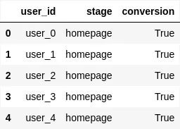
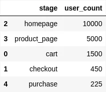
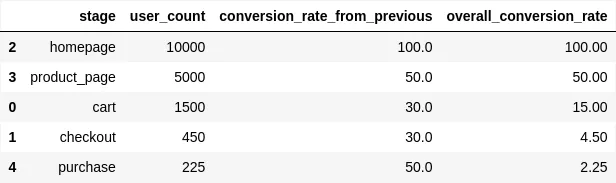
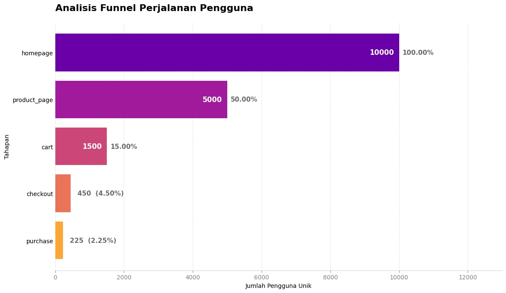

+++
title = 'Analisis Funnel dengan Python: Temukan & Perbaiki Kebocoran Konversi'
date = 2025-09-07T17:48:00+07:00
draft = false
socialshare = true
description = "Belajar melakukan analisis funnel e-commerce dari nol menggunakan Pandas & Matplotlib. Ubah data aktivitas pengguna menjadi insight bisnis yang dapat ditindaklanjutkan."
image = "1.webp"
imageBig= "1.webp"
categories= ["Projects"]
tags= ["Python"]
authors= ["Daddy Ananta"]
avatar="/images/profil.jpeg"
url = "/posts/projects/analisis-funnel-dengan-python-temukan--perbaiki-kebocoran-konversi/"
aliases = [
    "/posts/analysis--visualization/analisis-funnel-dengan-python-temukan--perbaiki-kebocoran-konversi/"
]
+++


Kita melihat dashboard traffic dan tersenyum: ribuan pengguna mengunjungi situs e-commerce setiap hari. Namun, senyum itu memudar saat kita melihat laporan penjualan. Angkanya terasa stagnan. Di suatu tempat antara halaman utama yang ramai dan tombol "Bayar Sekarang" yang sepi, calon pelanggan menghilang begitu saja. Ini adalah masalah senilai jutaan dolar yang dihadapi banyak bisnis: kebocoran funnel yang tidak terlihat. Bagaimana jika kita bisa menyalakan senter dan menyorot dengan tepat di mana retakan dalam perjalanan pelanggan kita? Dalam panduan ini, kita akan melakukan hal itu. Kita tidak hanya akan belajar teori, tetapi juga menulis kode Python langkah-demi-langkah untuk mengubah data aktivitas pengguna yang mentah menjadi sebuah funnel chart yang visual dan mengungkap di mana letak masalah sebenarnya, memungkinkan kita untuk beralih dari menebak-nebak menjadi membuat keputusan berbasis data.


## Persiapan Amunisi: Data & Tools

Sebelum kita menyelam ke dalam analisis, kita perlu menyiapkan dua hal: data dan *tools*. Data kita harus mencatat setiap kali seorang pengguna mencapai tahapan kunci. Struktur paling sederhana yang kita butuhkan adalah `user_id` untuk mengidentifikasi pengguna secara unik dan `stage` untuk mencatat tahapan yang mereka capai.

Untuk tutorial ini, kita akan menggunakan dataset `user_data.csv` yang dapat diunduh <a href="user_data.csv" download>di sini</a>. Penting untuk dicatat bahwa ini adalah data sintetis yang kami buat khusus untuk meniru skenario e-commerce yang umum, memungkinkan kita untuk fokus pada teknik analisisnya tanpa terganggu oleh kerumitan data dunia nyata.

```python
# Mengimpor pustaka yang diperlukan
import pandas as pd
import matplotlib.pyplot as plt
import numpy as np

# Membaca file CSV ke dalam DataFrame pandas.
df = pd.read_csv('user_data.csv')

df.head()
```

<div class="single-image-source">
  
</div>

Dengan bahan mentah yang sudah di tangan, mari kita pahami intuisi di balik teknik yang akan kita gunakan.

## Intuisi di Balik Analisis Funnel

Analisis Funnel (Corong) adalah cara kita memvisualisasikan perjalanan pelanggan. Bayangkan sebuah corong sungguhan: lebar di atas dan menyempit ke bawah. Dalam bisnis, "atas" yang lebar adalah semua pengunjung situs, dan "bawah" yang sempit adalah mereka yang berhasil menjadi pelanggan.

Tujuan kita adalah untuk mengukur seberapa banyak "cairan" (pengguna) yang tumpah di setiap penyempitan corong. Dengan mengetahui di mana tumpahan terbesar terjadi, kita tahu bagian mana dari corong kita yang "bocor" dan perlu diperbaiki. Ini adalah teknik yang sangat visual dan intuitif untuk menemukan masalah dalam sebuah proses.

## Dari Angka ke Cerita: Melakukan Analisis

Sekarang saatnya kita mengubah ribuan baris data tersebut menjadi angka yang bercerita.

### Langkah 1: Menghitung Pengguna di Setiap Tahap

Tujuan kita di sini adalah untuk mengagregasi data mentah menjadi satu tabel ringkasan sederhana: berapa banyak pengguna unik yang mencapai setiap tahapan. Ini adalah langkah pertama untuk melihat gambaran besarnya.

```python
# Mendefinisikan urutan yang benar dari tahapan funnel.
stage_order = ['homepage', 'product_page', 'cart', 'checkout', 'purchase']

# Mengelompokkan data berdasarkan 'stage' dan menghitung jumlah pengguna unik di setiap tahap.
funnel_data = df.groupby('stage')['user_id'].nunique().reset_index()
funnel_data.columns = ['stage', 'user_count']

# Mengurutkan data sesuai urutan funnel yang benar
funnel_data['stage'] = pd.Categorical(funnel_data['stage'], categories=stage_order, ordered=True)
funnel_data = funnel_data.sort_values('stage')

funnel_data

```

<div class="single-image-source">
  
</div>

Tabel ini memberi kita pandangan pertama tentang "kebocoran" tersebut. Namun, untuk benar-benar memahami skala penurunannya, kita perlu menghitung tingkat konversi. Mari kita lakukan itu sekarang.

### Langkah 2: Mengungkap "Tingkat Kebocoran"

Di sinilah analisis kita mulai menjadi lebih tajam. Kita akan menambahkan dua metrik kunci: seberapa efektif setiap tahap mendorong pengguna ke tahap berikutnya, dan berapa persen dari pengunjung awal yang berhasil mencapai setiap tahap.

```python
# Menghitung konversi dari tahap sebelumnya dan konversi keseluruhan
funnel_data['conversion_rate_from_previous'] = (funnel_data['user_count'] / funnel_data['user_count'].shift(1) * 100).fillna(100)
funnel_data['overall_conversion_rate'] = (funnel_data['user_count'] / funnel_data['user_count'].iloc[0] * 100)

funnel_data
```
<div class="single-image-source">
  
</div>


Tabel ini mengubah angka menjadi cerita yang mengkhawatirkan. Dua 'kebocoran' terbesar kita kini terlihat jelas: kita kehilangan 7 dari 10 pengguna di tahap halaman produk, dan 7 dari 10 pengguna *lagi* di tahap keranjang. Ini adalah titik-titik di mana pendapatan potensial kita menguap.

## Visualisasi adalah Kunci: Membangun Funnel Chart

Tabel di atas sangat berguna bagi kita sebagai analis, tetapi untuk menyampaikannya kepada manajer produk atau tim marketing, sebuah gambar bernilai ribuan baris data. Mari kita visualisasikan funnel kita agar semua orang di dalam tim dapat melihat masalahnya secara sekilas.

```python
stages = funnel_data['stage']
values = funnel_data['user_count']

# Palet Warna Profesional dan Modern
colors = plt.cm.plasma(np.linspace(0.2, 0.8, len(stages)))


# Membuat bar chart horizontal
fig, ax = plt.subplots(figsize=(12, 7))

bars = ax.barh(stages, values, color=colors)

ax.invert_yaxis()

# Logika Labeling
max_value = values.max()

for i, bar in enumerate(bars):
    width = bar.get_width()
    overall_conv = funnel_data['overall_conversion_rate'].iloc[i]

    # Cek apakah bar terlalu pendek (kurang dari 15% dari bar terpanjang)
    if width < max_value * 0.15:
        padding = max_value * 0.02
        
        # Jumlah user dan persentase dalam satu label untuk kerapian
        combined_text = f'{int(width)}  ({overall_conv:.2f}%)'
        
        ax.text(width + padding,
                bar.get_y() + bar.get_height() / 2,
                combined_text,
                va='center',
                ha='left',
                fontsize=11,
                color='dimgray',
                weight='semibold')
    else:
        # Label Jumlah Pengguna (di dalam bar)
        ax.text(width - (max_value * 0.015),
                bar.get_y() + bar.get_height() / 2,
                f'{int(width)}',
                va='center',
                ha='right',
                fontsize=12,
                color='white',
                weight='bold')

        # Label Persentase (di luar bar)
        padding = max_value * 0.01
        ax.text(width + padding,
                bar.get_y() + bar.get_height() / 2,
                f'{overall_conv:.2f}%',
                va='center',
                ha='left',
                fontsize=11,
                color='dimgray',
                weight='semibold')


# Styling

ax.set_title(
    'Analisis Funnel Perjalanan Pengguna',
    fontsize=16,
    pad=20,
    weight="bold",
    loc="left"  
)
ax.set_xlabel('Jumlah Pengguna Unik')
ax.set_ylabel('Tahapan')
ax.set_xlim(right=max_value * 1.3) 
ax.spines['top'].set_visible(False)
ax.spines['right'].set_visible(False)
ax.spines['left'].set_visible(False)
ax.spines['bottom'].set_color('lightgray')
ax.tick_params(axis='y', length=0)
ax.tick_params(axis='x', colors='gray')
ax.grid(True, axis='x', linestyle=':', alpha=0.6)
ax.set_axisbelow(True)

plt.tight_layout()
plt.show()
```

<div class="single-image-source">
  
</div>


## Menerjemahkan Grafik Menjadi Insight



Inilah bintang pertunjukan kita. Grafik ini tidak hanya menunjukkan penurunan, tetapi juga menyoroti *besarnya* penurunan di setiap langkah. Dari sini, kita bisa melihat dengan jelas:

* **Insight Kunci 1: Kebocoran Terbesar dari Halaman Produk ke Keranjang.** Penurunan dari 5.000 menjadi 1.500 pengguna (tingkat konversi hanya 30%) adalah titik masalah terbesar pertama. Ini memberi tahu kita bahwa ada sesuatu yang salah di halaman produk itu sendiri.
* **Insight Kunci 2: Tingkat Pengabaian Keranjang yang Tinggi.** Penurunan dari 1.500 menjadi 450 pengguna (juga konversi 30%) adalah masalah klasik *cart abandonment*. Pengguna sudah menunjukkan niat membeli, tetapi sesuatu dalam proses menuju checkout membuat mereka mengurungkan niat.
* **Insight Kunci 3: Checkout yang Kurang Efisien.** Meskipun tingkat konversi dari checkout ke pembelian (50%) lebih baik, kita masih kehilangan separuh calon pelanggan di langkah terakhir, yang menunjukkan adanya friksi dalam proses pembayaran.

## Dari Insight ke Aksi: Merumuskan Rekomendasi Bisnis

Analisis data tidak ada gunanya jika tidak menghasilkan tindakan. Berdasarkan insight yang tajam ini, kita dapat memberikan rekomendasi yang jelas dan dapat ditindaklanjuti.

1.  **Rekomendasi untuk Tim Produk:** **Prioritaskan A/B Testing pada Halaman Produk.** Lakukan eksperimen pada judul, gambar, dan yang terpenting, desain tombol "Tambah ke Keranjang" dengan tujuan meningkatkan tingkat konversi dari 30% ke target baru, misalnya 35%.
2.  **Rekomendasi untuk Tim UX/UI:** **Audit dan Sederhanakan Alur Checkout.** Petakan setiap langkah dari `cart` hingga `purchase`. Apakah ada kolom formulir yang tidak perlu? Tampilkan semua biaya di muka untuk membangun kepercayaan dan pertimbangkan untuk menawarkan opsi "checkout sebagai tamu".

## Kesimpulan

Pada akhirnya, analisis funnel lebih dari sekadar membuat grafik yang menarik. Ini adalah proses menerjemahkan klik pengguna menjadi sebuah cerita yang koheren—sebuah cerita tentang niat, hambatan, dan peluang. Dengan mengubah data abstrak menjadi wawasan visual yang jelas, kita memberdayakan tim untuk berhenti menebak-nebak dan mulai membuat keputusan strategis yang mendorong pertumbuhan nyata. Kita kini memiliki peta harta karun; saatnya untuk mulai menggali.

## Langkah Kita Selanjutnya

Perjalanan kita tidak berhenti di sini. Analisis yang baru saja kita lakukan adalah peta harta karun—ia menunjukkan di mana 'emas' tersembunyi. Tantangan sebenarnya sekarang adalah mengambil peta ini dan mulai menggali. Terapkan pada data kita, lalu ambil langkah lebih jauh: Segmentasikan funnel kita. Apakah pengguna dari Instagram berperilaku berbeda dari pengguna yang datang via Google? Dengan menjawab pertanyaan yang lebih dalam, kita beralih dari seorang analis menjadi seorang ahli strategi data.

<a href="https://daddyananta.github.io//categories/analysis-and-visualization/">Jelajahi lebih dalam tentang Analysis & Visualization</a>

## Penelusuran Terkait

<ul>
  <li><a href="https://www.enki.com/projects/sales-funnel-analysis">Enki Project | Sales Funnel Analysis</a></li>
  <li><a href="https://dibimbing.id/blog/detail/panduan-analisis-data-dengan-python-pandas-untuk-pemula">Panduan Analisis Data dengan Python Pandas, Mudah Dipelajari - Dibimbing.id</a></li>
  <li><a href="https://www.youtube.com/watch?v=6T7p7nmRySs">Create a Funnel Chart in Python with Matplotlib Step by Step Guide - YouTube</a></li>
  <li><a href="https://www.statology.org/how-to-create-funnel-charts-in-python-with-plotly/">How to Create Funnel Charts in Python with Plotly - Statology</a></li>
  <li><a href="https://www.dynamicyield.com/lesson/cro-plan/">Developing a conversion rate optimization strategy - Dynamic Yield</a></li>
  <li><a href="https://www.customerlabs.com/blog/conversion-funnel-analysis-optimization/">Conversion Funnel Analysis: How to Analyze and Optimize? - CustomerLabs</a></li>
  <li><a href="https://www.woopra.com/learn/customer-journey-analytics">Customer Journey Analytics: The Ultimate Guide - Woopra</a></li>
  <li><a href="https://landingi.com/conversion-optimization/conversion-funnel-analysis/">Conversion Funnel Analysis: Improve Your Landing Page Performance - Landingi</a></li>
</ul>
