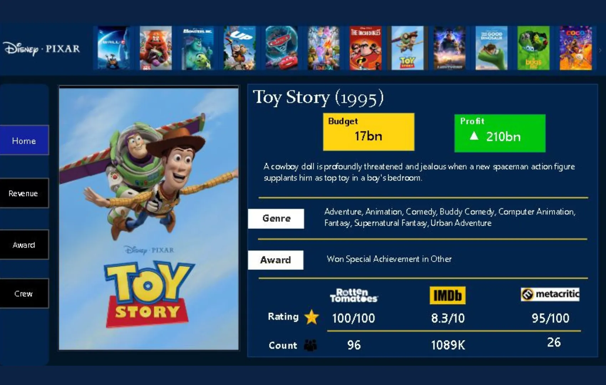
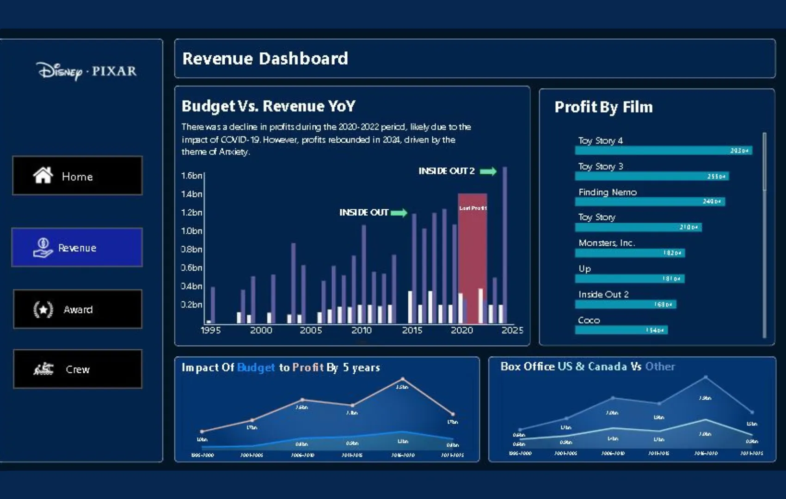
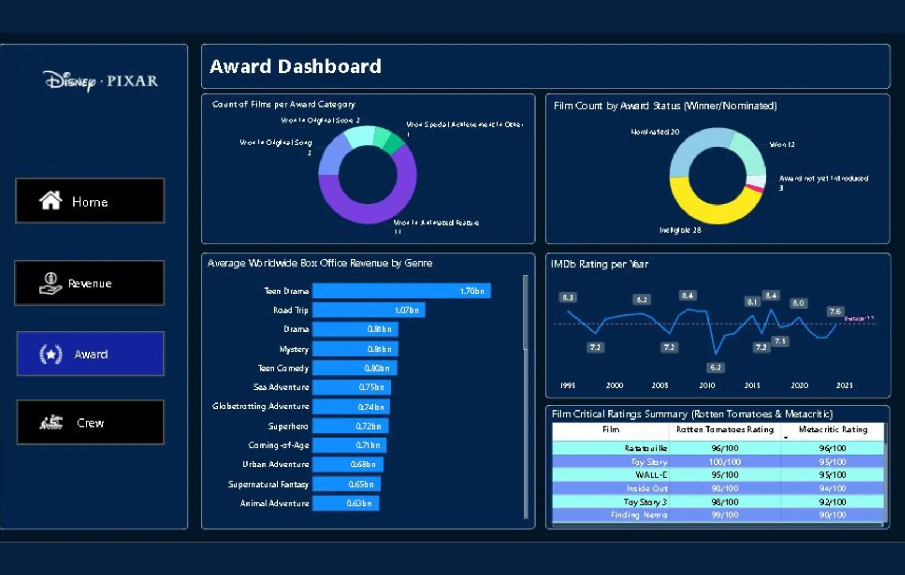
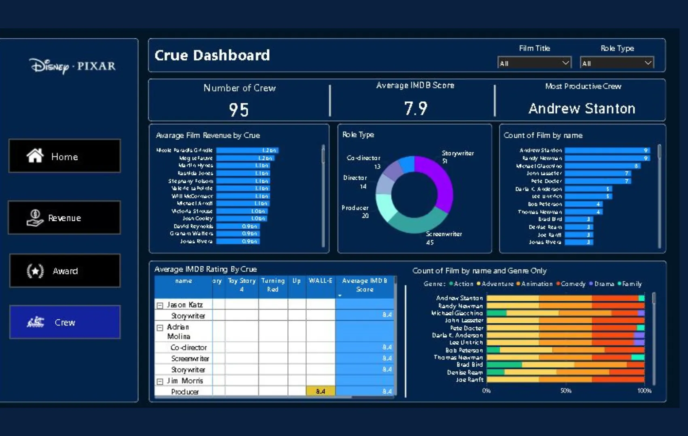

+++
title = 'Dashboard Analisis Film Disney Pixar'
date = 2025-03-10T21:37:16+07:00
draft = false
description = ""
image = "1.webp"
imageBig= "1.webp"
categories= ["Projects"]
tags= ["Power BI", "Dashboard"]
avatar="/images/Analysis_and_Visualization/profil.jpeg"
+++

## Tentang Dashboard

Dasbor interaktif ini dibuat sebagai entri untuk kompetisi analitik data oleh Maven Analytics. Dengan tema sinematik yang elegan, dasbor ini terstruktur ke dalam empat halaman utama yang saling terhubung Home, Revenue, Award, dan Crew untuk memberikan analisis 360 derajat terhadap film-film Disney Pixar.

* **Halaman Home:** Berfungsi sebagai katalog film, di mana pengguna dapat memilih film tertentu untuk melihat detail lengkapnya, mulai dari sinopsis, budget, profit, hingga rating dari berbagai kritikus.
* **Halaman Revenue:** Menyajikan analisis finansial, membandingkan budget dengan pendapatan dari tahun ke tahun, serta memeringkatkan film berdasarkan profitabilitasnya.
* **Halaman Award:** Berfokus pada pencapaian dan penerimaan kritis, menampilkan data penghargaan yang dimenangkan dan diterima, serta korelasi genre dengan pendapatan dan rating.
* **Halaman Crew:** Memberikan wawasan unik tentang para talenta di balik layar, menganalisis produktivitas dan kontribusi sutradara, penulis, dan produser terhadap kesuksesan film.

Secara keseluruhan, proyek ini tidak hanya menunjukkan visualisasi data yang menarik tetapi juga kemampuan untuk menceritakan sebuah kisah berbasis data mengenai kesuksesan salah satu studio animasi paling ikonik di dunia.

## Dashboard Preview

  
  
Halaman 'Home' yang berfungsi sebagai katalog interaktif untuk melihat detail setiap film.

 

  
  
Halaman 'Revenue' dengan analisis mendalam mengenai performa finansial film dari tahun ke tahun.

 

  
  
Halaman 'Award' yang menganalisis pencapaian penghargaan dan rating kritikus.

 

  
  
Halaman 'Crew' yang memberikan wawasan tentang kontribusi para talenta di balik layar.

