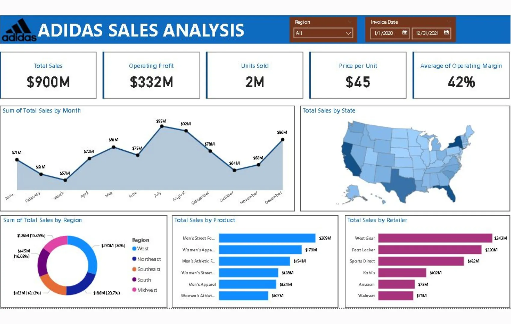

+++
title = 'Dashboard Analisis Penjualan Adidas'
date = 2025-03-10T21:37:16+07:00
draft = false
description = ""
image = "1.webp"
imageBig= "1.webp"
categories= ["Projects"]
tags= ["Power BI", "Dashboard"]
avatar="/images/Analysis_and_Visualization/profil.jpeg"
+++

## Tentang Dashboard

Dashboard Analisis Penjualan Adidas ini menyajikan visualisasi data yang bersih dan komprehensif untuk memantau kinerja bisnis. Dasbor ini menampilkan metrik-metrik fundamental seperti Total Penjualan, Laba Operasi, Unit Terjual, dan Margin Operasi Rata-rata. Pengguna dapat dengan mudah menganalisis tren penjualan bulanan, memetakan distribusi penjualan di berbagai negara bagian, serta membandingkan performa berdasarkan wilayah, kategori produk, dan mitra pengecer. Dilengkapi dengan filter interaktif untuk wilayah dan tanggal, alat ini sangat efektif untuk membantu para pemangku kepentingan dalam memahami pendorong utama penjualan dan merumuskan strategi pemasaran yang lebih tepat sasaran.

## Dashboard Preview

  
  
Tampilan dashboard utama yang merangkum metrik penjualan, profitabilitas, dan distribusi produk Adidas di berbagai wilayah.

