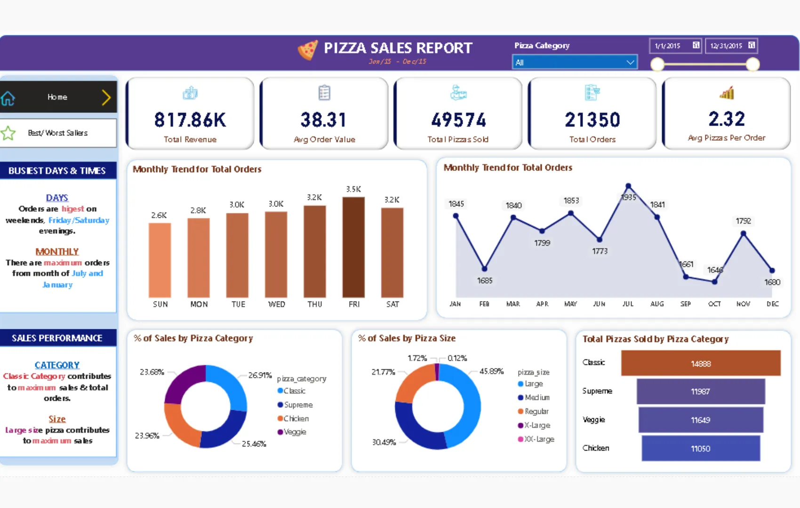
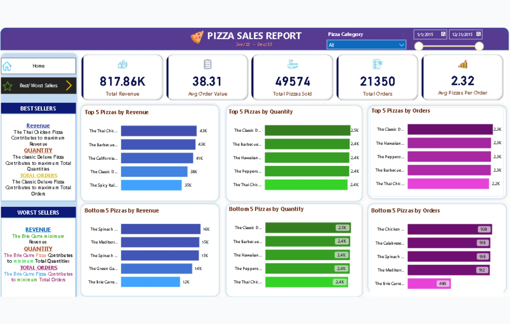

+++
title = 'Dashboard Laporan Penjualan Pizza'
date = 2025-03-10T21:37:16+07:00
draft = false
description = ""
image = "1.webp"
imageBig= "1.webp"
categories= ["Projects"]
tags= ["Power BI", "Dashboard"]
avatar="/images/Analysis_and_Visualization/profil.jpeg"
+++

## Tentang Dashboard

Laporan Penjualan Pizza ini adalah sebuah dasbor analitik yang dirancang khusus untuk bisnis restoran pizza. Dasbor ini terbagi menjadi dua bagian utama: halaman 'Home' untuk gambaran umum dan halaman 'Best/Worst Sellers' untuk analisis produk secara mendalam. Halaman utama menampilkan KPI penting seperti Total Pendapatan, Nilai Pesanan Rata-rata, dan Jumlah Pizza Terjual. Selain itu, terdapat analisis tren untuk mengidentifikasi hari dan bulan tersibuk, serta rincian penjualan berdasarkan kategori dan ukuran pizza. Halaman 'Best/Worst Sellers' memberikan peringkat produk teratas dan terbawah berdasarkan pendapatan, kuantitas, dan jumlah pesanan. Secara keseluruhan, dasbor ini memberikan wawasan yang sangat berharga untuk optimasi menu, manajemen inventaris, dan strategi promosi.

## Dashboard Preview

  
  
Halaman utama 'Home' yang menampilkan ringkasan performa penjualan, tren pemesanan, dan analisis berdasarkan kategori serta ukuran pizza.

 

  
  
Halaman 'Best/Worst Sellers' yang memberikan peringkat produk teratas dan terbawah untuk membantu dalam optimasi menu.

