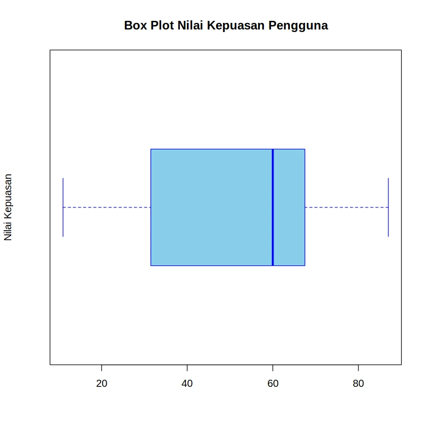

+++
title = 'Mean, Median, atau Modus: Mana yang Sebaiknya Anda Gunakan?'
date = 2025-05-21T00:37:00+00:00
draft = false
socialshare = true
description = ""
image = "1.webp"
imageBig= "1.webp"
categories= ["Quantitative"]
tags = ["R"]
authors= ["Daddy Ananta"]
avatar="/images/profil.jpeg"
+++


Saat berhadapan dengan setumpuk data, pertanyaan pertama yang sering muncul adalah, "Di mana titik pusat data ini?". Mengetahui nilai "tipikal" atau "rata-rata" adalah langkah fundamental dalam analisis data. Namun, "rata-rata" bisa berarti banyak hal. Apakah itu nilai tengah? Nilai yang paling sering muncul? Atau hasil penjumlahan yang dibagi rata?

Inilah mengapa kita memerlukan **ukuran pemusatan data** atau *tendency central*. Ukuran ini adalah sebuah nilai tunggal yang mencoba mendeskripsikan titik pusat dari sekumpulan data.

Dalam panduan ini, kita tidak hanya akan membahas 3 ukuran utama (Mean, Median, Modus), tetapi juga 2 ukuran posisi terkait (Kuartil dan Persentil) yang akan memberikan Anda pemahaman yang lebih kaya tentang distribusi data.

  

Untuk seluruh contoh, kita akan menggunakan satu set data dummy yang konsisten, yaitu **Nilai Kepuasan Pengguna** dari 20 partisipan.

  

| Partisipan | Nilai Kepuasan |
| :--- | :--- |
| 0 | 72 |
| 1 | 13 |
| 2 | 67 |
| 3 | 11 |
| 4 | 71 |
| 5 | 18 |
| 6 | 43 |
| 7 | 32 |
| 8 | 60 |
| 9 | 87 |
| 10 | 51 |
| 11 | 13 |
| 12 | 80 |
| 13 | 61 |
| 14 | 49 |
| 15 | 66 |
| 16 | 86 |
| 17 | 78 |
| 18 | 49 |
| 19 | 49 |

  
Langkah pertama dan terpenting dalam banyak perhitungan statistik adalah **mengurutkan data** dari yang terkecil hingga terbesar.


**Data Terurut:**

`11, 13, 13, 18, 32, 43, 49, 49, 49, 51, 60, 61, 66, 67, 71, 72, 78, 80, 86, 87`

Mari kita mulai bedah satu per satu.


## Bagian 1: Ukuran Pemusatan Data (Measures of Central Tendency)


Ini adalah tiga pilar utama untuk menemukan pusat data Anda.


### 1. Mean (Rata-rata Aritmetika)


Mean adalah ukuran yang paling umum dikenal. Ini adalah jumlah dari semua nilai dibagi dengan banyaknya nilai. Mean sangat baik digunakan ketika data Anda tidak memiliki nilai ekstrem (outlier) yang signifikan.
  

<div class="single-code" style="width: 100%; font: inherit; background-color: #f9f9f9; border:1px solid #ccc; color: #333; padding: 15px; border-radius: 5px; margin-bottom:20px; word-wrap: break-word; overflow-wrap: break-word;">

<p>$$n = 20$$</p>
<p>$$Mean (\bar{x}) = \frac{\sum x_i}{n}$$</p>
<p>$$Mean (\bar{x}) = \frac{11+13+13+...+86+87}{20}$$</p>
<p>$$Mean (\bar{x}) = \frac{1156}{20}$$</p>
<p>$$Mean (\bar{x}) = 57.8$$</p>
</div>

  

#### R Code

```R

# Vektor data yang sudah diurutkan untuk konsistensi

nilai_kepuasan <- c(11, 13, 13, 18, 32, 43, 49, 49, 49, 51, 60, 61, 66, 67, 71, 72, 78, 80, 86, 87)

  

mean_nilai <- mean(nilai_kepuasan)

print(paste("Mean dari data tersebut sebesar:", mean_nilai))


```

```Output
Mean dari data tersebut sebesar: 57.8
```
### 2. Median (Nilai Tengah)

Median adalah nilai yang berada tepat di tengah kumpulan data yang telah diurutkan. Median adalah pilihan yang jauh lebih baik daripada Mean ketika data Anda memiliki outlier, karena nilainya tidak terpengaruh oleh angka ekstrem.

Karena jumlah data kita genap (n=20), median adalah rata-rata dari dua nilai tengah, yaitu data ke-10 dan data ke-11.

- Data ke-10 ($x_{10}$) = 51

- Data ke-11 ($x_{11}$) = 60

  

<div class="single-code" style="width: 100%; font: inherit; background-color: #f9f9f9; border:1px solid #ccc; color: #333; padding: 15px; border-radius: 5px; margin-bottom:20px; word-wrap: break-word; overflow-wrap: break-word;">

<p>$$Median (Me) = \frac{x_{10} + x_{11}}{2}$$</p>

<p>$$Median (Me) = \frac{51 + 60}{2}$$</p>

<p>$$Median (Me) = 55.5$$</p>

</div>

  

#### R Code

```R

median_nilai <- median(nilai_kepuasan)

print(paste("Median dari data tersebut sebesar:", median_nilai))

# Output: "Median dari data tersebut sebesar: 55.5"

```

  
### 3. Modus (Nilai Paling Sering Muncul)

Modus adalah nilai yang memiliki frekuensi kemunculan tertinggi dalam data. Sebuah set data bisa tidak memiliki modus, memiliki satu modus (unimodal), dua (bimodal), atau lebih (multimodal).


Dalam data kita, nilai 49 muncul sebanyak 3 kali.


- Modus = 49

  
#### R Code

```R

# Fungsi untuk menghitung modus
hitung_modus <- function(x) {
ux <- unique(x)
tab <- tabulate(match(x, ux))
modus_nilai <- ux[tab == max(tab)]
frekuensi <- max(tab)
return(list(modus = modus_nilai, frekuensi = frekuensi))

}
  
modus_hasil <- hitung_modus(nilai_kepuasan)
print(paste("Modus dari data tersebut sebesar:", paste(modus_hasil$modus, collapse=", "), "dengan frekuensi:", modus_hasil$frekuensi))
```

```Output 

Modus dari data tersebut sebesar: 49 dengan frekuensi: 3

```

## Bagian 2: Memahami Sebaran Data dengan Ukuran Posisi

Terkadang, mengetahui pusat saja tidak cukup. Kita juga perlu tahu bagaimana data tersebar. Di sinilah Kuartil dan Persentil berperan.

### 4. Kuartil


Kuartil membagi data yang terurut menjadi empat bagian yang sama besar.

- Q1 (Kuartil Bawah) ≈ 34.75

- Q2 (Median) = 55.5

- Q3 (Kuartil Atas) ≈ 71.75

#### R Code

```R

summary_stats <- summary(nilai_kepuasan)

print(summary_stats)

# Output:

# Min. 1st Qu. Median Mean 3rd Qu. Max.

# 11.00 41.75 55.50 57.80 71.25 87.00

```


> Catatan: Nilai kuartil dari R bisa sedikit berbeda karena metode kalkulasi default (`type=7`).


Visualisasi kuartil dengan **Box Plot**:


```R

boxplot(nilai_kepuasan,

main = "Box Plot Sebaran Nilai Kepuasan",

ylab = "Nilai",

col = "skyblue",

border = "blue",

horizontal = TRUE)

```


<div>



</div>

  

### 5. Persentil


Persentil membagi data menjadi 100 bagian.


Contoh: Persentil ke-90 ($_{90}$).


- $$P_{90} \approx 85.4$$

#### R Code

```R

persentil <- quantile(nilai_kepuasan, probs = c(0.10, 0.90))

print(persentil)

# Output:

# 10% 90%

# 15.0 81.4

```

## Kesimpulan


Memahami ukuran pemusatan dan posisi adalah dasar dari literasi data. Berikut kapan menggunakannya:

- Gunakan **Mean** saat data simetris tanpa outlier.
- Gunakan **Median** saat data memiliki outlier atau condong (skewed).
- Gunakan **Modus** untuk data kategorikal atau nilai yang paling populer.
- Gunakan **Kuartil & Persentil** untuk memahami sebaran dan posisi relatif data.

Dengan memilih ukuran yang tepat, Anda akan menarik kesimpulan yang lebih akurat dan tidak mudah terkecoh oleh angka.

## Reference :

- Johnson, R. R., & Kuby, P. J. (2004). _Elementary statistics_ (9th ed.). Brooks/Cole.
