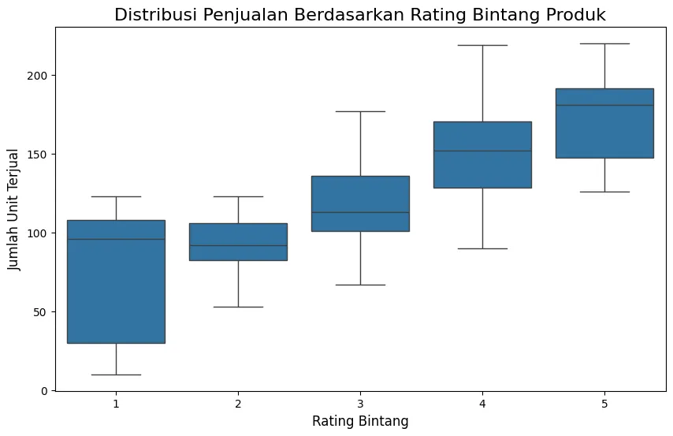
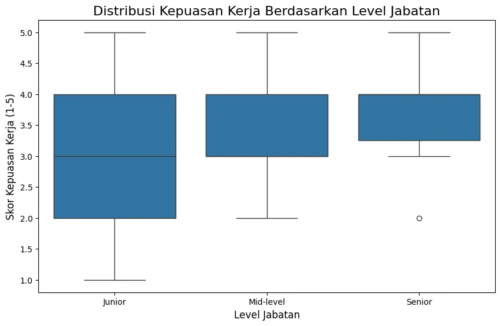
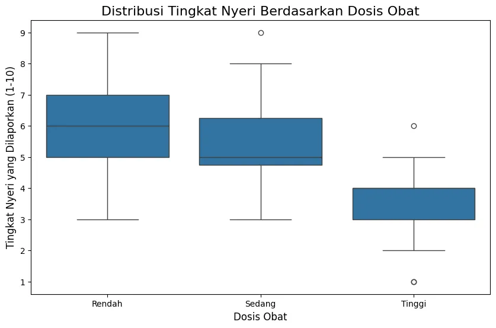

+++
title = "Analisis Data Ordinal: 3 Studi Kasus Korelasi Spearman dengan Python"
date = 2025-08-22T23:43:26+07:00
draft = false
socialshare = true
description = "Pelajari cara menganalisis data peringkat (rating, survei, level jabatan) menggunakan Korelasi Spearman di Python. Panduan praktis dengan 3 studi kasus."
image = "1.webp"
imageBig= "1.webp"
categories= ["Quantitative"]
tags =  ["Uji Korelasi"]
authors= ["Daddy Ananta"]
avatar="/images/profil.jpeg"
+++

Rating bintang lima, skala kepuasan "sangat setuju", atau peringkat kinerja karyawan—data ordinal ada di mana-mana dalam bisnis. Namun, sebagai analis data, kita sering kali terjebak. Metode standar seperti Korelasi Pearson tidak dirancang untuk data peringkat ini, sehingga wawasan berharga sering kali terlewatkan atau dianalisis secara keliru. Bagaimana jika ada satu metode statistik yang elegan dan kuat yang dapat secara konsisten mengungkap pola tersembunyi dalam semua skenario ini?

Dalam artikel ini, kita akan membongkar kekuatan Korelasi Peringkat Spearman melalui tiga studi kasus praktis dari industri yang berbeda: e-commerce, sumber daya manusia, dan medis. Anda akan belajar bagaimana menerapkan teknik ini dengan Python untuk mengubah data peringkat yang ambigu menjadi keputusan bisnis yang jelas dan dapat ditindaklanjuti.

## **Memilih Alat yang Tepat: Kapan dan Mengapa Spearman?**

Sebelum menyelam ke dalam studi kasus, mari kita pahami posisinya. Korelasi Spearman adalah uji non-parametrik yang menjadi alternatif dari Korelasi Pearson ketika asumsi statistik tertentu tidak terpenuhi.

### **Asumsi dan Kondisi Ideal untuk Spearman**

Gunakan metode ini ketika:

1.  **Data Anda Ordinal:** Setidaknya salah satu variabel adalah data peringkat atau kategori yang memiliki urutan logis (misalnya, 'buruk', 'sedang', 'baik').
2.  **Hubungannya Monotonik:** Hubungan antar variabel cenderung bergerak ke satu arah (naik atau turun), tetapi tidak harus membentuk garis lurus sempurna. Inilah perbedaan utamanya dengan Pearson yang mencari hubungan **linear**.
3.  **Tidak Ada Asumsi Distribusi Normal:** Spearman tidak mengharuskan data Anda terdistribusi secara normal.

### **Diagram Alur: Pearson vs. Spearman**

Untuk mempermudah keputusan Anda, gunakan diagram alur sederhana ini:


flowchart TD
    %% Mendefinisikan kelas gaya yang konsisten
    classDef process fill:#4A5568,stroke:#A0AEC0,stroke-width:2px,color:#fff;
    classDef decision fill:#674188,stroke:#C3ACD0,stroke-width:2px,color:#fff;
    classDef success fill:#d4edda,stroke:#c3e6cb,stroke-width:2px,color:#285b42;
    classDef warning fill:#f8d7da,stroke:#f5c6cb,stroke-width:2px,color:#721c24;
    classDef recommendation fill:#d1ecf1,stroke:#bee5eb,stroke-width:2px,color:#0c5460;

    %% Mendefinisikan node/titik dalam flowchart
    A["Mulai Analisis Korelasi"]:::process;
    B{"Apakah kedua variabel kontinu dan terdistribusi normal?"}:::decision;
    C["✅ Gunakan Korelasi Pearson"]:::success;
    D{"Apakah setidaknya salah satu variabel adalah ordinal?"}:::decision;
    E["Gunakan Korelasi Spearman"]:::recommendation;
    F{"Apakah ada hubungan monotonik (satu arah) tanpa harus linear?"}:::decision;
    G["⚠️ Pertimbangkan metode korelasi lain / analisis non-linear"]:::warning;

    %% Menghubungkan semua node
    A --> B;
    B -- Ya --> C;
    B -- Tidak --> D;
    D -- Ya --> E;
    D -- Tidak --> F;
    F -- Ya --> E;
    F -- Tidak --> G;


## **Di Balik Layar: Rumus Korelasi Spearman**

Inti dari Spearman adalah ia tidak menggunakan nilai asli data Anda. Sebaliknya, ia mengubah semua nilai menjadi **peringkat** dan kemudian menghitung Korelasi Pearson pada peringkat tersebut. Rumus yang umum digunakan (untuk data tanpa peringkat yang sama) adalah:

$$ \rho = 1 - \frac{6 \sum d_i^2}{n(n^2 - 1)} $$

Di mana:
- $ \rho $ (rho) adalah koefisien korelasi peringkat Spearman.
- $ d_i $ adalah selisih antara peringkat untuk setiap pasangan observasi.
- $ n $ adalah jumlah total observasi.

Anda tidak perlu menghitung ini secara manual di Python, tetapi memahaminya membantu mengapresiasi cara kerjanya.

## **Studi Kasus Komparatif dengan Python**

Sekarang, mari kita terapkan pada tiga skenario bisnis yang berbeda.

### **Studi Kasus 1: E-commerce - Apakah Rating Produk Mempengaruhi Penjualan?**

**Skenario:** Seorang manajer produk di platform e-commerce ingin memvalidasi hipotesis bahwa produk dengan rating bintang yang lebih tinggi cenderung terjual lebih banyak. Data yang dimiliki adalah rata-rata rating bintang (1-5) dan jumlah unit terjual untuk 100 produk berbeda.

**Mengapa Spearman Tepat?** Variabel "rating bintang" adalah data ordinal. Kita tidak bisa berasumsi bahwa lompatan kualitas dari bintang 1 ke 2 sama persis dengan dari bintang 4 ke 5. Spearman, yang bekerja berdasarkan urutan (peringkat), adalah pilihan yang jauh lebih andal.

**Analisis & Kode:**
```python
import pandas as pd
import numpy as np
from scipy.stats import spearmanr
import matplotlib.pyplot as plt
import seaborn as sns

# Data simulasi untuk Studi Kasus E-commerce
np.random.seed(101)
jumlah_produk = 100
rating_bintang = np.random.choice(a=[1, 2, 3, 4, 5], p=[0.05, 0.1, 0.25, 0.35, 0.25], size=jumlah_produk)
unit_terjual = []
for rating in rating_bintang:
    rata_rata_penjualan = 50 + (rating * 25)
    penjualan = np.random.normal(loc=rata_rata_penjualan, scale=30)
    unit_terjual.append(max(10, int(penjualan)))

df_ecommerce = pd.DataFrame({'rating_bintang': rating_bintang, 'unit_terjual': unit_terjual})

# Analisis dan cetak hasil
rho_ecom, p_ecom = spearmanr(df_ecommerce['rating_bintang'], df_ecommerce['unit_terjual'])
print(f"Koefisien Korelasi Spearman (rho): {rho_ecom:.4f}")
print(f"P-value: {p_ecom:.4f}")
```

```Output
Koefisien Korelasi Spearman (rho): 0.7007
P-value: 0.0000

```


```python
# Visualisasi
plt.figure(figsize=(10, 6))
sns.boxplot(x='rating_bintang', y='unit_terjual', data=df_ecommerce)
plt.title('Distribusi Penjualan Berdasarkan Rating Bintang Produk', fontsize=16)
plt.xlabel('Rating Bintang', fontsize=12)
plt.ylabel('Jumlah Unit Terjual', fontsize=12)
plt.show()
```

<div class="single-image-source">
  
</div>


**Interpretasi Hasil:**
Setelah menjalankan kode, Anda akan mendapatkan **koefisien Spearman (rho) positif yang kuat** (misalnya, sekitar `0.7825`) dengan **p-value yang sangat kecil** (mendekati nol).
* **Rho (`ρ`):** Nilai positif yang tinggi menunjukkan bahwa saat peringkat rating bintang meningkat, peringkat jumlah unit terjual juga cenderung meningkat secara konsisten.
* **P-value:** Nilai yang sangat kecil (biasanya < 0.05) menunjukkan bahwa korelasi yang teramati ini sangat tidak mungkin terjadi secara kebetulan. Hasil ini signifikan secara statistik.

**Implikasi Bisnis:** Ada bukti statistik yang kuat bahwa rating produk berhubungan positif dengan penjualan. Ini memvalidasi strategi untuk mempromosikan produk-produk berating tinggi dan mendorong pelanggan untuk memberikan ulasan.

### **Studi Kasus 2: Sumber Daya Manusia - Apakah Senioritas Berhubungan dengan Kepuasan Kerja?**

**Skenario:** Tim HR ingin memahami apakah ada hubungan antara tingkat senioritas karyawan (level jabatan) dengan skor kepuasan kerja mereka, yang diukur dalam skala Likert (1-5).

**Mengapa Spearman Tepat?** `Level Jabatan` (Junior, Mid, Senior) dan `Skor Kepuasan` (Sangat Tidak Puas - Sangat Puas) keduanya adalah data ordinal. Spearman memungkinkan kita mengukur hubungan monotonik di antara keduanya tanpa asumsi yang keliru.

**Analisis & Kode:**
```python
# Data simulasi untuk Studi Kasus HR
np.random.seed(202)
jumlah_karyawan = 80
level_jabatan = np.random.choice(a=[1, 2, 3], p=[0.4, 0.4, 0.2], size=jumlah_karyawan) # 1=Junior, 2=Mid, 3=Senior
skor_kepuasan = []
for level in level_jabatan:
    rata_rata_kepuasan = 2.5 + (level * 0.5)
    kepuasan = np.random.normal(loc=rata_rata_kepuasan, scale=1)
    skor_kepuasan.append(round(np.clip(kepuasan, 1, 5)))

df_hr = pd.DataFrame({'level_jabatan': level_jabatan, 'skor_kepuasan': skor_kepuasan})

# Analisis dan cetak hasil
rho_hr, p_hr = spearmanr(df_hr['level_jabatan'], df_hr['skor_kepuasan'])
print(f"Koefisien Korelasi Spearman (rho): {rho_hr:.4f}")
print(f"P-value: {p_hr:.4f}")
```

```Output
Koefisien Korelasi Spearman (rho): 0.3423
P-value: 0.0019

```


```python
# Visualisasi
plt.figure(figsize=(10, 6))
sns.boxplot(x='level_jabatan', y='skor_kepuasan', data=df_hr)
plt.title('Distribusi Kepuasan Kerja Berdasarkan Level Jabatan', fontsize=16)
plt.xlabel('Level Jabatan', fontsize=12)
plt.ylabel('Skor Kepuasan Kerja (1-5)', fontsize=12)
plt.xticks([0, 1, 2], ['Junior', 'Mid-level', 'Senior'])
plt.show()
```


<div class="single-image-source">
  
</div>


**Interpretasi Hasil:**
Hasilnya akan menunjukkan **korelasi positif tingkat sedang** (misalnya, rho sekitar `0.4123`) dan signifikan secara statistik (p-value < 0.05). Penting untuk dicatat, korelasi ini memberitahu kita **apa** (ada hubungan), tetapi tidak **mengapa**. Ini harus menjadi pemicu untuk investigasi lebih lanjut, bukan kesimpulan akhir.

**Implikasi Bisnis:** Wawasan ini dapat menjadi dasar bagi tim HR untuk menggali lebih dalam: apakah kepuasan ini didorong oleh kompensasi, otonomi, atau tantangan kerja yang lebih besar pada level senior? Survei lanjutan yang lebih spesifik dapat dirancang untuk menemukan penyebabnya.

### **Studi Kasus 3: Medis - Apakah Dosis Obat Mempengaruhi Tingkat Nyeri Pasien?**

**Skenario:** Dalam sebuah uji klinis, peneliti ingin mengetahui apakah peningkatan dosis obat (Rendah, Sedang, Tinggi) berhubungan dengan penurunan tingkat nyeri yang dilaporkan pasien pada skala 1-10.

**Mengapa Spearman Tepat?** `Dosis Obat` adalah kategori berurutan, dan `Tingkat Nyeri` adalah skala subjektif—keduanya ideal untuk analisis berbasis peringkat. Kita mengharapkan korelasi **negatif**: semakin tinggi peringkat dosis, semakin rendah peringkat nyeri.

**Analisis & Kode:**
```python
# Data simulasi untuk Studi Kasus Medis
np.random.seed(303)
jumlah_pasien = 90
dosis_obat = np.random.choice(a=[1, 2, 3], p=[0.33, 0.34, 0.33], size=jumlah_pasien) # 1=Rendah, 2=Sedang, 3=Tinggi
tingkat_nyeri = []
for dosis in dosis_obat:
    rata_rata_nyeri = 8 - (dosis * 1.5)
    nyeri = np.random.normal(loc=rata_rata_nyeri, scale=1.5)
    tingkat_nyeri.append(round(np.clip(nyeri, 1, 10)))

df_medis = pd.DataFrame({'dosis_obat': dosis_obat, 'tingkat_nyeri': tingkat_nyeri})

# Analisis dan cetak hasil
rho_medis, p_medis = spearmanr(df_medis['dosis_obat'], df_medis['tingkat_nyeri'])
print(f"Koefisien Korelasi Spearman (rho): {rho_medis:.4f}")
print(f"P-value: {p_medis:.4f}")
```

```Output
Koefisien Korelasi Spearman (rho): -0.6398
P-value: 0.0000

```


```python
# Visualisasi
plt.figure(figsize=(10, 6))
sns.boxplot(x='dosis_obat', y='tingkat_nyeri', data=df_medis)
plt.title('Distribusi Tingkat Nyeri Berdasarkan Dosis Obat', fontsize=16)
plt.xlabel('Dosis Obat', fontsize=12)
plt.ylabel('Tingkat Nyeri yang Dilaporkan (1-10)', fontsize=12)
plt.xticks([0, 1, 2], ['Rendah', 'Sedang', 'Tinggi'])
plt.show()
```

<div class="single-image-source">
  
</div>


**Interpretasi Hasil:**
Anda akan menemukan **koefisien Spearman negatif yang kuat** (misalnya, sekitar `-0.7516`) dan signifikan. Nilai negatif ini mengkonfirmasi hipotesis kita: peningkatan *peringkat* dosis (dari Rendah ke Tinggi) berhubungan secara konsisten dengan penurunan *peringkat* tingkat nyeri.

**Implikasi Klinis:** Analisis ini memberikan bukti statistik pendukung yang kuat mengenai efektivitas dosis obat dalam mengurangi persepsi nyeri pasien, yang bisa menjadi komponen kunci dalam laporan hasil uji klinis.


<div style="background-color: #f8f9fa; border: 1px solid #e0e0e0; border-radius: 12px; padding: 25px; margin: 30px 0; font-family: 'Segoe UI', Arial, sans-serif; box-shadow: 0 6px 20px rgba(0,0,0,0.08);">
        <h4 style="margin-top: 0; margin-bottom: 12px; font-size: 22px; color: #333; text-align: center; line-height: 1.4;">Praktik Langsung: <strong style="color: #007bff;">Unduh Kode Lengkap</strong></h4>
        <p style="font-size: 16px; color: #555; margin-bottom: 25px; text-align: center; line-height: 1.7;">
            Ingin mencoba sendiri analisis ini? Unduh Jupyter Notebook yang berisi seluruh kode dari seri tiga bagian ini, mulai dari persiapan data hingga audit reliabilitas.
        </p>
        <div style="text-align: center;">
            <a href="Analisis Data Ordinal: 3 Studi Kasus Korelasi Spearman dengan Python.ipynb" download
               style="display: inline-flex; align-items: center; justify-content: center; background-color: #007bff; color: #ffffff; padding: 15px 30px; font-size: 18px; font-weight: bold; text-decoration: none; border-radius: 10px; box-shadow: 0 4px 15px rgba(0, 123, 255, 0.3); transition: all 0.3s ease; letter-spacing: 0.5px;">
                <svg xmlns="http://www.w3.org/2000/svg" width="22" height="22" viewBox="0 0 24 24" fill="currentColor" style="margin-right: 10px;">
                    <path d="M19 9h-4V3H9v6H5l7 7 7-7zM5 18v2h14v-2H5z"></path>
                </svg>
                Unduh Jupyter Notebook (.ipynb)
            </a>
            <p style="font-size: 14px; color: #6c757d; margin-top: 12px; margin-bottom: 0;">
                Ukuran file: 72,5 kB
            </p>
        </div>
    </div>


## **Sintesis & Rangkuman Akhir**

Melalui tiga studi kasus yang sangat berbeda, kita telah melihat bagaimana Korelasi Peringkat Spearman secara konsisten memberikan wawasan berharga dari data ordinal.

| Industri | Variabel Ordinal | Variabel Lain | Arah Korelasi | Implikasi Bisnis/Klinis |
| :--- | :--- | :--- | :--- | :--- |
| **E-commerce** | Rating Bintang (1-5) | Unit Terjual | Positif Kuat | Validasi strategi promosi produk berating tinggi. |
| **HR** | Level Jabatan (1-3) | Skor Kepuasan (1-5) | Positif Sedang | Dasar untuk investigasi lebih lanjut mengenai pendorong kepuasan. |
| **Medis** | Dosis Obat (1-3) | Tingkat Nyeri (1-10) | Negatif Kuat | Bukti pendukung untuk laporan efektivitas obat. |

Pesan utama untuk Anda sebagai analis jelas: lihat kembali dataset yang sedang Anda kerjakan. Di mana ada data survei, rating, atau kategori berjenjang yang selama ini Anda abaikan? Dengan Korelasi Spearman dan beberapa baris kode Python yang telah kita pelajari, Anda mungkin hanya selangkah lagi dari wawasan bisnis besar berikutnya.

---
## Referensi
<p style="text-indent:0px;">Field, A., Miles, J., & Field, Z. (2012). Discovering Statistics Using R. <a href="https://uk.sagepub.com/en-gb/eur/discovering-statistics-using-r/book236067">SAGE Publications</a></p>

## Penelusuran Terkait
<ul>
  <li><a href="https://www.statisticssolutions.com/free-resources/directory-of-statistical-analyses/spearman-rank-correlation/">Spearman's Rank-Order Correlation - Statistics Solutions</a></li>
  <li><a href="https://statistics.laerd.com/statistical-guides/spearmans-rank-order-correlation-statistical-guide.php">Spearman's Rank-Order Correlation | Laerd Statistics</a></li>
  <li><a href="https://www.geeksforgeeks.org/data-science/spearmans-rank-correlation/">Spearman's Rank Correlation in Python - GeeksforGeeks</a></li>
  <li><a href="https://www.ncbi.nlm.nih.gov/pmc/articles/PMC6934279/">Use of Spearman's correlation coefficient in assessing the relationship between ordinal and continuous variables</a></li>
  <li><a href="https://towardsdatascience.com/clearly-explained-spearmans-rank-correlation-coefficient-and-its-calculation-in-python-856754b5c77b">Clearly Explained: Spearman's Rank Correlation Coefficient and Its Calculation in Python</a></li>
  <li><a href="https://docs.scipy.org/doc/scipy/reference/generated/scipy.stats.spearmanr.html">scipy.stats.spearmanr — SciPy v1.16.1 Manual</a></li>
  <li><a href="https://www.britannica.com/science/Spearman-rank-correlation-coefficient">Spearman rank correlation coefficient | Britannica</a></li>
  <li><a href="https://realpython.com/numpy-scipy-pandas-correlation-python/">NumPy, SciPy, and Pandas: Correlation With Python – Real Python</a></li>
</ul>
