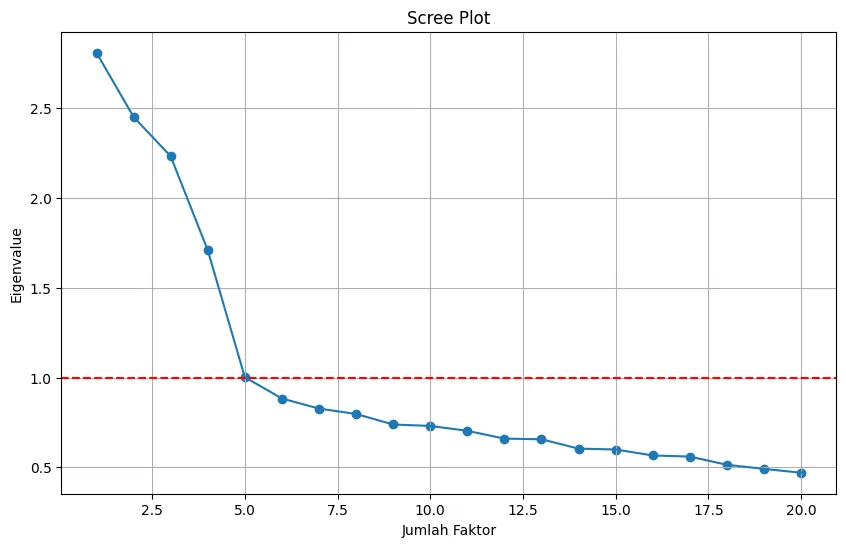
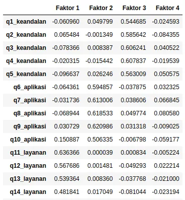
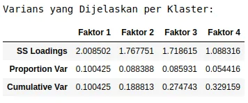

+++
title = "Analisis Faktor (Bagian 2): Dari 20 Variabel ke 4 Claster dengan Python - Analisis dan Keputusan"
date = 2025-08-25T01:37:00+00:00
draft = false
socialshare = true
description = ""
image = "6.webp"
imageBig= "6.webp"
categories= ["Quantitative"]
tags = ["Python", "Statistic"]
authors= ["Daddy Ananta"]
avatar="/images/profil.jpeg"
+++


## Pengantar Seri

<div style="background-color: #f8f7fa; border: 1px solid #e0dce6; border-radius: 12px; padding: 24px; font-family: 'Segoe UI', Arial, sans-serif; margin-bottom: 2.5em; box-shadow: 0 4px 12px rgba(0,0,0,0.05);">      <p style="background-color: #fff3e0; color: #b45309; padding: 16px; border-radius: 8px; line-height: 1.6;">         Selamat datang di <strong>bagian kedua</strong> dari seri Analisis Faktor kami. Setelah meletakkan fondasi yang kokoh dan memvalidasi data kita di Bagian 1, kini saatnya untuk melakukan analisis inti. Di sini, Anda akan belajar bagaimana mengubah 20 variabel survei menjadi beberapa pilar strategis yang jernih dan dapat ditindaklanjuti.     </p>    <div style="display: flex; flex-wrap: wrap; justify-content: center; gap: 16px; margin-top: 20px;">         <a href="https://daddyananta.github.io/posts/quantitative/analisis-faktor-bagian-1-mempersiapkan-data-survei-untuk-mengungkap-insight-dengan-python/#link-ke-bagian-3" style="flex: 1; min-width: 280px; border: 1px solid #d3d3d3; background-color: #ffffff; color: #333; text-decoration: none; padding: 16px; border-radius: 8px; text-align: center; transition: all 0.3s ease;" onmouseover="this.style.boxShadow='0 0 15px rgba(106, 27, 154, 0.6)'; this.style.borderColor='#6a1b9a';" onmouseout="this.style.boxShadow='none'; this.style.borderColor='#d3d3d3';">             <div style="font-size: 0.9em; color: #888; margin-bottom: 4px;">LANGKAH 1</div>             <div style="font-weight: 500; margin-bottom: 4px;">Persiapan & Uji Kelayakan</div>             <div style="font-size: 0.85em; color: #888;">Memvalidasi data Anda</div>         </a>         <a href="#link-ke-bagian-2" style="flex: 1; min-width: 280px; border: 2px solid #6a1b9a; background-color: #f3e5f5; color: #333; text-decoration: none; padding: 16px; border-radius: 8px; text-align: center; transition: all 0.3s ease;">             <div style="font-size: 0.9em; color: #6a1b9a; margin-bottom: 4px;"><strong>LANGKAH 2</strong></div>             <div style="font-weight: bold; margin-bottom: 4px;"><strong>Analisis & Keputusan</strong></div>             <div style="font-size: 0.85em; color: #555;"><strong>Anda di sini</strong></div>         </a>         <a href="https://daddyananta.github.io/posts/quantitative/analisis_faktor_bagian_3_mengaudit_reliabilitas_pilar_ux_anda_dengan_cronbachs_alpha_di_python/" style="flex: 1; min-width: 280px; border: 1px solid #d3d3d3; background-color: #ffffff; color: #333; text-decoration: none; padding: 16px; border-radius: 8px; text-align: center; transition: all 0.3s ease;" onmouseover="this.style.boxShadow='0 0 15px rgba(106, 27, 154, 0.6)'; this.style.borderColor='#6a1b9a';" onmouseout="this.style.boxShadow='none'; this.style.borderColor='#d3d3d3';">             <div style="font-size: 0.9em; color: #888; margin-bottom: 4px;">LANGKAH 3</div>             <div style="font-weight: 500; margin-bottom: 4px;">Audit & Validasi</div>             <div style="font-size: 0.85em; color: #888;">Memastikan kualitas skala</div>         </a>     </div> </div>

## Landasan Teori: Nilai Eigen dan Rotasi Faktor
* **Nilai Eigen (Eigenvalue):** Merepresentasikan jumlah varians yang dijelaskan oleh satu faktor. Aturan praktis **Kaiser's Criterion** menyarankan untuk mempertahankan faktor dengan **Nilai Eigen > 1** (menurut Kaiser, 1960).
* **Rotasi Faktor:** Adalah proses "memutar" sumbu faktor untuk mencapai **struktur sederhana** (*simple structure*), di mana setiap item memiliki korelasi tinggi (**_loading_**) dengan satu faktor saja. Ini krusial untuk interpretasi (menurut Hair et al., 2010).

Proses rotasi secara matematis dapat direpresentasikan sebagai berikut:
<div class="single-code" style="width: 100%; font: inherit; background-color: #f9f9f9; border:1px solid #ccc; color: #333; padding: 10px; border-radius: 5px; margin-bottom:20px; word-wrap: break-word; overflow-wrap: break-word; max-height: 200px; overflow-y: auto;"><p>$$A_{rot} = A \Lambda$$</p> </div>

## Momen Penentuan: Menemukan Jumlah Klaster dari 20 Variabel
Kita akan menggunakan Scree Plot dan Kaiser's Criterion dari data `df_ux_survey` yang sudah kita siapkan.

```python
# Diasumsikan 'df_ux_survey' sudah ada dari Bagian 1

import pandas as pd
from factor_analyzer import FactorAnalyzer
import matplotlib.pyplot as plt

# Jalankan EFA awal untuk mendapatkan nilai eigen (eigenvalues)
fa = FactorAnalyzer(n_factors=20, rotation=None)
fa.fit(df_ux_survey)
ev, v = fa.get_eigenvalues()

# Membuat Scree Plot untuk visualisasi
plt.figure(figsize=(10, 6))
plt.scatter(range(1, df_ux_survey.shape[1] + 1), ev)
plt.plot(range(1, df_ux_survey.shape[1] + 1), ev)
plt.title('Scree Plot')
plt.xlabel('Jumlah Faktor')
plt.ylabel('Nilai Eigen (Eigenvalue)')
plt.axhline(y=1, color='r', linestyle='--')
plt.grid()
plt.show()
````

<div class="single-image-source">  </div>

Hasilnya sangat jelas: **tepat 4 faktor memiliki Nilai Eigen di atas 1**, dan **patahan pada Scree Plot juga terjadi setelah faktor ke-4**. Konsistensi ini memberi kita keyakinan tinggi untuk melanjutkan analisis dengan 4 klaster. Secara standar, nilai eigen >1 menurut Kaiser's Criterion, tapi pertimbangkan parallel analysis jika scree plot ambigu (Cattell, 1966).

> **Pro-Tip: Bagaimana Jika Scree Plot Ambigu?** Di dunia nyata, Scree Plot bisa jadi memiliki dua 'siku' atau tidak jelas sama sekali. Jika ini terjadi, teori dan interpretasi menjadi raja. Coba ekstrak kedua jumlah faktor (misalnya, 3 dan 4) dan pilih solusi yang menghasilkan klaster-klaster yang paling logis dan dapat diinterpretasikan secara bisnis. Gunakan parallel analysis untuk verifikasi, tersedia di library factor_analyzer, untuk menghindari over-extraction.

## Mengungkap Pola: Mengidentifikasi Item per Klaster

Setelah yakin dengan 4 klaster, kita jalankan analisis final dengan rotasi **Varimax**. Hasilnya adalah sebuah **matriks _loadings_**, yaitu tabel "kekuatan hubungan" antara setiap item dan setiap faktor.


```Python
# Menjalankan EFA dengan 4 faktor dan rotasi varimax
fa_final = FactorAnalyzer(n_factors=4, rotation='varimax')
fa_final.fit(df_ux_survey)

# Mendapatkan matriks loadings dalam DataFrame yang rapi
loadings = pd.DataFrame(
    fa_final.loadings_,
    index=df_ux_survey.columns,
    columns=['Faktor 1', 'Faktor 2', 'Faktor 3', 'Faktor 4']
)
print("Matriks Loadings (Kekuatan Hubungan):")
loadings
```

<div class="single-image-source">  </div>

Tabel di atas adalah hasilnya, tetapi bagaimana kita mengubahnya menjadi klaster? Aturan keputusannya sederhana dan **sepenuhnya berdasarkan data**:

> **Setiap item dimasukkan ke dalam klaster (faktor) di mana ia memiliki nilai _loading_ absolut tertinggi.**

Kode berikut mengotomatiskan aturan ini untuk kita.


```Python
# Kode untuk mengidentifikasi dan menampilkan item per klaster secara sistematis
klaster_items = {}

# Mendapatkan nama faktor dengan loading tertinggi untuk setiap item
highest_loading_factor = loadings.idxmax(axis=1)

# Mengelompokkan item berdasarkan faktornya
for item, factor_name in highest_loading_factor.items():
    if factor_name not in klaster_items:
        klaster_items[factor_name] = []
    klaster_items[factor_name].append(item)

print("\n--- Klaster yang Teridentifikasi Berdasarkan Hasil Analisis ---")
for factor, items in klaster_items.items():
    print(f"\n{factor}:")
    for item in sorted(items):
        print(f" - {item}")
```

### Interpretasi Hasil Akhir: 4 Klaster Pengalaman Pengguna

Kode di atas secara otomatis mengelompokkan 20 item kita ke dalam 4 klaster yang jernih, yang sekarang bisa kita beri nama berdasarkan tema item di dalamnya. Nama ini didasarkan pada tema item dominan, seperti 'q1_keandalan' untuk Klaster 2:

1. **Klaster 1 (Faktor 1): Layanan & Dukungan**
    
2. **Klaster 2 (Faktor 2): Keandalan & Logistik**
    
3. **Klaster 3 (Faktor 3): Pengalaman Aplikasi**
    
4. **Klaster 4 (Faktor 4): Nilai & Harga**
    

Selain mengidentifikasi klaster, kita bisa melihat **kepentingan relatifnya**. Periksa varians yang dijelaskan oleh setiap faktor. Faktor dengan varians tertinggi dapat dianggap sebagai pilar yang memiliki pengaruh paling dominan dalam data survei kita, menjadikannya prioritas utama untuk diperhatikan. Dalam konteks medis, misalnya, klaster ini bisa diterapkan untuk menganalisis faktor-faktor dalam survei pasien rheumatology seperti gout management.


```Python
# Mendapatkan varians yang dijelaskan oleh setiap faktor
variance_explained = pd.DataFrame(
    fa_final.get_factor_variance(),
    index=['SS Loadings', 'Proportion Var', 'Cumulative Var'],
    columns=['Faktor 1', 'Faktor 2', 'Faktor 3', 'Faktor 4']
)
print("\nVarians yang Dijelaskan per Klaster:")
variance_explained
```

<div class="single-image-source">  </div>

Dalam bidang psikologi pendidikan, pendekatan ini bisa membantu mengidentifikasi klaster dalam survei pembelajaran siswa. Melalui analisis faktor ini, kita telah mentransformasi data kompleks menjadi klaster actionable yang mendukung keputusan strategis. Pendekatan berbasis data ini tidak hanya menyederhanakan interpretasi, tapi juga membuka peluang untuk aplikasi di penelitian medis dan pendidikan, memastikan insight yang reliabel dan impactful.

 
<div style="background-color: #f8f9fa; border: 1px solid #e0e0e0; border-radius: 12px; padding: 25px; margin: 30px 0; font-family: 'Segoe UI', Arial, sans-serif; box-shadow: 0 6px 20px rgba(0,0,0,0.08);">
    <h4 style="margin-top: 0; margin-bottom: 12px; font-size: 22px; color: #333; text-align: center; line-height: 1.4;">Praktik Langsung: <strong style="color: #007bff;">Unduh Kode Lengkap</strong></h4>
    <p style="font-size: 16px; color: #555; margin-bottom: 25px; text-align: center; line-height: 1.7;">
        Ingin mencoba sendiri analisis ini? Unduh Jupyter Notebook yang berisi seluruh kode dari seri tiga bagian ini, mulai dari persiapan data hingga audit reliabilitas.
    </p>
    <div style="text-align: center;">
        <a href="/download/Quantitative/Seri_Analisis_Faktor/Analisis Faktor.ipynb" download
           style="display: inline-flex; align-items: center; justify-content: center; background-color: #007bff; color: #ffffff; padding: 15px 30px; font-size: 18px; font-weight: bold; text-decoration: none; border-radius: 10px; box-shadow: 0 4px 15px rgba(0, 123, 255, 0.3); transition: all 0.3s ease; letter-spacing: 0.5px;">
            <svg xmlns="http://www.w3.org/2000/svg" width="22" height="22" viewBox="0 0 24 24" fill="currentColor" style="margin-right: 10px;">
                <path d="M19 9h-4V3H9v6H5l7 7 7-7zM5 18v2h14v-2H5z"></path>
            </svg>
            Unduh Jupyter Notebook (.ipynb)
        </a>
        <p style="font-size: 14px; color: #6c757d; margin-top: 12px; margin-bottom: 0;">
            Ukuran file: 68,8 kB
        </p>
    </div>
</div>


<a href="https://daddyananta.github.io//categories/quantitative/">Perdalam pemahaman Quantitative Anda di sini</a>

## Referensi

<p style="text-indent:0px;">Kaiser, H.F. (1960). The application of electronic computers to factor analysis. <a href="https://doi.org/10.1177/001316446002000116">Educational and Psychological Measurement</a></p>
<p style="text-indent:0px;">
  Hair, J.F., Black, W.C., Babin, B.J., & Anderson, R.E. (2010). Multivariate Data Analysis (7th ed.). 
  <a href="https://books.google.com/books/about/Multivariate_Data_Analysis.html?id=SLRPLgAACAAJ">Pearson Education</a>
</p>

<p style="text-indent:0px;">Cattell, R.B. (1966). The scree test for the number of factors. <a href="https://doi.org/10.1207/s15327906mbr0102_10">Multivariate Behavioral Research</a></p>


## Penelusuran Terkait

- <a href="https://www.apa.org/pubs/journals/features/met-met0000074.pdf">[PDF] An Empirical Kaiser Criterion - American Psychological Association</a>
    
- <a href="https://journals.sagepub.com/doi/10.1177/00131644241308528">A Comparison of the Next Eigenvalue Sufficiency Test to Other ...</a>
    
- <a href="https://web.pdx.edu/~newsomj/semclass/ho_efa.pdf">[PDF] A QUICK PRIMER ON EXPLORATORY FACTOR ANALYSIS</a>
    
- <a href="https://pmc.ncbi.nlm.nih.gov/articles/PMC9265486/">Factor Retention Using Machine Learning With Ordinal Data - PMC</a>
    
- <a href="http://www.diva-portal.org/smash/get/diva2:896127/FULLTEXT01.pdf">[PDF] A Monte Carlo Study Comparing Three Methods for Determining the ...</a>
    
- <a href="https://www.frontiersin.org/journals/psychology/articles/10.3389/fpsyg.2019.00645/full">Varimax Rotation Based on Gradient Projection Is a ...</a>
    
- <a href="https://stackoverflow.com/questions/62303782/is-there-a-way-to-conduct-a-parallel-analysis-in-python">Is there a way to conduct a parallel analysis in Python?</a>
    
- <a href="https://www.sciencedirect.com/topics/nursing-and-health-professions/varimax-rotation">Varimax Rotation - an overview</a>