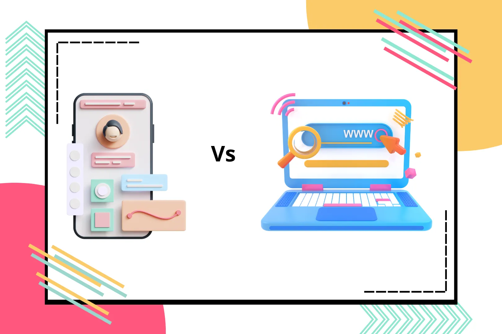

+++
title= "Apel vs Jeruk di UX Research: Kapan Menggunakan Paired vs. Independent t-Test?"
date = 2025-06-24T00:37:00+00:00
draft = false
socialshare = true
description = ""
image = "1.webp"
imageBig= "1.webp"
categories= [ "Quantitative" ] 
tags= [ "Uji-T", "A/B Testing", "Desain Eksperimen", "Statistik UX", "Metodologi Riset" ]
authors= ["Daddy Ananta"]
avatar="/images/profil.jpeg"
+++

<div style="background-color:#f9f9f9; border: 1px solid #d3d3d3; padding: 15px; font-family: Arial, sans-serif;margin-bottom: 20px;">
  <p style="font-style: italic;">"To call in the statistician after the experiment is done may be no more than asking him to perform a post-mortem examination: he may be able to say what the experiment died of."</p>
  <p style="text-align: right; font-size: 0.9em; margin-top: 10px; color: #555;">- R. A. Fisher, <span style="font-weight: bold;">Presidential Address, Indian Statistical Congress</span></p>
</div>

Dalam riset UX, puncak dari validasi desain sering kali bermuara pada satu pertanyaan: "Apakah Desain B lebih baik dari Desain A?" Entah itu membandingkan alur checkout baru dengan yang lama, atau menguji situs kita melawan pesaing, kita mendambakan jawaban yang pasti. Namun, jawaban yang didasarkan hanya pada perbandingan skor rata-rata bisa sangat menipu. Dunia nyata dipenuhi variabilitas acak. Untuk menavigasi ketidakpastian ini dan membuat klaim yang kredibel, kita harus memilih desain studi dan alat statistik yang tepat sebelum data pertama terkumpul.

Untuk memahaminya, mari kita bayangkan seorang tukang kebun yang ingin menguji dua jenis pupuk baru (Pupuk A dan Pupuk B) pada tanaman tomatnya.

<div class="single-image-source">
  
  <p style="font-size: 16px; color: #888; margin-top:-15px; text-align: center;"></p>
</div>

**Pendekatan Pertama (Independen):** Ia menanam 20 tomat di petak kebun timur dengan Pupuk A, dan 20 tomat lainnya di petak kebun barat dengan Pupuk B. Setelah sebulan, ia membandingkan tinggi rata-rata tanaman di petak timur dengan petak barat. Masalahnya? Jika tanaman di petak barat lebih tinggi, apakah itu karena pupuknya, atau karena petak barat kebetulan mendapat lebih banyak sinar matahari atau memiliki tanah yang lebih subur? Perbedaan alami antar petak ini adalah "kebisingan" yang dapat mengaburkan efek sebenarnya dari pupuk. Inilah tantangan dari uji antar-subjek (*between-subjects*).

**Pendekatan Kedua (Berpasangan):** Kali ini, ia menanam 20 pasang bibit tomat yang identik, bersebelahan di seluruh kebunnya. Dalam setiap pasangan, satu tanaman mendapat Pupuk A dan yang lainnya mendapat Pupuk B. Setelah sebulan, ia tidak membandingkan rata-rata grup, melainkan menghitung perbedaan tinggi di dalam *setiap pasangan*, lalu merata-ratakan perbedaan tersebut. Dengan cara ini, efek dari lokasi (sinar matahari, tanah) secara efektif dihilangkan, karena kedua tanaman dalam satu pasangan mengalaminya bersama-sama. Ini adalah inti dari uji dalam-subjek (*within-subjects*), sebuah metode yang jauh lebih tajam untuk mendeteksi perbedaan yang sesungguhnya.

## Kerangka Kontrafaktual Mengejar Kausalitas dalam Desain

Pilihan antara dua pendekatan ini lebih dari sekadar teknis; ia menyentuh jantung dari inferensi kausal. Dalam statistik, terdapat Kerangka Kontrafaktual (*Counterfactual Framework*) untuk memahami sebab dan akibat. Untuk mengetahui efek sebenarnya dari sebuah "perlakuan" (misalnya, desain baru), kita idealnya perlu membandingkan hasil yang kita amati dengan hasil kontrafaktual—yaitu, apa yang akan terjadi pada orang yang sama persis, pada waktu yang sama persis, jika mereka mendapatkan perlakuan yang berbeda (misalnya, desain lama).

Tentu saja, kita tidak bisa memutar waktu dan menguji orang yang sama dalam dua realitas paralel. Namun:

* **Desain Dalam-Subjek (Paired t-test):** Adalah upaya terdekat kita untuk meniru kondisi kontrafaktual ini. Setiap peserta bertindak sebagai kontrol bagi dirinya sendiri. Variabilitas unik mereka—kecepatan membaca, keakraban dengan teknologi, suasana hati—dieliminasi dari perbandingan karena ada di kedua kondisi. Kita menganalisis selisih skor dari setiap individu, membuatnya sangat efisien dalam mendeteksi efek nyata dari desain.
* **Desain Antar-Subjek (Two-sample t-test):** Menggunakan grup yang berbeda sebagai perkiraan untuk kondisi kontrafaktual. Kita berasumsi, dengan randomisasi, bahwa Grup B secara rata-rata setara dengan Grup A. Namun, kita masih harus memperhitungkan variabilitas alami antar individu di kedua grup, yang membuatnya kurang kuat secara statistik.

## Memilih Alat yang Tepat Paired vs Two-Sample t-test

Pemilihan desain studi Anda secara langsung menentukan alat statistik yang Anda gunakan untuk data kontinu (skor kepuasan, waktu tugas, dll.).

**Paired t-test (untuk Desain Dalam-Subjek):**
Ketika pengguna yang sama mengevaluasi kedua desain (A dan B), Anda menghitung selisih skor untuk setiap pengguna dan melakukan t-test pada selisih tersebut.

<div class="single-code" style="width: 100%; font: inherit; background-color: #f9f9f9; border:1px solid #ccc; color: #333; padding: 10px; border-radius: 5px; margin-bottom:20px; word-wrap: break-word; overflow-wrap: break-word; max-height: 200px; overflow-y: auto;">
  <p>
$$ t = \frac{\bar{D}}{s_D / \sqrt{n}} $$
  </p>
</div>

Di mana $\bar{D}$ adalah rata-rata selisih skor, dan $s_D$ adalah standar deviasinya.

**Two-Sample t-test (untuk Desain Antar-Subjek):**
Ketika dua grup pengguna yang berbeda mengevaluasi desain A dan B, Anda membandingkan rata-rata kedua grup secara langsung.

<div class="single-code" style="width: 100%; font: inherit; background-color: #f9f9f9; border:1px solid #ccc; color: #333; padding: 10px; border-radius: 5px; margin-bottom:20px; word-wrap: break-word; overflow-wrap: break-word; max-height: 200px; overflow-y: auto;">
  <p>
$$ t = \frac{\bar{x}_1 - \bar{x}_2}{\sqrt{\frac{s_1^2}{n_1} + \frac{s_2^2}{n_2}}} $$
  </p>
</div>

Di mana $\bar{x}_1$ dan $\bar{x}_2$ adalah rata-rata kedua grup, dengan standar deviasi $s_1$ dan $s_2$.

## Contoh Kasus

### Kekuatan Desain Dalam-Subjek oleh Nielsen Norman Group

<div class="single-image-source">
  
  <p style="font-size: 16px; color: #888; margin-top:-15px; text-align: center;"></p>
</div>

Berdasarkan riset dari Nielsen Norman Group (NN/g), studi awal mereka secara meyakinkan menunjukkan bahwa pengguna mendapatkan pengalaman yang lebih baik saat menggunakan aplikasi seluler dibandingkan situs seluler. Dalam artikelnya, **[Mobile Sites vs. Apps: The Coming Strategy Shift](https://www.nngroup.com/articles/mobile-sites-vs-apps-strategy-shift/)**, NN/g menyatakan bahwa keunggulan ini disebabkan oleh kemampuan aplikasi untuk mengoptimalkan performa secara mendalam sesuai batasan perangkat seperti layar kecil dan konektivitas yang lambat, terutama untuk tugas-tugas yang kaya fitur.

Namun, dalam riset yang lebih baru mengenai **[kematangan pengalaman pengguna seluler](https://www.nngroup.com/articles/state-mobile-ux/)**, NN/g mengamati bahwa batas antara aplikasi dan situs web seluler menjadi semakin kabur dari perspektif pengguna. Perkembangan teknologi seperti _Progressive Web Apps_ (PWA), yang membuat situs berfungsi seperti aplikasi, serta _App Clips_ dan _Instant Apps_ yang memungkinkan penggunaan fitur aplikasi tanpa instalasi penuh, telah membuat perbedaan antara kedua platform tersebut menjadi kurang signifikan bagi pengguna.

## Melampaui Signifikansi Statistik Menuju Dampak Praktis
Menemukan *p-value* yang rendah (misalnya, $p < 0.05$) memang menggembirakan; itu menunjukkan perbedaan yang kita lihat mungkin nyata. Namun, seperti yang sering diingatkan, "Signifikansi statistik bukanlah hal yang sama dengan kepentingan praktis." Selalu laporkan selang kepercayaan (*confidence interval*) di sekitar perbedaan rata-rata. Selang ini memberi tahu Anda rentang besarnya perbedaan yang sesungguhnya. Perbedaan waktu tugas sebesar 0.2 detik mungkin signifikan secara statistik dengan jutaan pengguna, tetapi sama sekali tidak penting secara praktis.

## Contoh Soal dan Penerapannya
**Skenario:**
Sebuah tim desain produk ingin mengetahui apakah mengganti tombol teks "Tambah ke Keranjang" dengan ikon keranjang belanja dapat meningkatkan kepuasan pengguna saat berbelanja. Mereka memutuskan untuk menguji ini pada 12 pengguna.

**Pertanyaan:** Metode mana yang harus mereka gunakan, dan bagaimana hasilnya dianalisis?

**Opsi 1: Desain Dalam-Subjek (Paired t-test)**
Setiap dari 12 pengguna melakukan tugas belanja menggunakan kedua versi antarmuka (urutannya diacak) dan memberikan skor kepuasan (skala 1-7) setelah setiap tugas.

**Data (Skor Kepuasan):**
| Pengguna | Versi Teks (A) | Versi Ikon (B) | Selisih (B - A) |
| :--- | :---: | :---: | :---: |
| 1 | 5 | 6 | 1 |
| 2 | 4 | 5 | 1 |
| 3 | 6 | 6 | 0 |
| 4 | 5 | 7 | 2 |
| 5 | 3 | 5 | 2 |
| 6 | 5 | 5 | 0 |
| 7 | 4 | 6 | 2 |
| 8 | 5 | 4 | -1 |
| 9 | 4 | 5 | 1 |
| 10 | 5 | 7 | 2 |
| 11 | 6 | 5 | -1 |
| 12 | 4 | 6 | 2 |
| **Rata-rata** | **4.67** | **5.58** | **0.92** |
| **Std. Dev.**| **0.89** | **0.79** | **1.08** |


### **Langkah Analisis (Paired t-test):**

1.  **Fokus pada Kolom Selisih:** Kita hanya perlu data dari kolom "Selisih".
2.  **Hitung Statistik Selisih:** Rata-rata selisih ($\bar{D}$) = 0.92. Standar deviasi selisih ($s_D$) = 1.08. Ukuran sampel ($n$) = 12.
3.  **Hitung t-value:**
<div class="single-code" style="width: 100%; font: inherit; background-color: #f9f9f9; border:1px solid #ccc; color: #333; padding: 10px; border-radius: 5px; margin-bottom:20px; word-wrap: break-word; overflow-wrap: break-word; max-height: 200px; overflow-y: auto;">
  <p>
$$ t = \frac{\bar{D}}{s_D / \sqrt{n}} = \frac{0.92}{1.08 / \sqrt{12}} = \frac{0.92}{0.312} \approx 2.95 $$
  </p>
</div>

4. **Interpretasi:** Dengan derajat kebebasan $df=11$ ($12-1$), nilai $t=2.95$ menghasilkan $p$-value $\approx 0.013$. Karena $p < 0.05$, kita dapat menyimpulkan bahwa terdapat perbedaan kepuasan yang signifikan secara statistik. Versi ikon dinilai lebih tinggi.

### **Opsi 2: Desain Antar-Subjek (Two-Sample t-test)**

Tim merekrut dua grup yang berbeda. 12 pengguna di Grup 1 menguji versi teks, dan 12 pengguna lain di Grup 2 menguji versi ikon. (Kita akan gunakan data yang sama untuk ilustrasi).

**Langkah Analisis (Two-Sample t-test):**

1.  **Fokus pada Statistik Setiap Grup:**
    * Grup 1 (Teks): $\bar{x}_1=4.67$, $s_1=0.89$, $n_1=12$
    * Grup 2 (Ikon): $\bar{x}_2=5.58$, $s_2=0.79$, $n_2=12$
2.  **Hitung t-value:**
<div class="single-code" style="width: 100%; font: inherit; background-color: #f9f9f9; border:1px solid #ccc; color: #333; padding: 10px; border-radius: 5px; margin-bottom:20px; word-wrap: break-word; overflow-wrap: break-word; max-height: 200px; overflow-y: auto;">
  <p>
$$ t = \frac{4.67 - 5.58}{\sqrt{\frac{0.89^2}{12} + \frac{0.79^2}{12}}} = \frac{-0.91}{\sqrt{0.066 + 0.052}} = \frac{-0.91}{0.344} \approx -2.65 $$
  </p>
</div>
3. **Interpretasi:** Dengan derajat kebebasan sekitar 21.8, nilai $t=-2.65$ menghasilkan $p$-value $\approx 0.015$. Hasilnya masih signifikan, tetapi perhatikan bahwa nilai t-nya lebih rendah. Dalam kasus di mana perbedaannya lebih kecil, "kebisingan" dari variasi antar grup bisa dengan mudah membuat $p$-value melewati ambang 0.05, sehingga kita gagal mendeteksi perbedaan yang sebenarnya ada. Ini menunjukkan kekuatan superior dari desain dalam-subjek.


### Otomatisasi Perhitungan dengan Python
Kita dapat membuat fungsi untuk setiap jenis analisis menggunakan *library* `scipy.stats` di Python untuk membandingkan kedua pendekatan secara langsung.

```python
import numpy as np
from scipy import stats

# --- Data yang Perlu Diisi ---
# Skor dari 12 pengguna untuk setiap versi
skor_versi_teks = [5, 4, 6, 5, 3, 5, 4, 5, 4, 5, 6, 4]
skor_versi_ikon = [6, 5, 6, 7, 5, 5, 6, 4, 5, 7, 5, 6]
alpha = 0.05

# --- Fungsi untuk Analisis Paired t-test ---
def analisis_paired_ttest(data_a, data_b, signifikansi):
    """Melakukan analisis Paired t-test (dalam-subjek)."""
    print("--- Analisis Opsi 1: Paired t-test (Dalam-Subjek) ---")
    
    selisih = np.array(data_b) - np.array(data_a)
    rata_rata_selisih = np.mean(selisih)
    std_dev_selisih = np.std(selisih, ddof=1)
    
    print(f"Rata-rata Selisih (B - A): {rata_rata_selisih:.2f}")
    print(f"Std. Dev. Selisih: {std_dev_selisih:.2f}")
    
    # Melakukan Paired t-test (ttest_rel)
    t_statistic, p_value = stats.ttest_rel(data_b, data_a)
    
    print(f"Nilai t-statistik: {t_statistic:.2f}")
    print(f"P-value: {p_value:.3f}")
    
    if p_value < signifikansi:
        print(f"Keputusan: Signifikan (p < {signifikansi}). Versi ikon secara statistik lebih unggul.")
    else:
        print(f"Keputusan: Tidak Signifikan (p >= {signifikansi}). Tidak ada cukup bukti perbedaan.")
    print("-" * 55)

# --- Fungsi untuk Analisis Two-Sample t-test ---
def analisis_independent_ttest(data_a, data_b, signifikansi):
    """Melakukan analisis Two-Sample t-test (antar-subjek)."""
    print("--- Analisis Opsi 2: Two-Sample t-test (Antar-Subjek) ---")

    print(f"Statistik Grup Teks: Rata-rata={np.mean(data_a):.2f}, StdDev={np.std(data_a, ddof=1):.2f}")
    print(f"Statistik Grup Ikon: Rata-rata={np.mean(data_b):.2f}, StdDev={np.std(data_b, ddof=1):.2f}")

    # Melakukan Two-Sample t-test (Welch's t-test, equal_var=False)
    t_statistic, p_value = stats.ttest_ind(data_a, data_b, equal_var=False)
    
    print(f"Nilai t-statistik: {t_statistic:.2f}")
    print(f"P-value: {p_value:.3f}")
    
    if p_value < signifikansi:
        print(f"Keputusan: Signifikan (p < {signifikansi}). Terdapat perbedaan statistik antar grup.")
    else:
        print(f"Keputusan: Tidak Signifikan (p >= {signifikansi}). Tidak ada cukup bukti perbedaan.")
    print("-" * 55)

# --- Menjalankan Kedua Analisis ---
analisis_paired_ttest(skor_versi_teks, skor_versi_ikon, alpha)
analisis_independent_ttest(skor_versi_teks, skor_versi_ikon, alpha)
```
### Hasil Eksekusi Kode
Output dari kode Python di atas akan memvalidasi perhitungan manual dan menyoroti perbedaan antara kedua pendekatan.


``` Output
--- Analisis Opsi 1: Paired t-test (Dalam-Subjek) ---
Rata-rata Selisih (B - A): 0.92
Std. Dev. Selisih: 1.08
Nilai t-statistik: 2.95
P-value: 0.013
Keputusan: Signifikan (p < 0.05). Versi ikon secara statistik lebih unggul.
-------------------------------------------------------
--- Analisis Opsi 2: Two-Sample t-test (Antar-Subjek) ---
Statistik Grup Teks: Rata-rata=4.67, StdDev=0.89
Statistik Grup Ikon: Rata-rata=5.58, StdDev=0.79
Nilai t-statistik: -2.67
P-value: 0.015
Keputusan: Signifikan (p < 0.05). Terdapat perbedaan statistik antar grup.
```
-------------------------------------------------------


### Kesimpulan
Memilih antara membandingkan dua grup terpisah (*independent/between-subjects*) atau meminta setiap partisipan mencoba semua kondisi (*paired/within-subjects*) adalah keputusan strategis yang fundamental dalam riset UX. Pilihan ini tidak hanya menentukan uji statistik mana yang akan digunakan—*independent t-test* untuk "jeruk dengan jeruk" atau *paired t-test* untuk "apel dengan apel"—tetapi juga secara langsung memengaruhi kekuatan studi Anda untuk mendeteksi perbedaan yang nyata. Desain berpasangan (*paired*) sering kali lebih unggul karena mampu mengontrol variabilitas antar individu, memungkinkan kita menarik kesimpulan yang lebih tajam dengan lebih sedikit peserta. Dengan memahami pertukaran ini sejak awal, kita beralih dari sekadar pelaksana tes menjadi arsitek eksperimen yang cerdas.

Jelajahi lebih banyak teknik analisis dan metodologi penelitian di kategori <a href="http://localhost:1313/categories/quantitative/">Quantitative</a>.

### Referensi
<p style="text-indent:0px;">Fisher, R. A. (1938). Presidential Address to the First Indian Statistical Congress. <a href="https://www.jstor.org/stable/25048234">Sankhyā: The Indian Journal of Statistics</a></p>
<p style="text-indent:0px;">Freedman, D., Pisani, R., & Purves, R. (2007). Statistics (4th ed.). <a href="https://www.google.co.id/books/edition/Statistics/T6xeDwAAQBAJ">W. W. Norton & Company</a></p>

### Penelusuran Terkait

<ul>
<li><a href="https://www.nngroup.com/articles/between-within-subjects/">Between‑Subjects vs. Within‑Subjects Study Design – Nielsen Norman Group</a></li>
<li><a href="https://blog.logrocket.com/ux-design-within-vs-between-subjects-ux-research-study-design/">Within vs Between‑Subjects in UX Research Design – LogRocket Blog</a></li>
<li><a href="https://neilod86.medium.com/advanced-user-research-techniques-ux-statistics-part-2-780671ebeed2">Advanced User Research Techniques: UX Statistics (Part 2) – Medium</a></li>
<li><a href="https://dovetail.com/research/within-subjects-design/">What Is Within‑Subjects Study Design? – Dovetail</a></li>
<li><a href="https://www.pmctrust.org/articles/5579465">The Differences and Similarities Between Two‑Sample T‑Test and Paired T‑Test – PMC</a></li>
<li><a href="https://en.wikipedia.org/wiki/Paired_difference_test">Paired Difference Test (Paired‑Samples T‑Test) – Wikipedia</a></li>
<li><a href="https://www.oxfordreference.com/display/10.1093/acref/9780191866692.001.0001/q-oro-ed6-00004418">“To consult the statistician after the experiment is done…” – Oxford Reference</a></li>
<li><a href="https://mathshistory.st-andrews.ac.uk/Biographies/Fisher/quotations/">Quotations by R. A. Fisher – MacTutor</a></li>
</ul>