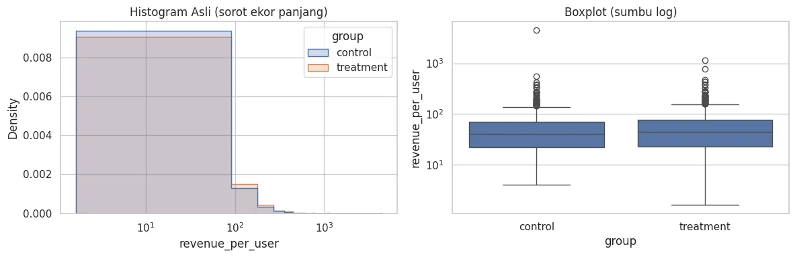
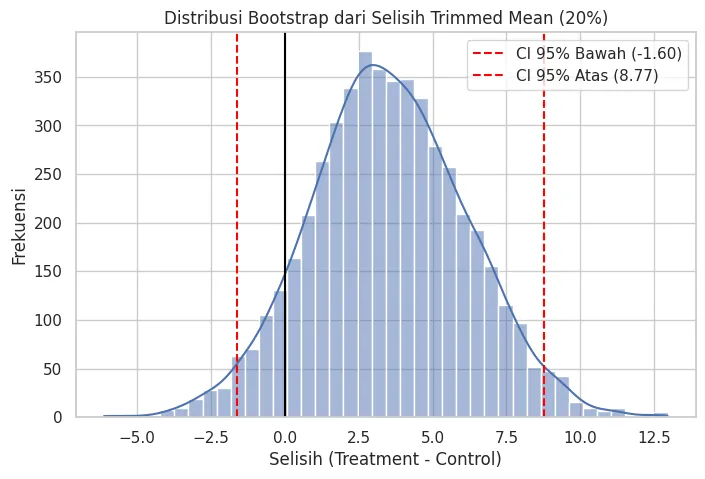

+++
title = "Checklist Robust A/B Testing untuk Revenue yang Skew: Transformasi Log, Welch’s t-test, dan Bootstrap"
date = 2025-08-28T23:49:26+07:00
draft = false
socialshare = true
description = "Panduan A/B testing pada data revenue yang skew & outlier: diagnostik, log transform, Welch’s t-test, trimmed mean, dan bootstrap CI."
image = "1.webp"
imageBig= "1.webp"
categories= ["Quantitative"]
tags =  ["asumsi-statistik"]
authors= ["Daddy Ananta"]
avatar="/images/profil.jpeg"
+++


## Pendahuluan

**Revenue per user** (pendapatan per pengguna) jarang memiliki distribusi "normal" 📊. Di dunia nyata, segelintir "whales" (pengguna dengan pengeluaran sangat tinggi) dapat mendistorsi rata-rata dan membuat hasil A/B *test* terlihat lebih menjanjikan—atau sebaliknya—tanpa benar-benar mencerminkan efek produk. Jika Anda masih mengandalkan **Student’s t-test** pada metrik yang sangat *skew*, Anda berjalan di atas es tipis.

Artikel ini adalah daftar periksa praktik terbaik untuk memastikan keputusan Anda tetap kokoh meski data "bermasalah". Kita akan memetakan triase ala "Ruang Gawat Darurat Data": mulai dari identifikasi *outlier*, kapan dan bagaimana menerapkan transformasi log yang tepat, mengapa **Welch’s t-test** lebih aman pada varians yang tidak homogen, hingga cara menggunakan **trimmed mean** dan **bootstrap** untuk interval kepercayaan (*confidence interval* atau CI) yang *robust*.

Hasilnya: A/B *test* yang lebih adil, metrik yang lebih jujur, dan keputusan perilisan UI yang bisa dipertanggungjawabkan. Anda juga akan membawa pulang daftar periksa siap pakai dan cuplikan kode untuk langsung dieksekusi pada eksperimen berikutnya.

**Catatan penyeimbang:** Student’s t-test masih bisa layak pada kondisi tertentu—misalnya *skew* ringan, varians homogen, dan ukuran sampel besar. Namun, saat varians tidak homogen atau *outlier* dominan, prioritaskan Welch’s t-test atau metode *robust*. Dengan konteks ini, mari kita mulai dari fondasi konsep.

---

## Prinsip Dasar & Landasan Teori

### Prinsip Dasar: Ruang Gawat Darurat Data
Kerangka ini membantu Anda bergerak secara sistematis: tangani *outlier* dulu, stabilkan distribusi dengan transformasi, lalu jika perlu gunakan metode *robust*.
* **Triase *outlier* → transformasi → *robust***.
* **Metode jangkar**: Transformasi log/sqrt, Welch’s t-test, dan *bootstrap trimmed mean*. Ketiganya saling melengkapi untuk data dengan *skew* dan *outlier*.

### Landasan Teori & Rumus
* **Transformasi Data:** Bertujuan "menarik" ekor distribusi yang panjang (*skew* positif) agar lebih mendekati normal dan mengurangi pengaruh *outlier*. Rumus log transform yang aman untuk data yang mengandung nol adalah:
    $$ y' = \log(y + c), \quad c \ge 1 \text{ untuk menghindari } \log(0) $$
* **Welch’s t-test:** Membandingkan dua rata-rata saat varians tidak sama (heteroskedastis). T-statistik dihitung sebagai:
    $$ t = \frac{\bar{x}_1 - \bar{x}_2}{\sqrt{\frac{s^2_1}{n_1} + \frac{s^2_2}{n_2}}} $$
    Dengan derajat kebebasan (degrees of freedom) diestimasi menggunakan formula Welch–Satterthwaite:
    $$ \nu \approx \frac{\left(\frac{s^2_1}{n_1} + \frac{s^2_2}{n_2}\right)^2} {\frac{(s^2_1/n_1)^2}{n_1-1} + \frac{(s^2_2/n_2)^2}{n_2-1}} $$
* **Trimmed Mean:** Rata-rata yang dihitung setelah membuang `k` observasi terkecil dan terbesar.
    $$ \bar{x}_{\text{trim}} = \frac{1}{n - 2k} \sum_{i=k+1}^{n-k} x_{(i)} $$
* **Bootstrapping:** Teknik *resampling* untuk mengestimasi distribusi statistik sampel (misalnya, selisih *trimmed mean*) tanpa asumsi teoretis yang kuat.

**Catatan interpretasi:**
* Hasil pada skala log umumnya diinterpretasi sebagai **perubahan multiplikatif**. Untuk perbedaan rata-rata pada skala log ($\Delta$), *percent change* $\approx (\exp(\Delta) - 1) \times 100\%$.
* *Back-transform* rata-rata dari skala log ke skala asli dapat bias; pertimbangkan penggunaan **smearing estimator** untuk estimasi yang lebih akurat.

---

## Checklist Diagnostik Awal

**Mengapa:** Diagnostik awal mencegah Anda salah memilih uji. *Skew* ekstrem dan *outlier* dapat menggembungkan varians, menurunkan *power*, dan menyesatkan *p-value*.

**Langkah-langkah:**
1.  Siapkan data dan lakukan pembersihan minimum (*drop NA*).
2.  Ukur *skewness* dan hitung *outlier* dengan **metode IQR**.
3.  Visualisasikan dengan **histogram** dan **boxplot** pada skala log.
4.  Uji heterogenitas varians dengan **Brown–Forsythe test** (Levene berbasis median).

```python
import numpy as np
import pandas as pd
import seaborn as sns
import matplotlib.pyplot as plt
from scipy import stats

# Data sintetis dari studi kasus A/B e-commerce
rng = np.random.default_rng(42)
n_control, n_treat = 500, 520
mu_control, sigma = 3.70, 0.90
mu_treat = 3.78

# Buat data log-normal yang skew
control = rng.lognormal(mean=mu_control, sigma=sigma, size=n_control)
treat = rng.lognormal(mean=mu_treat, sigma=sigma, size=n_treat)
# Tambahkan "whales" (outlier ekstrem)
control[rng.choice(n_control, size=max(1, n_control//100), replace=False)] *= 8
treat[rng.choice(n_treat, size=max(1, n_treat//100), replace=False)] *= 8

df = pd.DataFrame({
    "group": (["control"]*n_control) + (["treatment"]*n_treat),
    "revenue_per_user": np.concatenate([control, treat]),
})
# Tambahkan beberapa nilai NA untuk simulasi data kotor
df.loc[rng.choice(df.index, size=max(1, len(df)//100), replace=False), "revenue_per_user"] = np.nan

# 1) Bersihkan NA pada metrik utama
d = df.dropna(subset=["revenue_per_user"]).copy()

# 2) Hitung skewness dan outlier IQR
def iqr_outlier_count(x, k=1.5):
    q1, q3 = np.percentile(x, [25, 75])
    iqr = q3 - q1
    lo, hi = q1 - k*iqr, q3 + k*iqr
    return np.sum((x < lo) | (x > hi))

for g, sub in d.groupby("group"):
    x = sub["revenue_per_user"].values
    print(f"{g} -> n={len(x)}, skew={stats.skew(x):.2f}, outliers(IQR)={iqr_outlier_count(x)}")

# 3) Visualisasi
sns.set(style="whitegrid")
fig, axes = plt.subplots(1, 2, figsize=(12,4))
sns.histplot(data=d, x="revenue_per_user", hue="group", bins=50, ax=axes[0],
             element="step", stat="density", common_norm=False)
axes[0].set_title("Histogram Asli (sorot ekor panjang)")
axes[0].set_xscale("log") 

sns.boxplot(data=d, x="group", y="revenue_per_user", ax=axes[1])
axes[1].set_yscale("log")
axes[1].set_title("Boxplot (sumbu log)")
plt.tight_layout()
plt.show()
```

```Output

control -> n=495, skew=19.24, outliers(IQR)=41
treatment -> n=515, skew=6.00, outliers(IQR)=44


```

<div class="single-image-source">
  
</div>

**Interpretasi hasil:**
* Nilai *skewness* positif besar dan adanya titik-titik di luar "kumis" boxplot mengonfirmasi kehadiran *outlier* dan distribusi yang miring.
* Jika ada banyak nilai nol (non-pembeli), pertimbangkan **two-part/hurdle model**: (1) analisis probabilitas pembelian (konversi), (2) analisis besaran belanja bagi yang membeli.

---

## Pohon Keputusan Metode Analisis

Gunakan flowchart ini untuk memilih alat statistik yang paling sesuai dengan karakteristik data Anda.


flowchart TD
%% Mendefinisikan kelas gaya berdasarkan style dari kode asli Anda
classDef process fill:#4A5568,stroke:#A0AEC0,stroke-width:2px,color:#fff;
classDef decision fill:#674188,stroke:#C3ACD0,stroke-width:2px,color:#fff;
classDef success fill:#d4edda,stroke:#c3e6cb,stroke-width:2px,color:#285b42;
classDef warning fill:#f8d7da,stroke:#f5c6cb,stroke-width:2px,color:#721c24;
classDef recommendation fill:#d1ecf1,stroke:#bee5eb,stroke-width:2px,color:#0c5460;

%% Mendefinisikan node/titik dalam flowchart
A["Mulai Analisis"]:::process;
B["1. Lakukan Diagnostik"]:::process;
C{"Data Skew Parah / Ada Outlier?"}:::decision;
D{"Varians Homogen? (Brown-Forsythe p > 0.05)"}:::decision;
E["✅ OK untuk Student's t-test (hati-hati)"]:::success;
F["🔥 Gunakan Welch's t-test"]:::warning;
G["2. Terapkan Transformasi (misal, log1p)"]:::process;
H{"Varians Homogen setelah Transformasi?"}:::decision;
I["✅ Welch's t-test pada data transformasi"]:::success;
J["🔥 Welch's t-test pada data transformasi (wajib)"]:::warning;
K["3. Konfirmasi dengan Metode Robust"]:::process;
L["🚀 Bootstrap Trimmed Mean untuk CI"]:::recommendation;
M["Interpretasi Gabungan"]:::process;

%% Menghubungkan semua node
A --> B;
B --> C;
C -- Tidak --> D;
D -- Ya --> E;
D -- Tidak --> F;
C -- Ya --> G;
G --> H;
H -- Ya --> I;
H -- Tidak --> J;
I --> K;
J --> K;
F --> K;
K --> L;
L --> M;


---

## Praktik Transformasi yang Benar

**Tujuan:** Menstabilkan varians dan membuat perbandingan lebih adil.
* `np.log1p(x)` secara numerik lebih stabil daripada `np.log(x+1)` untuk nilai `x` yang sangat kecil.

```python
# Transformasi
d["rev_log1p"] = np.log1p(d["revenue_per_user"]) 

# 4) Uji Homogenitas Varians (Brown–Forsythe)
lev_orig = stats.levene(d.loc[d.group=="control","revenue_per_user"],
                        d.loc[d.group=="treatment","revenue_per_user"],
                        center="median")
lev_log = stats.levene(d.loc[d.group=="control","rev_log1p"],
                       d.loc[d.group=="treatment","rev_log1p"],
                       center="median")
print(f"Brown–Forsythe (asli): p = {lev_orig.pvalue:.4f}")
print(f"Brown–Forsythe (log1p): p = {lev_log.pvalue:.4f} -> Varian lebih stabil")

# Welch’s t-test pada data asli vs. log-transformasi
x_c_log = d.loc[d.group=="control", "rev_log1p"]
x_t_log = d.loc[d.group=="treatment", "rev_log1p"]
t_log = stats.ttest_ind(x_c_log, x_t_log, equal_var=False)
print(f"Welch t-test (log1p): t = {t_log.statistic:.3f}, p = {t_log.pvalue:.4f}")
```

```Output
Brown–Forsythe (asli): p = 0.7559
Brown–Forsythe (log1p): p = 0.4924 -> Varian lebih stabil
Welch t-test (log1p): t = -0.939, p = 0.3480

```

---

## Praktik Robust dengan Bootstrapping

**Mengapa:** Bahkan setelah transformasi, *outlier* masih bisa berpengaruh. Metode *robust* mengurangi sensitivitas terhadap titik ekstrem.

**Intuisi Bootstrapping:** Bayangkan sampel Anda sebagai "miniatur populasi". Dengan mengambil sampel berulang kali *dengan pengembalian* dari miniatur ini, kita bisa mensimulasikan bagaimana statistik (seperti selisih *trimmed mean*) akan bervariasi jika kita bisa mengambil banyak sampel dari populasi asli. Ini memungkinkan kita membangun interval kepercayaan tanpa asumsi distribusi yang ketat.

```python
from scipy.stats import trim_mean

def bootstrap_trimmed_mean_diff(a, b, prop=0.2, n_boot=5000, rng=None):
    if rng is None:
        rng = np.random.default_rng()
    diffs = np.empty(n_boot)
    n_a, n_b = len(a), len(b)
    for i in range(n_boot):
        sa = rng.choice(a, size=n_a, replace=True)
        sb = rng.choice(b, size=n_b, replace=True)
        tm_a = trim_mean(sa, proportiontocut=prop)
        tm_b = trim_mean(sb, proportiontocut=prop)
        diffs[i] = tm_b - tm_a
    ci = np.percentile(diffs, [2.5, 97.5])
    return diffs, ci

# Ambil data asli (bukan yang ditransformasi)
x_c = d.loc[d.group=="control", "revenue_per_user"].values
x_t = d.loc[d.group=="treatment", "revenue_per_user"].values

diffs, ci = bootstrap_trimmed_mean_diff(x_c, x_t, prop=0.2, n_boot=5000, rng=rng)
print(f"Bootstrap 20% trimmed mean diff (treatment - control): "
      f"median={np.median(diffs):.2f}, CI 95%=[{ci[0]:.2f}, {ci[1]:.2f}]")
```

```Output

Bootstrap 20% trimmed mean diff (treatment - control): median=3.43, CI 95%=[-1.60, 8.77]

```


### Visualisasi Distribusi Bootstrap
Memvisualisasikan hasil bootstrap memberikan pemahaman intuitif tentang ketidakpastian estimasi kita.

```python
# Visualisasi hasil bootstrap
plt.figure(figsize=(8, 5))
sns.histplot(diffs, bins=40, kde=True)
plt.axvline(ci[0], color='red', linestyle='--', label=f'CI 95% Bawah ({ci[0]:.2f})')
plt.axvline(ci[1], color='red', linestyle='--', label=f'CI 95% Atas ({ci[1]:.2f})')
plt.axvline(0, color='black', linestyle='-')
plt.title('Distribusi Bootstrap dari Selisih Trimmed Mean (20%)')
plt.xlabel('Selisih (Treatment - Control)')
plt.ylabel('Frekuensi')
plt.legend()
plt.show()
```
<div class="single-image-source">
  
</div>


**Interpretasi:** Jika seluruh rentang CI 95% (area di antara garis merah putus-putus) berada di satu sisi dari garis nol, kita memiliki bukti kuat adanya efek yang signifikan.


<div style="background-color: #f8f9fa; border: 1px solid #e0e0e0; border-radius: 12px; padding: 25px; margin: 30px 0; font-family: 'Segoe UI', Arial, sans-serif; box-shadow: 0 6px 20px rgba(0,0,0,0.08);">
    <h4 style="margin-top: 0; margin-bottom: 12px; font-size: 22px; color: #333; text-align: center; line-height: 1.4;">Praktik Langsung: <strong style="color: #007bff;">Unduh Kode Lengkap</strong></h4>
    <p style="font-size: 16px; color: #555; margin-bottom: 25px; text-align: center; line-height: 1.7;">
        Ingin mencoba sendiri analisis ini? Unduh Jupyter Notebook yang berisi seluruh kode dari seri tiga bagian ini, mulai dari persiapan data hingga audit reliabilitas.
    </p>
    <div style="text-align: center;">
        <a href="Checklist Robust A-B Testing untuk Revenue yang Skew: Transformasi Log, Welch’s t-test, dan Bootstrap.ipynb" download
           style="display: inline-flex; align-items: center; justify-content: center; background-color: #007bff; color: #ffffff; padding: 15px 30px; font-size: 18px; font-weight: bold; text-decoration: none; border-radius: 10px; box-shadow: 0 4px 15px rgba(0, 123, 255, 0.3); transition: all 0.3s ease; letter-spacing: 0.5px;">
            <svg xmlns="http://www.w3.org/2000/svg" width="22" height="22" viewBox="0 0 24 24" fill="currentColor" style="margin-right: 10px;">
                <path d="M19 9h-4V3H9v6H5l7 7 7-7zM5 18v2h14v-2H5z"></path>
            </svg>
            Unduh Jupyter Notebook (.ipynb)
        </a>
        <p style="font-size: 14px; color: #6c757d; margin-top: 12px; margin-bottom: 0;">
            Ukuran file: 132,6 kB
        </p>
    </div>
</div>


---

## Jebakan Umum dan Cara Menghindarinya

1.  **Menghapus *outlier* tanpa rasional:** Hanya hapus jika itu adalah *error* input. Jika nyata, gunakan metode *robust*.
2.  **Transformasi tidak konsisten:** Terapkan transformasi yang sama pada kedua grup.
3.  **Salah interpretasi skala log:** Ingat, ini adalah efek multiplikatif. Komunikasikan sebagai perubahan persentase.
4.  **Mengabaikan varians yang tidak sama:** Selalu utamakan Welch’s t-test daripada Student's t-test sebagai *default* yang lebih aman.
5.  **Hanya melaporkan rata-rata:** Sertakan median, *trimmed mean*, dan interval kepercayaan *bootstrap*.
6.  **Mencampur *incidence* & *spend*:** Jika banyak nilai nol, analisis konversi dan AOV secara terpisah atau gunakan *two-part model*.
7.  **Tidak ada pra-registrasi:** Idealnya, tentukan metode analisis (misalnya, proporsi *trimming*) sebelum melihat hasilnya untuk menghindari *p-hacking*.

---

## Pelaporan dan Komunikasi Hasil

* **Narasi Eksekutif:** "Analisis menunjukkan bahwa UI baru secara konsisten meningkatkan pendapatan. Median pendapatan per pengguna naik, dan selisih *trimmed mean* (setelah mengabaikan 20% data ekstrem) menunjukkan peningkatan yang signifikan, dengan interval kepercayaan 95% [$X, $Y] yang tidak mencakup nol. Kami merekomendasikan peluncuran UI baru."
* **Transparansi:** Sebutkan proporsi *trimming* yang digunakan, metode CI (misal, *bootstrap percentile*), dan jumlah iterasi *bootstrap*.

---

## Kesimpulan

Pada metrik revenue yang sangat *skew*, keputusan A/B test akan lebih kokoh bila Anda mengikuti triase: **diagnosa asumsi, stabilisasi dengan transformasi, lalu konfirmasi dengan metode *robust***. Kombinasi Welch’s t-test pada skala log dan estimasi *trimmed mean* yang di-*bootstrap* memberikan gambaran yang adil tentang efek perlakuan baru tanpa didistorsi oleh segelintir "whales".

Dengan mengadopsi kerangka kerja ini, rekomendasi produk Anda akan menjadi lebih tegas, transparan, dan dapat dipertanggungjawabkan secara statistik.

---

## Referensi

<ul>
  <li><em>Brown, M. B., & Forsythe, A. B. (1974).</em> Robust tests for the equality of variances. <em>Journal of the American Statistical Association</em>. <a href="https://www.jstor.org/stable/2285659">JSTOR</a></li>
  
  <li><em>Duan, N. (1983).</em> Smearing estimate: A nonparametric retransformation method. <em>Journal of the American Statistical Association</em>. Referensi tersedia di <a href="https://en.wikipedia.org/wiki/Smearing_retransformation">Wikipedia – Smearing re-transformation</a></li>
  
  <li><em>Efron, B., & Tibshirani, R. J. (1993).</em> <em>An Introduction to the Bootstrap.</em> Chapman & Hall/CRC. Info lengkap di <a href="https://books.google.com/books/about/An_Introduction_to_the_Bootstrap.html?id=gLlpIUxRntoC">Google Books</a></li>
  
  <li><em>Ruxton, G. D. (2006).</em> The unequal variance t-test is an underused alternative to Student’s t-test and the Mann–Whitney U test. <em>Behavioral Ecology</em>. Detail tersedia di <a href="https://academic.oup.com/beheco/article/17/4/688/215960">OUP</a></li>
  
  <li><em>Tukey, J. W. (1977).</em> <em>Exploratory Data Analysis.</em> Addison-Wesley. Info tambahan: <a href="https://books.google.com/books/about/Exploratory_Data_Analysis.html?id=UT9dAAAAIAAJ">Google Books</a></li>
  
  <li><em>Welch, B. L. (1947).</em> The generalization of Student’s problem when several different population variances are involved. <em>Biometrika</em>. Tautan: <a href="https://academic.oup.com/biomet/issue/34/1-2">Biometrika vol. 34</a></li>
  
  <li><em>Wilcox, R. R. (2021).</em> <em>Introduction to Robust Estimation and Hypothesis Testing</em> (4th ed.). Elsevier. Info resmi: <a href="https://www.elsevier.com/books-and-journals/book-series/robust-statistics-and-biostatistics/series/9780128047330">Elsevier</a></li>
</ul>
