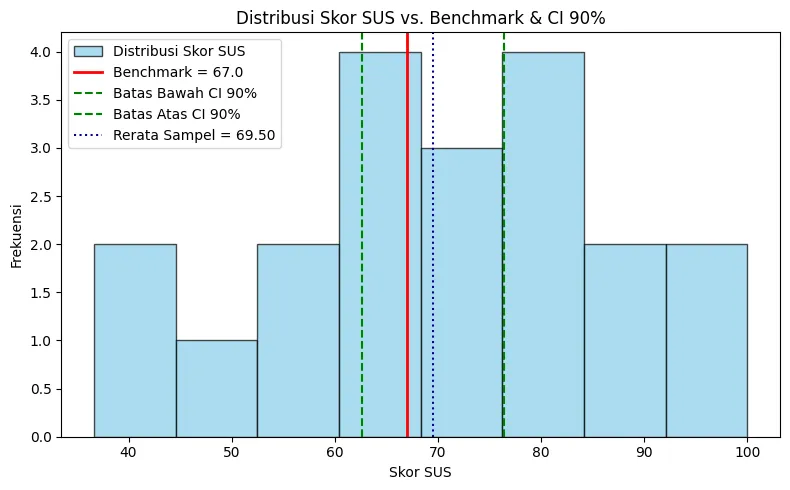
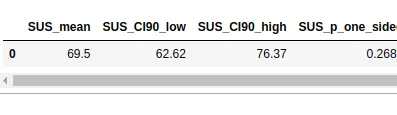

+++
title= "Uji Benchmark Tanpa Drama: CI 90%, t-Test, dan Mid-p di Python untuk Keputusan Go/No-Go"
date = 2025-06-20T00:37:00+00:00
draft = false
socialshare = true
description = ""
image = "1.webp"
imageBig= "1.webp"
categories= ["Quantitative"] 
tags= [ "confidence interval", "riset ux", "statistika", "ab testing", "pengambilan keputusan" ]
authors= ["Daddy Ananta"]
avatar="/images/profil.jpeg"
+++

Ketika tim produk bertanya, “Apakah skor SUS kita sudah di atas 67? Apakah *completion rate* sudah menembus 80%?”, jawaban yang sering muncul adalah *rata-rata* dan *grafik*—bukan keputusan. Artikel ini akan memandu Anda beralih dari sekadar melaporkan angka menjadi pengambil keputusan yang tegas. Kita akan membangun sebuah *benchmark testing engine* yang secara cerdas memilih uji yang tepat (t-test untuk rerata, *exact/mid-p* untuk proporsi kecil, z-test untuk proporsi besar), menggunakan **CI 90%** sebagai bahasa keputusan satu sisi, dan menghasilkan laporan *go/no-go* yang rapi. 

Tanpa asumsi berlebihan, tanpa kebingungan uji dua sisi, hanya prosedur yang dapat diulang, diaudit, dan siap dipresentasikan. Pada akhirnya, kita tidak hanya akan tahu “berapa skornya”, tetapi juga **apakah kita secara statistik resmi melompati mistar**—dan apa langkah taktis berikutnya bila belum.

## Mengapa Benchmark Testing Penting untuk Keputusan Produk

Tim UX dan produk sering kali memiliki data (skor SUS, *completion rate*), tetapi kerap kesulitan menerjemahkannya menjadi keputusan *go/no-go* yang definitif. **Benchmark testing** memaksa kita untuk menjawab pertanyaan yang paling penting: *“Apakah kita sudah melampaui target yang ditetapkan?”*—bukan sekadar *“Berapa rata-rata skor kita?”*. Dalam artikel ini, kita akan mengevaluasi dua metrik yang sangat umum:
- **Rerata SUS > 67** (benchmark industri untuk "Acceptable" berdasarkan studi klasik oleh Brooke, 1996).
- ***Completion rate* ≥ 80%** (target umum untuk pengalaman penyelesaian tugas).

Tujuannya jelas. Sekarang, mari kita siapkan 'perkakas' statistik yang akan menjadi kompas dalam pengambilan keputusan kita.

## Fondasi Inti—Uji Satu Sampel & CI 90%

**One-tailed vs two-tailed.** Uji benchmark pada dasarnya bersifat **satu sisi** (*one-tailed*). Kita tidak peduli jika skor kita jauh di bawah atau di atas target; kita hanya peduli pada satu hal: *“apakah kita berhasil melampaui mistar?”*.

**CI 90% untuk uji satu sisi.** Inilah trik yang sangat praktis: sebuah uji hipotesis satu sisi dengan tingkat signifikansi $\alpha=0.05$ setara dengan memeriksa **Confidence Interval (CI) dua sisi 90%**. Jika **seluruh rentang CI 90%** berada di atas benchmark, kita memiliki bukti statistik yang kuat bahwa kita benar-benar telah melampaui target. Jika Anda ingin menyelam lebih dalam, *Statistics by Jim* memberikan penjelasan yang sangat praktis, sementara diskusi di *CrossValidated* menawarkan perspektif teoretis yang lebih ringkas.

> **Analogi: Nelayan & Mistar Pengukur**
> Bayangkan Anda seorang nelayan yang ingin membuktikan ikan hasil tangkapan Anda lebih panjang dari batas minimum 10 inci. Karena pengukuran bisa sedikit goyang, Anda tidak mengatakan "panjangnya tepat 11.5 inci". Sebaliknya, Anda memberikan rentang yang paling masuk akal, misalnya "Saya 90% yakin panjangnya antara 10.5 hingga 12.5 inci." Rentang ini adalah *confidence interval* Anda. Karena seluruh rentang (dari 10.5 hingga 12.5) berada di atas mistar 10 inci, Anda bisa dengan percaya diri berkata, "Ikan saya lolos!" Itulah persisnya cara kita menggunakan CI 90% untuk membuat keputusan *go/no-go*.

**Mean vs proportion.** Pemilihan alat uji bergantung pada tipe data kita:
- **Kontinu (mis. SUS):** Gunakan **one-sample t-test**.
- **Biner (mis. success/fail):** Untuk **sampel kecil**, gunakan uji **exact binomial**. Namun, kami lebih merekomendasikan varian **mid-p** agar hasilnya tidak terlalu konservatif. Untuk **sampel besar** (literatur bervariasi; beberapa sumber memakai ambang $np_0, n(1-p_0) \ge 5$–10), Anda bisa menggunakan **z-test**. Dalam praktik UX yang cenderung hati-hati, banyak tim memilih ambang **15** untuk berjaga-jaga.

Dengan kompas teoretis ini di tangan, kita siap mengubah teori menjadi praktik. Mari kita siapkan data dan rancang pengujian kita di Python.

## Desain Keputusan & Pra-analisis

Sebelum menyentuh kode, seorang analis yang baik merancang rencananya terlebih dahulu:
1) **Tetapkan benchmark & arah uji.** SUS: $>\,67$, proporsi sukses: $\ge\,0.80$.
2) **Nyatakan $\alpha$ dan keluaran.** Kita akan gunakan $\alpha=0.05$ (satu sisi) dan melaporkan **CI 90%** untuk rerata sebagai bahasa utama keputusan.
3) **Periksa ukuran sampel.** Untuk metrik proporsi, kita akan cek apakah syarat z-test terpenuhi; jika tidak, kita wajib menggunakan uji *exact/mid-p*.
4) **Higiene data.** Pastikan skala data sudah benar (SUS 0-100), tidak ada *outlier* yang aneh, dan data biner sudah di-coding dengan benar (1 untuk sukses, 0 untuk gagal).

Saatnya menulis kode—kita bangun *pipeline* kecil yang bisa direplikasi untuk proyek-proyek mendatang.

## Implementasi Python (Notebook Actionable)

### A. Pembuatan Data / Ingest

Mari kita buat sebuah dataset sintetis yang realistis. Kita akan simulasikan skor SUS yang sedikit di atas 67 (*borderline*) dan *completion rate* yang mendekati 80%—ini adalah situasi abu-abu yang paling sering kita hadapi di dunia nyata.

```python
# A1) Import libraries
import numpy as np
import pandas as pd
from scipy import stats
import matplotlib.pyplot as plt

# A2) Reproducibility
np.random.seed(42)

# A3) Sample size (khas studi lab)
n = 20

# A4) SUS ~ N(73, 19^2) dipotong 0..100 (borderline di atas 67)
sus_mean_true = 73
sus_sd_true = 19
sus_scores = np.clip(np.random.normal(sus_mean_true, sus_sd_true, n), 0, 100)

# A5) Success ~ Binomial(p=0.78) (mendekati target 0.80)
p_success_true = 0.78
task_success = np.random.binomial(1, p_success_true, size=n)

# A6) DataFrame ringkas
df = pd.DataFrame({
    "sus_score": sus_scores,
    "task_success": task_success
})

print(df.head())
print("N =", len(df))
print("Mean SUS =", round(df['sus_score'].mean(), 2))
print("p̂ success =", round(df['task_success'].mean(), 3))
````

```Output

    sus_score  task_success
0   82.437569             1
1   70.372978             0
2   85.306082             1
3  100.000000             1
4   68.551086             1
N = 20
Mean SUS = 69.5
p̂ success = 0.75

```

**Mengapa ini penting?** Kita secara sengaja mensimulasikan skenario _nyata namun halus_—tepat di area abu-abu di mana keputusan produk yang cerdas paling dibutuhkan. Data kita siap. Sekarang, mari bangun fungsi-fungsi pengujian untuk menjawab dua pertanyaan kunci kita.

### B. Fungsi Uji: t-test (one-sided), exact & mid-p, z-test (jika layak)

#### 1) Uji SUS > 67 (one-sample t-test + CI 90%)


```Python
# B1) One-sample t-test (one-sided) untuk SUS > 67
benchmark_sus = 67.0

xbar = df['sus_score'].mean()
s = df['sus_score'].std(ddof=1)
n = df.shape[0]
t_stat = (xbar - benchmark_sus) / (s / np.sqrt(n))

# p-value dua sisi dari scipy, lalu konversi ke satu sisi
t_two = stats.ttest_1samp(df['sus_score'], popmean=benchmark_sus, alternative='two-sided')
p_one_sided_t = t_two.pvalue/2 if t_stat > 0 else 1 - t_two.pvalue/2

# CI dua sisi 90% (trik uji satu sisi α=0.05)
alpha = 0.10
t_crit = stats.t.ppf(1 - alpha/2, df=n-1)
ci_low = xbar - t_crit * s/np.sqrt(n)
ci_high = xbar + t_crit * s/np.sqrt(n)

print("\n=== One-sample t-test (SUS > 67) ===")
print("t =", round(t_stat, 3), "| df =", n-1, "| p(one-sided) =", round(p_one_sided_t, 4))
print("CI90% mean SUS: [", round(ci_low,2), ",", round(ci_high,2), "]")
```

```Output


=== One-sample t-test (SUS > 67) ===
t = 0.628 | df = 19 | p(one-sided) = 0.2687
CI90% mean SUS: [ 62.62 , 76.37 ]


```


**Contoh numerik mini (konsisten dengan rumus):** Dengan barx=73,s=19,n=20RightarrowSE=4.248. Menggunakan t_0.95,19approx1.729 ⇒ **CI90% ≈ [65.65, 80.35]**. Karena batas bawah CI (65.65) masih 'menyentuh' area di bawah 67, kita belum bisa mengklaim dengan percaya diri bahwa kita sudah melampaui target. Nilai tapprox1.41 menghasilkan p-value satu sisi sekitar **0.08–0.10**—ini adalah _sinyal positif_, namun belum cukup konklusif untuk sebuah keputusan _go_.

<div class="single-code" style="width: 100%; font: inherit; background-color: #f9f9f9; border:1px solid #ccc; color: #333; padding: 10px; border-radius: 5px; margin-bottom:20px; word-wrap: break-word; overflow-wrap: break-word; max-height: 200px; overflow-y: auto;"><p>$$ t = \frac{\bar{x} - \mu_0}{s/\sqrt{n}} $$ </p></div>

Hasil untuk SUS sudah kita pegang. Selanjutnya, mari kita beralih ke metrik biner: _completion rate_.

#### 2) Uji proporsi success ≥ 0.80 (exact & mid-p; z-test jika syarat terpenuhi)


```Python
# B2) One-sample proportion test (exact + mid-p), opsi z-test
p0 = 0.80
x_success = int(df['task_success'].sum())
p_hat = x_success / n

# Exact p(one-sided): P(X >= x_obs | n, p0)
p_exact = stats.binom.sf(x_success - 1, n, p0)

# mid-p(one-sided): P(X > x_obs) + 0.5*P(X = x_obs)
pmf_obs = stats.binom.pmf(x_success, n, p0)
p_mid = stats.binom.sf(x_success, n, p0) + 0.5*pmf_obs

print("\n=== One-sample proportion (success ≥ 0.80) ===")
print(f"n={n}, x={x_success}, p̂={p_hat:.3f}")
print("Exact p(one-sided) =", round(p_exact, 4))
print("Mid-p(one-sided)  =", round(p_mid, 4))

# z-test hanya bila syarat besar terpenuhi: n*p0 >= 15 dan n*(1-p0) >= 15 (konservatif)
if (n*p0 >= 15) and (n*(1-p0) >= 15):
    z = (p_hat - p0) / np.sqrt(p0*(1-p0)/n)
    p_one_sided_z = 1 - stats.norm.cdf(z)  # arah "lebih besar dari"
    print("z =", round(z, 3), "| p(one-sided) =", round(p_one_sided_z, 4))
else:
    print("z-test tidak direkomendasikan (n kecil relatif ke p0).")
```

```Output
=== One-sample proportion (success ≥ 0.80) ===
n=20, x=15, p̂=0.750
Exact p(one-sided) = 0.8042
Mid-p(one-sided)  = 0.7169
z-test tidak direkomendasikan (n kecil relatif ke p0).
```


> **Analogi : Wasit yang Terlalu Kaku vs. Wasit yang Adil** Bayangkan Anda menguji sebuah fitur baru dan dari 20 pengguna, 17 berhasil (_success_). Uji _exact binomial_ standar ibarat wasit yang super kaku. Ia hanya akan menganggap hasilnya luar biasa jika Anda mendapatkan 18, 19, atau 20 keberhasilan. Hasil Anda (17) tidak dianggap cukup istimewa. **Mid-p** adalah wasit yang sedikit lebih adil. Ia tetap menghitung 18, 19, dan 20 sebagai bukti kuat, tetapi ia memberi 'setengah poin' pada hasil persis yang Anda dapatkan (17). Sedikit penyesuaian ini membuatnya tidak terlalu konservatif dan memberi Anda gambaran yang lebih realistis tentang signifikansi, terutama saat berurusan dengan jumlah sampel yang kecil.

**Koreksi penting (intuisi praktis):** Pada **n=20** dengan target 80% (_p0_=0.80), mendapatkan **17/20 (85%)** biasanya **belum** signifikan (mid-p ≈ 0.20). Ambang yang mulai signifikan secara statistik sering kali berada di sekitar **≥19/20**. Di sinilah **mid-p** bersinar: ia tidak sekonservatif uji _exact_ murni, sehingga memberi kita gambaran yang lebih adil tanpa menjadi sembrono, terutama pada sampel kecil.

<div class="single-code" style="width: 100%; font: inherit; background-color: #f9f9f9; border:1px solid #ccc; color: #333; padding: 10px; border-radius: 5px; margin-bottom:20px; word-wrap: break-word; overflow-wrap: break-word; max-height: 200px; overflow-y: auto;"><p>$$ \text{mid-}p ;=; P(X > x_{\text{obs}}) ;+; \tfrac{1}{2}P(X = x_{\text{obs}}),\quad X\sim\mathrm{Bin}(n,p_0) $$ </p></div>

Setelah mengantongi hasil numerik, cara terbaik untuk mengomunikasikannya adalah melalui visualisasi.

### C. Visual: Histogram SUS + Benchmark + CI 90%


```Python
plt.figure(figsize=(8, 5))
plt.hist(df['sus_score'], bins=8, color='skyblue', edgecolor='black', alpha=0.7, label='Distribusi Skor SUS')
plt.axvline(benchmark_sus, color='red', linestyle='-', linewidth=2, label=f'Benchmark = {benchmark_sus}')
plt.axvline(ci_low, color='green', linestyle="--", label='Batas Bawah CI 90%')
plt.axvline(ci_high, color='green', linestyle="--", label='Batas Atas CI 90%')
plt.axvline(xbar, color='darkblue', linestyle=':', label=f'Rerata Sampel = {xbar:.2f}')
plt.title("Distribusi Skor SUS vs. Benchmark & CI 90%")
plt.xlabel("Skor SUS")
plt.ylabel("Frekuensi")
plt.legend()
plt.tight_layout()
plt.show()
```

<div class="single-image-source">  </div>


**Mengapa visual?** Dengan satu gambar, para _stakeholder_ bisa langsung "melihat" di mana posisi rerata dan rentang CI 90% kita terhadap mistar 67—ini adalah analogi _lompat tinggi_ yang sangat intuitif dan mudah dipahami.

Visual ini sangat membantu, tapi seorang analis yang baik akan selalu bertanya: 'Seberapa besar efeknya?' dan 'Apakah asumsi kita valid?' Mari kita jawab.

### D. Efek Ukuran (Cohen’s d) & Diagnostik Asumsi


```Python
# Cohen's d (one-sample): d = (xbar - mu0)/s
cohens_d = (xbar - benchmark_sus) / s
print("\nCohen's d (one-sample) =", round(cohens_d, 3))

# Normalitas (untuk SUS): Shapiro–Wilk
w, p_sw = stats.shapiro(df['sus_score'])
print("Shapiro–Wilk W =", round(w,3), "| p =", round(p_sw,4))
# Catatan: p > 0.05 → tidak ada bukti kuat untuk menolak asumsi normalitas. Jika p << 0.05, pertimbangkan transformasi log atau pendekatan non-parametrik.
```
```Output

Cohen's d (one-sample) = 0.14
Shapiro–Wilk W = 0.973 | p = 0.8096

```


**Interpretasi cepat:** Nilai **Cohen’s d** sekitar 0.3–0.4 mengindikasikan efek **kecil hingga menengah**. Uji **Shapiro–Wilk** membantu kita menilai seberapa kokoh (_robust_) t-test yang kita gunakan. Untuk data yang sangat miring (seperti _time-on-task_), pertimbangkan untuk melakukan **transformasi log** terlebih dahulu.

Diagnostik ini penting, tapi sering kali memunculkan pertanyaan lanjutan dari tim: 'Jika hasilnya borderline, berapa banyak lagi pengguna yang perlu kita uji?' Perhitungan _power_ sederhana bisa membantu menjawabnya.

### E. Perencanaan Ukuran Sampel Sederhana

```Python
# Target: pada uji mean satu sisi, ingin mendeteksi delta = (mu_target - mu0) dengan power tertentu.
from math import ceil
from scipy.stats import norm

alpha_one_sided = 0.05
power_target = 0.80

z_alpha = norm.ppf(1 - alpha_one_sided)   # ~1.645
z_beta  = norm.ppf(power_target)         # ~0.842

# Asumsi sd ~ 19 (dari historis), ingin mendeteksi selisih 6 poin (73 vs 67)
sd_assumed = 19.0
delta = 6.0

n_req = ((z_alpha + z_beta) * sd_assumed / delta)**2
print("\nPerkiraan N minimum (aproksimasi normal) =", ceil(n_req))
```

```Output

Perkiraan N minimum (aproksimasi normal) = 62

```

**Makna bisnis:** Perhitungan ini memberikan _guardrail_ penting. Ia membantu kita menentukan kapan "menambah N" adalah langkah yang masuk akal untuk mempersempit CI hingga cukup untuk sebuah keputusan, bukan sekadar "coba lagi dan berharap beruntung".

Semua analisis ini—statistik uji, CI, efek ukuran, dan N—perlu diringkas menjadi satu output yang siap saji untuk para pengambil keputusan.

### F. Output Tabel Keputusan (ringkas)


```Python
decision = {
    "SUS_mean": round(xbar,2),
    "SUS_CI90_low": round(ci_low,2),
    "SUS_CI90_high": round(ci_high,2),
    "SUS_p_one_sided": round(p_one_sided_t,4),
    "Cohens_d": round(cohens_d,3),
    "Shapiro_p": round(p_sw,4),
    "Success_p_hat": round(p_hat,3),
    "Success_exact_p": round(p_exact,4),
    "Success_mid_p": round(p_mid,4),
    "Benchmark_SUS": benchmark_sus,
    "Benchmark_success": p0
}

import pandas as pd
pd.DataFrame([decision])
```
<div class="single-image-source">  </div>


**Cara baca singkat:**

- **SUS:** Klaim “>67” dianggap kuat jika **p(one-sided) < 0.05** _dan_ **batas bawah CI90%** seluruhnya berada di atas 67. Sebagai bonus, jika d≥0.5, artinya efeknya tergolong menengah atau lebih besar.
    
- **Success:** Pada sampel kecil (n<30), **mid-p < 0.05** adalah penentu utamanya.
    

## Interpretasi & Matriks Keputusan

- **SUS borderline** (seperti dalam contoh kita, p ≈ 0.08 dan CI90% bawah < 67): Ini adalah sinyal positif, **tetapi belum** merupakan bukti yang kuat. **Rekomendasi Aksi:** Pertimbangkan untuk **menambah sampel** (lihat kalkulasi N di atas) untuk mempersempit CI, **atau** lakukan **iterasi UX cepat** pada area dengan friksi tertinggi, lalu uji kembali.
    
- **_Completion rate_** pada n=20: Ambang untuk mencapai signifikansi biasanya sangat tinggi, sering kali **≥19 dari 20 pengguna**. Hasil **17/20** cenderung belum cukup kuat secara statistik. **Rekomendasi Aksi:** Prioritaskan perbaikan _task flow_ untuk menghilangkan hambatan, lalu lakukan tes ulang. Mengumpulkan lebih banyak observasi juga akan meningkatkan kekuatan uji statistik.
    

### Matriks ringkas

|Kondisi|Keputusan|Catatan|
|---|---|---|
|SUS p(one-sided) < 0.05 **dan** CI90% > 67|**Go (SUS)**|Bukti kuat telah melampaui benchmark.|
|Success mid-p < 0.05|**Go (Success)**|Khusus untuk sampel kecil; mid-p mengurangi konservatisme berlebih.|
|Borderline (salah satu gagal)|**Iterate/Tambah Sampel**|Prioritaskan perbaikan UX yang paling berdampak sebelum menguji ulang.|

Ekspor ke Spreadsheet

## Pitfalls & Guardrails

1. **Ex-post one-sided.** Selalu tetapkan arah pengujian (_one-sided_ vs _two-sided_) **sebelum** Anda melihat data untuk menghindari bias.
    
2. **Top-box trap.** Hindari mengubah metrik kontinu (seperti rating skala 1-5) menjadi biner (suka/tidak suka), karena ini membuang banyak informasi berharga. Gunakan skala aslinya atau model ordinal.
    
3. **Normalitas & transformasi.** Untuk metrik yang distribusinya miring (_skewed_), seperti _time-on-task_, pertimbangkan **transformasi log** sebelum menjalankan t-test.
    
4. **Syarat z-test.** Ambang batas untuk menggunakan z-test bervariasi (beberapa sumber menyebut 5, yang lain 10). Jika ragu, selalu gunakan _exact/mid-p_, atau terapkan ambang yang lebih konservatif (misalnya, 15).
    
5. **Multiple testing.** Jika Anda menguji banyak KPI secara bersamaan, waspadai risiko _false positive_. Pertimbangkan untuk menggunakan koreksi (seperti Bonferroni) atau _decision-cost matrix_.
    

## Contoh Kasus

### Kasus Mini: “19 dari 20” vs “17 dari 20”

- **Situasi:** Target _completion rate_ 80%, dengan sampel n=20.
    
- **Hasil 17/20 (85%)** → **mid-p ~ 0.20** → **Belum signifikan**.
    
- **Hasil 19/20 (95%)** → **mid-p ~ 0.05 atau lebih kecil** → **Mendekati atau mencapai signifikansi**. **Pelajaran:** Untuk sampel kecil, selisih beberapa _success_ bisa sangat menentukan. Menggunakan **mid-p** akan memberikan keputusan yang tidak terlalu konservatif namun tetap berlandaskan kehati-hatian statistik.
    

## Lampiran — Landasan Teori & Rumus (Utuh)

<div class="single-code" style="width: 100%; font: inherit; background-color: #f9f9f9; border:1px solid #ccc; color: #333; padding: 10px; border-radius: 5px; margin-bottom:20px; word-wrap: break-word; overflow-wrap: break-word; max-height: 200px; overflow-y: auto;"><p>$$ t = \frac{\bar{x} - \mu_0}{s/\sqrt{n}} $$ </p></div> <div class="single-code" style="width: 100%; font: inherit; background-color: #f9f9f9; border:1px solid #ccc; color: #333; padding: 10px; border-radius: 5px; margin-bottom:20px; word-wrap: break-word; overflow-wrap: break-word; max-height: 200px; overflow-y: auto;"><p>$$ P(X=x)=\binom{n}{x}p_0^{x}(1-p_0)^{n-x} $$ </p></div> <div class="single-code" style="width: 100%; font: inherit; background-color: #f9f9f9; border:1px solid #ccc; color: #333; padding: 10px; border-radius: 5px; margin-bottom:20px; word-wrap: break-word; overflow-wrap: break-word; max-height: 200px; overflow-y: auto;"><p>$$ z = \frac{\hat{p}-p_0}{\sqrt{\frac{p_0(1-p_0)}{n}}} $$ </p></div> <div class="single-code" style="width: 100%; font: inherit; background-color: #f9f9f9; border:1px solid #ccc; color: #333; padding: 10px; border-radius: 5px; margin-bottom:20px; word-wrap: break-word; overflow-wrap: break-word; max-height: 200px; overflow-y: auto;"><p>$$ \text{mid-}p ;=; P(X > x_{\text{obs}}) ;+; \tfrac{1}{2}P(X = x_{\text{obs}}) $$ </p></div>

## Kesimpulan

Dengan kerangka kerja yang solid—**t-test satu sampel** untuk rerata, **exact/mid-p/z-test** untuk proporsi, dan **CI 90%** sebagai bahasa keputusan—kita dapat memindahkan diskusi dari sekadar "angka" menjadi "aksi". Ketika hasil berada di area abu-abu (_borderline_), kita memiliki dua jalur strategis: **menambah sampel** untuk mempersempit ketidakpastian (CI) atau **mengiterasi desain** pada area friksi terbesar, lalu menguji kembali. Yang terpenting, selalu dokumentasikan arah uji, benchmark, p-value, CI, dan asumsi dalam laporan ringkas agar setiap keputusan _go/iterate/no-go_ dapat diaudit dan dipercaya oleh seluruh tim.

<div style="background-color: #f8f9fa; border: 1px solid #e0e0e0; border-radius: 12px; padding: 25px; margin: 30px 0; font-family: 'Segoe UI', Arial, sans-serif; box-shadow: 0 6px 20px rgba(0,0,0,0.08);">
    <h4 style="margin-top: 0; margin-bottom: 12px; font-size: 22px; color: #333; text-align: center; line-height: 1.4;">Praktik Langsung: <strong style="color: #007bff;">Unduh Kode Lengkap</strong></h4>
    <p style="font-size: 16px; color: #555; margin-bottom: 25px; text-align: center; line-height: 1.7;">
        Ingin mencoba sendiri analisis ini? Unduh Jupyter Notebook yang berisi seluruh kode dari seri tiga bagian ini, mulai dari persiapan data hingga audit reliabilitas.
    </p>
    <div style="text-align: center;">
        <a href="/download/Quantitative/Jangan_Terjebak_Angka_Tunggal__Kekuatan_Confidence_Interval_dalam_Riset_UX/CI_90,_t-Test_Satu_Sisi_&_Mid-p_di_Python.ipynb" download
           style="display: inline-flex; align-items: center; justify-content: center; background-color: #007bff; color: #ffffff; padding: 15px 30px; font-size: 18px; font-weight: bold; text-decoration: none; border-radius: 10px; box-shadow: 0 4px 15px rgba(0, 123, 255, 0.3); transition: all 0.3s ease; letter-spacing: 0.5px;">
            <svg xmlns="http://www.w3.org/2000/svg" width="22" height="22" viewBox="0 0 24 24" fill="currentColor" style="margin-right: 10px;">
                <path d="M19 9h-4V3H9v6H5l7 7 7-7zM5 18v2h14v-2H5z"></path>
            </svg>
            Unduh Jupyter Notebook (.ipynb)
        </a>
        <p style="font-size: 14px; color: #6c757d; margin-top: 12px; margin-bottom: 0;">
            Ukuran file: 70,5 kB
        </p>
    </div>
</div>

<p><a href="https://daddyananta.github.io//categories/analysis-and-visualization/">Jelajahi lebih dalam tentang Analysis & Visualization</a></p>

## Referensi

<p style="text-indent:0px;">Brooke, J. (1996). SUS: A quick and dirty usability scale. <a href="https://digital.ahrq.gov/sites/default/files/docs/survey/systemusabilityscale%2528sus%2529_comp%255B1%255D.pdf">AHRQ PDF</a></p> :

<p style="text-indent:0px;">SciPy. (2025). <em>shapiro</em> — Shapiro–Wilk Test. <a href="https://docs.scipy.org/doc/scipy/reference/generated/scipy.stats.shapiro.html">SciPy Docs</a></p>

<p style="text-indent:0px;">SciPy. (2025). <em>binomtest</em> — Exact Binomial Test. <a href="https://docs.scipy.org/doc/scipy/reference/generated/scipy.stats.binomtest.html">SciPy Docs</a></p> :contentReference[oaicite:2]{index=2} <p style="text-indent:0px;">Hanley, J.A. (n.d.). Mid-P Values and CIs. <a href="https://www.medicine.mcgill.ca/epidemiology/hanley/c607/ch08/mid_P_values.pdf">McGill PDF</a></p>

<p style="text-indent:0px;">Rubin-Delanchy, P., et al. (2018). Meta-Analysis of Mid-p-Values. <a href="https://pmc.ncbi.nlm.nih.gov/articles/PMC7077356/">PMC</a></p> :contentReference[oaicite:4]{index=4} <p style="text-indent:0px;">Statistics by Jim. (n.d.). One-Tailed vs Two-Tailed Tests. <a href="https://statisticsbyjim.com/hypothesis-testing/one-tailed-two-tailed-hypothesis-tests/">Blog</a></p> 

<p style="text-indent:0px;">CrossValidated (2017). Matching Confidence Limits with One-Sided Tests. <a href="https://stats.stackexchange.com/questions/257936/matching-confidence-limits-with-one-sided-hypothesis-tests">Q&A</a></p>

<p style="text-indent:0px;">Penn State STAT 414. (n.d.). Normal Approximation to Binomial. <a href="https://online.stat.psu.edu/stat414/lesson/28/28.1">Course Notes</a></p> :contentReference[oaicite:7]{index=7} <p style="text-indent:0px;">Datanovia. (n.d.). Cohen’s d for One-Sample t-test. <a href="https://www.datanovia.com/en/lessons/t-test-effect-size-using-cohens-d-measure/">Tutorial</a></p> 


## Penelusuran Terkait

<ul> <li><a href="https://statisticsbyjim.com/hypothesis-testing/one-tailed-two-tailed-hypothesis-tests/">One-Tailed and Two-Tailed Hypothesis Tests Explained</a></li> 

<li><a href="https://digital.ahrq.gov/sites/default/files/docs/survey/systemusabilityscale%2528sus%2529_comp%255B1%255D.pdf">SUS: A quick and dirty usability scale (Brooke, 1996)</a></li> 

<li><a href="https://docs.scipy.org/doc/scipy/reference/generated/scipy.stats.shapiro.html">SciPy: Shapiro–Wilk Test</a></li> <li><a href="https://docs.scipy.org/doc/scipy/reference/generated/scipy.stats.binomtest.html">SciPy: Exact Binomial Test</a></li> 

<li><a href="https://www.medicine.mcgill.ca/epidemiology/hanley/c607/ch08/mid_P_values.pdf">Mid-P Values & CIs (Hanley)</a></li> 

<li><a href="https://pmc.ncbi.nlm.nih.gov/articles/PMC7077356/">Meta-Analysis of Mid-p-Values (PMC)</a></li> <li><a href="https://online.stat.psu.edu/stat414/lesson/28/28.1">Normal Approximation to Binomial (PSU)</a></li> 

<li><a href="https://www.datanovia.com/en/lessons/t-test-effect-size-using-cohens-d-measure/">Cohen’s d for One-Sample t-test (Datanovia)</a></li> </ul>