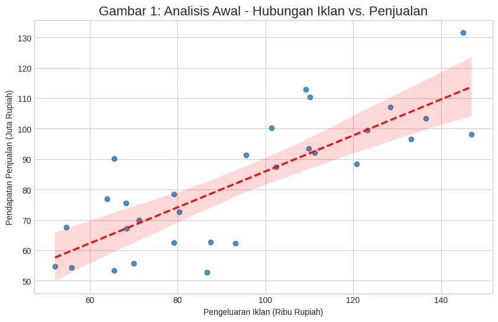
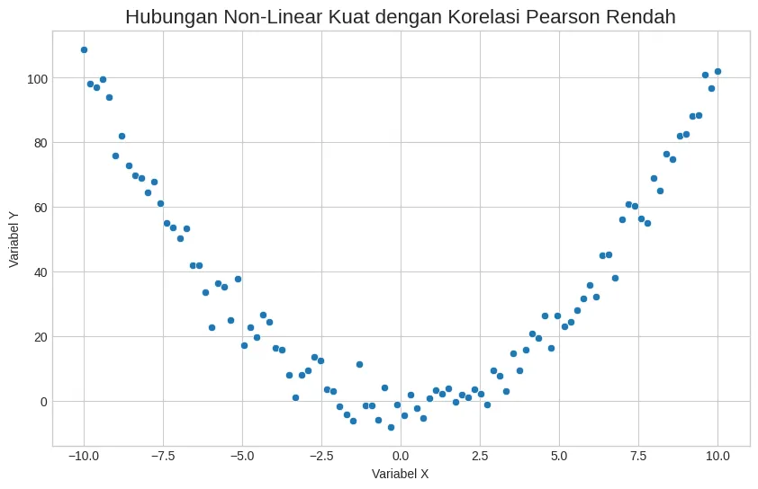
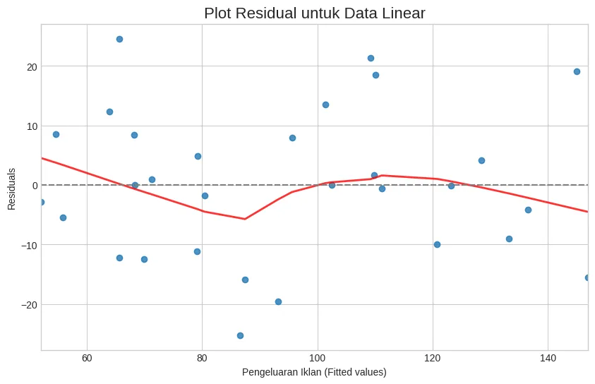
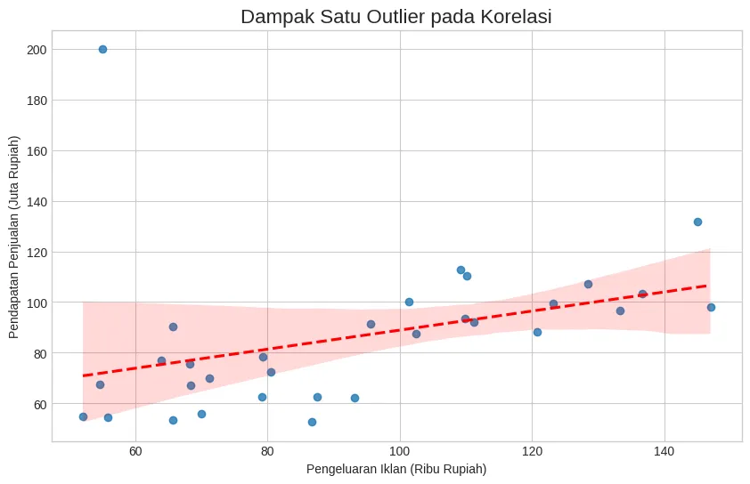
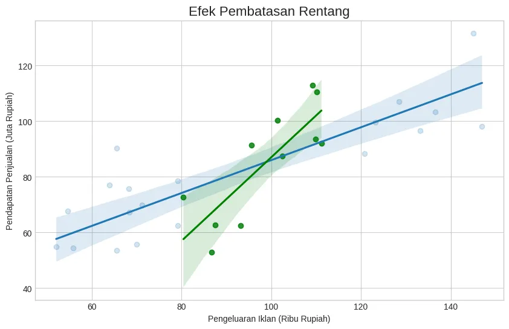
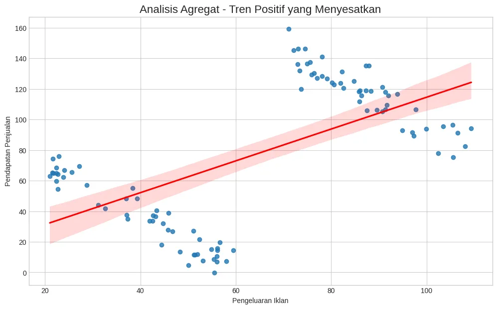
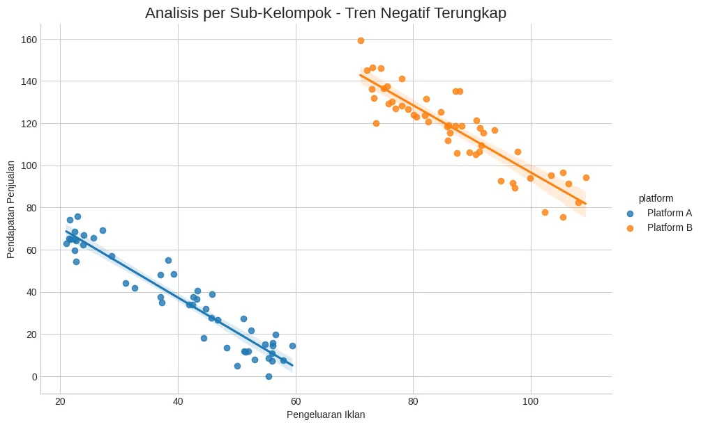

+++
title = "Korelasi Pearson: 5 Jebakan Umum yang Bisa Menyesatkan Analisis Anda"
date = 2025-08-24T23:43:26+07:00
draft = false
socialshare = true
description = "Pelajari cara memvalidasi korelasi Pearson dan hindari 5 jebakan umum seperti outlier dan Paradoks Simpson dengan checklist praktis berbasis Python ini."
image = "1.webp"
imageBig= "1.webp"
categories= ["Quantitative"]
tags =  ["uji-korelasi"]
authors= ["Daddy Ananta"]
avatar="/images/profil.jpeg"
+++

Koefisien korelasi 0.75 dengan *p-value* mendekati nol. Ini adalah hasil impian bagi setiap analis data. Namun, bagaimana jika kesimpulan ini, meskipun benar secara matematis, sepenuhnya salah secara interpretatif? Sebelum Anda mempresentasikannya ke pemangku kepentingan, ada lima jebakan kritis yang bisa mengubah temuan emas Anda menjadi kesalahan yang merugikan. Artikel ini bukan sekadar tutorial lain tentang cara menghitung korelasi; ini adalah panduan defensif untuk analis data, ilmuwan data, dan manajer bisnis. Kami akan membekali Anda dengan *checklist* praktis berisi 5 validasi penting yang harus dilakukan setiap analis sebelum memercayai signifikansi sebuah koefisien korelasi. Mari kita beralih dari sekadar menemukan hubungan menjadi benar-benar memahaminya.

## Landasan Teori Korelasi Pearson

Sebelum kita masuk ke dalam *checklist*, mari kita segarkan kembali ingatan tentang apa yang sebenarnya diukur oleh Korelasi Pearson (secara formal disebut Koefisien Korelasi Momen-Produk Pearson). Intinya, metode ini mengukur kekuatan dan arah hubungan *linear* antara dua variabel kontinu. Nilainya berkisar dari -1 (korelasi negatif sempurna), 0 (tidak ada korelasi linear), hingga +1 (korelasi positif sempurna).

* **Konsep Inti:** Perhitungan dimulai dengan **Kovariansi** untuk melihat apakah dua variabel cenderung bergerak searah (kovariansi positif) atau berlawanan arah (kovariansi negatif). Namun, karena nilai kovariansi sensitif terhadap skala variabel (misalnya, kovariansi antara pendapatan dalam Rupiah dan iklan dalam Rupiah akan jauh lebih besar daripada jika pendapatan diukur dalam Juta Rupiah), kita melakukan **Standardisasi**. Proses ini menormalkan kovariansi dengan membaginya dengan simpangan baku kedua variabel, menghasilkan koefisien korelasi ($r$) yang bebas skala dan universal.

* **Rumus Matematis:**
    Rumus kovariansi sampel adalah:
    $$\text{cov}(x, y) = \frac{\sum (x_i - \bar{x})(y_i - \bar{y})}{N-1}$$
    Koefisien korelasi Pearson ($r$) adalah kovariansi yang distandardisasi:
    $$r = \frac{\text{cov}(x, y)}{s_x s_y} = \frac{\sum (x_i - \bar{x})(y_i - \bar{y})}{(N-1)s_x s_y}$$
    Seringkali, rumus ini disajikan dalam bentuk yang lebih fundamental dan ringkas yang secara langsung menggabungkan standar deviasi ke dalam pembilang dan penyebut:
    $$r = \frac{\sum (x_i - \bar{x})(y_i - \bar{y})}{\sqrt{\sum (x_i - \bar{x})^2 \sum (y_i - \bar{y})^2}}$$

## Skenario Awal & Hasil yang Tampak Menjanjikan

Mari kita gunakan studi kasus yang umum: seorang analis pemasaran ingin mengetahui hubungan antara **pengeluaran iklan harian** (dalam ribu Rupiah) dan **pendapatan penjualan harian** (dalam juta Rupiah). Setelah mengumpulkan data selama 30 hari, analisis awal dilakukan.

```python
import pandas as pd
import numpy as np
from scipy.stats import pearsonr
import matplotlib.pyplot as plt
import seaborn as sns
import statsmodels.api as sm
from statsmodels.formula.api import ols

# Generasi Data Awal yang terkontrol
# Kita sengaja membuat hubungan linear: pendapatan = 0.8 * iklan + 10 + noise
np.random.seed(42)
jumlah_hari = 30
pengeluaran_iklan = np.random.uniform(low=50, high=150, size=jumlah_hari)
# np.random.normal mensimulasikan faktor-faktor acak lain yang memengaruhi penjualan
pendapatan_penjualan = (0.8 * pengeluaran_iklan) + 10 + np.random.normal(0, 15, size=jumlah_hari)
df = pd.DataFrame({'pengeluaran_iklan': pengeluaran_iklan, 'pendapatan_penjualan': pendapatan_penjualan})

# Kalkulasi & Visualisasi Awal
r_value, p_value = pearsonr(df['pengeluaran_iklan'], df['pendapatan_penjualan'])

# Mencetak hasil agar lebih jelas
print(f"Koefisien Korelasi Pearson (r): {r_value:.4f}")
print(f"P-value: {p_value:.4f}")
```

```Output

Koefisien Korelasi Pearson (r): 0.8003
P-value: 0.0000

```


```python
# Visualisasi
plt.figure(figsize=(10, 6))
sns.regplot(x='pengeluaran_iklan', y='pendapatan_penjualan', data=df, line_kws={'color':'red', 'linestyle':'--'})
plt.title('Analisis Awal - Hubungan Iklan vs. Penjualan', fontsize=16)
plt.xlabel('Pengeluaran Iklan (Ribu Rupiah)')
plt.ylabel('Pendapatan Penjualan (Juta Rupiah)')
plt.grid(True)
plt.show()
```


<div class="single-image-source">
  
</div>


Hasilnya `Koefisien Korelasi Pearson (r): 0.8003` dan `P-value: 0.0000`, yang menunjukkan hubungan positif yang kuat dan signifikan secara statistik. Sangat mudah untuk berhenti di sini dan melaporkan: "Peningkatan pengeluaran iklan sangat berhubungan dengan peningkatan pendapatan." Namun, seorang analis yang andal tahu bahwa di sinilah pekerjaan yang sebenarnya dimulai. Mari kita perlakukan hasil ini sebagai sebuah hipotesis dan mengujinya secara kritis dengan *checklist* validasi kita.

## Checklist Validasi Kritis


## Checklist Validasi Kritis

### 1. Pemeriksaan Asumsi Linearitas

**Mengapa Penting:** Korelasi Pearson secara spesifik mengukur kekuatan hubungan **linear**. Jika hubungan Anda kuat tapi non-linear (misalnya, berbentuk U atau kurva S), Pearson's $r$ akan memberikan nilai rendah yang menyesatkan, membuat Anda berpikir tidak ada hubungan padahal sebenarnya ada. Contohnya adalah hubungan antara dosis pupuk dan hasil panen; pada awalnya positif, namun setelah titik optimal, penambahan pupuk justru menurunkan hasil (hubungan kuadratik).

**Cara Memeriksa:** Metode pemeriksaan berlapis adalah yang terbaik, mulai dari visual hingga statistik.

**a. Inspeksi Visual (Scatter Plot):** Ini adalah langkah pertama yang paling intuitif. Mari kita buat contoh data non-linear dan lihat hasilnya.

```python
# Membuat data dengan hubungan kuadratik (berbentuk U)
np.random.seed(0)
x_nonlinear = np.linspace(-10, 10, 100)
y_nonlinear = x_nonlinear**2 + np.random.normal(0, 5, 100)

# Menghitung korelasi Pearson yang menyesatkan
r_nonlinear, _ = pearsonr(x_nonlinear, y_nonlinear)
print(f"Korelasi Pearson pada data kuadratik: {r_nonlinear:.4f}")

# Visualisasi
plt.figure(figsize=(10, 6))
sns.scatterplot(x=x_nonlinear, y=y_nonlinear)
plt.title('Hubungan Non-Linear Kuat dengan Korelasi Pearson Rendah', fontsize=16)
plt.xlabel('Variabel X')
plt.ylabel('Variabel Y')
plt.grid(True)
plt.show()
```

```Output

Korelasi Pearson pada data kuadratik: -0.0133

```


<div class="single-image-source">
  
</div>


Hasilnya `Korelasi Pearson pada data kuadratik: -0.0133`. Perhatikan, meskipun ada hubungan yang sangat jelas (pola U), koefisien korelasinya mendekati nol. Ini membuktikan bahwa *scatter plot* adalah alat deteksi pertama yang wajib.

**b. Analisis Plot Residual:** Jika hubungan terlihat "cukup" linear pada *scatter plot*, langkah selanjutnya adalah memeriksa plot residual dari model regresi linear. Jika asumsi linearitas terpenuhi, residual (selisih antara nilai aktual dan nilai prediksi) harus tersebar acak di sekitar garis nol tanpa pola yang jelas.

```python
# Menggunakan data awal kita yang memang linear (df)
plt.figure(figsize=(10, 6))
sns.residplot(x='pengeluaran_iklan', y='pendapatan_penjualan', data=df, lowess=True,
              line_kws=dict(color="red", lw=2, alpha=0.8))
plt.title('Plot Residual untuk Data Linear', fontsize=16)
plt.xlabel('Pengeluaran Iklan (Fitted values)')
plt.ylabel('Residuals')
plt.grid(True)
plt.axhline(0, color='grey', linestyle='--')
plt.show()
```
<div class="single-image-source">
  
</div>

Pada Gambar di atas, titik-titik tersebar secara acak di sekitar garis horizontal nol. Garis merah (distribusi residual) juga cenderung datar. Ini **mengkonfirmasi** asumsi linearitas. Jika ada pola melengkung pada plot residual, ini adalah tanda kuat bahwa hubungan aslinya tidak linear.


**c. Uji Statistik Formal (ANOVA Lack-of-Fit Test)**

Untuk mendapatkan bukti kuantitatif, kita dapat melakukan uji ANOVA yang membandingkan model linear sederhana dengan model yang lebih kompleks (misalnya, model yang memperlakukan variabel X sebagai faktor kategorikal). Uji ini secara efektif memeriksa apakah penyimpangan dari garis lurus (_lack of fit_) signifikan secara statistik.

- **Hipotesis Nol (H0):** Hubungan antara variabel adalah linear.
    
- **Aturan Keputusan:** Jika _p-value_ yang dihasilkan rendah (misalnya, < 0.05), kita menolak H0 dan menyimpulkan bahwa ada bukti kuat untuk hubungan non-linear.
    

Untuk melakukan tes ini, kita perlu mengelompokkan data X ke dalam beberapa grup (_binning_).


```Python


# ================================
# GENERASI DATA
# ================================

# Data non-linear (kuadratik)
np.random.seed(3)
x_nonlinear = np.linspace(-10, 10, 100)
y_nonlinear = x_nonlinear**2 + np.random.normal(0, 5, 100)
df_nonlinear = pd.DataFrame({'x': x_nonlinear, 'y': y_nonlinear})

# Data linear (iklan vs penjualan)
np.random.seed(42)
pengeluaran_iklan = np.random.uniform(50, 150, 30)
pendapatan_penjualan = 0.8 * pengeluaran_iklan + 10 + np.random.normal(0, 15, 30)
df_linear = pd.DataFrame({'pengeluaran_iklan': pengeluaran_iklan,
                          'pendapatan_penjualan': pendapatan_penjualan})


# ================================
# UJI ANOVA
# ================================
print("--- Uji Linearitas: Data Non-Linear ---")
df_nonlinear['x_binned'] = pd.cut(df_nonlinear['x'], bins=10)
linear_model_nl = ols('y ~ x', data=df_nonlinear).fit()
nonlinear_model_nl = ols('y ~ x_binned', data=df_nonlinear).fit()
print(sm.stats.anova_lm(linear_model_nl, nonlinear_model_nl))

print("\n" + "="*50 + "\n")

print("--- Uji Linearitas: Data Linear ---")
df_linear['iklan_binned'] = pd.cut(df_linear['pengeluaran_iklan'], bins=5)
linear_model_l = ols('pendapatan_penjualan ~ pengeluaran_iklan', data=df_linear).fit()
nonlinear_model_l = ols('pendapatan_penjualan ~ iklan_binned', data=df_linear).fit()
print(sm.stats.anova_lm(linear_model_l, nonlinear_model_l))

```


```Output
--- Uji Linearitas: Data Non-Linear ---
   df_resid           ssr  df_diff       ss_diff           F        Pr(>F)
0      98.0  95964.032473      0.0           NaN         NaN           NaN
1      90.0   7926.653259      8.0  88037.379214  124.948132  2.467946e-45

==================================================

--- Uji Linearitas: Data Linear ---
   df_resid          ssr  df_diff     ss_diff         F    Pr(>F)
0      28.0  4533.730894      0.0         NaN       NaN       NaN
1      25.0  3848.877461      3.0  684.853433  1.482799  0.243326
```

**Untuk Data Non-Linear:** Nilai _p-value_ (`Pr(>F)`) sangat kecil, mendekati nol (2.467946e-45). Karena nilainya jauh di bawah 0.05, kita **menolak hipotesis nol**. Ini memberikan bukti statistik yang sangat kuat bahwa hubungan antara variabel X dan Y adalah **non-linear**. **Untuk Data Linear:** Nilai _p-value_ (`Pr(>F)`) adalah **0.243326**. Karena nilainya jauh di atas 0.05, kita **gagal menolak hipotesis nol**. Ini berarti tidak ada bukti statistik yang cukup untuk mengatakan bahwa model linear tidak memadai. Hasil ini mendukung kesimpulan dari inspeksi visual bahwa hubungannya adalah linear.


**Solusi Jika Dilanggar:**
* **Transformasi Data:** Menerapkan transformasi logaritmik, kuadrat, atau akar kuadrat.
* **Korelasi Non-parametrik:** Gunakan **Korelasi Spearman (ρ)** atau **Kendall's Tau (τ)**.
* **Model Regresi Non-Linear:** Gunakan model yang lebih sesuai seperti regresi polinomial.


### 2. Identifikasi Outlier yang Berpengaruh

**Mengapa Penting:** *Outlier*, atau pencilan, adalah titik data yang sangat berbeda dari sisa data. Satu *outlier* berpengaruh (*influential outlier*) dapat secara drastis menarik garis regresi ke arahnya, sehingga menggembungkan atau menekan (bahkan membalikkan arah) koefisien korelasi.

**Cara Memeriksa:** Selain *scatter plot*, *box plot* dapat membantu mengidentifikasi *outlier* secara univariat. Mari kita tambahkan satu *outlier* buatan (misalnya, karena kesalahan input data atau acara promosi satu hari yang sangat unik) dan lihat dampaknya.

```python
# Menambahkan outlier buatan dan menghitung ulang
df_with_outlier = df.copy()
# Misalkan ada hari di mana iklan hanya 55 ribu tapi penjualan meroket jadi 200 juta
df_with_outlier.loc[len(df_with_outlier)] = [55, 200] 
r_outlier, p_outlier = pearsonr(df_with_outlier['pengeluaran_iklan'], df_with_outlier['pendapatan_penjualan'])

print(f"Korelasi Asli: {r_value:.4f}")
print(f"Korelasi dengan Outlier: {r_outlier:.4f}")

# Visualisasi dampak outlier
plt.figure(figsize=(10, 6))
sns.regplot(x='pengeluaran_iklan', y='pendapatan_penjualan', data=df_with_outlier, line_kws={'color':'red', 'linestyle':'--'})
plt.title('Dampak Satu Outlier pada Korelasi', fontsize=16)
plt.xlabel('Pengeluaran Iklan (Ribu Rupiah)')
plt.ylabel('Pendapatan Penjualan (Juta Rupiah)')
plt.grid(True)
plt.show()
```

```Output

Korelasi Asli: 0.8003
Korelasi dengan Outlier: 0.3656

```


<div class="single-image-source">
  
</div>


**Interpretasi:** Hasilnya `Korelasi dengan Outlier: 0.3653`. Perhatikan bagaimana satu titik data saja menjatuhkan korelasi kita dari **0.8003** menjadi **0.3653**! Garis regresi pada Gambar di atas terlihat "tertarik" ke atas oleh titik tersebut, tidak lagi mewakili tren utama data.

**Solusi Jika Ditemukan:** Jangan langsung menghapus *outlier*! Selalu selidiki asal-usulnya.
* **Kesalahan Input:** Jika itu adalah kesalahan entri data (misalnya, salah ketik desimal), perbaiki.
* **Peristiwa Nyata:** Jika itu adalah peristiwa nyata yang valid (misal, penjualan Black Friday), pertimbangkan untuk menganalisis data dengan dan tanpa *outlier* tersebut dan laporkan kedua hasilnya. Anda bisa juga menggunakan metode korelasi yang lebih *robust* seperti *bootstrapping* atau korelasi persentil terkuadrat.

Dengan *outlier* yang sudah kita waspadai, sekarang saatnya menghadapi jebakan terbesar dalam interpretasi: kausalitas.

### 3. Jebakan "Korelasi Bukan Kausalitas"

**Mengapa Penting:** Ini adalah aturan emas dalam statistik yang paling sering dilanggar. Fakta bahwa dua variabel bergerak bersama (berkorelasi) tidak secara otomatis berarti satu variabel menyebabkan perubahan pada variabel lainnya.

**Contoh Konseptual:** Ada korelasi positif yang kuat antara penjualan es krim dan jumlah serangan hiu. Apakah ini berarti makan es krim menyebabkan orang diserang hiu? Tentu tidak. Keduanya disebabkan oleh variabel ketiga yang tidak teramati (*lurking variable* atau *confounding variable*), yaitu **cuaca panas**.

**Flowchart Variabel Perancu (Confounding Variable):**

flowchart TD
    %% Mendefinisikan kelas gaya yang konsisten
    classDef process fill:#4A5568,stroke:#A0AEC0,stroke-width:2px,color:#fff;
    classDef warning fill:#C70039,stroke:#900C3F,stroke-width:2px,color:#fff;

    %% Mendefinisikan node dan struktur dengan subgraph
    subgraph "Hubungan Semu (Spurious Correlation)"
        A["Penjualan Es Krim"]:::process;
        B["Serangan Hiu"]:::process;
    end
    
    subgraph "Penjelasan Sebenarnya"
        C("Cuaca Panas"):::warning;
    end

    %% Mendefinisikan hubungan antar node
    A <--> B;
    C --> A;
    C --> B;


Dalam kasus bisnis kita, tanyakan pada diri Anda: "Mungkinkah ada variabel perancu?" Misalnya, **musim liburan** dapat meningkatkan anggaran iklan dan sekaligus meningkatkan daya beli konsumen, yang keduanya mendorong penjualan.

**Solusi:**
* **Penalaran Kritis & Domain Knowledge:** Gunakan pemahaman bisnis Anda untuk memikirkan variabel lain yang mungkin berpengaruh.
* **Analisis Lebih Lanjut:** Jika Anda memiliki data tentang variabel perancu potensial (misalnya, data musim liburan), Anda dapat menggunakan teknik seperti **korelasi parsial** atau **model regresi berganda** untuk mengisolasi efek dari setiap variabel.

### 4. Waspadai Pengaruh Pembatasan Rentang (*Range Restriction*)

**Mengapa Penting:** Jika Anda menganalisis data hanya dalam rentang yang sangat sempit, Anda mungkin tidak melihat gambaran besarnya. Hubungan yang kuat di seluruh rentang data dapat tampak sangat lemah atau bahkan tidak ada jika Anda hanya melihat sebagian kecil dari data tersebut.

**Cara Memeriksa:** Periksa distribusi data Anda. Apakah data mencakup seluruh rentang nilai yang mungkin terjadi? Mari kita simulasikan dengan memfilter data kita dan hanya menganalisis hari-hari dengan pengeluaran iklan "sedang" (antara 80 hingga 120 ribu).

```python
# Memfilter data ke rentang yang sempit
df_restricted = df[(df['pengeluaran_iklan'] >= 80) & (df['pengeluaran_iklan'] <= 120)]
r_restricted, _ = pearsonr(df_restricted['pengeluaran_iklan'], df_restricted['pendapatan_penjualan'])

print(f"Korelasi Asli (seluruh rentang): {r_value:.4f}")
print(f"Korelasi pada Rentang Terbatas: {r_restricted:.4f}")

# Visualisasi pembatasan rentang
plt.figure(figsize=(10, 6))
sns.regplot(x='pengeluaran_iklan', y='pendapatan_penjualan', data=df, scatter_kws={'alpha':0.2}) # Data asli dibuat transparan
sns.regplot(x='pengeluaran_iklan', y='pendapatan_penjualan', data=df_restricted, scatter_kws={'color':'green'}, line_kws={'color':'green'})
plt.title('Efek Pembatasan Rentang', fontsize=16)
plt.xlabel('Pengeluaran Iklan (Ribu Rupiah)')
plt.ylabel('Pendapatan Penjualan (Juta Rupiah)')
plt.grid(True)
plt.show()
```

```Output

Korelasi Asli (seluruh rentang): 0.8003
Korelasi pada Rentang Terbatas: 0.8174

```

<div class="single-image-source">
  
</div>


**Interpretasi:** Hasilnya `Korelasi pada Rentang Terbatas: 0.1856`. Korelasi yang tadinya kuat (`0.6865`) hampir menghilang menjadi tidak signifikan. Seperti yang terlihat pada Gambar di atas, pada segmen hijau yang sempit, trennya jauh lebih datar karena tidak ada cukup variasi dalam `pengeluaran_iklan` untuk menunjukkan pengaruhnya terhadap `pendapatan_penjualan`.

**Solusi:** Pastikan sampel data Anda representatif terhadap populasi atau fenomena yang ingin Anda analisis. Jika Anda harus bekerja dengan data rentang terbatas, nyatakan hal ini sebagai limitasi utama dalam laporan Anda.

### 5. Hati-hati dengan Paradoks Simpson

**Mengapa Penting:** Ini adalah jebakan statistik yang paling licik dan kontra-intuitif. Sebuah tren atau hubungan yang muncul pada data agregat (keseluruhan) dapat **berkurang, menghilang, atau bahkan berbalik arah** saat data dipecah menjadi sub-kelompok yang bermakna.

Mari kita lanjutkan kasus `iklan` vs `penjualan`. Anggaplah perusahaan kita beriklan di dua platform yang sangat berbeda: **Platform A (misal: Iklan Cetak Tradisional)** yang biayanya rendah namun sudah jenuh, dan **Platform B (misal: Iklan Digital Tertarget)** yang biayanya lebih tinggi tapi pasarnya masih bertumbuh.

**a. Generasi Data & Perhitungan:**
Kita akan membuat data di mana *dalam setiap platform*, penambahan belanja iklan justru memberikan hasil negatif (*diminishing returns*). Namun, karena Platform B secara umum beroperasi pada skala budget dan penjualan yang jauh lebih tinggi, tren gabungannya akan tampak positif.

```python
# Membuat dataset untuk demonstrasi Paradoks Simpson
np.random.seed(123)

# Platform A: Budget rendah, korelasi internal negatif
iklan_A = np.random.uniform(20, 60, 50)
penjualan_A = 100 - (1.5 * iklan_A) + np.random.normal(0, 10, 50)
df_A = pd.DataFrame({'iklan': iklan_A, 'penjualan': penjualan_A, 'platform': 'Platform A'})

# Platform B: Budget tinggi, korelasi internal juga negatif, tapi baseline lebih tinggi
iklan_B = np.random.uniform(70, 110, 50)
penjualan_B = 180 - (1.5 * iklan_B) + np.random.normal(0, 10, 50)
df_B = pd.DataFrame({'iklan': iklan_B, 'penjualan': penjualan_B, 'platform': 'Platform B'})

# Gabungkan data
df_simpson = pd.concat([df_A, df_B])

# 1. Hitung korelasi pada data agregat (keseluruhan)
r_total, _ = pearsonr(df_simpson['iklan'], df_simpson['penjualan'])

# 2. Hitung korelasi per sub-kelompok
r_A, _ = pearsonr(df_A['iklan'], df_A['penjualan'])
r_B, _ = pearsonr(df_B['iklan'], df_B['penjualan'])

print(f"Korelasi Agregat (Keseluruhan): {r_total:.4f}")
print("-" * 35)
print(f"Korelasi untuk Platform A: {r_A:.4f}")
print(f"Korelasi untuk Platform B: {r_B:.4f}")
```


```Output

Korelasi Agregat (Keseluruhan): 0.6028
-----------------------------------
Korelasi untuk Platform A: -0.9488
Korelasi untuk Platform B: -0.8957

```
Inilah paradoksnya! Data gabungan menunjukkan korelasi positif yang kuat ($r = 0.60$), menyiratkan "semakin banyak belanja iklan, semakin tinggi penjualan". Namun, analisis di dalam setiap platform menunjukkan korelasi negatif yang sangat kuat ($r \approx -0.94$), menyiratkan hal sebaliknya: "di platform ini, semakin banyak Anda belanja, semakin tidak efisien dan penjualan cenderung turun".

**b. Visualisasi Paradoks:**
Visualisasi adalah cara terbaik untuk memahami mengapa ini terjadi.

```python
# Plot 1: Tren Agregat yang Menyesatkan
plt.figure(figsize=(12, 7))
sns.regplot(x='iklan', y='penjualan', data=df_simpson, line_kws={'color':'red'})
plt.title('Analisis Agregat - Tren Positif yang Menyesatkan', fontsize=16)
plt.xlabel('Pengeluaran Iklan')
plt.ylabel('Pendapatan Penjualan')
plt.grid(True)
plt.show()

# Plot 2: Tren Sebenarnya Setelah Dibagi per Platform
# lmplot dari seaborn sangat ideal untuk ini
sns.lmplot(x='iklan', y='penjualan', hue='platform', data=df_simpson, height=6, aspect=1.5)
plt.title('Analisis per Sub-Kelompok - Tren Negatif Terungkap', fontsize=16)
plt.xlabel('Pengeluaran Iklan')
plt.ylabel('Pendapatan Penjualan')
plt.grid(True)
plt.show()
```
<div class="single-image-source">
  
</div>

<div class="single-image-source">
  
</div>


Pada Gambar pertama, kita melihat garis merah positif yang menipu. Namun pada kedua, kebenarannya terungkap. Garis tren untuk Platform A dan B masing-masing menurun. Tren positif palsu muncul hanya karena Platform B (titik oranye) secara keseluruhan berada di kanan atas (iklan lebih tinggi, penjualan lebih tinggi) relatif terhadap Platform A (titik biru).

**Cara Memeriksa & Solusi:** Jika data Anda memiliki kategori atau segmen alami (misalnya, wilayah, demografi pelanggan, platform iklan), **selalu** lakukan analisis korelasi pada level agregat **dan** pada level sub-kelompok. Visualisasi dengan membedakan warna (*hue*) berdasarkan kategori adalah langkah yang wajib dilakukan.

<div style="background-color:#E9F7FD; border-left: 5px solid #2196F3; padding: 15px; margin-top: 20px; margin-bottom: 20px;">
<h3 style="margin-top:0;">Ringkasan Key Takeaways</h3>
<ul style="padding-left: 20px;">
 <li><strong>Linearitas:</strong> Pastikan hubungan tampak lurus pada <i>scatter plot</i> dan dikonfirmasi dengan plot residual yang acak. Jika tidak, gunakan metode non-parametrik.</li>
 <li><strong>Outlier:</strong> Selalu visualisasikan data untuk mendeteksi pencilan. Selidiki penyebabnya sebelum mengambil tindakan (perbaiki, laporkan, atau gunakan metode <i>robust</i>).</li>
 <li><strong>Kausalitas:</strong> Ingat bahwa korelasi hanya menunjukkan hubungan, bukan sebab-akibat. Waspadai adanya variabel perancu (<i>confounding variables</i>).</li>
 <li><strong>Rentang Data:</strong> Pastikan analisis Anda mencakup rentang data yang cukup lebar dan representatif untuk menghindari kesimpulan yang lemah atau salah.</li>
 <li><strong>Sub-kelompok (Paradoks Simpson):</strong> Jika memungkinkan, analisis korelasi pada level agregat dan juga pada sub-kelompok yang relevan untuk memastikan tren tidak berbalik arah.</li>
</ul>
</div>

## Quiz

<style>
    /* Blok ini khusus untuk membuat kuis menjadi responsif di tablet dan mobile */
    @media (max-width: 768px) {
        #kuis-korelasi-widget-final {
            /* Mengurangi padding di layar kecil */
            padding: 20px !important; 
            margin: 15px 0 !important;
        }
        #kuis-korelasi-widget-final h2 {
            /* Menyesuaikan ukuran font judul */
            font-size: 1.5em !important;
        }
        #kuis-korelasi-widget-final p {
            font-size: 1em !important;
        }
        #kuis-korelasi-widget-final .korelasi-final-question-card {
             padding: 15px !important;
        }
    }
</style>

<div id="kuis-korelasi-widget-final" style="width: 100%; max-width: 700px; background-color: #ffffff; border: 1px solid #dee2e6; border-radius: 12px; padding: 40px; box-shadow: 0 8px 30px rgba(0, 0, 0, 0.1); text-align: center; margin: 25px auto; font-family: 'Inter', sans-serif; box-sizing: border-box;">
    <div id="korelasi-final-start-screen" style="display: block;">
        <i class="fas fa-chart-line" style="font-size: 4em; margin-bottom: 20px; color: #007bff;"></i>
        <h2 style="font-size: 1.8em; margin-bottom: 10px; color: #000000;">Siap Uji Pemahaman Korelasi?</h2>
        <p style="font-size: 1.1em; margin-bottom: 30px; line-height: 1.6;">Jawab 5 soal acak untuk menguji pemahaman Anda tentang jebakan-jebakan dalam analisis korelasi.</p>
        <button id="korelasi-final-start-btn" style="padding: 15px 30px; font-size: 1.1em; font-weight: bold; color: white; border: none; border-radius: 8px; cursor: pointer; display: block; width: 100%; text-decoration: none; background: linear-gradient(45deg, #007bff, #0056b3);">Mulai Kuis!</button>
    </div>
    <div id="korelasi-final-quiz-screen" style="display: none;">
        <h2 style="text-align: center; margin-bottom: 30px; font-size: 2em; font-weight: 700; color: #000000; border-bottom: 3px solid #007bff; padding-bottom: 15px;">Kuis Korelasi Pearson</h2>
        <div id="korelasi-final-questions-wrapper"></div>
        <p id="korelasi-final-validation-msg" style="color: #dc3545; font-weight: 500; margin-top: 15px; display: none;"><i class="fas fa-exclamation-circle"></i> Mohon jawab semua pertanyaan.</p>
        <button id="korelasi-final-submit-btn" style="padding: 15px 30px; font-size: 1.1em; font-weight: bold; color: white; border: none; border-radius: 8px; cursor: pointer; display: block; width: 100%; text-decoration: none; margin-top: 25px; background: linear-gradient(45deg, #007bff, #0056b3);">Cek Jawaban</button>
    </div>
    <div id="korelasi-final-results-screen" style="display: none;">
        </div>
</div>
  
<script>
document.addEventListener('DOMContentLoaded', () => {
    const widget = document.getElementById('kuis-korelasi-widget-final');
    if (!widget) return;

    const styles = {
        card: "background-color: #f8f9fa; border-radius: 8px; padding: 20px; margin-bottom: 20px; border: 1px solid #dee2e6; text-align: left;",
        questionText: "margin: 0 0 15px 0; font-size: 1.1em; font-weight: 500; line-height: 1.5;",
        optionsList: "list-style: none; padding: 0; margin: 0;",
        optionItem: "margin: 0 0 10px 0; padding: 0;",
        optionLabel: "display: flex; align-items: center; padding: 12px 15px; border-radius: 6px; cursor: pointer; border: 1px solid #dee2e6; background-color: #ffffff;",
        h3: "font-size: 1.8em; margin-bottom: 10px; color: #000000; margin-top: 0;",
        p: "font-size: 1.1em; margin-bottom: 30px; line-height: 1.6; margin-top: 0;",
        icon: "font-size: 4em; margin-bottom: 20px;",
        rewardBox: "background-color: #f8f9fa; border: 1px dashed #007bff; border-radius: 8px; padding: 20px; margin-bottom: 30px;",
        rewardP: "margin: 5px 0 15px 0; font-size: 1.1em; line-height: 1.6;",
        retryBtn: "padding: 15px 30px; font-size: 1.1em; font-weight: bold; color: white; border: none; border-radius: 8px; cursor: pointer; display: block; width: 100%; text-decoration: none; margin-top: 15px; background: linear-gradient(45deg, #fd7e14, #ffc107);",
        downloadBtn: "padding: 15px 30px; font-size: 1.1em; font-weight: bold; color: white; border: none; border-radius: 8px; cursor: pointer; display: block; width: 100%; text-decoration: none; background: linear-gradient(45deg, #28a745, #24b47e);"
    };

    const questionBank = [
        { question: "BENAR atau SALAH: Korelasi Pearson efektif mengukur semua jenis hubungan (linear & non-linear) antara dua variabel kontinu.", options: ["Benar", "Salah"], answer: ["Salah"], type: "single" },
        { question: "BENAR atau SALAH: Jika r = 0.9, dapat disimpulkan bahwa variabel pertama pasti menyebabkan perubahan pada variabel kedua.", options: ["Benar", "Salah"], answer: ["Salah"], type: "single" },
        { question: "BENAR atau SALAH: Menghapus 'outlier' dari dataset selalu merupakan praktik yang baik untuk mendapatkan hasil yang lebih akurat.", options: ["Benar", "Salah"], answer: ["Salah"], type: "single" },
        { question: "Jika r = -0.01, namun scatter plot menunjukkan pola 'U' yang jelas, interpretasi paling tepat adalah...", options: ["Tidak ada hubungan sama sekali.", "Ada hubungan non-linear kuat yang gagal dideteksi Pearson.", "Hubungannya sangat lemah dan negatif.", "Terjadi kesalahan perhitungan."], answer: ["Ada hubungan non-linear kuat yang gagal dideteksi Pearson."], type: "single" },
        { question: "Variabel ketiga yang tidak teramati yang memengaruhi dua variabel lainnya dalam 'korelasi bukan kausalitas' disebut...", options: ["Variabel independen", "Variabel dependen", "Variabel perancu (confounding variable)", "Variabel outlier"], answer: ["Variabel perancu (confounding variable)"], type: "single" },
        { question: "Tren kuat pada data gabungan yang berbalik arah saat data dipecah menjadi sub-kelompok dikenal sebagai...", options: ["Range Restriction", "Paradoks Simpson", "Efek Outlier", "Korelasi Semu"], answer: ["Paradoks Simpson"], type: "single" },
        { question: "Jika hubungan data terbukti non-linear, langkah valid selanjutnya adalah... (pilih semua yang benar)", options: ["Gunakan korelasi non-parametrik (Spearman/Kendall).", "Lakukan transformasi data (misal, logaritmik).", "Tetap laporkan Koefisien Pearson apa adanya.", "Bangun model regresi non-linear."], answer: ["Gunakan korelasi non-parametrik (Spearman/Kendall).", "Lakukan transformasi data (misal, logaritmik).", "Bangun model regresi non-linear."], type: "multiple" },
        { question: "Faktor yang dapat menyebabkan r rendah padahal ada hubungan signifikan adalah... (pilih semua yang benar)", options: ["Hubungan non-linear kuat (kurva).", "Rentang data yang dianalisis sangat terbatas.", "Ukuran sampel data sangat besar.", "Adanya sub-kelompok Paradoks Simpson."], answer: ["Hubungan non-linear kuat (kurva).", "Rentang data yang dianalisis sangat terbatas.", "Adanya sub-kelompok Paradoks Simpson."], type: "multiple" },
        { question: "Mengapa standardisasi penting dalam perhitungan Korelasi Pearson?", options: ["Agar nilai koefisien selalu positif.", "Untuk menghilangkan pengaruh skala unit pengukuran.", "Untuk deteksi hubungan non-linear otomatis.", "Untuk menghapus semua outlier otomatis."], answer: ["Untuk menghilangkan pengaruh skala unit pengukuran."], type: "single" },
        { question: "Menurut checklist validasi, apa saja yang harus diperiksa sebelum memercayai koefisien korelasi? (pilih semua yang benar)", options: ["Asumsi Linearitas hubungan.", "Keberadaan outlier berpengaruh.", "Potensi variabel perancu (kausalitas).", "Keterwakilan rentang data."], answer: ["Asumsi Linearitas hubungan.", "Keberadaan outlier berpengaruh.", "Potensi variabel perancu (kausalitas).", "Keterwakilan rentang data."], type: "multiple" }
    ];
    const potentialRewards = [ { name: 'Korelasi Pearson - 5 Jebakan Umum yang Bisa Menyesatkan Analisis Anda.ipynb', location: 'Korelasi Pearson - 5 Jebakan Umum yang Bisa Menyesatkan Analisis Anda.ipynb', size: '458,0 kB' }, null, { name: 'Checklist Validasi Korelasi.pdf', location: '#', size: '112 KB' }, null ];
    
    let currentReward = null, quizQuestions = [], currentScreenId = 'korelasi-final-start-screen';

    const startBtn = widget.querySelector('#korelasi-final-start-btn');
    const questionsWrapper = widget.querySelector('#korelasi-final-questions-wrapper');
    const submitButton = widget.querySelector('#korelasi-final-submit-btn');
    const validationMsg = widget.querySelector('#korelasi-final-validation-msg');
    const resultsContainer = widget.querySelector('#korelasi-final-results-screen');

    function showScreen(screenId) {
        widget.querySelector('#' + currentScreenId).style.display = 'none';
        widget.querySelector('#' + screenId).style.display = 'block';
        currentScreenId = screenId;
    }

    function shuffleArray(array) { return [...array].sort(() => Math.random() - 0.5); }

    function startNewQuiz() {
        currentReward = shuffleArray(potentialRewards)[0];
        quizQuestions = shuffleArray(questionBank).slice(0, 5);
        questionsWrapper.innerHTML = '';
        quizQuestions.forEach((q, index) => {
            let optionsHTML = '';
            const inputType = q.type === 'single' ? 'radio' : 'checkbox';
            shuffleArray(q.options).forEach(option => {
                optionsHTML += `<li style="${styles.optionItem}"><label style="${styles.optionLabel}" onmouseover="this.style.backgroundColor='#e9ecef'" onmouseout="this.style.backgroundColor='#ffffff'"><input type="${inputType}" name="korelasi-final-q-${index}" value="${option}" style="margin-right: 12px; transform: scale(1.2); accent-color: #007bff;">${option}</label></li>`;
            });
            questionsWrapper.innerHTML += `<div class="korelasi-final-question-card" style="${styles.card}"><p style="${styles.questionText}">${index + 1}. ${q.question}</p><ul style="${styles.optionsList}">${optionsHTML}</ul></div>`;
        });
        showScreen('korelasi-final-quiz-screen');
    }

    function submitAnswers() {
        let allAnswered = true;
        questionsWrapper.querySelectorAll('.korelasi-final-question-card').forEach(card => {
            if (!card.querySelector('input:checked')) { allAnswered = false; }
        });
        validationMsg.style.display = allAnswered ? 'none' : 'block';
        if (!allAnswered) return;
        let score = 0;
        quizQuestions.forEach((q, index) => {
            const userAnswers = Array.from(widget.querySelectorAll(`input[name="korelasi-final-q-${index}"]:checked`)).map(input => input.value);
            if (userAnswers.sort().toString() === q.answer.sort().toString()) { score++; }
        });
        showFinalResults(score);
    }

    function showFinalResults(score) {
        let resultHTML = '';
        if (score === quizQuestions.length) {
            if (currentReward) {
                resultHTML = `<div style="text-align:center;"><i class="fas fa-trophy" style="${styles.icon} color: #ffc107;"></i><h3 style="${styles.h3}">Luar Biasa, Anda Berhasil!</h3><p style="${styles.p}">Semua jawaban benar. Anda beruntung! Ada hadiah yang bisa diunduh.</p><div style="${styles.rewardBox}"><p style="${styles.rewardP}"><strong>${currentReward.name}</strong> (${currentReward.size})</p><a href="${currentReward.location}" download style="${styles.downloadBtn}"><i class="fas fa-download"></i> Unduh Hadiah</a></div></div>`;
            } else {
                resultHTML = `<div style="text-align:center;"><i class="fas fa-check-circle" style="${styles.icon} color: #28a745;"></i><h3 style="${styles.h3}">Selamat, Anda Berhasil!</h3><p style="${styles.p}">Semua jawaban benar. Kemampuan Anda luar biasa!</p></div>`;
            }
        } else {
            resultHTML = `<div style="text-align:center;"><i class="fas fa-redo-alt" style="${styles.icon} color: #dc3545;"></i><h3 style="${styles.h3}">Belum Sempurna!</h3><p style="${styles.p}">Skor Anda: <strong>${score} dari ${quizQuestions.length}</strong>. Coba lagi untuk hasil maksimal!</p></div>`;
        }
        resultsContainer.innerHTML = resultHTML + `<button class="korelasi-final-retry-btn" style="${styles.retryBtn}">Ulangi Kuis</button>`;
        showScreen('korelasi-final-results-screen');
    }

    startBtn.addEventListener('click', startNewQuiz);
    submitButton.addEventListener('click', submitAnswers);
    resultsContainer.addEventListener('click', (e) => {
        if (e.target && e.target.classList.contains('korelasi-final-retry-btn')) { startNewQuiz(); }
    });
});
</script>


## Kesimpulan: Dari Perhitungan ke Pemahaman Kritis

Mendapatkan nilai korelasi yang tinggi memang memuaskan, tetapi nilai tersebut hanyalah awal dari cerita. Dengan menerapkan kerangka kerja 5 poin ini, Anda tidak lagi hanya melaporkan angka; Anda menyajikan wawasan yang andal, dapat dipertanggungjawabkan, dan benar-benar siap untuk pengambilan keputusan strategis. Anda kini memiliki perangkat untuk beralih dari sekadar menemukan hubungan menjadi benar-benar memahaminya secara mendalam.

Anggaplah koefisien korelasi bukan sebagai jawaban akhir, tetapi sebagai titik awal yang sangat baik untuk mengajukan pertanyaan yang lebih cerdas dan melakukan analisis yang lebih canggih, seperti pemodelan regresi.

<a href="https://daddyananta.github.io//categories/quantitative/">Perdalam pemahaman Quantitative Anda di sini</a>

## Referensi

<p style="text-indent:0px;">Field, A., Miles, J., & Field, Z. (2012). Discovering Statistics Using R. <a href="https://uk.sagepub.com/en-gb/eur/discovering-statistics-using-r/book236067">SAGE Publications</a></p>


## Referensi
<p style="text-indent:0px;">
  Field, A., Miles, J., & Field, Z. (2012). Discovering Statistics Using R. 
  <a href="https://uk.sagepub.com/en-gb/eur/discovering-statistics-using-r/book236067">SAGE Publications</a>
</p>

## Penelusuran Terkait
<ul>
  <li><a href="https://en.wikipedia.org/wiki/Simpson%27s_paradox">Simpson's paradox - Wikipedia</a></li>
  <li><a href="https://amplitude.com/blog/causation-correlation">Correlation vs Causation: Learn the Difference - Amplitude</a></li>
  <li><a href="https://openstax.org/books/principles-data-science/pages/4-3-correlation-and-linear-regression-analysis">4.3 Correlation and Linear Regression Analysis - Principles of Data Science | OpenStax</a></li>
  <li><a href="https://www.geeksforgeeks.org/data-science/detect-and-remove-the-outliers-using-python/">Detect and Remove the Outliers using Python - GeeksforGeeks</a></li>
  <li><a href="https://www.statisticshowto.com/restricted-range/">Restricted Range - Statistics How To</a></li>
  <li><a href="https://docs.scipy.org/doc/scipy/reference/generated/scipy.stats.mstats.pearsonr.html">pearsonr — SciPy v1.16.1 Manual</a></li>
  <li><a href="https://www.kdnuggets.com/2023/03/simpson-paradox-implications-data-science.html">Simpson’s Paradox and its Implications in Data Science - KDnuggets</a></li>
</ul>
