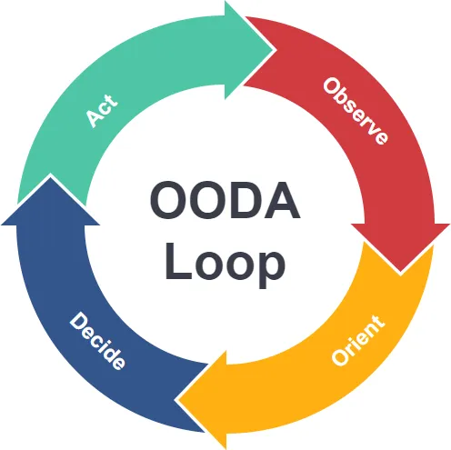

+++
title= "Validasi Desain dengan Uji-T: Jurus Jitu UX Researcher Melawan 'Kebetulan'"
date = 2025-06-24T00:37:00+00:00
draft = false
socialshare = true
description = ""
image = "1.webp"
imageBig= "1.webp"
categories= [ "Quantitative" ] 
tags= [ "Uji-T", "UX Research", "Statistik", "Validasi Desain", "Data Miring" ]
authors= ["Daddy Ananta"]
avatar="/images/profil.jpeg"
+++

<div style="background-color:#f9f9f9; border: 1px solid #d3d3d3; padding: 15px; font-family: Arial, sans-serif;margin-bottom: 20px;">
  <p style="font-style: italic;">"In God we trust. All others must bring data."</p>
  <p style="text-align: right; font-size: 0.9em; margin-top: 10px; color: #555;">- W. Edwards Deming, <span style="font-weight: bold;">Filsafat Manajemen Kualitas</span></p>
</div>

Pernyataan dari W. Edwards Deming ini adalah mantra bagi para UX Researcher. Di dunia riset pengguna, setiap keputusan desain harus dapat dipertanggungjawabkan, tidak hanya berdasarkan estetika, tetapi juga bukti data yang kuat. Namun, bagaimana kita bisa yakin bahwa skor kepuasan yang lebih tinggi atau waktu tugas yang lebih cepat setelah perbaikan desain adalah kemajuan nyata, dan bukan sekadar anomali acak? Di sinilah pengujian statistik menjadi jembatan antara opini dan bukti.

Mari kita gunakan analogi sederhana. Bayangkan Anda adalah seorang koki kepala yang baru saja memperbaiki resep sup andalan. Resep lama memiliki standar rasa asin pada level "50". Anda memasak satu panci besar sup dengan resep baru dan ingin tahu apakah rasanya benar-benar lebih pas. Anda tidak bisa hanya mencicipi satu sendok; bisa saja sendokan itu kebetulan lebih atau kurang asin. Sebaliknya, Anda mengambil beberapa sendok dari berbagai bagian panci (sampel Anda), menilai rata-rata tingkat keasinannya, dan mempertimbangkan seberapa bervariasi rasa di antara sendokan tersebut. Uji-t satu sampel adalah metode statistik yang Anda gunakan untuk memutuskan: Apakah rata-rata rasa asin dari resep baru ini secara signifikan berbeda dari standar "50", atau perbedaan yang Anda rasakan hanya karena variasi acak?

## Kerangka OODA Loop Memetakan Jalan dari Data ke Keputusan

<div class="single-image-source">
  
 <p class="image-caption"> OODA Loops from James O'Leary in<a href="https://medium.com/@james_footium/ooda-loops-and-decision-making-6bdedd1f2431"> Medium</a></p>
</div>

Untuk menerapkan proses ini secara sistematis dalam UX, kita bisa meminjam kerangka kerja strategis dari dunia militer: OODA Loop (Observe, Orient, Decide, Act) yang dikembangkan oleh Kolonel John Boyd. Kerangka ini sangat relevan untuk siklus pengembangan produk yang iteratif.

* **Observe (Observasi):** Ini adalah tahap pengumpulan data. Anda menjalankan tes kegunaan (usability test) pada desain baru dan mengumpulkan metrik kontinu, seperti skor Single Ease Question (SEQ) atau waktu yang dihabiskan pengguna untuk menyelesaikan proses onboarding.

* **Orient (Orientasi):** Ini adalah fase paling kritis dan di mana statistik berperan. Anda tidak hanya melihat rata-rata data. Anda harus mengorientasikan diri dengan data tersebut: Bagaimana bentuk distribusinya? Apakah simetris seperti kurva lonceng, atau miring (skewed)? Di sinilah banyak tim tersandung. Mengabaikan bentuk data sama dengan salah membaca peta. Di fase inilah kita menggunakan alat seperti uji-t untuk memahami signifikansi dari apa yang kita amati.

* **Decide (Keputusan):** Berdasarkan orientasi yang akurat, Anda membuat keputusan. Apakah data secara statistik mendukung hipotesis bahwa desain baru lebih baik dari benchmark yang ditetapkan (misalnya, skor SEQ rata-rata harus di atas 6.0)?

* **Act (Tindakan):** Keputusan ini mengarahkan tindakan selanjutnya. Jika terbukti lebih baik, desain tersebut bisa diluncurkan. Jika tidak, Anda kembali ke papan gambar, dengan wawasan baru untuk iterasi berikutnya.

Kegagalan pada tahap "Orientasi" akan merusak seluruh siklus, mengarah pada keputusan yang salah dan tindakan yang sia-sia.


## Alat Utama Uji-T Satu Sampel untuk Metrik Simetris

Untuk metrik yang datanya cenderung terdistribusi normal (simetris), seperti skor dari skala rating (misalnya, SEQ, skala kepuasan 1–7), uji-t satu sampel adalah alat yang tepat. Ia secara matematis menimbang “sinyal” (perbedaan antara rata-rata sampel Anda dan benchmark) terhadap “gangguan” (variabilitas data dan ukuran sampel).

Rumus yang digunakan adalah:


$$ t = \frac{\bar{x} - \mu}{s / \sqrt{n}} $$


Di mana:
- $\bar{x}$ adalah rata-rata skor dari sampel pengguna Anda.
- $\mu$ adalah skor benchmark yang ingin Anda lampaui.
- $s$ adalah standar deviasi dari sampel Anda.
- $n$ adalah jumlah pengguna dalam sampel Anda.

Nilai $t$ yang tinggi menunjukkan sinyal Anda kuat; perbedaan itu kemungkinan nyata. Nilai $t$ yang rendah menunjukkan sinyal Anda lemah dan bisa jadi hanya kebetulan.

## Perangkap Data Miring Bahaya Tersembunyi dalam Metrik Waktu

<div style="background-color:#f9f9f9; border: 1px solid #d3d3d3; padding: 15px; font-family: Arial, sans-serif;margin-bottom: 20px;">
  <p style="font-style: italic;">"The greatest value of a picture is when it forces us to notice what we never expected to see."</p>
  <p style="text-align: right; font-size: 0.9em; margin-top: 10px; color: #555;">- John Tukey, <span style="font-weight: bold;">Exploratory Data Analysis</span></p>
</div>

Sekarang, mari kita bahas sebuah jebakan umum dalam analisis UX: data waktu. Metrik seperti waktu penyelesaian tugas (time-on-task) atau durasi sesi hampir tidak pernah simetris. Data ini hampir selalu miring ke kanan (positively skewed). Artinya, sebagian besar pengguna menyelesaikan tugas dengan cepat, tetapi ada beberapa pengguna yang membutuhkan waktu sangat lama, menciptakan "ekor" panjang di sisi kanan grafik distribusi.

Jika Anda menggunakan uji-t standar pada data mentah yang miring ini, hasilnya akan tidak valid dan menyesatkan. Rata-rata aritmatika akan ditarik ke atas oleh nilai-nilai ekstrem tersebut, tidak lagi mewakili pengalaman pengguna pada umumnya. Seperti yang diperingatkan oleh ahli statistik legendaris John Tukey, "The combination of some data and an aching desire for an answer does not ensure that a reasonable answer can be extracted from a given body of data." Kita harus menghormati sifat data kita.

Solusinya adalah transformasi logaritmik. Dengan menerapkan fungsi logaritma natural ($ln$) pada setiap titik data waktu, kita "menekan" ekor panjang tersebut dan membuat distribusinya menjadi lebih simetris. Setelah data ditransformasi, barulah kita bisa melakukan uji-t satu sampel dengan valid.

## Contoh Kasus

### Jebakan "Rata-Rata Waktu di Situs"

Sebuah perusahaan e-commerce meluncurkan desain halaman produk baru. Tim memantau metrik dan melihat bahwa "rata-rata waktu di halaman" meningkat 30 detik. Manajemen merayakan ini sebagai kemenangan, berasumsi pengguna lebih *engaged*. Namun, penjualan dari halaman tersebut justru menurun. Setelah diselidiki lebih dalam oleh seorang analis data yang cermat, ditemukan bahwa metrik waktu tersebut sangat miring. Sebagian besar pengguna justru keluar lebih cepat karena kebingungan dengan tata letak baru, sementara segelintir kecil pengguna tersesat dan menghabiskan waktu sangat lama untuk mencari tombol "beli", yang secara artifisial menaikkan rata-rata. Median waktu di halaman—ukuran yang lebih baik untuk data miring—sebenarnya telah turun secara signifikan. Keputusan awal yang didasarkan pada rata-rata yang salah telah menutupi masalah kegunaan yang serius. <a href="https://mixpanel.com/blog/guide-to-modern-marketing-analytics/">Baca lebih lanjut</a>

### Validasi Desain Pencarian di Microsoft Windows

<div class="single-image-source">
  
  
  <p class="image-caption"> Windows Vista in<a href="https://jv.wikipedia.org/wiki/Windows_Vista"> Wikipedia</a></p>
</div>

Pada pengembangan Windows Vista, tim desain Microsoft dihadapkan pada masalah: pengguna kesulitan menemukan program dan file. Desain lamanya tidak memiliki target kinerja yang jelas. Tim kemudian membuat hipotesis bahwa kotak pencarian yang lebih menonjol di Start Menu akan meningkatkan keberhasilan dan kecepatan pencarian. Mereka menetapkan benchmark internal untuk tingkat keberhasilan. 

<div class="youtube-container">
    <iframe src="https://www.youtube.com/embed/tR847eIONnc?si=hZYDPDgGYplhFgFq" 
            title="YouTube video player" frameborder="0" allowfullscreen>
    </iframe>
</div>

Melalui serangkaian tes kegunaan yang terkontrol dan analisis statistik yang cermat terhadap metrik kinerja (termasuk waktu), mereka memvalidasi bahwa desain baru dengan teks "Type here to search" secara signifikan melampaui benchmark. Ini bukan lagi opini; ini adalah fakta yang didukung data. Keputusan ini terbukti sangat sukses dan menjadi standar di versi Windows berikutnya. <a href="https://www.trustedreviews.com/reviews/microsoft-windows-vista?">Baca lebih lanjut</a>

<div style="background-color:#f9f9f9; border: 1px solid #d3d3d3; padding: 15px; font-family: Arial, sans-serif;margin-bottom: 20px;">
  <p style="font-style: italic;">"The combination of some data and an aching desire for an answer does not ensure that a reasonable answer can be extracted from a given body of data."</p>
  <p style="text-align: right; font-size: 0.9em; margin-top: 10px; color: #555;">- John Tukey, <span style="font-weight: bold;">Exploratory Data Analysis</span></p>
</div>

## Contoh Soal dan Penerapannya

<div class="single-image-source">
  
  <p class="image-caption">Image from Imagen 3</a></p>
</div>

**Skenario:**
Tim UX di sebuah aplikasi fintech baru saja merombak alur pendaftaran pengguna. Tujuan bisnis (Key Performance Indicator) adalah waktu penyelesaian pendaftaran harus di bawah 120 detik. Tim menguji desain baru dengan 15 pengguna dan mencatat waktu penyelesaian (dalam detik) sebagai berikut:

85, 110, 75, 92, 135, 280, 68, 99, 105, 115, 88, 95, 210, 78, 140

Apakah tim dapat 95% yakin bahwa waktu pendaftaran median sebenarnya di bawah target 120 detik?

**Langkah-langkah Pengerjaan:**

1.  **Identifikasi Masalah:** Data waktu hampir pasti miring ke kanan. Kita lihat ada beberapa nilai yang sangat tinggi (280, 210) dibandingkan sebagian besar nilai lainnya. Menggunakan uji-t pada data mentah ini akan tidak valid.

2.  **Transformasi Data:** Kita harus melakukan transformasi logaritmik ($ln$) pada setiap titik data dan pada benchmark.
    - **Benchmark**: $ln(120) \approx 4.787$
    - **Data Waktu (detik)**: 85, 110, 75, 92, 135, 280, 68, 99, 105, 115, 88, 95, 210, 78, 140
    - **Data Log-Transformed**: 4.44, 4.70, 4.32, 4.52, 4.91, 5.63, 4.22, 4.60, 4.65, 4.74, 4.48, 4.55, 5.35, 4.36, 4.94

3.  **Hitung Statistik pada Data Log:**
    - **Ukuran Sampel ($n$)**: 15
    - **Rata-rata dari nilai log ($\bar{x}_{ln}$)**: 4.694
    - **Standar Deviasi dari nilai log ($s_{ln}$)**: 0.418

4.  **Lakukan Uji-T Satu Sampel pada Data Log:**
    Kita ingin menguji apakah waktu kita lebih rendah dari benchmark.

    
    $$ t = \frac{\bar{x}_{ln} - ln(\mu)}{s_{ln} / \sqrt{n}} $$


    Substitusi nilai:
    

    $$ t = \frac{4.694 - 4.787}{0.418 / \sqrt{15}} = \frac{-0.093}{0.418 / 3.873} = \frac{-0.093}{0.108} \approx -0.861 $$


5.  **Interpretasi Hasil:**
    - **Nilai t**: -0.861
    - **Derajat Kebebasan ($df$)**: $n-1 = 15-1=14$
    - **Nilai p ($p$-value)**: Menggunakan kalkulator statistik untuk uji satu sisi, kita mendapatkan $p$-value sekitar 0.20.

**Kesimpulan (Hasil Uji):**
$p$-value sebesar 0.20 (atau 20%) jauh lebih besar dari tingkat signifikansi standar $\alpha=0.05$ (yang setara dengan keyakinan 95%). Ini berarti ada peluang 20% untuk mendapatkan hasil seperti ini bahkan jika desain baru tidak benar-benar lebih baik dari benchmark. Oleh karena itu, kita **tidak memiliki bukti statistik yang cukup kuat** untuk mengklaim dengan keyakinan 95% bahwa desain baru memenuhi target waktu di bawah 120 detik. Tim perlu melakukan iterasi lebih lanjut pada desain atau mengumpulkan lebih banyak data.

---

```python
import numpy as np
from scipy import stats

# --- Variabel yang Perlu Diisi ---
data_waktu = [85, 110, 75, 92, 135, 280, 68, 99, 105, 115, 88, 95, 210, 78, 140]
benchmark_waktu = 120
alpha = 0.05

# --- Fungsi Perhitungan Statistik ---

def uji_t_log_transformasi(data, benchmark, signifikansi):
    """Melakukan Uji-T satu sampel pada data yang di-log-transformasi."""
    
    # 1. Transformasi data dan benchmark ke skala logaritmik
    log_data = np.log(data)
    log_benchmark = np.log(benchmark)
    
    # 2. Hitung statistik deskriptif pada data log
    n = len(log_data)
    mean_log = np.mean(log_data)
    std_log = np.std(log_data, ddof=1) # ddof=1 untuk standar deviasi sampel
    
    # 3. Lakukan Uji-T satu sampel (one-sample t-test)
    # H_a: mean_log < log_benchmark (uji satu sisi, 'less')
    t_statistic, p_value_two_sided = stats.ttest_1samp(log_data, log_benchmark)
    
    # Karena H_a adalah 'kurang dari' (less than), kita butuh p-value satu sisi
    # Jika t < 0, p-value satu sisi = p-value dua sisi / 2
    p_value_one_sided = p_value_two_sided / 2 if t_statistic < 0 else 1 - (p_value_two_sided / 2)

    # Menampilkan hasil
    print("--- Hasil Analisis Uji-T pada Data Log ---")
    print(f"Ukuran Sampel (n): {n}")
    print(f"Benchmark Log-Transformed (ln({benchmark})): {log_benchmark:.3f}")
    print(f"Rata-rata Log-Transformed (x̄_ln): {mean_log:.3f}")
    print(f"Standar Deviasi Log-Transformed (s_ln): {std_log:.3f}")
    print("-" * 45)
    print(f"Nilai t-statistik: {t_statistic:.3f}")
    print(f"Derajat Kebebasan (df): {n-1}")
    print(f"P-value (satu sisi): {p_value_one_sided:.2f}")
    print("-" * 45)

    # 4. Ambil keputusan dengan kesimpulan yang lebih universal
    if p_value_one_sided < signifikansi:
        print(f"Keputusan: Hipotesis Nol Ditolak (p-value < {signifikansi}).")
        print("Kesimpulan: Ada bukti statistik yang cukup untuk menyatakan nilai median populasi di bawah benchmark.")
    else:
        print(f"Keputusan: Gagal Menolak Hipotesis Nol (p-value >= {signifikansi}).")
        print("Kesimpulan: Tidak cukup bukti statistik untuk mengklaim nilai median populasi di bawah benchmark.")
        
# --- Menjalankan Analisis ---
uji_t_log_transformasi(data_waktu, benchmark_waktu, alpha)

```

```Output
--- Hasil Analisis Uji-T pada Data Log ---
Ukuran Sampel (n): 15
Benchmark Log-Transformed (ln(120)): 4.787
Rata-rata Log-Transformed (x̄_ln): 4.694
Standar Deviasi Log-Transformed (s_ln): 0.418
---------------------------------------------
Nilai t-statistik: -0.861
Derajat Kebebasan (df): 14
P-value (satu sisi): 0.20
---------------------------------------------
Keputusan: Gagal Menolak Hipotesis Nol (p-value >= 0.05).
Kesimpulan: Tidak cukup bukti statistik untuk mengklaim nilai median populasi di bawah benchmark.
```
---

### Kesimpulan
Membandingkan metrik dengan benchmark adalah tugas inti seorang UX Researcher. Namun, nilai sesungguhnya bukan terletak pada kemampuan menghitung rata-rata, melainkan pada keahlian untuk menentukan apakah rata-rata itu bermakna secara statistik. Dengan memahami kapan dan bagaimana menggunakan uji-t satu sampel, serta yang terpenting, mengenali dan memperbaiki data yang miring melalui transformasi logaritmik, kita beralih dari sekadar pengumpul data menjadi penafsir kebenaran yang andal. Membingkai proses ini dalam siklus OODA memastikan bahwa setiap observasi diorientasikan dengan benar, mengarah pada keputusan yang cerdas dan tindakan yang benar-benar meningkatkan pengalaman pengguna.

Temukan lebih banyak artikel mendalam tentang metodologi penelitian di kategori <a href="http://localhost:1313/categories/quantitative/">Quantitative</a>.


### Referensi
<p style="text-indent:0px;">NationSquid (2020). Why Windows Vista Sucked | What Went Wrong <a href="https://youtu.be/Xjq0kljBZnY?si=lmfg80ByIYK2TcUU">YouTube</a></p>
<p style="text-indent:0px;">Tukey, J. W. (1977). Exploratory Data Analysis. <a href="https://books.google.co.id/books/about/Exploratory_Data_Analysis.html?id=UT9dAAAAIAAJ&redir_esc=y">Google Books</a></p>

---

### Penelusuran Terkait

<ul>
<li><a href="https://www.ibm.com/think/insights/in-god-we-trust-all-others-must-bring-data">“In God we trust. All others must bring data.” – IBM Think Insights</a></li>
<li><a href="https://www.uxtweak.com/usability-testing/metrics/">Usability Testing Metrics | UXtweak</a></li>
<li><a href="https://maze.co/blog/measure-usability-metrics/">7 Key Usability Metrics to Unlock User Insights – Maze</a></li>
<li><a href="https://www.nngroup.com/articles/usability-metrics/">Usability Metrics – NN/g</a></li>
<li><a href="https://www.nngroup.com/articles/success-rate-the-simplest-usability-metric/">Success Rate: The Simplest Usability Metric – NN/g</a></li>
<li><a href="https://dscout.com/people-nerds/11-usability-testing-metrics">11 Usability Testing Metrics to Enrich Your Reporting – Dscout</a></li>
<li><a href="https://medium.com/@kulwantsaluja/in-god-we-trust-all-others-must-bring-data-a-deep-dive-into-demings-philosophy-4b52a0a86dd9">“In God We Trust. All Others Must Bring Data.” — A Deep Dive into Deming’s Philosophy – Medium</a></li>
<li><a href="https://exomindset.co/in-god-we-trust-all-others-must-bring-data/">“In God we trust, all others must bring data” – Exomindset</a></li>
<li><a href="https://www.uxmatters.com/mt/archives/2015/06/confessions-of-a-designer.php">Confessions of a Designer (mengutip Deming) – UXmatters</a></li>
<li><a href="https://industryforum.co.uk/in-god-we-trust-all-others-must-bring-data/">“In God we trust, all others must bring data.” – Industry Forum</a></li>
<li><a href="https://inform.nu/Articles/Vol10/DblHelix063-096.pdf">Apply OODA Loop dalam Design – PDF Inform.nu (membahas OODA)</a></li>
</ul>